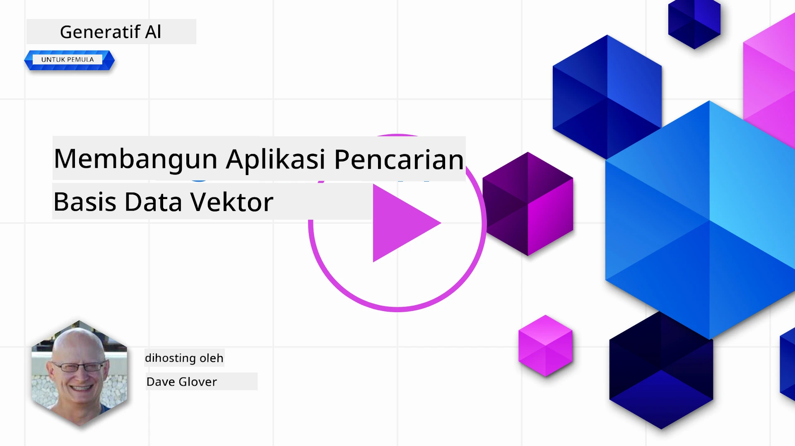
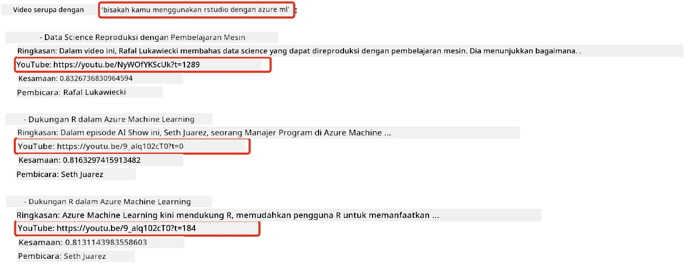
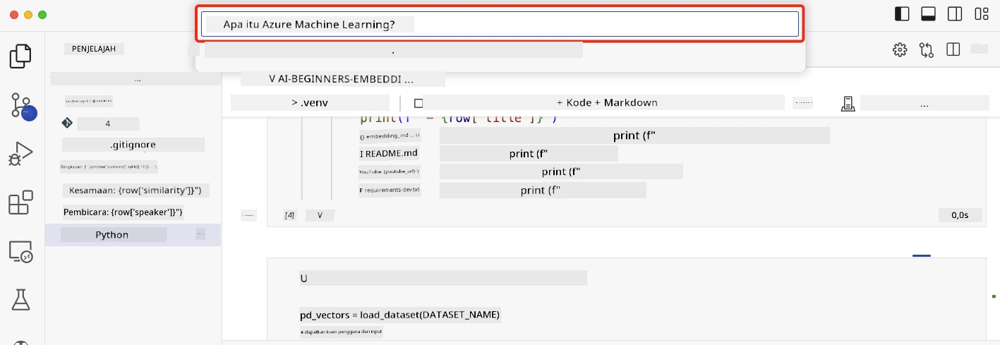

# Membangun Aplikasi Pencarian

[](https://youtu.be/W0-nzXjOjr0?si=GcsqiTTvd7RKbo7V)

> > _Klik gambar di atas untuk menonton video pelajaran ini_

Ada lebih dari LLM dibandingkan chatbot dan generasi teks. Anda juga dapat membangun aplikasi pencarian menggunakan Embeddings. Embeddings adalah representasi numerik dari data yang juga dikenal sebagai vektor, dan dapat digunakan untuk pencarian semantik untuk data.

Dalam pelajaran ini, Anda akan membangun aplikasi pencarian untuk startup pendidikan kami. Startup kami adalah organisasi nirlaba yang menyediakan pendidikan gratis bagi siswa di negara berkembang. Startup kami memiliki sejumlah besar video YouTube yang dapat digunakan siswa untuk mempelajari AI. Startup kami ingin membangun aplikasi pencarian yang memungkinkan siswa mencari video YouTube dengan mengetikkan sebuah pertanyaan.

Misalnya, seorang siswa mungkin mengetik 'Apa itu Jupyter Notebooks?' atau 'Apa itu Azure ML' dan aplikasi pencarian akan mengembalikan daftar video YouTube yang relevan dengan pertanyaan tersebut, dan lebih bagus lagi, aplikasi pencarian akan mengembalikan tautan ke bagian dalam video di mana jawaban atas pertanyaan tersebut berada.

## Pengenalan

Dalam pelajaran ini, kita akan membahas:

- Pencarian Semantik vs Kata Kunci.
- Apa itu Text Embeddings.
- Membuat Indeks Text Embeddings.
- Mencari di Indeks Text Embeddings.

## Tujuan Pembelajaran

Setelah menyelesaikan pelajaran ini, Anda akan dapat:

- Menjelaskan perbedaan antara pencarian semantik dan kata kunci.
- Menjelaskan apa itu Text Embeddings.
- Membuat aplikasi menggunakan Embeddings untuk mencari data.

## Mengapa membangun aplikasi pencarian?

Membangun aplikasi pencarian akan membantu Anda memahami cara menggunakan Embeddings untuk mencari data. Anda juga akan belajar cara membangun aplikasi pencarian yang dapat digunakan oleh siswa untuk menemukan informasi dengan cepat.

Pelajaran ini menyertakan Indeks Embedding dari transkrip YouTube untuk saluran YouTube Microsoft [AI Show](https://www.youtube.com/playlist?list=PLlrxD0HtieHi0mwteKBOfEeOYf0LJU4O1). AI Show adalah saluran YouTube yang mengajarkan Anda tentang AI dan pembelajaran mesin. Indeks Embedding berisi Embeddings untuk setiap transkrip YouTube hingga Oktober 2023. Anda akan menggunakan Indeks Embedding ini untuk membangun aplikasi pencarian untuk startup kami. Aplikasi pencarian mengembalikan tautan ke bagian dalam video di mana jawaban atas pertanyaan berada. Ini adalah cara yang bagus bagi siswa untuk menemukan informasi yang mereka butuhkan dengan cepat.

Berikut adalah contoh kueri semantik untuk pertanyaan 'bisakah Anda menggunakan rstudio dengan azure ml?'. Lihat URL YouTube, Anda akan melihat URL tersebut mengandung cap waktu yang membawa Anda ke bagian dalam video di mana jawaban pertanyaan tersebut berada.



## Apa itu pencarian semantik?

Sekarang Anda mungkin bertanya-tanya, apa itu pencarian semantik? Pencarian semantik adalah teknik pencarian yang menggunakan semantik, atau makna, kata-kata dalam sebuah kueri untuk mengembalikan hasil yang relevan.

Berikut adalah contoh pencarian semantik. Misalkan Anda ingin membeli mobil, Anda mungkin mencari 'mobil impian saya', pencarian semantik memahami bahwa Anda tidak sedang `bermimpi` tentang mobil, tetapi Anda sedang mencari mobil `ideal` Anda. Pencarian semantik memahami niat Anda dan mengembalikan hasil yang relevan. Alternatifnya adalah `pencarian kata kunci` yang secara harfiah mencari mimpi tentang mobil dan sering mengembalikan hasil yang tidak relevan.

## Apa itu Text Embeddings?

[Text embeddings](https://en.wikipedia.org/wiki/Word_embedding?WT.mc_id=academic-105485-koreyst) adalah teknik representasi teks yang digunakan dalam [pemrosesan bahasa alami](https://en.wikipedia.org/wiki/Natural_language_processing?WT.mc_id=academic-105485-koreyst). Text embeddings adalah representasi numerik semantik dari teks. Embeddings digunakan untuk merepresentasikan data dengan cara yang mudah dipahami oleh mesin. Ada banyak model untuk membangun text embeddings, dalam pelajaran ini, kita akan fokus pada pembuatan embeddings menggunakan Model Embedding OpenAI.

Berikut adalah contoh, bayangkan teks berikut ada dalam transkrip dari salah satu episode saluran AI Show di YouTube:

```text
Today we are going to learn about Azure Machine Learning.
```

Kami akan mengirimkan teks tersebut ke API Embedding OpenAI dan API tersebut akan mengembalikan embedding berikut yang terdiri dari 1536 angka alias sebuah vektor. Setiap angka dalam vektor mewakili aspek berbeda dari teks tersebut. Untuk ringkasan, berikut adalah 10 angka pertama dalam vektor tersebut.

```python
[-0.006655829958617687, 0.0026128944009542465, 0.008792596869170666, -0.02446001023054123, -0.008540431968867779, 0.022071078419685364, -0.010703742504119873, 0.003311325330287218, -0.011632772162556648, -0.02187200076878071, ...]
```

## Bagaimana Indeks Embedding dibuat?

Indeks Embedding untuk pelajaran ini dibuat dengan serangkaian skrip Python. Anda akan menemukan skrip tersebut beserta instruksinya di [README](./scripts/README.md?WT.mc_id=academic-105485-koreyst) di folder 'scripts' untuk pelajaran ini. Anda tidak perlu menjalankan skrip ini untuk menyelesaikan pelajaran karena Indeks Embedding sudah disediakan untuk Anda.

Skrip-skrip tersebut melakukan operasi berikut:

1. Transkrip untuk setiap video YouTube dalam playlist [AI Show](https://www.youtube.com/playlist?list=PLlrxD0HtieHi0mwteKBOfEeOYf0LJU4O1) diunduh.
2. Menggunakan [Fungsi OpenAI](https://learn.microsoft.com/azure/ai-foundry/openai/how-to/function-calling?WT.mc_id=academic-105485-koreyst), dilakukan percobaan untuk mengekstrak nama pembicara dari 3 menit pertama transkrip YouTube. Nama pembicara untuk setiap video disimpan dalam Indeks Embedding bernama `embedding_index_3m.json`.
3. Teks transkrip kemudian dibagi menjadi **segmen teks berdurasi 3 menit**. Segmen ini mencakup sekitar 20 kata yang tumpang tindih dari segmen berikutnya untuk memastikan Embedding untuk segmen tidak terputus dan memberikan konteks pencarian yang lebih baik.
4. Setiap segmen teks kemudian dikirimkan ke OpenAI Chat API untuk merangkum teks menjadi 60 kata. Ringkasan ini juga disimpan dalam Indeks Embedding `embedding_index_3m.json`.
5. Akhirnya, teks segmen dikirimkan ke OpenAI Embedding API. API Embedding mengembalikan vektor dari 1536 angka yang merepresentasikan makna semantik dari segmen tersebut. Segmen beserta vektor Embedding OpenAI disimpan dalam Indeks Embedding `embedding_index_3m.json`.

### Database Vektor

Untuk kesederhanaan pelajaran, Indeks Embedding disimpan dalam file JSON bernama `embedding_index_3m.json` dan dimuat ke dalam DataFrame Pandas. Namun, dalam produksi, Indeks Embedding akan disimpan dalam database vektor seperti [Azure Cognitive Search](https://learn.microsoft.com/training/modules/improve-search-results-vector-search?WT.mc_id=academic-105485-koreyst), [Redis](https://cookbook.openai.com/examples/vector_databases/redis/readme?WT.mc_id=academic-105485-koreyst), [Pinecone](https://cookbook.openai.com/examples/vector_databases/pinecone/readme?WT.mc_id=academic-105485-koreyst), [Weaviate](https://cookbook.openai.com/examples/vector_databases/weaviate/readme?WT.mc_id=academic-105485-koreyst), untuk beberapa contoh.

## Memahami kesamaan kosinus

Kita telah belajar tentang text embeddings, langkah selanjutnya adalah belajar bagaimana menggunakan text embeddings untuk mencari data dan khususnya menemukan embeddings yang paling mirip dengan kueri tertentu menggunakan kesamaan kosinus.

### Apa itu kesamaan kosinus?

Kesamaan kosinus adalah ukuran kesamaan antara dua vektor, Anda juga akan mendengar ini disebut sebagai `pencarian tetangga terdekat`. Untuk melakukan pencarian kesamaan kosinus, Anda perlu _membuat vektor_ untuk teks _kueri_ menggunakan API Embedding OpenAI. Kemudian menghitung _kesamaan kosinus_ antara vektor kueri dan setiap vektor dalam Indeks Embedding. Ingat, Indeks Embedding memiliki vektor untuk setiap segmen teks transkrip YouTube. Akhirnya, urutkan hasil berdasarkan kesamaan kosinus dan segmen teks dengan kesamaan kosinus tertinggi adalah yang paling mirip dengan kueri.

Dari perspektif matematis, kesamaan kosinus mengukur kosinus dari sudut antara dua vektor yang diproyeksikan dalam ruang multidimensi. Pengukuran ini berguna, karena jika dua dokumen terpisah jauh oleh jarak Euclidean karena ukuran, mereka masih bisa memiliki sudut yang lebih kecil di antara keduanya dan oleh karena itu kesamaan kosinus yang lebih tinggi. Untuk informasi lebih lanjut tentang persamaan kesamaan kosinus, lihat [Kesamaan Kosinus](https://en.wikipedia.org/wiki/Cosine_similarity?WT.mc_id=academic-105485-koreyst).

## Membangun aplikasi pencarian pertama Anda

Selanjutnya, kita akan belajar cara membangun aplikasi pencarian menggunakan Embeddings. Aplikasi pencarian ini akan memungkinkan siswa untuk mencari video dengan mengetik pertanyaan. Aplikasi pencarian akan mengembalikan daftar video yang relevan dengan pertanyaan tersebut. Aplikasi pencarian juga akan mengembalikan tautan ke bagian dalam video di mana jawaban atas pertanyaan berada.

Solusi ini dibangun dan diuji pada Windows 11, macOS, dan Ubuntu 22.04 menggunakan Python 3.10 atau versi lebih baru. Anda dapat mengunduh Python dari [python.org](https://www.python.org/downloads/?WT.mc_id=academic-105485-koreyst).

## Tugas - membangun aplikasi pencarian, untuk mendukung siswa

Kami memperkenalkan startup kami di awal pelajaran ini. Sekarang saatnya untuk memberdayakan siswa membangun aplikasi pencarian untuk penilaian mereka.

Dalam tugas ini, Anda akan membuat Layanan Azure OpenAI yang akan digunakan untuk membangun aplikasi pencarian. Anda akan membuat layanan Azure OpenAI berikut. Anda akan memerlukan langganan Azure untuk menyelesaikan tugas ini.

### Mulai Azure Cloud Shell

1. Masuk ke [portal Azure](https://portal.azure.com/?WT.mc_id=academic-105485-koreyst).
2. Pilih ikon Cloud Shell di pojok kanan atas portal Azure.
3. Pilih **Bash** untuk jenis lingkungan.

#### Buat grup sumber daya

> Untuk instruksi ini, kami menggunakan grup sumber daya bernama "semantic-video-search" di East US.
> Anda dapat mengubah nama grup sumber daya, namun saat mengubah lokasi sumber daya,
> periksa [tabel ketersediaan model](https://aka.ms/oai/models?WT.mc_id=academic-105485-koreyst).

```shell
az group create --name semantic-video-search --location eastus
```

#### Buat sumber daya Layanan Azure OpenAI

Dari Azure Cloud Shell, jalankan perintah berikut untuk membuat sumber daya Layanan Azure OpenAI.

```shell
az cognitiveservices account create --name semantic-video-openai --resource-group semantic-video-search \
    --location eastus --kind OpenAI --sku s0
```

#### Dapatkan endpoint dan kunci untuk digunakan dalam aplikasi ini

Dari Azure Cloud Shell, jalankan perintah berikut untuk mendapatkan endpoint dan kunci untuk sumber daya Layanan Azure OpenAI.

```shell
az cognitiveservices account show --name semantic-video-openai \
   --resource-group  semantic-video-search | jq -r .properties.endpoint
az cognitiveservices account keys list --name semantic-video-openai \
   --resource-group semantic-video-search | jq -r .key1
```

#### Terapkan model Embedding OpenAI

Dari Azure Cloud Shell, jalankan perintah berikut untuk menerapkan model Embedding OpenAI.

```shell
az cognitiveservices account deployment create \
    --name semantic-video-openai \
    --resource-group  semantic-video-search \
    --deployment-name text-embedding-ada-002 \
    --model-name text-embedding-ada-002 \
    --model-version "2"  \
    --model-format OpenAI \
    --sku-capacity 100 --sku-name "Standard"
```

## Solusi

Buka [notebook solusi](./python/aoai-solution.ipynb?WT.mc_id=academic-105485-koreyst) di GitHub Codespaces dan ikuti instruksi di Jupyter Notebook.

Saat menjalankan notebook, Anda akan diminta memasukkan kueri. Kotak input akan terlihat seperti ini:



## Kerja Hebat! Lanjutkan Pembelajaran Anda

Setelah menyelesaikan pelajaran ini, lihat [koleksi Pembelajaran AI Generatif kami](https://aka.ms/genai-collection?WT.mc_id=academic-105485-koreyst) untuk terus meningkatkan pengetahuan AI Generatif Anda!

Lanjut ke Pelajaran 9 di mana kita akan membahas cara [membangun aplikasi generasi gambar](../09-building-image-applications/README.md?WT.mc_id=academic-105485-koreyst)!

---

<!-- CO-OP TRANSLATOR DISCLAIMER START -->
**Penafian**:
Dokumen ini telah diterjemahkan menggunakan layanan terjemahan AI [Co-op Translator](https://github.com/Azure/co-op-translator). Meskipun kami berupaya untuk mencapai akurasi, harap diketahui bahwa terjemahan otomatis mungkin mengandung kesalahan atau ketidakakuratan. Dokumen asli dalam bahasa aslinya harus dianggap sebagai sumber yang sah. Untuk informasi penting, disarankan menggunakan terjemahan profesional oleh manusia. Kami tidak bertanggung jawab atas kesalahpahaman atau penafsiran yang keliru yang timbul dari penggunaan terjemahan ini.
<!-- CO-OP TRANSLATOR DISCLAIMER END -->