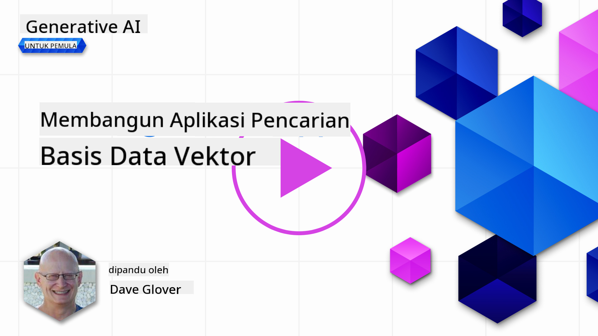
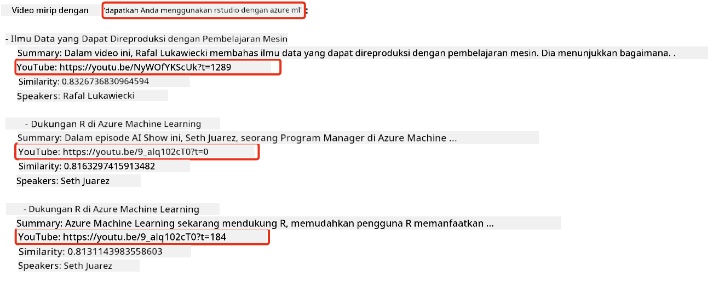
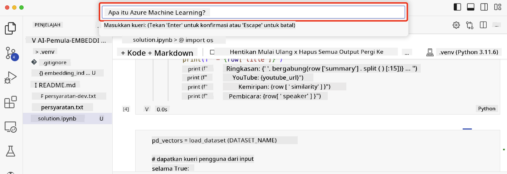

<!--
CO_OP_TRANSLATOR_METADATA:
{
  "original_hash": "d46aad0917a1a342d613e2c13d457da5",
  "translation_date": "2025-06-25T16:36:36+00:00",
  "source_file": "08-building-search-applications/README.md",
  "language_code": "id"
}
-->
# Membangun Aplikasi Pencarian

[](https://aka.ms/gen-ai-lesson8-gh?WT.mc_id=academic-105485-koreyst)

> > _Klik gambar di atas untuk menonton video pelajaran ini_

Ada lebih banyak hal tentang LLM daripada chatbot dan pembuatan teks. Kita juga bisa membangun aplikasi pencarian menggunakan Embeddings. Embeddings adalah representasi numerik dari data yang juga dikenal sebagai vektor, dan dapat digunakan untuk pencarian semantik data.

Dalam pelajaran ini, Anda akan membangun aplikasi pencarian untuk startup pendidikan kami. Startup kami adalah organisasi nirlaba yang menyediakan pendidikan gratis kepada siswa di negara berkembang. Startup kami memiliki banyak video YouTube yang dapat digunakan siswa untuk belajar tentang AI. Startup kami ingin membangun aplikasi pencarian yang memungkinkan siswa mencari video YouTube dengan mengetikkan sebuah pertanyaan.

Sebagai contoh, seorang siswa mungkin mengetik 'Apa itu Jupyter Notebooks?' atau 'Apa itu Azure ML' dan aplikasi pencarian akan mengembalikan daftar video YouTube yang relevan dengan pertanyaan tersebut, dan yang lebih baik lagi, aplikasi pencarian akan mengembalikan tautan ke tempat dalam video di mana jawaban dari pertanyaan tersebut berada.

## Pengantar

Dalam pelajaran ini, kita akan membahas:

- Pencarian Semantik vs Kata Kunci.
- Apa itu Text Embeddings.
- Membuat Indeks Text Embeddings.
- Mencari dalam Indeks Text Embeddings.

## Tujuan Pembelajaran

Setelah menyelesaikan pelajaran ini, Anda akan dapat:

- Membedakan antara pencarian semantik dan kata kunci.
- Menjelaskan apa itu Text Embeddings.
- Membuat aplikasi menggunakan Embeddings untuk mencari data.

## Mengapa membangun aplikasi pencarian?

Membuat aplikasi pencarian akan membantu Anda memahami cara menggunakan Embeddings untuk mencari data. Anda juga akan belajar cara membangun aplikasi pencarian yang dapat digunakan oleh siswa untuk menemukan informasi dengan cepat.

Pelajaran ini mencakup Indeks Embedding dari transkrip YouTube untuk saluran YouTube Microsoft [AI Show](https://www.youtube.com/playlist?list=PLlrxD0HtieHi0mwteKBOfEeOYf0LJU4O1). AI Show adalah saluran YouTube yang mengajarkan Anda tentang AI dan pembelajaran mesin. Indeks Embedding berisi Embeddings untuk masing-masing transkrip YouTube hingga Okt 2023. Anda akan menggunakan Indeks Embedding untuk membangun aplikasi pencarian untuk startup kami. Aplikasi pencarian mengembalikan tautan ke tempat dalam video di mana jawaban dari pertanyaan tersebut berada. Ini adalah cara yang bagus bagi siswa untuk menemukan informasi yang mereka butuhkan dengan cepat.

Berikut adalah contoh kueri semantik untuk pertanyaan 'dapatkah Anda menggunakan rstudio dengan azure ml?'. Lihat url YouTube, Anda akan melihat url tersebut berisi timestamp yang membawa Anda ke tempat dalam video di mana jawaban dari pertanyaan tersebut berada.



## Apa itu pencarian semantik?

Sekarang Anda mungkin bertanya-tanya, apa itu pencarian semantik? Pencarian semantik adalah teknik pencarian yang menggunakan semantik, atau makna, dari kata-kata dalam kueri untuk mengembalikan hasil yang relevan.

Berikut adalah contoh pencarian semantik. Misalnya Anda ingin membeli mobil, Anda mungkin mencari 'mobil impian saya', pencarian semantik memahami bahwa Anda tidak `dreaming` tentang mobil, tetapi Anda ingin membeli mobil `ideal` Anda. Pencarian semantik memahami niat Anda dan mengembalikan hasil yang relevan. Alternatifnya adalah `keyword search` yang secara harfiah akan mencari mimpi tentang mobil dan sering mengembalikan hasil yang tidak relevan.

## Apa itu Text Embeddings?

[Text embeddings](https://en.wikipedia.org/wiki/Word_embedding?WT.mc_id=academic-105485-koreyst) adalah teknik representasi teks yang digunakan dalam [pemrosesan bahasa alami](https://en.wikipedia.org/wiki/Natural_language_processing?WT.mc_id=academic-105485-koreyst). Text embeddings adalah representasi numerik semantik dari teks. Embeddings digunakan untuk merepresentasikan data dengan cara yang mudah dipahami oleh mesin. Ada banyak model untuk membangun text embeddings, dalam pelajaran ini, kita akan fokus pada pembuatan embeddings menggunakan OpenAI Embedding Model.

Berikut adalah contohnya, bayangkan teks berikut adalah transkrip dari salah satu episode di saluran YouTube AI Show:

```text
Today we are going to learn about Azure Machine Learning.
```

Kami akan mengirimkan teks tersebut ke OpenAI Embedding API dan akan mengembalikan embedding yang terdiri dari 1536 angka alias vektor. Setiap angka dalam vektor mewakili aspek yang berbeda dari teks. Untuk ringkasnya, berikut adalah 10 angka pertama dalam vektor.

```python
[-0.006655829958617687, 0.0026128944009542465, 0.008792596869170666, -0.02446001023054123, -0.008540431968867779, 0.022071078419685364, -0.010703742504119873, 0.003311325330287218, -0.011632772162556648, -0.02187200076878071, ...]
```

## Bagaimana Indeks Embedding dibuat?

Indeks Embedding untuk pelajaran ini dibuat dengan serangkaian skrip Python. Anda akan menemukan skrip tersebut beserta instruksinya di [README](./scripts/README.md?WT.mc_id=academic-105485-koreyst) di folder 'scripts' untuk pelajaran ini. Anda tidak perlu menjalankan skrip ini untuk menyelesaikan pelajaran ini karena Indeks Embedding telah disediakan untuk Anda.

Skrip tersebut melakukan operasi berikut:

1. Transkrip untuk setiap video YouTube dalam playlist [AI Show](https://www.youtube.com/playlist?list=PLlrxD0HtieHi0mwteKBOfEeOYf0LJU4O1) diunduh.
2. Menggunakan [Fungsi OpenAI](https://learn.microsoft.com/azure/ai-services/openai/how-to/function-calling?WT.mc_id=academic-105485-koreyst), dilakukan upaya untuk mengekstrak nama pembicara dari 3 menit pertama transkrip YouTube. Nama pembicara untuk setiap video disimpan dalam Indeks Embedding yang dinamakan `embedding_index_3m.json`.
3. Teks transkrip kemudian dibagi menjadi **segmen teks 3 menit**. Segmen tersebut mencakup sekitar 20 kata yang tumpang tindih dari segmen berikutnya untuk memastikan bahwa Embedding untuk segmen tidak terpotong dan untuk memberikan konteks pencarian yang lebih baik.
4. Setiap segmen teks kemudian dikirimkan ke OpenAI Chat API untuk meringkas teks menjadi 60 kata. Ringkasan ini juga disimpan dalam Indeks Embedding `embedding_index_3m.json`.
5. Akhirnya, teks segmen dikirimkan ke OpenAI Embedding API. Embedding API mengembalikan vektor 1536 angka yang mewakili makna semantik dari segmen tersebut. Segmen bersama dengan vektor OpenAI Embedding disimpan dalam Indeks Embedding `embedding_index_3m.json`.

### Basis Data Vektor

Untuk kesederhanaan pelajaran, Indeks Embedding disimpan dalam file JSON bernama `embedding_index_3m.json` dan dimuat ke dalam Pandas DataFrame. Namun, dalam produksi, Indeks Embedding akan disimpan dalam basis data vektor seperti [Azure Cognitive Search](https://learn.microsoft.com/training/modules/improve-search-results-vector-search?WT.mc_id=academic-105485-koreyst), [Redis](https://cookbook.openai.com/examples/vector_databases/redis/readme?WT.mc_id=academic-105485-koreyst), [Pinecone](https://cookbook.openai.com/examples/vector_databases/pinecone/readme?WT.mc_id=academic-105485-koreyst), [Weaviate](https://cookbook.openai.com/examples/vector_databases/weaviate/readme?WT.mc_id=academic-105485-koreyst), untuk menyebutkan beberapa.

## Memahami kesamaan kosinus

Kita telah mempelajari tentang text embeddings, langkah selanjutnya adalah mempelajari cara menggunakan text embeddings untuk mencari data dan khususnya menemukan embeddings yang paling mirip dengan kueri tertentu menggunakan kesamaan kosinus.

### Apa itu kesamaan kosinus?

Kesamaan kosinus adalah ukuran kesamaan antara dua vektor, Anda juga akan mendengar ini disebut sebagai `nearest neighbor search`. Untuk melakukan pencarian kesamaan kosinus, Anda perlu _memvektorisasi_ untuk teks _kueri_ menggunakan OpenAI Embedding API. Kemudian hitung _kesamaan kosinus_ antara vektor kueri dan setiap vektor dalam Indeks Embedding. Ingat, Indeks Embedding memiliki vektor untuk setiap segmen teks transkrip YouTube. Akhirnya, urutkan hasil berdasarkan kesamaan kosinus dan segmen teks dengan kesamaan kosinus tertinggi adalah yang paling mirip dengan kueri.

Dari perspektif matematika, kesamaan kosinus mengukur kosinus sudut antara dua vektor yang diproyeksikan dalam ruang multidimensi. Pengukuran ini bermanfaat, karena jika dua dokumen berjauhan dengan jarak Euclidean karena ukurannya, mereka masih bisa memiliki sudut yang lebih kecil di antara mereka dan oleh karena itu kesamaan kosinus yang lebih tinggi. Untuk informasi lebih lanjut tentang persamaan kesamaan kosinus, lihat [Kesamaan kosinus](https://en.wikipedia.org/wiki/Cosine_similarity?WT.mc_id=academic-105485-koreyst).

## Membangun aplikasi pencarian pertama Anda

Selanjutnya, kita akan belajar cara membangun aplikasi pencarian menggunakan Embeddings. Aplikasi pencarian akan memungkinkan siswa mencari video dengan mengetikkan pertanyaan. Aplikasi pencarian akan mengembalikan daftar video yang relevan dengan pertanyaan tersebut. Aplikasi pencarian juga akan mengembalikan tautan ke tempat dalam video di mana jawaban dari pertanyaan tersebut berada.

Solusi ini dibangun dan diuji pada Windows 11, macOS, dan Ubuntu 22.04 menggunakan Python 3.10 atau yang lebih baru. Anda dapat mengunduh Python dari [python.org](https://www.python.org/downloads/?WT.mc_id=academic-105485-koreyst).

## Tugas - membangun aplikasi pencarian, untuk memungkinkan siswa

Kami memperkenalkan startup kami di awal pelajaran ini. Sekarang saatnya untuk memungkinkan siswa membangun aplikasi pencarian untuk penilaian mereka.

Dalam tugas ini, Anda akan membuat Azure OpenAI Services yang akan digunakan untuk membangun aplikasi pencarian. Anda akan membuat Azure OpenAI Services berikut. Anda memerlukan langganan Azure untuk menyelesaikan tugas ini.

### Mulai Azure Cloud Shell

1. Masuk ke [Azure portal](https://portal.azure.com/?WT.mc_id=academic-105485-koreyst).
2. Pilih ikon Cloud Shell di sudut kanan atas portal Azure.
3. Pilih **Bash** untuk jenis lingkungan.

#### Buat grup sumber daya

> Untuk instruksi ini, kami menggunakan grup sumber daya bernama "semantic-video-search" di East US.
> Anda dapat mengubah nama grup sumber daya, tetapi saat mengubah lokasi untuk sumber daya,
> periksa [tabel ketersediaan model](https://aka.ms/oai/models?WT.mc_id=academic-105485-koreyst).

```shell
az group create --name semantic-video-search --location eastus
```

#### Buat sumber daya Azure OpenAI Service

Dari Azure Cloud Shell, jalankan perintah berikut untuk membuat sumber daya Azure OpenAI Service.

```shell
az cognitiveservices account create --name semantic-video-openai --resource-group semantic-video-search \
    --location eastus --kind OpenAI --sku s0
```

#### Dapatkan endpoint dan kunci untuk penggunaan dalam aplikasi ini

Dari Azure Cloud Shell, jalankan perintah berikut untuk mendapatkan endpoint dan kunci untuk sumber daya Azure OpenAI Service.

```shell
az cognitiveservices account show --name semantic-video-openai \
   --resource-group  semantic-video-search | jq -r .properties.endpoint
az cognitiveservices account keys list --name semantic-video-openai \
   --resource-group semantic-video-search | jq -r .key1
```

#### Terapkan model OpenAI Embedding

Dari Azure Cloud Shell, jalankan perintah berikut untuk menerapkan model OpenAI Embedding.

```shell
az cognitiveservices account deployment create \
    --name semantic-video-openai \
    --resource-group  semantic-video-search \
    --deployment-name text-embedding-ada-002 \
    --model-name text-embedding-ada-002 \
    --model-version "2"  \
    --model-format OpenAI \
    --sku-capacity 100 --sku-name "Standard"
```

## Solusi

Buka [notebook solusi](../../../08-building-search-applications/python/aoai-solution.ipynb) di GitHub Codespaces dan ikuti instruksi di Jupyter Notebook.

Saat Anda menjalankan notebook, Anda akan diminta untuk memasukkan kueri. Kotak input akan terlihat seperti ini:



## Kerja Bagus! Lanjutkan Pembelajaran Anda

Setelah menyelesaikan pelajaran ini, lihat [koleksi Pembelajaran AI Generatif](https://aka.ms/genai-collection?WT.mc_id=academic-105485-koreyst) kami untuk terus meningkatkan pengetahuan AI Generatif Anda!

Lanjutkan ke Pelajaran 9 di mana kita akan melihat cara [membangun aplikasi pembuatan gambar](../09-building-image-applications/README.md?WT.mc_id=academic-105485-koreyst)!

**Penafian**:  
Dokumen ini telah diterjemahkan menggunakan layanan terjemahan AI [Co-op Translator](https://github.com/Azure/co-op-translator). Meskipun kami berupaya untuk mencapai akurasi, harap diketahui bahwa terjemahan otomatis mungkin mengandung kesalahan atau ketidakakuratan. Dokumen asli dalam bahasa aslinya harus dianggap sebagai sumber yang berwenang. Untuk informasi penting, disarankan menggunakan terjemahan manusia profesional. Kami tidak bertanggung jawab atas kesalahpahaman atau penafsiran yang salah yang timbul dari penggunaan terjemahan ini.