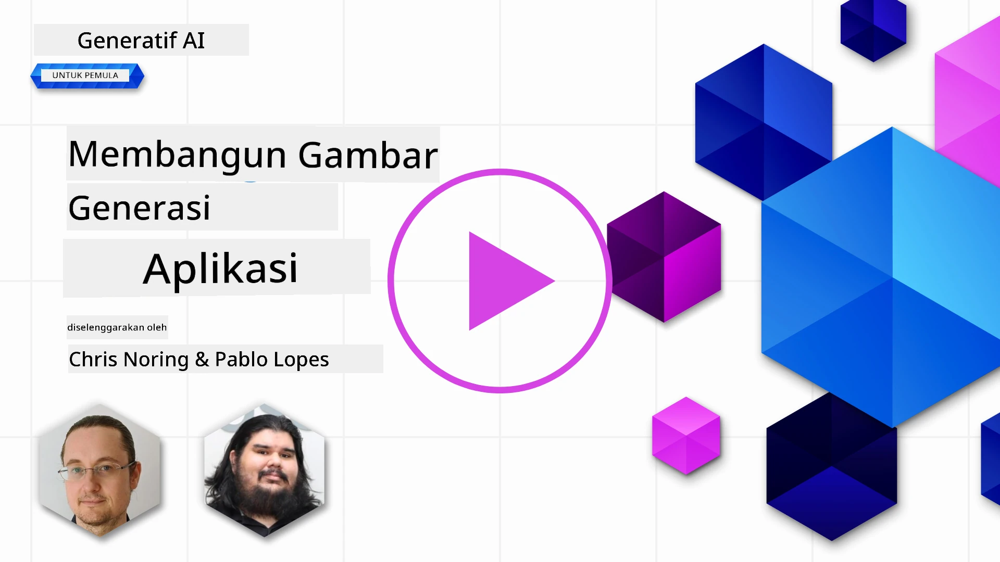

# Membangun Aplikasi Generasi Gambar

[](https://youtu.be/B5VP0_J7cs8?si=5P3L5o7F_uS_QcG9)

Ada lebih dari sekadar generasi teks dalam LLM. Juga memungkinkan menghasilkan gambar dari deskripsi teks. Memiliki gambar sebagai modalitas bisa sangat berguna dalam sejumlah bidang mulai dari MedTech, arsitektur, pariwisata, pengembangan game, dan lainnya. Dalam bab ini, kita akan melihat dua model generasi gambar paling populer, DALL-E dan Midjourney.

## Pendahuluan

Dalam pelajaran ini, kita akan membahas:

- Generasi gambar dan mengapa itu berguna.
- DALL-E dan Midjourney, apa mereka, dan bagaimana cara kerjanya.
- Cara membangun aplikasi generasi gambar.

## Tujuan Pembelajaran

Setelah menyelesaikan pelajaran ini, Anda akan dapat:

- Membangun aplikasi generasi gambar.
- Menentukan batasan untuk aplikasi Anda dengan meta prompt.
- Bekerja dengan DALL-E dan Midjourney.

## Mengapa membangun aplikasi generasi gambar?

Aplikasi generasi gambar adalah cara yang bagus untuk mengeksplorasi kemampuan Generative AI. Mereka dapat digunakan, misalnya:

- **Sunting dan sintesis gambar**. Anda dapat menghasilkan gambar untuk berbagai kasus penggunaan, seperti penyuntingan gambar dan sintesis gambar.

- **Diterapkan pada berbagai industri**. Mereka juga dapat digunakan untuk menghasilkan gambar untuk berbagai industri seperti Medtech, Pariwisata, Pengembangan Game, dan lainnya.

## Skenario: Edu4All

Sebagai bagian dari pelajaran ini, kita akan melanjutkan bekerja dengan startup kita, Edu4All, dalam pelajaran ini. Para siswa akan membuat gambar untuk penilaian mereka, gambar apa yang dihasilkan terserah siswa, bisa menjadi ilustrasi untuk dongeng mereka sendiri atau membuat karakter baru untuk cerita mereka atau membantu mereka memvisualisasikan ide dan konsep mereka.

Berikut contoh apa yang bisa dihasilkan oleh siswa Edu4All jika mereka bekerja di kelas tentang monumen:


menggunakan prompt seperti

> "Anjing di samping Menara Eiffel di bawah sinar matahari pagi yang cerah"

## Apa itu DALL-E dan Midjourney?

[DALL-E](https://openai.com/dall-e-2?WT.mc_id=academic-105485-koreyst) dan [Midjourney](https://www.midjourney.com/?WT.mc_id=academic-105485-koreyst) adalah dua model generasi gambar paling populer, mereka memungkinkan Anda menggunakan prompt untuk menghasilkan gambar.

### DALL-E

Mari mulai dengan DALL-E, yang merupakan model Generative AI yang menghasilkan gambar dari deskripsi teks.

> [DALL-E adalah gabungan dari dua model, CLIP dan diffused attention](https://towardsdatascience.com/openais-dall-e-and-clip-101-a-brief-introduction-3a4367280d4e?WT.mc_id=academic-105485-koreyst).

- **CLIP**, adalah model yang menghasilkan embedding, yang merupakan representasi numerik dari data, dari gambar dan teks.

- **Diffused attention**, adalah model yang menghasilkan gambar dari embedding. DALL-E dilatih pada dataset gambar dan teks dan dapat digunakan untuk menghasilkan gambar dari deskripsi teks. Misalnya, DALL-E bisa digunakan untuk menghasilkan gambar kucing dengan topi, atau anjing dengan mohawk.

### Midjourney

Midjourney bekerja dengan cara yang serupa dengan DALL-E, menghasilkan gambar dari prompt teks. Midjourney juga bisa digunakan untuk menghasilkan gambar dengan prompt seperti “kucing dengan topi”, atau “anjing dengan mohawk”.


_Kredit gambar Wikipedia, gambar dihasilkan oleh Midjourney_

## Bagaimana DALL-E dan Midjourney Bekerja

Pertama, [DALL-E](https://arxiv.org/pdf/2102.12092.pdf?WT.mc_id=academic-105485-koreyst). DALL-E adalah model Generative AI berbasis arsitektur transformer dengan _autoregressive transformer_.

_Autoregressive transformer_ mendefinisikan bagaimana sebuah model menghasilkan gambar dari deskripsi teks, ia menghasilkan satu piksel pada satu waktu, kemudian menggunakan piksel yang dihasilkan untuk menghasilkan piksel berikutnya. Melewati beberapa lapisan dalam jaringan saraf hingga gambar selesai.

Dengan proses ini, DALL-E mengontrol atribut, objek, karakteristik, dan lainnya dalam gambar yang dihasilkan. Namun, DALL-E 2 dan 3 memiliki kontrol lebih atas gambar yang dihasilkan.

## Membangun aplikasi generasi gambar pertama Anda

Jadi, apa yang dibutuhkan untuk membangun aplikasi generasi gambar? Anda membutuhkan pustaka berikut:

- **python-dotenv**, sangat dianjurkan menggunakan pustaka ini untuk menyimpan rahasia Anda dalam file _.env_ terpisah dari kode.
- **openai**, pustaka ini yang akan Anda gunakan untuk berinteraksi dengan API OpenAI.
- **pillow**, untuk bekerja dengan gambar di Python.
- **requests**, untuk membantu Anda melakukan permintaan HTTP.

## Membuat dan menyebarkan model Azure OpenAI

Jika belum dilakukan, ikuti instruksi di halaman [Microsoft Learn](https://learn.microsoft.com/azure/ai-foundry/openai/how-to/create-resource?pivots=web-portal&WT.mc_id=academic-105485-koreyst)
untuk membuat sumber daya dan model Azure OpenAI. Pilih **gpt-image-1** sebagai model (model generasi gambar Azure OpenAI saat ini; DALL-E 3 adalah model lama dan tidak lagi tersedia untuk penerapan baru).

## Membuat aplikasi

1. Buat file _.env_ dengan isi berikut:

   ```text
   AZURE_OPENAI_ENDPOINT=<your endpoint>
   AZURE_OPENAI_API_KEY=<your key>
   AZURE_OPENAI_DEPLOYMENT="gpt-image-1"
   ```

   Temukan informasi ini di Portal Azure OpenAI Foundry untuk sumber daya Anda di bagian "Deployments".

1. Kumpulkan pustaka-pustaka di atas dalam file bernama _requirements.txt_ seperti berikut:

   ```text
   python-dotenv
   openai
   pillow
   requests
   ```

1. Selanjutnya, buat lingkungan virtual dan instal pustaka:

   ```bash
   python3 -m venv venv
   source venv/bin/activate
   pip install -r requirements.txt
   ```

   Untuk Windows, gunakan perintah berikut untuk membuat dan mengaktifkan lingkungan virtual Anda:

   ```bash
   python3 -m venv venv
   venv\Scripts\activate.bat
   ```

1. Tambahkan kode berikut di file bernama _app.py_:

    ```python
    import openai
    import os
    import requests
    from PIL import Image
    import dotenv
    from openai import OpenAI, AzureOpenAI
    
    # import dotenv
    dotenv.load_dotenv()
    
    # mengkonfigurasi klien layanan Azure OpenAI
    client = AzureOpenAI(
      azure_endpoint = os.environ["AZURE_OPENAI_ENDPOINT"],
      api_key=os.environ['AZURE_OPENAI_API_KEY'],
      api_version = "2024-10-21"
      )
    try:
        # Membuat gambar dengan menggunakan API pembuatan gambar
        generation_response = client.images.generate(
                                prompt='Bunny on horse, holding a lollipop, on a foggy meadow where it grows daffodils',
                                size='1024x1024', n=1,
                                model=os.environ['AZURE_OPENAI_DEPLOYMENT']
                              )

        # Atur direktori untuk gambar yang disimpan
        image_dir = os.path.join(os.curdir, 'images')

        # Jika direktori tidak ada, buatlah
        if not os.path.isdir(image_dir):
            os.mkdir(image_dir)

        # Inisialisasi jalur gambar (perhatikan tipe file harus png)
        image_path = os.path.join(image_dir, 'generated-image.png')

        # Ambil gambar yang dihasilkan
        image_url = generation_response.data[0].url  # ekstrak URL gambar dari respons
        generated_image = requests.get(image_url).content  # unduh gambar
        with open(image_path, "wb") as image_file:
            image_file.write(generated_image)

        # Tampilkan gambar di penampil gambar default
        image = Image.open(image_path)
        image.show()

    # menangkap pengecualian
    except openai.BadRequestError as err:
        print(err)
   ```

Mari jelaskan kode ini:

- Pertama, kita mengimpor pustaka yang dibutuhkan, termasuk pustaka OpenAI, dotenv, requests, dan Pillow.

  ```python
  import openai
  import os
  import requests
  from PIL import Image
  import dotenv
  ```

- Selanjutnya, kita memuat variabel lingkungan dari file _.env_.

  ```python
  # impor dotenv
  dotenv.load_dotenv()
  ```

- Setelah itu, kita mengonfigurasi klien layanan Azure OpenAI 

  ```python
  # Dapatkan endpoint dan kunci dari variabel lingkungan
  client = AzureOpenAI(
      azure_endpoint = os.environ["AZURE_OPENAI_ENDPOINT"],
      api_key=os.environ['AZURE_OPENAI_API_KEY'],
      api_version = "2024-10-21"
      )
  ```

- Selanjutnya, kita menghasilkan gambar:

  ```python
  # Buat gambar dengan menggunakan API generasi gambar
  generation_response = client.images.generate(
                        prompt='Bunny on horse, holding a lollipop, on a foggy meadow where it grows daffodils',
                        size='1024x1024', n=1,
                        model=os.environ['AZURE_OPENAI_DEPLOYMENT']
                      )
  ```

  Kode di atas merespons dengan objek JSON yang berisi URL gambar yang dihasilkan. Kita bisa menggunakan URL tersebut untuk mengunduh gambar dan menyimpannya ke file.

- Terakhir, kita membuka gambar dan menggunakan pemirsa gambar standar untuk menampilkannya:

  ```python
  image = Image.open(image_path)
  image.show()
  ```

### Detail lebih lanjut tentang menghasilkan gambar

Mari lihat kode yang menghasilkan gambar dengan lebih rinci:

   ```python
     generation_response = client.images.generate(
                               prompt='Bunny on horse, holding a lollipop, on a foggy meadow where it grows daffodils',
                               size='1024x1024', n=1,
                               model=os.environ['AZURE_OPENAI_DEPLOYMENT']
                           )
   ```

- **prompt**, adalah prompt teks yang digunakan untuk menghasilkan gambar. Dalam hal ini, kita menggunakan prompt "Kelinci di atas kuda, memegang lolipop, di padang berkabut tempat bunga narcissus tumbuh".
- **size**, adalah ukuran gambar yang dihasilkan. Dalam hal ini, kita menghasilkan gambar berukuran 1024x1024 piksel.
- **n**, adalah jumlah gambar yang dihasilkan. Dalam hal ini, kita menghasilkan dua gambar.
- **temperature**, adalah parameter yang mengontrol keacakan keluaran model Generative AI. Temperature adalah nilai antara 0 dan 1 dimana 0 berarti keluaran deterministik dan 1 berarti keluaran acak. Nilai default adalah 0.7.

Ada lebih banyak hal yang bisa Anda lakukan dengan gambar yang akan kita bahas di bagian berikutnya.

## Kemampuan tambahan generasi gambar

Anda telah melihat sejauh ini bagaimana kita mampu menghasilkan gambar dengan beberapa baris kode di Python. Namun, ada lebih banyak hal yang bisa Anda lakukan dengan gambar.

Anda juga bisa melakukan hal berikut:

- **Melakukan suntingan**. Dengan menyediakan gambar yang ada, masker, dan prompt, Anda bisa mengubah gambar. Misalnya, Anda bisa menambahkan sesuatu pada sebagian gambar. Bayangkan gambar kelinci kita, Anda bisa menambahkan topi pada kelinci tersebut. Cara melakukannya adalah dengan menyediakan gambar, masker (mengidentifikasi bagian area yang ingin diubah), dan prompt teks yang menjelaskan apa yang harus dilakukan. 
> Catatan: ini tidak didukung di DALL-E 3. 
 
Berikut contoh menggunakan GPT Image:

   ```python
   response = client.images.edit(
       model="gpt-image-1",
       image=open("sunlit_lounge.png", "rb"),
       mask=open("mask.png", "rb"),
       prompt="A sunlit indoor lounge area with a pool containing a flamingo"
   )
   image_url = response.data[0].url
   ```

  Gambar dasar hanya akan berisi lounge dengan kolam renang tetapi gambar akhir akan memiliki seekor flamingo:

<div style="display: flex; justify-content: space-between; align-items: center; margin: 20px 0;">
  
  
  
</div>


- **Membuat variasi**. Idéanya adalah Anda mengambil gambar yang sudah ada dan meminta variasi dibuat. Untuk membuat variasi, Anda menyediakan gambar dan prompt teks serta kode seperti berikut:

  ```python
  response = client.images.create_variation(
    image=open("bunny-lollipop.png", "rb"),
    n=1,
    size="1024x1024"
  )
  image_url = response.data[0].url
  ```

  > Catatan, ini hanya didukung di model DALL-E 2 milik OpenAI, tidak di gpt-image-1

## Temperature

Temperature adalah parameter yang mengontrol keacakan keluaran model Generative AI. Temperature adalah nilai antara 0 dan 1 dimana 0 berarti keluaran deterministik dan 1 berarti keluaran acak. Nilai default adalah 0.7.

Mari kita lihat contoh bagaimana temperature bekerja, dengan menjalankan prompt ini dua kali:

> Prompt : "Kelinci di atas kuda, memegang lolipop, di padang berkabut tempat bunga narcissus tumbuh"


Sekarang mari jalankan prompt yang sama untuk melihat bahwa kita tidak akan mendapatkan gambar yang sama dua kali:


Seperti Anda lihat, gambarnya mirip tapi tidak sama. Mari coba ubah nilai temperature ke 0.1 dan lihat apa yang terjadi:

```python
 generation_response = client.images.generate(
        prompt='Bunny on horse, holding a lollipop, on a foggy meadow where it grows daffodils',    # Masukkan teks prompt Anda di sini
        size='1024x1024',
        n=2
    )
```

### Mengubah temperature

Jadi mari kita coba membuat keluaran lebih deterministik. Kita bisa lihat dari dua gambar yang kita hasilkan bahwa gambar pertama ada kelinci dan gambar kedua ada kuda, jadi gambar sangat bervariasi.

Oleh karena itu, mari kita ubah kode dan set temperature menjadi 0, seperti berikut:

```python
generation_response = client.images.generate(
        prompt='Bunny on horse, holding a lollipop, on a foggy meadow where it grows daffodils',    # Masukkan teks prompt Anda di sini
        size='1024x1024',
        n=2,
        temperature=0
    )
```

Sekarang ketika Anda menjalankan kode ini, Anda mendapatkan dua gambar ini:

- 
- 

Di sini Anda bisa dengan jelas melihat bagaimana gambar menjadi lebih mirip satu sama lain.

## Cara menentukan batasan untuk aplikasi Anda dengan metaprompts

Dengan demo kita, kita sudah bisa menghasilkan gambar untuk klien kita. Namun, kita perlu membuat beberapa batasan untuk aplikasi kita.

Misalnya, kita tidak ingin menghasilkan gambar yang tidak aman untuk pekerjaan, atau yang tidak pantas untuk anak-anak.

Kita bisa melakukan ini dengan _metaprompts_. Metaprompts adalah prompt teks yang digunakan untuk mengontrol keluaran model Generative AI. Misalnya, kita bisa menggunakan metaprompts untuk mengontrol keluaran, dan memastikan bahwa gambar yang dihasilkan aman untuk pekerjaan atau sesuai untuk anak-anak.

### Bagaimana cara kerjanya?

Sekarang, bagaimana metaprompt bekerja?

Metaprompt adalah prompt teks yang digunakan untuk mengontrol keluaran model Generative AI, mereka ditempatkan sebelum prompt teks, dan digunakan untuk mengontrol keluaran model dan disematkan dalam aplikasi untuk mengontrol keluaran model. Menggabungkan masukan prompt dan masukan metaprompt dalam satu prompt teks.

Salah satu contoh metaprompt adalah sebagai berikut:

```text
You are an assistant designer that creates images for children.

The image needs to be safe for work and appropriate for children.

The image needs to be in color.

The image needs to be in landscape orientation.

The image needs to be in a 16:9 aspect ratio.

Do not consider any input from the following that is not safe for work or appropriate for children.

(Input)

```

Sekarang, mari lihat bagaimana kita bisa menggunakan metaprompt dalam demo kita.

```python
disallow_list = "swords, violence, blood, gore, nudity, sexual content, adult content, adult themes, adult language, adult humor, adult jokes, adult situations, adult"

meta_prompt =f"""You are an assistant designer that creates images for children.

The image needs to be safe for work and appropriate for children.

The image needs to be in color.

The image needs to be in landscape orientation.

The image needs to be in a 16:9 aspect ratio.

Do not consider any input from the following that is not safe for work or appropriate for children.
{disallow_list}
"""

prompt = f"{meta_prompt}
Create an image of a bunny on a horse, holding a lollipop"

# TODO tambahkan permintaan untuk menghasilkan gambar
```

Dari prompt di atas, Anda bisa lihat bagaimana semua gambar yang dibuat mempertimbangkan metaprompt.

## Tugas - mari aktifkan siswa

Kita sudah memperkenalkan Edu4All di awal pelajaran ini. Sekarang saatnya mengaktifkan para siswa untuk menghasilkan gambar untuk penilaian mereka.


Para siswa akan membuat gambar untuk penilaian mereka yang berisi monumen, monumen apa tepatnya diserahkan kepada para siswa. Para siswa diminta menggunakan kreativitas mereka dalam tugas ini untuk menempatkan monumen-monumen ini dalam konteks yang berbeda.

## Solusi

Berikut adalah salah satu solusi yang mungkin:

```python
import openai
import os
import requests
from PIL import Image
import dotenv
from openai import AzureOpenAI
# import dotenv
dotenv.load_dotenv()

# Dapatkan endpoint dan kunci dari variabel lingkungan
client = AzureOpenAI(
  azure_endpoint = os.environ["AZURE_OPENAI_ENDPOINT"],
  api_key=os.environ['AZURE_OPENAI_API_KEY'],
  api_version = "2024-10-21"
  )


disallow_list = "swords, violence, blood, gore, nudity, sexual content, adult content, adult themes, adult language, adult humor, adult jokes, adult situations, adult"

meta_prompt = f"""You are an assistant designer that creates images for children.

The image needs to be safe for work and appropriate for children.

The image needs to be in color.

The image needs to be in landscape orientation.

The image needs to be in a 16:9 aspect ratio.

Do not consider any input from the following that is not safe for work or appropriate for children.
{disallow_list}
"""

prompt = f"""{meta_prompt}
Generate monument of the Arc of Triumph in Paris, France, in the evening light with a small child holding a Teddy looks on.
"""

try:
    # Buat gambar dengan menggunakan API pembuatan gambar
    generation_response = client.images.generate(
        prompt=prompt,    # Masukkan teks prompt Anda di sini
        size='1024x1024',
        n=1,
    )
    # Atur direktori untuk gambar yang disimpan
    image_dir = os.path.join(os.curdir, 'images')

    # Jika direktori tidak ada, buatlah
    if not os.path.isdir(image_dir):
        os.mkdir(image_dir)

    # Inisialisasi jalur gambar (perhatikan tipe file harus png)
    image_path = os.path.join(image_dir, 'generated-image.png')

    # Ambil gambar yang dihasilkan
    image_url = generation_response.data[0].url  # ekstrak URL gambar dari respons
    generated_image = requests.get(image_url).content  # unduh gambar
    with open(image_path, "wb") as image_file:
        image_file.write(generated_image)

    # Tampilkan gambar di penampil gambar default
    image = Image.open(image_path)
    image.show()

# tangkap pengecualian
except openai.BadRequestError as err:
    print(err)
```

## Kerja Hebat! Lanjutkan Pembelajaran Anda

Setelah menyelesaikan pelajaran ini, lihat koleksi [Pembelajaran AI Generatif](https://aka.ms/genai-collection?WT.mc_id=academic-105485-koreyst) kami untuk terus meningkatkan pengetahuan AI Generatif Anda!

Langsung ke Pelajaran 10 di mana kita akan melihat bagaimana [membangun aplikasi AI dengan kode rendah](../10-building-low-code-ai-applications/README.md?WT.mc_id=academic-105485-koreyst)

---

<!-- CO-OP TRANSLATOR DISCLAIMER START -->
**Penafian**:
Dokumen ini telah diterjemahkan menggunakan layanan terjemahan AI [Co-op Translator](https://github.com/Azure/co-op-translator). Meskipun kami berupaya untuk mencapai akurasi, harap diketahui bahwa terjemahan otomatis mungkin mengandung kesalahan atau ketidakakuratan. Dokumen asli dalam bahasa aslinya harus dianggap sebagai sumber yang sah. Untuk informasi penting, disarankan menggunakan terjemahan profesional oleh manusia. Kami tidak bertanggung jawab atas kesalahpahaman atau penafsiran yang keliru yang timbul dari penggunaan terjemahan ini.
<!-- CO-OP TRANSLATOR DISCLAIMER END -->