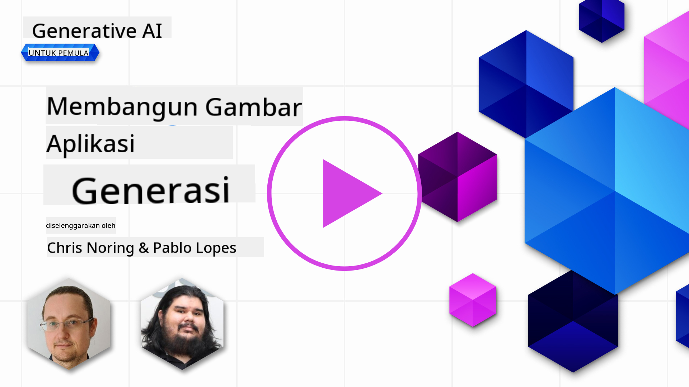

<!--
CO_OP_TRANSLATOR_METADATA:
{
  "original_hash": "1a7fd0f95f9eb673b79da47c0814f4d4",
  "translation_date": "2025-07-09T13:29:56+00:00",
  "source_file": "09-building-image-applications/README.md",
  "language_code": "id"
}
-->
# Membangun Aplikasi Generasi Gambar

[](https://aka.ms/gen-ai-lesson9-gh?WT.mc_id=academic-105485-koreyst)

LLM tidak hanya untuk menghasilkan teks. Kita juga bisa membuat gambar dari deskripsi teks. Memiliki gambar sebagai modalitas sangat berguna di berbagai bidang seperti MedTech, arsitektur, pariwisata, pengembangan game, dan lainnya. Di bab ini, kita akan membahas dua model generasi gambar paling populer, DALL-E dan Midjourney.

## Pendahuluan

Dalam pelajaran ini, kita akan membahas:

- Generasi gambar dan mengapa hal ini berguna.
- DALL-E dan Midjourney, apa itu, dan bagaimana cara kerjanya.
- Cara membangun aplikasi generasi gambar.

## Tujuan Pembelajaran

Setelah menyelesaikan pelajaran ini, Anda akan mampu:

- Membangun aplikasi generasi gambar.
- Menentukan batasan aplikasi Anda dengan meta prompt.
- Bekerja dengan DALL-E dan Midjourney.

## Mengapa membangun aplikasi generasi gambar?

Aplikasi generasi gambar adalah cara yang bagus untuk mengeksplorasi kemampuan Generative AI. Contohnya dapat digunakan untuk:

- **Pengeditan dan sintesis gambar**. Anda bisa membuat gambar untuk berbagai kebutuhan, seperti pengeditan dan sintesis gambar.

- **Diterapkan di berbagai industri**. Bisa juga digunakan untuk membuat gambar di berbagai industri seperti Medtech, Pariwisata, Pengembangan Game, dan lainnya.

## Skenario: Edu4All

Sebagai bagian dari pelajaran ini, kita akan melanjutkan bekerja dengan startup kita, Edu4All. Para siswa akan membuat gambar untuk tugas mereka, gambar apa yang dibuat tergantung pada siswa, bisa berupa ilustrasi untuk dongeng mereka sendiri, membuat karakter baru untuk cerita mereka, atau membantu memvisualisasikan ide dan konsep mereka.

Berikut contoh gambar yang bisa dibuat siswa Edu4All jika mereka mengerjakan tugas kelas tentang monumen:


dengan prompt seperti

> "Anjing di samping Menara Eiffel di bawah sinar matahari pagi"

## Apa itu DALL-E dan Midjourney?

[DALL-E](https://openai.com/dall-e-2?WT.mc_id=academic-105485-koreyst) dan [Midjourney](https://www.midjourney.com/?WT.mc_id=academic-105485-koreyst) adalah dua model generasi gambar paling populer, yang memungkinkan Anda menggunakan prompt untuk menghasilkan gambar.

### DALL-E

Mari mulai dengan DALL-E, sebuah model Generative AI yang menghasilkan gambar dari deskripsi teks.

> [DALL-E adalah gabungan dari dua model, CLIP dan diffused attention](https://towardsdatascience.com/openais-dall-e-and-clip-101-a-brief-introduction-3a4367280d4e?WT.mc_id=academic-105485-koreyst).

- **CLIP**, adalah model yang menghasilkan embeddings, yaitu representasi numerik dari data, dari gambar dan teks.

- **Diffused attention**, adalah model yang menghasilkan gambar dari embeddings. DALL-E dilatih menggunakan dataset gambar dan teks dan dapat digunakan untuk membuat gambar dari deskripsi teks. Misalnya, DALL-E bisa membuat gambar kucing dengan topi, atau anjing dengan mohawk.

### Midjourney

Midjourney bekerja mirip dengan DALL-E, menghasilkan gambar dari prompt teks. Midjourney juga bisa digunakan untuk membuat gambar dengan prompt seperti “kucing dengan topi”, atau “anjing dengan mohawk”.


_Kredit gambar Wikipedia, gambar dihasilkan oleh Midjourney_

## Bagaimana DALL-E dan Midjourney Bekerja

Pertama, [DALL-E](https://arxiv.org/pdf/2102.12092.pdf?WT.mc_id=academic-105485-koreyst). DALL-E adalah model Generative AI berbasis arsitektur transformer dengan _autoregressive transformer_.

_Transformer autoregresif_ mendefinisikan bagaimana model menghasilkan gambar dari deskripsi teks, yaitu dengan menghasilkan satu piksel pada satu waktu, lalu menggunakan piksel yang sudah dibuat untuk menghasilkan piksel berikutnya. Proses ini melewati beberapa lapisan dalam jaringan saraf hingga gambar selesai.

Dengan proses ini, DALL-E mengontrol atribut, objek, karakteristik, dan lainnya dalam gambar yang dihasilkan. Namun, DALL-E 2 dan 3 memiliki kontrol yang lebih baik atas gambar yang dibuat.

## Membangun aplikasi generasi gambar pertama Anda

Lalu, apa yang dibutuhkan untuk membangun aplikasi generasi gambar? Anda memerlukan pustaka berikut:

- **python-dotenv**, sangat disarankan menggunakan pustaka ini untuk menyimpan rahasia Anda di file _.env_ terpisah dari kode.
- **openai**, pustaka ini digunakan untuk berinteraksi dengan API OpenAI.
- **pillow**, untuk bekerja dengan gambar di Python.
- **requests**, untuk membantu membuat permintaan HTTP.

1. Buat file _.env_ dengan isi berikut:

   ```text
   AZURE_OPENAI_ENDPOINT=<your endpoint>
   AZURE_OPENAI_API_KEY=<your key>
   ```

   Temukan informasi ini di Azure Portal untuk resource Anda di bagian "Keys and Endpoint".

1. Kumpulkan pustaka di atas dalam file bernama _requirements.txt_ seperti ini:

   ```text
   python-dotenv
   openai
   pillow
   requests
   ```

1. Selanjutnya, buat virtual environment dan instal pustaka:

   ```bash
   python3 -m venv venv
   source venv/bin/activate
   pip install -r requirements.txt
   ```

   Untuk Windows, gunakan perintah berikut untuk membuat dan mengaktifkan virtual environment:

   ```bash
   python3 -m venv venv
   venv\Scripts\activate.bat
   ```

1. Tambahkan kode berikut di file bernama _app.py_:

   ```python
   import openai
   import os
   import requests
   from PIL import Image
   import dotenv

   # import dotenv
   dotenv.load_dotenv()

   # Get endpoint and key from environment variables
   openai.api_base = os.environ['AZURE_OPENAI_ENDPOINT']
   openai.api_key = os.environ['AZURE_OPENAI_API_KEY']

   # Assign the API version (DALL-E is currently supported for the 2023-06-01-preview API version only)
   openai.api_version = '2023-06-01-preview'
   openai.api_type = 'azure'


   try:
       # Create an image by using the image generation API
       generation_response = openai.Image.create(
           prompt='Bunny on horse, holding a lollipop, on a foggy meadow where it grows daffodils',    # Enter your prompt text here
           size='1024x1024',
           n=2,
           temperature=0,
       )
       # Set the directory for the stored image
       image_dir = os.path.join(os.curdir, 'images')

       # If the directory doesn't exist, create it
       if not os.path.isdir(image_dir):
           os.mkdir(image_dir)

       # Initialize the image path (note the filetype should be png)
       image_path = os.path.join(image_dir, 'generated-image.png')

       # Retrieve the generated image
       image_url = generation_response["data"][0]["url"]  # extract image URL from response
       generated_image = requests.get(image_url).content  # download the image
       with open(image_path, "wb") as image_file:
           image_file.write(generated_image)

       # Display the image in the default image viewer
       image = Image.open(image_path)
       image.show()

   # catch exceptions
   except openai.InvalidRequestError as err:
       print(err)

   ```

Mari jelaskan kode ini:

- Pertama, kita mengimpor pustaka yang dibutuhkan, termasuk pustaka OpenAI, dotenv, requests, dan Pillow.

  ```python
  import openai
  import os
  import requests
  from PIL import Image
  import dotenv
  ```

- Selanjutnya, kita memuat variabel lingkungan dari file _.env_.

  ```python
  # import dotenv
  dotenv.load_dotenv()
  ```

- Setelah itu, kita mengatur endpoint, kunci API OpenAI, versi, dan tipe.

  ```python
  # Get endpoint and key from environment variables
  openai.api_base = os.environ['AZURE_OPENAI_ENDPOINT']
  openai.api_key = os.environ['AZURE_OPENAI_API_KEY']

  # add version and type, Azure specific
  openai.api_version = '2023-06-01-preview'
  openai.api_type = 'azure'
  ```

- Berikutnya, kita menghasilkan gambar:

  ```python
  # Create an image by using the image generation API
  generation_response = openai.Image.create(
      prompt='Bunny on horse, holding a lollipop, on a foggy meadow where it grows daffodils',    # Enter your prompt text here
      size='1024x1024',
      n=2,
      temperature=0,
  )
  ```

  Kode di atas merespon dengan objek JSON yang berisi URL gambar yang dihasilkan. Kita bisa menggunakan URL tersebut untuk mengunduh gambar dan menyimpannya ke file.

- Terakhir, kita membuka gambar dan menggunakan penampil gambar standar untuk menampilkannya:

  ```python
  image = Image.open(image_path)
  image.show()
  ```

### Detail lebih lanjut tentang pembuatan gambar

Mari lihat kode yang menghasilkan gambar dengan lebih detail:

```python
generation_response = openai.Image.create(
        prompt='Bunny on horse, holding a lollipop, on a foggy meadow where it grows daffodils',    # Enter your prompt text here
        size='1024x1024',
        n=2,
        temperature=0,
    )
```

- **prompt**, adalah teks prompt yang digunakan untuk membuat gambar. Dalam contoh ini, promptnya adalah "Bunny on horse, holding a lollipop, on a foggy meadow where it grows daffodils".
- **size**, adalah ukuran gambar yang dihasilkan. Dalam contoh ini, gambar berukuran 1024x1024 piksel.
- **n**, adalah jumlah gambar yang dihasilkan. Dalam contoh ini, kita membuat dua gambar.
- **temperature**, adalah parameter yang mengontrol tingkat keacakan output model Generative AI. Nilainya antara 0 dan 1, di mana 0 berarti output deterministik dan 1 berarti output acak. Nilai default adalah 0.7.

Masih banyak hal lain yang bisa dilakukan dengan gambar yang akan kita bahas di bagian berikutnya.

## Kemampuan tambahan dari generasi gambar

Anda sudah melihat bagaimana kita bisa membuat gambar hanya dengan beberapa baris kode Python. Namun, ada lebih banyak hal yang bisa dilakukan dengan gambar.

Anda juga bisa melakukan hal berikut:

- **Melakukan pengeditan**. Dengan memberikan gambar yang sudah ada, sebuah masker, dan prompt, Anda bisa mengubah gambar. Misalnya, Anda bisa menambahkan sesuatu pada bagian gambar tertentu. Bayangkan gambar kelinci kita, Anda bisa menambahkan topi pada kelinci tersebut. Caranya dengan memberikan gambar, masker (yang menandai bagian yang akan diubah), dan prompt teks yang menjelaskan perubahan yang diinginkan.

  ```python
  response = openai.Image.create_edit(
    image=open("base_image.png", "rb"),
    mask=open("mask.png", "rb"),
    prompt="An image of a rabbit with a hat on its head.",
    n=1,
    size="1024x1024"
  )
  image_url = response['data'][0]['url']
  ```

  Gambar dasar hanya berisi kelinci, tapi gambar akhir akan memiliki topi pada kelinci tersebut.

- **Membuat variasi**. Ide dasarnya adalah Anda mengambil gambar yang sudah ada dan meminta dibuatkan variasinya. Untuk membuat variasi, Anda memberikan gambar dan prompt teks serta kode seperti ini:

  ```python
  response = openai.Image.create_variation(
    image=open("bunny-lollipop.png", "rb"),
    n=1,
    size="1024x1024"
  )
  image_url = response['data'][0]['url']
  ```

  > Catatan, ini hanya didukung di OpenAI

## Temperature

Temperature adalah parameter yang mengontrol tingkat keacakan output model Generative AI. Nilainya antara 0 dan 1, di mana 0 berarti output deterministik dan 1 berarti output acak. Nilai default adalah 0.7.

Mari lihat contoh bagaimana temperature bekerja, dengan menjalankan prompt ini dua kali:

> Prompt : "Bunny on horse, holding a lollipop, on a foggy meadow where it grows daffodils"


Sekarang jalankan prompt yang sama sekali lagi untuk melihat bahwa kita tidak akan mendapatkan gambar yang sama dua kali:


Seperti yang Anda lihat, gambarnya mirip tapi tidak sama. Mari coba ubah nilai temperature menjadi 0.1 dan lihat apa yang terjadi:

```python
 generation_response = openai.Image.create(
        prompt='Bunny on horse, holding a lollipop, on a foggy meadow where it grows daffodils',    # Enter your prompt text here
        size='1024x1024',
        n=2
    )
```

### Mengubah temperature

Mari kita coba membuat respons lebih deterministik. Dari dua gambar yang kita buat, pada gambar pertama ada kelinci dan pada gambar kedua ada kuda, jadi gambarnya sangat berbeda.

Mari ubah kode kita dan set temperature menjadi 0, seperti ini:

```python
generation_response = openai.Image.create(
        prompt='Bunny on horse, holding a lollipop, on a foggy meadow where it grows daffodils',    # Enter your prompt text here
        size='1024x1024',
        n=2,
        temperature=0
    )
```

Sekarang saat Anda menjalankan kode ini, Anda akan mendapatkan dua gambar berikut:

- 
- 

Di sini Anda bisa melihat dengan jelas bahwa gambar-gambar tersebut lebih mirip satu sama lain.

## Cara menentukan batasan aplikasi Anda dengan metaprompt

Dengan demo kita, kita sudah bisa menghasilkan gambar untuk klien kita. Namun, kita perlu membuat batasan untuk aplikasi kita.

Misalnya, kita tidak ingin menghasilkan gambar yang tidak pantas untuk lingkungan kerja, atau yang tidak sesuai untuk anak-anak.

Kita bisa melakukan ini dengan _metaprompt_. Metaprompt adalah prompt teks yang digunakan untuk mengontrol output model Generative AI. Misalnya, kita bisa menggunakan metaprompt untuk memastikan gambar yang dihasilkan aman untuk lingkungan kerja, atau sesuai untuk anak-anak.

### Bagaimana cara kerjanya?

Sekarang, bagaimana metaprompt bekerja?

Metaprompt adalah prompt teks yang digunakan untuk mengontrol output model Generative AI, ditempatkan sebelum prompt teks utama, dan digunakan untuk mengendalikan output model serta disematkan dalam aplikasi untuk mengontrol output model. Dengan menggabungkan input prompt dan input metaprompt dalam satu prompt teks.

Salah satu contoh metaprompt adalah sebagai berikut:

```text
You are an assistant designer that creates images for children.

The image needs to be safe for work and appropriate for children.

The image needs to be in color.

The image needs to be in landscape orientation.

The image needs to be in a 16:9 aspect ratio.

Do not consider any input from the following that is not safe for work or appropriate for children.

(Input)

```

Sekarang, mari lihat bagaimana kita bisa menggunakan metaprompt dalam demo kita.

```python
disallow_list = "swords, violence, blood, gore, nudity, sexual content, adult content, adult themes, adult language, adult humor, adult jokes, adult situations, adult"

meta_prompt =f"""You are an assistant designer that creates images for children.

The image needs to be safe for work and appropriate for children.

The image needs to be in color.

The image needs to be in landscape orientation.

The image needs to be in a 16:9 aspect ratio.

Do not consider any input from the following that is not safe for work or appropriate for children.
{disallow_list}
"""

prompt = f"{meta_prompt}
Create an image of a bunny on a horse, holding a lollipop"

# TODO add request to generate image
```

Dari prompt di atas, Anda bisa melihat bagaimana semua gambar yang dibuat mempertimbangkan metaprompt tersebut.

## Tugas - mari beri kemampuan pada siswa

Kita sudah memperkenalkan Edu4All di awal pelajaran ini. Sekarang saatnya memberi kemampuan pada siswa untuk membuat gambar untuk tugas mereka.

Para siswa akan membuat gambar untuk tugas mereka yang berisi monumen, monumen apa yang dibuat tergantung pada kreativitas siswa. Siswa diminta menggunakan kreativitas mereka untuk menempatkan monumen-monumen ini dalam konteks yang berbeda.

## Solusi

Berikut salah satu solusi yang mungkin:

```python
import openai
import os
import requests
from PIL import Image
import dotenv

# import dotenv
dotenv.load_dotenv()

# Get endpoint and key from environment variables
openai.api_base = "<replace with endpoint>"
openai.api_key = "<replace with api key>"

# Assign the API version (DALL-E is currently supported for the 2023-06-01-preview API version only)
openai.api_version = '2023-06-01-preview'
openai.api_type = 'azure'

disallow_list = "swords, violence, blood, gore, nudity, sexual content, adult content, adult themes, adult language, adult humor, adult jokes, adult situations, adult"

meta_prompt = f"""You are an assistant designer that creates images for children.

The image needs to be safe for work and appropriate for children.

The image needs to be in color.

The image needs to be in landscape orientation.

The image needs to be in a 16:9 aspect ratio.

Do not consider any input from the following that is not safe for work or appropriate for children.
{disallow_list}"""

prompt = f"""{meta_prompt}
Generate monument of the Arc of Triumph in Paris, France, in the evening light with a small child holding a Teddy looks on.
""""

try:
    # Create an image by using the image generation API
    generation_response = openai.Image.create(
        prompt=prompt,    # Enter your prompt text here
        size='1024x1024',
        n=2,
        temperature=0,
    )
    # Set the directory for the stored image
    image_dir = os.path.join(os.curdir, 'images')

    # If the directory doesn't exist, create it
    if not os.path.isdir(image_dir):
        os.mkdir(image_dir)

    # Initialize the image path (note the filetype should be png)
    image_path = os.path.join(image_dir, 'generated-image.png')

    # Retrieve the generated image
    image_url = generation_response["data"][0]["url"]  # extract image URL from response
    generated_image = requests.get(image_url).content  # download the image
    with open(image_path, "wb") as image_file:
        image_file.write(generated_image)

    # Display the image in the default image viewer
    image = Image.open(image_path)
    image.show()

# catch exceptions
except openai.InvalidRequestError as err:
    print(err)
```

## Kerja Bagus! Lanjutkan Pembelajaran Anda

Setelah menyelesaikan pelajaran ini, lihat koleksi [Generative AI Learning](https://aka.ms/genai-collection?WT.mc_id=academic-105485-koreyst) kami untuk terus meningkatkan pengetahuan Anda tentang Generative AI!

Lanjutkan ke Pelajaran 10 di mana kita akan membahas cara [membangun aplikasi AI dengan low-code](../10-building-low-code-ai-applications/README.md?WT.mc_id=academic-105485-koreyst)

**Penafian**:  
Dokumen ini telah diterjemahkan menggunakan layanan terjemahan AI [Co-op Translator](https://github.com/Azure/co-op-translator). Meskipun kami berupaya untuk mencapai akurasi, harap diperhatikan bahwa terjemahan otomatis mungkin mengandung kesalahan atau ketidakakuratan. Dokumen asli dalam bahasa aslinya harus dianggap sebagai sumber yang sahih. Untuk informasi penting, disarankan menggunakan terjemahan profesional oleh manusia. Kami tidak bertanggung jawab atas kesalahpahaman atau penafsiran yang keliru yang timbul dari penggunaan terjemahan ini.