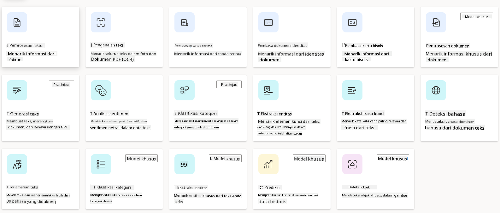
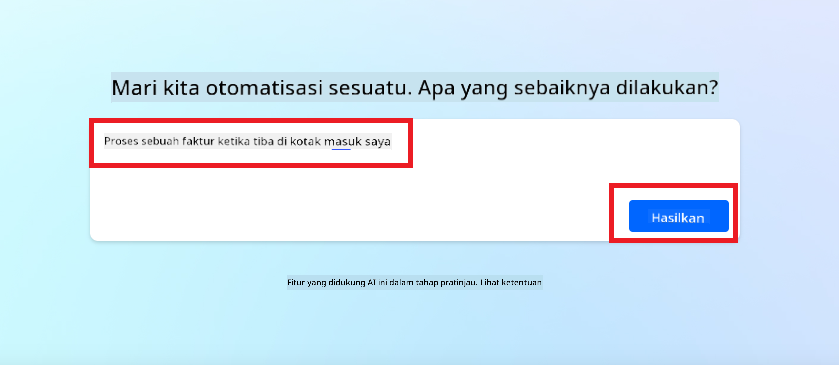
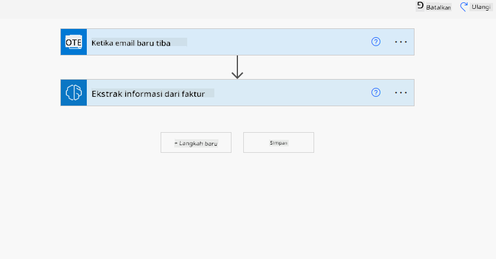
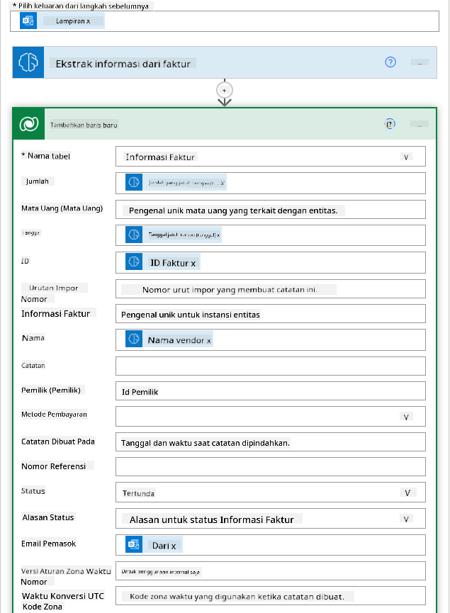
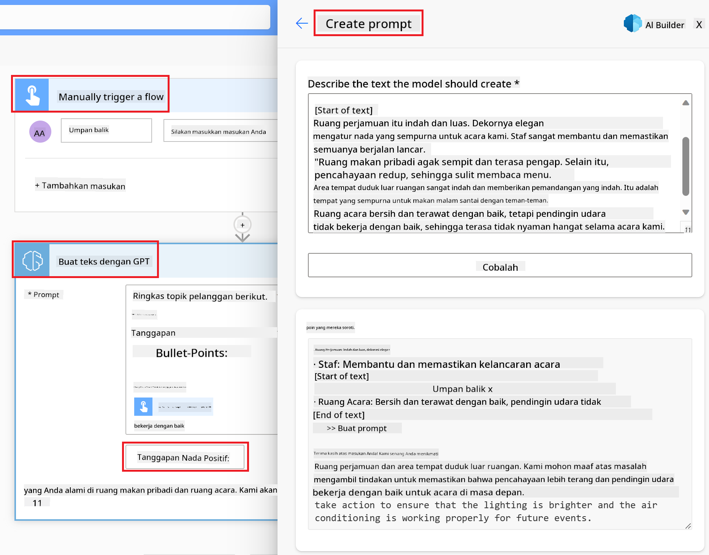

<!--
CO_OP_TRANSLATOR_METADATA:
{
  "original_hash": "f5ff3b6204a695a117d6f452403c95f7",
  "translation_date": "2025-06-25T19:06:42+00:00",
  "source_file": "10-building-low-code-ai-applications/README.md",
  "language_code": "id"
}
-->
# Membangun Aplikasi AI Kode Rendah

## Pengantar

Setelah kita belajar bagaimana membangun aplikasi penghasil gambar, mari kita bicara tentang kode rendah. AI generatif dapat digunakan untuk berbagai bidang termasuk kode rendah, tetapi apa itu kode rendah dan bagaimana kita bisa menambahkan AI ke dalamnya?

Membangun aplikasi dan solusi telah menjadi lebih mudah bagi pengembang tradisional dan non-pengembang melalui penggunaan Platform Pengembangan Kode Rendah. Platform Pengembangan Kode Rendah memungkinkan Anda membangun aplikasi dan solusi dengan sedikit atau tanpa kode. Ini dicapai dengan menyediakan lingkungan pengembangan visual yang memungkinkan Anda untuk menyeret dan menjatuhkan komponen untuk membangun aplikasi dan solusi. Ini memungkinkan Anda membangun aplikasi dan solusi lebih cepat dan dengan sumber daya yang lebih sedikit. Dalam pelajaran ini, kita akan membahas secara mendalam bagaimana menggunakan Kode Rendah dan bagaimana meningkatkan pengembangan kode rendah dengan AI menggunakan Power Platform.

Power Platform memberikan organisasi kesempatan untuk memberdayakan tim mereka untuk membangun solusi mereka sendiri melalui lingkungan kode rendah atau tanpa kode yang intuitif. Lingkungan ini membantu menyederhanakan proses membangun solusi. Dengan Power Platform, solusi dapat dibangun dalam hitungan hari atau minggu daripada berbulan-bulan atau bertahun-tahun. Power Platform terdiri dari lima produk utama: Power Apps, Power Automate, Power BI, Power Pages, dan Copilot Studio.

Pelajaran ini mencakup:

- Pengantar AI Generatif di Power Platform
- Pengantar Copilot dan cara menggunakannya
- Menggunakan AI Generatif untuk membangun aplikasi dan alur di Power Platform
- Memahami Model AI di Power Platform dengan AI Builder

## Tujuan Pembelajaran

Pada akhir pelajaran ini, Anda akan dapat:

- Memahami bagaimana Copilot bekerja di Power Platform.

- Membangun Aplikasi Pelacak Tugas Siswa untuk startup pendidikan kami.

- Membangun Alur Pemrosesan Faktur yang menggunakan AI untuk mengekstrak informasi dari faktur.

- Menerapkan praktik terbaik saat menggunakan Model AI Create Text dengan GPT.

Alat dan teknologi yang akan Anda gunakan dalam pelajaran ini adalah:

- **Power Apps**, untuk aplikasi Pelacak Tugas Siswa, yang menyediakan lingkungan pengembangan kode rendah untuk membangun aplikasi guna melacak, mengelola, dan berinteraksi dengan data.

- **Dataverse**, untuk menyimpan data untuk aplikasi Pelacak Tugas Siswa di mana Dataverse akan menyediakan platform data kode rendah untuk menyimpan data aplikasi.

- **Power Automate**, untuk alur Pemrosesan Faktur di mana Anda akan memiliki lingkungan pengembangan kode rendah untuk membangun alur kerja guna mengotomatisasi proses Pemrosesan Faktur.

- **AI Builder**, untuk Model AI Pemrosesan Faktur di mana Anda akan menggunakan Model AI yang sudah dibangun untuk memproses faktur untuk startup kami.

## AI Generatif di Power Platform

Meningkatkan pengembangan dan aplikasi kode rendah dengan AI generatif adalah area fokus utama untuk Power Platform. Tujuannya adalah untuk memungkinkan semua orang membangun aplikasi bertenaga AI, situs, dasbor, dan mengotomatisasi proses dengan AI, _tanpa memerlukan keahlian ilmu data_. Tujuan ini dicapai dengan mengintegrasikan AI generatif ke dalam pengalaman pengembangan kode rendah di Power Platform dalam bentuk Copilot dan AI Builder.

### Bagaimana cara kerjanya?

Copilot adalah asisten AI yang memungkinkan Anda membangun solusi Power Platform dengan mendeskripsikan kebutuhan Anda dalam serangkaian langkah percakapan menggunakan bahasa alami. Anda dapat, misalnya, menginstruksikan asisten AI Anda untuk menyatakan bidang apa yang akan digunakan aplikasi Anda dan itu akan membuat aplikasi dan model data yang mendasarinya atau Anda dapat menentukan cara mengatur alur di Power Automate.

Anda dapat menggunakan fungsi yang didorong Copilot sebagai fitur di layar aplikasi Anda untuk memungkinkan pengguna menemukan wawasan melalui interaksi percakapan.

AI Builder adalah kemampuan AI kode rendah yang tersedia di Power Platform yang memungkinkan Anda menggunakan Model AI untuk membantu Anda mengotomatisasi proses dan memprediksi hasil. Dengan AI Builder Anda dapat membawa AI ke aplikasi dan alur yang terhubung ke data Anda di Dataverse atau di berbagai sumber data cloud, seperti SharePoint, OneDrive, atau Azure.

Copilot tersedia di semua produk Power Platform: Power Apps, Power Automate, Power BI, Power Pages, dan Power Virtual Agents. AI Builder tersedia di Power Apps dan Power Automate. Dalam pelajaran ini, kita akan fokus pada bagaimana menggunakan Copilot dan AI Builder di Power Apps dan Power Automate untuk membangun solusi untuk startup pendidikan kita.

### Copilot di Power Apps

Sebagai bagian dari Power Platform, Power Apps menyediakan lingkungan pengembangan kode rendah untuk membangun aplikasi guna melacak, mengelola, dan berinteraksi dengan data. Ini adalah rangkaian layanan pengembangan aplikasi dengan platform data yang dapat diskalakan dan kemampuan untuk terhubung ke layanan cloud dan data di tempat. Power Apps memungkinkan Anda membangun aplikasi yang berjalan di browser, tablet, dan ponsel, dan dapat dibagikan dengan rekan kerja. Power Apps memudahkan pengguna dalam pengembangan aplikasi dengan antarmuka yang sederhana, sehingga setiap pengguna bisnis atau pengembang pro dapat membangun aplikasi khusus. Pengalaman pengembangan aplikasi juga ditingkatkan dengan AI Generatif melalui Copilot.

Fitur asisten AI copilot di Power Apps memungkinkan Anda untuk mendeskripsikan jenis aplikasi yang Anda butuhkan dan informasi apa yang ingin Anda lacak, kumpulkan, atau tampilkan di aplikasi Anda. Copilot kemudian menghasilkan aplikasi Canvas responsif berdasarkan deskripsi Anda. Anda kemudian dapat menyesuaikan aplikasi untuk memenuhi kebutuhan Anda. AI Copilot juga menghasilkan dan menyarankan Tabel Dataverse dengan bidang yang Anda butuhkan untuk menyimpan data yang ingin Anda lacak dan beberapa data contoh. Kita akan melihat apa itu Dataverse dan bagaimana Anda dapat menggunakannya di Power Apps dalam pelajaran ini nanti. Anda kemudian dapat menyesuaikan tabel untuk memenuhi kebutuhan Anda menggunakan fitur asisten AI Copilot melalui langkah percakapan. Fitur ini tersedia langsung dari layar beranda Power Apps.

### Copilot di Power Automate

Sebagai bagian dari Power Platform, Power Automate memungkinkan pengguna membuat alur kerja otomatis antara aplikasi dan layanan. Ini membantu mengotomatisasi proses bisnis berulang seperti komunikasi, pengumpulan data, dan persetujuan keputusan. Antarmuka sederhana memungkinkan pengguna dengan setiap kompetensi teknis (dari pemula hingga pengembang berpengalaman) untuk mengotomatisasi tugas kerja. Pengalaman pengembangan alur kerja juga ditingkatkan dengan AI Generatif melalui Copilot.

Fitur asisten AI copilot di Power Automate memungkinkan Anda untuk mendeskripsikan jenis alur yang Anda butuhkan dan tindakan apa yang Anda inginkan alur Anda lakukan. Copilot kemudian menghasilkan alur berdasarkan deskripsi Anda. Anda kemudian dapat menyesuaikan alur untuk memenuhi kebutuhan Anda. AI Copilot juga menghasilkan dan menyarankan tindakan yang Anda butuhkan untuk melakukan tugas yang ingin Anda otomatisasi. Kita akan melihat apa itu alur dan bagaimana Anda dapat menggunakannya di Power Automate dalam pelajaran ini nanti. Anda kemudian dapat menyesuaikan tindakan untuk memenuhi kebutuhan Anda menggunakan fitur asisten AI Copilot melalui langkah percakapan. Fitur ini tersedia langsung dari layar beranda Power Automate.

## Tugas: Mengelola tugas siswa dan faktur untuk startup kami, menggunakan Copilot

Startup kami menyediakan kursus online untuk siswa. Startup ini telah berkembang pesat dan sekarang kesulitan untuk memenuhi permintaan kursusnya. Startup ini telah mempekerjakan Anda sebagai pengembang Power Platform untuk membantu mereka membangun solusi kode rendah untuk membantu mereka mengelola tugas siswa dan faktur mereka. Solusi mereka harus dapat membantu mereka melacak dan mengelola tugas siswa melalui aplikasi dan mengotomatisasi proses pemrosesan faktur melalui alur kerja. Anda telah diminta untuk menggunakan AI Generatif untuk mengembangkan solusi.

Saat Anda memulai dengan menggunakan Copilot, Anda dapat menggunakan [Power Platform Copilot Prompt Library](https://github.com/pnp/powerplatform-prompts?WT.mc_id=academic-109639-somelezediko) untuk memulai dengan prompt. Perpustakaan ini berisi daftar prompt yang dapat Anda gunakan untuk membangun aplikasi dan alur dengan Copilot. Anda juga dapat menggunakan prompt di perpustakaan untuk mendapatkan ide tentang bagaimana mendeskripsikan kebutuhan Anda kepada Copilot.

### Membangun Aplikasi Pelacak Tugas Siswa untuk Startup Kami

Para pendidik di startup kami kesulitan untuk melacak tugas siswa. Mereka telah menggunakan spreadsheet untuk melacak tugas, tetapi ini menjadi sulit untuk dikelola seiring bertambahnya jumlah siswa. Mereka telah meminta Anda untuk membangun aplikasi yang akan membantu mereka melacak dan mengelola tugas siswa. Aplikasi ini harus memungkinkan mereka untuk menambahkan tugas baru, melihat tugas, memperbarui tugas, dan menghapus tugas. Aplikasi ini juga harus memungkinkan pendidik dan siswa untuk melihat tugas yang telah dinilai dan yang belum dinilai.

Anda akan membangun aplikasi menggunakan Copilot di Power Apps mengikuti langkah-langkah di bawah ini:

1. Arahkan ke layar beranda [Power Apps](https://make.powerapps.com?WT.mc_id=academic-105485-koreyst).

1. Gunakan area teks di layar beranda untuk mendeskripsikan aplikasi yang ingin Anda bangun. Misalnya, **_Saya ingin membangun aplikasi untuk melacak dan mengelola tugas siswa_**. Klik tombol **Kirim** untuk mengirim prompt ke AI Copilot.

1. AI Copilot akan menyarankan Tabel Dataverse dengan bidang yang Anda butuhkan untuk menyimpan data yang ingin Anda lacak dan beberapa data contoh. Anda kemudian dapat menyesuaikan tabel untuk memenuhi kebutuhan Anda menggunakan fitur asisten AI Copilot melalui langkah percakapan.

   > **Penting**: Dataverse adalah platform data yang mendasari untuk Power Platform. Ini adalah platform data kode rendah untuk menyimpan data aplikasi. Ini adalah layanan yang dikelola sepenuhnya yang menyimpan data dengan aman di Microsoft Cloud dan disediakan dalam lingkungan Power Platform Anda. Ini dilengkapi dengan kemampuan tata kelola data bawaan, seperti klasifikasi data, garis keturunan data, kontrol akses yang terperinci, dan lainnya. Anda dapat mempelajari lebih lanjut tentang Dataverse [di sini](https://docs.microsoft.com/powerapps/maker/data-platform/data-platform-intro?WT.mc_id=academic-109639-somelezediko).

1. Pendidik ingin mengirim email kepada siswa yang telah menyerahkan tugas mereka untuk memberi mereka informasi terbaru tentang kemajuan tugas mereka. Anda dapat menggunakan Copilot untuk menambahkan bidang baru ke tabel untuk menyimpan email siswa. Misalnya, Anda dapat menggunakan prompt berikut untuk menambahkan bidang baru ke tabel: **_Saya ingin menambahkan kolom untuk menyimpan email siswa_**. Klik tombol **Kirim** untuk mengirim prompt ke AI Copilot.

1. AI Copilot akan menghasilkan bidang baru dan Anda kemudian dapat menyesuaikan bidang untuk memenuhi kebutuhan Anda.

1. Setelah selesai dengan tabel, klik tombol **Buat aplikasi** untuk membuat aplikasi.

1. AI Copilot akan menghasilkan aplikasi Canvas responsif berdasarkan deskripsi Anda. Anda kemudian dapat menyesuaikan aplikasi untuk memenuhi kebutuhan Anda.

1. Agar pendidik dapat mengirim email kepada siswa, Anda dapat menggunakan Copilot untuk menambahkan layar baru ke aplikasi. Misalnya, Anda dapat menggunakan prompt berikut untuk menambahkan layar baru ke aplikasi: **_Saya ingin menambahkan layar untuk mengirim email kepada siswa_**. Klik tombol **Kirim** untuk mengirim prompt ke AI Copilot.

1. AI Copilot akan menghasilkan layar baru dan Anda kemudian dapat menyesuaikan layar untuk memenuhi kebutuhan Anda.

1. Setelah selesai dengan aplikasi, klik tombol **Simpan** untuk menyimpan aplikasi.

1. Untuk membagikan aplikasi dengan pendidik, klik tombol **Bagikan** dan kemudian klik tombol **Bagikan** lagi. Anda kemudian dapat membagikan aplikasi dengan pendidik dengan memasukkan alamat email mereka.

> **Pekerjaan rumah Anda**: Aplikasi yang baru saja Anda bangun adalah awal yang baik tetapi dapat ditingkatkan. Dengan fitur email, pendidik hanya dapat mengirim email kepada siswa secara manual dengan harus mengetik email mereka. Bisakah Anda menggunakan Copilot untuk membangun otomatisasi yang akan memungkinkan pendidik mengirim email kepada siswa secara otomatis ketika mereka menyerahkan tugas mereka? Petunjuk Anda adalah dengan prompt yang tepat Anda dapat menggunakan Copilot di Power Automate untuk membangun ini.

### Membangun Tabel Informasi Faktur untuk Startup Kami

Tim keuangan startup kami kesulitan untuk melacak faktur. Mereka telah menggunakan spreadsheet untuk melacak faktur, tetapi ini menjadi sulit untuk dikelola seiring bertambahnya jumlah faktur. Mereka telah meminta Anda untuk membangun tabel yang akan membantu mereka menyimpan, melacak, dan mengelola informasi faktur yang mereka terima. Tabel ini harus digunakan untuk membangun otomatisasi yang akan mengekstrak semua informasi faktur dan menyimpannya di tabel. Tabel ini juga harus memungkinkan tim keuangan untuk melihat faktur yang telah dibayar dan yang belum dibayar.

Power Platform memiliki platform data yang mendasari yang disebut Dataverse yang memungkinkan Anda menyimpan data untuk aplikasi dan solusi Anda. Dataverse menyediakan platform data kode rendah untuk menyimpan data aplikasi. Ini adalah layanan yang dikelola sepenuhnya yang menyimpan data dengan aman di Microsoft Cloud dan disediakan dalam lingkungan Power Platform Anda. Ini dilengkapi dengan kemampuan tata kelola data bawaan, seperti klasifikasi data, garis keturunan data, kontrol akses yang terperinci, dan lainnya. Anda dapat mempelajari lebih lanjut [tentang Dataverse di sini](https://docs.microsoft.com/powerapps/maker/data-platform/data-platform-intro?WT.mc_id=academic-109639-somelezediko).

Mengapa kita harus menggunakan Dataverse untuk startup kita? Tabel standar dan khusus dalam Dataverse menyediakan opsi penyimpanan yang aman dan berbasis cloud untuk data Anda. Tabel memungkinkan Anda menyimpan berbagai jenis data, mirip dengan bagaimana Anda mungkin menggunakan beberapa lembar kerja dalam satu buku kerja Excel. Anda dapat menggunakan tabel untuk menyimpan data yang spesifik untuk organisasi atau kebutuhan bisnis Anda. Beberapa manfaat yang akan didapatkan startup kita dari menggunakan Dataverse antara lain:

- **Mudah dikelola**: Baik metadata maupun data disimpan di cloud, jadi Anda tidak perlu khawatir tentang detail bagaimana mereka disimpan atau dikelola. Anda dapat fokus pada pembangunan aplikasi dan solusi Anda.

- **Aman**: Dataverse menyediakan opsi penyimpanan yang aman dan berbasis cloud untuk data Anda. Anda dapat mengontrol siapa yang memiliki akses ke data di tabel Anda dan bagaimana mereka dapat mengaksesnya menggunakan keamanan berbasis peran.

- **Metadata kaya**: Jenis data dan hubungan digunakan langsung dalam Power Apps

- **Logika dan validasi**: Anda dapat menggunakan aturan bisnis, bidang yang dihitung, dan aturan validasi untuk menegakkan logika bisnis dan menjaga akurasi data.

Sekarang Anda tahu apa itu Dataverse dan mengapa Anda harus menggunakannya, mari kita lihat bagaimana Anda dapat menggunakan Copilot untuk membuat tabel di Dataverse untuk memenuhi kebutuhan tim keuangan kita.

> **Catatan**: Anda akan menggunakan tabel ini di bagian selanjutnya untuk membangun otomatisasi yang akan mengekstrak semua informasi faktur dan menyimpannya di tabel.
Untuk membuat tabel di Dataverse menggunakan Copilot, ikuti langkah-langkah di bawah ini: 1. Arahkan ke layar beranda [Power Apps](https://make.powerapps.com?WT.mc_id=academic-105485-koreyst). 2. Pada bilah navigasi kiri, pilih **Tabel** dan kemudian klik **Deskripsikan Tabel Baru**.

1. Pada layar **Deskripsikan Tabel Baru**, gunakan area teks untuk mendeskripsikan tabel yang ingin Anda buat. Misalnya, **_Saya ingin membuat tabel untuk menyimpan informasi faktur_**. Klik tombol **Kirim** untuk mengirim prompt ke AI Copilot.

1. AI Copilot akan menyarankan Tabel Dataverse dengan bidang yang Anda butuhkan untuk menyimpan data yang ingin Anda lacak dan beberapa data contoh. Anda kemudian dapat menyesuaikan tabel untuk memenuhi kebutuhan Anda menggunakan fitur asisten AI Copilot melalui langkah percakapan.

1. Tim keuangan ingin mengirim email kepada pemasok untuk memberi mereka informasi terbaru tentang status faktur mereka saat ini. Anda dapat menggunakan Copilot untuk menambahkan bidang baru ke tabel untuk menyimpan email pemasok. Misalnya, Anda dapat menggunakan prompt berikut untuk menambahkan bidang baru ke tabel: **_Saya ingin menambahkan kolom untuk menyimpan email pemasok_**. Klik tombol **Kirim** untuk mengirim prompt ke AI Copilot.

1. AI Copilot akan menghasilkan bidang baru dan Anda kemudian dapat menyesuaikan bidang untuk memenuhi kebutuhan Anda.

1. Setelah selesai dengan tabel, klik tombol **Buat** untuk membuat tabel.

## Model AI di Power Platform dengan AI Builder

AI Builder adalah kemampuan AI kode rendah yang tersedia di Power Platform yang memungkinkan Anda menggunakan Model AI untuk membantu Anda mengotomatisasi proses dan memprediksi hasil. Dengan AI Builder Anda dapat membawa AI ke aplikasi dan alur yang terhubung ke data Anda di Dataverse atau di berbagai sumber data cloud, seperti SharePoint, OneDrive, atau Azure.

## Model AI yang Sudah Dibangun vs Model AI Kustom

AI Builder menyediakan dua jenis Model AI: Model AI yang Sudah Dibangun dan Model AI Kustom. Model AI yang Sudah Dibangun adalah Model AI siap pakai yang dilatih oleh Microsoft dan tersedia di Power Platform. Ini membantu Anda menambahkan kecerdasan ke aplikasi dan alur Anda tanpa harus mengumpulkan data dan kemudian membangun, melatih, dan menerbitkan model Anda sendiri. Anda dapat menggunakan model ini untuk mengotomatisasi proses dan memprediksi hasil. Beberapa Model AI yang Sudah Dibangun yang tersedia di Power Platform meliputi:

- **Ekstraksi Frasa Kunci**: Model ini mengekstrak frasa kunci dari teks.

- **Deteksi Bahasa**: Model ini mendeteksi bahasa dari
teks. - **Analisis Sentimen**: Model ini mendeteksi sentimen positif, negatif, netral, atau campuran dalam teks. - **Pembaca Kartu Nama**: Model ini mengekstraksi informasi dari kartu nama. - **Pengenalan Teks**: Model ini mengekstraksi teks dari gambar. - **Deteksi Objek**: Model ini mendeteksi dan mengekstraksi objek dari gambar. - **Pemrosesan Dokumen**: Model ini mengekstraksi informasi dari formulir. - **Pemrosesan Faktur**: Model ini mengekstraksi informasi dari faktur. Dengan Model AI Kustom, Anda dapat membawa model Anda sendiri ke AI Builder sehingga dapat berfungsi seperti model kustom AI Builder lainnya, memungkinkan Anda melatih model menggunakan data Anda sendiri. Anda dapat menggunakan model ini untuk mengotomatisasi proses dan memprediksi hasil baik di Power Apps maupun Power Automate. Saat menggunakan model Anda sendiri, ada batasan yang berlaku. Baca lebih lanjut tentang [batasan](https://learn.microsoft.com/ai-builder/byo-model#limitations?WT.mc_id=academic-105485-koreyst) ini.  

## Tugas #2 - Membangun Alur Pemrosesan Faktur untuk Startup Kami

Tim keuangan mengalami kesulitan dalam memproses faktur. Mereka telah menggunakan spreadsheet untuk melacak faktur, tetapi ini menjadi sulit diatur karena jumlah faktur telah meningkat. Mereka meminta Anda untuk membangun alur kerja yang akan membantu mereka memproses faktur menggunakan AI. Alur kerja tersebut harus memungkinkan mereka mengekstraksi informasi dari faktur dan menyimpan informasi tersebut dalam tabel Dataverse. Alur kerja juga harus memungkinkan mereka mengirim email ke tim keuangan dengan informasi yang diekstraksi. Sekarang setelah Anda tahu apa itu AI Builder dan mengapa Anda harus menggunakannya, mari kita lihat bagaimana Anda dapat menggunakan Model AI Pemrosesan Faktur di AI Builder, yang telah kita bahas sebelumnya, untuk membangun alur kerja yang akan membantu tim keuangan memproses faktur. Untuk membangun alur kerja yang akan membantu tim keuangan memproses faktur menggunakan Model AI Pemrosesan Faktur di AI Builder, ikuti langkah-langkah berikut: 

1. Arahkan ke layar utama [Power Automate](https://make.powerautomate.com?WT.mc_id=academic-105485-koreyst).
2. Gunakan area teks di layar utama untuk menggambarkan alur kerja yang ingin Anda bangun. Misalnya, **_Proses faktur ketika tiba di kotak masuk saya_**. Klik tombol **Kirim** untuk mengirim prompt ke AI Copilot. 
3. AI Copilot akan menyarankan tindakan yang perlu Anda lakukan untuk mengotomatisasi tugas yang Anda inginkan. Anda dapat mengklik tombol **Berikutnya** untuk melanjutkan ke langkah berikutnya.
4. Pada langkah berikutnya, Power Automate akan meminta Anda untuk mengatur koneksi yang diperlukan untuk alur. Setelah selesai, klik tombol **Buat alur** untuk membuat alur.
5. AI Copilot akan menghasilkan alur dan Anda kemudian dapat menyesuaikan alur tersebut sesuai kebutuhan Anda.
6. Perbarui pemicu alur dan atur **Folder** ke folder tempat faktur akan disimpan. Misalnya, Anda dapat mengatur folder ke **Kotak Masuk**. Klik pada **Tampilkan opsi lanjutan** dan atur **Hanya dengan Lampiran** ke **Ya**. Ini akan memastikan bahwa alur hanya berjalan ketika email dengan lampiran diterima di folder.
7. Hapus tindakan berikut dari alur: **HTML ke teks**, **Compose**, **Compose 2**, **Compose 3** dan **Compose 4** karena Anda tidak akan menggunakannya.
8. Hapus tindakan **Kondisi** dari alur karena Anda tidak akan menggunakannya. Alurnya harus terlihat seperti tangkapan layar berikut: 
9. Klik tombol **Tambahkan tindakan** dan cari **Dataverse**. Pilih tindakan **Tambahkan baris baru**.
10. Pada tindakan **Ekstrak Informasi dari faktur**, perbarui **File Faktur** untuk mengarah ke **Konten Lampiran** dari email. Ini akan memastikan bahwa alur mengekstraksi informasi dari lampiran faktur.
11. Pilih **Tabel** yang Anda buat sebelumnya. Misalnya, Anda dapat memilih tabel **Informasi Faktur**. Pilih konten dinamis dari tindakan sebelumnya untuk mengisi bidang berikut: 
   - ID 
   - Jumlah 
   - Tanggal 
   - Nama 
   - Status 
   - Atur **Status** ke **Tertunda**. 
   - Email Pemasok 
   - Gunakan konten dinamis **Dari** dari pemicu **Ketika email baru tiba**. 
12. Setelah selesai dengan alur, klik tombol **Simpan** untuk menyimpan alur. Anda kemudian dapat menguji alur dengan mengirim email dengan faktur ke folder yang Anda tentukan dalam pemicu. > **Pekerjaan rumah Anda**: Alur yang baru saja Anda bangun adalah awal yang baik, sekarang Anda perlu memikirkan bagaimana Anda dapat membangun otomatisasi yang akan memungkinkan tim keuangan kami mengirim email ke pemasok untuk memperbarui mereka dengan status terkini faktur mereka. Petunjuk Anda: alur harus berjalan ketika status faktur berubah.

## Menggunakan Model AI Pembuatan Teks di Power Automate

Model AI Buat Teks dengan GPT di AI Builder memungkinkan Anda untuk menghasilkan teks berdasarkan prompt dan didukung oleh Microsoft Azure OpenAI Service. Dengan kemampuan ini, Anda dapat mengintegrasikan teknologi GPT (Generative Pre-Trained Transformer) ke dalam aplikasi dan alur Anda untuk membangun berbagai alur otomatis dan aplikasi yang informatif.

Model GPT menjalani pelatihan ekstensif pada jumlah data yang sangat besar, memungkinkan mereka untuk menghasilkan teks yang sangat mirip dengan bahasa manusia ketika diberikan prompt. Ketika diintegrasikan dengan otomatisasi alur kerja, model AI seperti GPT dapat dimanfaatkan untuk menyederhanakan dan mengotomatisasi berbagai macam tugas.

Misalnya, Anda dapat membangun alur untuk secara otomatis menghasilkan teks untuk berbagai kasus penggunaan, seperti: draf email, deskripsi produk, dan lainnya. Anda juga dapat menggunakan model untuk menghasilkan teks untuk berbagai aplikasi, seperti chatbot dan aplikasi layanan pelanggan yang memungkinkan agen layanan pelanggan merespons pertanyaan pelanggan dengan efektif dan efisien.

Untuk mempelajari cara menggunakan Model AI ini di Power Automate, ikuti modul [Tambahkan kecerdasan dengan AI Builder dan GPT](https://learn.microsoft.com/training/modules/ai-builder-text-generation/?WT.mc_id=academic-109639-somelezediko).

## Kerja Bagus! Lanjutkan Pembelajaran Anda

Setelah menyelesaikan pelajaran ini, lihat koleksi [Pembelajaran AI Generatif](https://aka.ms/genai-collection?WT.mc_id=academic-105485-koreyst) kami untuk terus meningkatkan pengetahuan AI Generatif Anda!

Pergi ke Pelajaran 11 di mana kita akan melihat bagaimana [mengintegrasikan AI Generatif dengan Pemanggilan Fungsi](../11-integrating-with-function-calling/README.md?WT.mc_id=academic-105485-koreyst)!

**Penafian**:  
Dokumen ini telah diterjemahkan menggunakan layanan penerjemahan AI [Co-op Translator](https://github.com/Azure/co-op-translator). Meskipun kami berusaha untuk mencapai akurasi, harap diperhatikan bahwa terjemahan otomatis dapat mengandung kesalahan atau ketidakakuratan. Dokumen asli dalam bahasa aslinya harus dianggap sebagai sumber yang otoritatif. Untuk informasi yang penting, disarankan menggunakan terjemahan manusia profesional. Kami tidak bertanggung jawab atas kesalahpahaman atau penafsiran yang salah yang timbul dari penggunaan terjemahan ini.