# Membangun Aplikasi AI Low Code

[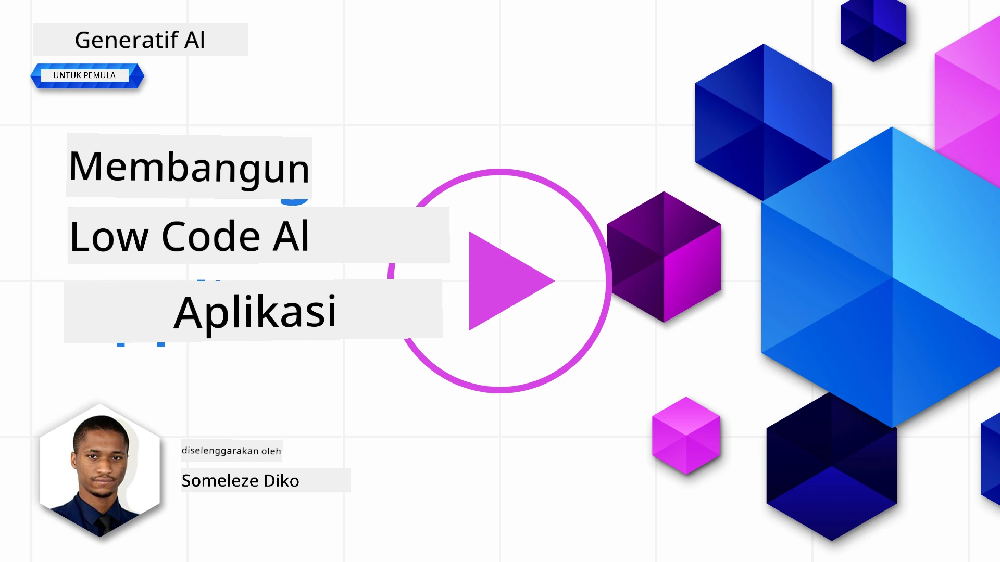](https://youtu.be/1vzq3Nd8GBA?si=h6LHWJXdmqf6mhDg)

> _(Klik gambar di atas untuk melihat video pelajaran ini)_

## Pendahuluan

Sekarang setelah kita belajar cara membangun aplikasi penghasil gambar, mari kita bahas tentang low code. AI generatif dapat digunakan untuk berbagai bidang termasuk low code, tetapi apa itu low code dan bagaimana kita dapat menambahkan AI ke dalamnya?

Membangun aplikasi dan solusi menjadi lebih mudah bagi pengembang tradisional maupun non-pengembang melalui penggunaan Platform Pengembangan Low Code. Platform Pengembangan Low Code memungkinkan Anda membangun aplikasi dan solusi dengan sedikit atau tanpa kode. Ini dicapai dengan menyediakan lingkungan pengembangan visual yang memungkinkan Anda menyeret dan melepas komponen untuk membangun aplikasi dan solusi. Ini memungkinkan Anda membangun aplikasi dan solusi lebih cepat dan dengan sumber daya yang lebih sedikit. Dalam pelajaran ini, kita menyelami bagaimana menggunakan Low Code dan bagaimana meningkatkan pengembangan low code dengan AI menggunakan Power Platform.

Power Platform memberikan kesempatan kepada organisasi untuk memberdayakan tim mereka dalam membangun solusi mereka sendiri melalui lingkungan low-code atau no-code yang intuitif. Lingkungan ini membantu menyederhanakan proses pembuatan solusi. Dengan Power Platform, solusi dapat dibangun dalam hitungan hari atau minggu bukan bulan atau tahun. Power Platform terdiri dari lima produk utama: Power Apps, Power Automate, Power BI, Power Pages, dan Copilot Studio.

Pelajaran ini mencakup:

- Pengenalan AI Generatif di Power Platform
- Pengenalan Copilot dan cara menggunakannya
- Menggunakan AI Generatif untuk membangun aplikasi dan alur kerja di Power Platform
- Memahami Model AI di Power Platform dengan AI Builder
- Membangun agen cerdas dengan Microsoft Copilot Studio

## Tujuan Pembelajaran

Pada akhir pelajaran ini, Anda akan dapat:

- Memahami cara kerja Copilot di Power Platform.

- Membangun Aplikasi Pelacak Tugas Siswa untuk startup pendidikan kami.

- Membangun Alur Pemrosesan Faktur yang menggunakan AI untuk mengekstrak informasi dari faktur.

- Menerapkan praktik terbaik saat menggunakan Model AI Create Text dengan GPT.

- Memahami apa itu Microsoft Copilot Studio dan bagaimana membangun agen cerdas dengannya.

Alat dan teknologi yang akan Anda gunakan dalam pelajaran ini adalah:

- **Power Apps**, untuk aplikasi Pelacak Tugas Siswa, yang menyediakan lingkungan pengembangan low-code untuk membangun aplikasi untuk melacak, mengelola, dan berinteraksi dengan data.

- **Dataverse**, untuk menyimpan data aplikasi Pelacak Tugas Siswa di mana Dataverse akan menyediakan platform data low-code untuk menyimpan data aplikasi tersebut.

- **Power Automate**, untuk alur kerja Pemrosesan Faktur di mana Anda akan memiliki lingkungan pengembangan low-code untuk membangun alur kerja guna mengotomatiskan proses Pemrosesan Faktur.

- **AI Builder**, untuk Model AI Pemrosesan Faktur di mana Anda akan menggunakan Model AI yang sudah dibuat sebelumnya untuk memproses faktur untuk startup kami.

## AI Generatif di Power Platform

Meningkatkan pengembangan dan aplikasi low-code dengan AI generatif adalah fokus utama Power Platform. Tujuannya adalah memungkinkan setiap orang membangun aplikasi, situs, dasbor yang didukung AI, dan mengotomatisasi proses dengan AI, _tanpa memerlukan keahlian ilmu data_. Tujuan ini dicapai dengan mengintegrasikan AI generatif ke dalam pengalaman pengembangan low-code di Power Platform dalam bentuk Copilot dan AI Builder.

### Bagaimana cara kerjanya?

Copilot adalah asisten AI yang memungkinkan Anda membangun solusi Power Platform dengan mendeskripsikan kebutuhan Anda dalam serangkaian langkah percakapan menggunakan bahasa alami. Anda bisa misalnya memerintahkan asisten AI Anda untuk menyatakan bidang apa yang akan digunakan aplikasi Anda dan Copilot akan membuat aplikasi serta model data dasarnya atau Anda bisa menentukan bagaimana mengatur alur di Power Automate.

Anda dapat menggunakan fungsi yang digerakkan oleh Copilot sebagai fitur pada layar aplikasi Anda untuk memungkinkan pengguna menemukan wawasan melalui interaksi percakapan.

AI Builder adalah kemampuan AI low-code yang tersedia di Power Platform yang memungkinkan Anda menggunakan Model AI untuk membantu mengotomatisasi proses dan memprediksi hasil. Dengan AI Builder Anda dapat membawa AI ke aplikasi dan alur kerja yang terhubung ke data Anda di Dataverse atau di berbagai sumber data cloud, seperti SharePoint, OneDrive, atau Azure.

Copilot tersedia di semua produk Power Platform: Power Apps, Power Automate, Power BI, Power Pages, dan Copilot Studio (sebelumnya Power Virtual Agents). AI Builder tersedia di Power Apps dan Power Automate. Dalam pelajaran ini, kita akan fokus pada cara menggunakan Copilot dan AI Builder di Power Apps dan Power Automate untuk membangun solusi bagi startup pendidikan kami.

### Copilot di Power Apps

Sebagai bagian dari Power Platform, Power Apps menyediakan lingkungan pengembangan low-code untuk membangun aplikasi guna melacak, mengelola, dan berinteraksi dengan data. Ini adalah rangkaian layanan pengembangan aplikasi dengan platform data yang dapat diskalakan dan kemampuan untuk terhubung ke layanan cloud dan data on-premises. Power Apps memungkinkan Anda membangun aplikasi yang berjalan di browser, tablet, dan ponsel, serta dapat dibagikan dengan rekan kerja. Power Apps memudahkan pengguna dalam pengembangan aplikasi dengan antarmuka yang sederhana, sehingga setiap pengguna bisnis atau pengembang profesional dapat membangun aplikasi kustom. Pengalaman pengembangan aplikasi juga diperkaya dengan AI Generatif melalui Copilot.

Fitur asisten AI copilot di Power Apps memungkinkan Anda mendeskripsikan jenis aplikasi yang Anda butuhkan dan informasi apa yang ingin aplikasi Anda lacak, kumpulkan, atau tampilkan. Copilot kemudian menghasilkan aplikasi Canvas responsif berdasarkan deskripsi Anda. Anda kemudian dapat menyesuaikan aplikasi untuk memenuhi kebutuhan Anda. AI Copilot juga menghasilkan dan menyarankan Tabel Dataverse dengan bidang yang Anda butuhkan untuk menyimpan data yang ingin Anda lacak beserta beberapa data contoh. Kita akan melihat apa itu Dataverse dan bagaimana Anda bisa menggunakannya di Power Apps dalam pelajaran ini nanti. Anda kemudian dapat menyesuaikan tabel untuk memenuhi kebutuhan Anda menggunakan fitur asisten AI Copilot melalui langkah-langkah percakapan. Fitur ini tersedia langsung dari layar beranda Power Apps.

### Copilot di Power Automate

Sebagai bagian dari Power Platform, Power Automate memungkinkan pengguna membuat alur kerja otomatis di antara aplikasi dan layanan. Ini membantu mengotomatisasi proses bisnis yang berulang seperti komunikasi, pengumpulan data, dan persetujuan keputusan. Antarmuka yang sederhana memungkinkan pengguna dengan berbagai kompetensi teknis (dari pemula hingga pengembang berpengalaman) untuk mengotomatisasi tugas kerja. Pengalaman pengembangan alur kerja juga diperkuat dengan AI Generatif melalui Copilot.

Fitur asisten AI copilot di Power Automate memungkinkan Anda mendeskripsikan jenis alur yang Anda butuhkan dan tindakan apa yang Anda ingin alur lakukan. Copilot kemudian menghasilkan alur berdasarkan deskripsi Anda. Anda kemudian dapat menyesuaikan alur untuk memenuhi kebutuhan Anda. AI Copilot juga menghasilkan dan menyarankan tindakan yang Anda perlukan untuk melakukan tugas yang ingin Anda otomatisasi. Kita akan melihat apa itu alur dan bagaimana Anda bisa menggunakannya di Power Automate dalam pelajaran ini nanti. Anda kemudian dapat menyesuaikan tindakan untuk memenuhi kebutuhan Anda menggunakan fitur asisten AI Copilot melalui langkah-langkah percakapan. Fitur ini tersedia langsung dari layar beranda Power Automate.

## Membangun Agen Cerdas dengan Microsoft Copilot Studio

[Microsoft Copilot Studio](https://learn.microsoft.com/microsoft-copilot-studio/fundamentals-what-is-copilot-studio?WT.mc_id=academic-105485-koreyst) (sebelumnya Power Virtual Agents) adalah anggota low-code dari Power Platform untuk membangun **agen AI** — copilot percakapan yang dapat menjawab pertanyaan, mengambil tindakan, dan mengotomatisasi tugas atas nama pengguna Anda. Sama seperti Power Platform lainnya, Anda membangun agen ini dalam pengalaman visual yang berorientasi bahasa alami: Anda mendeskripsikan apa yang Anda ingin agen lakukan, dan Copilot Studio membantu mengatur instruksi, pengetahuan, dan tindakan agen tersebut.

Untuk startup pendidikan kami, Anda dapat membangun agen yang menjawab pertanyaan siswa tentang kursus, memeriksa tenggat tugas, dan bahkan mengirim email kepada instruktur — semuanya tanpa menulis kode.

Berikut beberapa kemampuan terbaru yang membuat Copilot Studio kuat:

- **Jawaban generatif dari pengetahuan Anda**. Alih-alih menulis setiap percakapan secara manual, Anda dapat menghubungkan **sumber pengetahuan** — situs web publik, SharePoint, OneDrive, Dataverse, file yang diunggah, atau data perusahaan melalui konektor — dan agen menghasilkan jawaban yang berbasis dari sumber tersebut.

- **Orkestrasi generatif**. Alih-alih mengandalkan frasa pemicu yang kaku, agen menggunakan AI untuk memahami permintaan dan secara dinamis menentukan pengetahuan, topik, dan tindakan yang digabungkan untuk memenuhinya, termasuk menggabungkan beberapa langkah bersama.

- **Tindakan dan konektor**. Agen dapat *melakukan* hal, bukan hanya mengobrol. Anda dapat memberikan agen tindakan yang didukung oleh lebih dari 1.500 konektor Power Platform yang sudah dibuat sebelumnya, alur Power Automate, REST API khusus, prompt, atau server **Model Context Protocol (MCP)**.

- **Agen otonom**. Agen tidak terbatas hanya merespons di jendela chat. Anda dapat membangun **agen otonom** yang dipicu oleh kejadian — seperti email baru, catatan baru di Dataverse, atau file yang diunggah — lalu bertindak di latar belakang untuk menyelesaikan tugas.

- **Orkestrasi multi-agen**. Agen dapat memanggil agen lain. Agen Copilot Studio dapat menyerahkan tugas ke, atau diperluas oleh, agen lain, termasuk agen yang diterbitkan ke Microsoft 365 Copilot dan agen yang dibangun di Microsoft Foundry.

- **Pilihan model**. Selain model bawaan, Anda dapat membawa model dari katalog model Microsoft Foundry untuk menyesuaikan cara agen Anda berpikir dan merespons.

- **Menerbitkan di mana saja**. Setelah dibangun, agen dapat diterbitkan ke berbagai saluran — Microsoft Teams, Microsoft 365 Copilot, situs web atau aplikasi kustom, dan lainnya — dengan keamanan, autentikasi, dan analitik dikelola melalui pengalaman admin Power Platform.

Anda dapat mulai membangun agen pertama Anda di [copilotstudio.microsoft.com](https://copilotstudio.microsoft.com?WT.mc_id=academic-105485-koreyst) dan pelajari lebih lanjut di [dokumentasi Microsoft Copilot Studio](https://learn.microsoft.com/microsoft-copilot-studio/?WT.mc_id=academic-105485-koreyst).

## Tugas: Kelola tugas siswa dan faktur untuk startup kami menggunakan Copilot

Startup kami menyediakan kursus online untuk siswa. Startup ini telah tumbuh dengan cepat dan sekarang kesulitan untuk memenuhi permintaan akan kursusnya. Startup telah merekrut Anda sebagai pengembang Power Platform untuk membantu mereka membangun solusi low code untuk mengelola tugas siswa dan faktur mereka. Solusi mereka harus dapat membantu mereka melacak dan mengelola tugas siswa melalui aplikasi dan mengotomatisasi proses pemrosesan faktur melalui alur kerja. Anda diminta menggunakan AI Generatif untuk mengembangkan solusi tersebut.

Saat Anda memulai menggunakan Copilot, Anda dapat menggunakan [Perpustakaan Prompt Copilot Power Platform](https://github.com/pnp/powerplatform-prompts?WT.mc_id=academic-109639-somelezediko) untuk memulai dengan prompt. Perpustakaan ini berisi daftar prompt yang dapat Anda gunakan untuk membangun aplikasi dan alur kerja dengan Copilot. Anda juga dapat menggunakan prompt dalam perpustakaan untuk mendapatkan ide bagaimana mendeskripsikan kebutuhan Anda ke Copilot.

### Bangun Aplikasi Pelacak Tugas Siswa untuk Startup Kami

Para pendidik di startup kami kesulitan melacak tugas siswa. Mereka telah menggunakan spreadsheet untuk melacak tugas tetapi hal ini menjadi sulit dikelola karena jumlah siswa meningkat. Mereka meminta Anda membangun aplikasi yang akan membantu mereka melacak dan mengelola tugas siswa. Aplikasi ini harus memungkinkan mereka menambah tugas baru, melihat tugas, memperbarui tugas, dan menghapus tugas. Aplikasi juga harus memungkinkan pendidik dan siswa melihat tugas yang telah dinilai dan yang belum dinilai.

Anda akan membangun aplikasi menggunakan Copilot di Power Apps mengikuti langkah-langkah berikut:

1. Buka layar beranda [Power Apps](https://make.powerapps.com?WT.mc_id=academic-105485-koreyst).

1. Gunakan area teks di layar beranda untuk mendeskripsikan aplikasi yang ingin Anda bangun. Contohnya, **_Saya ingin membangun aplikasi untuk melacak dan mengelola tugas siswa_**. Klik tombol **Send** untuk mengirim prompt ke AI Copilot.

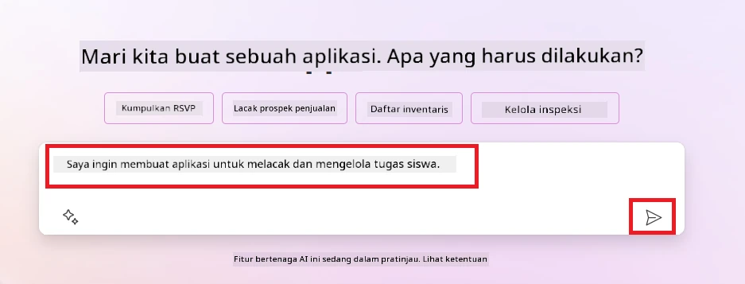

1. AI Copilot akan menyarankan Tabel Dataverse dengan bidang yang Anda perlukan untuk menyimpan data yang ingin dilacak dan beberapa data contoh. Anda kemudian dapat menyesuaikan tabel untuk memenuhi kebutuhan Anda menggunakan fitur asisten AI Copilot melalui langkah-langkah percakapan.

   > **Penting**: Dataverse adalah platform data dasar untuk Power Platform. Ini adalah platform data low-code untuk menyimpan data aplikasi. Ini adalah layanan yang dikelola sepenuhnya yang menyimpan data dengan aman di Microsoft Cloud dan disediakan dalam lingkungan Power Platform Anda. Dilengkapi dengan kemampuan tata kelola data bawaan, seperti klasifikasi data, jejak data, kontrol akses yang terperinci, dan lainnya. Anda dapat mempelajari lebih lanjut tentang Dataverse [di sini](https://docs.microsoft.com/powerapps/maker/data-platform/data-platform-intro?WT.mc_id=academic-109639-somelezediko).

   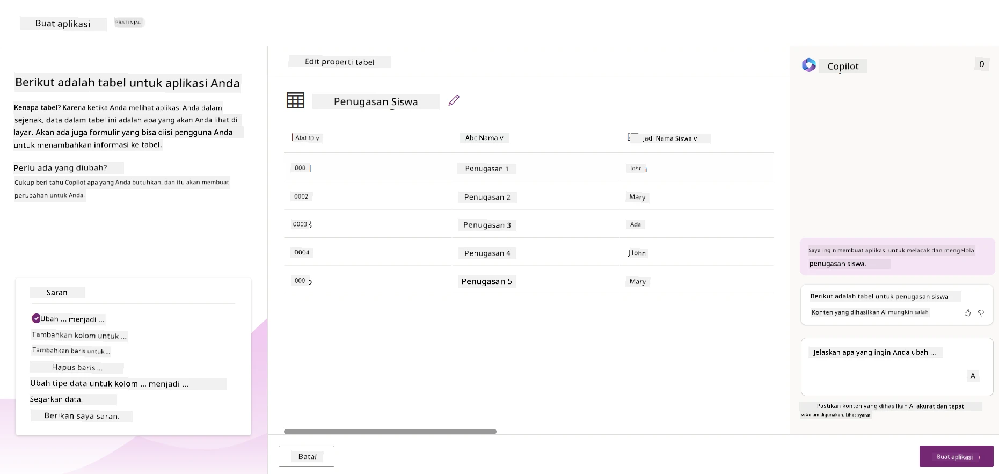

1. Para pendidik ingin mengirim email kepada siswa yang telah mengumpulkan tugas mereka untuk memberi tahu kemajuan tugas. Anda dapat menggunakan Copilot untuk menambahkan bidang baru ke tabel untuk menyimpan email siswa. Contohnya, Anda dapat menggunakan prompt berikut untuk menambahkan bidang baru ke tabel: **_Saya ingin menambahkan kolom untuk menyimpan email siswa_**. Klik tombol **Send** untuk mengirim prompt ke AI Copilot.

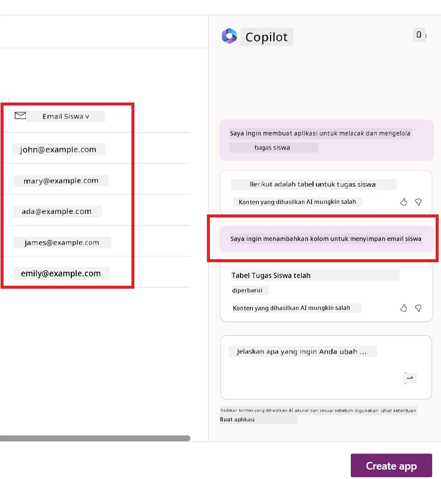

1. AI Copilot akan menghasilkan bidang baru dan Anda kemudian dapat menyesuaikan bidang agar sesuai dengan kebutuhan Anda.

1. Setelah Anda selesai dengan tabel, klik tombol **Create app** untuk membuat aplikasi.

1. AI Copilot akan menghasilkan aplikasi Canvas yang responsif berdasarkan deskripsi Anda. Anda kemudian dapat menyesuaikan aplikasi tersebut sesuai kebutuhan Anda.

1. Untuk pendidik mengirim email ke siswa, Anda dapat menggunakan Copilot untuk menambahkan layar baru ke aplikasi. Misalnya, Anda dapat menggunakan prompt berikut untuk menambahkan layar baru ke aplikasi: **_Saya ingin menambahkan layar untuk mengirim email ke siswa_**. Klik tombol **Send** untuk mengirim prompt ke AI Copilot.

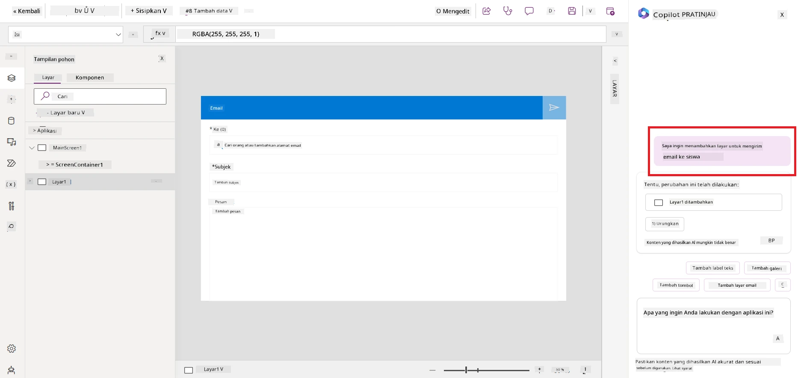

1. AI Copilot akan membuat layar baru dan Anda kemudian dapat menyesuaikan layar tersebut sesuai kebutuhan Anda.

1. Setelah Anda selesai dengan aplikasi, klik tombol **Save** untuk menyimpan aplikasi.

1. Untuk berbagi aplikasi dengan pendidik, klik tombol **Share** lalu klik tombol **Share** lagi. Anda kemudian dapat berbagi aplikasi dengan pendidik dengan memasukkan alamat email mereka.

> **Pekerjaan rumah Anda**: Aplikasi yang baru saja Anda buat adalah awal yang baik tetapi bisa ditingkatkan. Dengan fitur email, pendidik hanya dapat mengirim email ke siswa secara manual dengan mengetik email mereka. Bisakah Anda menggunakan Copilot untuk membangun otomatisasi yang memungkinkan pendidik mengirim email ke siswa secara otomatis saat mereka mengirimkan tugas? Petunjuk Anda adalah dengan prompt yang tepat Anda dapat menggunakan Copilot di Power Automate untuk membangun ini.

### Bangun Tabel Informasi Faktur untuk Startup Kami

Tim keuangan startup kami mengalami kesulitan untuk melacak faktur. Mereka telah menggunakan spreadsheet untuk melacak faktur tetapi hal ini menjadi sulit untuk dikelola seiring dengan meningkatnya jumlah faktur. Mereka meminta Anda untuk membuat tabel yang akan membantu mereka menyimpan, melacak, dan mengelola informasi faktur yang mereka terima. Tabel ini harus digunakan untuk membangun otomatisasi yang akan mengekstrak semua informasi faktur dan menyimpannya dalam tabel. Tabel ini juga harus memungkinkan tim keuangan untuk melihat faktur yang sudah dibayar dan yang belum dibayar.

Power Platform memiliki platform data dasar yang disebut Dataverse yang memungkinkan Anda menyimpan data untuk aplikasi dan solusi Anda. Dataverse menyediakan platform data low-code untuk menyimpan data aplikasi. Ini adalah layanan yang sepenuhnya dikelola yang menyimpan data dengan aman di Microsoft Cloud dan disediakan di dalam lingkungan Power Platform Anda. Dataverse dilengkapi dengan kapabilitas tata kelola data bawaan, seperti klasifikasi data, jejak data, kontrol akses terperinci, dan lainnya. Anda dapat mempelajari lebih lanjut [tentang Dataverse di sini](https://docs.microsoft.com/powerapps/maker/data-platform/data-platform-intro?WT.mc_id=academic-109639-somelezediko).

Mengapa kita harus menggunakan Dataverse untuk startup kita? Tabel standar dan khusus di dalam Dataverse memberikan opsi penyimpanan yang aman dan berbasis cloud untuk data Anda. Tabel memungkinkan Anda menyimpan berbagai jenis data, mirip seperti saat Anda menggunakan beberapa lembar kerja dalam satu workbook Excel. Anda dapat menggunakan tabel untuk menyimpan data yang spesifik untuk organisasi atau kebutuhan bisnis Anda. Beberapa manfaat yang akan didapat startup kami dengan menggunakan Dataverse antara lain:

- **Mudah dikelola**: Baik metadata maupun data disimpan di cloud, jadi Anda tidak perlu khawatir tentang detail bagaimana mereka disimpan atau dikelola. Anda bisa fokus membangun aplikasi dan solusi Anda.

- **Aman**: Dataverse menyediakan opsi penyimpanan yang aman dan berbasis cloud untuk data Anda. Anda dapat mengontrol siapa yang memiliki akses ke data dalam tabel Anda dan bagaimana mereka dapat mengaksesnya menggunakan keamanan berbasis peran.

- **Metadata yang kaya**: Jenis data dan hubungan digunakan langsung dalam Power Apps

- **Logika dan validasi**: Anda dapat menggunakan aturan bisnis, bidang terhitung, dan aturan validasi untuk menegakkan logika bisnis dan menjaga akurasi data.

Sekarang Anda tahu apa itu Dataverse dan mengapa Anda harus menggunakannya, mari lihat bagaimana Anda bisa menggunakan Copilot untuk membuat tabel di Dataverse agar memenuhi kebutuhan tim keuangan kita.

> **Catatan** : Anda akan menggunakan tabel ini di bagian berikutnya untuk membangun otomatisasi yang akan mengekstrak semua informasi faktur dan menyimpannya dalam tabel.

Untuk membuat tabel di Dataverse menggunakan Copilot, ikuti langkah-langkah berikut:

1. Buka layar beranda [Power Apps](https://make.powerapps.com?WT.mc_id=academic-105485-koreyst).

2. Pada bilah navigasi sebelah kiri, pilih **Tables** lalu klik **Describe the new Table**.

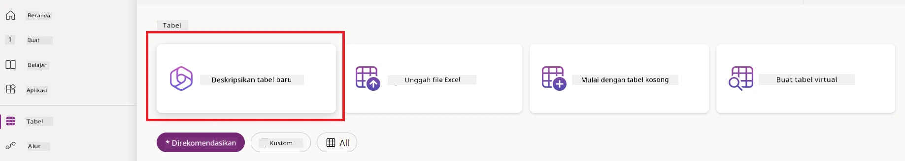

1. Pada layar **Describe the new Table**, gunakan area teks untuk mendeskripsikan tabel yang ingin Anda buat. Misalnya, **_Saya ingin membuat tabel untuk menyimpan informasi faktur_**. Klik tombol **Send** untuk mengirim prompt ke AI Copilot.

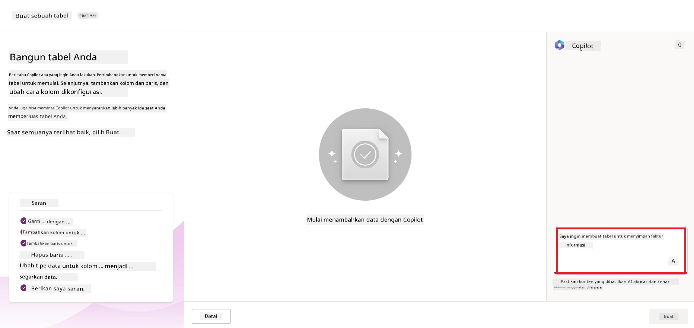

1. AI Copilot akan menyarankan sebuah Tabel Dataverse dengan kolom yang Anda butuhkan untuk menyimpan data yang ingin Anda lacak serta beberapa data contoh. Anda kemudian dapat menyesuaikan tabel sesuai kebutuhan menggunakan fitur asisten AI Copilot melalui langkah-langkah percakapan.

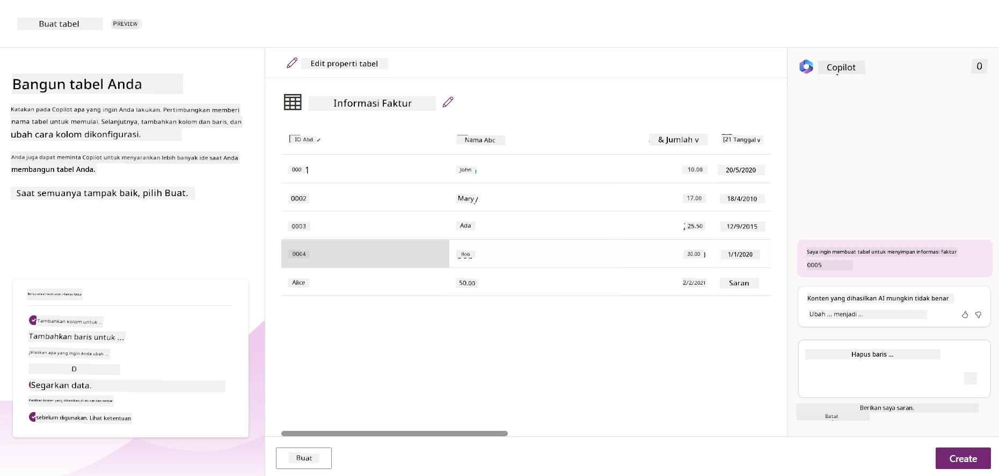

1. Tim keuangan ingin mengirim email ke pemasok untuk memperbarui mereka dengan status faktur saat ini. Anda dapat menggunakan Copilot untuk menambahkan kolom baru ke tabel untuk menyimpan email pemasok. Misalnya, Anda dapat menggunakan prompt berikut untuk menambahkan kolom baru ke tabel: **_Saya ingin menambahkan kolom untuk menyimpan email pemasok_**. Klik tombol **Send** untuk mengirim prompt ke AI Copilot.

1. AI Copilot akan membuat kolom baru dan Anda kemudian dapat menyesuaikan kolom tersebut sesuai kebutuhan Anda.

1. Setelah Anda selesai dengan tabel, klik tombol **Create** untuk membuat tabel.

## Model AI di Power Platform dengan AI Builder

AI Builder adalah kemampuan AI low-code yang tersedia di Power Platform yang memungkinkan Anda menggunakan Model AI untuk membantu mengotomatisasi proses dan memprediksi hasil. Dengan AI Builder Anda dapat membawa AI ke aplikasi dan alur kerja Anda yang terhubung ke data di Dataverse atau di berbagai sumber data cloud, seperti SharePoint, OneDrive, atau Azure.

## Model AI Prebuilt vs Model AI Kustom

AI Builder menyediakan dua jenis Model AI: Model AI Prebuilt dan Model AI Kustom. Model AI Prebuilt adalah model AI siap pakai yang dilatih oleh Microsoft dan tersedia di Power Platform. Model ini membantu Anda menambahkan kecerdasan ke aplikasi dan alur tanpa harus mengumpulkan data lalu membangun, melatih, dan menerbitkan model Anda sendiri. Anda dapat menggunakan model ini untuk mengotomatisasi proses dan memprediksi hasil.

Beberapa Model AI Prebuilt yang tersedia di Power Platform antara lain:

- **Ekstraksi Frasa Kunci**: Model ini mengekstrak frasa kunci dari teks.
- **Deteksi Bahasa**: Model ini mendeteksi bahasa dari sebuah teks.
- **Analisis Sentimen**: Model ini mendeteksi sentimen positif, negatif, netral, atau campuran dalam teks.
- **Pembaca Kartu Bisnis**: Model ini mengekstrak informasi dari kartu bisnis.
- **Pengenalan Teks**: Model ini mengekstrak teks dari gambar.
- **Deteksi Objek**: Model ini mendeteksi dan mengekstrak objek dari gambar.
- **Pemrosesan Dokumen**: Model ini mengekstrak informasi dari formulir.
- **Pemrosesan Faktur**: Model ini mengekstrak informasi dari faktur.

Dengan Model AI Kustom, Anda dapat membawa model Anda sendiri ke AI Builder sehingga dapat berfungsi seperti model kustom AI Builder lainnya, memungkinkan Anda melatih model menggunakan data Anda sendiri. Model ini dapat digunakan untuk mengotomatisasi proses dan memprediksi hasil baik di Power Apps maupun Power Automate. Saat menggunakan model Anda sendiri, ada batasan yang berlaku. Baca lebih lanjut tentang [batasan ini](https://learn.microsoft.com/ai-builder/byo-model#limitations?WT.mc_id=academic-105485-koreyst).

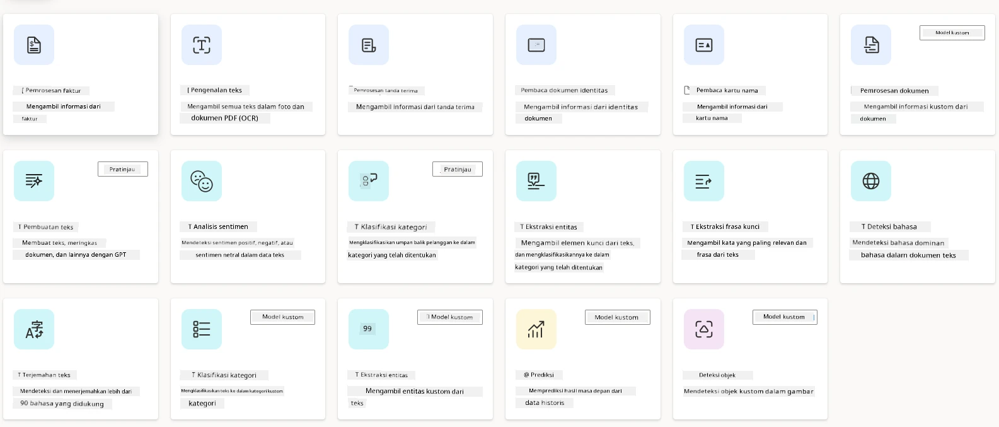

## Tugas #2 - Bangun Alur Pemrosesan Faktur untuk Startup Kami

Tim keuangan mengalami kesulitan untuk memproses faktur. Mereka telah menggunakan spreadsheet untuk melacak faktur tetapi hal ini menjadi sulit untuk dikelola seiring bertambahnya jumlah faktur. Mereka meminta Anda untuk membuat alur kerja yang akan membantu mereka memproses faktur menggunakan AI. Alur kerja ini harus memungkinkan mereka mengekstrak informasi dari faktur dan menyimpan informasi tersebut dalam tabel Dataverse. Alur kerja ini juga harus memungkinkan mereka mengirim email ke tim keuangan dengan informasi yang telah diekstrak.

Sekarang bahwa Anda tahu apa itu AI Builder dan mengapa harus menggunakannya, mari lihat bagaimana Anda dapat menggunakan Model AI Pemrosesan Faktur di AI Builder, yang sudah kita bahas sebelumnya, untuk membuat alur kerja yang akan membantu tim keuangan memproses faktur.

Untuk membangun alur kerja yang akan membantu tim keuangan memproses faktur menggunakan Model AI Pemrosesan Faktur di AI Builder, ikuti langkah-langkah berikut:

1. Buka layar beranda [Power Automate](https://make.powerautomate.com?WT.mc_id=academic-105485-koreyst).

2. Gunakan area teks di layar beranda untuk mendeskripsikan alur kerja yang ingin Anda buat. Misalnya, **_Proses faktur saat tiba di kotak masuk saya_**. Klik tombol **Send** untuk mengirim prompt ke AI Copilot.

   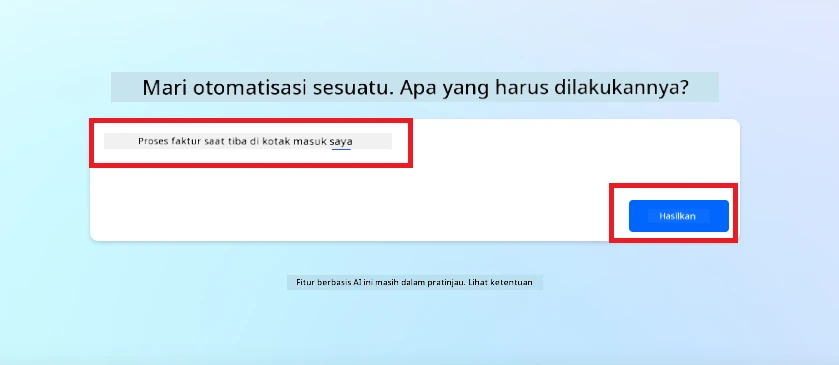

3. AI Copilot akan menyarankan tindakan yang Anda perlukan untuk melaksanakan tugas yang ingin Anda otomatisasi. Anda dapat klik tombol **Next** untuk melanjutkan ke langkah berikutnya.

4. Pada langkah berikutnya, Power Automate akan meminta Anda mengatur koneksi yang diperlukan untuk alur tersebut. Setelah selesai, klik tombol **Create flow** untuk membuat alur.

5. AI Copilot akan membuat alur kerja dan Anda kemudian dapat menyesuaikan alur tersebut sesuai kebutuhan Anda.

6. Perbarui pemicu alur dan atur **Folder** ke folder tempat faktur akan disimpan. Misalnya, Anda dapat mengatur folder ke **Inbox**. Klik **Show advanced options** dan atur **Only with Attachments** ke **Yes**. Ini akan memastikan alur hanya berjalan ketika email dengan lampiran diterima di folder tersebut.

7. Hapus tindakan berikut dari alur: **HTML to text**, **Compose**, **Compose 2**, **Compose 3**, dan **Compose 4** karena Anda tidak akan menggunakannya.

8. Hapus tindakan **Condition** dari alur karena Anda tidak akan menggunakannya. Tampilan harus seperti tangkapan layar berikut:

   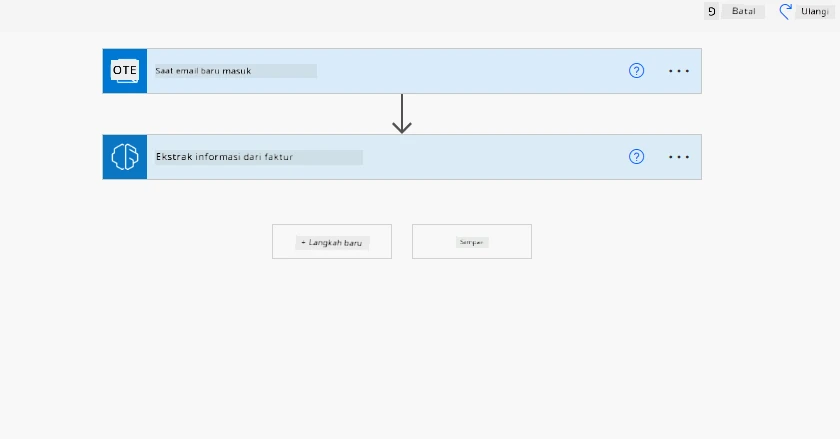

9. Klik tombol **Add an action** dan cari **Dataverse**. Pilih tindakan **Add a new row**.

10. Pada tindakan **Extract Information from invoices**, perbarui **Invoice File** untuk mengarah ke **Attachment Content** dari email. Ini akan memastikan alur mengekstrak informasi dari lampiran faktur.

11. Pilih **Table** yang Anda buat sebelumnya. Misalnya, pilih tabel **Invoice Information**. Pilih konten dinamis dari tindakan sebelumnya untuk mengisi kolom berikut:

    - ID
    - Amount
    - Date
    - Name
    - Status - Atur **Status** ke **Pending**.
    - Supplier Email - Gunakan konten dinamis **From** dari pemicu **When a new email arrives**.

    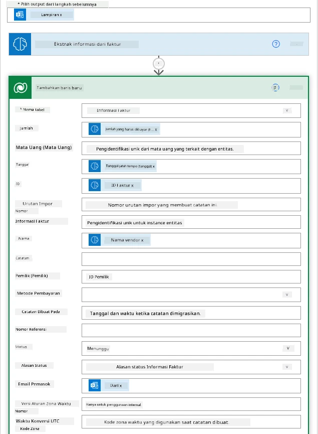

12. Setelah Anda selesai dengan alur, klik tombol **Save** untuk menyimpan alur. Anda kemudian dapat menguji alur tersebut dengan mengirim email yang berisi faktur ke folder yang Anda tentukan pada pemicu.

> **Pekerjaan rumah Anda**: Alur yang baru saja Anda buat adalah awal yang baik, kini pikirkan bagaimana Anda dapat membangun otomatisasi yang memungkinkan tim keuangan kita mengirim email kepada pemasok untuk memperbarui mereka dengan status faktur saat ini. Petunjuk Anda: alur harus berjalan saat status faktur berubah.

## Gunakan Model AI Pembuatan Teks di Power Automate

Model AI Create Text with GPT di AI Builder memungkinkan Anda menghasilkan teks berdasarkan prompt dan didukung oleh Layanan Microsoft Azure OpenAI. Dengan kapabilitas ini, Anda dapat menggabungkan teknologi GPT (Generative Pre-Trained Transformer) ke dalam aplikasi dan alur kerja Anda untuk membangun berbagai alur otomatis dan aplikasi yang penuh wawasan.

Model GPT menjalani pelatihan intensif pada sejumlah besar data, memungkinkan mereka menghasilkan teks yang sangat mirip bahasa manusia saat diberikan prompt. Ketika terintegrasi dengan otomatisasi alur kerja, model AI seperti GPT dapat dimanfaatkan untuk menyederhanakan dan mengotomatisasi berbagai tugas.

Sebagai contoh, Anda dapat membangun alur untuk secara otomatis menghasilkan teks untuk berbagai kasus penggunaan, seperti rancangan email, deskripsi produk, dan lainnya. Anda juga dapat menggunakan model ini untuk menghasilkan teks untuk berbagai aplikasi, seperti chatbot dan aplikasi layanan pelanggan yang memungkinkan agen layanan pelanggan merespon pertanyaan pelanggan secara efektif dan efisien.

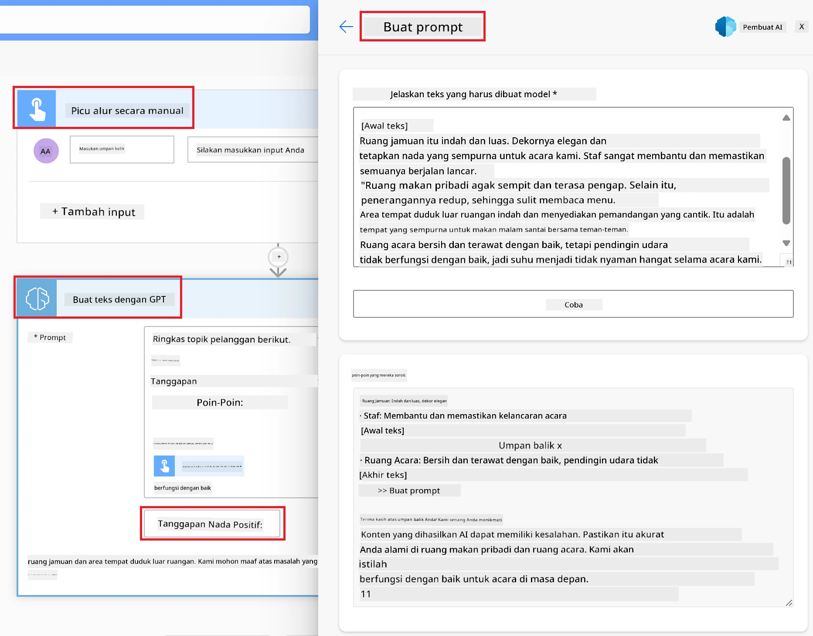

Untuk mempelajari cara menggunakan Model AI ini di Power Automate, pelajari modul [Tambahkan kecerdasan dengan AI Builder dan GPT](https://learn.microsoft.com/training/modules/ai-builder-text-generation/?WT.mc_id=academic-109639-somelezediko).

## Kerja Bagus! Lanjutkan Pembelajaran Anda

Setelah menyelesaikan pelajaran ini, lihat koleksi [Pembelajaran AI Generatif](https://aka.ms/genai-collection?WT.mc_id=academic-105485-koreyst) kami untuk terus meningkatkan pengetahuan AI Generatif Anda!

Ingin menyesuaikan dan mendapatkan lebih banyak dari Copilot? Jelajahi [Awesome Copilot](https://github.com/github/awesome-copilot?WT.mc_id=academic-105485-koreyst) — koleksi kontribusi komunitas berisi instruksi, agen, keterampilan, dan konfigurasi untuk membantu Anda memaksimalkan GitHub Copilot.

Langsung saja ke Pelajaran 11 di mana kita akan melihat cara [mengintegrasikan AI Generatif dengan Function Calling](../11-integrating-with-function-calling/README.md?WT.mc_id=academic-105485-koreyst)!

---

<!-- CO-OP TRANSLATOR DISCLAIMER START -->
**Penafian**:
Dokumen ini telah diterjemahkan menggunakan layanan terjemahan AI [Co-op Translator](https://github.com/Azure/co-op-translator). Meskipun kami berupaya untuk mencapai akurasi, harap diketahui bahwa terjemahan otomatis mungkin mengandung kesalahan atau ketidakakuratan. Dokumen asli dalam bahasa aslinya harus dianggap sebagai sumber yang sah. Untuk informasi penting, disarankan menggunakan terjemahan profesional oleh manusia. Kami tidak bertanggung jawab atas kesalahpahaman atau penafsiran yang keliru yang timbul dari penggunaan terjemahan ini.
<!-- CO-OP TRANSLATOR DISCLAIMER END -->