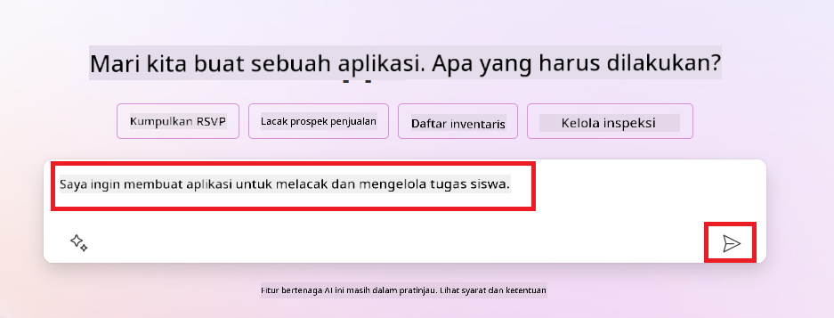
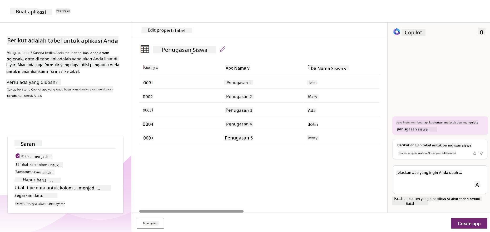
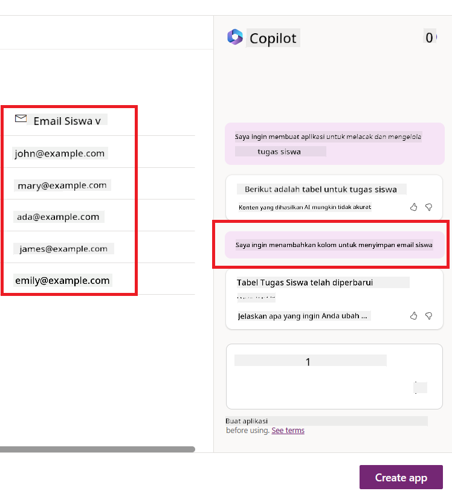
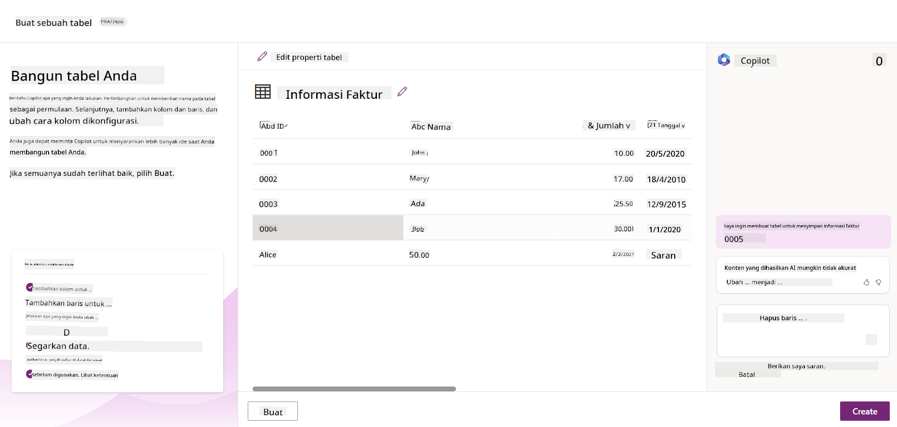

<!--
CO_OP_TRANSLATOR_METADATA:
{
  "original_hash": "f5ff3b6204a695a117d6f452403c95f7",
  "translation_date": "2025-07-09T14:07:21+00:00",
  "source_file": "10-building-low-code-ai-applications/README.md",
  "language_code": "id"
}
-->
# Membangun Aplikasi AI Low Code

> _(Klik gambar di atas untuk menonton video pelajaran ini)_

## Pendahuluan

Sekarang setelah kita belajar cara membangun aplikasi pembuat gambar, mari kita bahas tentang low code. Generative AI dapat digunakan untuk berbagai bidang termasuk low code, tapi apa itu low code dan bagaimana kita bisa menambahkan AI ke dalamnya?

Membangun aplikasi dan solusi menjadi lebih mudah bagi pengembang tradisional maupun non-pengembang melalui penggunaan Platform Pengembangan Low Code. Platform Pengembangan Low Code memungkinkan Anda membangun aplikasi dan solusi dengan sedikit atau tanpa kode sama sekali. Hal ini dicapai dengan menyediakan lingkungan pengembangan visual yang memungkinkan Anda menyeret dan melepaskan komponen untuk membangun aplikasi dan solusi. Ini memungkinkan Anda membangun aplikasi dan solusi lebih cepat dan dengan sumber daya yang lebih sedikit. Dalam pelajaran ini, kita akan mendalami cara menggunakan Low Code dan bagaimana meningkatkan pengembangan low code dengan AI menggunakan Power Platform.

Power Platform memberikan kesempatan bagi organisasi untuk memberdayakan tim mereka membangun solusi sendiri melalui lingkungan low-code atau no-code yang intuitif. Lingkungan ini membantu menyederhanakan proses pembangunan solusi. Dengan Power Platform, solusi dapat dibangun dalam hitungan hari atau minggu, bukan bulan atau tahun. Power Platform terdiri dari lima produk utama: Power Apps, Power Automate, Power BI, Power Pages, dan Copilot Studio.

Pelajaran ini mencakup:

- Pengenalan Generative AI di Power Platform  
- Pengenalan Copilot dan cara menggunakannya  
- Menggunakan Generative AI untuk membangun aplikasi dan alur kerja di Power Platform  
- Memahami Model AI di Power Platform dengan AI Builder  

## Tujuan Pembelajaran

Pada akhir pelajaran ini, Anda akan dapat:

- Memahami cara kerja Copilot di Power Platform.  
- Membangun Aplikasi Pelacak Tugas Siswa untuk startup pendidikan kita.  
- Membangun Alur Pemrosesan Faktur yang menggunakan AI untuk mengekstrak informasi dari faktur.  
- Menerapkan praktik terbaik saat menggunakan Model AI Create Text dengan GPT.  

Alat dan teknologi yang akan Anda gunakan dalam pelajaran ini adalah:

- **Power Apps**, untuk aplikasi Pelacak Tugas Siswa, yang menyediakan lingkungan pengembangan low-code untuk membangun aplikasi guna melacak, mengelola, dan berinteraksi dengan data.  
- **Dataverse**, untuk menyimpan data aplikasi Pelacak Tugas Siswa di mana Dataverse menyediakan platform data low-code untuk menyimpan data aplikasi.  
- **Power Automate**, untuk alur Pemrosesan Faktur di mana Anda akan memiliki lingkungan pengembangan low-code untuk membangun alur kerja yang mengotomatisasi proses Pemrosesan Faktur.  
- **AI Builder**, untuk Model AI Pemrosesan Faktur di mana Anda akan menggunakan Model AI yang sudah dibuat sebelumnya untuk memproses faktur startup kita.  

## Generative AI di Power Platform

Meningkatkan pengembangan low-code dan aplikasi dengan generative AI adalah fokus utama Power Platform. Tujuannya adalah memungkinkan semua orang membangun aplikasi, situs, dashboard yang didukung AI, dan mengotomatisasi proses dengan AI, _tanpa memerlukan keahlian data science_. Tujuan ini dicapai dengan mengintegrasikan generative AI ke dalam pengalaman pengembangan low-code di Power Platform dalam bentuk Copilot dan AI Builder.

### Bagaimana cara kerjanya?

Copilot adalah asisten AI yang memungkinkan Anda membangun solusi Power Platform dengan menjelaskan kebutuhan Anda dalam serangkaian langkah percakapan menggunakan bahasa alami. Misalnya, Anda bisa menginstruksikan asisten AI Anda untuk menyebutkan bidang apa saja yang akan digunakan aplikasi Anda dan Copilot akan membuat aplikasi serta model data dasarnya, atau Anda bisa menentukan bagaimana mengatur alur di Power Automate.

Anda dapat menggunakan fungsi yang digerakkan oleh Copilot sebagai fitur di layar aplikasi Anda untuk memungkinkan pengguna menemukan wawasan melalui interaksi percakapan.

AI Builder adalah kemampuan AI low-code yang tersedia di Power Platform yang memungkinkan Anda menggunakan Model AI untuk membantu mengotomatisasi proses dan memprediksi hasil. Dengan AI Builder Anda dapat membawa AI ke aplikasi dan alur kerja yang terhubung ke data Anda di Dataverse atau berbagai sumber data cloud, seperti SharePoint, OneDrive, atau Azure.

Copilot tersedia di semua produk Power Platform: Power Apps, Power Automate, Power BI, Power Pages, dan Power Virtual Agents. AI Builder tersedia di Power Apps dan Power Automate. Dalam pelajaran ini, kita akan fokus pada cara menggunakan Copilot dan AI Builder di Power Apps dan Power Automate untuk membangun solusi bagi startup pendidikan kita.

### Copilot di Power Apps

Sebagai bagian dari Power Platform, Power Apps menyediakan lingkungan pengembangan low-code untuk membangun aplikasi guna melacak, mengelola, dan berinteraksi dengan data. Ini adalah rangkaian layanan pengembangan aplikasi dengan platform data yang dapat diskalakan dan kemampuan untuk terhubung ke layanan cloud dan data on-premises. Power Apps memungkinkan Anda membangun aplikasi yang berjalan di browser, tablet, dan ponsel, serta dapat dibagikan dengan rekan kerja. Power Apps memudahkan pengguna dalam pengembangan aplikasi dengan antarmuka sederhana, sehingga setiap pengguna bisnis atau pengembang profesional dapat membangun aplikasi kustom. Pengalaman pengembangan aplikasi juga ditingkatkan dengan Generative AI melalui Copilot.

Fitur asisten AI Copilot di Power Apps memungkinkan Anda mendeskripsikan jenis aplikasi yang Anda butuhkan dan informasi apa yang ingin dilacak, dikumpulkan, atau ditampilkan oleh aplikasi Anda. Copilot kemudian menghasilkan aplikasi Canvas responsif berdasarkan deskripsi Anda. Anda kemudian dapat menyesuaikan aplikasi tersebut sesuai kebutuhan. AI Copilot juga menghasilkan dan menyarankan Tabel Dataverse dengan bidang yang Anda perlukan untuk menyimpan data yang ingin dilacak beserta beberapa data contoh. Kita akan membahas apa itu Dataverse dan bagaimana Anda dapat menggunakannya di Power Apps dalam pelajaran ini nanti. Anda kemudian dapat menyesuaikan tabel tersebut sesuai kebutuhan menggunakan fitur asisten AI Copilot melalui langkah-langkah percakapan. Fitur ini tersedia langsung dari layar beranda Power Apps.

### Copilot di Power Automate

Sebagai bagian dari Power Platform, Power Automate memungkinkan pengguna membuat alur kerja otomatis antara aplikasi dan layanan. Ini membantu mengotomatisasi proses bisnis yang berulang seperti komunikasi, pengumpulan data, dan persetujuan keputusan. Antarmuka yang sederhana memungkinkan pengguna dengan berbagai tingkat keahlian teknis (dari pemula hingga pengembang berpengalaman) untuk mengotomatisasi tugas kerja. Pengalaman pengembangan alur kerja juga ditingkatkan dengan Generative AI melalui Copilot.

Fitur asisten AI Copilot di Power Automate memungkinkan Anda mendeskripsikan jenis alur yang Anda butuhkan dan tindakan apa yang ingin dilakukan oleh alur tersebut. Copilot kemudian menghasilkan alur berdasarkan deskripsi Anda. Anda kemudian dapat menyesuaikan alur tersebut sesuai kebutuhan. AI Copilot juga menghasilkan dan menyarankan tindakan yang Anda perlukan untuk menyelesaikan tugas yang ingin Anda otomatisasi. Kita akan membahas apa itu alur dan bagaimana Anda dapat menggunakannya di Power Automate dalam pelajaran ini nanti. Anda kemudian dapat menyesuaikan tindakan tersebut sesuai kebutuhan menggunakan fitur asisten AI Copilot melalui langkah-langkah percakapan. Fitur ini tersedia langsung dari layar beranda Power Automate.

## Tugas: Kelola tugas siswa dan faktur untuk startup kita, menggunakan Copilot

Startup kami menyediakan kursus online untuk siswa. Startup ini berkembang pesat dan kini kesulitan memenuhi permintaan kursusnya. Startup telah mempekerjakan Anda sebagai pengembang Power Platform untuk membantu mereka membangun solusi low code yang membantu mengelola tugas siswa dan faktur mereka. Solusi mereka harus dapat membantu melacak dan mengelola tugas siswa melalui aplikasi dan mengotomatisasi proses pemrosesan faktur melalui alur kerja. Anda diminta menggunakan Generative AI untuk mengembangkan solusi tersebut.

Saat Anda mulai menggunakan Copilot, Anda dapat menggunakan [Power Platform Copilot Prompt Library](https://github.com/pnp/powerplatform-prompts?WT.mc_id=academic-109639-somelezediko) untuk memulai dengan prompt yang tersedia. Perpustakaan ini berisi daftar prompt yang dapat Anda gunakan untuk membangun aplikasi dan alur kerja dengan Copilot. Anda juga dapat menggunakan prompt di perpustakaan untuk mendapatkan gambaran bagaimana mendeskripsikan kebutuhan Anda kepada Copilot.

### Membangun Aplikasi Pelacak Tugas Siswa untuk Startup Kita

Para pendidik di startup kami kesulitan melacak tugas siswa. Mereka menggunakan spreadsheet untuk melacak tugas, tapi ini menjadi sulit dikelola seiring bertambahnya jumlah siswa. Mereka meminta Anda membangun aplikasi yang membantu melacak dan mengelola tugas siswa. Aplikasi harus memungkinkan mereka menambahkan tugas baru, melihat tugas, memperbarui tugas, dan menghapus tugas. Aplikasi juga harus memungkinkan pendidik dan siswa melihat tugas yang sudah dinilai dan yang belum dinilai.

Anda akan membangun aplikasi menggunakan Copilot di Power Apps dengan mengikuti langkah-langkah berikut:

1. Buka layar beranda [Power Apps](https://make.powerapps.com?WT.mc_id=academic-105485-koreyst).

1. Gunakan area teks di layar beranda untuk mendeskripsikan aplikasi yang ingin Anda buat. Misalnya, **_Saya ingin membangun aplikasi untuk melacak dan mengelola tugas siswa_**. Klik tombol **Send** untuk mengirim prompt ke AI Copilot.

1. AI Copilot akan menyarankan Tabel Dataverse dengan bidang yang Anda perlukan untuk menyimpan data yang ingin dilacak beserta beberapa data contoh. Anda kemudian dapat menyesuaikan tabel tersebut sesuai kebutuhan menggunakan fitur asisten AI Copilot melalui langkah-langkah percakapan.

   > **Penting**: Dataverse adalah platform data dasar untuk Power Platform. Ini adalah platform data low-code untuk menyimpan data aplikasi. Ini adalah layanan yang sepenuhnya dikelola yang menyimpan data dengan aman di Microsoft Cloud dan disediakan dalam lingkungan Power Platform Anda. Dataverse dilengkapi dengan kemampuan tata kelola data bawaan, seperti klasifikasi data, garis keturunan data, kontrol akses yang terperinci, dan lainnya. Anda dapat mempelajari lebih lanjut tentang Dataverse [di sini](https://docs.microsoft.com/powerapps/maker/data-platform/data-platform-intro?WT.mc_id=academic-109639-somelezediko).

   

1. Para pendidik ingin mengirim email kepada siswa yang telah mengumpulkan tugas mereka untuk memberi informasi tentang perkembangan tugas tersebut. Anda dapat menggunakan Copilot untuk menambahkan kolom baru ke tabel untuk menyimpan email siswa. Misalnya, Anda dapat menggunakan prompt berikut untuk menambahkan kolom baru ke tabel: **_Saya ingin menambahkan kolom untuk menyimpan email siswa_**. Klik tombol **Send** untuk mengirim prompt ke AI Copilot.

1. AI Copilot akan membuat kolom baru dan Anda dapat menyesuaikan kolom tersebut sesuai kebutuhan.

1. Setelah selesai dengan tabel, klik tombol **Create app** untuk membuat aplikasi.

1. AI Copilot akan menghasilkan aplikasi Canvas responsif berdasarkan deskripsi Anda. Anda kemudian dapat menyesuaikan aplikasi tersebut sesuai kebutuhan.

1. Untuk memungkinkan pendidik mengirim email ke siswa, Anda dapat menggunakan Copilot untuk menambahkan layar baru ke aplikasi. Misalnya, Anda dapat menggunakan prompt berikut untuk menambahkan layar baru ke aplikasi: **_Saya ingin menambahkan layar untuk mengirim email ke siswa_**. Klik tombol **Send** untuk mengirim prompt ke AI Copilot.

1. AI Copilot akan membuat layar baru dan Anda dapat menyesuaikan layar tersebut sesuai kebutuhan.

1. Setelah selesai dengan aplikasi, klik tombol **Save** untuk menyimpan aplikasi.

1. Untuk membagikan aplikasi dengan para pendidik, klik tombol **Share** lalu klik tombol **Share** lagi. Anda kemudian dapat membagikan aplikasi dengan para pendidik dengan memasukkan alamat email mereka.

> **Pekerjaan rumah Anda**: Aplikasi yang baru saja Anda buat adalah awal yang baik tapi masih bisa ditingkatkan. Dengan fitur email, pendidik hanya bisa mengirim email ke siswa secara manual dengan mengetik alamat email mereka. Bisakah Anda menggunakan Copilot untuk membangun otomatisasi yang memungkinkan pendidik mengirim email ke siswa secara otomatis saat mereka mengumpulkan tugas? Petunjuknya adalah dengan prompt yang tepat Anda bisa menggunakan Copilot di Power Automate untuk membangunnya.

### Membangun Tabel Informasi Faktur untuk Startup Kita

Tim keuangan startup kami kesulitan melacak faktur. Mereka menggunakan spreadsheet untuk melacak faktur, tapi ini menjadi sulit dikelola seiring bertambahnya jumlah faktur. Mereka meminta Anda membangun tabel yang membantu menyimpan, melacak, dan mengelola informasi faktur yang mereka terima. Tabel ini akan digunakan untuk membangun otomatisasi yang mengekstrak semua informasi faktur dan menyimpannya di tabel. Tabel juga harus memungkinkan tim keuangan melihat faktur yang sudah dibayar dan yang belum dibayar.

Power Platform memiliki platform data dasar bernama Dataverse yang memungkinkan Anda menyimpan data untuk aplikasi dan solusi Anda. Dataverse menyediakan platform data low-code untuk menyimpan data aplikasi. Ini adalah layanan yang sepenuhnya dikelola yang menyimpan data dengan aman di Microsoft Cloud dan disediakan dalam lingkungan Power Platform Anda. Dataverse dilengkapi dengan kemampuan tata kelola data bawaan, seperti klasifikasi data, garis keturunan data, kontrol akses yang terperinci, dan lainnya. Anda dapat mempelajari lebih lanjut [tentang Dataverse di sini](https://docs.microsoft.com/powerapps/maker/data-platform/data-platform-intro?WT.mc_id=academic-109639-somelezediko).

Mengapa kita harus menggunakan Dataverse untuk startup kita? Tabel standar dan kustom dalam Dataverse menyediakan opsi penyimpanan yang aman dan berbasis cloud untuk data Anda. Tabel memungkinkan Anda menyimpan berbagai jenis data, mirip dengan bagaimana Anda menggunakan beberapa lembar kerja dalam satu buku kerja Excel. Anda dapat menggunakan tabel untuk menyimpan data yang spesifik untuk organisasi atau kebutuhan bisnis Anda. Beberapa manfaat yang akan didapat startup kita dari penggunaan Dataverse antara lain:
- **Mudah dikelola**: Baik metadata maupun data disimpan di cloud, jadi Anda tidak perlu khawatir tentang detail bagaimana data tersebut disimpan atau dikelola. Anda bisa fokus membangun aplikasi dan solusi Anda.

- **Aman**: Dataverse menyediakan opsi penyimpanan yang aman dan berbasis cloud untuk data Anda. Anda dapat mengontrol siapa yang memiliki akses ke data dalam tabel Anda dan bagaimana mereka dapat mengaksesnya menggunakan keamanan berbasis peran.

- **Metadata yang kaya**: Tipe data dan hubungan digunakan langsung di dalam Power Apps

- **Logika dan validasi**: Anda dapat menggunakan aturan bisnis, kolom terhitung, dan aturan validasi untuk menegakkan logika bisnis dan menjaga akurasi data.

Sekarang setelah Anda tahu apa itu Dataverse dan mengapa Anda harus menggunakannya, mari kita lihat bagaimana Anda dapat menggunakan Copilot untuk membuat tabel di Dataverse sesuai kebutuhan tim keuangan kita.

> **Note** : Anda akan menggunakan tabel ini di bagian berikutnya untuk membangun otomatisasi yang akan mengekstrak semua informasi faktur dan menyimpannya di tabel.

Untuk membuat tabel di Dataverse menggunakan Copilot, ikuti langkah-langkah berikut:

1. Buka layar beranda [Power Apps](https://make.powerapps.com?WT.mc_id=academic-105485-koreyst).

2. Pada bilah navigasi kiri, pilih **Tables** lalu klik **Describe the new Table**.

3. Pada layar **Describe the new Table**, gunakan area teks untuk mendeskripsikan tabel yang ingin Anda buat. Misalnya, **_Saya ingin membuat tabel untuk menyimpan informasi faktur_**. Klik tombol **Send** untuk mengirimkan perintah ke AI Copilot.

4. AI Copilot akan menyarankan sebuah Tabel Dataverse dengan kolom-kolom yang Anda butuhkan untuk menyimpan data yang ingin Anda lacak beserta beberapa contoh data. Anda kemudian dapat menyesuaikan tabel tersebut sesuai kebutuhan menggunakan fitur asisten AI Copilot melalui langkah-langkah percakapan.

5. Tim keuangan ingin mengirim email ke pemasok untuk memberi tahu mereka tentang status terkini faktur mereka. Anda dapat menggunakan Copilot untuk menambahkan kolom baru ke tabel untuk menyimpan email pemasok. Misalnya, Anda bisa menggunakan perintah berikut untuk menambahkan kolom baru ke tabel: **_Saya ingin menambahkan kolom untuk menyimpan email pemasok_**. Klik tombol **Send** untuk mengirim perintah ke AI Copilot.

6. AI Copilot akan membuat kolom baru dan Anda dapat menyesuaikan kolom tersebut sesuai kebutuhan.

7. Setelah selesai dengan tabel, klik tombol **Create** untuk membuat tabel.

## Model AI di Power Platform dengan AI Builder

AI Builder adalah kemampuan AI low-code yang tersedia di Power Platform yang memungkinkan Anda menggunakan Model AI untuk membantu mengotomatisasi proses dan memprediksi hasil. Dengan AI Builder, Anda dapat menghadirkan AI ke aplikasi dan alur kerja Anda yang terhubung ke data di Dataverse atau berbagai sumber data cloud, seperti SharePoint, OneDrive, atau Azure.

## Model AI Prebuilt vs Model AI Kustom

AI Builder menyediakan dua jenis Model AI: Model AI Prebuilt dan Model AI Kustom. Model AI Prebuilt adalah model siap pakai yang dilatih oleh Microsoft dan tersedia di Power Platform. Model ini membantu Anda menambahkan kecerdasan ke aplikasi dan alur kerja tanpa harus mengumpulkan data, membangun, melatih, dan menerbitkan model Anda sendiri. Anda dapat menggunakan model ini untuk mengotomatisasi proses dan memprediksi hasil.

Beberapa Model AI Prebuilt yang tersedia di Power Platform meliputi:

- **Key Phrase Extraction**: Model ini mengekstrak frasa kunci dari teks.
- **Language Detection**: Model ini mendeteksi bahasa dari sebuah teks.
- **Sentiment Analysis**: Model ini mendeteksi sentimen positif, negatif, netral, atau campuran dalam teks.
- **Business Card Reader**: Model ini mengekstrak informasi dari kartu nama.
- **Text Recognition**: Model ini mengekstrak teks dari gambar.
- **Object Detection**: Model ini mendeteksi dan mengekstrak objek dari gambar.
- **Document processing**: Model ini mengekstrak informasi dari formulir.
- **Invoice Processing**: Model ini mengekstrak informasi dari faktur.

Dengan Model AI Kustom, Anda dapat membawa model Anda sendiri ke AI Builder sehingga dapat berfungsi seperti model AI Builder kustom lainnya, memungkinkan Anda melatih model menggunakan data Anda sendiri. Anda dapat menggunakan model ini untuk mengotomatisasi proses dan memprediksi hasil baik di Power Apps maupun Power Automate. Saat menggunakan model Anda sendiri, ada batasan yang berlaku. Baca lebih lanjut tentang [batasan ini](https://learn.microsoft.com/ai-builder/byo-model#limitations?WT.mc_id=academic-105485-koreyst).

## Tugas #2 - Bangun Alur Pemrosesan Faktur untuk Startup Kami

Tim keuangan mengalami kesulitan dalam memproses faktur. Mereka menggunakan spreadsheet untuk melacak faktur, namun hal ini menjadi sulit dikelola seiring bertambahnya jumlah faktur. Mereka meminta Anda untuk membangun alur kerja yang membantu mereka memproses faktur menggunakan AI. Alur kerja ini harus memungkinkan mereka mengekstrak informasi dari faktur dan menyimpan informasi tersebut di tabel Dataverse. Alur kerja juga harus memungkinkan mereka mengirim email ke tim keuangan dengan informasi yang telah diekstrak.

Sekarang setelah Anda tahu apa itu AI Builder dan mengapa Anda harus menggunakannya, mari kita lihat bagaimana Anda dapat menggunakan Model AI Invoice Processing di AI Builder, yang telah kita bahas sebelumnya, untuk membangun alur kerja yang membantu tim keuangan memproses faktur.

Untuk membangun alur kerja yang membantu tim keuangan memproses faktur menggunakan Model AI Invoice Processing di AI Builder, ikuti langkah-langkah berikut:

1. Buka layar beranda [Power Automate](https://make.powerautomate.com?WT.mc_id=academic-105485-koreyst).

2. Gunakan area teks di layar beranda untuk mendeskripsikan alur kerja yang ingin Anda buat. Misalnya, **_Proses faktur saat tiba di kotak masuk saya_**. Klik tombol **Send** untuk mengirim perintah ke AI Copilot.

   

3. AI Copilot akan menyarankan tindakan yang perlu Anda lakukan untuk mengotomatisasi tugas yang Anda inginkan. Anda dapat klik tombol **Next** untuk melanjutkan ke langkah berikutnya.

4. Pada langkah berikutnya, Power Automate akan meminta Anda mengatur koneksi yang diperlukan untuk alur kerja. Setelah selesai, klik tombol **Create flow** untuk membuat alur kerja.

5. AI Copilot akan membuat alur kerja dan Anda dapat menyesuaikan alur tersebut sesuai kebutuhan.

6. Perbarui trigger alur dan atur **Folder** ke folder tempat faktur akan disimpan. Misalnya, Anda dapat mengatur folder ke **Inbox**. Klik **Show advanced options** dan atur **Only with Attachments** ke **Yes**. Ini memastikan alur hanya berjalan saat email dengan lampiran diterima di folder tersebut.

7. Hapus tindakan berikut dari alur: **HTML to text**, **Compose**, **Compose 2**, **Compose 3**, dan **Compose 4** karena Anda tidak akan menggunakannya.

8. Hapus tindakan **Condition** dari alur karena Anda tidak akan menggunakannya. Tampilan alur akan seperti pada tangkapan layar berikut:

   

9. Klik tombol **Add an action** dan cari **Dataverse**. Pilih tindakan **Add a new row**.

10. Pada tindakan **Extract Information from invoices**, perbarui **Invoice File** agar mengarah ke **Attachment Content** dari email. Ini memastikan alur mengekstrak informasi dari lampiran faktur.

11. Pilih **Table** yang Anda buat sebelumnya. Misalnya, pilih tabel **Invoice Information**. Pilih konten dinamis dari tindakan sebelumnya untuk mengisi kolom berikut:

    - ID
    - Amount
    - Date
    - Name
    - Status - Atur **Status** ke **Pending**.
    - Supplier Email - Gunakan konten dinamis **From** dari trigger **When a new email arrives**.

    

12. Setelah selesai dengan alur, klik tombol **Save** untuk menyimpan alur. Anda dapat menguji alur dengan mengirim email berisi faktur ke folder yang Anda tentukan di trigger.

> **Pekerjaan rumah Anda**: Alur yang baru saja Anda buat adalah awal yang baik, sekarang Anda perlu memikirkan bagaimana membangun otomatisasi yang memungkinkan tim keuangan kita mengirim email ke pemasok untuk memberi tahu mereka tentang status terkini faktur mereka. Petunjuk: alur harus berjalan saat status faktur berubah.

## Gunakan Model AI Text Generation di Power Automate

Model Create Text with GPT di AI Builder memungkinkan Anda menghasilkan teks berdasarkan prompt dan didukung oleh Microsoft Azure OpenAI Service. Dengan kemampuan ini, Anda dapat mengintegrasikan teknologi GPT (Generative Pre-Trained Transformer) ke dalam aplikasi dan alur kerja Anda untuk membangun berbagai alur otomatis dan aplikasi yang informatif.

Model GPT menjalani pelatihan intensif dengan data dalam jumlah besar, sehingga mampu menghasilkan teks yang sangat mirip dengan bahasa manusia saat diberikan prompt. Ketika digabungkan dengan otomatisasi alur kerja, model AI seperti GPT dapat digunakan untuk menyederhanakan dan mengotomatisasi berbagai tugas.

Misalnya, Anda dapat membangun alur untuk secara otomatis menghasilkan teks untuk berbagai kebutuhan, seperti: draf email, deskripsi produk, dan lainnya. Anda juga dapat menggunakan model ini untuk menghasilkan teks bagi berbagai aplikasi, seperti chatbot dan aplikasi layanan pelanggan yang memungkinkan agen layanan merespons pertanyaan pelanggan secara efektif dan efisien.

Untuk mempelajari cara menggunakan Model AI ini di Power Automate, ikuti modul [Add intelligence with AI Builder and GPT](https://learn.microsoft.com/training/modules/ai-builder-text-generation/?WT.mc_id=academic-109639-somelezediko).

## Kerja Bagus! Lanjutkan Pembelajaran Anda

Setelah menyelesaikan pelajaran ini, lihat koleksi [Generative AI Learning](https://aka.ms/genai-collection?WT.mc_id=academic-105485-koreyst) kami untuk terus meningkatkan pengetahuan Anda tentang Generative AI!

Lanjutkan ke Pelajaran 11 di mana kita akan membahas cara [mengintegrasikan Generative AI dengan Function Calling](../11-integrating-with-function-calling/README.md?WT.mc_id=academic-105485-koreyst)!

**Penafian**:  
Dokumen ini telah diterjemahkan menggunakan layanan terjemahan AI [Co-op Translator](https://github.com/Azure/co-op-translator). Meskipun kami berusaha untuk akurasi, harap diketahui bahwa terjemahan otomatis mungkin mengandung kesalahan atau ketidakakuratan. Dokumen asli dalam bahasa aslinya harus dianggap sebagai sumber yang sahih. Untuk informasi penting, disarankan menggunakan terjemahan profesional oleh manusia. Kami tidak bertanggung jawab atas kesalahpahaman atau penafsiran yang salah yang timbul dari penggunaan terjemahan ini.