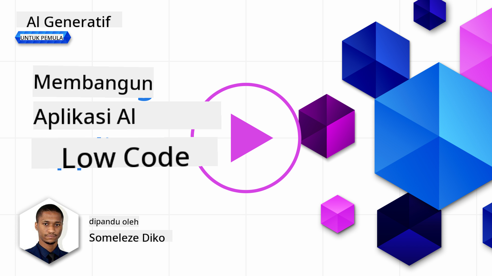
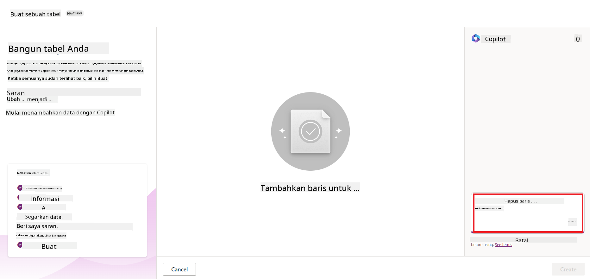
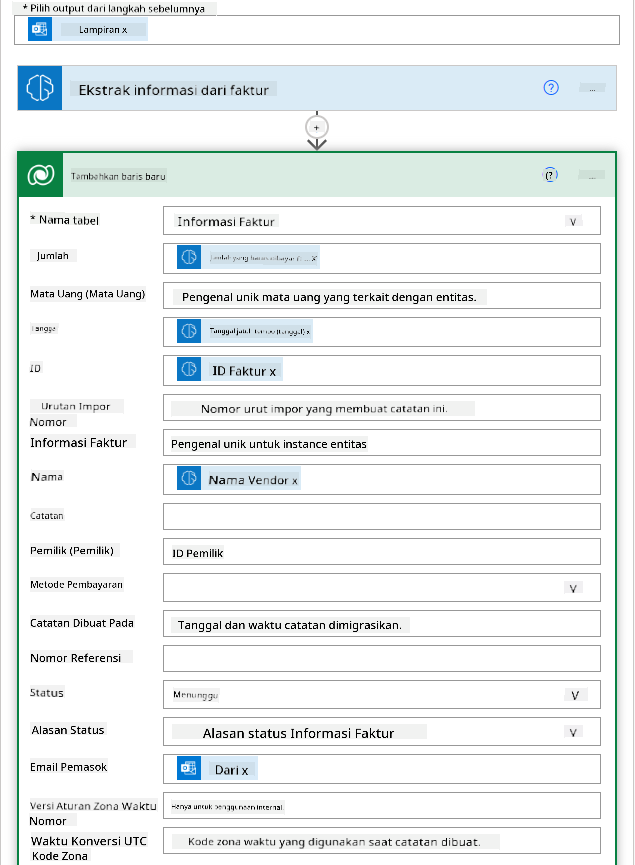

<!--
CO_OP_TRANSLATOR_METADATA:
{
  "original_hash": "846ac8e3b7dcfb697d3309fec05f0fea",
  "translation_date": "2025-10-17T20:45:52+00:00",
  "source_file": "10-building-low-code-ai-applications/README.md",
  "language_code": "id"
}
-->
# Membangun Aplikasi AI dengan Kode Rendah

> _(Klik gambar di atas untuk menonton video pelajaran ini)_

## Pendahuluan

Setelah kita belajar cara membangun aplikasi penghasil gambar, mari kita bahas tentang kode rendah. AI generatif dapat digunakan untuk berbagai bidang, termasuk kode rendah, tetapi apa itu kode rendah dan bagaimana kita bisa menambahkan AI ke dalamnya?

Membangun aplikasi dan solusi menjadi lebih mudah bagi pengembang tradisional maupun non-pengembang melalui penggunaan Platform Pengembangan Kode Rendah. Platform ini memungkinkan Anda membangun aplikasi dan solusi dengan sedikit atau tanpa kode. Hal ini dicapai dengan menyediakan lingkungan pengembangan visual yang memungkinkan Anda menyeret dan meletakkan komponen untuk membangun aplikasi dan solusi. Dengan cara ini, Anda dapat membangun aplikasi dan solusi lebih cepat dengan sumber daya yang lebih sedikit. Dalam pelajaran ini, kita akan membahas secara mendalam cara menggunakan kode rendah dan cara meningkatkan pengembangan kode rendah dengan AI menggunakan Power Platform.

Power Platform memberikan kesempatan kepada organisasi untuk memberdayakan tim mereka agar dapat membangun solusi mereka sendiri melalui lingkungan intuitif yang berbasis kode rendah atau tanpa kode. Lingkungan ini membantu menyederhanakan proses pembangunan solusi. Dengan Power Platform, solusi dapat dibangun dalam hitungan hari atau minggu, bukan bulan atau tahun. Power Platform terdiri dari lima produk utama: Power Apps, Power Automate, Power BI, Power Pages, dan Copilot Studio.

Pelajaran ini mencakup:

- Pengantar AI Generatif di Power Platform
- Pengantar Copilot dan cara menggunakannya
- Menggunakan AI Generatif untuk membangun aplikasi dan alur kerja di Power Platform
- Memahami Model AI di Power Platform dengan AI Builder

## Tujuan Pembelajaran

Pada akhir pelajaran ini, Anda akan dapat:

- Memahami cara kerja Copilot di Power Platform.

- Membangun Aplikasi Pelacak Tugas Siswa untuk startup pendidikan kita.

- Membangun Alur Pemrosesan Faktur yang menggunakan AI untuk mengekstrak informasi dari faktur.

- Menerapkan praktik terbaik saat menggunakan Model AI Create Text dengan GPT.

Alat dan teknologi yang akan Anda gunakan dalam pelajaran ini adalah:

- **Power Apps**, untuk aplikasi Pelacak Tugas Siswa, yang menyediakan lingkungan pengembangan kode rendah untuk membangun aplikasi guna melacak, mengelola, dan berinteraksi dengan data.

- **Dataverse**, untuk menyimpan data aplikasi Pelacak Tugas Siswa di mana Dataverse akan menyediakan platform data kode rendah untuk menyimpan data aplikasi.

- **Power Automate**, untuk alur Pemrosesan Faktur di mana Anda akan memiliki lingkungan pengembangan kode rendah untuk membangun alur kerja guna mengotomatisasi proses Pemrosesan Faktur.

- **AI Builder**, untuk Model AI Pemrosesan Faktur di mana Anda akan menggunakan Model AI yang sudah dibuat untuk memproses faktur untuk startup kita.

## AI Generatif di Power Platform

Meningkatkan pengembangan dan aplikasi kode rendah dengan AI generatif adalah area fokus utama untuk Power Platform. Tujuannya adalah memungkinkan semua orang membangun aplikasi, situs, dasbor, dan mengotomatisasi proses yang didukung AI, _tanpa memerlukan keahlian data science_. Tujuan ini dicapai dengan mengintegrasikan AI generatif ke dalam pengalaman pengembangan kode rendah di Power Platform dalam bentuk Copilot dan AI Builder.

### Bagaimana cara kerjanya?

Copilot adalah asisten AI yang memungkinkan Anda membangun solusi Power Platform dengan mendeskripsikan kebutuhan Anda dalam serangkaian langkah percakapan menggunakan bahasa alami. Misalnya, Anda dapat menginstruksikan asisten AI Anda untuk menyebutkan bidang apa yang akan digunakan aplikasi Anda, dan Copilot akan membuat aplikasi serta model data yang mendasarinya, atau Anda dapat menentukan cara mengatur alur kerja di Power Automate.

Anda dapat menggunakan fitur yang didukung Copilot di layar aplikasi Anda untuk memungkinkan pengguna menemukan wawasan melalui interaksi percakapan.

AI Builder adalah kemampuan AI kode rendah yang tersedia di Power Platform yang memungkinkan Anda menggunakan Model AI untuk membantu mengotomatisasi proses dan memprediksi hasil. Dengan AI Builder, Anda dapat membawa AI ke aplikasi dan alur kerja yang terhubung ke data Anda di Dataverse atau di berbagai sumber data cloud, seperti SharePoint, OneDrive, atau Azure.

Copilot tersedia di semua produk Power Platform: Power Apps, Power Automate, Power BI, Power Pages, dan Power Virtual Agents. AI Builder tersedia di Power Apps dan Power Automate. Dalam pelajaran ini, kita akan fokus pada cara menggunakan Copilot dan AI Builder di Power Apps dan Power Automate untuk membangun solusi untuk startup pendidikan kita.

### Copilot di Power Apps

Sebagai bagian dari Power Platform, Power Apps menyediakan lingkungan pengembangan kode rendah untuk membangun aplikasi guna melacak, mengelola, dan berinteraksi dengan data. Ini adalah rangkaian layanan pengembangan aplikasi dengan platform data yang dapat diskalakan dan kemampuan untuk terhubung ke layanan cloud dan data lokal. Power Apps memungkinkan Anda membangun aplikasi yang berjalan di browser, tablet, dan ponsel, serta dapat dibagikan dengan rekan kerja. Power Apps mempermudah pengguna dalam pengembangan aplikasi dengan antarmuka yang sederhana, sehingga setiap pengguna bisnis atau pengembang profesional dapat membangun aplikasi khusus. Pengalaman pengembangan aplikasi juga ditingkatkan dengan AI Generatif melalui Copilot.

Fitur asisten AI Copilot di Power Apps memungkinkan Anda mendeskripsikan jenis aplikasi yang Anda butuhkan dan informasi apa yang ingin Anda lacak, kumpulkan, atau tampilkan dalam aplikasi Anda. Copilot kemudian menghasilkan aplikasi Canvas yang responsif berdasarkan deskripsi Anda. Anda kemudian dapat menyesuaikan aplikasi untuk memenuhi kebutuhan Anda. Copilot AI juga menghasilkan dan menyarankan Tabel Dataverse dengan bidang yang Anda perlukan untuk menyimpan data yang ingin Anda lacak serta beberapa data contoh. Kita akan melihat apa itu Dataverse dan cara menggunakannya di Power Apps dalam pelajaran ini nanti. Anda kemudian dapat menyesuaikan tabel untuk memenuhi kebutuhan Anda menggunakan fitur asisten AI Copilot melalui langkah-langkah percakapan. Fitur ini tersedia langsung dari layar utama Power Apps.

### Copilot di Power Automate

Sebagai bagian dari Power Platform, Power Automate memungkinkan pengguna membuat alur kerja otomatis antara aplikasi dan layanan. Ini membantu mengotomatisasi proses bisnis yang berulang seperti komunikasi, pengumpulan data, dan persetujuan keputusan. Antarmuka yang sederhana memungkinkan pengguna dengan berbagai tingkat kompetensi teknis (dari pemula hingga pengembang berpengalaman) untuk mengotomatisasi tugas kerja. Pengalaman pengembangan alur kerja juga ditingkatkan dengan AI Generatif melalui Copilot.

Fitur asisten AI Copilot di Power Automate memungkinkan Anda mendeskripsikan jenis alur kerja yang Anda butuhkan dan tindakan apa yang ingin Anda lakukan dalam alur kerja tersebut. Copilot kemudian menghasilkan alur kerja berdasarkan deskripsi Anda. Anda kemudian dapat menyesuaikan alur kerja untuk memenuhi kebutuhan Anda. Copilot AI juga menghasilkan dan menyarankan tindakan yang Anda perlukan untuk melakukan tugas yang ingin Anda otomatisasi. Kita akan melihat apa itu alur kerja dan cara menggunakannya di Power Automate dalam pelajaran ini nanti. Anda kemudian dapat menyesuaikan tindakan untuk memenuhi kebutuhan Anda menggunakan fitur asisten AI Copilot melalui langkah-langkah percakapan. Fitur ini tersedia langsung dari layar utama Power Automate.

## Tugas: Mengelola tugas siswa dan faktur untuk startup kita, menggunakan Copilot

Startup kita menyediakan kursus online untuk siswa. Startup ini telah berkembang pesat dan sekarang kesulitan untuk memenuhi permintaan kursusnya. Startup telah mempekerjakan Anda sebagai pengembang Power Platform untuk membantu mereka membangun solusi kode rendah untuk membantu mereka mengelola tugas siswa dan faktur. Solusi mereka harus dapat membantu mereka melacak dan mengelola tugas siswa melalui aplikasi dan mengotomatisasi proses pemrosesan faktur melalui alur kerja. Anda diminta menggunakan AI Generatif untuk mengembangkan solusi ini.

Saat Anda memulai menggunakan Copilot, Anda dapat menggunakan [Perpustakaan Prompt Copilot Power Platform](https://github.com/pnp/powerplatform-prompts?WT.mc_id=academic-109639-somelezediko) untuk memulai dengan prompt. Perpustakaan ini berisi daftar prompt yang dapat Anda gunakan untuk membangun aplikasi dan alur kerja dengan Copilot. Anda juga dapat menggunakan prompt dalam perpustakaan untuk mendapatkan ide tentang cara mendeskripsikan kebutuhan Anda kepada Copilot.

### Membangun Aplikasi Pelacak Tugas Siswa untuk Startup Kita

Para pendidik di startup kita kesulitan melacak tugas siswa. Mereka telah menggunakan spreadsheet untuk melacak tugas, tetapi ini menjadi sulit dikelola karena jumlah siswa meningkat. Mereka meminta Anda membangun aplikasi yang akan membantu mereka melacak dan mengelola tugas siswa. Aplikasi ini harus memungkinkan mereka menambahkan tugas baru, melihat tugas, memperbarui tugas, dan menghapus tugas. Aplikasi ini juga harus memungkinkan pendidik dan siswa melihat tugas yang telah dinilai dan yang belum dinilai.

Anda akan membangun aplikasi menggunakan Copilot di Power Apps dengan mengikuti langkah-langkah berikut:

1. Navigasikan ke layar utama [Power Apps](https://make.powerapps.com?WT.mc_id=academic-105485-koreyst).

1. Gunakan area teks di layar utama untuk mendeskripsikan aplikasi yang ingin Anda bangun. Misalnya, **_Saya ingin membangun aplikasi untuk melacak dan mengelola tugas siswa_**. Klik tombol **Kirim** untuk mengirimkan prompt ke AI Copilot.

1. AI Copilot akan menyarankan Tabel Dataverse dengan bidang yang Anda perlukan untuk menyimpan data yang ingin Anda lacak serta beberapa data contoh. Anda kemudian dapat menyesuaikan tabel untuk memenuhi kebutuhan Anda menggunakan fitur asisten AI Copilot melalui langkah-langkah percakapan.

   > **Penting**: Dataverse adalah platform data yang mendasari Power Platform. Ini adalah platform data kode rendah untuk menyimpan data aplikasi. Ini adalah layanan yang sepenuhnya dikelola yang menyimpan data secara aman di Microsoft Cloud dan disediakan dalam lingkungan Power Platform Anda. Dataverse dilengkapi dengan kemampuan tata kelola data bawaan, seperti klasifikasi data, garis keturunan data, kontrol akses yang terperinci, dan lainnya. Anda dapat mempelajari lebih lanjut tentang Dataverse [di sini](https://docs.microsoft.com/powerapps/maker/data-platform/data-platform-intro?WT.mc_id=academic-109639-somelezediko).

   

1. Para pendidik ingin mengirim email kepada siswa yang telah mengirimkan tugas mereka untuk memberi tahu mereka tentang kemajuan tugas mereka. Anda dapat menggunakan Copilot untuk menambahkan bidang baru ke tabel untuk menyimpan email siswa. Misalnya, Anda dapat menggunakan prompt berikut untuk menambahkan bidang baru ke tabel: **_Saya ingin menambahkan kolom untuk menyimpan email siswa_**. Klik tombol **Kirim** untuk mengirimkan prompt ke AI Copilot.

1. AI Copilot akan menghasilkan bidang baru dan Anda kemudian dapat menyesuaikan bidang tersebut untuk memenuhi kebutuhan Anda.

1. Setelah selesai dengan tabel, klik tombol **Buat aplikasi** untuk membuat aplikasi.

1. AI Copilot akan menghasilkan aplikasi Canvas yang responsif berdasarkan deskripsi Anda. Anda kemudian dapat menyesuaikan aplikasi untuk memenuhi kebutuhan Anda.

1. Agar pendidik dapat mengirim email kepada siswa, Anda dapat menggunakan Copilot untuk menambahkan layar baru ke aplikasi. Misalnya, Anda dapat menggunakan prompt berikut untuk menambahkan layar baru ke aplikasi: **_Saya ingin menambahkan layar untuk mengirim email kepada siswa_**. Klik tombol **Kirim** untuk mengirimkan prompt ke AI Copilot.

1. AI Copilot akan menghasilkan layar baru dan Anda kemudian dapat menyesuaikan layar tersebut untuk memenuhi kebutuhan Anda.

1. Setelah selesai dengan aplikasi, klik tombol **Simpan** untuk menyimpan aplikasi.

1. Untuk membagikan aplikasi dengan para pendidik, klik tombol **Bagikan** lalu klik tombol **Bagikan** lagi. Anda kemudian dapat membagikan aplikasi dengan para pendidik dengan memasukkan alamat email mereka.

> **Pekerjaan rumah Anda**: Aplikasi yang baru saja Anda bangun adalah awal yang baik tetapi dapat ditingkatkan. Dengan fitur email, pendidik hanya dapat mengirim email kepada siswa secara manual dengan harus mengetikkan email mereka. Bisakah Anda menggunakan Copilot untuk membangun otomatisasi yang memungkinkan pendidik mengirim email kepada siswa secara otomatis saat mereka mengirimkan tugas mereka? Petunjuk Anda adalah dengan prompt yang tepat, Anda dapat menggunakan Copilot di Power Automate untuk membangun ini.

### Membangun Tabel Informasi Faktur untuk Startup Kita

Tim keuangan startup kita kesulitan melacak faktur. Mereka telah menggunakan spreadsheet untuk melacak faktur, tetapi ini menjadi sulit dikelola karena jumlah faktur meningkat. Mereka meminta Anda membangun tabel yang akan membantu mereka menyimpan, melacak, dan mengelola informasi faktur yang mereka terima. Tabel ini harus digunakan untuk membangun otomatisasi yang akan mengekstrak semua informasi faktur dan menyimpannya di tabel. Tabel ini juga harus memungkinkan tim keuangan untuk melihat faktur yang telah dibayar dan yang belum dibayar.

Power Platform memiliki platform data yang mendasari yang disebut Dataverse yang memungkinkan Anda menyimpan data untuk aplikasi dan solusi Anda. Dataverse menyediakan platform data kode rendah untuk menyimpan data aplikasi. Ini adalah layanan yang sepenuhnya dikelola yang menyimpan data secara aman di Microsoft Cloud dan disediakan dalam lingkungan Power Platform Anda. Dataverse dilengkapi dengan kemampuan tata kelola data bawaan, seperti klasifikasi data, garis keturunan data, kontrol akses yang terperinci, dan lainnya. Anda dapat mempelajari lebih lanjut [tentang Dataverse di sini](https://docs.microsoft.com/powerapps/maker/data-platform/data-platform-intro?WT.mc_id=academic-109639-somelezediko).
Mengapa kita harus menggunakan Dataverse untuk startup kita? Tabel standar dan kustom dalam Dataverse menyediakan opsi penyimpanan yang aman dan berbasis cloud untuk data Anda. Tabel memungkinkan Anda menyimpan berbagai jenis data, mirip dengan cara Anda menggunakan beberapa lembar kerja dalam satu buku kerja Excel. Anda dapat menggunakan tabel untuk menyimpan data yang spesifik untuk kebutuhan organisasi atau bisnis Anda. Beberapa manfaat yang akan didapatkan startup kita dari menggunakan Dataverse antara lain:

- **Mudah dikelola**: Baik metadata maupun data disimpan di cloud, sehingga Anda tidak perlu khawatir tentang detail bagaimana data tersebut disimpan atau dikelola. Anda dapat fokus pada pembangunan aplikasi dan solusi Anda.

- **Aman**: Dataverse menyediakan opsi penyimpanan yang aman dan berbasis cloud untuk data Anda. Anda dapat mengontrol siapa yang memiliki akses ke data dalam tabel Anda dan bagaimana mereka dapat mengaksesnya menggunakan keamanan berbasis peran.

- **Metadata yang kaya**: Jenis data dan hubungan digunakan langsung dalam Power Apps.

- **Logika dan validasi**: Anda dapat menggunakan aturan bisnis, bidang terhitung, dan aturan validasi untuk menerapkan logika bisnis dan menjaga akurasi data.

Sekarang Anda tahu apa itu Dataverse dan mengapa Anda harus menggunakannya, mari kita lihat bagaimana Anda dapat menggunakan Copilot untuk membuat tabel di Dataverse sesuai kebutuhan tim keuangan kita.

> **Note**: Anda akan menggunakan tabel ini di bagian berikutnya untuk membangun otomatisasi yang akan mengekstrak semua informasi faktur dan menyimpannya di tabel.

Untuk membuat tabel di Dataverse menggunakan Copilot, ikuti langkah-langkah berikut:

1. Navigasikan ke layar utama [Power Apps](https://make.powerapps.com?WT.mc_id=academic-105485-koreyst).

2. Pada bilah navigasi kiri, pilih **Tables** lalu klik **Describe the new Table**.

3. Pada layar **Describe the new Table**, gunakan area teks untuk menjelaskan tabel yang ingin Anda buat. Misalnya, **_Saya ingin membuat tabel untuk menyimpan informasi faktur_**. Klik tombol **Send** untuk mengirimkan perintah ke AI Copilot.

4. AI Copilot akan menyarankan Tabel Dataverse dengan bidang yang Anda perlukan untuk menyimpan data yang ingin Anda lacak dan beberapa data contoh. Anda kemudian dapat menyesuaikan tabel sesuai kebutuhan Anda menggunakan fitur asisten AI Copilot melalui langkah-langkah percakapan.

5. Tim keuangan ingin mengirim email kepada pemasok untuk memperbarui mereka dengan status terkini faktur mereka. Anda dapat menggunakan Copilot untuk menambahkan bidang baru ke tabel untuk menyimpan email pemasok. Misalnya, Anda dapat menggunakan perintah berikut untuk menambahkan bidang baru ke tabel: **_Saya ingin menambahkan kolom untuk menyimpan email pemasok_**. Klik tombol **Send** untuk mengirimkan perintah ke AI Copilot.

6. AI Copilot akan menghasilkan bidang baru dan Anda kemudian dapat menyesuaikan bidang tersebut sesuai kebutuhan Anda.

7. Setelah selesai dengan tabel, klik tombol **Create** untuk membuat tabel.

## Model AI di Power Platform dengan AI Builder

AI Builder adalah kemampuan AI low-code yang tersedia di Power Platform yang memungkinkan Anda menggunakan Model AI untuk membantu mengotomatisasi proses dan memprediksi hasil. Dengan AI Builder, Anda dapat menghadirkan AI ke aplikasi dan alur kerja yang terhubung ke data Anda di Dataverse atau di berbagai sumber data cloud, seperti SharePoint, OneDrive, atau Azure.

## Model AI Siap Pakai vs Model AI Kustom

AI Builder menyediakan dua jenis Model AI: Model AI Siap Pakai dan Model AI Kustom. Model AI Siap Pakai adalah model AI yang siap digunakan, dilatih oleh Microsoft, dan tersedia di Power Platform. Model ini membantu Anda menambahkan kecerdasan ke aplikasi dan alur kerja tanpa harus mengumpulkan data, membangun, melatih, dan menerbitkan model Anda sendiri. Anda dapat menggunakan model ini untuk mengotomatisasi proses dan memprediksi hasil.

Beberapa Model AI Siap Pakai yang tersedia di Power Platform meliputi:

- **Ekstraksi Frasa Kunci**: Model ini mengekstrak frasa kunci dari teks.
- **Deteksi Bahasa**: Model ini mendeteksi bahasa dari teks.
- **Analisis Sentimen**: Model ini mendeteksi sentimen positif, negatif, netral, atau campuran dalam teks.
- **Pembaca Kartu Nama**: Model ini mengekstrak informasi dari kartu nama.
- **Pengenalan Teks**: Model ini mengekstrak teks dari gambar.
- **Deteksi Objek**: Model ini mendeteksi dan mengekstrak objek dari gambar.
- **Pemrosesan Dokumen**: Model ini mengekstrak informasi dari formulir.
- **Pemrosesan Faktur**: Model ini mengekstrak informasi dari faktur.

Dengan Model AI Kustom, Anda dapat membawa model Anda sendiri ke AI Builder sehingga dapat berfungsi seperti model kustom AI Builder lainnya, memungkinkan Anda melatih model menggunakan data Anda sendiri. Anda dapat menggunakan model ini untuk mengotomatisasi proses dan memprediksi hasil baik di Power Apps maupun Power Automate. Saat menggunakan model Anda sendiri, ada batasan yang berlaku. Baca lebih lanjut tentang [batasan ini](https://learn.microsoft.com/ai-builder/byo-model#limitations?WT.mc_id=academic-105485-koreyst).

## Tugas #2 - Bangun Alur Pemrosesan Faktur untuk Startup Kita

Tim keuangan mengalami kesulitan dalam memproses faktur. Mereka telah menggunakan spreadsheet untuk melacak faktur tetapi ini menjadi sulit dikelola karena jumlah faktur yang meningkat. Mereka meminta Anda untuk membangun alur kerja yang akan membantu mereka memproses faktur menggunakan AI. Alur kerja ini harus memungkinkan mereka mengekstrak informasi dari faktur dan menyimpan informasi tersebut dalam tabel Dataverse. Alur kerja ini juga harus memungkinkan mereka mengirim email ke tim keuangan dengan informasi yang telah diekstrak.

Sekarang Anda tahu apa itu AI Builder dan mengapa Anda harus menggunakannya, mari kita lihat bagaimana Anda dapat menggunakan Model AI Pemrosesan Faktur di AI Builder, yang telah kita bahas sebelumnya, untuk membangun alur kerja yang akan membantu tim keuangan memproses faktur.

Untuk membangun alur kerja yang akan membantu tim keuangan memproses faktur menggunakan Model AI Pemrosesan Faktur di AI Builder, ikuti langkah-langkah berikut:

1. Navigasikan ke layar utama [Power Automate](https://make.powerautomate.com?WT.mc_id=academic-105485-koreyst).

2. Gunakan area teks di layar utama untuk menjelaskan alur kerja yang ingin Anda bangun. Misalnya, **_Proses faktur saat tiba di kotak masuk saya_**. Klik tombol **Send** untuk mengirimkan perintah ke AI Copilot.

   

3. AI Copilot akan menyarankan tindakan yang Anda perlukan untuk melakukan tugas yang ingin Anda otomatisasi. Anda dapat mengklik tombol **Next** untuk melanjutkan ke langkah berikutnya.

4. Pada langkah berikutnya, Power Automate akan meminta Anda untuk mengatur koneksi yang diperlukan untuk alur kerja. Setelah selesai, klik tombol **Create flow** untuk membuat alur kerja.

5. AI Copilot akan menghasilkan alur kerja dan Anda kemudian dapat menyesuaikan alur kerja tersebut sesuai kebutuhan Anda.

6. Perbarui pemicu alur kerja dan atur **Folder** ke folder tempat faktur akan disimpan. Misalnya, Anda dapat mengatur folder ke **Inbox**. Klik **Show advanced options** dan atur **Only with Attachments** ke **Yes**. Ini akan memastikan bahwa alur kerja hanya berjalan saat email dengan lampiran diterima di folder.

7. Hapus tindakan berikut dari alur kerja: **HTML to text**, **Compose**, **Compose 2**, **Compose 3**, dan **Compose 4** karena Anda tidak akan menggunakannya.

8. Hapus tindakan **Condition** dari alur kerja karena Anda tidak akan menggunakannya. Alur kerja Anda seharusnya terlihat seperti tangkapan layar berikut:

   

9. Klik tombol **Add an action** dan cari **Dataverse**. Pilih tindakan **Add a new row**.

10. Pada tindakan **Extract Information from invoices**, perbarui **Invoice File** untuk menunjuk ke **Attachment Content** dari email. Ini akan memastikan bahwa alur kerja mengekstrak informasi dari lampiran faktur.

11. Pilih **Table** yang Anda buat sebelumnya. Misalnya, Anda dapat memilih tabel **Invoice Information**. Pilih konten dinamis dari tindakan sebelumnya untuk mengisi bidang berikut:

    - ID
    - Amount
    - Date
    - Name
    - Status - Atur **Status** ke **Pending**.
    - Supplier Email - Gunakan konten dinamis **From** dari pemicu **When a new email arrives**.

    

12. Setelah selesai dengan alur kerja, klik tombol **Save** untuk menyimpan alur kerja. Anda kemudian dapat menguji alur kerja dengan mengirimkan email dengan faktur ke folder yang Anda tentukan di pemicu.

> **Pekerjaan rumah Anda**: Alur kerja yang baru saja Anda buat adalah awal yang baik, sekarang Anda perlu memikirkan bagaimana Anda dapat membangun otomatisasi yang akan memungkinkan tim keuangan kita mengirim email kepada pemasok untuk memperbarui mereka dengan status terkini faktur mereka. Petunjuk Anda: alur kerja harus berjalan saat status faktur berubah.

## Gunakan Model AI Generasi Teks di Power Automate

Model AI Create Text dengan GPT di AI Builder memungkinkan Anda menghasilkan teks berdasarkan perintah dan didukung oleh Microsoft Azure OpenAI Service. Dengan kemampuan ini, Anda dapat mengintegrasikan teknologi GPT (Generative Pre-Trained Transformer) ke dalam aplikasi dan alur kerja Anda untuk membangun berbagai alur kerja otomatis dan aplikasi yang memberikan wawasan.

Model GPT menjalani pelatihan ekstensif pada sejumlah besar data, memungkinkan mereka menghasilkan teks yang sangat mirip dengan bahasa manusia ketika diberikan perintah. Ketika diintegrasikan dengan otomatisasi alur kerja, model AI seperti GPT dapat dimanfaatkan untuk menyederhanakan dan mengotomatisasi berbagai tugas.

Misalnya, Anda dapat membangun alur kerja untuk secara otomatis menghasilkan teks untuk berbagai kasus penggunaan, seperti: draf email, deskripsi produk, dan lainnya. Anda juga dapat menggunakan model ini untuk menghasilkan teks untuk berbagai aplikasi, seperti chatbot dan aplikasi layanan pelanggan yang memungkinkan agen layanan pelanggan merespons pertanyaan pelanggan dengan efektif dan efisien.

Untuk mempelajari cara menggunakan Model AI ini di Power Automate, pelajari modul [Add intelligence with AI Builder and GPT](https://learn.microsoft.com/training/modules/ai-builder-text-generation/?WT.mc_id=academic-109639-somelezediko).

## Kerja Bagus! Lanjutkan Pembelajaran Anda

Setelah menyelesaikan pelajaran ini, lihat koleksi pembelajaran [Generative AI Learning](https://aka.ms/genai-collection?WT.mc_id=academic-105485-koreyst) untuk terus meningkatkan pengetahuan Anda tentang Generative AI!

Lanjutkan ke Pelajaran 11 di mana kita akan melihat bagaimana [mengintegrasikan Generative AI dengan Function Calling](../11-integrating-with-function-calling/README.md?WT.mc_id=academic-105485-koreyst)!

---

**Penafian**:  
Dokumen ini telah diterjemahkan menggunakan layanan penerjemahan AI [Co-op Translator](https://github.com/Azure/co-op-translator). Meskipun kami berupaya untuk memberikan hasil yang akurat, harap diketahui bahwa terjemahan otomatis mungkin mengandung kesalahan atau ketidakakuratan. Dokumen asli dalam bahasa aslinya harus dianggap sebagai sumber yang otoritatif. Untuk informasi yang penting, disarankan menggunakan jasa penerjemahan manusia profesional. Kami tidak bertanggung jawab atas kesalahpahaman atau penafsiran yang timbul dari penggunaan terjemahan ini.