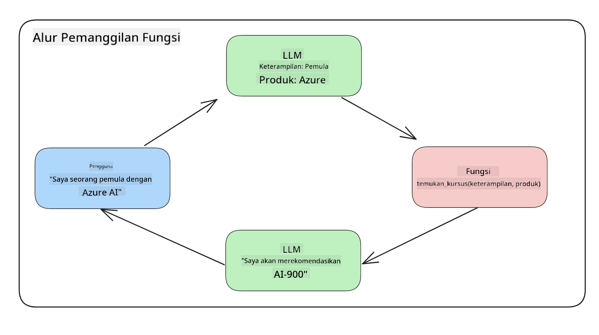
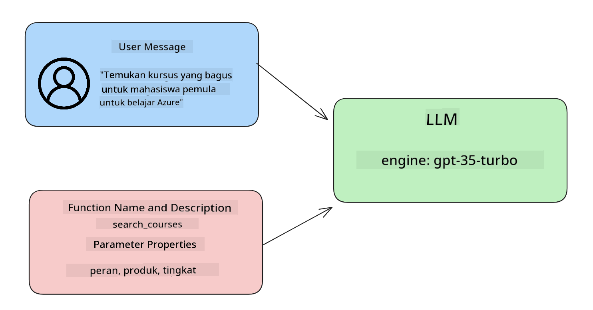

<!--
CO_OP_TRANSLATOR_METADATA:
{
  "original_hash": "77a48a201447be19aa7560706d6f93a0",
  "translation_date": "2025-05-19T21:34:09+00:00",
  "source_file": "11-integrating-with-function-calling/README.md",
  "language_code": "id"
}
-->
# Integrasi dengan pemanggilan fungsi

[](https://aka.ms/gen-ai-lesson11-gh?WT.mc_id=academic-105485-koreyst)

Anda telah mempelajari cukup banyak sejauh ini dalam pelajaran sebelumnya. Namun, kita dapat meningkatkannya lebih lanjut. Beberapa hal yang dapat kita tangani adalah bagaimana kita bisa mendapatkan format respons yang lebih konsisten untuk memudahkan bekerja dengan respons di hilir. Selain itu, kita mungkin ingin menambahkan data dari sumber lain untuk memperkaya aplikasi kita lebih lanjut.

Masalah yang disebutkan di atas adalah yang ingin diatasi oleh bab ini.

## Pendahuluan

Pelajaran ini akan mencakup:

- Menjelaskan apa itu pemanggilan fungsi dan kasus penggunaannya.
- Membuat pemanggilan fungsi menggunakan Azure OpenAI.
- Cara mengintegrasikan pemanggilan fungsi ke dalam aplikasi.

## Tujuan Pembelajaran

Pada akhir pelajaran ini, Anda akan dapat:

- Menjelaskan tujuan penggunaan pemanggilan fungsi.
- Mengatur Pemanggilan Fungsi menggunakan Azure OpenAI Service.
- Merancang pemanggilan fungsi yang efektif untuk kasus penggunaan aplikasi Anda.

## Skenario: Meningkatkan chatbot kami dengan fungsi

Untuk pelajaran ini, kami ingin membangun fitur untuk startup pendidikan kami yang memungkinkan pengguna menggunakan chatbot untuk menemukan kursus teknis. Kami akan merekomendasikan kursus yang sesuai dengan tingkat keterampilan mereka, peran saat ini, dan teknologi yang diminati.

Untuk menyelesaikan skenario ini, kami akan menggunakan kombinasi dari:

- `Azure OpenAI` untuk menciptakan pengalaman obrolan bagi pengguna.
- `Microsoft Learn Catalog API` untuk membantu pengguna menemukan kursus berdasarkan permintaan pengguna.
- `Function Calling` untuk mengambil kueri pengguna dan mengirimkannya ke fungsi untuk membuat permintaan API.

Untuk memulai, mari kita lihat mengapa kita ingin menggunakan pemanggilan fungsi sejak awal:

## Mengapa Pemanggilan Fungsi

Sebelum pemanggilan fungsi, respons dari LLM tidak terstruktur dan tidak konsisten. Pengembang diharuskan menulis kode validasi yang kompleks untuk memastikan mereka dapat menangani setiap variasi respons. Pengguna tidak dapat mendapatkan jawaban seperti "Apa cuaca saat ini di Stockholm?". Ini karena model terbatas pada waktu data dilatih.

Pemanggilan Fungsi adalah fitur dari Azure OpenAI Service untuk mengatasi batasan berikut:

- **Format respons yang konsisten**. Jika kita dapat mengendalikan format respons dengan lebih baik, kita dapat lebih mudah mengintegrasikan respons di hilir ke sistem lain.
- **Data eksternal**. Kemampuan untuk menggunakan data dari sumber lain aplikasi dalam konteks obrolan.

## Mengilustrasikan masalah melalui skenario

> Kami merekomendasikan Anda menggunakan [notebook yang disertakan](../../../11-integrating-with-function-calling/python/aoai-assignment.ipynb) jika Anda ingin menjalankan skenario di bawah ini. Anda juga dapat membaca bersama karena kami mencoba mengilustrasikan masalah di mana fungsi dapat membantu mengatasi masalah tersebut.

Mari kita lihat contoh yang menggambarkan masalah format respons:

Misalkan kita ingin membuat database data siswa sehingga kita dapat menyarankan kursus yang tepat kepada mereka. Di bawah ini kami memiliki dua deskripsi siswa yang sangat mirip dalam data yang mereka miliki.

1. Buat koneksi ke sumber daya Azure OpenAI kami:

   ```python
   import os
   import json
   from openai import AzureOpenAI
   from dotenv import load_dotenv
   load_dotenv()

   client = AzureOpenAI(
   api_key=os.environ['AZURE_OPENAI_API_KEY'],  # this is also the default, it can be omitted
   api_version = "2023-07-01-preview"
   )

   deployment=os.environ['AZURE_OPENAI_DEPLOYMENT']
   ```

   Di bawah ini adalah beberapa kode Python untuk mengonfigurasi koneksi kami ke Azure OpenAI di mana kami mengatur `api_type`, `api_base`, `api_version` and `api_key`.

1. Creating two student descriptions using variables `student_1_description` and `student_2_description`.

   ```python
   student_1_description="Emily Johnson is a sophomore majoring in computer science at Duke University. She has a 3.7 GPA. Emily is an active member of the university's Chess Club and Debate Team. She hopes to pursue a career in software engineering after graduating."

   student_2_description = "Michael Lee is a sophomore majoring in computer science at Stanford University. He has a 3.8 GPA. Michael is known for his programming skills and is an active member of the university's Robotics Club. He hopes to pursue a career in artificial intelligence after finishing his studies."
   ```

   Kami ingin mengirim deskripsi siswa di atas ke LLM untuk mengurai data. Data ini kemudian dapat digunakan dalam aplikasi kami dan dikirim ke API atau disimpan dalam database.

1. Mari kita buat dua prompt identik di mana kita menginstruksikan LLM tentang informasi apa yang kita minati:

   ```python
   prompt1 = f'''
   Please extract the following information from the given text and return it as a JSON object:

   name
   major
   school
   grades
   club

   This is the body of text to extract the information from:
   {student_1_description}
   '''

   prompt2 = f'''
   Please extract the following information from the given text and return it as a JSON object:

   name
   major
   school
   grades
   club

   This is the body of text to extract the information from:
   {student_2_description}
   '''
   ```

   Prompt di atas menginstruksikan LLM untuk mengekstrak informasi dan mengembalikan respons dalam format JSON.

1. Setelah mengatur prompt dan koneksi ke Azure OpenAI, kami sekarang akan mengirim prompt ke LLM dengan menggunakan `openai.ChatCompletion`. We store the prompt in the `messages` variable and assign the role to `user`. Ini untuk meniru pesan dari pengguna yang ditulis ke chatbot.

   ```python
   # response from prompt one
   openai_response1 = client.chat.completions.create(
   model=deployment,
   messages = [{'role': 'user', 'content': prompt1}]
   )
   openai_response1.choices[0].message.content

   # response from prompt two
   openai_response2 = client.chat.completions.create(
   model=deployment,
   messages = [{'role': 'user', 'content': prompt2}]
   )
   openai_response2.choices[0].message.content
   ```

Sekarang kita dapat mengirim kedua permintaan ke LLM dan memeriksa respons yang kita terima dengan menemukannya seperti ini `openai_response1['choices'][0]['message']['content']`.

1. Lastly, we can convert the response to JSON format by calling `json.loads`:

   ```python
   # Loading the response as a JSON object
   json_response1 = json.loads(openai_response1.choices[0].message.content)
   json_response1
   ```

   Respons 1:

   ```json
   {
     "name": "Emily Johnson",
     "major": "computer science",
     "school": "Duke University",
     "grades": "3.7",
     "club": "Chess Club"
   }
   ```

   Respons 2:

   ```json
   {
     "name": "Michael Lee",
     "major": "computer science",
     "school": "Stanford University",
     "grades": "3.8 GPA",
     "club": "Robotics Club"
   }
   ```

   Meskipun promptnya sama dan deskripsinya mirip, kita melihat nilai dari `Grades` property formatted differently, as we can sometimes get the format `3.7` or `3.7 GPA` for example.

   This result is because the LLM takes unstructured data in the form of the written prompt and returns also unstructured data. We need to have a structured format so that we know what to expect when storing or using this data

So how do we solve the formatting problem then? By using functional calling, we can make sure that we receive structured data back. When using function calling, the LLM does not actually call or run any functions. Instead, we create a structure for the LLM to follow for its responses. We then use those structured responses to know what function to run in our applications.



We can then take what is returned from the function and send this back to the LLM. The LLM will then respond using natural language to answer the user's query.

## Use Cases for using function calls

There are many different use cases where function calls can improve your app like:

- **Calling External Tools**. Chatbots are great at providing answers to questions from users. By using function calling, the chatbots can use messages from users to complete certain tasks. For example, a student can ask the chatbot to "Send an email to my instructor saying I need more assistance with this subject". This can make a function call to `send_email(to: string, body: string)`

- **Create API or Database Queries**. Users can find information using natural language that gets converted into a formatted query or API request. An example of this could be a teacher who requests "Who are the students that completed the last assignment" which could call a function named `get_completed(student_name: string, assignment: int, current_status: string)`

- **Creating Structured Data**. Users can take a block of text or CSV and use the LLM to extract important information from it. For example, a student can convert a Wikipedia article about peace agreements to create AI flashcards. This can be done by using a function called `get_important_facts(agreement_name: string, date_signed: string, parties_involved: list)`

## Creating Your First Function Call

The process of creating a function call includes 3 main steps:

1. **Calling** the Chat Completions API with a list of your functions and a user message.
2. **Reading** the model's response to perform an action i.e. execute a function or API Call.
3. **Making** another call to Chat Completions API with the response from your function to use that information to create a response to the user.



### Step 1 - creating messages

The first step is to create a user message. This can be dynamically assigned by taking the value of a text input or you can assign a value here. If this is your first time working with the Chat Completions API, we need to define the `role` and the `content` of the message.

The `role` can be either `system` (creating rules), `assistant` (the model) or `user` (the end-user). For function calling, we will assign this as `user` dan sebuah contoh pertanyaan.

```python
messages= [ {"role": "user", "content": "Find me a good course for a beginner student to learn Azure."} ]
```

Dengan menetapkan peran yang berbeda, menjadi jelas bagi LLM apakah itu sistem yang mengatakan sesuatu atau pengguna, yang membantu membangun riwayat percakapan yang dapat dibangun oleh LLM.

### Langkah 2 - membuat fungsi

Selanjutnya, kita akan mendefinisikan fungsi dan parameter fungsi tersebut. Kami akan menggunakan hanya satu fungsi di sini yang disebut `search_courses` but you can create multiple functions.

> **Important** : Functions are included in the system message to the LLM and will be included in the amount of available tokens you have available.

Below, we create the functions as an array of items. Each item is a function and has properties `name`, `description` and `parameters`:

```python
functions = [
   {
      "name":"search_courses",
      "description":"Retrieves courses from the search index based on the parameters provided",
      "parameters":{
         "type":"object",
         "properties":{
            "role":{
               "type":"string",
               "description":"The role of the learner (i.e. developer, data scientist, student, etc.)"
            },
            "product":{
               "type":"string",
               "description":"The product that the lesson is covering (i.e. Azure, Power BI, etc.)"
            },
            "level":{
               "type":"string",
               "description":"The level of experience the learner has prior to taking the course (i.e. beginner, intermediate, advanced)"
            }
         },
         "required":[
            "role"
         ]
      }
   }
]
```

Mari kita jelaskan setiap instance fungsi lebih rinci di bawah ini:

- `name` - The name of the function that we want to have called.
- `description` - This is the description of how the function works. Here it's important to be specific and clear.
- `parameters` - A list of values and format that you want the model to produce in its response. The parameters array consists of items where the items have the following properties:
  1.  `type` - The data type of the properties will be stored in.
  1.  `properties` - List of the specific values that the model will use for its response
      1. `name` - The key is the name of the property that the model will use in its formatted response, for example, `product`.
      1. `type` - The data type of this property, for example, `string`.
      1. `description` - Description of the specific property.

There's also an optional property `required` - required property for the function call to be completed.

### Step 3 - Making the function call

After defining a function, we now need to include it in the call to the Chat Completion API. We do this by adding `functions` to the request. In this case `functions=functions`.

There is also an option to set `function_call` to `auto`. This means we will let the LLM decide which function should be called based on the user message rather than assigning it ourselves.

Here's some code below where we call `ChatCompletion.create`, note how we set `functions=functions` and `function_call="auto"` dan dengan demikian memberikan LLM pilihan kapan harus memanggil fungsi yang kami sediakan:

```python
response = client.chat.completions.create(model=deployment,
                                        messages=messages,
                                        functions=functions,
                                        function_call="auto")

print(response.choices[0].message)
```

Respons yang datang kembali sekarang terlihat seperti ini:

```json
{
  "role": "assistant",
  "function_call": {
    "name": "search_courses",
    "arguments": "{\n  \"role\": \"student\",\n  \"product\": \"Azure\",\n  \"level\": \"beginner\"\n}"
  }
}
```

Di sini kita dapat melihat bagaimana fungsi `search_courses` was called and with what arguments, as listed in the `arguments` property in the JSON response.

The conclusion the LLM was able to find the data to fit the arguments of the function as it was extracting it from the value provided to the `messages` parameter in the chat completion call. Below is a reminder of the `messages` nilai:

```python
messages= [ {"role": "user", "content": "Find me a good course for a beginner student to learn Azure."} ]
```

Seperti yang Anda lihat, `student`, `Azure` and `beginner` was extracted from `messages` and set as input to the function. Using functions this way is a great way to extract information from a prompt but also to provide structure to the LLM and have reusable functionality.

Next, we need to see how we can use this in our app.

## Integrating Function Calls into an Application

After we have tested the formatted response from the LLM, we can now integrate this into an application.

### Managing the flow

To integrate this into our application, let's take the following steps:

1. First, let's make the call to the OpenAI services and store the message in a variable called `response_message`.

   ```python
   response_message = response.choices[0].message
   ```

1. Sekarang kita akan mendefinisikan fungsi yang akan memanggil Microsoft Learn API untuk mendapatkan daftar kursus:

   ```python
   import requests

   def search_courses(role, product, level):
     url = "https://learn.microsoft.com/api/catalog/"
     params = {
        "role": role,
        "product": product,
        "level": level
     }
     response = requests.get(url, params=params)
     modules = response.json()["modules"]
     results = []
     for module in modules[:5]:
        title = module["title"]
        url = module["url"]
        results.append({"title": title, "url": url})
     return str(results)
   ```

   Perhatikan bagaimana kita sekarang membuat fungsi Python yang sebenarnya yang memetakan ke nama fungsi yang diperkenalkan dalam `functions` variable. We're also making real external API calls to fetch the data we need. In this case, we go against the Microsoft Learn API to search for training modules.

Ok, so we created `functions` variables and a corresponding Python function, how do we tell the LLM how to map these two together so our Python function is called?

1. To see if we need to call a Python function, we need to look into the LLM response and see if `function_call` adalah bagian darinya dan memanggil fungsi yang ditunjuk. Berikut cara Anda dapat melakukan pemeriksaan yang disebutkan di bawah ini:

   ```python
   # Check if the model wants to call a function
   if response_message.function_call.name:
    print("Recommended Function call:")
    print(response_message.function_call.name)
    print()

    # Call the function.
    function_name = response_message.function_call.name

    available_functions = {
            "search_courses": search_courses,
    }
    function_to_call = available_functions[function_name]

    function_args = json.loads(response_message.function_call.arguments)
    function_response = function_to_call(**function_args)

    print("Output of function call:")
    print(function_response)
    print(type(function_response))


    # Add the assistant response and function response to the messages
    messages.append( # adding assistant response to messages
        {
            "role": response_message.role,
            "function_call": {
                "name": function_name,
                "arguments": response_message.function_call.arguments,
            },
            "content": None
        }
    )
    messages.append( # adding function response to messages
        {
            "role": "function",
            "name": function_name,
            "content":function_response,
        }
    )
   ```

   Tiga baris ini, memastikan kita mengekstrak nama fungsi, argumen, dan membuat panggilan:

   ```python
   function_to_call = available_functions[function_name]

   function_args = json.loads(response_message.function_call.arguments)
   function_response = function_to_call(**function_args)
   ```

   Di bawah ini adalah output dari menjalankan kode kami:

   **Output**

   ```Recommended Function call:
   {
     "name": "search_courses",
     "arguments": "{\n  \"role\": \"student\",\n  \"product\": \"Azure\",\n  \"level\": \"beginner\"\n}"
   }

   Output of function call:
   [{'title': 'Describe concepts of cryptography', 'url': 'https://learn.microsoft.com/training/modules/describe-concepts-of-cryptography/?
   WT.mc_id=api_CatalogApi'}, {'title': 'Introduction to audio classification with TensorFlow', 'url': 'https://learn.microsoft.com/en-
   us/training/modules/intro-audio-classification-tensorflow/?WT.mc_id=api_CatalogApi'}, {'title': 'Design a Performant Data Model in Azure SQL
   Database with Azure Data Studio', 'url': 'https://learn.microsoft.com/training/modules/design-a-data-model-with-ads/?
   WT.mc_id=api_CatalogApi'}, {'title': 'Getting started with the Microsoft Cloud Adoption Framework for Azure', 'url':
   'https://learn.microsoft.com/training/modules/cloud-adoption-framework-getting-started/?WT.mc_id=api_CatalogApi'}, {'title': 'Set up the
   Rust development environment', 'url': 'https://learn.microsoft.com/training/modules/rust-set-up-environment/?WT.mc_id=api_CatalogApi'}]
   <class 'str'>
   ```

1. Sekarang kita akan mengirim pesan yang diperbarui, `messages` ke LLM sehingga kita dapat menerima respons bahasa alami alih-alih respons yang diformat JSON API.

   ```python
   print("Messages in next request:")
   print(messages)
   print()

   second_response = client.chat.completions.create(
      messages=messages,
      model=deployment,
      function_call="auto",
      functions=functions,
      temperature=0
         )  # get a new response from GPT where it can see the function response


   print(second_response.choices[0].message)
   ```

   **Output**

   ```python
   {
     "role": "assistant",
     "content": "I found some good courses for beginner students to learn Azure:\n\n1. [Describe concepts of cryptography] (https://learn.microsoft.com/training/modules/describe-concepts-of-cryptography/?WT.mc_id=api_CatalogApi)\n2. [Introduction to audio classification with TensorFlow](https://learn.microsoft.com/training/modules/intro-audio-classification-tensorflow/?WT.mc_id=api_CatalogApi)\n3. [Design a Performant Data Model in Azure SQL Database with Azure Data Studio](https://learn.microsoft.com/training/modules/design-a-data-model-with-ads/?WT.mc_id=api_CatalogApi)\n4. [Getting started with the Microsoft Cloud Adoption Framework for Azure](https://learn.microsoft.com/training/modules/cloud-adoption-framework-getting-started/?WT.mc_id=api_CatalogApi)\n5. [Set up the Rust development environment](https://learn.microsoft.com/training/modules/rust-set-up-environment/?WT.mc_id=api_CatalogApi)\n\nYou can click on the links to access the courses."
   }

   ```

## Tugas

Untuk melanjutkan pembelajaran Anda tentang Pemanggilan Fungsi Azure OpenAI, Anda dapat membangun:

- Lebih banyak parameter fungsi yang mungkin membantu pelajar menemukan lebih banyak kursus.
- Buat pemanggilan fungsi lain yang mengambil lebih banyak informasi dari pelajar seperti bahasa asli mereka
- Buat penanganan kesalahan ketika pemanggilan fungsi dan/atau pemanggilan API tidak mengembalikan kursus yang sesuai

Petunjuk: Ikuti halaman [dokumentasi referensi API Learn](https://learn.microsoft.com/training/support/catalog-api-developer-reference?WT.mc_id=academic-105485-koreyst) untuk melihat bagaimana dan di mana data ini tersedia.

## Kerja Bagus! Lanjutkan Perjalanan

Setelah menyelesaikan pelajaran ini, lihat koleksi [Pembelajaran AI Generatif](https://aka.ms/genai-collection?WT.mc_id=academic-105485-koreyst) kami untuk terus meningkatkan pengetahuan AI Generatif Anda!

Lanjutkan ke Pelajaran 12, di mana kita akan melihat bagaimana [merancang UX untuk aplikasi AI](../12-designing-ux-for-ai-applications/README.md?WT.mc_id=academic-105485-koreyst)!

**Penafian**:  
Dokumen ini telah diterjemahkan menggunakan layanan terjemahan AI [Co-op Translator](https://github.com/Azure/co-op-translator). Meskipun kami berusaha untuk mencapai akurasi, harap diperhatikan bahwa terjemahan otomatis mungkin mengandung kesalahan atau ketidakakuratan. Dokumen asli dalam bahasa aslinya harus dianggap sebagai sumber yang berwenang. Untuk informasi yang penting, disarankan untuk menggunakan terjemahan manusia profesional. Kami tidak bertanggung jawab atas kesalahpahaman atau interpretasi yang salah yang timbul dari penggunaan terjemahan ini.