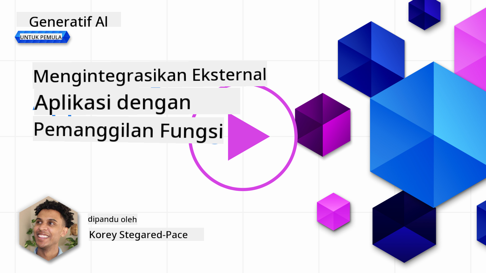
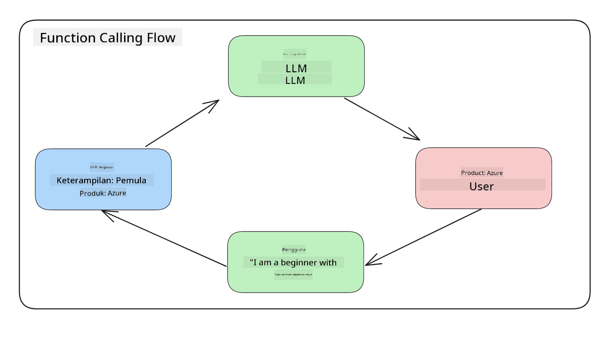
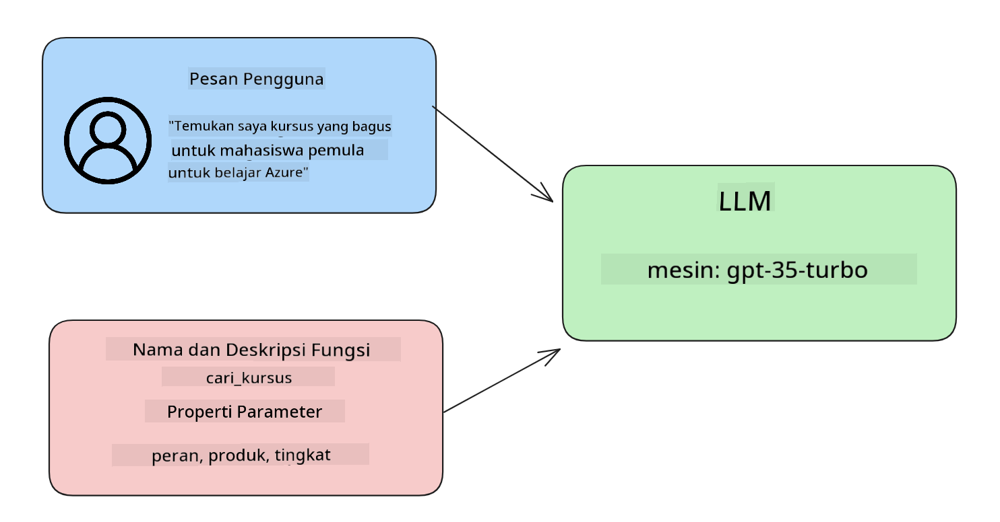

<!--
CO_OP_TRANSLATOR_METADATA:
{
  "original_hash": "77a48a201447be19aa7560706d6f93a0",
  "translation_date": "2025-07-09T14:39:05+00:00",
  "source_file": "11-integrating-with-function-calling/README.md",
  "language_code": "id"
}
-->
# Integrasi dengan pemanggilan fungsi

[](https://aka.ms/gen-ai-lesson11-gh?WT.mc_id=academic-105485-koreyst)

Anda sudah mempelajari cukup banyak sejauh ini di pelajaran sebelumnya. Namun, kita bisa meningkatkan lebih jauh lagi. Beberapa hal yang bisa kita atasi adalah bagaimana mendapatkan format respons yang lebih konsisten agar lebih mudah digunakan dalam proses selanjutnya. Selain itu, kita mungkin ingin menambahkan data dari sumber lain untuk memperkaya aplikasi kita.

Masalah yang disebutkan di atas adalah yang akan dibahas dalam bab ini.

## Pendahuluan

Pelajaran ini akan membahas:

- Menjelaskan apa itu pemanggilan fungsi dan kasus penggunaannya.
- Membuat pemanggilan fungsi menggunakan Azure OpenAI.
- Cara mengintegrasikan pemanggilan fungsi ke dalam aplikasi.

## Tujuan Pembelajaran

Di akhir pelajaran ini, Anda akan mampu:

- Menjelaskan tujuan penggunaan pemanggilan fungsi.
- Mengatur Function Call menggunakan Azure OpenAI Service.
- Merancang pemanggilan fungsi yang efektif sesuai kasus penggunaan aplikasi Anda.

## Skenario: Meningkatkan chatbot kita dengan fungsi

Untuk pelajaran ini, kita ingin membangun fitur untuk startup pendidikan kita yang memungkinkan pengguna menggunakan chatbot untuk menemukan kursus teknis. Kita akan merekomendasikan kursus yang sesuai dengan tingkat keterampilan, peran saat ini, dan teknologi yang diminati pengguna.

Untuk menyelesaikan skenario ini, kita akan menggunakan kombinasi:

- `Azure OpenAI` untuk membuat pengalaman chat bagi pengguna.
- `Microsoft Learn Catalog API` untuk membantu pengguna menemukan kursus berdasarkan permintaan pengguna.
- `Function Calling` untuk mengambil kueri pengguna dan mengirimkannya ke fungsi untuk melakukan permintaan API.

Untuk memulai, mari kita lihat mengapa kita ingin menggunakan pemanggilan fungsi sejak awal:

## Mengapa Pemanggilan Fungsi

Sebelum pemanggilan fungsi, respons dari LLM tidak terstruktur dan tidak konsisten. Pengembang harus menulis kode validasi yang kompleks untuk memastikan mereka dapat menangani setiap variasi respons. Pengguna tidak bisa mendapatkan jawaban seperti "Apa cuaca saat ini di Stockholm?". Ini karena model terbatas pada data yang digunakan saat pelatihan.

Pemanggilan Fungsi adalah fitur dari Azure OpenAI Service untuk mengatasi keterbatasan berikut:

- **Format respons yang konsisten**. Jika kita bisa mengontrol format respons dengan lebih baik, kita bisa lebih mudah mengintegrasikan respons tersebut ke sistem lain.
- **Data eksternal**. Kemampuan menggunakan data dari sumber lain dalam konteks chat aplikasi.

## Mengilustrasikan masalah melalui skenario

> Kami menyarankan Anda menggunakan [notebook yang disertakan](../../../11-integrating-with-function-calling/python/aoai-assignment.ipynb) jika ingin menjalankan skenario di bawah ini. Anda juga bisa hanya membaca karena kami mencoba mengilustrasikan masalah yang bisa diatasi dengan fungsi.

Mari kita lihat contoh yang menggambarkan masalah format respons:

Misalkan kita ingin membuat database data siswa agar bisa menyarankan kursus yang tepat untuk mereka. Di bawah ini ada dua deskripsi siswa yang sangat mirip dalam data yang mereka miliki.

1. Membuat koneksi ke sumber daya Azure OpenAI kita:

   ```python
   import os
   import json
   from openai import AzureOpenAI
   from dotenv import load_dotenv
   load_dotenv()

   client = AzureOpenAI(
   api_key=os.environ['AZURE_OPENAI_API_KEY'],  # this is also the default, it can be omitted
   api_version = "2023-07-01-preview"
   )

   deployment=os.environ['AZURE_OPENAI_DEPLOYMENT']
   ```

   Di bawah ini adalah kode Python untuk mengonfigurasi koneksi ke Azure OpenAI di mana kita mengatur `api_type`, `api_base`, `api_version`, dan `api_key`.

1. Membuat dua deskripsi siswa menggunakan variabel `student_1_description` dan `student_2_description`.

   ```python
   student_1_description="Emily Johnson is a sophomore majoring in computer science at Duke University. She has a 3.7 GPA. Emily is an active member of the university's Chess Club and Debate Team. She hopes to pursue a career in software engineering after graduating."

   student_2_description = "Michael Lee is a sophomore majoring in computer science at Stanford University. He has a 3.8 GPA. Michael is known for his programming skills and is an active member of the university's Robotics Club. He hopes to pursue a career in artificial intelligence after finishing his studies."
   ```

   Kita ingin mengirim deskripsi siswa di atas ke LLM untuk mengurai data tersebut. Data ini nantinya bisa digunakan dalam aplikasi kita dan dikirim ke API atau disimpan di database.

1. Mari buat dua prompt identik di mana kita menginstruksikan LLM informasi apa yang kita inginkan:

   ```python
   prompt1 = f'''
   Please extract the following information from the given text and return it as a JSON object:

   name
   major
   school
   grades
   club

   This is the body of text to extract the information from:
   {student_1_description}
   '''

   prompt2 = f'''
   Please extract the following information from the given text and return it as a JSON object:

   name
   major
   school
   grades
   club

   This is the body of text to extract the information from:
   {student_2_description}
   '''
   ```

   Prompt di atas menginstruksikan LLM untuk mengekstrak informasi dan mengembalikan respons dalam format JSON.

1. Setelah menyiapkan prompt dan koneksi ke Azure OpenAI, sekarang kita akan mengirim prompt ke LLM menggunakan `openai.ChatCompletion`. Kita menyimpan prompt dalam variabel `messages` dan menetapkan peran sebagai `user`. Ini untuk meniru pesan dari pengguna yang dikirim ke chatbot.

   ```python
   # response from prompt one
   openai_response1 = client.chat.completions.create(
   model=deployment,
   messages = [{'role': 'user', 'content': prompt1}]
   )
   openai_response1.choices[0].message.content

   # response from prompt two
   openai_response2 = client.chat.completions.create(
   model=deployment,
   messages = [{'role': 'user', 'content': prompt2}]
   )
   openai_response2.choices[0].message.content
   ```

Sekarang kita bisa mengirim kedua permintaan ke LLM dan memeriksa respons yang diterima dengan mencari seperti ini `openai_response1['choices'][0]['message']['content']`.

1. Terakhir, kita bisa mengonversi respons ke format JSON dengan memanggil `json.loads`:

   ```python
   # Loading the response as a JSON object
   json_response1 = json.loads(openai_response1.choices[0].message.content)
   json_response1
   ```

   Respons 1:

   ```json
   {
     "name": "Emily Johnson",
     "major": "computer science",
     "school": "Duke University",
     "grades": "3.7",
     "club": "Chess Club"
   }
   ```

   Respons 2:

   ```json
   {
     "name": "Michael Lee",
     "major": "computer science",
     "school": "Stanford University",
     "grades": "3.8 GPA",
     "club": "Robotics Club"
   }
   ```

   Meskipun prompt sama dan deskripsinya mirip, kita melihat nilai properti `Grades` diformat berbeda, misalnya kadang mendapatkan format `3.7` atau `3.7 GPA`.

   Hasil ini karena LLM mengambil data tidak terstruktur dalam bentuk prompt tertulis dan juga mengembalikan data tidak terstruktur. Kita perlu format terstruktur agar tahu apa yang diharapkan saat menyimpan atau menggunakan data ini.

Jadi bagaimana kita menyelesaikan masalah format ini? Dengan menggunakan pemanggilan fungsi, kita bisa memastikan menerima data terstruktur kembali. Saat menggunakan pemanggilan fungsi, LLM sebenarnya tidak memanggil atau menjalankan fungsi apa pun. Sebaliknya, kita membuat struktur yang harus diikuti LLM untuk responsnya. Kita kemudian menggunakan respons terstruktur tersebut untuk mengetahui fungsi mana yang harus dijalankan dalam aplikasi kita.



Kita kemudian bisa mengambil apa yang dikembalikan dari fungsi dan mengirimkannya kembali ke LLM. LLM kemudian akan merespons menggunakan bahasa alami untuk menjawab kueri pengguna.

## Kasus Penggunaan pemanggilan fungsi

Ada banyak kasus penggunaan di mana pemanggilan fungsi dapat meningkatkan aplikasi Anda seperti:

- **Memanggil Alat Eksternal**. Chatbot sangat baik dalam memberikan jawaban atas pertanyaan pengguna. Dengan menggunakan pemanggilan fungsi, chatbot dapat menggunakan pesan dari pengguna untuk menyelesaikan tugas tertentu. Misalnya, seorang siswa dapat meminta chatbot untuk "Kirim email ke instruktur saya mengatakan saya butuh bantuan lebih dengan mata pelajaran ini". Ini bisa membuat pemanggilan fungsi ke `send_email(to: string, body: string)`

- **Membuat Query API atau Database**. Pengguna dapat mencari informasi menggunakan bahasa alami yang kemudian diubah menjadi query atau permintaan API yang terformat. Contohnya seorang guru yang meminta "Siapa siswa yang menyelesaikan tugas terakhir" yang bisa memanggil fungsi bernama `get_completed(student_name: string, assignment: int, current_status: string)`

- **Membuat Data Terstruktur**. Pengguna dapat mengambil blok teks atau CSV dan menggunakan LLM untuk mengekstrak informasi penting darinya. Misalnya, seorang siswa dapat mengubah artikel Wikipedia tentang perjanjian damai menjadi flashcard AI. Ini bisa dilakukan dengan menggunakan fungsi bernama `get_important_facts(agreement_name: string, date_signed: string, parties_involved: list)`

## Membuat Pemanggilan Fungsi Pertama Anda

Proses membuat pemanggilan fungsi meliputi 3 langkah utama:

1. **Memanggil** Chat Completions API dengan daftar fungsi Anda dan pesan pengguna.
2. **Membaca** respons model untuk melakukan tindakan, misalnya menjalankan fungsi atau pemanggilan API.
3. **Membuat** panggilan lain ke Chat Completions API dengan respons dari fungsi Anda untuk menggunakan informasi tersebut dalam membuat respons ke pengguna.



### Langkah 1 - membuat pesan

Langkah pertama adalah membuat pesan pengguna. Ini bisa ditetapkan secara dinamis dengan mengambil nilai dari input teks atau Anda bisa menetapkan nilai di sini. Jika ini pertama kali Anda bekerja dengan Chat Completions API, kita perlu mendefinisikan `role` dan `content` dari pesan.

`role` bisa berupa `system` (membuat aturan), `assistant` (model) atau `user` (pengguna akhir). Untuk pemanggilan fungsi, kita akan menetapkannya sebagai `user` dan contoh pertanyaan.

```python
messages= [ {"role": "user", "content": "Find me a good course for a beginner student to learn Azure."} ]
```

Dengan menetapkan peran yang berbeda, LLM dibuat jelas apakah yang berbicara adalah sistem atau pengguna, yang membantu membangun riwayat percakapan yang bisa dikembangkan oleh LLM.

### Langkah 2 - membuat fungsi

Selanjutnya, kita akan mendefinisikan fungsi dan parameter dari fungsi tersebut. Kita akan menggunakan satu fungsi di sini bernama `search_courses` tapi Anda bisa membuat beberapa fungsi.

> **Penting** : Fungsi termasuk dalam pesan sistem ke LLM dan akan dihitung dalam jumlah token yang tersedia.

Di bawah ini, kita membuat fungsi sebagai array item. Setiap item adalah fungsi dan memiliki properti `name`, `description`, dan `parameters`:

```python
functions = [
   {
      "name":"search_courses",
      "description":"Retrieves courses from the search index based on the parameters provided",
      "parameters":{
         "type":"object",
         "properties":{
            "role":{
               "type":"string",
               "description":"The role of the learner (i.e. developer, data scientist, student, etc.)"
            },
            "product":{
               "type":"string",
               "description":"The product that the lesson is covering (i.e. Azure, Power BI, etc.)"
            },
            "level":{
               "type":"string",
               "description":"The level of experience the learner has prior to taking the course (i.e. beginner, intermediate, advanced)"
            }
         },
         "required":[
            "role"
         ]
      }
   }
]
```

Mari jelaskan setiap instance fungsi lebih detail di bawah ini:

- `name` - Nama fungsi yang ingin kita panggil.
- `description` - Deskripsi bagaimana fungsi bekerja. Di sini penting untuk spesifik dan jelas.
- `parameters` - Daftar nilai dan format yang Anda ingin model hasilkan dalam responsnya. Array parameters terdiri dari item dengan properti berikut:
  1.  `type` - Tipe data dari properti yang akan disimpan.
  1.  `properties` - Daftar nilai spesifik yang akan digunakan model dalam respons terformatnya
      1. `name` - Kunci adalah nama properti yang akan digunakan model dalam respons terformat, misalnya `product`.
      1. `type` - Tipe data properti ini, misalnya `string`.
      1. `description` - Deskripsi properti spesifik.

Ada juga properti opsional `required` - properti yang wajib ada agar pemanggilan fungsi berhasil.

### Langkah 3 - Melakukan pemanggilan fungsi

Setelah mendefinisikan fungsi, sekarang kita perlu memasukkannya dalam panggilan ke Chat Completion API. Kita lakukan ini dengan menambahkan `functions` ke permintaan. Dalam kasus ini `functions=functions`.

Ada juga opsi untuk mengatur `function_call` ke `auto`. Ini berarti kita membiarkan LLM memutuskan fungsi mana yang harus dipanggil berdasarkan pesan pengguna daripada menetapkannya sendiri.

Berikut kode di bawah ini di mana kita memanggil `ChatCompletion.create`, perhatikan bagaimana kita mengatur `functions=functions` dan `function_call="auto"` sehingga memberi LLM pilihan kapan memanggil fungsi yang kita sediakan:

```python
response = client.chat.completions.create(model=deployment,
                                        messages=messages,
                                        functions=functions,
                                        function_call="auto")

print(response.choices[0].message)
```

Respons yang diterima sekarang terlihat seperti ini:

```json
{
  "role": "assistant",
  "function_call": {
    "name": "search_courses",
    "arguments": "{\n  \"role\": \"student\",\n  \"product\": \"Azure\",\n  \"level\": \"beginner\"\n}"
  }
}
```

Di sini kita bisa melihat bagaimana fungsi `search_courses` dipanggil dan dengan argumen apa, yang tercantum dalam properti `arguments` di respons JSON.

Kesimpulannya, LLM berhasil menemukan data yang sesuai dengan argumen fungsi karena mengekstraknya dari nilai yang diberikan ke parameter `messages` dalam panggilan chat completion. Di bawah ini pengingat nilai `messages`:

```python
messages= [ {"role": "user", "content": "Find me a good course for a beginner student to learn Azure."} ]
```

Seperti yang Anda lihat, `student`, `Azure`, dan `beginner` diekstrak dari `messages` dan dijadikan input ke fungsi. Menggunakan fungsi dengan cara ini adalah cara yang bagus untuk mengekstrak informasi dari prompt sekaligus memberikan struktur ke LLM dan memiliki fungsi yang dapat digunakan ulang.

Selanjutnya, kita perlu melihat bagaimana kita bisa menggunakan ini dalam aplikasi kita.

## Mengintegrasikan Pemanggilan Fungsi ke dalam Aplikasi

Setelah kita menguji respons terformat dari LLM, sekarang kita bisa mengintegrasikannya ke dalam aplikasi.

### Mengelola alur

Untuk mengintegrasikan ini ke aplikasi kita, mari ambil langkah-langkah berikut:

1. Pertama, mari lakukan panggilan ke layanan OpenAI dan simpan pesan dalam variabel bernama `response_message`.

   ```python
   response_message = response.choices[0].message
   ```

1. Sekarang kita akan mendefinisikan fungsi yang akan memanggil Microsoft Learn API untuk mendapatkan daftar kursus:

   ```python
   import requests

   def search_courses(role, product, level):
     url = "https://learn.microsoft.com/api/catalog/"
     params = {
        "role": role,
        "product": product,
        "level": level
     }
     response = requests.get(url, params=params)
     modules = response.json()["modules"]
     results = []
     for module in modules[:5]:
        title = module["title"]
        url = module["url"]
        results.append({"title": title, "url": url})
     return str(results)
   ```

   Perhatikan bagaimana kita sekarang membuat fungsi Python nyata yang memetakan ke nama fungsi yang diperkenalkan dalam variabel `functions`. Kita juga melakukan panggilan API eksternal nyata untuk mengambil data yang kita butuhkan. Dalam kasus ini, kita memanggil Microsoft Learn API untuk mencari modul pelatihan.

Oke, jadi kita sudah membuat variabel `functions` dan fungsi Python yang sesuai, bagaimana kita memberi tahu LLM cara memetakan keduanya agar fungsi Python kita dipanggil?

1. Untuk melihat apakah kita perlu memanggil fungsi Python, kita perlu memeriksa respons LLM dan melihat apakah `function_call` ada di dalamnya dan memanggil fungsi yang ditunjuk. Berikut cara melakukan pemeriksaan tersebut:

   ```python
   # Check if the model wants to call a function
   if response_message.function_call.name:
    print("Recommended Function call:")
    print(response_message.function_call.name)
    print()

    # Call the function.
    function_name = response_message.function_call.name

    available_functions = {
            "search_courses": search_courses,
    }
    function_to_call = available_functions[function_name]

    function_args = json.loads(response_message.function_call.arguments)
    function_response = function_to_call(**function_args)

    print("Output of function call:")
    print(function_response)
    print(type(function_response))


    # Add the assistant response and function response to the messages
    messages.append( # adding assistant response to messages
        {
            "role": response_message.role,
            "function_call": {
                "name": function_name,
                "arguments": response_message.function_call.arguments,
            },
            "content": None
        }
    )
    messages.append( # adding function response to messages
        {
            "role": "function",
            "name": function_name,
            "content":function_response,
        }
    )
   ```

   Tiga baris ini memastikan kita mengekstrak nama fungsi, argumen, dan melakukan pemanggilan:

   ```python
   function_to_call = available_functions[function_name]

   function_args = json.loads(response_message.function_call.arguments)
   function_response = function_to_call(**function_args)
   ```

   Di bawah ini adalah output dari menjalankan kode kita:

   **Output**

   ```Recommended Function call:
   {
     "name": "search_courses",
     "arguments": "{\n  \"role\": \"student\",\n  \"product\": \"Azure\",\n  \"level\": \"beginner\"\n}"
   }

   Output of function call:
   [{'title': 'Describe concepts of cryptography', 'url': 'https://learn.microsoft.com/training/modules/describe-concepts-of-cryptography/?
   WT.mc_id=api_CatalogApi'}, {'title': 'Introduction to audio classification with TensorFlow', 'url': 'https://learn.microsoft.com/en-
   us/training/modules/intro-audio-classification-tensorflow/?WT.mc_id=api_CatalogApi'}, {'title': 'Design a Performant Data Model in Azure SQL
   Database with Azure Data Studio', 'url': 'https://learn.microsoft.com/training/modules/design-a-data-model-with-ads/?
   WT.mc_id=api_CatalogApi'}, {'title': 'Getting started with the Microsoft Cloud Adoption Framework for Azure', 'url':
   'https://learn.microsoft.com/training/modules/cloud-adoption-framework-getting-started/?WT.mc_id=api_CatalogApi'}, {'title': 'Set up the
   Rust development environment', 'url': 'https://learn.microsoft.com/training/modules/rust-set-up-environment/?WT.mc_id=api_CatalogApi'}]
   <class 'str'>
   ```

1. Sekarang kita akan mengirim pesan yang diperbarui, `messages` ke LLM agar kita bisa menerima respons dalam bahasa alami, bukan respons API berformat JSON.

   ```python
   print("Messages in next request:")
   print(messages)
   print()

   second_response = client.chat.completions.create(
      messages=messages,
      model=deployment,
      function_call="auto",
      functions=functions,
      temperature=0
         )  # get a new response from GPT where it can see the function response


   print(second_response.choices[0].message)
   ```

   **Output**

   ```python
   {
     "role": "assistant",
     "content": "I found some good courses for beginner students to learn Azure:\n\n1. [Describe concepts of cryptography] (https://learn.microsoft.com/training/modules/describe-concepts-of-cryptography/?WT.mc_id=api_CatalogApi)\n2. [Introduction to audio classification with TensorFlow](https://learn.microsoft.com/training/modules/intro-audio-classification-tensorflow/?WT.mc_id=api_CatalogApi)\n3. [Design a Performant Data Model in Azure SQL Database with Azure Data Studio](https://learn.microsoft.com/training/modules/design-a-data-model-with-ads/?WT.mc_id=api_CatalogApi)\n4. [Getting started with the Microsoft Cloud Adoption Framework for Azure](https://learn.microsoft.com/training/modules/cloud-adoption-framework-getting-started/?WT.mc_id=api_CatalogApi)\n5. [Set up the Rust development environment](https://learn.microsoft.com/training/modules/rust-set-up-environment/?WT.mc_id=api_CatalogApi)\n\nYou can click on the links to access the courses."
   }

   ```

## Tugas

Untuk melanjutkan pembelajaran Anda tentang Azure OpenAI Function Calling, Anda bisa membuat:

- Parameter fungsi yang lebih banyak yang mungkin membantu pelajar menemukan lebih banyak kursus.
- Membuat pemanggilan fungsi lain yang mengambil informasi lebih dari pelajar seperti bahasa asli mereka.
- Membuat penanganan kesalahan ketika pemanggilan fungsi dan/atau panggilan API tidak mengembalikan kursus yang sesuai.
## Kerja Hebat! Lanjutkan Perjalanan

Setelah menyelesaikan pelajaran ini, lihat koleksi [Generative AI Learning](https://aka.ms/genai-collection?WT.mc_id=academic-105485-koreyst) kami untuk terus meningkatkan pengetahuan Generative AI Anda!

Lanjut ke Pelajaran 12, di mana kita akan membahas cara [merancang UX untuk aplikasi AI](../12-designing-ux-for-ai-applications/README.md?WT.mc_id=academic-105485-koreyst)!

**Penafian**:  
Dokumen ini telah diterjemahkan menggunakan layanan terjemahan AI [Co-op Translator](https://github.com/Azure/co-op-translator). Meskipun kami berupaya untuk akurasi, harap diketahui bahwa terjemahan otomatis mungkin mengandung kesalahan atau ketidakakuratan. Dokumen asli dalam bahasa aslinya harus dianggap sebagai sumber yang sah. Untuk informasi penting, disarankan menggunakan terjemahan profesional oleh manusia. Kami tidak bertanggung jawab atas kesalahpahaman atau penafsiran yang keliru yang timbul dari penggunaan terjemahan ini.