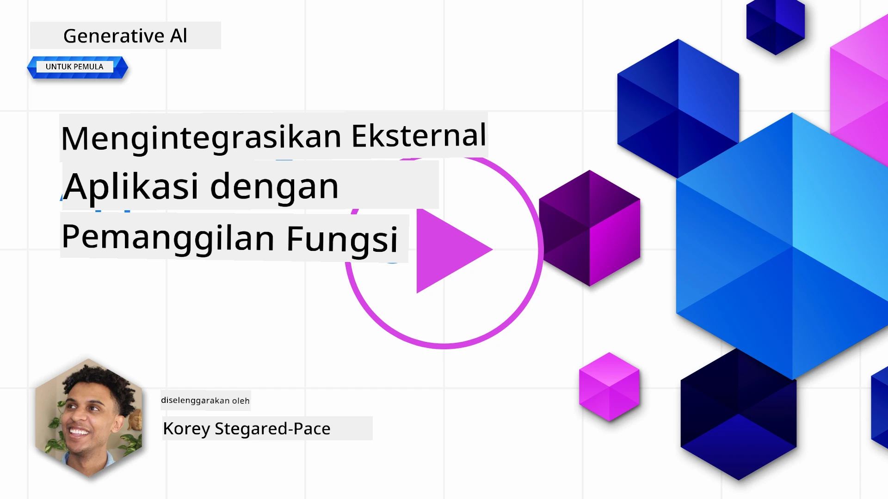
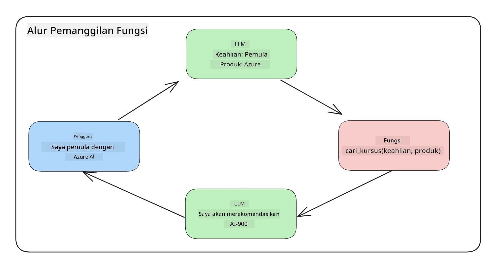
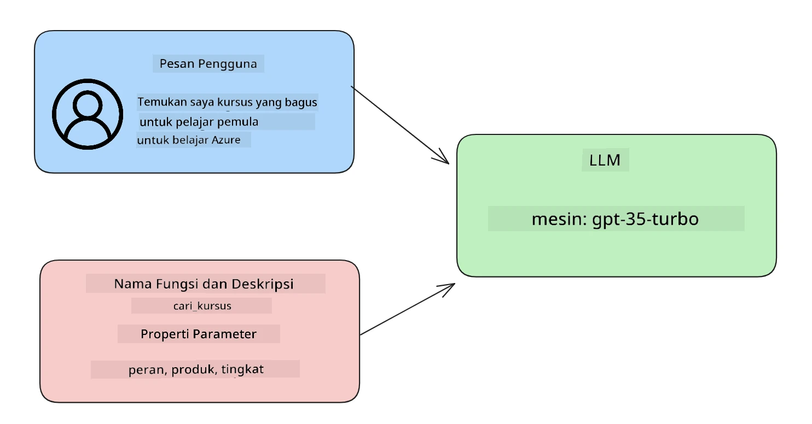

# Integrasi dengan pemanggilan fungsi

[](https://youtu.be/DgUdCLX8qYQ?si=f1ouQU5HQx6F8Gl2)

Anda telah belajar cukup banyak sejauh ini dalam pelajaran sebelumnya. Namun, kita bisa meningkatkan lebih jauh. Beberapa hal yang bisa kita atasi adalah bagaimana kita dapat memperoleh format respons yang lebih konsisten agar lebih mudah bekerja dengan respons tersebut di tahap berikutnya. Selain itu, kita mungkin ingin menambahkan data dari sumber lain untuk memperkaya aplikasi kita.

Masalah yang disebutkan di atas adalah apa yang ingin diselesaikan bab ini.

## Pendahuluan

Pelajaran ini akan membahas:

- Menjelaskan apa itu pemanggilan fungsi dan kasus penggunaannya.
- Membuat panggilan fungsi menggunakan Azure OpenAI.
- Cara mengintegrasikan pemanggilan fungsi ke dalam sebuah aplikasi.

## Tujuan Pembelajaran

Pada akhir pelajaran ini, Anda akan mampu:

- Menjelaskan tujuan penggunaan pemanggilan fungsi.
- Mengatur Pemanggilan Fungsi menggunakan Azure OpenAI Service.
- Merancang pemanggilan fungsi yang efektif untuk kasus penggunaan aplikasi Anda.

## Skenario: Meningkatkan chatbot kita dengan fungsi

Untuk pelajaran ini, kita ingin membangun fitur untuk startup pendidikan kita yang memungkinkan pengguna menggunakan chatbot untuk menemukan kursus teknis. Kita akan merekomendasikan kursus yang sesuai dengan tingkat keterampilan mereka, peran saat ini, dan teknologi yang diminati.

Untuk menyelesaikan skenario ini, kita akan menggunakan kombinasi:

- `Azure OpenAI` untuk membuat pengalaman chat bagi pengguna.
- `Microsoft Learn Catalog API` untuk membantu pengguna menemukan kursus berdasarkan permintaan pengguna.
- `Pemanggilan Fungsi` untuk mengambil query pengguna dan mengirimkannya ke fungsi untuk membuat permintaan API.

Untuk memulai, mari kita melihat mengapa kita ingin menggunakan pemanggilan fungsi sejak awal:

## Mengapa Pemanggilan Fungsi

Sebelum adanya pemanggilan fungsi, respons dari LLM bersifat tidak terstruktur dan tidak konsisten. Pengembang harus menulis kode validasi kompleks untuk memastikan mereka dapat menangani setiap variasi respons. Pengguna tidak bisa mendapatkan jawaban seperti "Apa cuaca saat ini di Stockholm?". Ini karena model dibatasi oleh waktu saat data dilatih.

Pemanggilan Fungsi adalah fitur dari Azure OpenAI Service untuk mengatasi keterbatasan berikut:

- **Format respons yang konsisten**. Jika kita dapat lebih mengontrol format respons, kita dapat lebih mudah mengintegrasikan respons tersebut ke sistem lain.
- **Data eksternal**. Kemampuan menggunakan data dari sumber lain dalam konteks chat.

## Mengilustrasikan masalah melalui skenario

> Kami menyarankan Anda menggunakan [notebook yang disertakan](./python/aoai-assignment.ipynb?WT.mc_id=academic-105485-koreyst) jika Anda ingin menjalankan skenario di bawah ini. Anda juga bisa hanya membacanya sembari kami mencoba mengilustrasikan masalah dimana fungsi dapat membantu mengatasi masalah tersebut.

Mari kita lihat contoh yang mengilustrasikan masalah format respons:

Katakanlah kita ingin membuat database data siswa agar dapat menyarankan kursus yang tepat bagi mereka. Di bawah ini kami memiliki dua deskripsi siswa yang sangat mirip dalam data yang mereka miliki.

1. Buat koneksi ke sumber daya Azure OpenAI kita:

   ```python
   import os
   import json
   from openai import OpenAI
   from dotenv import load_dotenv
   load_dotenv()

   # API Respons disajikan dari Azure OpenAI (Microsoft Foundry) v1
   # endpoint, jadi kami mengarahkan klien OpenAI ke <your-endpoint>/openai/v1/.
   endpoint = os.environ['AZURE_OPENAI_ENDPOINT']
   client = OpenAI(
   api_key=os.environ['AZURE_OPENAI_API_KEY'],
   base_url=f"{endpoint.rstrip('/')}/openai/v1/",
   )

   deployment=os.environ['AZURE_OPENAI_DEPLOYMENT']
   ```

   Di bawah ini adalah kode Python untuk mengonfigurasi koneksi kita ke Azure OpenAI. Karena kita menggunakan endpoint v1, kita hanya perlu mengatur `api_key` dan `base_url` (tidak perlu `api_version`).

1. Membuat dua deskripsi siswa menggunakan variabel `student_1_description` dan `student_2_description`.

   ```python
   student_1_description="Emily Johnson is a sophomore majoring in computer science at Duke University. She has a 3.7 GPA. Emily is an active member of the university's Chess Club and Debate Team. She hopes to pursue a career in software engineering after graduating."

   student_2_description = "Michael Lee is a sophomore majoring in computer science at Stanford University. He has a 3.8 GPA. Michael is known for his programming skills and is an active member of the university's Robotics Club. He hopes to pursue a career in artificial intelligence after finishing his studies."
   ```

   Kita ingin mengirim deskripsi siswa di atas ke LLM untuk mem-parsing data. Data ini nantinya bisa digunakan dalam aplikasi dan dikirim ke API atau disimpan dalam database.

1. Mari kita buat dua prompt identik di mana kita menginstruksikan LLM tentang informasi apa yang ingin kita dapatkan:

   ```python
   prompt1 = f'''
   Please extract the following information from the given text and return it as a JSON object:

   name
   major
   school
   grades
   club

   This is the body of text to extract the information from:
   {student_1_description}
   '''

   prompt2 = f'''
   Please extract the following information from the given text and return it as a JSON object:

   name
   major
   school
   grades
   club

   This is the body of text to extract the information from:
   {student_2_description}
   '''
   ```

   Prompt di atas menginstruksikan LLM untuk mengekstrak informasi dan mengembalikan respons dalam format JSON.

1. Setelah menyiapkan prompt dan koneksi ke Azure OpenAI, sekarang kita kirim prompt ke LLM dengan menggunakan `client.responses.create`. Kita simpan prompt di variabel `input` dan menetapkan peran sebagai `user`. Ini meniru pesan yang ditulis pengguna ke chatbot.

   ```python
   # respons dari prompt satu
   openai_response1 = client.responses.create(
   model=deployment,
   input = [{'role': 'user', 'content': prompt1}],
   store=False,
   )
   openai_response1.output_text

   # respons dari prompt dua
   openai_response2 = client.responses.create(
   model=deployment,
   input = [{'role': 'user', 'content': prompt2}],
   store=False,
   )
   openai_response2.output_text
   ```

Sekarang kita dapat mengirim kedua permintaan ke LLM dan memeriksa respons yang diterima dengan melihatnya seperti `openai_response1.output_text`.

1. Terakhir, kita dapat mengonversi respons ke format JSON dengan memanggil `json.loads`:

   ```python
   # Memuat respon sebagai objek JSON
   json_response1 = json.loads(openai_response1.output_text)
   json_response1
   ```

   Respons 1:

   ```json
   {
     "name": "Emily Johnson",
     "major": "computer science",
     "school": "Duke University",
     "grades": "3.7",
     "club": "Chess Club"
   }
   ```

   Respons 2:

   ```json
   {
     "name": "Michael Lee",
     "major": "computer science",
     "school": "Stanford University",
     "grades": "3.8 GPA",
     "club": "Robotics Club"
   }
   ```

   Meskipun prompt sama dan deskripsinya mirip, kita melihat nilai dari properti `Grades` diformat berbeda, karena kadang kita mendapatkan format `3.7` atau `3.7 GPA` misalnya.

   Hasil ini terjadi karena LLM menerima data tidak terstruktur dalam bentuk prompt tertulis dan juga mengembalikan data tidak terstruktur. Kita membutuhkan format yang terstruktur agar kita tahu apa yang diharapkan saat menyimpan atau menggunakan data ini.

Jadi bagaimana kita menyelesaikan masalah format ini? Dengan menggunakan pemanggilan fungsi, kita dapat memastikan bahwa kita menerima data yang terstruktur kembali. Ketika menggunakan pemanggilan fungsi, LLM tidak benar-benar memanggil atau menjalankan fungsi. Sebagai gantinya, kita membuat struktur yang harus diikuti LLM untuk responsnya. Kemudian kita menggunakan respons terstruktur itu untuk mengetahui fungsi mana yang harus dijalankan dalam aplikasi kita.



Kita kemudian dapat mengambil apa yang dikembalikan dari fungsi dan mengirimkannya kembali ke LLM. LLM kemudian akan merespon menggunakan bahasa alami untuk menjawab pertanyaan pengguna.

## Kasus penggunaan untuk menggunakan pemanggilan fungsi

Ada banyak kasus dimana pemanggilan fungsi dapat meningkatkan aplikasi Anda, seperti:

- **Memanggil Alat Eksternal**. Chatbot sangat baik memberikan jawaban atas pertanyaan pengguna. Dengan menggunakan pemanggilan fungsi, chatbot dapat menggunakan pesan dari pengguna untuk menyelesaikan tugas tertentu. Misalnya, seorang siswa bisa meminta chatbot "Kirim email ke instruktur saya bahwa saya butuh bantuan lebih banyak dengan mata pelajaran ini". Ini dapat membuat pemanggilan fungsi ke `send_email(to: string, body: string)`

- **Membuat Query API atau Database**. Pengguna dapat menemukan informasi menggunakan bahasa alami yang kemudian diubah menjadi query atau permintaan API yang terformat. Contohnya bisa saja guru yang meminta "Siapa saja siswa yang menyelesaikan tugas terakhir" yang dapat memanggil fungsi bernama `get_completed(student_name: string, assignment: int, current_status: string)`

- **Membuat Data Terstruktur**. Pengguna dapat mengambil blok teks atau CSV dan menggunakan LLM untuk mengekstrak informasi penting darinya. Misalnya, seorang siswa bisa mengubah artikel Wikipedia tentang perjanjian damai untuk membuat flashcard AI. Ini bisa dilakukan dengan menggunakan fungsi bernama `get_important_facts(agreement_name: string, date_signed: string, parties_involved: list)`

## Membuat Panggilan Fungsi Pertama Anda

Proses membuat panggilan fungsi meliputi 3 langkah utama:

1. **Memanggil** Responses API dengan daftar fungsi (alat) Anda dan pesan pengguna.
2. **Membaca** respons model untuk melakukan tindakan, misalnya menjalankan fungsi atau melakukan Panggilan API.
3. **Membuat** panggilan lain ke Responses API dengan respons dari fungsi Anda untuk menggunakan informasi itu guna membuat respons ke pengguna.



### Langkah 1 - membuat pesan

Langkah pertama adalah membuat pesan pengguna. Ini bisa diberikan secara dinamis dengan mengambil nilai dari input teks atau Anda dapat menetapkan nilainya di sini. Jika ini adalah pertama kali Anda bekerja dengan Responses API, kita perlu mendefinisikan `role` dan `content` dari pesan.

`role` bisa berupa `system` (membuat aturan), `assistant` (model) atau `user` (pengguna akhir). Untuk pemanggilan fungsi, kita tetapkan sebagai `user` dan sebuah contoh pertanyaan.

```python
messages= [ {"role": "user", "content": "Find me a good course for a beginner student to learn Azure."} ]
```

Dengan menetapkan peran berbeda, LLM dibuat jelas apakah yang berbicara adalah sistem atau pengguna, yang membantu membangun sejarah percakapan yang bisa dibangun oleh LLM.

### Langkah 2 - membuat fungsi

Selanjutnya, kita akan mendefinisikan fungsi dan parameter dari fungsi itu. Kita akan menggunakan hanya satu fungsi bernama `search_courses` tapi Anda bisa membuat beberapa fungsi.

> **Penting** : Fungsi dimasukkan dalam pesan sistem ke LLM dan akan dihitung dalam jumlah token yang tersedia.

Di bawah ini, kita membuat fungsi sebagai array item. Setiap item adalah alat dalam format Responses API datar, dengan properti `type`, `name`, `description`, dan `parameters`:

```python
functions = [
   {
      "type":"function",
      "name":"search_courses",
      "description":"Retrieves courses from the search index based on the parameters provided",
      "parameters":{
         "type":"object",
         "properties":{
            "role":{
               "type":"string",
               "description":"The role of the learner (i.e. developer, data scientist, student, etc.)"
            },
            "product":{
               "type":"string",
               "description":"The product that the lesson is covering (i.e. Azure, Power BI, etc.)"
            },
            "level":{
               "type":"string",
               "description":"The level of experience the learner has prior to taking the course (i.e. beginner, intermediate, advanced)"
            }
         },
         "required":[
            "role"
         ]
      }
   }
]
```

Mari kita jelaskan setiap contoh fungsi dengan lebih rinci berikut:

- `name` - Nama fungsi yang ingin kita panggil.
- `description` - Deskripsi tentang cara kerja fungsi. Di sini penting untuk spesifik dan jelas.
- `parameters` - Daftar nilai dan format yang ingin Anda hasilkan model dalam responsnya. Parameter terdiri dari item dengan properti berikut:
  1.  `type` - Tipe data dari properti yang akan disimpan.
  1.  `properties` - Daftar nilai spesifik yang digunakan model dalam responsnya
      1. `name` - Kunci adalah nama properti yang digunakan model dalam respons formatnya, misal `product`.
      1. `type` - Tipe data dari properti ini, misalnya `string`.
      1. `description` - Deskripsi dari properti spesifik.

Ada juga properti opsional `required` - properti yang wajib ada agar panggilan fungsi berhasil.

### Langkah 3 - Melakukan panggilan fungsi

Setelah mendefinisikan fungsi, sekarang kita perlu menyertakannya dalam panggilan ke Responses API. Kita melakukannya dengan menambah `tools` ke permintaan. Dalam hal ini `tools=functions`.

Ada juga opsi untuk menetapkan `tool_choice` ke `auto`. Ini berarti kita membiarkan LLM memutuskan fungsi mana yang harus dipanggil berdasarkan pesan pengguna, bukan kita yang menetapkannya.

Berikut kode di bawah di mana kita memanggil `client.responses.create`, perhatikan bagaimana kita menetapkan `tools=functions` dan `tool_choice="auto"` sehingga memberi LLM pilihan kapan memanggil fungsi yang kita sediakan:

```python
response = client.responses.create(model=deployment,
                                        input=messages,
                                        tools=functions,
                                        tool_choice="auto",
                                        store=False)

print(response.output)
```

Respons yang diterima sekarang menyertakan item `function_call` dalam `response.output` yang terlihat seperti ini:

```json
{
  "type": "function_call",
  "name": "search_courses",
  "call_id": "call_abc123",
  "arguments": "{\n  \"role\": \"student\",\n  \"product\": \"Azure\",\n  \"level\": \"beginner\"\n}"
}
```

Di sini kita bisa lihat bagaimana fungsi `search_courses` dipanggil dan dengan argumen apa saja, yang tercantum dalam properti `arguments` di respons JSON.

Kesimpulannya LLM mampu menemukan data yang sesuai dengan argumen fungsi karena mengekstraknya dari nilai yang diberikan ke parameter `input` dalam panggilan Responses API. Di bawah ini pengingat nilai `messages`:

```python
messages= [ {"role": "user", "content": "Find me a good course for a beginner student to learn Azure."} ]
```

Seperti yang Anda lihat, `student`, `Azure`, dan `beginner` diekstrak dari `messages` dan disetel sebagai input untuk fungsi. Menggunakan fungsi dengan cara ini adalah cara bagus untuk mengekstrak informasi dari prompt sekaligus memberikan struktur kepada LLM dan memiliki fungsionalitas yang dapat digunakan ulang.

Selanjutnya, kita perlu melihat bagaimana cara menggunakan ini dalam aplikasi kita.

## Mengintegrasikan Panggilan Fungsi ke dalam Aplikasi

Setelah kita menguji respons terformat dari LLM, sekarang kita dapat mengintegrasikannya ke dalam aplikasi.

### Mengelola alur

Untuk mengintegrasikannya ke dalam aplikasi kita, mari lakukan langkah-langkah berikut:

1. Pertama, mari buat panggilan ke layanan OpenAI dan ambil item panggilan fungsi dari respons `output`.

   ```python
   response_items = response.output
   tool_calls = [item for item in response_items if item.type == "function_call"]
   ```

1. Sekarang kita definisikan fungsi yang akan memanggil Microsoft Learn API untuk mendapatkan daftar kursus:

   ```python
   import requests

   def search_courses(role, product, level):
     url = "https://learn.microsoft.com/api/catalog/"
     params = {
        "role": role,
        "product": product,
        "level": level
     }
     response = requests.get(url, params=params)
     modules = response.json()["modules"]
     results = []
     for module in modules[:5]:
        title = module["title"]
        url = module["url"]
        results.append({"title": title, "url": url})
     return str(results)
   ```

   Perhatikan bagaimana kita sekarang membuat fungsi Python sebenarnya yang memetakan ke nama fungsi yang diperkenalkan dalam variabel `functions`. Kita juga membuat panggilan API eksternal nyata untuk mengambil data yang kita butuhkan. Dalam hal ini, kita menggunakan Microsoft Learn API untuk mencari modul pelatihan.

Baik, kita telah membuat variabel `functions` dan fungsi Python yang sesuai, bagaimana cara memberi tahu LLM bagaimana memetakan keduanya agar fungsi Python tersebut dipanggil?

1. Untuk mengetahui apakah kita perlu memanggil fungsi Python, kita harus melihat respons LLM apakah ada item `function_call` dan memanggil fungsi tersebut. Berikut adalah cara Anda bisa melakukan pengecekan tersebut:

   ```python
   # Periksa jika model ingin memanggil sebuah fungsi
   if tool_calls:
    for tool_call in tool_calls:
     print("Recommended Function call:")
     print(tool_call.name)
     print()

     # Panggil fungsi tersebut.
     function_name = tool_call.name

     available_functions = {
             "search_courses": search_courses,
     }
     function_to_call = available_functions[function_name]

     function_args = json.loads(tool_call.arguments)
     function_response = function_to_call(**function_args)

     print("Output of function call:")
     print(function_response)
     print(type(function_response))

     # Tambahkan panggilan fungsi dan hasilnya kembali ke percakapan.
     # Item function_call dari model harus ditambahkan sebelum outputnya.
     messages.append(tool_call)  # item function_call dari asisten
     messages.append( # hasil fungsi
         {
             "type": "function_call_output",
             "call_id": tool_call.call_id,
             "output": function_response,
         }
     )
   ```

   Ketiga baris ini memastikan kita mengekstrak nama fungsi, argumen dan melakukan panggilan:

   ```python
   function_to_call = available_functions[function_name]

   function_args = json.loads(tool_call.arguments)
   function_response = function_to_call(**function_args)
   ```

   Di bawah ini output dari menjalankan kode kita:

   **Output**

   ```Recommended Function call:
   {
     "name": "search_courses",
     "arguments": "{\n  \"role\": \"student\",\n  \"product\": \"Azure\",\n  \"level\": \"beginner\"\n}"
   }

   Output of function call:
   [{'title': 'Describe concepts of cryptography', 'url': 'https://learn.microsoft.com/training/modules/describe-concepts-of-cryptography/?
   WT.mc_id=api_CatalogApi'}, {'title': 'Introduction to audio classification with TensorFlow', 'url': 'https://learn.microsoft.com/en-
   us/training/modules/intro-audio-classification-tensorflow/?WT.mc_id=api_CatalogApi'}, {'title': 'Design a Performant Data Model in Azure SQL
   Database with Azure Data Studio', 'url': 'https://learn.microsoft.com/training/modules/design-a-data-model-with-ads/?
   WT.mc_id=api_CatalogApi'}, {'title': 'Getting started with the Microsoft Cloud Adoption Framework for Azure', 'url':
   'https://learn.microsoft.com/training/modules/cloud-adoption-framework-getting-started/?WT.mc_id=api_CatalogApi'}, {'title': 'Set up the
   Rust development environment', 'url': 'https://learn.microsoft.com/training/modules/rust-set-up-environment/?WT.mc_id=api_CatalogApi'}]
   <class 'str'>
   ```

1. Sekarang kita kirim pesan yang diperbarui, `messages` ke LLM agar kita bisa menerima respons dalam bahasa alami daripada respons format JSON API.

   ```python
   print("Messages in next request:")
   print(messages)
   print()

   second_response = client.responses.create(
      input=messages,
      model=deployment,
      tool_choice="auto",
      tools=functions,
      temperature=0,
      store=False,
         )  # dapatkan respons baru dari model di mana ia dapat melihat respons fungsi


   print(second_response.output_text)
   ```

   **Output**

   ```text
   I found some good courses for beginner students to learn Azure:

   1. [Describe concepts of cryptography](https://learn.microsoft.com/training/modules/describe-concepts-of-cryptography/?WT.mc_id=api_CatalogApi)
   2. [Introduction to audio classification with TensorFlow](https://learn.microsoft.com/training/modules/intro-audio-classification-tensorflow/?WT.mc_id=api_CatalogApi)
   3. [Design a Performant Data Model in Azure SQL Database with Azure Data Studio](https://learn.microsoft.com/training/modules/design-a-data-model-with-ads/?WT.mc_id=api_CatalogApi)
   4. [Getting started with the Microsoft Cloud Adoption Framework for Azure](https://learn.microsoft.com/training/modules/cloud-adoption-framework-getting-started/?WT.mc_id=api_CatalogApi)
   5. [Set up the Rust development environment](https://learn.microsoft.com/training/modules/rust-set-up-environment/?WT.mc_id=api_CatalogApi)

   You can click on the links to access the courses.
   ```

## Tugas

Untuk melanjutkan pembelajaran Azure OpenAI Function Calling Anda dapat membuat:

- Lebih banyak parameter fungsi yang dapat membantu pelajar menemukan lebih banyak kursus.

- Buat panggilan fungsi lain yang mengambil lebih banyak informasi dari pelajar seperti bahasa asli mereka
- Buat penanganan kesalahan ketika panggilan fungsi dan/atau panggilan API tidak mengembalikan kursus yang sesuai

Petunjuk: Ikuti halaman [Dokumentasi referensi API Learn](https://learn.microsoft.com/training/support/catalog-api-developer-reference?WT.mc_id=academic-105485-koreyst) untuk melihat bagaimana dan di mana data ini tersedia.

## Kerja Bagus! Lanjutkan Perjalanan

Setelah menyelesaikan pelajaran ini, lihat koleksi [Pembelajaran AI Generatif](https://aka.ms/genai-collection?WT.mc_id=academic-105485-koreyst) kami untuk melanjutkan meningkatkan pengetahuan AI Generatif Anda!

Langsung ke Pelajaran 12, di mana kita akan melihat bagaimana [merancang UX untuk aplikasi AI](../12-designing-ux-for-ai-applications/README.md?WT.mc_id=academic-105485-koreyst)!

---

<!-- CO-OP TRANSLATOR DISCLAIMER START -->
**Penafian**:
Dokumen ini telah diterjemahkan menggunakan layanan terjemahan AI [Co-op Translator](https://github.com/Azure/co-op-translator). Meskipun kami berupaya untuk mencapai akurasi, harap diketahui bahwa terjemahan otomatis mungkin mengandung kesalahan atau ketidakakuratan. Dokumen asli dalam bahasa aslinya harus dianggap sebagai sumber yang sah. Untuk informasi penting, disarankan menggunakan terjemahan profesional oleh manusia. Kami tidak bertanggung jawab atas kesalahpahaman atau penafsiran yang keliru yang timbul dari penggunaan terjemahan ini.
<!-- CO-OP TRANSLATOR DISCLAIMER END -->