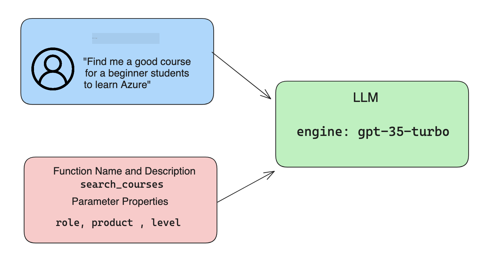

<!--
CO_OP_TRANSLATOR_METADATA:
{
  "original_hash": "f6f84f9ef2d066cd25850cab93580a50",
  "translation_date": "2025-10-17T20:43:13+00:00",
  "source_file": "11-integrating-with-function-calling/README.md",
  "language_code": "id"
}
-->
# Mengintegrasikan dengan Pemanggilan Fungsi

[](https://youtu.be/DgUdCLX8qYQ?si=f1ouQU5HQx6F8Gl2)

Anda telah mempelajari cukup banyak sejauh ini dalam pelajaran sebelumnya. Namun, kita masih bisa meningkatkan lebih jauh. Beberapa hal yang dapat kita perbaiki adalah bagaimana kita bisa mendapatkan format respons yang lebih konsisten agar lebih mudah bekerja dengan respons di tahap selanjutnya. Selain itu, kita mungkin ingin menambahkan data dari sumber lain untuk memperkaya aplikasi kita.

Masalah yang disebutkan di atas adalah apa yang akan dibahas dalam bab ini.

## Pendahuluan

Pelajaran ini akan mencakup:

- Menjelaskan apa itu pemanggilan fungsi dan kasus penggunaannya.
- Membuat pemanggilan fungsi menggunakan Azure OpenAI.
- Cara mengintegrasikan pemanggilan fungsi ke dalam aplikasi.

## Tujuan Pembelajaran

Pada akhir pelajaran ini, Anda akan dapat:

- Menjelaskan tujuan menggunakan pemanggilan fungsi.
- Menyiapkan Pemanggilan Fungsi menggunakan Azure OpenAI Service.
- Merancang pemanggilan fungsi yang efektif untuk kasus penggunaan aplikasi Anda.

## Skenario: Meningkatkan chatbot kita dengan fungsi

Untuk pelajaran ini, kita ingin membangun fitur untuk startup pendidikan kita yang memungkinkan pengguna menggunakan chatbot untuk menemukan kursus teknis. Kami akan merekomendasikan kursus yang sesuai dengan tingkat keterampilan mereka, peran saat ini, dan teknologi yang diminati.

Untuk menyelesaikan skenario ini, kita akan menggunakan kombinasi:

- `Azure OpenAI` untuk menciptakan pengalaman chat bagi pengguna.
- `Microsoft Learn Catalog API` untuk membantu pengguna menemukan kursus berdasarkan permintaan mereka.
- `Pemanggilan Fungsi` untuk mengambil kueri pengguna dan mengirimkannya ke fungsi untuk membuat permintaan API.

Untuk memulai, mari kita lihat mengapa kita ingin menggunakan pemanggilan fungsi sejak awal:

## Mengapa Pemanggilan Fungsi

Sebelum pemanggilan fungsi, respons dari LLM tidak terstruktur dan tidak konsisten. Pengembang harus menulis kode validasi yang kompleks untuk memastikan mereka dapat menangani setiap variasi respons. Pengguna tidak dapat mendapatkan jawaban seperti "Bagaimana cuaca saat ini di Stockholm?". Hal ini karena model terbatas pada waktu data dilatih.

Pemanggilan Fungsi adalah fitur dari Azure OpenAI Service untuk mengatasi keterbatasan berikut:

- **Format respons yang konsisten**. Jika kita dapat mengontrol format respons dengan lebih baik, kita dapat lebih mudah mengintegrasikan respons ke sistem lain.
- **Data eksternal**. Kemampuan menggunakan data dari sumber lain dalam aplikasi dalam konteks chat.

## Mengilustrasikan masalah melalui skenario

> Kami merekomendasikan Anda menggunakan [notebook yang disertakan](./python/aoai-assignment.ipynb?WT.mc_id=academic-105485-koreyst) jika Anda ingin menjalankan skenario di bawah ini. Anda juga dapat membaca penjelasan ini untuk memahami masalah yang dapat diatasi dengan fungsi.

Mari kita lihat contoh yang mengilustrasikan masalah format respons:

Misalkan kita ingin membuat database data siswa sehingga kita dapat menyarankan kursus yang tepat kepada mereka. Di bawah ini ada dua deskripsi siswa yang sangat mirip dalam data yang mereka miliki.

1. Membuat koneksi ke sumber daya Azure OpenAI kita:

   ```python
   import os
   import json
   from openai import AzureOpenAI
   from dotenv import load_dotenv
   load_dotenv()

   client = AzureOpenAI(
   api_key=os.environ['AZURE_OPENAI_API_KEY'],  # this is also the default, it can be omitted
   api_version = "2023-07-01-preview"
   )

   deployment=os.environ['AZURE_OPENAI_DEPLOYMENT']
   ```

   Di bawah ini adalah beberapa kode Python untuk mengonfigurasi koneksi kita ke Azure OpenAI di mana kita mengatur `api_type`, `api_base`, `api_version`, dan `api_key`.

1. Membuat dua deskripsi siswa menggunakan variabel `student_1_description` dan `student_2_description`.

   ```python
   student_1_description="Emily Johnson is a sophomore majoring in computer science at Duke University. She has a 3.7 GPA. Emily is an active member of the university's Chess Club and Debate Team. She hopes to pursue a career in software engineering after graduating."

   student_2_description = "Michael Lee is a sophomore majoring in computer science at Stanford University. He has a 3.8 GPA. Michael is known for his programming skills and is an active member of the university's Robotics Club. He hopes to pursue a career in artificial intelligence after finishing his studies."
   ```

   Kami ingin mengirim deskripsi siswa di atas ke LLM untuk memproses data. Data ini nantinya dapat digunakan dalam aplikasi kami dan dikirim ke API atau disimpan dalam database.

1. Mari kita buat dua prompt identik di mana kita menginstruksikan LLM tentang informasi apa yang kita minati:

   ```python
   prompt1 = f'''
   Please extract the following information from the given text and return it as a JSON object:

   name
   major
   school
   grades
   club

   This is the body of text to extract the information from:
   {student_1_description}
   '''

   prompt2 = f'''
   Please extract the following information from the given text and return it as a JSON object:

   name
   major
   school
   grades
   club

   This is the body of text to extract the information from:
   {student_2_description}
   '''
   ```

   Prompt di atas menginstruksikan LLM untuk mengekstrak informasi dan mengembalikan respons dalam format JSON.

1. Setelah mengatur prompt dan koneksi ke Azure OpenAI, sekarang kita akan mengirimkan prompt ke LLM menggunakan `openai.ChatCompletion`. Kami menyimpan prompt dalam variabel `messages` dan menetapkan peran sebagai `user`. Hal ini untuk meniru pesan dari pengguna yang ditulis ke chatbot.

   ```python
   # response from prompt one
   openai_response1 = client.chat.completions.create(
   model=deployment,
   messages = [{'role': 'user', 'content': prompt1}]
   )
   openai_response1.choices[0].message.content

   # response from prompt two
   openai_response2 = client.chat.completions.create(
   model=deployment,
   messages = [{'role': 'user', 'content': prompt2}]
   )
   openai_response2.choices[0].message.content
   ```

Sekarang kita dapat mengirim kedua permintaan ke LLM dan memeriksa respons yang kita terima dengan menemukannya seperti ini `openai_response1['choices'][0]['message']['content']`.

1. Terakhir, kita dapat mengonversi respons ke format JSON dengan memanggil `json.loads`:

   ```python
   # Loading the response as a JSON object
   json_response1 = json.loads(openai_response1.choices[0].message.content)
   json_response1
   ```

   Respons 1:

   ```json
   {
     "name": "Emily Johnson",
     "major": "computer science",
     "school": "Duke University",
     "grades": "3.7",
     "club": "Chess Club"
   }
   ```

   Respons 2:

   ```json
   {
     "name": "Michael Lee",
     "major": "computer science",
     "school": "Stanford University",
     "grades": "3.8 GPA",
     "club": "Robotics Club"
   }
   ```

   Meskipun promptnya sama dan deskripsinya mirip, kita melihat nilai properti `Grades` diformat secara berbeda, seperti kadang-kadang kita mendapatkan format `3.7` atau `3.7 GPA` misalnya.

   Hasil ini terjadi karena LLM mengambil data tidak terstruktur dalam bentuk prompt tertulis dan juga mengembalikan data yang tidak terstruktur. Kita perlu memiliki format yang terstruktur sehingga kita tahu apa yang diharapkan saat menyimpan atau menggunakan data ini.

Jadi bagaimana kita menyelesaikan masalah format ini? Dengan menggunakan pemanggilan fungsi, kita dapat memastikan bahwa kita menerima data yang terstruktur kembali. Saat menggunakan pemanggilan fungsi, LLM sebenarnya tidak memanggil atau menjalankan fungsi apa pun. Sebaliknya, kita membuat struktur untuk diikuti LLM dalam responsnya. Kami kemudian menggunakan respons terstruktur tersebut untuk mengetahui fungsi apa yang harus dijalankan dalam aplikasi kami.


Kami kemudian dapat mengambil apa yang dikembalikan dari fungsi dan mengirimkannya kembali ke LLM. LLM kemudian akan merespons menggunakan bahasa alami untuk menjawab kueri pengguna.

## Kasus Penggunaan Pemanggilan Fungsi

Ada banyak kasus penggunaan berbeda di mana pemanggilan fungsi dapat meningkatkan aplikasi Anda seperti:

- **Memanggil Alat Eksternal**. Chatbot sangat baik dalam memberikan jawaban atas pertanyaan dari pengguna. Dengan menggunakan pemanggilan fungsi, chatbot dapat menggunakan pesan dari pengguna untuk menyelesaikan tugas tertentu. Misalnya, seorang siswa dapat meminta chatbot untuk "Kirim email ke instruktur saya yang mengatakan saya membutuhkan lebih banyak bantuan dengan subjek ini". Ini dapat membuat pemanggilan fungsi ke `send_email(to: string, body: string)`.

- **Membuat Permintaan API atau Database**. Pengguna dapat menemukan informasi menggunakan bahasa alami yang dikonversi menjadi kueri terformat atau permintaan API. Contohnya adalah seorang guru yang meminta "Siapa siswa yang menyelesaikan tugas terakhir" yang dapat memanggil fungsi bernama `get_completed(student_name: string, assignment: int, current_status: string)`.

- **Membuat Data Terstruktur**. Pengguna dapat mengambil blok teks atau CSV dan menggunakan LLM untuk mengekstrak informasi penting darinya. Misalnya, seorang siswa dapat mengonversi artikel Wikipedia tentang perjanjian damai untuk membuat kartu flash AI. Hal ini dapat dilakukan dengan menggunakan fungsi yang disebut `get_important_facts(agreement_name: string, date_signed: string, parties_involved: list)`.

## Membuat Pemanggilan Fungsi Pertama Anda

Proses membuat pemanggilan fungsi mencakup 3 langkah utama:

1. **Memanggil** API Chat Completions dengan daftar fungsi Anda dan pesan pengguna.
2. **Membaca** respons model untuk melakukan tindakan, misalnya menjalankan fungsi atau permintaan API.
3. **Melakukan** panggilan lain ke API Chat Completions dengan respons dari fungsi Anda untuk menggunakan informasi tersebut untuk membuat respons kepada pengguna.



### Langkah 1 - membuat pesan

Langkah pertama adalah membuat pesan pengguna. Ini dapat ditetapkan secara dinamis dengan mengambil nilai input teks atau Anda dapat menetapkan nilai di sini. Jika ini adalah pertama kalinya Anda bekerja dengan API Chat Completions, kita perlu mendefinisikan `role` dan `content` dari pesan.

`Role` dapat berupa `system` (membuat aturan), `assistant` (model), atau `user` (pengguna akhir). Untuk pemanggilan fungsi, kita akan menetapkannya sebagai `user` dan pertanyaan contoh.

```python
messages= [ {"role": "user", "content": "Find me a good course for a beginner student to learn Azure."} ]
```

Dengan menetapkan peran yang berbeda, menjadi jelas bagi LLM apakah itu sistem yang mengatakan sesuatu atau pengguna, yang membantu membangun riwayat percakapan yang dapat dikembangkan oleh LLM.

### Langkah 2 - membuat fungsi

Selanjutnya, kita akan mendefinisikan sebuah fungsi dan parameter dari fungsi tersebut. Kita akan menggunakan satu fungsi saja di sini yang disebut `search_courses`, tetapi Anda dapat membuat beberapa fungsi.

> **Penting**: Fungsi disertakan dalam pesan sistem ke LLM dan akan dihitung dalam jumlah token yang tersedia.

Di bawah ini, kami membuat fungsi sebagai array item. Setiap item adalah fungsi dan memiliki properti `name`, `description`, dan `parameters`:

```python
functions = [
   {
      "name":"search_courses",
      "description":"Retrieves courses from the search index based on the parameters provided",
      "parameters":{
         "type":"object",
         "properties":{
            "role":{
               "type":"string",
               "description":"The role of the learner (i.e. developer, data scientist, student, etc.)"
            },
            "product":{
               "type":"string",
               "description":"The product that the lesson is covering (i.e. Azure, Power BI, etc.)"
            },
            "level":{
               "type":"string",
               "description":"The level of experience the learner has prior to taking the course (i.e. beginner, intermediate, advanced)"
            }
         },
         "required":[
            "role"
         ]
      }
   }
]
```

Mari kita jelaskan setiap instance fungsi lebih detail di bawah ini:

- `name` - Nama fungsi yang ingin kita panggil.
- `description` - Ini adalah deskripsi tentang cara kerja fungsi. Di sini penting untuk spesifik dan jelas.
- `parameters` - Daftar nilai dan format yang ingin Anda modelkan untuk menghasilkan responsnya. Array parameter terdiri dari item di mana item memiliki properti berikut:
  1.  `type` - Tipe data tempat properti akan disimpan.
  1.  `properties` - Daftar nilai spesifik yang akan digunakan model untuk responsnya.
      1. `name` - Kunci adalah nama properti yang akan digunakan model dalam respons terformatnya, misalnya, `product`.
      1. `type` - Tipe data dari properti ini, misalnya, `string`.
      1. `description` - Deskripsi properti spesifik.

Ada juga properti opsional `required` - properti yang diperlukan agar pemanggilan fungsi dapat diselesaikan.

### Langkah 3 - Melakukan pemanggilan fungsi

Setelah mendefinisikan fungsi, sekarang kita perlu menyertakannya dalam panggilan ke Chat Completion API. Kita melakukan ini dengan menambahkan `functions` ke permintaan. Dalam hal ini `functions=functions`.

Ada juga opsi untuk mengatur `function_call` ke `auto`. Ini berarti kita akan membiarkan LLM memutuskan fungsi mana yang harus dipanggil berdasarkan pesan pengguna daripada menetapkannya sendiri.

Berikut adalah beberapa kode di bawah ini di mana kita memanggil `ChatCompletion.create`, perhatikan bagaimana kita mengatur `functions=functions` dan `function_call="auto"` sehingga memberikan LLM pilihan kapan harus memanggil fungsi yang kita sediakan:

```python
response = client.chat.completions.create(model=deployment,
                                        messages=messages,
                                        functions=functions,
                                        function_call="auto")

print(response.choices[0].message)
```

Respons yang kembali sekarang terlihat seperti ini:

```json
{
  "role": "assistant",
  "function_call": {
    "name": "search_courses",
    "arguments": "{\n  \"role\": \"student\",\n  \"product\": \"Azure\",\n  \"level\": \"beginner\"\n}"
  }
}
```

Di sini kita dapat melihat bagaimana fungsi `search_courses` dipanggil dan dengan argumen apa, seperti yang tercantum dalam properti `arguments` dalam respons JSON.

Kesimpulannya, LLM mampu menemukan data yang sesuai dengan argumen fungsi karena mengekstraknya dari nilai yang diberikan ke parameter `messages` dalam panggilan penyelesaian chat. Di bawah ini adalah pengingat nilai `messages`:

```python
messages= [ {"role": "user", "content": "Find me a good course for a beginner student to learn Azure."} ]
```

Seperti yang Anda lihat, `student`, `Azure`, dan `beginner` diekstraksi dari `messages` dan diatur sebagai input ke fungsi. Menggunakan fungsi dengan cara ini adalah cara yang bagus untuk mengekstrak informasi dari prompt tetapi juga untuk memberikan struktur kepada LLM dan memiliki fungsionalitas yang dapat digunakan kembali.

Selanjutnya, kita perlu melihat bagaimana kita dapat menggunakan ini dalam aplikasi kita.

## Mengintegrasikan Pemanggilan Fungsi ke dalam Aplikasi

Setelah kita menguji respons terformat dari LLM, sekarang kita dapat mengintegrasikannya ke dalam aplikasi.

### Mengelola alur

Untuk mengintegrasikan ini ke dalam aplikasi kita, mari kita lakukan langkah-langkah berikut:

1. Pertama, mari kita lakukan panggilan ke layanan OpenAI dan simpan pesan dalam variabel yang disebut `response_message`.

   ```python
   response_message = response.choices[0].message
   ```

1. Sekarang kita akan mendefinisikan fungsi yang akan memanggil Microsoft Learn API untuk mendapatkan daftar kursus:

   ```python
   import requests

   def search_courses(role, product, level):
     url = "https://learn.microsoft.com/api/catalog/"
     params = {
        "role": role,
        "product": product,
        "level": level
     }
     response = requests.get(url, params=params)
     modules = response.json()["modules"]
     results = []
     for module in modules[:5]:
        title = module["title"]
        url = module["url"]
        results.append({"title": title, "url": url})
     return str(results)
   ```

   Perhatikan bagaimana kita sekarang membuat fungsi Python yang sebenarnya yang sesuai dengan nama fungsi yang diperkenalkan dalam variabel `functions`. Kita juga membuat panggilan API eksternal nyata untuk mengambil data yang kita butuhkan. Dalam hal ini, kita menggunakan Microsoft Learn API untuk mencari modul pelatihan.

Baik, jadi kita telah membuat variabel `functions` dan fungsi Python yang sesuai, bagaimana kita memberi tahu LLM cara memetakan keduanya sehingga fungsi Python kita dipanggil?

1. Untuk melihat apakah kita perlu memanggil fungsi Python, kita perlu melihat respons LLM dan melihat apakah `function_call` adalah bagian darinya dan memanggil fungsi yang ditunjuk. Berikut adalah cara Anda dapat melakukan pemeriksaan yang disebutkan di bawah ini:

   ```python
   # Check if the model wants to call a function
   if response_message.function_call.name:
    print("Recommended Function call:")
    print(response_message.function_call.name)
    print()

    # Call the function.
    function_name = response_message.function_call.name

    available_functions = {
            "search_courses": search_courses,
    }
    function_to_call = available_functions[function_name]

    function_args = json.loads(response_message.function_call.arguments)
    function_response = function_to_call(**function_args)

    print("Output of function call:")
    print(function_response)
    print(type(function_response))


    # Add the assistant response and function response to the messages
    messages.append( # adding assistant response to messages
        {
            "role": response_message.role,
            "function_call": {
                "name": function_name,
                "arguments": response_message.function_call.arguments,
            },
            "content": None
        }
    )
    messages.append( # adding function response to messages
        {
            "role": "function",
            "name": function_name,
            "content":function_response,
        }
    )
   ```

   Ketiga baris ini memastikan kita mengekstrak nama fungsi, argumen, dan melakukan panggilan:

   ```python
   function_to_call = available_functions[function_name]

   function_args = json.loads(response_message.function_call.arguments)
   function_response = function_to_call(**function_args)
   ```

   Di bawah ini adalah output dari menjalankan kode kita:

   **Output**

   ```Recommended Function call:
   {
     "name": "search_courses",
     "arguments": "{\n  \"role\": \"student\",\n  \"product\": \"Azure\",\n  \"level\": \"beginner\"\n}"
   }

   Output of function call:
   [{'title': 'Describe concepts of cryptography', 'url': 'https://learn.microsoft.com/training/modules/describe-concepts-of-cryptography/?
   WT.mc_id=api_CatalogApi'}, {'title': 'Introduction to audio classification with TensorFlow', 'url': 'https://learn.microsoft.com/en-
   us/training/modules/intro-audio-classification-tensorflow/?WT.mc_id=api_CatalogApi'}, {'title': 'Design a Performant Data Model in Azure SQL
   Database with Azure Data Studio', 'url': 'https://learn.microsoft.com/training/modules/design-a-data-model-with-ads/?
   WT.mc_id=api_CatalogApi'}, {'title': 'Getting started with the Microsoft Cloud Adoption Framework for Azure', 'url':
   'https://learn.microsoft.com/training/modules/cloud-adoption-framework-getting-started/?WT.mc_id=api_CatalogApi'}, {'title': 'Set up the
   Rust development environment', 'url': 'https://learn.microsoft.com/training/modules/rust-set-up-environment/?WT.mc_id=api_CatalogApi'}]
   <class 'str'>
   ```

1. Sekarang kita akan mengirimkan pesan yang diperbarui, `messages` ke LLM sehingga kita dapat menerima respons bahasa alami alih-alih respons terformat JSON API.

   ```python
   print("Messages in next request:")
   print(messages)
   print()

   second_response = client.chat.completions.create(
      messages=messages,
      model=deployment,
      function_call="auto",
      functions=functions,
      temperature=0
         )  # get a new response from GPT where it can see the function response


   print(second_response.choices[0].message)
   ```

   **Output**

   ```python
   {
     "role": "assistant",
     "content": "I found some good courses for beginner students to learn Azure:\n\n1. [Describe concepts of cryptography] (https://learn.microsoft.com/training/modules/describe-concepts-of-cryptography/?WT.mc_id=api_CatalogApi)\n2. [Introduction to audio classification with TensorFlow](https://learn.microsoft.com/training/modules/intro-audio-classification-tensorflow/?WT.mc_id=api_CatalogApi)\n3. [Design a Performant Data Model in Azure SQL Database with Azure Data Studio](https://learn.microsoft.com/training/modules/design-a-data-model-with-ads/?WT.mc_id=api_CatalogApi)\n4. [Getting started with the Microsoft Cloud Adoption Framework for Azure](https://learn.microsoft.com/training/modules/cloud-adoption-framework-getting-started/?WT.mc_id=api_CatalogApi)\n5. [Set up the Rust development environment](https://learn.microsoft.com/training/modules/rust-set-up-environment/?WT.mc_id=api_CatalogApi)\n\nYou can click on the links to access the courses."
   }

   ```

## Tugas

Untuk melanjutkan pembelajaran Anda tentang Azure OpenAI Function Calling, Anda dapat membuat:

- Parameter fungsi yang lebih banyak yang mungkin membantu pelajar menemukan lebih banyak kursus.
- Membuat pemanggilan fungsi lain yang mengambil lebih banyak informasi dari pelajar seperti bahasa asli mereka.
- Buat penanganan kesalahan ketika pemanggilan fungsi dan/atau pemanggilan API tidak mengembalikan kursus yang sesuai

Petunjuk: Ikuti halaman [dokumentasi referensi API Learn](https://learn.microsoft.com/training/support/catalog-api-developer-reference?WT.mc_id=academic-105485-koreyst) untuk melihat bagaimana dan di mana data ini tersedia.

## Kerja Hebat! Lanjutkan Perjalanan

Setelah menyelesaikan pelajaran ini, lihat koleksi [Pembelajaran AI Generatif](https://aka.ms/genai-collection?WT.mc_id=academic-105485-koreyst) kami untuk terus meningkatkan pengetahuan Anda tentang AI Generatif!

Lanjutkan ke Pelajaran 12, di mana kita akan membahas cara [merancang UX untuk aplikasi AI](../12-designing-ux-for-ai-applications/README.md?WT.mc_id=academic-105485-koreyst)!

---

**Penafian**:  
Dokumen ini telah diterjemahkan menggunakan layanan penerjemahan AI [Co-op Translator](https://github.com/Azure/co-op-translator). Meskipun kami berupaya untuk memberikan hasil yang akurat, harap diketahui bahwa terjemahan otomatis mungkin mengandung kesalahan atau ketidakakuratan. Dokumen asli dalam bahasa aslinya harus dianggap sebagai sumber yang otoritatif. Untuk informasi yang penting, disarankan menggunakan jasa penerjemahan manusia profesional. Kami tidak bertanggung jawab atas kesalahpahaman atau interpretasi yang keliru yang timbul dari penggunaan terjemahan ini.