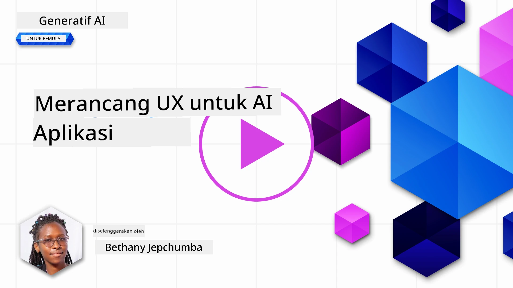
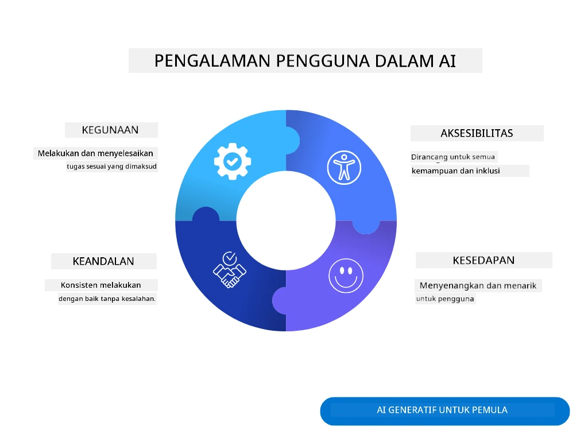
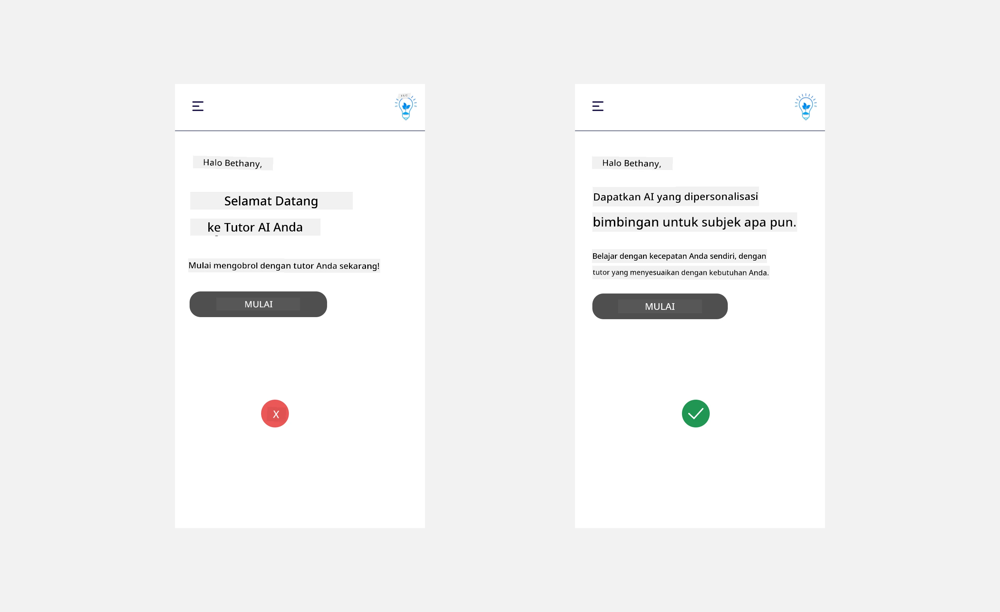
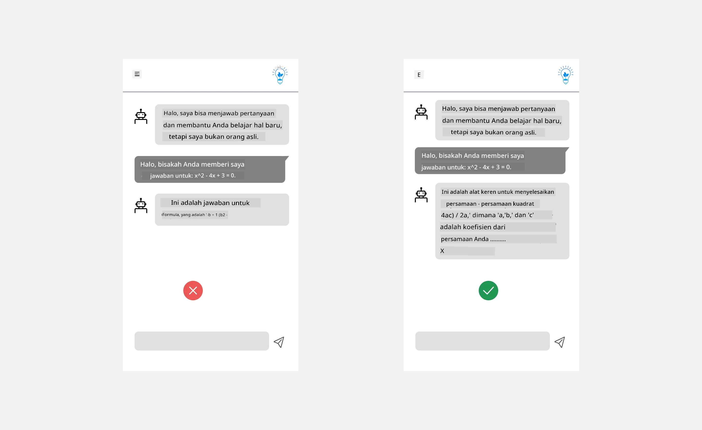
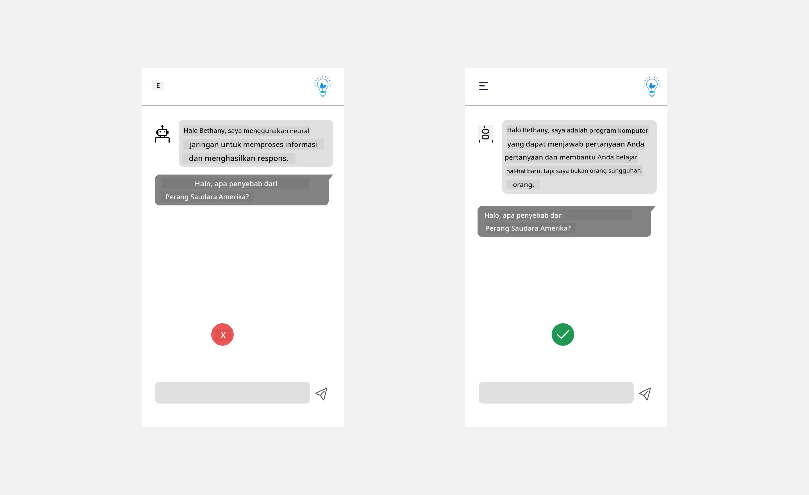
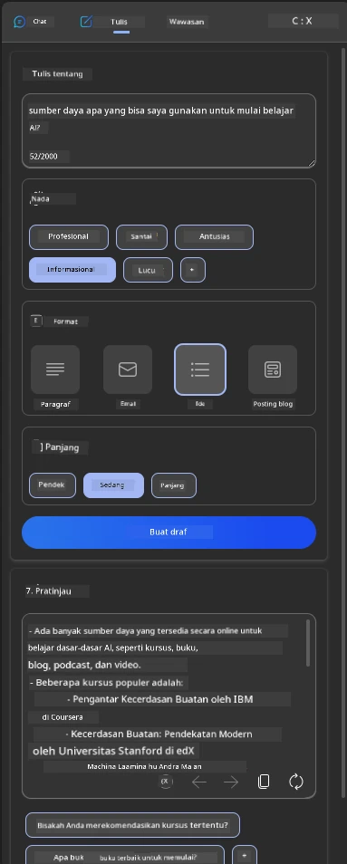
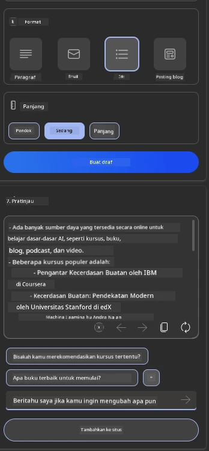

# Merancang UX untuk Aplikasi AI

> _(Klik gambar di atas untuk melihat video pelajaran ini)_

Pengalaman pengguna adalah aspek yang sangat penting dalam membangun aplikasi. Pengguna perlu dapat menggunakan aplikasi Anda secara efektif untuk melakukan tugas. Efisiensi adalah satu hal tetapi Anda juga perlu merancang aplikasi agar dapat digunakan oleh semua orang, agar _dapat diakses_. Bab ini akan berfokus pada area ini sehingga Anda diharapkan dapat merancang aplikasi yang dapat dan ingin digunakan oleh orang.

## Pendahuluan

Pengalaman pengguna adalah bagaimana pengguna berinteraksi dengan dan menggunakan produk atau layanan tertentu baik itu sistem, alat, atau desain. Saat mengembangkan aplikasi AI, pengembang tidak hanya fokus memastikan pengalaman pengguna efektif tetapi juga etis. Dalam pelajaran ini, kami membahas cara membangun aplikasi Kecerdasan Buatan (AI) yang memenuhi kebutuhan pengguna.

Pelajaran ini akan membahas area berikut:

- Pendahuluan tentang Pengalaman Pengguna dan Memahami Kebutuhan Pengguna
- Merancang Aplikasi AI untuk Kepercayaan dan Transparansi
- Merancang Aplikasi AI untuk Kolaborasi dan Umpan Balik

## Tujuan Pembelajaran

Setelah mengikuti pelajaran ini, Anda akan dapat:

- Memahami cara membangun aplikasi AI yang memenuhi kebutuhan pengguna.
- Merancang aplikasi AI yang mendorong kepercayaan dan kolaborasi.

### Prasyarat

Luangkan waktu dan baca lebih lanjut tentang [pengalaman pengguna dan design thinking.](https://learn.microsoft.com/training/modules/ux-design?WT.mc_id=academic-105485-koreyst)

## Pendahuluan tentang Pengalaman Pengguna dan Memahami Kebutuhan Pengguna

Dalam startup pendidikan fiksi kami, kami memiliki dua pengguna utama, guru dan siswa. Masing-masing dari dua pengguna tersebut memiliki kebutuhan unik. Desain yang berpusat pada pengguna memprioritaskan pengguna dengan memastikan produk relevan dan bermanfaat bagi mereka yang ditujukan.

Aplikasi harus **berguna, andal, dapat diakses, dan menyenangkan** untuk memberikan pengalaman pengguna yang baik.

### Kegunaan

Berguna berarti aplikasi memiliki fungsi yang sesuai dengan tujuan yang dimaksud, seperti mengotomatiskan proses penilaian atau menghasilkan kartu flash untuk revisi. Aplikasi yang mengotomatiskan proses penilaian harus dapat memberikan skor secara akurat dan efisien pada pekerjaan siswa berdasarkan kriteria yang telah ditentukan. Demikian juga, aplikasi yang menghasilkan kartu flash untuk revisi harus dapat membuat pertanyaan yang relevan dan beragam berdasarkan data yang dimilikinya.

### Keandalan

Andal berarti aplikasi dapat menjalankan tugasnya secara konsisten dan tanpa kesalahan. Namun, AI seperti halnya manusia tidak sempurna dan mungkin rentan terhadap kesalahan. Aplikasi mungkin mengalami kesalahan atau situasi tak terduga yang memerlukan intervensi atau koreksi manusia. Bagaimana Anda menangani kesalahan? Pada bagian terakhir dari pelajaran ini, kami akan membahas bagaimana sistem dan aplikasi AI dirancang untuk kolaborasi dan umpan balik.

### Aksesibilitas

Dapat diakses berarti memperluas pengalaman pengguna ke pengguna dengan berbagai kemampuan, termasuk mereka yang berkebutuhan khusus, memastikan tidak ada yang tertinggal. Dengan mengikuti pedoman dan prinsip aksesibilitas, solusi AI menjadi lebih inklusif, dapat digunakan, dan bermanfaat untuk semua pengguna.

### Menyenangkan

Menyenangkan berarti aplikasi menyenangkan untuk digunakan. Pengalaman pengguna yang menarik dapat memberikan dampak positif pada pengguna yang mendorong mereka kembali ke aplikasi dan meningkatkan pendapatan bisnis.

Tidak semua tantangan dapat diselesaikan dengan AI. AI hadir untuk meningkatkan pengalaman pengguna Anda, baik dengan mengotomatiskan tugas manual, atau mempersonalisasi pengalaman pengguna.

## Merancang Aplikasi AI untuk Kepercayaan dan Transparansi

Membangun kepercayaan sangat penting saat merancang aplikasi AI. Kepercayaan memastikan pengguna yakin bahwa aplikasi akan menyelesaikan pekerjaan, memberikan hasil secara konsisten dan hasil tersebut adalah apa yang dibutuhkan pengguna. Risiko di area ini adalah ketidakpercayaan dan kepercayaan berlebihan. Ketidakpercayaan terjadi ketika pengguna memiliki sedikit atau tidak ada kepercayaan pada sistem AI, ini menyebabkan pengguna menolak aplikasi Anda. Kepercayaan berlebihan terjadi saat pengguna melebih-lebihkan kemampuan sistem AI, yang menyebabkan pengguna terlalu percaya pada sistem AI. Misalnya, sistem penilaian otomatis dalam kasus kepercayaan berlebihan mungkin menyebabkan guru tidak memeriksa kembali beberapa tugas untuk memastikan sistem penilaian bekerja dengan baik. Ini dapat menghasilkan nilai yang tidak adil atau tidak akurat bagi siswa, atau kehilangan kesempatan untuk umpan balik dan perbaikan.

Dua cara untuk memastikan kepercayaan ditempatkan tepat di pusat desain adalah keterjelasan dan kontrol.

### Keterjelasan

Saat AI membantu memberi informasi keputusan seperti memberikan pengetahuan kepada generasi masa depan, penting bagi guru dan orang tua untuk memahami bagaimana keputusan AI dibuat. Inilah keterjelasan - memahami bagaimana aplikasi AI membuat keputusan. Merancang untuk keterjelasan meliputi menambahkan detail yang menyoroti bagaimana AI sampai pada keluaran. Audiens harus sadar bahwa keluaran dihasilkan oleh AI dan bukan manusia. Misalnya, daripada mengatakan "Mulailah mengobrol dengan tutor Anda sekarang" katakan "Gunakan tutor AI yang menyesuaikan dengan kebutuhan Anda dan membantu Anda belajar sesuai kecepatan Anda."

Contoh lain adalah bagaimana AI menggunakan data pengguna dan pribadi. Misalnya, seorang pengguna dengan persona siswa mungkin memiliki batasan berdasarkan persona mereka. AI mungkin tidak dapat mengungkapkan jawaban atas pertanyaan tetapi dapat membantu membimbing pengguna untuk berpikir bagaimana mereka bisa menyelesaikan masalah.

Bagian penting terakhir dari keterjelasan adalah penyederhanaan penjelasan. Siswa dan guru mungkin bukan ahli AI, oleh karena itu penjelasan tentang apa yang dapat atau tidak dapat dilakukan aplikasi harus disederhanakan dan mudah dipahami.

### Kontrol

Generative AI menciptakan kolaborasi antara AI dan pengguna, di mana misalnya pengguna dapat memodifikasi prompt untuk hasil yang berbeda. Selain itu, setelah keluaran dihasilkan, pengguna harus dapat memodifikasi hasil tersebut memberi mereka rasa kontrol. Misalnya, saat menggunakan Microsoft Copilot (sebelumnya Bing Chat), Anda dapat menyesuaikan prompt berdasarkan format, nada, dan panjang. Selain itu, Anda dapat menambahkan perubahan pada keluaran Anda dan memodifikasi keluaran seperti yang ditunjukkan di bawah ini:

Fitur lain di Microsoft Copilot yang memungkinkan pengguna mengontrol aplikasi adalah kemampuan untuk opt in dan opt out dari data yang digunakan AI. Untuk aplikasi sekolah, seorang siswa mungkin ingin menggunakan catatan mereka serta sumber daya guru sebagai bahan revisi.

> Saat merancang aplikasi AI, niat yang jelas adalah kunci dalam memastikan pengguna tidak terlalu percaya dengan menetapkan ekspektasi yang tidak realistis terhadap kemampuannya. Salah satu caranya adalah dengan menciptakan hambatan antara prompt dan hasil. Mengingatkan pengguna, bahwa ini AI dan bukan sesama manusia.

## Merancang Aplikasi AI untuk Kolaborasi dan Umpan Balik

Seperti yang telah disebutkan sebelumnya, generative AI menciptakan kolaborasi antara pengguna dan AI. Sebagian besar interaksi adalah pengguna memasukkan prompt dan AI menghasilkan keluaran. Bagaimana jika hasilnya salah? Bagaimana aplikasi menangani kesalahan jika terjadi? Apakah AI menyalahkan pengguna atau meluangkan waktu untuk menjelaskan kesalahan?

Aplikasi AI harus dibangun agar dapat menerima dan memberikan umpan balik. Ini tidak hanya membantu sistem AI menjadi lebih baik tetapi juga membangun kepercayaan dengan pengguna. Siklus umpan balik harus dimasukkan dalam desain, contohnya dapat berupa jempol ke atas atau ke bawah pada keluaran.

Cara lain untuk menangani ini adalah dengan mengkomunikasikan secara jelas kemampuan dan keterbatasan sistem. Ketika pengguna melakukan kesalahan meminta sesuatu yang berada di luar kemampuan AI, harus ada cara untuk menangani ini, seperti yang ditunjukkan di bawah.

Kesalahan sistem umum terjadi pada aplikasi di mana pengguna mungkin membutuhkan bantuan dengan informasi di luar cakupan AI atau aplikasi mungkin memiliki batas berapa banyak pertanyaan/mata pelajaran yang dapat dibuatkan ringkasannya oleh pengguna. Misalnya, aplikasi AI yang dilatih dengan data pada mata pelajaran terbatas seperti Sejarah dan Matematika mungkin tidak dapat menangani pertanyaan tentang Geografi. Untuk mengatasi ini, sistem AI dapat memberikan respons seperti: "Maaf, produk kami telah dilatih dengan data dalam mata pelajaran berikut....., saya tidak dapat merespon pertanyaan yang Anda ajukan."

Aplikasi AI tidak sempurna, oleh karena itu, mereka pasti akan membuat kesalahan. Saat merancang aplikasi Anda, pastikan Anda menciptakan ruang untuk umpan balik dari pengguna dan penanganan kesalahan dengan cara yang sederhana dan mudah dijelaskan.

## Tugas

Ambil aplikasi AI apa pun yang telah Anda buat sejauh ini, pertimbangkan untuk menerapkan langkah-langkah berikut di aplikasi Anda:

- **Menyenangkan:** Pertimbangkan bagaimana Anda dapat membuat aplikasi Anda lebih menyenangkan. Apakah Anda menambahkan penjelasan di mana-mana? Apakah Anda mendorong pengguna untuk menjelajah? Bagaimana Anda merumuskan pesan kesalahan Anda?

- **Kegunaan:** Membangun aplikasi web. Pastikan aplikasi Anda dapat dinavigasi dengan mouse maupun keyboard.

- **Kepercayaan dan transparansi:** Jangan sepenuhnya percaya pada AI dan hasilnya, pertimbangkan bagaimana Anda akan menambahkan manusia dalam proses untuk memverifikasi hasil. Juga, pertimbangkan dan terapkan cara lain untuk mencapai kepercayaan dan transparansi.

- **Kontrol:** Berikan pengguna kontrol atas data yang mereka berikan ke aplikasi. Terapkan cara bagi pengguna untuk opt-in dan opt-out dari pengumpulan data dalam aplikasi AI.

<!-- ## [Post-lecture quiz](../../../12-designing-ux-for-ai-applications/quiz-url) -->

## Lanjutkan Pembelajaran Anda!

Setelah menyelesaikan pelajaran ini, lihat koleksi [Generative AI Learning](https://aka.ms/genai-collection?WT.mc_id=academic-105485-koreyst) kami untuk terus meningkatkan pengetahuan Generative AI Anda!

Lanjutkan ke Pelajaran 13, di mana kita akan membahas bagaimana cara [mengamankan aplikasi AI](../13-securing-ai-applications/README.md?WT.mc_id=academic-105485-koreyst)!

---

<!-- CO-OP TRANSLATOR DISCLAIMER START -->
**Penafian**:
Dokumen ini telah diterjemahkan menggunakan layanan terjemahan AI [Co-op Translator](https://github.com/Azure/co-op-translator). Meskipun kami berupaya untuk mencapai akurasi, harap diketahui bahwa terjemahan otomatis mungkin mengandung kesalahan atau ketidakakuratan. Dokumen asli dalam bahasa aslinya harus dianggap sebagai sumber yang sah. Untuk informasi penting, disarankan menggunakan terjemahan profesional oleh manusia. Kami tidak bertanggung jawab atas kesalahpahaman atau penafsiran yang keliru yang timbul dari penggunaan terjemahan ini.
<!-- CO-OP TRANSLATOR DISCLAIMER END -->