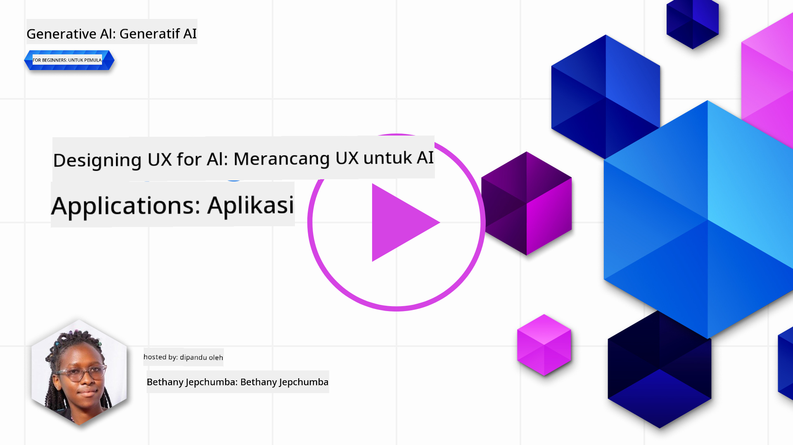
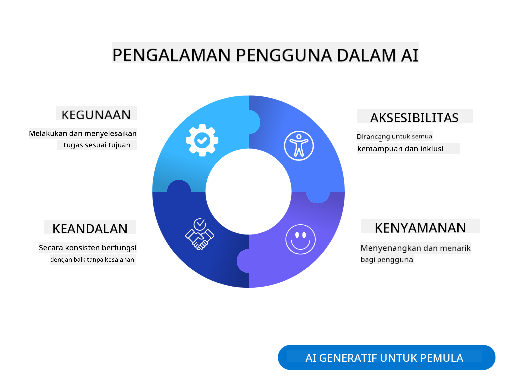
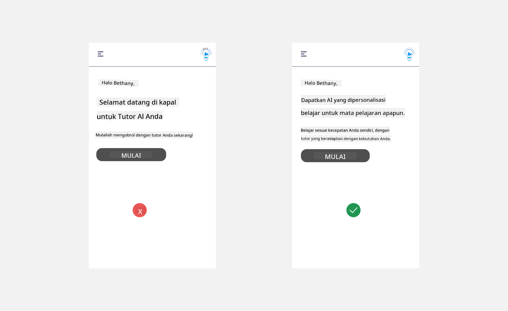
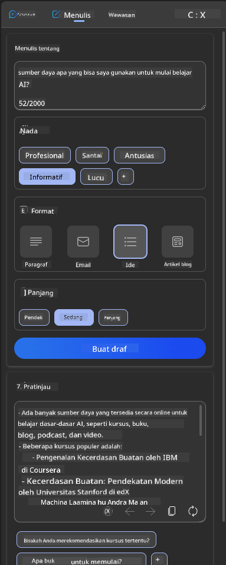
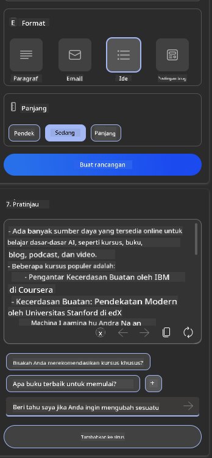
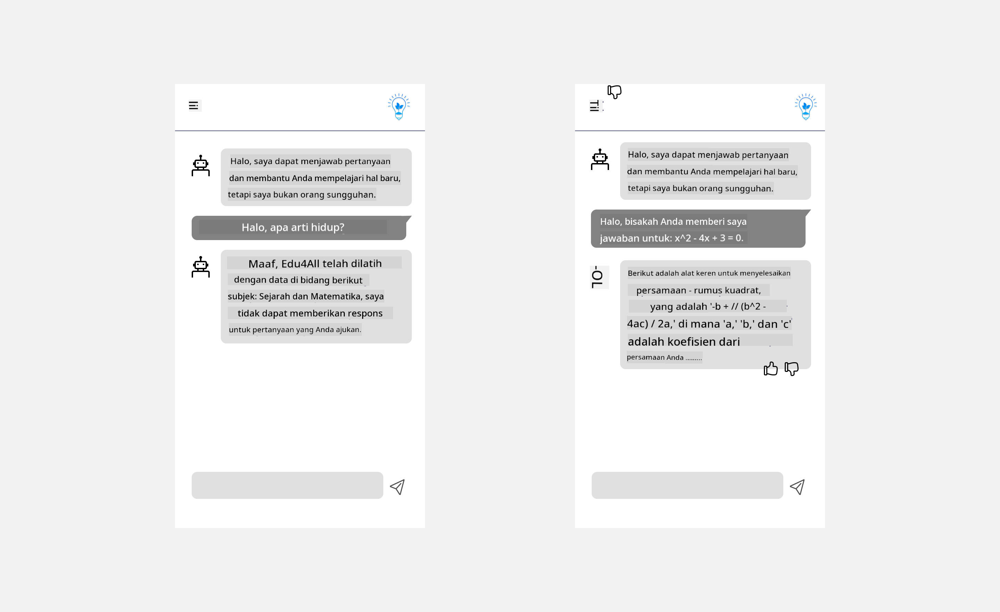

<!--
CO_OP_TRANSLATOR_METADATA:
{
  "original_hash": "ec385b41ee50579025d50cc03bfb3a25",
  "translation_date": "2025-06-25T20:28:50+00:00",
  "source_file": "12-designing-ux-for-ai-applications/README.md",
  "language_code": "id"
}
-->
# Merancang UX untuk Aplikasi AI

> _(Klik gambar di atas untuk melihat video dari pelajaran ini)_

Pengalaman pengguna adalah aspek yang sangat penting dalam membangun aplikasi. Pengguna perlu dapat menggunakan aplikasi Anda dengan cara yang efisien untuk melakukan tugas. Menjadi efisien adalah satu hal, tetapi Anda juga perlu merancang aplikasi agar dapat digunakan oleh semua orang, sehingga menjadi _terjangkau_. Bab ini akan berfokus pada area ini sehingga Anda diharapkan dapat merancang aplikasi yang dapat dan ingin digunakan oleh orang-orang.

## Pendahuluan

Pengalaman pengguna adalah bagaimana seorang pengguna berinteraksi dengan dan menggunakan produk atau layanan tertentu baik itu sistem, alat, atau desain. Saat mengembangkan aplikasi AI, pengembang tidak hanya fokus pada memastikan pengalaman pengguna efektif tetapi juga etis. Dalam pelajaran ini, kita membahas cara membangun aplikasi Kecerdasan Buatan (AI) yang memenuhi kebutuhan pengguna.

Pelajaran ini akan mencakup area berikut:

- Pengenalan Pengalaman Pengguna dan Memahami Kebutuhan Pengguna
- Merancang Aplikasi AI untuk Kepercayaan dan Transparansi
- Merancang Aplikasi AI untuk Kolaborasi dan Umpan Balik

## Tujuan Pembelajaran

Setelah mengikuti pelajaran ini, Anda akan dapat:

- Memahami cara membangun aplikasi AI yang memenuhi kebutuhan pengguna.
- Merancang aplikasi AI yang mendorong kepercayaan dan kolaborasi.

### Prasyarat

Luangkan waktu dan baca lebih lanjut tentang [pengalaman pengguna dan pemikiran desain.](https://learn.microsoft.com/training/modules/ux-design?WT.mc_id=academic-105485-koreyst)

## Pengenalan Pengalaman Pengguna dan Memahami Kebutuhan Pengguna

Dalam startup pendidikan fiktif kami, kami memiliki dua pengguna utama, guru dan siswa. Masing-masing dari kedua pengguna ini memiliki kebutuhan unik. Desain berpusat pada pengguna memprioritaskan pengguna dengan memastikan produk relevan dan bermanfaat bagi mereka yang ditujukan.

Aplikasi harus **berguna, dapat diandalkan, terjangkau, dan menyenangkan** untuk memberikan pengalaman pengguna yang baik.

### Kegunaan

Menjadi berguna berarti aplikasi memiliki fungsionalitas yang sesuai dengan tujuan yang dimaksudkan, seperti mengotomatisasi proses penilaian atau menghasilkan kartu flash untuk revisi. Aplikasi yang mengotomatisasi proses penilaian harus dapat memberikan skor dengan akurat dan efisien pada pekerjaan siswa berdasarkan kriteria yang telah ditentukan. Demikian pula, aplikasi yang menghasilkan kartu flash revisi harus dapat membuat pertanyaan yang relevan dan beragam berdasarkan datanya.

### Keandalan

Menjadi dapat diandalkan berarti aplikasi dapat melakukan tugasnya secara konsisten dan tanpa kesalahan. Namun, AI seperti manusia tidak sempurna dan mungkin rentan terhadap kesalahan. Aplikasi mungkin menghadapi kesalahan atau situasi tak terduga yang memerlukan intervensi atau koreksi manusia. Bagaimana Anda menangani kesalahan? Di bagian terakhir dari pelajaran ini, kita akan membahas bagaimana sistem dan aplikasi AI dirancang untuk kolaborasi dan umpan balik.

### Aksesibilitas

Menjadi terjangkau berarti memperluas pengalaman pengguna kepada pengguna dengan berbagai kemampuan, termasuk mereka yang memiliki disabilitas, memastikan tidak ada yang tertinggal. Dengan mengikuti pedoman dan prinsip aksesibilitas, solusi AI menjadi lebih inklusif, dapat digunakan, dan bermanfaat bagi semua pengguna.

### Menyenangkan

Menjadi menyenangkan berarti aplikasi menyenangkan untuk digunakan. Pengalaman pengguna yang menarik dapat memiliki dampak positif pada pengguna, mendorong mereka untuk kembali ke aplikasi dan meningkatkan pendapatan bisnis.

Tidak setiap tantangan dapat diselesaikan dengan AI. AI hadir untuk meningkatkan pengalaman pengguna Anda, baik itu mengotomatisasi tugas manual, atau mempersonalisasi pengalaman pengguna.

## Merancang Aplikasi AI untuk Kepercayaan dan Transparansi

Membangun kepercayaan sangat penting saat merancang aplikasi AI. Kepercayaan memastikan pengguna yakin bahwa aplikasi akan menyelesaikan pekerjaan, memberikan hasil secara konsisten, dan hasilnya adalah apa yang dibutuhkan pengguna. Risiko di area ini adalah ketidakpercayaan dan kepercayaan berlebihan. Ketidakpercayaan terjadi ketika pengguna memiliki sedikit atau tidak ada kepercayaan pada sistem AI, ini menyebabkan pengguna menolak aplikasi Anda. Kepercayaan berlebihan terjadi ketika pengguna melebih-lebihkan kemampuan sistem AI, menyebabkan pengguna terlalu mempercayai sistem AI. Misalnya, sistem penilaian otomatis dalam kasus kepercayaan berlebihan mungkin menyebabkan guru tidak memeriksa beberapa kertas untuk memastikan sistem penilaian bekerja dengan baik. Ini dapat mengakibatkan nilai yang tidak adil atau tidak akurat bagi siswa, atau kesempatan yang terlewatkan untuk umpan balik dan perbaikan.

Dua cara untuk memastikan bahwa kepercayaan ditempatkan tepat di pusat desain adalah keterjelasan dan kontrol.

### Keterjelasan

Ketika AI membantu menginformasikan keputusan seperti memberikan pengetahuan kepada generasi mendatang, sangat penting bagi guru dan orang tua untuk memahami bagaimana keputusan AI dibuat. Ini adalah keterjelasan - memahami bagaimana aplikasi AI membuat keputusan. Merancang untuk keterjelasan mencakup menambahkan detail contoh dari apa yang dapat dilakukan aplikasi AI. Misalnya, alih-alih "Mulai dengan AI guru", sistem dapat menggunakan: "Ringkas catatan Anda untuk revisi yang lebih mudah menggunakan AI."

Contoh lain adalah bagaimana AI menggunakan data pengguna dan pribadi. Misalnya, seorang pengguna dengan persona siswa mungkin memiliki batasan berdasarkan persona mereka. AI mungkin tidak dapat mengungkapkan jawaban atas pertanyaan tetapi dapat membantu membimbing pengguna untuk berpikir bagaimana mereka dapat memecahkan masalah.

Bagian terakhir yang penting dari keterjelasan adalah penyederhanaan penjelasan. Siswa dan guru mungkin bukan ahli AI, oleh karena itu penjelasan tentang apa yang dapat atau tidak dapat dilakukan aplikasi harus disederhanakan dan mudah dipahami.

### Kontrol

AI generatif menciptakan kolaborasi antara AI dan pengguna, di mana misalnya pengguna dapat memodifikasi perintah untuk hasil yang berbeda. Selain itu, setelah output dihasilkan, pengguna harus dapat memodifikasi hasil memberikan mereka rasa kontrol. Misalnya, saat menggunakan Bing, Anda dapat menyesuaikan perintah Anda berdasarkan format, nada, dan panjang. Selain itu, Anda dapat menambahkan perubahan pada output Anda dan memodifikasi output seperti yang ditunjukkan di bawah ini:

Fitur lain di Bing yang memungkinkan pengguna memiliki kontrol atas aplikasi adalah kemampuan untuk memilih dan keluar dari data yang digunakan AI. Untuk aplikasi sekolah, seorang siswa mungkin ingin menggunakan catatan mereka serta sumber daya guru sebagai bahan revisi.

> Saat merancang aplikasi AI, kesengajaan adalah kunci dalam memastikan pengguna tidak terlalu mempercayai dan menetapkan harapan yang tidak realistis terhadap kemampuannya. Salah satu cara untuk melakukan ini adalah dengan menciptakan gesekan antara perintah dan hasil. Mengingatkan pengguna bahwa ini adalah AI dan bukan sesama manusia

## Merancang Aplikasi AI untuk Kolaborasi dan Umpan Balik

Seperti yang disebutkan sebelumnya, AI generatif menciptakan kolaborasi antara pengguna dan AI. Sebagian besar interaksi adalah dengan pengguna memasukkan perintah dan AI menghasilkan output. Bagaimana jika outputnya salah? Bagaimana aplikasi menangani kesalahan jika terjadi? Apakah AI menyalahkan pengguna atau meluangkan waktu untuk menjelaskan kesalahan?

Aplikasi AI harus dibangun untuk menerima dan memberikan umpan balik. Ini tidak hanya membantu sistem AI meningkatkan tetapi juga membangun kepercayaan dengan pengguna. Sebuah loop umpan balik harus dimasukkan dalam desain, contohnya bisa berupa acungan jempol atau jempol ke bawah pada output.

Cara lain untuk menangani ini adalah dengan secara jelas mengkomunikasikan kemampuan dan batasan sistem. Ketika seorang pengguna membuat kesalahan dengan meminta sesuatu di luar kemampuan AI, harus ada cara untuk menangani ini, seperti yang ditunjukkan di bawah ini.

Kesalahan sistem umum terjadi pada aplikasi di mana pengguna mungkin membutuhkan bantuan dengan informasi di luar cakupan AI atau aplikasi mungkin memiliki batasan pada berapa banyak pertanyaan/mata pelajaran yang dapat dihasilkan pengguna. Misalnya, aplikasi AI yang dilatih dengan data pada mata pelajaran terbatas misalnya, Sejarah dan Matematika mungkin tidak dapat menangani pertanyaan seputar Geografi. Untuk mengatasi ini, sistem AI dapat memberikan respons seperti: "Maaf, produk kami telah dilatih dengan data dalam mata pelajaran berikut ....., saya tidak dapat merespons pertanyaan yang Anda ajukan."

Aplikasi AI tidak sempurna, oleh karena itu, mereka pasti membuat kesalahan. Saat merancang aplikasi Anda, Anda harus memastikan Anda membuat ruang untuk umpan balik dari pengguna dan penanganan kesalahan dengan cara yang sederhana dan mudah dijelaskan.

## Tugas

Ambil aplikasi AI apa pun yang telah Anda buat sejauh ini, pertimbangkan untuk menerapkan langkah-langkah di bawah ini dalam aplikasi Anda:

- **Menyenangkan:** Pertimbangkan bagaimana Anda dapat membuat aplikasi Anda lebih menyenangkan. Apakah Anda menambahkan penjelasan di mana-mana? Apakah Anda mendorong pengguna untuk menjelajahi? Bagaimana Anda merumuskan pesan kesalahan Anda?

- **Kegunaan:** Membangun aplikasi web. Pastikan aplikasi Anda dapat dinavigasi baik dengan mouse maupun keyboard.

- **Kepercayaan dan transparansi:** Jangan sepenuhnya mempercayai AI dan outputnya, pertimbangkan bagaimana Anda akan menambahkan manusia ke dalam proses untuk memverifikasi output. Juga, pertimbangkan dan terapkan cara lain untuk mencapai kepercayaan dan transparansi.

- **Kontrol:** Berikan pengguna kontrol atas data yang mereka berikan ke aplikasi. Terapkan cara bagi pengguna untuk memilih masuk dan keluar dari pengumpulan data dalam aplikasi AI.

## Lanjutkan Pembelajaran Anda!

Setelah menyelesaikan pelajaran ini, lihat koleksi [Pembelajaran AI Generatif](https://aka.ms/genai-collection?WT.mc_id=academic-105485-koreyst) kami untuk terus meningkatkan pengetahuan AI Generatif Anda!

Lanjutkan ke Pelajaran 13, di mana kita akan melihat cara [mengamankan aplikasi AI](../13-securing-ai-applications/README.md?WT.mc_id=academic-105485-koreyst)!

**Penafian**:  
Dokumen ini telah diterjemahkan menggunakan layanan terjemahan AI [Co-op Translator](https://github.com/Azure/co-op-translator). Meskipun kami berusaha untuk mencapai akurasi, harap disadari bahwa terjemahan otomatis mungkin mengandung kesalahan atau ketidakakuratan. Dokumen asli dalam bahasa aslinya harus dianggap sebagai sumber yang berwenang. Untuk informasi penting, disarankan menggunakan terjemahan manusia profesional. Kami tidak bertanggung jawab atas kesalahpahaman atau interpretasi yang salah yang timbul dari penggunaan terjemahan ini.