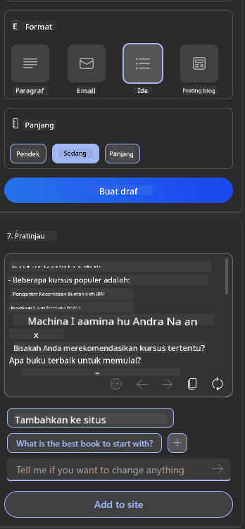

<!--
CO_OP_TRANSLATOR_METADATA:
{
  "original_hash": "78bbeed50fd4dc9fdee931f5daf98cb3",
  "translation_date": "2025-10-17T20:42:35+00:00",
  "source_file": "12-designing-ux-for-ai-applications/README.md",
  "language_code": "id"
}
-->
# Merancang UX untuk Aplikasi AI

> _(Klik gambar di atas untuk menonton video pelajaran ini)_

Pengalaman pengguna adalah aspek yang sangat penting dalam membangun aplikasi. Pengguna harus dapat menggunakan aplikasi Anda dengan cara yang efisien untuk menyelesaikan tugas. Efisiensi adalah satu hal, tetapi Anda juga perlu merancang aplikasi agar dapat digunakan oleh semua orang, sehingga menjadi _aksesibel_. Bab ini akan berfokus pada area ini agar Anda dapat merancang aplikasi yang dapat dan ingin digunakan oleh banyak orang.

## Pendahuluan

Pengalaman pengguna adalah cara seorang pengguna berinteraksi dengan dan menggunakan produk atau layanan tertentu, baik itu sistem, alat, atau desain. Saat mengembangkan aplikasi AI, pengembang tidak hanya fokus pada memastikan pengalaman pengguna yang efektif tetapi juga etis. Dalam pelajaran ini, kita akan membahas cara membangun aplikasi Kecerdasan Buatan (AI) yang memenuhi kebutuhan pengguna.

Pelajaran ini akan mencakup area berikut:

- Pengantar Pengalaman Pengguna dan Memahami Kebutuhan Pengguna
- Merancang Aplikasi AI untuk Kepercayaan dan Transparansi
- Merancang Aplikasi AI untuk Kolaborasi dan Umpan Balik

## Tujuan Pembelajaran

Setelah mengikuti pelajaran ini, Anda akan dapat:

- Memahami cara membangun aplikasi AI yang memenuhi kebutuhan pengguna.
- Merancang aplikasi AI yang mendorong kepercayaan dan kolaborasi.

### Prasyarat

Luangkan waktu untuk membaca lebih lanjut tentang [pengalaman pengguna dan pemikiran desain.](https://learn.microsoft.com/training/modules/ux-design?WT.mc_id=academic-105485-koreyst)

## Pengantar Pengalaman Pengguna dan Memahami Kebutuhan Pengguna

Dalam startup pendidikan fiktif kita, ada dua pengguna utama, yaitu guru dan siswa. Masing-masing pengguna memiliki kebutuhan yang unik. Desain yang berpusat pada pengguna memprioritaskan pengguna, memastikan produk relevan dan bermanfaat bagi mereka yang dituju.

Aplikasi harus **berguna, dapat diandalkan, aksesibel, dan menyenangkan** untuk memberikan pengalaman pengguna yang baik.

### Kegunaan

Menjadi berguna berarti aplikasi memiliki fungsi yang sesuai dengan tujuan yang dimaksudkan, seperti mengotomatisasi proses penilaian atau membuat kartu flash untuk revisi. Aplikasi yang mengotomatisasi proses penilaian harus dapat memberikan skor secara akurat dan efisien berdasarkan kriteria yang telah ditentukan. Demikian pula, aplikasi yang membuat kartu flash revisi harus dapat menghasilkan pertanyaan yang relevan dan beragam berdasarkan datanya.

### Keandalan

Menjadi dapat diandalkan berarti aplikasi dapat menjalankan tugasnya secara konsisten dan tanpa kesalahan. Namun, AI seperti halnya manusia tidak sempurna dan mungkin rentan terhadap kesalahan. Aplikasi mungkin menghadapi kesalahan atau situasi tak terduga yang memerlukan intervensi atau koreksi manusia. Bagaimana Anda menangani kesalahan? Di bagian terakhir pelajaran ini, kita akan membahas bagaimana sistem dan aplikasi AI dirancang untuk kolaborasi dan umpan balik.

### Aksesibilitas

Menjadi aksesibel berarti memperluas pengalaman pengguna kepada pengguna dengan berbagai kemampuan, termasuk mereka yang memiliki disabilitas, memastikan tidak ada yang tertinggal. Dengan mengikuti pedoman dan prinsip aksesibilitas, solusi AI menjadi lebih inklusif, dapat digunakan, dan bermanfaat bagi semua pengguna.

### Menyenangkan

Menjadi menyenangkan berarti aplikasi mudah digunakan dan memberikan pengalaman yang menarik. Pengalaman pengguna yang menarik dapat memberikan dampak positif pada pengguna, mendorong mereka untuk kembali menggunakan aplikasi dan meningkatkan pendapatan bisnis.

Tidak setiap tantangan dapat diselesaikan dengan AI. AI hadir untuk meningkatkan pengalaman pengguna, baik itu mengotomatisasi tugas manual atau mempersonalisasi pengalaman pengguna.

## Merancang Aplikasi AI untuk Kepercayaan dan Transparansi

Membangun kepercayaan sangat penting saat merancang aplikasi AI. Kepercayaan memastikan pengguna yakin bahwa aplikasi akan menyelesaikan pekerjaan, memberikan hasil secara konsisten, dan hasilnya sesuai dengan kebutuhan pengguna. Risiko dalam area ini adalah ketidakpercayaan dan kepercayaan berlebihan. Ketidakpercayaan terjadi ketika pengguna memiliki sedikit atau tidak ada kepercayaan pada sistem AI, yang menyebabkan pengguna menolak aplikasi Anda. Kepercayaan berlebihan terjadi ketika pengguna melebih-lebihkan kemampuan sistem AI, yang menyebabkan pengguna terlalu percaya pada sistem AI. Misalnya, sistem penilaian otomatis dalam kasus kepercayaan berlebihan mungkin membuat guru tidak memeriksa beberapa pekerjaan siswa untuk memastikan sistem penilaian bekerja dengan baik. Hal ini dapat mengakibatkan nilai yang tidak adil atau tidak akurat bagi siswa, atau peluang untuk umpan balik dan perbaikan yang terlewatkan.

Dua cara untuk memastikan bahwa kepercayaan menjadi pusat desain adalah keterjelasan dan kontrol.

### Keterjelasan

Ketika AI membantu menginformasikan keputusan seperti memberikan pengetahuan kepada generasi mendatang, sangat penting bagi guru dan orang tua untuk memahami bagaimana keputusan AI dibuat. Inilah yang disebut keterjelasan - memahami bagaimana aplikasi AI membuat keputusan. Merancang untuk keterjelasan mencakup penambahan detail yang menyoroti bagaimana AI mencapai hasil. Audiens harus menyadari bahwa hasil tersebut dihasilkan oleh AI dan bukan manusia. Misalnya, daripada mengatakan "Mulai mengobrol dengan tutor Anda sekarang" katakan "Gunakan tutor AI yang beradaptasi dengan kebutuhan Anda dan membantu Anda belajar sesuai kecepatan Anda."

Contoh lainnya adalah bagaimana AI menggunakan data pengguna dan data pribadi. Misalnya, seorang pengguna dengan persona siswa mungkin memiliki batasan berdasarkan persona mereka. AI mungkin tidak dapat memberikan jawaban langsung tetapi dapat membantu membimbing pengguna untuk berpikir bagaimana mereka dapat menyelesaikan masalah.

Bagian penting terakhir dari keterjelasan adalah penyederhanaan penjelasan. Siswa dan guru mungkin bukan ahli AI, oleh karena itu penjelasan tentang apa yang dapat atau tidak dapat dilakukan oleh aplikasi harus disederhanakan dan mudah dipahami.

### Kontrol

AI generatif menciptakan kolaborasi antara AI dan pengguna, di mana misalnya pengguna dapat memodifikasi prompt untuk mendapatkan hasil yang berbeda. Selain itu, setelah hasil dihasilkan, pengguna harus dapat memodifikasi hasil tersebut sehingga mereka merasa memiliki kendali. Misalnya, saat menggunakan Bing, Anda dapat menyesuaikan prompt Anda berdasarkan format, nada, dan panjang. Selain itu, Anda dapat menambahkan perubahan pada hasil Anda dan memodifikasi hasil tersebut seperti yang ditunjukkan di bawah ini:

Fitur lain di Bing yang memungkinkan pengguna memiliki kendali atas aplikasi adalah kemampuan untuk memilih masuk dan keluar dari data yang digunakan AI. Untuk aplikasi sekolah, seorang siswa mungkin ingin menggunakan catatan mereka serta sumber daya guru sebagai bahan revisi.

> Saat merancang aplikasi AI, penting untuk memastikan pengguna tidak terlalu percaya sehingga menetapkan ekspektasi yang tidak realistis terhadap kemampuannya. Salah satu cara untuk melakukan ini adalah dengan menciptakan friksi antara prompt dan hasil. Mengingatkan pengguna bahwa ini adalah AI dan bukan manusia.

## Merancang Aplikasi AI untuk Kolaborasi dan Umpan Balik

Seperti yang telah disebutkan sebelumnya, AI generatif menciptakan kolaborasi antara pengguna dan AI. Sebagian besar interaksi melibatkan pengguna yang memasukkan prompt dan AI menghasilkan hasil. Bagaimana jika hasilnya salah? Bagaimana aplikasi menangani kesalahan jika terjadi? Apakah AI menyalahkan pengguna atau meluangkan waktu untuk menjelaskan kesalahan?

Aplikasi AI harus dirancang untuk menerima dan memberikan umpan balik. Hal ini tidak hanya membantu sistem AI untuk berkembang tetapi juga membangun kepercayaan dengan pengguna. Sebuah loop umpan balik harus dimasukkan dalam desain, contohnya bisa berupa tombol jempol ke atas atau ke bawah pada hasil.

Cara lain untuk menangani ini adalah dengan secara jelas mengkomunikasikan kemampuan dan keterbatasan sistem. Ketika pengguna membuat kesalahan dengan meminta sesuatu di luar kemampuan AI, harus ada cara untuk menangani hal ini, seperti yang ditunjukkan di bawah ini.

Kesalahan sistem adalah hal yang umum pada aplikasi di mana pengguna mungkin membutuhkan bantuan dengan informasi di luar cakupan AI atau aplikasi mungkin memiliki batasan pada berapa banyak pertanyaan/subjek yang dapat dihasilkan ringkasannya oleh pengguna. Misalnya, aplikasi AI yang dilatih dengan data pada subjek terbatas seperti Sejarah dan Matematika mungkin tidak dapat menangani pertanyaan tentang Geografi. Untuk mengatasi ini, sistem AI dapat memberikan respons seperti: "Maaf, produk kami telah dilatih dengan data dalam subjek berikut....., saya tidak dapat menjawab pertanyaan yang Anda ajukan."

Aplikasi AI tidak sempurna, oleh karena itu, mereka pasti akan membuat kesalahan. Saat merancang aplikasi Anda, Anda harus memastikan untuk menciptakan ruang untuk umpan balik dari pengguna dan penanganan kesalahan dengan cara yang sederhana dan mudah dipahami.

## Tugas

Ambil aplikasi AI apa pun yang telah Anda buat sejauh ini, pertimbangkan untuk menerapkan langkah-langkah berikut dalam aplikasi Anda:

- **Menyenangkan:** Pertimbangkan bagaimana Anda dapat membuat aplikasi Anda lebih menyenangkan. Apakah Anda menambahkan penjelasan di setiap tempat? Apakah Anda mendorong pengguna untuk mengeksplorasi? Bagaimana Anda menyusun pesan kesalahan Anda?

- **Kegunaan:** Jika Anda membangun aplikasi web, pastikan aplikasi Anda dapat dinavigasi baik dengan mouse maupun keyboard.

- **Kepercayaan dan transparansi:** Jangan sepenuhnya percaya pada AI dan hasilnya, pertimbangkan bagaimana Anda akan menambahkan manusia ke dalam proses untuk memverifikasi hasil. Juga, pertimbangkan dan terapkan cara lain untuk mencapai kepercayaan dan transparansi.

- **Kontrol:** Berikan pengguna kendali atas data yang mereka berikan kepada aplikasi. Terapkan cara agar pengguna dapat memilih untuk ikut serta atau keluar dari pengumpulan data dalam aplikasi AI.

<!-- ## [Kuis setelah pelajaran](../../../12-designing-ux-for-ai-applications/quiz-url) -->

## Lanjutkan Pembelajaran Anda!

Setelah menyelesaikan pelajaran ini, lihat [koleksi pembelajaran Generative AI kami](https://aka.ms/genai-collection?WT.mc_id=academic-105485-koreyst) untuk terus meningkatkan pengetahuan Anda tentang Generative AI!

Lanjutkan ke Pelajaran 13, di mana kita akan membahas tentang [mengamankan aplikasi AI](../13-securing-ai-applications/README.md?WT.mc_id=academic-105485-koreyst)!

---

**Penafian**:  
Dokumen ini telah diterjemahkan menggunakan layanan penerjemahan AI [Co-op Translator](https://github.com/Azure/co-op-translator). Meskipun kami berupaya untuk memberikan hasil yang akurat, harap diketahui bahwa terjemahan otomatis mungkin mengandung kesalahan atau ketidakakuratan. Dokumen asli dalam bahasa aslinya harus dianggap sebagai sumber yang otoritatif. Untuk informasi yang penting, disarankan menggunakan jasa penerjemahan manusia profesional. Kami tidak bertanggung jawab atas kesalahpahaman atau interpretasi yang salah yang timbul dari penggunaan terjemahan ini.