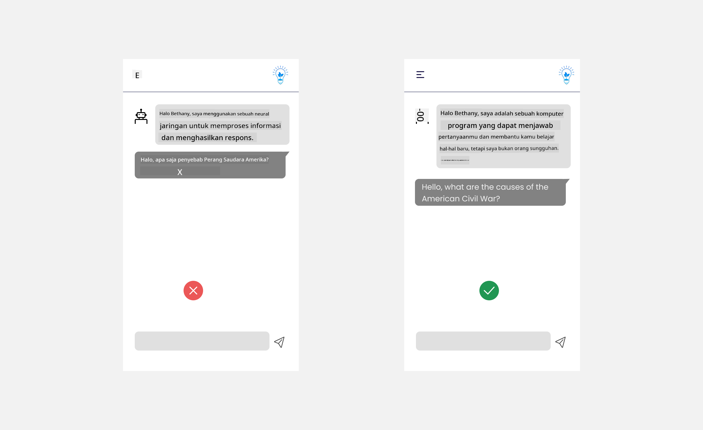
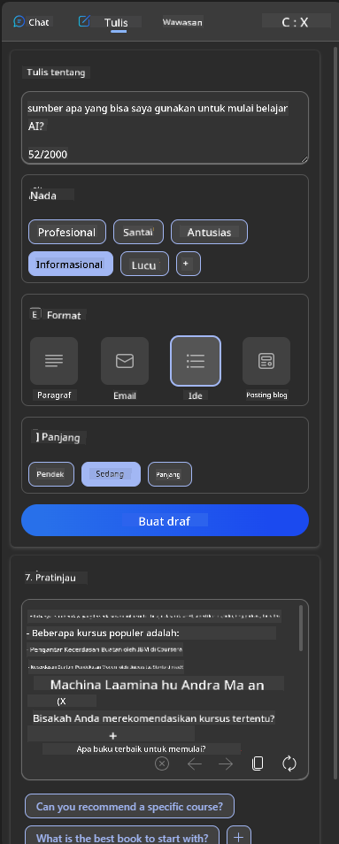
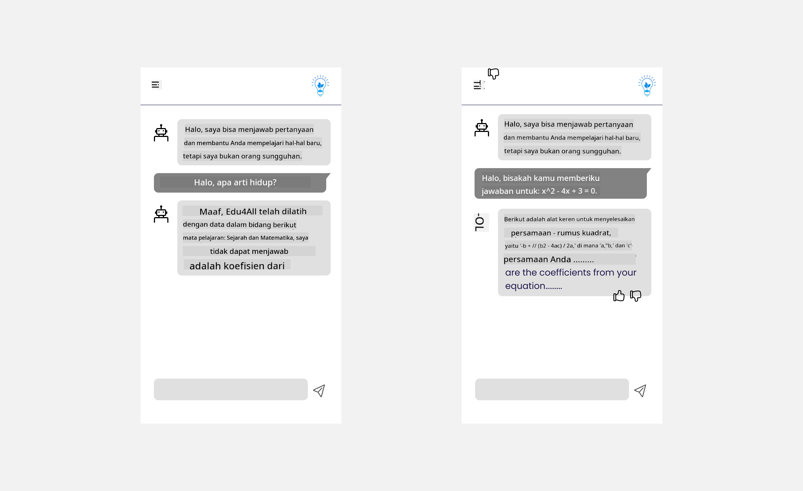

<!--
CO_OP_TRANSLATOR_METADATA:
{
  "original_hash": "ec385b41ee50579025d50cc03bfb3a25",
  "translation_date": "2025-07-09T15:01:30+00:00",
  "source_file": "12-designing-ux-for-ai-applications/README.md",
  "language_code": "id"
}
-->
# Merancang UX untuk Aplikasi AI

> _(Klik gambar di atas untuk menonton video pelajaran ini)_

Pengalaman pengguna adalah aspek yang sangat penting dalam membangun aplikasi. Pengguna harus dapat menggunakan aplikasi Anda dengan cara yang efisien untuk menyelesaikan tugas. Efisiensi adalah satu hal, tetapi Anda juga perlu merancang aplikasi agar dapat digunakan oleh semua orang, agar menjadi _aksesibel_. Bab ini akan fokus pada area ini sehingga Anda diharapkan dapat merancang aplikasi yang dapat dan ingin digunakan oleh orang banyak.

## Pendahuluan

Pengalaman pengguna adalah bagaimana seorang pengguna berinteraksi dan menggunakan produk atau layanan tertentu, baik itu sistem, alat, atau desain. Saat mengembangkan aplikasi AI, pengembang tidak hanya fokus memastikan pengalaman pengguna efektif tetapi juga etis. Dalam pelajaran ini, kita akan membahas cara membangun aplikasi Kecerdasan Buatan (AI) yang memenuhi kebutuhan pengguna.

Pelajaran ini akan membahas area berikut:

- Pengenalan Pengalaman Pengguna dan Memahami Kebutuhan Pengguna
- Merancang Aplikasi AI untuk Kepercayaan dan Transparansi
- Merancang Aplikasi AI untuk Kolaborasi dan Umpan Balik

## Tujuan Pembelajaran

Setelah mengikuti pelajaran ini, Anda akan dapat:

- Memahami cara membangun aplikasi AI yang memenuhi kebutuhan pengguna.
- Merancang aplikasi AI yang mendorong kepercayaan dan kolaborasi.

### Prasyarat

Luangkan waktu untuk membaca lebih lanjut tentang [pengalaman pengguna dan design thinking.](https://learn.microsoft.com/training/modules/ux-design?WT.mc_id=academic-105485-koreyst)

## Pengenalan Pengalaman Pengguna dan Memahami Kebutuhan Pengguna

Dalam startup pendidikan fiktif kami, ada dua pengguna utama, guru dan siswa. Masing-masing pengguna memiliki kebutuhan unik. Desain yang berpusat pada pengguna memprioritaskan pengguna dengan memastikan produk relevan dan bermanfaat bagi mereka yang menjadi targetnya.

Aplikasi harus **berguna, dapat diandalkan, aksesibel, dan menyenangkan** untuk memberikan pengalaman pengguna yang baik.

### Kegunaan

Berguna berarti aplikasi memiliki fungsi yang sesuai dengan tujuan yang dimaksud, seperti mengotomatisasi proses penilaian atau membuat flashcard untuk revisi. Aplikasi yang mengotomatisasi proses penilaian harus mampu memberikan nilai secara akurat dan efisien berdasarkan kriteria yang telah ditentukan. Demikian pula, aplikasi yang membuat flashcard revisi harus dapat menghasilkan pertanyaan yang relevan dan beragam berdasarkan data yang dimilikinya.

### Keandalan

Dapat diandalkan berarti aplikasi dapat menjalankan tugasnya secara konsisten dan tanpa kesalahan. Namun, AI seperti manusia tidak sempurna dan bisa saja melakukan kesalahan. Aplikasi mungkin menghadapi kesalahan atau situasi tak terduga yang memerlukan intervensi atau koreksi manusia. Bagaimana Anda menangani kesalahan? Di bagian terakhir pelajaran ini, kita akan membahas bagaimana sistem dan aplikasi AI dirancang untuk kolaborasi dan umpan balik.

### Aksesibilitas

Aksesibel berarti memperluas pengalaman pengguna kepada pengguna dengan berbagai kemampuan, termasuk mereka yang memiliki disabilitas, sehingga tidak ada yang tertinggal. Dengan mengikuti pedoman dan prinsip aksesibilitas, solusi AI menjadi lebih inklusif, mudah digunakan, dan bermanfaat bagi semua pengguna.

### Menyenangkan

Menyenangkan berarti aplikasi memberikan pengalaman yang menyenangkan saat digunakan. Pengalaman pengguna yang menarik dapat berdampak positif pada pengguna, mendorong mereka untuk kembali menggunakan aplikasi dan meningkatkan pendapatan bisnis.

Tidak semua tantangan dapat diselesaikan dengan AI. AI hadir untuk meningkatkan pengalaman pengguna Anda, baik dengan mengotomatisasi tugas manual, maupun mempersonalisasi pengalaman pengguna.

## Merancang Aplikasi AI untuk Kepercayaan dan Transparansi

Membangun kepercayaan sangat penting saat merancang aplikasi AI. Kepercayaan memastikan pengguna yakin bahwa aplikasi akan menyelesaikan pekerjaan, memberikan hasil secara konsisten, dan hasil tersebut sesuai dengan kebutuhan pengguna. Risiko di area ini adalah ketidakpercayaan dan kepercayaan berlebihan. Ketidakpercayaan terjadi ketika pengguna memiliki sedikit atau tidak ada kepercayaan pada sistem AI, yang menyebabkan pengguna menolak aplikasi Anda. Kepercayaan berlebihan terjadi ketika pengguna melebih-lebihkan kemampuan sistem AI, sehingga pengguna terlalu percaya pada sistem AI tersebut. Misalnya, sistem penilaian otomatis dalam kasus kepercayaan berlebihan bisa membuat guru tidak memeriksa beberapa tugas untuk memastikan sistem penilaian bekerja dengan baik. Ini bisa berakibat pada nilai yang tidak adil atau tidak akurat bagi siswa, atau hilangnya kesempatan untuk memberikan umpan balik dan perbaikan.

Dua cara untuk memastikan kepercayaan menjadi pusat desain adalah explainability dan control.

### Explainability

Ketika AI membantu dalam pengambilan keputusan seperti menyampaikan pengetahuan kepada generasi mendatang, sangat penting bagi guru dan orang tua untuk memahami bagaimana keputusan AI dibuat. Ini adalah explainability - pemahaman tentang bagaimana aplikasi AI membuat keputusan. Merancang untuk explainability termasuk menambahkan detail contoh tentang apa yang dapat dilakukan aplikasi AI. Misalnya, daripada "Mulai dengan AI teacher", sistem dapat menggunakan: "Ringkas catatan Anda untuk revisi yang lebih mudah menggunakan AI."

Contoh lain adalah bagaimana AI menggunakan data pengguna dan data pribadi. Misalnya, pengguna dengan persona siswa mungkin memiliki batasan berdasarkan personanya. AI mungkin tidak dapat mengungkapkan jawaban atas pertanyaan tetapi dapat membantu membimbing pengguna untuk berpikir bagaimana mereka dapat menyelesaikan masalah.

Bagian penting terakhir dari explainability adalah penyederhanaan penjelasan. Siswa dan guru mungkin bukan ahli AI, oleh karena itu penjelasan tentang apa yang dapat atau tidak dapat dilakukan aplikasi harus disederhanakan dan mudah dipahami.

### Control

Generative AI menciptakan kolaborasi antara AI dan pengguna, di mana misalnya pengguna dapat memodifikasi prompt untuk hasil yang berbeda. Selain itu, setelah output dihasilkan, pengguna harus dapat memodifikasi hasil tersebut sehingga mereka merasa memiliki kontrol. Misalnya, saat menggunakan Bing, Anda dapat menyesuaikan prompt berdasarkan format, nada, dan panjang. Selain itu, Anda dapat menambahkan perubahan pada output dan memodifikasinya seperti yang ditunjukkan di bawah ini:

Fitur lain di Bing yang memungkinkan pengguna memiliki kontrol atas aplikasi adalah kemampuan untuk memilih ikut serta (opt-in) dan keluar (opt-out) dari data yang digunakan AI. Untuk aplikasi sekolah, seorang siswa mungkin ingin menggunakan catatan mereka serta sumber daya guru sebagai bahan revisi.

> Saat merancang aplikasi AI, niat yang jelas sangat penting untuk memastikan pengguna tidak terlalu percaya sehingga menetapkan ekspektasi yang tidak realistis terhadap kemampuannya. Salah satu caranya adalah dengan menciptakan hambatan antara prompt dan hasil. Mengingatkan pengguna bahwa ini adalah AI dan bukan manusia biasa.

## Merancang Aplikasi AI untuk Kolaborasi dan Umpan Balik

Seperti yang disebutkan sebelumnya, generative AI menciptakan kolaborasi antara pengguna dan AI. Sebagian besar interaksi adalah pengguna memasukkan prompt dan AI menghasilkan output. Bagaimana jika outputnya salah? Bagaimana aplikasi menangani kesalahan jika terjadi? Apakah AI menyalahkan pengguna atau meluangkan waktu untuk menjelaskan kesalahan?

Aplikasi AI harus dirancang untuk menerima dan memberikan umpan balik. Ini tidak hanya membantu sistem AI menjadi lebih baik tetapi juga membangun kepercayaan dengan pengguna. Siklus umpan balik harus dimasukkan dalam desain, contohnya bisa berupa tombol jempol naik atau turun pada output.

Cara lain untuk menangani ini adalah dengan mengkomunikasikan secara jelas kemampuan dan keterbatasan sistem. Ketika pengguna melakukan kesalahan dengan meminta sesuatu di luar kemampuan AI, harus ada cara untuk menangani hal ini, seperti yang ditunjukkan di bawah.

Kesalahan sistem umum terjadi pada aplikasi di mana pengguna mungkin memerlukan bantuan dengan informasi di luar cakupan AI atau aplikasi mungkin memiliki batasan berapa banyak pertanyaan/mata pelajaran yang dapat dibuat ringkasannya. Misalnya, aplikasi AI yang dilatih dengan data pada mata pelajaran terbatas seperti Sejarah dan Matematika mungkin tidak dapat menangani pertanyaan tentang Geografi. Untuk mengatasi ini, sistem AI dapat memberikan respons seperti: "Maaf, produk kami telah dilatih dengan data pada mata pelajaran berikut....., saya tidak dapat menjawab pertanyaan yang Anda ajukan."

Aplikasi AI tidak sempurna, oleh karena itu pasti akan membuat kesalahan. Saat merancang aplikasi Anda, pastikan Anda menyediakan ruang untuk umpan balik dari pengguna dan penanganan kesalahan dengan cara yang sederhana dan mudah dijelaskan.

## Tugas

Ambil aplikasi AI apa pun yang telah Anda buat sejauh ini, pertimbangkan untuk menerapkan langkah-langkah berikut dalam aplikasi Anda:

- **Menyenangkan:** Pertimbangkan bagaimana Anda dapat membuat aplikasi Anda lebih menyenangkan. Apakah Anda menambahkan penjelasan di mana-mana? Apakah Anda mendorong pengguna untuk mengeksplorasi? Bagaimana Anda merangkai pesan kesalahan Anda?

- **Kegunaan:** Membangun aplikasi web. Pastikan aplikasi Anda dapat dinavigasi dengan mouse dan keyboard.

- **Kepercayaan dan transparansi:** Jangan sepenuhnya percaya pada AI dan hasilnya, pertimbangkan bagaimana Anda akan menambahkan manusia dalam proses untuk memverifikasi hasil. Juga, pertimbangkan dan terapkan cara lain untuk mencapai kepercayaan dan transparansi.

- **Kontrol:** Berikan pengguna kontrol atas data yang mereka berikan ke aplikasi. Terapkan cara agar pengguna dapat memilih ikut serta (opt-in) dan keluar (opt-out) dari pengumpulan data dalam aplikasi AI.

## Lanjutkan Pembelajaran Anda!

Setelah menyelesaikan pelajaran ini, lihat koleksi [Generative AI Learning](https://aka.ms/genai-collection?WT.mc_id=academic-105485-koreyst) kami untuk terus meningkatkan pengetahuan Generative AI Anda!

Lanjut ke Pelajaran 13, di mana kita akan membahas cara [mengamankan aplikasi AI](../13-securing-ai-applications/README.md?WT.mc_id=academic-105485-koreyst)!

**Penafian**:  
Dokumen ini telah diterjemahkan menggunakan layanan terjemahan AI [Co-op Translator](https://github.com/Azure/co-op-translator). Meskipun kami berupaya untuk mencapai akurasi, harap diperhatikan bahwa terjemahan otomatis mungkin mengandung kesalahan atau ketidakakuratan. Dokumen asli dalam bahasa aslinya harus dianggap sebagai sumber yang sahih. Untuk informasi penting, disarankan menggunakan terjemahan profesional oleh manusia. Kami tidak bertanggung jawab atas kesalahpahaman atau penafsiran yang keliru yang timbul dari penggunaan terjemahan ini.