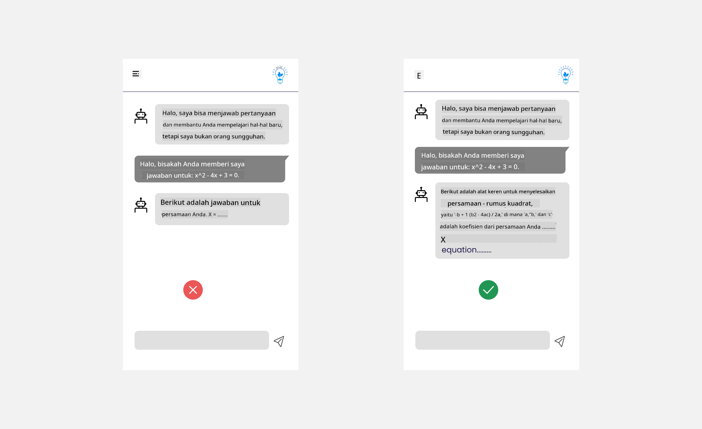

<!--
CO_OP_TRANSLATOR_METADATA:
{
  "original_hash": "747668e4c53d067369f06e9ec2e6313e",
  "translation_date": "2025-08-26T18:20:49+00:00",
  "source_file": "12-designing-ux-for-ai-applications/README.md",
  "language_code": "id"
}
-->
# Merancang UX untuk Aplikasi AI

> _(Klik gambar di atas untuk menonton video pelajaran ini)_

Pengalaman pengguna adalah aspek yang sangat penting dalam membangun aplikasi. Pengguna harus bisa menggunakan aplikasi Anda secara efisien untuk menyelesaikan tugas. Efisien saja tidak cukup, Anda juga perlu merancang aplikasi agar bisa digunakan oleh semua orang, sehingga _aksesibel_. Bab ini akan berfokus pada area ini agar Anda bisa merancang aplikasi yang bisa dan ingin digunakan oleh banyak orang.

## Pendahuluan

Pengalaman pengguna adalah bagaimana seseorang berinteraksi dan menggunakan produk atau layanan tertentu, baik itu sistem, alat, atau desain. Saat mengembangkan aplikasi AI, pengembang tidak hanya fokus memastikan pengalaman pengguna efektif, tapi juga etis. Dalam pelajaran ini, kita membahas cara membangun aplikasi Kecerdasan Buatan (AI) yang menjawab kebutuhan pengguna.

Pelajaran ini akan membahas area berikut:

- Pengenalan Pengalaman Pengguna dan Memahami Kebutuhan Pengguna
- Merancang Aplikasi AI untuk Kepercayaan dan Transparansi
- Merancang Aplikasi AI untuk Kolaborasi dan Umpan Balik

## Tujuan Pembelajaran

Setelah mengikuti pelajaran ini, Anda akan bisa:

- Memahami cara membangun aplikasi AI yang sesuai dengan kebutuhan pengguna.
- Merancang aplikasi AI yang mendorong kepercayaan dan kolaborasi.

### Prasyarat

Luangkan waktu untuk membaca lebih lanjut tentang [pengalaman pengguna dan design thinking.](https://learn.microsoft.com/training/modules/ux-design?WT.mc_id=academic-105485-koreyst)

## Pengenalan Pengalaman Pengguna dan Memahami Kebutuhan Pengguna

Di startup pendidikan fiktif kita, ada dua pengguna utama, guru dan murid. Masing-masing memiliki kebutuhan yang berbeda. Desain yang berpusat pada pengguna memprioritaskan pengguna, memastikan produk relevan dan bermanfaat bagi mereka yang dituju.

Aplikasi harus **berguna, andal, aksesibel, dan menyenangkan** untuk memberikan pengalaman pengguna yang baik.

### Kegunaan

Berguna berarti aplikasi memiliki fungsi yang sesuai dengan tujuannya, seperti mengotomatisasi proses penilaian atau membuat kartu flash untuk belajar ulang. Aplikasi yang mengotomatisasi penilaian harus bisa memberikan nilai secara akurat dan efisien berdasarkan kriteria yang sudah ditentukan. Begitu juga aplikasi yang membuat kartu flash, harus bisa membuat pertanyaan yang relevan dan beragam berdasarkan data yang dimiliki.

### Keandalan

Andal berarti aplikasi bisa menjalankan tugasnya secara konsisten dan tanpa kesalahan. Namun, AI seperti manusia juga tidak sempurna dan bisa saja melakukan kesalahan. Aplikasi bisa saja mengalami error atau situasi tak terduga yang membutuhkan intervensi atau koreksi manusia. Bagaimana Anda menangani error? Di bagian akhir pelajaran ini, kita akan membahas bagaimana sistem dan aplikasi AI dirancang untuk kolaborasi dan umpan balik.

### Aksesibilitas

Aksesibel berarti memperluas pengalaman pengguna ke pengguna dengan berbagai kemampuan, termasuk mereka yang memiliki disabilitas, sehingga tidak ada yang tertinggal. Dengan mengikuti pedoman dan prinsip aksesibilitas, solusi AI menjadi lebih inklusif, mudah digunakan, dan bermanfaat untuk semua pengguna.

### Menyenangkan

Menyenangkan berarti aplikasi enak digunakan. Pengalaman pengguna yang menarik bisa berdampak positif, mendorong pengguna untuk kembali menggunakan aplikasi dan meningkatkan pendapatan bisnis.

Tidak semua tantangan bisa diselesaikan dengan AI. AI hadir untuk memperkuat pengalaman pengguna Anda, baik dengan mengotomatisasi tugas manual, atau mempersonalisasi pengalaman pengguna.

## Merancang Aplikasi AI untuk Kepercayaan dan Transparansi

Membangun kepercayaan sangat penting saat merancang aplikasi AI. Kepercayaan memastikan pengguna yakin aplikasi akan menyelesaikan tugas, memberikan hasil secara konsisten, dan hasilnya sesuai kebutuhan pengguna. Risiko di area ini adalah ketidakpercayaan dan kepercayaan berlebihan. Ketidakpercayaan terjadi saat pengguna kurang atau tidak percaya pada sistem AI, sehingga pengguna menolak aplikasi Anda. Kepercayaan berlebihan terjadi saat pengguna melebih-lebihkan kemampuan sistem AI, sehingga terlalu percaya pada AI. Misalnya, sistem penilaian otomatis jika terlalu dipercaya bisa membuat guru tidak memeriksa ulang beberapa pekerjaan siswa untuk memastikan sistem penilaian berjalan baik. Ini bisa menyebabkan nilai yang tidak adil atau tidak akurat bagi siswa, atau kesempatan umpan balik dan perbaikan yang terlewat.

Dua cara untuk memastikan kepercayaan menjadi pusat desain adalah dengan explainability (penjelasan) dan kontrol.

### Explainability (Penjelasan)

Saat AI membantu mengambil keputusan seperti memberikan pengetahuan ke generasi berikutnya, sangat penting bagi guru dan orang tua untuk memahami bagaimana keputusan AI dibuat. Inilah yang disebut explainability - memahami bagaimana aplikasi AI mengambil keputusan. Merancang untuk explainability termasuk menambahkan detail yang menyoroti bagaimana AI menghasilkan output. Pengguna harus tahu bahwa output dihasilkan oleh AI, bukan manusia. Misalnya, daripada mengatakan "Mulai chat dengan tutor Anda sekarang" katakan "Gunakan tutor AI yang menyesuaikan dengan kebutuhan Anda dan membantu Anda belajar sesuai ritme Anda."

Contoh lain adalah bagaimana AI menggunakan data pengguna dan data pribadi. Misalnya, pengguna dengan persona murid mungkin memiliki batasan berdasarkan peran mereka. AI mungkin tidak bisa memberikan jawaban langsung, tapi bisa membantu membimbing pengguna untuk berpikir bagaimana cara menyelesaikan masalah.

Bagian penting lain dari explainability adalah penyederhanaan penjelasan. Siswa dan guru mungkin bukan ahli AI, jadi penjelasan tentang apa yang bisa dan tidak bisa dilakukan aplikasi harus disederhanakan dan mudah dipahami.

### Kontrol

AI generatif menciptakan kolaborasi antara AI dan pengguna, di mana misalnya pengguna bisa memodifikasi prompt untuk hasil yang berbeda. Selain itu, setelah output dihasilkan, pengguna harus bisa mengubah hasilnya sehingga mereka merasa punya kendali. Misalnya, saat menggunakan Bing, Anda bisa menyesuaikan prompt berdasarkan format, nada, dan panjang. Anda juga bisa mengubah output seperti contoh berikut:

Fitur lain di Bing yang memberi pengguna kontrol atas aplikasi adalah kemampuan untuk memilih ikut serta atau tidak dalam penggunaan data oleh AI. Untuk aplikasi sekolah, murid mungkin ingin menggunakan catatan mereka sendiri maupun sumber dari guru sebagai bahan belajar ulang.

> Saat merancang aplikasi AI, niat yang jelas sangat penting agar pengguna tidak terlalu percaya dan menetapkan ekspektasi yang tidak realistis terhadap kemampuannya. Salah satu caranya adalah dengan menciptakan jeda antara prompt dan hasil. Ingatkan pengguna bahwa ini adalah AI, bukan manusia.

## Merancang Aplikasi AI untuk Kolaborasi dan Umpan Balik

Seperti yang sudah disebutkan, AI generatif menciptakan kolaborasi antara pengguna dan AI. Kebanyakan interaksi terjadi saat pengguna memasukkan prompt dan AI menghasilkan output. Bagaimana jika outputnya salah? Bagaimana aplikasi menangani error jika terjadi? Apakah AI menyalahkan pengguna atau meluangkan waktu untuk menjelaskan kesalahan?

Aplikasi AI sebaiknya dirancang untuk menerima dan memberikan umpan balik. Ini tidak hanya membantu sistem AI berkembang, tapi juga membangun kepercayaan dengan pengguna. Umpan balik bisa dimasukkan dalam desain, misalnya dengan tombol jempol ke atas atau ke bawah pada output.

Cara lain untuk menangani ini adalah dengan mengkomunikasikan kemampuan dan keterbatasan sistem secara jelas. Ketika pengguna melakukan kesalahan dengan meminta sesuatu di luar kemampuan AI, harus ada cara untuk menanganinya, seperti contoh berikut.

Error sistem adalah hal yang umum pada aplikasi, di mana pengguna mungkin membutuhkan bantuan untuk informasi di luar cakupan AI atau aplikasi memiliki batasan jumlah pertanyaan/mata pelajaran yang bisa dirangkum. Misalnya, aplikasi AI yang hanya dilatih dengan data pada mata pelajaran tertentu seperti Sejarah dan Matematika mungkin tidak bisa menjawab pertanyaan tentang Geografi. Untuk mengatasi ini, sistem AI bisa memberikan respons seperti: "Maaf, produk kami hanya dilatih dengan data pada mata pelajaran berikut....., saya tidak bisa menjawab pertanyaan yang Anda ajukan."

Aplikasi AI tidak sempurna, jadi pasti akan ada kesalahan. Saat merancang aplikasi Anda, pastikan Anda menyediakan ruang untuk umpan balik dari pengguna dan penanganan error dengan cara yang sederhana dan mudah dijelaskan.

## Tugas

Ambil aplikasi AI apa pun yang sudah Anda buat sejauh ini, pertimbangkan untuk menerapkan langkah-langkah berikut di aplikasi Anda:

- **Menyenangkan:** Pikirkan bagaimana Anda bisa membuat aplikasi Anda lebih menyenangkan. Apakah Anda menambahkan penjelasan di setiap tempat? Apakah Anda mendorong pengguna untuk bereksplorasi? Bagaimana Anda menulis pesan error Anda?

- **Kegunaan:** Jika membangun aplikasi web, pastikan aplikasi Anda bisa dinavigasi baik dengan mouse maupun keyboard.

- **Kepercayaan dan transparansi:** Jangan sepenuhnya percaya pada AI dan output-nya, pikirkan bagaimana Anda bisa menambahkan manusia dalam proses untuk memverifikasi hasil. Juga, pertimbangkan dan terapkan cara lain untuk membangun kepercayaan dan transparansi.

- **Kontrol:** Berikan pengguna kendali atas data yang mereka berikan ke aplikasi. Terapkan cara agar pengguna bisa memilih ikut serta atau tidak dalam pengumpulan data di aplikasi AI.

## Lanjutkan Belajar Anda!

Setelah menyelesaikan pelajaran ini, cek [koleksi pembelajaran Generative AI](https://aka.ms/genai-collection?WT.mc_id=academic-105485-koreyst) untuk terus meningkatkan pengetahuan Anda tentang Generative AI!

Lanjut ke Pelajaran 13, di mana kita akan membahas tentang [mengamankan aplikasi AI](../13-securing-ai-applications/README.md?WT.mc_id=academic-105485-koreyst)!

---

**Disclaimer**:
Dokumen ini telah diterjemahkan menggunakan layanan terjemahan AI [Co-op Translator](https://github.com/Azure/co-op-translator). Meskipun kami berupaya untuk memberikan terjemahan yang akurat, harap diketahui bahwa terjemahan otomatis dapat mengandung kesalahan atau ketidakakuratan. Dokumen asli dalam bahasa aslinya harus dianggap sebagai sumber yang berwenang. Untuk informasi yang bersifat kritis, disarankan menggunakan jasa penerjemah profesional. Kami tidak bertanggung jawab atas kesalahpahaman atau penafsiran yang timbul dari penggunaan terjemahan ini.