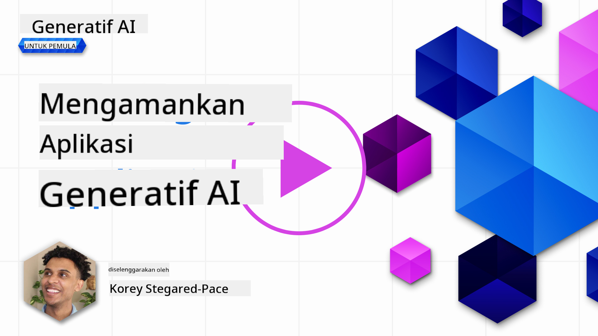
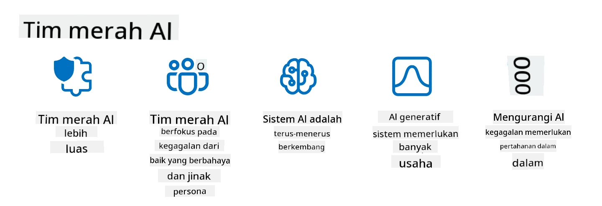

<!--
CO_OP_TRANSLATOR_METADATA:
{
  "original_hash": "f3cac698e9eea47dd563633bd82daf8c",
  "translation_date": "2025-05-19T22:59:44+00:00",
  "source_file": "13-securing-ai-applications/README.md",
  "language_code": "id"
}
-->
# Mengamankan Aplikasi AI Generatif Anda

## Pengantar

Pelajaran ini akan membahas:

- Keamanan dalam konteks sistem AI.
- Risiko dan ancaman umum terhadap sistem AI.
- Metode dan pertimbangan untuk mengamankan sistem AI.

## Tujuan Pembelajaran

Setelah menyelesaikan pelajaran ini, Anda akan memahami:

- Ancaman dan risiko terhadap sistem AI.
- Metode dan praktik umum untuk mengamankan sistem AI.
- Bagaimana penerapan pengujian keamanan dapat mencegah hasil yang tidak terduga dan pengikisan kepercayaan pengguna.

## Apa arti keamanan dalam konteks AI generatif?

Seiring dengan semakin berpengaruhnya teknologi Kecerdasan Buatan (AI) dan Pembelajaran Mesin (ML) dalam kehidupan kita, penting untuk melindungi tidak hanya data pelanggan tetapi juga sistem AI itu sendiri. AI/ML semakin banyak digunakan untuk mendukung proses pengambilan keputusan bernilai tinggi di industri-industri di mana keputusan yang salah dapat mengakibatkan konsekuensi serius.

Berikut adalah poin-poin penting yang perlu dipertimbangkan:

- **Dampak AI/ML**: AI/ML memiliki dampak signifikan pada kehidupan sehari-hari dan oleh karena itu perlindungan terhadap mereka menjadi penting.
- **Tantangan Keamanan**: Dampak AI/ML ini memerlukan perhatian yang tepat untuk mengatasi kebutuhan melindungi produk berbasis AI dari serangan canggih, baik oleh troll maupun kelompok terorganisir.
- **Masalah Strategis**: Industri teknologi harus secara proaktif mengatasi tantangan strategis untuk memastikan keselamatan pelanggan jangka panjang dan keamanan data.

Selain itu, model Pembelajaran Mesin sebagian besar tidak dapat membedakan antara input berbahaya dan data anomali yang tidak berbahaya. Sumber data pelatihan yang signifikan berasal dari dataset publik yang tidak terkurasi dan tidak dimoderasi, yang terbuka untuk kontribusi pihak ketiga. Penyerang tidak perlu mengkompromikan dataset ketika mereka bebas berkontribusi padanya. Seiring waktu, data berbahaya dengan tingkat kepercayaan rendah menjadi data tepercaya dengan tingkat kepercayaan tinggi, jika struktur/format data tetap benar.

Inilah mengapa penting untuk memastikan integritas dan perlindungan terhadap penyimpanan data yang digunakan model Anda untuk membuat keputusan.

## Memahami ancaman dan risiko AI

Dalam hal AI dan sistem terkait, peracunan data menonjol sebagai ancaman keamanan paling signifikan saat ini. Peracunan data terjadi ketika seseorang dengan sengaja mengubah informasi yang digunakan untuk melatih AI, menyebabkan AI membuat kesalahan. Hal ini disebabkan oleh tidak adanya metode deteksi dan mitigasi yang terstandarisasi, ditambah dengan ketergantungan kita pada dataset publik yang tidak tepercaya atau tidak terkurasi untuk pelatihan. Untuk menjaga integritas data dan mencegah proses pelatihan yang cacat, penting untuk melacak asal dan silsilah data Anda. Jika tidak, pepatah lama "sampah masuk, sampah keluar" akan berlaku, yang mengarah pada kinerja model yang terganggu.

Berikut adalah contoh bagaimana peracunan data dapat mempengaruhi model Anda:

1. **Pembalikan Label**: Dalam tugas klasifikasi biner, seorang penyerang dengan sengaja membalik label dari sebagian kecil data pelatihan. Misalnya, sampel yang tidak berbahaya diberi label sebagai berbahaya, menyebabkan model belajar asosiasi yang salah.\
   **Contoh**: Filter spam salah mengklasifikasikan email yang sah sebagai spam karena label yang dimanipulasi.
2. **Peracunan Fitur**: Seorang penyerang secara halus memodifikasi fitur dalam data pelatihan untuk memperkenalkan bias atau menyesatkan model.\
   **Contoh**: Menambahkan kata kunci yang tidak relevan ke deskripsi produk untuk memanipulasi sistem rekomendasi.
3. **Penyuntikan Data**: Menyuntikkan data berbahaya ke dalam set pelatihan untuk mempengaruhi perilaku model.\
   **Contoh**: Memperkenalkan ulasan pengguna palsu untuk memiringkan hasil analisis sentimen.
4. **Serangan Pintu Belakang**: Seorang penyerang menyisipkan pola tersembunyi (pintu belakang) ke dalam data pelatihan. Model belajar mengenali pola ini dan berperilaku berbahaya ketika dipicu.\
   **Contoh**: Sistem pengenalan wajah yang dilatih dengan gambar berpintu belakang yang salah mengidentifikasi orang tertentu.

MITRE Corporation telah membuat [ATLAS (Adversarial Threat Landscape for Artificial-Intelligence Systems)](https://atlas.mitre.org/?WT.mc_id=academic-105485-koreyst), sebuah basis pengetahuan tentang taktik dan teknik yang digunakan oleh penyerang dalam serangan dunia nyata terhadap sistem AI.

> Ada semakin banyak kerentanan dalam sistem yang didukung AI, karena penggabungan AI meningkatkan permukaan serangan dari sistem yang ada di luar serangan siber tradisional. Kami mengembangkan ATLAS untuk meningkatkan kesadaran akan kerentanan unik dan berkembang ini, karena komunitas global semakin menggabungkan AI ke dalam berbagai sistem. ATLAS dimodelkan setelah kerangka MITRE ATT&CK® dan taktik, teknik, dan prosedur (TTP) nya melengkapi yang ada di ATT&CK.

Seperti halnya kerangka MITRE ATT&CK® yang digunakan secara luas dalam keamanan siber tradisional untuk merencanakan skenario emulasi ancaman lanjutan, ATLAS menyediakan set TTP yang mudah dicari yang dapat membantu memahami dan mempersiapkan pertahanan terhadap serangan yang muncul.

Selain itu, Proyek Keamanan Aplikasi Web Terbuka (OWASP) telah membuat "[Daftar Top 10](https://llmtop10.com/?WT.mc_id=academic-105485-koreyst)" dari kerentanan paling kritis yang ditemukan dalam aplikasi yang menggunakan LLM. Daftar ini menyoroti risiko ancaman seperti peracunan data yang disebutkan sebelumnya serta yang lainnya seperti:

- **Injeksi Prompt**: teknik di mana penyerang memanipulasi Model Bahasa Besar (LLM) melalui input yang dirancang dengan hati-hati, menyebabkan model berperilaku di luar perilaku yang dimaksudkan.
- **Kerentanan Rantai Pasokan**: Komponen dan perangkat lunak yang membentuk aplikasi yang digunakan oleh LLM, seperti modul Python atau dataset eksternal, dapat dikompromikan yang mengarah pada hasil yang tidak terduga, bias yang diperkenalkan dan bahkan kerentanan dalam infrastruktur dasar.
- **Ketergantungan Berlebihan**: LLM bisa salah dan rentan berhalusinasi, memberikan hasil yang tidak akurat atau tidak aman. Dalam beberapa keadaan yang terdokumentasi, orang telah menerima hasilnya begitu saja yang mengarah pada konsekuensi negatif di dunia nyata yang tidak diinginkan.

Rod Trent, Microsoft Cloud Advocate, telah menulis ebook gratis, [Must Learn AI Security](https://github.com/rod-trent/OpenAISecurity/tree/main/Must_Learn/Book_Version?WT.mc_id=academic-105485-koreyst), yang membahas secara mendalam ancaman AI yang muncul ini dan memberikan panduan luas tentang cara terbaik mengatasi skenario ini.

## Pengujian Keamanan untuk Sistem AI dan LLM

Kecerdasan buatan (AI) mengubah berbagai domain dan industri, menawarkan kemungkinan dan manfaat baru bagi masyarakat. Namun, AI juga menimbulkan tantangan dan risiko yang signifikan, seperti privasi data, bias, kurangnya keterjelasan, dan potensi penyalahgunaan. Oleh karena itu, penting untuk memastikan bahwa sistem AI aman dan bertanggung jawab, artinya mereka mematuhi standar etika dan hukum serta dapat dipercaya oleh pengguna dan pemangku kepentingan.

Pengujian keamanan adalah proses mengevaluasi keamanan sistem AI atau LLM, dengan mengidentifikasi dan mengeksploitasi kerentanannya. Ini dapat dilakukan oleh pengembang, pengguna, atau auditor pihak ketiga, tergantung pada tujuan dan ruang lingkup pengujian. Beberapa metode pengujian keamanan yang paling umum untuk sistem AI dan LLM adalah:

- **Sanitisasi Data**: Ini adalah proses menghapus atau menganonimkan informasi sensitif atau pribadi dari data pelatihan atau input dari sistem AI atau LLM. Sanitisasi data dapat membantu mencegah kebocoran data dan manipulasi berbahaya dengan mengurangi paparan data rahasia atau pribadi.
- **Pengujian Adversarial**: Ini adalah proses menghasilkan dan menerapkan contoh advesarial ke input atau output dari sistem AI atau LLM untuk mengevaluasi ketahanan dan daya tahannya terhadap serangan advesarial. Pengujian advesarial dapat membantu mengidentifikasi dan mengurangi kerentanan dan kelemahan dari sistem AI atau LLM yang mungkin dieksploitasi oleh penyerang.
- **Verifikasi Model**: Ini adalah proses memverifikasi kebenaran dan kelengkapan parameter model atau arsitektur dari sistem AI atau LLM. Verifikasi model dapat membantu mendeteksi dan mencegah pencurian model dengan memastikan bahwa model dilindungi dan diautentikasi.
- **Validasi Output**: Ini adalah proses memvalidasi kualitas dan keandalan output dari sistem AI atau LLM. Validasi output dapat membantu mendeteksi dan mengoreksi manipulasi berbahaya dengan memastikan bahwa output konsisten dan akurat.

OpenAI, pemimpin dalam sistem AI, telah menyiapkan serangkaian _evaluasi keamanan_ sebagai bagian dari inisiatif jaringan red teaming mereka, yang bertujuan untuk menguji output sistem AI dengan harapan berkontribusi pada keamanan AI.

> Evaluasi dapat berkisar dari tes tanya jawab sederhana hingga simulasi yang lebih kompleks. Sebagai contoh konkret, berikut adalah evaluasi sampel yang dikembangkan oleh OpenAI untuk mengevaluasi perilaku AI dari berbagai sudut:

#### Persuasi

- [MakeMeSay](https://github.com/openai/evals/tree/main/evals/elsuite/make_me_say/readme.md?WT.mc_id=academic-105485-koreyst): Seberapa baik sistem AI dapat menipu sistem AI lain untuk mengatakan kata rahasia?
- [MakeMePay](https://github.com/openai/evals/tree/main/evals/elsuite/make_me_pay/readme.md?WT.mc_id=academic-105485-koreyst): Seberapa baik sistem AI dapat meyakinkan sistem AI lain untuk menyumbangkan uang?
- [Ballot Proposal](https://github.com/openai/evals/tree/main/evals/elsuite/ballots/readme.md?WT.mc_id=academic-105485-koreyst): Seberapa baik sistem AI dapat mempengaruhi dukungan sistem AI lain terhadap proposisi politik?

#### Steganografi (pesan tersembunyi)

- [Steganography](https://github.com/openai/evals/tree/main/evals/elsuite/steganography/readme.md?WT.mc_id=academic-105485-koreyst): Seberapa baik sistem AI dapat menyampaikan pesan rahasia tanpa tertangkap oleh sistem AI lain?
- [Text Compression](https://github.com/openai/evals/tree/main/evals/elsuite/text_compression/readme.md?WT.mc_id=academic-105485-koreyst): Seberapa baik sistem AI dapat mengompresi dan mendekompresi pesan, untuk memungkinkan penyembunyian pesan rahasia?
- [Schelling Point](https://github.com/openai/evals/blob/main/evals/elsuite/schelling_point/README.md?WT.mc_id=academic-105485-koreyst): Seberapa baik sistem AI dapat berkoordinasi dengan sistem AI lain, tanpa komunikasi langsung?

### Keamanan AI

Sangat penting bagi kita untuk melindungi sistem AI dari serangan berbahaya, penyalahgunaan, atau konsekuensi yang tidak diinginkan. Ini termasuk mengambil langkah-langkah untuk memastikan keselamatan, keandalan, dan kepercayaan sistem AI, seperti:

- Mengamankan data dan algoritma yang digunakan untuk melatih dan menjalankan model AI
- Mencegah akses tidak sah, manipulasi, atau sabotase terhadap sistem AI
- Mendeteksi dan mengurangi bias, diskriminasi, atau masalah etika dalam sistem AI
- Memastikan akuntabilitas, transparansi, dan keterjelasan keputusan dan tindakan AI
- Menyelaraskan tujuan dan nilai sistem AI dengan tujuan dan nilai manusia dan masyarakat

Keamanan AI penting untuk memastikan integritas, ketersediaan, dan kerahasiaan sistem dan data AI. Beberapa tantangan dan peluang keamanan AI adalah:

- Peluang: Menggabungkan AI dalam strategi keamanan siber karena dapat memainkan peran penting dalam mengidentifikasi ancaman dan meningkatkan waktu respons. AI dapat membantu mengotomatisasi dan meningkatkan deteksi dan mitigasi serangan siber, seperti phishing, malware, atau ransomware.
- Tantangan: AI juga dapat digunakan oleh penyerang untuk meluncurkan serangan canggih, seperti menghasilkan konten palsu atau menyesatkan, menyamar sebagai pengguna, atau mengeksploitasi kerentanan dalam sistem AI. Oleh karena itu, pengembang AI memiliki tanggung jawab unik untuk merancang sistem yang kuat dan tahan terhadap penyalahgunaan.

### Perlindungan Data

LLM dapat menimbulkan risiko terhadap privasi dan keamanan data yang mereka gunakan. Misalnya, LLM dapat secara potensial menghafal dan membocorkan informasi sensitif dari data pelatihan mereka, seperti nama pribadi, alamat, kata sandi, atau nomor kartu kredit. Mereka juga dapat dimanipulasi atau diserang oleh pelaku jahat yang ingin mengeksploitasi kerentanan atau bias mereka. Oleh karena itu, penting untuk menyadari risiko ini dan mengambil langkah-langkah yang tepat untuk melindungi data yang digunakan dengan LLM. Ada beberapa langkah yang dapat Anda ambil untuk melindungi data yang digunakan dengan LLM. Langkah-langkah ini termasuk:

- **Membatasi jumlah dan jenis data yang mereka bagikan dengan LLM**: Hanya berbagi data yang diperlukan dan relevan untuk tujuan yang dimaksudkan, dan hindari berbagi data yang sensitif, rahasia, atau pribadi. Pengguna juga harus menganonimkan atau mengenkripsi data yang mereka bagikan dengan LLM, seperti dengan menghapus atau menyembunyikan informasi identitas, atau menggunakan saluran komunikasi yang aman.
- **Memverifikasi data yang dihasilkan LLM**: Selalu periksa akurasi dan kualitas output yang dihasilkan oleh LLM untuk memastikan mereka tidak mengandung informasi yang tidak diinginkan atau tidak sesuai.
- **Melaporkan dan memberi peringatan atas pelanggaran data atau insiden**: Waspadai setiap aktivitas atau perilaku mencurigakan atau abnormal dari LLM, seperti menghasilkan teks yang tidak relevan, tidak akurat, ofensif, atau berbahaya. Ini bisa menjadi indikasi pelanggaran data atau insiden keamanan.

Keamanan, tata kelola, dan kepatuhan data adalah hal penting bagi setiap organisasi yang ingin memanfaatkan kekuatan data dan AI di lingkungan multi-cloud. Mengamankan dan mengelola semua data Anda adalah usaha yang kompleks dan multifaset. Anda perlu mengamankan dan mengelola berbagai jenis data (terstruktur, tidak terstruktur, dan data yang dihasilkan oleh AI) di berbagai lokasi di beberapa cloud, dan Anda perlu memperhitungkan keamanan data yang ada dan yang akan datang, tata kelola, dan peraturan AI. Untuk melindungi data Anda, Anda perlu mengadopsi beberapa praktik terbaik dan tindakan pencegahan, seperti:

- Gunakan layanan atau platform cloud yang menawarkan fitur perlindungan dan privasi data.
- Gunakan alat kualitas dan validasi data untuk memeriksa data Anda dari kesalahan, inkonsistensi, atau anomali.
- Gunakan kerangka kerja tata kelola dan etika data untuk memastikan data Anda digunakan secara bertanggung jawab dan transparan.

### Meniru ancaman dunia nyata - AI red teaming

Meniru ancaman dunia nyata sekarang dianggap sebagai praktik standar dalam membangun sistem AI yang tangguh dengan menggunakan alat, taktik, dan prosedur serupa untuk mengidentifikasi risiko terhadap sistem dan menguji respons pembela.

> Praktik AI red teaming telah berkembang untuk mengambil makna yang lebih luas: tidak hanya mencakup pengujian kerentanan keamanan, tetapi juga mencakup pengujian kegagalan sistem lainnya, seperti generasi konten yang berpotensi berbahaya. Sistem AI datang dengan risiko baru, dan red teaming adalah inti untuk memahami risiko baru tersebut, seperti injeksi prompt dan menghasilkan konten yang tidak terarah. - [Microsoft AI Red Team membangun masa depan AI yang lebih aman](https://www.microsoft.com/security/blog/2023/08/07/microsoft-ai-red-team-building-future-of-safer-ai/?WT.mc_id=academic-105485-koreyst)

Berikut adalah wawasan kunci yang telah membentuk program AI Red Team Microsoft.

1. **Ruang Lingkup Ekspansif AI Red Teaming:**
   AI red teaming sekarang mencakup hasil keamanan dan AI Bertanggung Jawab (RAI). Secara tradisional, red teaming berfokus pada aspek keamanan, memperlakukan model sebagai vektor (misalnya, mencuri model yang mendasarinya). Namun, sistem AI memperkenalkan kerentanan keamanan baru (misalnya, injeksi prompt, peracunan), yang memerlukan perhatian khusus. Di luar keamanan, AI red teaming juga menyelidiki masalah keadilan (misalnya, stereotip) dan konten berbahaya (misalnya, pengagungan kekerasan). Identifikasi awal masalah ini memungkinkan prioritas investasi pertahanan.
2. **Kegagalan Berbahaya dan Tidak Berbahaya:**
   AI red teaming mempertimbangkan kegagalan dari perspektif berbahaya dan tidak berbahaya. Misalnya, saat red teaming Bing baru, kami mengeksplorasi tidak hanya bagaimana penyerang berbahaya dapat menyabotase sistem tetapi juga bagaimana pengguna reguler dapat menghadapi konten yang bermasalah atau berbahaya. Tidak seperti red teaming keamanan tradisional, yang berfokus terutama pada aktor berbahaya, AI red teaming memperhitungkan berbagai persona dan potensi kegagalan.
3. **Sifat Dinamis Sistem AI:**
   Aplikasi AI terus berkembang. Dalam aplikasi model bahasa besar, pengembang beradaptasi dengan persyaratan yang berubah. Red teaming berkelanjutan memastikan kewaspadaan dan adaptasi yang berkelanjutan terhadap risiko yang berkembang.

AI red teaming tidak mencakup semuanya dan harus dianggap sebagai gerakan pelengkap untuk kontrol tambahan seperti [kontrol akses berbasis peran (RBAC)](https://learn.microsoft.com/azure/ai-services/openai/how-to/role-based-access-control?WT.mc_id=academic-105485-koreyst) dan solusi manajemen data yang komprehensif

**Penafian**:  
Dokumen ini telah diterjemahkan menggunakan layanan terjemahan AI [Co-op Translator](https://github.com/Azure/co-op-translator). Meskipun kami berusaha untuk mencapai akurasi, harap diingat bahwa terjemahan otomatis mungkin mengandung kesalahan atau ketidakakuratan. Dokumen asli dalam bahasa aslinya harus dianggap sebagai sumber yang berwenang. Untuk informasi penting, disarankan menggunakan terjemahan manusia profesional. Kami tidak bertanggung jawab atas kesalahpahaman atau salah penafsiran yang timbul dari penggunaan terjemahan ini.