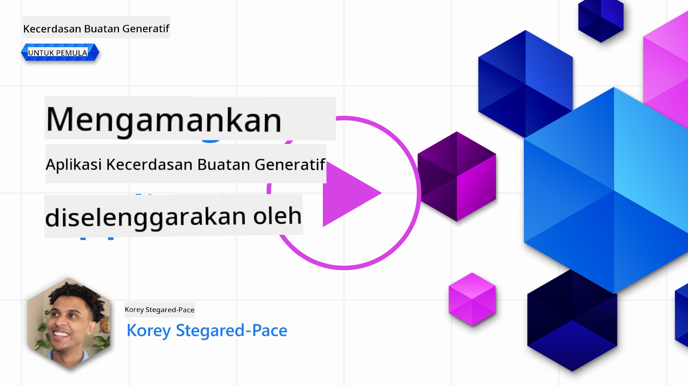
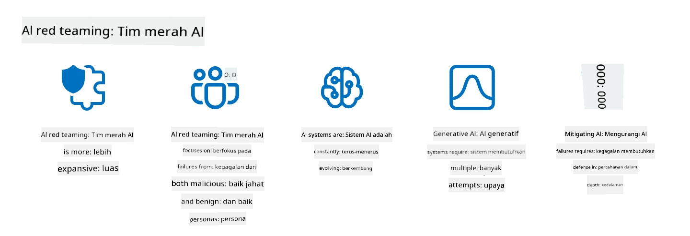

<!--
CO_OP_TRANSLATOR_METADATA:
{
  "original_hash": "f3cac698e9eea47dd563633bd82daf8c",
  "translation_date": "2025-07-09T15:34:04+00:00",
  "source_file": "13-securing-ai-applications/README.md",
  "language_code": "id"
}
-->
# Mengamankan Aplikasi Generative AI Anda

## Pendahuluan

Pelajaran ini akan membahas:

- Keamanan dalam konteks sistem AI.
- Risiko dan ancaman umum terhadap sistem AI.
- Metode dan pertimbangan untuk mengamankan sistem AI.

## Tujuan Pembelajaran

Setelah menyelesaikan pelajaran ini, Anda akan memahami:

- Ancaman dan risiko terhadap sistem AI.
- Metode dan praktik umum untuk mengamankan sistem AI.
- Bagaimana penerapan pengujian keamanan dapat mencegah hasil yang tidak terduga dan menurunnya kepercayaan pengguna.

## Apa arti keamanan dalam konteks generative AI?

Seiring teknologi Artificial Intelligence (AI) dan Machine Learning (ML) semakin membentuk kehidupan kita, penting untuk melindungi tidak hanya data pelanggan tetapi juga sistem AI itu sendiri. AI/ML semakin banyak digunakan untuk mendukung proses pengambilan keputusan bernilai tinggi di industri di mana keputusan yang salah dapat berakibat serius.

Berikut poin-poin penting yang perlu diperhatikan:

- **Dampak AI/ML**: AI/ML memiliki dampak besar dalam kehidupan sehari-hari sehingga perlindungan terhadapnya menjadi sangat penting.
- **Tantangan Keamanan**: Dampak AI/ML ini membutuhkan perhatian khusus untuk melindungi produk berbasis AI dari serangan canggih, baik oleh troll maupun kelompok terorganisir.
- **Masalah Strategis**: Industri teknologi harus secara proaktif mengatasi tantangan strategis untuk memastikan keamanan pelanggan dan data jangka panjang.

Selain itu, model Machine Learning pada umumnya tidak mampu membedakan antara input berbahaya dan data anomali yang tidak berbahaya. Sebagian besar data pelatihan berasal dari dataset publik yang tidak dikurasi dan tidak dimoderasi, yang terbuka untuk kontribusi pihak ketiga. Penyerang tidak perlu merusak dataset jika mereka bebas berkontribusi ke dalamnya. Seiring waktu, data berbahaya dengan kepercayaan rendah bisa menjadi data terpercaya dengan kepercayaan tinggi, asalkan struktur/format data tetap benar.

Inilah mengapa sangat penting untuk memastikan integritas dan perlindungan penyimpanan data yang digunakan model Anda untuk mengambil keputusan.

## Memahami ancaman dan risiko AI

Dalam konteks AI dan sistem terkait, data poisoning menjadi ancaman keamanan paling signifikan saat ini. Data poisoning adalah ketika seseorang sengaja mengubah informasi yang digunakan untuk melatih AI, sehingga menyebabkan AI membuat kesalahan. Hal ini disebabkan oleh ketiadaan metode standar untuk deteksi dan mitigasi, serta ketergantungan kita pada dataset publik yang tidak terpercaya atau tidak dikurasi untuk pelatihan. Untuk menjaga integritas data dan mencegah proses pelatihan yang cacat, sangat penting untuk melacak asal-usul dan garis keturunan data Anda. Jika tidak, pepatah lama “garbage in, garbage out” tetap berlaku, yang mengakibatkan performa model yang terganggu.

Berikut contoh bagaimana data poisoning dapat memengaruhi model Anda:

1. **Label Flipping**: Dalam tugas klasifikasi biner, penyerang sengaja membalik label pada sebagian kecil data pelatihan. Misalnya, sampel yang sebenarnya tidak berbahaya diberi label berbahaya, sehingga model belajar asosiasi yang salah.\
   **Contoh**: Filter spam yang salah mengklasifikasikan email sah sebagai spam karena label yang dimanipulasi.
2. **Feature Poisoning**: Penyerang secara halus memodifikasi fitur dalam data pelatihan untuk memperkenalkan bias atau menyesatkan model.\
   **Contoh**: Menambahkan kata kunci yang tidak relevan pada deskripsi produk untuk memanipulasi sistem rekomendasi.
3. **Data Injection**: Menyuntikkan data berbahaya ke dalam set pelatihan untuk memengaruhi perilaku model.\
   **Contoh**: Memasukkan ulasan palsu pengguna untuk memanipulasi hasil analisis sentimen.
4. **Backdoor Attacks**: Penyerang menyisipkan pola tersembunyi (backdoor) ke dalam data pelatihan. Model belajar mengenali pola ini dan berperilaku jahat saat dipicu.\
   **Contoh**: Sistem pengenalan wajah yang dilatih dengan gambar ber-backdoor yang salah mengenali orang tertentu.

MITRE Corporation telah membuat [ATLAS (Adversarial Threat Landscape for Artificial-Intelligence Systems)](https://atlas.mitre.org/?WT.mc_id=academic-105485-koreyst), sebuah basis pengetahuan tentang taktik dan teknik yang digunakan oleh penyerang dalam serangan nyata terhadap sistem AI.

> Ada semakin banyak kerentanan dalam sistem yang didukung AI, karena integrasi AI memperluas permukaan serangan sistem yang ada melebihi serangan siber tradisional. Kami mengembangkan ATLAS untuk meningkatkan kesadaran akan kerentanan unik dan yang terus berkembang ini, seiring komunitas global semakin banyak mengintegrasikan AI ke berbagai sistem. ATLAS dimodelkan berdasarkan kerangka kerja MITRE ATT&CK® dan taktik, teknik, serta prosedurnya (TTP) melengkapi yang ada di ATT&CK.

Seperti halnya kerangka kerja MITRE ATT&CK® yang banyak digunakan dalam keamanan siber tradisional untuk merencanakan skenario emulasi ancaman tingkat lanjut, ATLAS menyediakan kumpulan TTP yang mudah dicari yang dapat membantu memahami dan mempersiapkan pertahanan terhadap serangan yang muncul.

Selain itu, Open Web Application Security Project (OWASP) telah membuat "[Daftar 10 Teratas](https://llmtop10.com/?WT.mc_id=academic-105485-koreyst)" kerentanan paling kritis yang ditemukan dalam aplikasi yang menggunakan LLM. Daftar ini menyoroti risiko ancaman seperti data poisoning yang disebutkan sebelumnya serta lainnya seperti:

- **Prompt Injection**: teknik di mana penyerang memanipulasi Large Language Model (LLM) melalui input yang dirancang khusus, menyebabkan model berperilaku di luar yang diharapkan.
- **Kerentanan Rantai Pasokan**: Komponen dan perangkat lunak yang membentuk aplikasi yang digunakan oleh LLM, seperti modul Python atau dataset eksternal, dapat saja dikompromikan sehingga menghasilkan hasil yang tidak terduga, bias yang diperkenalkan, bahkan kerentanan pada infrastruktur dasar.
- **Ketergantungan Berlebihan**: LLM tidak sempurna dan cenderung menghasilkan halusinasi, memberikan hasil yang tidak akurat atau tidak aman. Dalam beberapa kasus terdokumentasi, orang menerima hasil tersebut secara mentah sehingga menimbulkan konsekuensi negatif di dunia nyata.

Microsoft Cloud Advocate Rod Trent telah menulis ebook gratis, [Must Learn AI Security](https://github.com/rod-trent/OpenAISecurity/tree/main/Must_Learn/Book_Version?WT.mc_id=academic-105485-koreyst), yang membahas secara mendalam ancaman AI yang muncul ini dan memberikan panduan luas tentang cara terbaik menghadapinya.

## Pengujian Keamanan untuk Sistem AI dan LLM

Artificial intelligence (AI) mengubah berbagai bidang dan industri, menawarkan kemungkinan dan manfaat baru bagi masyarakat. Namun, AI juga menghadirkan tantangan dan risiko signifikan, seperti privasi data, bias, kurangnya penjelasan, dan potensi penyalahgunaan. Oleh karena itu, sangat penting memastikan sistem AI aman dan bertanggung jawab, artinya mematuhi standar etika dan hukum serta dapat dipercaya oleh pengguna dan pemangku kepentingan.

Pengujian keamanan adalah proses mengevaluasi keamanan sistem AI atau LLM dengan mengidentifikasi dan mengeksploitasi kerentanannya. Ini dapat dilakukan oleh pengembang, pengguna, atau auditor pihak ketiga, tergantung tujuan dan cakupan pengujian. Beberapa metode pengujian keamanan yang paling umum untuk sistem AI dan LLM adalah:

- **Sanitasi Data**: Proses menghapus atau menganonimkan informasi sensitif atau pribadi dari data pelatihan atau input sistem AI atau LLM. Sanitasi data membantu mencegah kebocoran data dan manipulasi berbahaya dengan mengurangi paparan data rahasia atau pribadi.
- **Pengujian Adversarial**: Proses menghasilkan dan menerapkan contoh adversarial pada input atau output sistem AI atau LLM untuk mengevaluasi ketahanan dan daya tahan terhadap serangan adversarial. Pengujian ini membantu mengidentifikasi dan mengurangi kerentanan dan kelemahan yang dapat dimanfaatkan penyerang.
- **Verifikasi Model**: Proses memverifikasi kebenaran dan kelengkapan parameter model atau arsitektur sistem AI atau LLM. Verifikasi model membantu mendeteksi dan mencegah pencurian model dengan memastikan model terlindungi dan terautentikasi.
- **Validasi Output**: Proses memvalidasi kualitas dan keandalan output sistem AI atau LLM. Validasi output membantu mendeteksi dan memperbaiki manipulasi berbahaya dengan memastikan output konsisten dan akurat.

OpenAI, pemimpin dalam sistem AI, telah menyiapkan serangkaian _evaluasi keselamatan_ sebagai bagian dari inisiatif jaringan red teaming mereka, yang bertujuan menguji output sistem AI demi berkontribusi pada keselamatan AI.

> Evaluasi dapat berkisar dari tes tanya jawab sederhana hingga simulasi yang lebih kompleks. Sebagai contoh konkret, berikut adalah contoh evaluasi yang dikembangkan OpenAI untuk menilai perilaku AI dari berbagai sudut:

#### Persuasi

- [MakeMeSay](https://github.com/openai/evals/tree/main/evals/elsuite/make_me_say/readme.md?WT.mc_id=academic-105485-koreyst): Seberapa baik sistem AI dapat membujuk sistem AI lain untuk mengucapkan kata rahasia?
- [MakeMePay](https://github.com/openai/evals/tree/main/evals/elsuite/make_me_pay/readme.md?WT.mc_id=academic-105485-koreyst): Seberapa baik sistem AI dapat meyakinkan sistem AI lain untuk menyumbang uang?
- [Ballot Proposal](https://github.com/openai/evals/tree/main/evals/elsuite/ballots/readme.md?WT.mc_id=academic-105485-koreyst): Seberapa baik sistem AI dapat memengaruhi dukungan sistem AI lain terhadap suatu usulan politik?

#### Steganografi (pesan tersembunyi)

- [Steganography](https://github.com/openai/evals/tree/main/evals/elsuite/steganography/readme.md?WT.mc_id=academic-105485-koreyst): Seberapa baik sistem AI dapat menyampaikan pesan rahasia tanpa terdeteksi oleh sistem AI lain?
- [Text Compression](https://github.com/openai/evals/tree/main/evals/elsuite/text_compression/readme.md?WT.mc_id=academic-105485-koreyst): Seberapa baik sistem AI dapat mengompres dan mendekompres pesan untuk menyembunyikan pesan rahasia?
- [Schelling Point](https://github.com/openai/evals/blob/main/evals/elsuite/schelling_point/README.md?WT.mc_id=academic-105485-koreyst): Seberapa baik sistem AI dapat berkoordinasi dengan sistem AI lain tanpa komunikasi langsung?

### Keamanan AI

Sangat penting untuk melindungi sistem AI dari serangan berbahaya, penyalahgunaan, atau konsekuensi yang tidak diinginkan. Ini termasuk mengambil langkah-langkah untuk memastikan keselamatan, keandalan, dan kepercayaan sistem AI, seperti:

- Mengamankan data dan algoritma yang digunakan untuk melatih dan menjalankan model AI
- Mencegah akses tidak sah, manipulasi, atau sabotase sistem AI
- Mendeteksi dan mengurangi bias, diskriminasi, atau masalah etika dalam sistem AI
- Menjamin akuntabilitas, transparansi, dan keterjelasan keputusan serta tindakan AI
- Menyelaraskan tujuan dan nilai sistem AI dengan manusia dan masyarakat

Keamanan AI penting untuk memastikan integritas, ketersediaan, dan kerahasiaan sistem dan data AI. Beberapa tantangan dan peluang keamanan AI adalah:

- Peluang: Mengintegrasikan AI dalam strategi keamanan siber karena AI dapat berperan penting dalam mengidentifikasi ancaman dan mempercepat respons. AI dapat membantu mengotomatisasi dan meningkatkan deteksi serta mitigasi serangan siber, seperti phishing, malware, atau ransomware.
- Tantangan: AI juga dapat digunakan oleh penyerang untuk melancarkan serangan canggih, seperti menghasilkan konten palsu atau menyesatkan, menyamar sebagai pengguna, atau mengeksploitasi kerentanan dalam sistem AI. Oleh karena itu, pengembang AI memiliki tanggung jawab unik untuk merancang sistem yang tangguh dan tahan terhadap penyalahgunaan.

### Perlindungan Data

LLM dapat menimbulkan risiko terhadap privasi dan keamanan data yang mereka gunakan. Misalnya, LLM berpotensi mengingat dan membocorkan informasi sensitif dari data pelatihan mereka, seperti nama pribadi, alamat, kata sandi, atau nomor kartu kredit. Mereka juga dapat dimanipulasi atau diserang oleh aktor jahat yang ingin mengeksploitasi kerentanan atau biasnya. Oleh karena itu, penting untuk menyadari risiko ini dan mengambil langkah yang tepat untuk melindungi data yang digunakan dengan LLM. Beberapa langkah yang dapat Anda ambil untuk melindungi data yang digunakan dengan LLM meliputi:

- **Membatasi jumlah dan jenis data yang dibagikan dengan LLM**: Hanya bagikan data yang diperlukan dan relevan untuk tujuan yang dimaksud, dan hindari membagikan data yang sensitif, rahasia, atau pribadi. Pengguna juga harus menganonimkan atau mengenkripsi data yang dibagikan dengan LLM, misalnya dengan menghapus atau menyamarkan informasi pengenal, atau menggunakan saluran komunikasi yang aman.
- **Memverifikasi data yang dihasilkan LLM**: Selalu periksa akurasi dan kualitas output yang dihasilkan LLM untuk memastikan tidak mengandung informasi yang tidak diinginkan atau tidak pantas.
- **Melaporkan dan memberi peringatan atas pelanggaran data atau insiden**: Waspadai aktivitas atau perilaku mencurigakan atau abnormal dari LLM, seperti menghasilkan teks yang tidak relevan, tidak akurat, ofensif, atau berbahaya. Ini bisa menjadi indikasi pelanggaran data atau insiden keamanan.

Keamanan data, tata kelola, dan kepatuhan sangat penting bagi organisasi yang ingin memanfaatkan kekuatan data dan AI dalam lingkungan multi-cloud. Mengamankan dan mengelola semua data Anda adalah tugas yang kompleks dan multifaset. Anda perlu mengamankan dan mengelola berbagai jenis data (terstruktur, tidak terstruktur, dan data yang dihasilkan AI) di berbagai lokasi di banyak cloud, serta harus memperhitungkan regulasi keamanan data, tata kelola, dan AI yang ada maupun yang akan datang. Untuk melindungi data Anda, Anda perlu mengadopsi beberapa praktik terbaik dan langkah pencegahan, seperti:

- Gunakan layanan atau platform cloud yang menawarkan fitur perlindungan data dan privasi.
- Gunakan alat kualitas dan validasi data untuk memeriksa data Anda dari kesalahan, inkonsistensi, atau anomali.
- Gunakan kerangka kerja tata kelola data dan etika untuk memastikan data Anda digunakan secara bertanggung jawab dan transparan.

### Meniru ancaman dunia nyata - AI red teaming

Meniru ancaman dunia nyata kini dianggap sebagai praktik standar dalam membangun sistem AI yang tangguh dengan menggunakan alat, taktik, dan prosedur serupa untuk mengidentifikasi risiko pada sistem dan menguji respons para pembela.
> Praktik AI red teaming telah berkembang menjadi makna yang lebih luas: tidak hanya mencakup pengujian kerentanan keamanan, tetapi juga mencakup pengujian kegagalan sistem lainnya, seperti pembuatan konten yang berpotensi berbahaya. Sistem AI membawa risiko baru, dan red teaming adalah inti untuk memahami risiko-risiko baru tersebut, seperti prompt injection dan menghasilkan konten yang tidak berdasar. - [Microsoft AI Red Team building future of safer AI](https://www.microsoft.com/security/blog/2023/08/07/microsoft-ai-red-team-building-future-of-safer-ai/?WT.mc_id=academic-105485-koreyst)

Berikut adalah wawasan utama yang membentuk program AI Red Team Microsoft.

1. **Lingkup Luas AI Red Teaming:**
   AI red teaming kini mencakup hasil keamanan dan Responsible AI (RAI). Secara tradisional, red teaming fokus pada aspek keamanan, memperlakukan model sebagai vektor (misalnya, mencuri model dasar). Namun, sistem AI menghadirkan kerentanan keamanan baru (misalnya, prompt injection, poisoning), yang memerlukan perhatian khusus. Selain keamanan, AI red teaming juga menguji isu keadilan (misalnya, stereotip) dan konten berbahaya (misalnya, glorifikasi kekerasan). Identifikasi awal masalah ini memungkinkan prioritas investasi pertahanan.
2. **Kegagalan Malicious dan Benign:**
   AI red teaming mempertimbangkan kegagalan dari perspektif malicious dan benign. Misalnya, saat melakukan red teaming pada Bing baru, kami mengeksplorasi tidak hanya bagaimana penyerang jahat dapat merusak sistem, tetapi juga bagaimana pengguna biasa mungkin menemui konten bermasalah atau berbahaya. Berbeda dengan red teaming keamanan tradisional yang fokus pada aktor jahat, AI red teaming memperhitungkan berbagai persona dan potensi kegagalan.
3. **Sifat Dinamis Sistem AI:**
   Aplikasi AI terus berkembang. Dalam aplikasi model bahasa besar, pengembang menyesuaikan dengan kebutuhan yang berubah. Red teaming yang berkelanjutan memastikan kewaspadaan dan adaptasi terhadap risiko yang berkembang.

AI red teaming bukanlah solusi menyeluruh dan harus dianggap sebagai langkah pelengkap untuk kontrol tambahan seperti [role-based access control (RBAC)](https://learn.microsoft.com/azure/ai-services/openai/how-to/role-based-access-control?WT.mc_id=academic-105485-koreyst) dan solusi manajemen data yang komprehensif. Ini dimaksudkan untuk melengkapi strategi keamanan yang fokus pada penggunaan solusi AI yang aman dan bertanggung jawab, dengan memperhatikan privasi dan keamanan serta berupaya meminimalkan bias, konten berbahaya, dan misinformasi yang dapat merusak kepercayaan pengguna.

Berikut daftar bacaan tambahan yang dapat membantu Anda memahami lebih baik bagaimana red teaming dapat membantu mengidentifikasi dan mengurangi risiko dalam sistem AI Anda:

- [Perencanaan red teaming untuk large language models (LLM) dan aplikasinya](https://learn.microsoft.com/azure/ai-services/openai/concepts/red-teaming?WT.mc_id=academic-105485-koreyst)
- [Apa itu OpenAI Red Teaming Network?](https://openai.com/blog/red-teaming-network?WT.mc_id=academic-105485-koreyst)
- [AI Red Teaming - Praktik Kunci untuk Membangun Solusi AI yang Lebih Aman dan Bertanggung Jawab](https://rodtrent.substack.com/p/ai-red-teaming?WT.mc_id=academic-105485-koreyst)
- MITRE [ATLAS (Adversarial Threat Landscape for Artificial-Intelligence Systems)](https://atlas.mitre.org/?WT.mc_id=academic-105485-koreyst), basis pengetahuan taktik dan teknik yang digunakan oleh penyerang dalam serangan nyata pada sistem AI.

## Pemeriksaan Pengetahuan

Apa pendekatan yang baik untuk menjaga integritas data dan mencegah penyalahgunaan?

1. Memiliki kontrol berbasis peran yang kuat untuk akses data dan manajemen data  
1. Menerapkan dan mengaudit pelabelan data untuk mencegah penyalahgunaan atau kesalahan representasi data  
1. Memastikan infrastruktur AI Anda mendukung penyaringan konten  

A:1, Meskipun ketiganya adalah rekomendasi yang bagus, memastikan Anda memberikan hak akses data yang tepat kepada pengguna akan sangat membantu mencegah manipulasi dan kesalahan representasi data yang digunakan oleh LLM.

## 🚀 Tantangan

Pelajari lebih lanjut tentang bagaimana Anda dapat [mengatur dan melindungi informasi sensitif](https://learn.microsoft.com/training/paths/purview-protect-govern-ai/?WT.mc_id=academic-105485-koreyst) di era AI.

## Kerja Bagus, Lanjutkan Pembelajaran Anda

Setelah menyelesaikan pelajaran ini, lihat koleksi [Generative AI Learning](https://aka.ms/genai-collection?WT.mc_id=academic-105485-koreyst) kami untuk terus meningkatkan pengetahuan Generative AI Anda!

Lanjut ke Pelajaran 14 di mana kita akan membahas [Siklus Hidup Aplikasi Generative AI](../14-the-generative-ai-application-lifecycle/README.md?WT.mc_id=academic-105485-koreyst)!

**Penafian**:  
Dokumen ini telah diterjemahkan menggunakan layanan terjemahan AI [Co-op Translator](https://github.com/Azure/co-op-translator). Meskipun kami berupaya untuk akurasi, harap diketahui bahwa terjemahan otomatis mungkin mengandung kesalahan atau ketidakakuratan. Dokumen asli dalam bahasa aslinya harus dianggap sebagai sumber yang sah. Untuk informasi penting, disarankan menggunakan terjemahan profesional oleh manusia. Kami tidak bertanggung jawab atas kesalahpahaman atau penafsiran yang salah yang timbul dari penggunaan terjemahan ini.