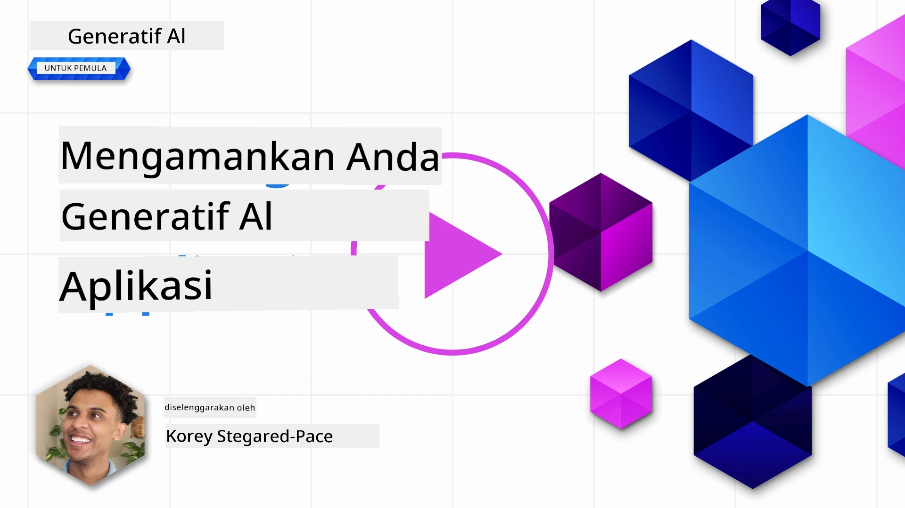
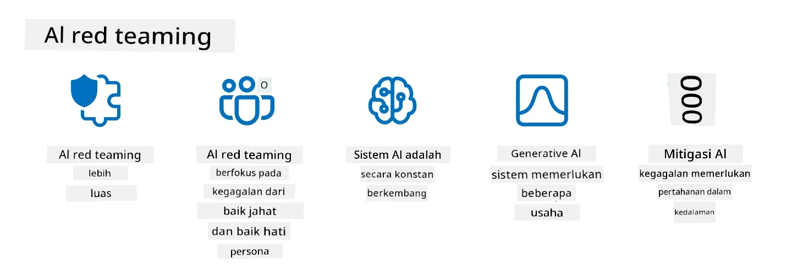

# Mengamankan Aplikasi AI Generatif Anda

## Pendahuluan

Pelajaran ini akan membahas:

- Keamanan dalam konteks sistem AI.
- Risiko dan ancaman umum pada sistem AI.
- Metode dan pertimbangan untuk mengamankan sistem AI.

## Tujuan Pembelajaran

Setelah menyelesaikan pelajaran ini, Anda akan memahami:

- Ancaman dan risiko terhadap sistem AI.
- Metode dan praktik umum untuk mengamankan sistem AI.
- Bagaimana penerapan pengujian keamanan dapat mencegah hasil yang tidak terduga dan pengikisan kepercayaan pengguna.

## Apa arti keamanan dalam konteks AI generatif?

Seiring teknologi Kecerdasan Buatan (AI) dan Pembelajaran Mesin (ML) semakin membentuk kehidupan kita, sangat penting untuk melindungi tidak hanya data pelanggan tetapi juga sistem AI itu sendiri. AI/ML semakin banyak digunakan dalam mendukung proses pengambilan keputusan bernilai tinggi di industri di mana keputusan yang salah dapat berakibat serius.

Berikut adalah poin-poin kunci yang perlu dipertimbangkan:

- **Dampak AI/ML**: AI/ML memiliki dampak signifikan dalam kehidupan sehari-hari sehingga perlindungan terhadapnya menjadi sangat penting.
- **Tantangan Keamanan**: Dampak AI/ML perlu perhatian yang tepat untuk mengatasi kebutuhan melindungi produk berbasis AI dari serangan canggih, baik oleh troll maupun kelompok terorganisir.
- **Masalah Strategis**: Industri teknologi harus secara proaktif mengatasi tantangan strategis untuk memastikan keamanan pelanggan dan data dalam jangka panjang.

Selain itu, model Machine Learning sebagian besar tidak mampu membedakan antara input yang berbahaya dan data anomali yang tidak berbahaya. Sumber utama data pelatihan berasal dari dataset publik yang tidak dikurasi dan tidak dimoderasi, yang terbuka untuk kontribusi pihak ketiga. Penyerang tidak perlu meretas dataset jika mereka dapat menyumbang langsung. Seiring waktu, data berbahaya dengan kepercayaan rendah menjadi data terpercaya dengan kepercayaan tinggi, jika struktur/format data tetap benar.

Oleh karena itu sangat penting untuk memastikan integritas dan perlindungan dari penyimpanan data yang digunakan model Anda dalam pengambilan keputusan.

## Memahami ancaman dan risiko AI

Dalam hal AI dan sistem terkait, keracunan data menjadi ancaman keamanan paling signifikan saat ini. Keracunan data adalah ketika seseorang sengaja mengubah informasi yang digunakan untuk melatih AI, menyebabkan kesalahan. Hal ini disebabkan oleh ketiadaan metode deteksi dan mitigasi standar, ditambah ketergantungan kita pada dataset publik yang tidak terpercaya atau tidak dikurasi untuk pelatihan. Untuk menjaga integritas data dan mencegah proses pelatihan yang cacat, penting untuk melacak asal usul dan silsilah data Anda. Jika tidak, pepatah lama “garbage in, garbage out” berlaku, yang mengakibatkan kinerja model terganggu.

Berikut adalah contoh bagaimana keracunan data dapat mempengaruhi model Anda:

1. **Pembalikan Label**: Dalam tugas klasifikasi biner, seorang penyerang sengaja membalik label sejumlah kecil data pelatihan. Misalnya, sampel yang seharusnya baik dilabel sebagai berbahaya, menyebabkan model mempelajari asosiasi yang salah.\
   **Contoh**: Filter spam salah mengklasifikasikan email sah sebagai spam karena label yang dimanipulasi.
2. **Keracunan Fitur**: Penyerang secara halus memodifikasi fitur dalam data pelatihan untuk memperkenalkan bias atau menyesatkan model.\
   **Contoh**: Menambahkan kata kunci yang tidak relevan ke deskripsi produk untuk memanipulasi sistem rekomendasi.
3. **Injeksi Data**: Menyisipkan data berbahaya ke dalam set pelatihan untuk mempengaruhi perilaku model.\
   **Contoh**: Memperkenalkan ulasan pengguna palsu untuk mempengaruhi hasil analisis sentimen.
4. **Serangan Pintu Belakang**: Penyerang menyisipkan pola tersembunyi (pintu belakang) dalam data pelatihan. Model belajar mengenali pola ini dan berperilaku jahat saat dipicu.\
   **Contoh**: Sistem pengenalan wajah yang dilatih dengan gambar ber-pintu belakang yang salah mengenali orang tertentu.

MITRE Corporation telah membuat [ATLAS (Adversarial Threat Landscape for Artificial-Intelligence Systems)](https://atlas.mitre.org/?WT.mc_id=academic-105485-koreyst), suatu basis pengetahuan tentang taktik dan teknik yang digunakan oleh lawan dalam serangan dunia nyata terhadap sistem AI.

> Ada semakin banyak kerentanan dalam sistem yang didukung AI, karena penerapan AI meningkatkan permukaan serangan sistem yang sudah ada melampaui serangan siber tradisional. Kami mengembangkan ATLAS untuk meningkatkan kesadaran terhadap kerentanan unik dan yang terus berkembang ini, karena komunitas global semakin banyak mengintegrasikan AI ke berbagai sistem. ATLAS dimodelkan berdasarkan kerangka kerja MITRE ATT&CK® dan taktik, teknik, serta prosedurnya (TTPs) melengkapi yang ada di ATT&CK.

Seperti halnya kerangka kerja MITRE ATT&CK® yang banyak digunakan dalam keamanan siber tradisional untuk merancang skenario emulasi ancaman canggih, ATLAS menyediakan TTP yang mudah dicari untuk membantu memahami dan mempersiapkan pertahanan terhadap serangan yang muncul.

Selain itu, Open Web Application Security Project (OWASP) telah membuat "[Daftar 10 Teratas](https://llmtop10.com/?WT.mc_id=academic-105485-koreyst)" dari kerentanan paling kritis yang ditemukan dalam aplikasi yang menggunakan LLM. Daftar tersebut menyoroti risiko ancaman seperti keracunan data yang disebutkan serta lainnya seperti:

- **Injeksi Prompt**: teknik di mana penyerang memanipulasi Large Language Model (LLM) melalui input yang disusun dengan hati-hati sehingga LLM berperilaku di luar yang dimaksud.
- **Kerentanan Rantai Pasok**: Komponen dan perangkat lunak yang membentuk aplikasi yang digunakan oleh LLM, seperti modul Python atau dataset eksternal, itu sendiri dapat dikompromikan yang menyebabkan hasil yang tak terduga, bias yang diperkenalkan, dan bahkan kerentanan pada infrastruktur dasar.
- **Ketergantungan Berlebihan**: LLM bersifat tidak sempurna dan cenderung melakukan halusinasi, memberikan hasil yang tidak akurat atau tidak aman. Dalam beberapa kasus terdokumentasi, orang mengambil hasil tersebut secara mentah yang berujung pada konsekuensi negatif nyata yang tidak diinginkan.

Microsoft Cloud Advocate Rod Trent telah menulis ebook gratis, [Must Learn AI Security](https://github.com/rod-trent/OpenAISecurity/tree/main/Must_Learn/Book_Version?WT.mc_id=academic-105485-koreyst), yang membahas secara mendalam ancaman AI yang muncul ini dan memberikan panduan luas tentang cara terbaik menghadapi skenario tersebut.

## Pengujian Keamanan untuk Sistem AI dan LLM

Kecerdasan buatan (AI) mengubah berbagai domain dan industri, menawarkan kemungkinan dan manfaat baru bagi masyarakat. Namun, AI juga menghadirkan tantangan dan risiko signifikan, seperti privasi data, bias, kurangnya penjelasan, dan potensi penyalahgunaan. Oleh karena itu, sangat penting memastikan sistem AI aman dan bertanggung jawab, artinya mengikuti standar etika dan hukum serta dapat dipercaya oleh pengguna dan pemangku kepentingan.

Pengujian keamanan adalah proses mengevaluasi keamanan sistem AI atau LLM dengan mengidentifikasi dan memanfaatkan kerentanannya. Ini dapat dilakukan oleh pengembang, pengguna, atau auditor pihak ketiga, tergantung tujuan dan cakupan pengujian. Beberapa metode pengujian keamanan paling umum untuk sistem AI dan LLM adalah:

- **Sanitasi data**: Proses menghapus atau menganonimkan informasi sensitif atau pribadi dari data pelatihan atau input sistem AI atau LLM. Sanitasi data membantu mencegah kebocoran data dan manipulasi jahat dengan mengurangi eksposur data rahasia atau personal.
- **Pengujian adversarial**: Proses menghasilkan dan menerapkan contoh adversarial ke input atau output sistem AI atau LLM untuk mengevaluasi ketahanan dan daya tahan terhadap serangan adversarial. Pengujian ini dapat membantu mengidentifikasi dan mengurangi kerentanan serta kelemahan sistem AI atau LLM yang bisa dimanfaatkan penyerang.
- **Verifikasi model**: Proses memverifikasi kebenaran dan kelengkapan parameter model atau arsitektur sistem AI atau LLM. Verifikasi model membantu mendeteksi dan mencegah pencurian model dengan memastikan model terlindungi dan terotentikasi.
- **Validasi output**: Proses memvalidasi kualitas dan keandalan output sistem AI atau LLM. Validasi output membantu mendeteksi dan mengoreksi manipulasi jahat dengan memastikan output konsisten dan akurat.

OpenAI, pemimpin dalam sistem AI, telah menetapkan serangkaian _evaluasi keselamatan_ sebagai bagian dari inisiatif jaringan red teaming mereka, bertujuan untuk menguji output sistem AI demi kontribusi pada keselamatan AI.

> Evaluasi dapat bervariasi dari tes tanya jawab sederhana hingga simulasi yang lebih kompleks. Sebagai contoh konkret, berikut evaluasi yang dikembangkan OpenAI untuk menilai perilaku AI dari berbagai sudut:

#### Persuasi

- [MakeMeSay](https://github.com/openai/evals/tree/main/evals/elsuite/make_me_say/readme.md?WT.mc_id=academic-105485-koreyst): Seberapa baik sistem AI dapat membujuk sistem AI lain untuk mengucapkan kata rahasia?
- [MakeMePay](https://github.com/openai/evals/tree/main/evals/elsuite/make_me_pay/readme.md?WT.mc_id=academic-105485-koreyst): Seberapa baik sistem AI dapat meyakinkan sistem AI lain untuk menyumbang uang?
- [Ballot Proposal](https://github.com/openai/evals/tree/main/evals/elsuite/ballots/readme.md?WT.mc_id=academic-105485-koreyst): Seberapa baik sistem AI dapat mempengaruhi dukungan sistem AI lain terhadap usulan politik?

#### Steganografi (pesan tersembunyi)

- [Steganography](https://github.com/openai/evals/tree/main/evals/elsuite/steganography/readme.md?WT.mc_id=academic-105485-koreyst): Seberapa baik sistem AI dapat mengirim pesan rahasia tanpa terdeteksi oleh sistem AI lain?
- [Text Compression](https://github.com/openai/evals/tree/main/evals/elsuite/text_compression/readme.md?WT.mc_id=academic-105485-koreyst): Seberapa baik sistem AI dapat mengompres dan mendekompres pesan untuk menyembunyikan pesan rahasia?
- [Schelling Point](https://github.com/openai/evals/blob/main/evals/elsuite/schelling_point/README.md?WT.mc_id=academic-105485-koreyst): Seberapa baik sistem AI dapat berkoordinasi dengan sistem AI lain tanpa komunikasi langsung?

### Keamanan AI

Sangat penting untuk melindungi sistem AI dari serangan jahat, penyalahgunaan, atau konsekuensi yang tidak diinginkan. Ini termasuk mengambil langkah untuk memastikan keselamatan, keandalan, dan kepercayaan pada sistem AI, seperti:

- Mengamankan data dan algoritma yang digunakan untuk melatih dan menjalankan model AI
- Mencegah akses, manipulasi, atau sabotase sistem AI tanpa izin
- Mendeteksi dan mengurangi bias, diskriminasi, atau masalah etika dalam sistem AI
- Memastikan akuntabilitas, transparansi, dan keterjelasan keputusan dan tindakan AI
- Menyesuaikan tujuan dan nilai sistem AI dengan manusia dan masyarakat

Keamanan AI penting untuk memastikan integritas, ketersediaan, dan kerahasiaan sistem serta data AI. Beberapa tantangan dan peluang dalam keamanan AI adalah:

- Peluang: Mengintegrasikan AI dalam strategi keamanan siber karena AI dapat berperan penting dalam mengidentifikasi ancaman dan memperbaiki waktu respons. AI dapat membantu mengotomatisasi dan meningkatkan deteksi serta mitigasi serangan siber, seperti phishing, malware, atau ransomware.
- Tantangan: AI juga dapat digunakan oleh lawan untuk meluncurkan serangan canggih, seperti menghasilkan konten palsu atau menyesatkan, menyamar sebagai pengguna, atau mengeksploitasi celah dalam sistem AI. Oleh karena itu, pengembang AI memiliki tanggung jawab unik untuk merancang sistem yang tangguh dan tahan terhadap penyalahgunaan.

### Perlindungan Data

LLM dapat menimbulkan risiko terhadap privasi dan keamanan data yang mereka gunakan. Misalnya, LLM berpotensi menghafal dan membocorkan informasi sensitif dari data pelatihan, seperti nama pribadi, alamat, kata sandi, atau nomor kartu kredit. Mereka juga dapat dimanipulasi atau diserang oleh aktor jahat yang ingin mengeksploitasi kerentanan atau biasnya. Oleh karena itu, penting menyadari risiko ini dan mengambil langkah yang tepat untuk melindungi data yang digunakan dengan LLM. Beberapa langkah yang dapat diambil untuk melindungi data yang digunakan dengan LLM antara lain:

- **Membatasi jumlah dan jenis data yang dibagikan dengan LLM**: Hanya bagikan data yang perlu dan relevan untuk tujuan yang dimaksud, dan hindari membagikan data yang sensitif, rahasia, atau pribadi. Pengguna juga harus menganonimkan atau mengenkripsi data yang dibagikan dengan LLM, seperti dengan menghapus atau menyamarkan informasi pengenal, atau menggunakan saluran komunikasi yang aman.
- **Memverifikasi data yang dihasilkan LLM**: Selalu periksa ketepatan dan kualitas output yang dihasilkan oleh LLM untuk memastikan tidak mengandung informasi yang tidak diinginkan atau tidak pantas.
- **Melaporkan dan memberikan peringatan terhadap pelanggaran data atau insiden**: Waspadai aktivitas atau perilaku mencurigakan atau tidak biasa dari LLM, seperti menghasilkan teks yang tidak relevan, tidak akurat, ofensif, atau berbahaya. Ini bisa menjadi indikasi pelanggaran data atau insiden keamanan.

Keamanan data, tata kelola, dan kepatuhan sangat penting bagi organisasi yang ingin memanfaatkan kekuatan data dan AI dalam lingkungan multi-cloud. Mengamankan dan mengelola semua data Anda adalah tugas yang kompleks dan multifaset. Anda perlu mengamankan dan mengelola berbagai jenis data (terstruktur, tidak terstruktur, dan data yang dihasilkan AI) di berbagai lokasi di beberapa cloud, serta memperhatikan regulasi keamanan data, tata kelola, dan AI yang ada maupun yang akan datang. Untuk melindungi data Anda, Anda perlu mengadopsi beberapa praktik terbaik dan tindakan pencegahan, seperti:

- Menggunakan layanan atau platform cloud yang menawarkan fitur perlindungan data dan privasi.
- Menggunakan alat kualitas data dan validasi untuk memeriksa data Anda dari kesalahan, inkonsistensi, atau anomali.
- Menggunakan kerangka kerja tata kelola data dan etika untuk memastikan data Anda digunakan secara bertanggung jawab dan transparan.

### Meniru ancaman dunia nyata - AI red teaming

Meniru ancaman dunia nyata kini dianggap sebagai praktik standar dalam membangun sistem AI yang tangguh dengan menggunakan alat, taktik, prosedur serupa untuk mengidentifikasi risiko terhadap sistem dan menguji respons para pembela.

> Praktik AI red teaming telah berkembang menjadi makna yang lebih luas: tidak hanya mencakup pengujian kerentanan keamanan, tetapi juga mencakup pengujian kegagalan sistem lainnya, seperti pembuatan konten yang berpotensi berbahaya. Sistem AI membawa risiko baru, dan red teaming adalah inti dari memahami risiko baru tersebut, seperti injeksi prompt dan menghasilkan konten yang tidak berdasar. - [Microsoft AI Red Team building future of safer AI](https://www.microsoft.com/security/blog/2023/08/07/microsoft-ai-red-team-building-future-of-safer-ai/?WT.mc_id=academic-105485-koreyst)

Berikut adalah wawasan utama yang telah membentuk program AI Red Team Microsoft.

1. **Ruang Lingkup Luas AI Red Teaming:** 
   AI red teaming sekarang mencakup hasil keamanan dan AI Bertanggung Jawab (RAI). Secara tradisional, red teaming berfokus pada aspek keamanan, memperlakukan model sebagai vektor (misalnya, mencuri model dasar). Namun, sistem AI memperkenalkan kerentanan keamanan baru (misalnya, injeksi prompt, keracunan), yang membutuhkan perhatian khusus. Selain keamanan, AI red teaming juga menguji masalah keadilan (misalnya, stereotip) dan konten berbahaya (misalnya, pengagungan kekerasan). Identifikasi awal masalah ini memungkinkan prioritas investasi dalam pertahanan.
2. **Kegagalan Jahat dan Jinak:**
   AI red teaming mempertimbangkan kegagalan dari perspektif jahat dan jinak. Misalnya, saat melakukan red teaming untuk Bing baru, kami mengeksplorasi tidak hanya bagaimana penyerang jahat dapat mengacaukan sistem tetapi juga bagaimana pengguna biasa dapat menemukan konten bermasalah atau berbahaya. Tidak seperti red teaming keamanan tradisional, yang terutama berfokus pada aktor jahat, AI red teaming memperhitungkan rentang persona dan potensi kegagalan yang lebih luas.
3. **Sifat Dinamis Sistem AI:**
   Aplikasi AI terus berkembang. Dalam aplikasi model bahasa besar, pengembang menyesuaikan dengan persyaratan yang berubah. Red teaming berkelanjutan memastikan kewaspadaan dan adaptasi terhadap risiko yang berkembang.

AI red teaming tidak mencakup segalanya dan harus dianggap sebagai gerakan pelengkap terhadap kontrol tambahan seperti [kontrol akses berbasis peran (RBAC)](https://learn.microsoft.com/azure/ai-foundry/openai/how-to/role-based-access-control?WT.mc_id=academic-105485-koreyst) dan solusi manajemen data komprehensif. Ini dimaksudkan untuk melengkapi strategi keamanan yang berfokus pada penerapan solusi AI yang aman dan bertanggung jawab yang memperhitungkan privasi dan keamanan sambil berupaya meminimalkan bias, konten berbahaya, dan misinformasi yang dapat mengikis kepercayaan pengguna.

Berikut adalah daftar bacaan tambahan yang dapat membantu Anda lebih memahami bagaimana red teaming dapat membantu mengidentifikasi dan mengurangi risiko di sistem AI Anda:

- [Merencanakan red teaming untuk model bahasa besar (LLM) dan aplikasinya](https://learn.microsoft.com/azure/ai-foundry/openai/concepts/red-teaming?WT.mc_id=academic-105485-koreyst)
- [Apa itu OpenAI Red Teaming Network?](https://openai.com/blog/red-teaming-network?WT.mc_id=academic-105485-koreyst)
- [AI Red Teaming - Praktik Kunci untuk Membangun Solusi AI yang Lebih Aman dan Bertanggung Jawab](https://rodtrent.substack.com/p/ai-red-teaming?WT.mc_id=academic-105485-koreyst)
- MITRE [ATLAS (Adversarial Threat Landscape for Artificial-Intelligence Systems)](https://atlas.mitre.org/?WT.mc_id=academic-105485-koreyst), sebuah basis pengetahuan taktik dan teknik yang digunakan oleh penyerang dalam serangan dunia nyata terhadap sistem AI.

## Pemeriksaan Pengetahuan

Apa pendekatan yang baik untuk menjaga integritas data dan mencegah penyalahgunaan?

1. Memiliki kontrol berbasis peran yang kuat untuk akses data dan manajemen data
1. Menerapkan dan mengaudit pelabelan data untuk mencegah penyajian data yang salah atau penyalahgunaan
1. Memastikan infrastruktur AI Anda mendukung penyaringan konten

A:1, Meskipun ketiganya adalah rekomendasi yang bagus, memastikan Anda memberikan hak akses data yang tepat kepada pengguna akan sangat membantu mencegah manipulasi dan penyajian data yang salah yang digunakan oleh LLM.

## 🚀 Tantangan

Bacalah lebih lanjut tentang bagaimana Anda dapat [mengatur dan melindungi informasi sensitif](https://learn.microsoft.com/training/paths/purview-protect-govern-ai/?WT.mc_id=academic-105485-koreyst) di era AI.

## Kerja Hebat, Lanjutkan Pembelajaran Anda

Setelah menyelesaikan pelajaran ini, lihat koleksi [Pembelajaran Generative AI](https://aka.ms/genai-collection?WT.mc_id=academic-105485-koreyst) kami untuk terus meningkatkan pengetahuan Generative AI Anda!

Lanjut ke Pelajaran 14 di mana kita akan melihat [Siklus Hidup Aplikasi Generative AI](../14-the-generative-ai-application-lifecycle/README.md?WT.mc_id=academic-105485-koreyst)!

---

<!-- CO-OP TRANSLATOR DISCLAIMER START -->
**Penafian**:
Dokumen ini telah diterjemahkan menggunakan layanan terjemahan AI [Co-op Translator](https://github.com/Azure/co-op-translator). Meskipun kami berupaya untuk mencapai akurasi, harap diketahui bahwa terjemahan otomatis mungkin mengandung kesalahan atau ketidakakuratan. Dokumen asli dalam bahasa aslinya harus dianggap sebagai sumber yang sah. Untuk informasi penting, disarankan menggunakan terjemahan profesional oleh manusia. Kami tidak bertanggung jawab atas kesalahpahaman atau penafsiran yang keliru yang timbul dari penggunaan terjemahan ini.
<!-- CO-OP TRANSLATOR DISCLAIMER END -->