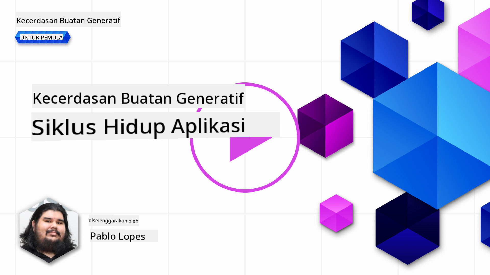
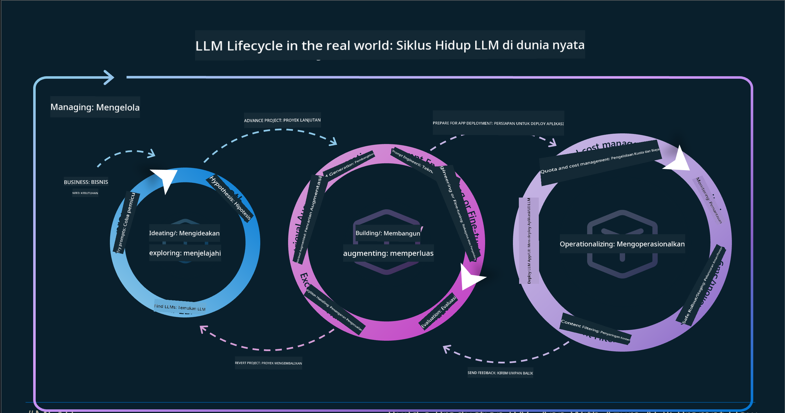
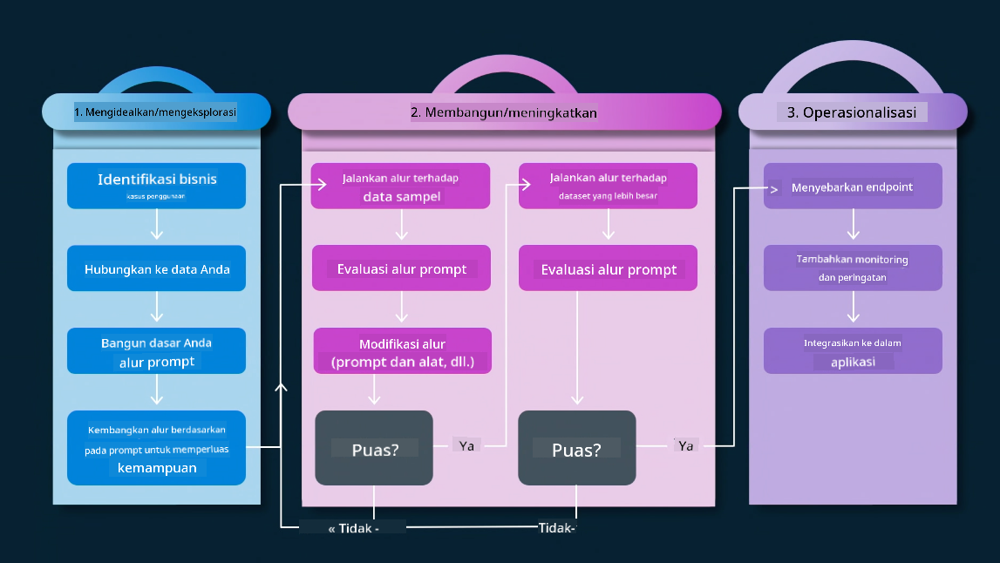
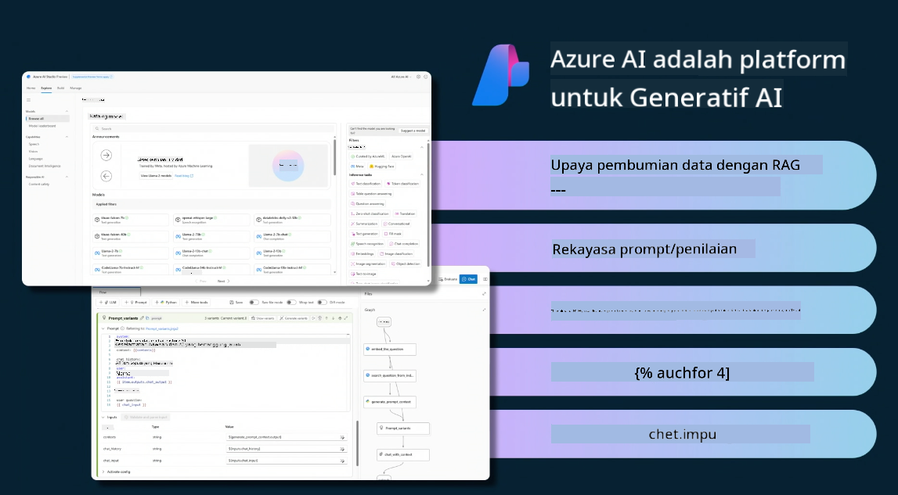
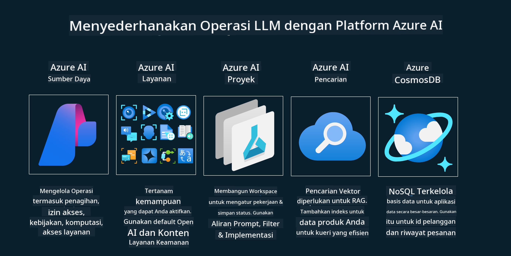
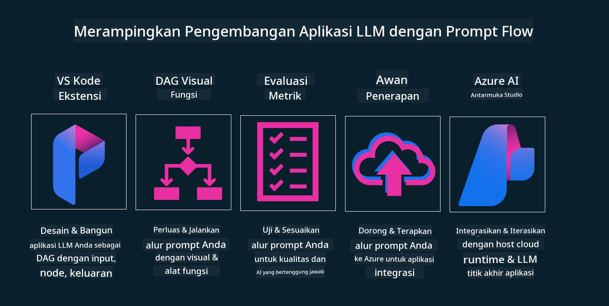

<!--
CO_OP_TRANSLATOR_METADATA:
{
  "original_hash": "27a5347a5022d5ef0a72ab029b03526a",
  "translation_date": "2025-05-19T23:31:41+00:00",
  "source_file": "14-the-generative-ai-application-lifecycle/README.md",
  "language_code": "id"
}
-->

# Siklus Hidup Aplikasi AI Generatif

Pertanyaan penting untuk semua aplikasi AI adalah relevansi fitur AI, karena AI adalah bidang yang berkembang pesat, untuk memastikan aplikasi Anda tetap relevan, dapat diandalkan, dan kuat, Anda perlu memantau, mengevaluasi, dan meningkatkannya secara terus-menerus. Di sinilah siklus hidup AI generatif berperan.

Siklus hidup AI generatif adalah kerangka kerja yang membimbing Anda melalui tahap pengembangan, penerapan, dan pemeliharaan aplikasi AI generatif. Ini membantu Anda mendefinisikan tujuan Anda, mengukur kinerja Anda, mengidentifikasi tantangan Anda, dan menerapkan solusi Anda. Ini juga membantu Anda menyelaraskan aplikasi Anda dengan standar etika dan hukum dari domain Anda dan pemangku kepentingan Anda. Dengan mengikuti siklus hidup AI generatif, Anda dapat memastikan bahwa aplikasi Anda selalu memberikan nilai dan memuaskan pengguna Anda.

## Pengantar

Dalam bab ini, Anda akan:

- Memahami Perubahan Paradigma dari MLOps ke LLMOps
- Siklus Hidup LLM
- Alat Siklus Hidup
- Metrik dan Evaluasi Siklus Hidup

## Memahami Perubahan Paradigma dari MLOps ke LLMOps

LLM adalah alat baru dalam persenjataan Kecerdasan Buatan, mereka sangat kuat dalam tugas analisis dan generasi untuk aplikasi, namun kekuatan ini memiliki beberapa konsekuensi dalam cara kita menyederhanakan tugas AI dan Pembelajaran Mesin Klasik.

Dengan ini, kita memerlukan Paradigma baru untuk menyesuaikan alat ini secara dinamis, dengan insentif yang tepat. Kita dapat mengkategorikan aplikasi AI lama sebagai "Aplikasi ML" dan Aplikasi AI baru sebagai "Aplikasi GenAI" atau hanya "Aplikasi AI", mencerminkan teknologi dan teknik utama yang digunakan pada saat itu. Ini mengubah narasi kita dalam berbagai cara, lihat perbandingan berikut.

Perhatikan bahwa dalam LLMOps, kita lebih fokus pada Pengembang Aplikasi, menggunakan integrasi sebagai poin kunci, menggunakan "Models-as-a-Service" dan memikirkan poin-poin berikut untuk metrik.

- Kualitas: Kualitas respons
- Bahaya: AI yang Bertanggung Jawab
- Kejujuran: Dasar respons (Masuk akal? Apakah benar?)
- Biaya: Anggaran solusi
- Latensi: Waktu rata-rata untuk respons token

## Siklus Hidup LLM

Pertama, untuk memahami siklus hidup dan modifikasinya, mari kita perhatikan infografis berikut.

Seperti yang Anda perhatikan, ini berbeda dari Siklus Hidup biasa dari MLOps. LLM memiliki banyak persyaratan baru, seperti Prompting, teknik berbeda untuk meningkatkan kualitas (Fine-Tuning, RAG, Meta-Prompts), penilaian dan tanggung jawab berbeda dengan AI yang bertanggung jawab, terakhir, metrik evaluasi baru (Kualitas, Bahaya, Kejujuran, Biaya, dan Latensi).

Misalnya, lihat bagaimana kita mengideasi. Menggunakan rekayasa prompt untuk bereksperimen dengan berbagai LLM untuk mengeksplorasi kemungkinan untuk menguji apakah Hipotesis mereka bisa benar.

Perhatikan bahwa ini tidak linear, tetapi loop terintegrasi, iteratif, dan dengan siklus yang menyeluruh.

Bagaimana kita bisa mengeksplorasi langkah-langkah tersebut? Mari kita masuk ke detail tentang bagaimana kita bisa membangun siklus hidup.

Ini mungkin terlihat sedikit rumit, mari kita fokus pada tiga langkah besar terlebih dahulu.

1. Mengideasi/Mengeksplorasi: Eksplorasi, di sini kita dapat mengeksplorasi sesuai dengan kebutuhan bisnis kita. Pembuatan prototipe, membuat [PromptFlow](https://microsoft.github.io/promptflow/index.html?WT.mc_id=academic-105485-koreyst) dan menguji apakah cukup efisien untuk Hipotesis kita.
1. Membangun/Meningkatkan: Implementasi, sekarang, kita mulai mengevaluasi untuk dataset yang lebih besar menerapkan teknik, seperti Fine-tuning dan RAG, untuk memeriksa ketahanan solusi kita. Jika tidak, menerapkannya kembali, menambahkan langkah baru dalam alur kita atau merestrukturisasi data, mungkin membantu. Setelah menguji alur kita dan skala kita, jika berhasil dan memeriksa Metrik kita, itu siap untuk langkah berikutnya.
1. Mengoperasionalkan: Integrasi, sekarang menambahkan Sistem Pemantauan dan Peringatan ke sistem kita, penerapan dan integrasi aplikasi ke Aplikasi kita.

Kemudian, kita memiliki siklus menyeluruh Manajemen, berfokus pada keamanan, kepatuhan, dan tata kelola.

Selamat, sekarang Anda memiliki Aplikasi AI yang siap digunakan dan operasional. Untuk pengalaman langsung, lihat [Demo Obrolan Contoso.](https://nitya.github.io/contoso-chat/?WT.mc_id=academic-105485-koreys)

Sekarang, alat apa yang bisa kita gunakan?

## Alat Siklus Hidup

Untuk Alat, Microsoft menyediakan [Platform AI Azure](https://azure.microsoft.com/solutions/ai/?WT.mc_id=academic-105485-koreys) dan [PromptFlow](https://microsoft.github.io/promptflow/index.html?WT.mc_id=academic-105485-koreyst) memudahkan dan membuat siklus Anda mudah diimplementasikan dan siap digunakan.

[Platform AI Azure](https://azure.microsoft.com/solutions/ai/?WT.mc_id=academic-105485-koreys), memungkinkan Anda menggunakan [AI Studio](https://ai.azure.com/?WT.mc_id=academic-105485-koreys). AI Studio adalah portal web yang memungkinkan Anda menjelajahi model, sampel, dan alat. Mengelola sumber daya Anda, alur pengembangan UI dan opsi SDK/CLI untuk pengembangan Code-First.

AI Azure, memungkinkan Anda menggunakan berbagai sumber daya, untuk mengelola operasi, layanan, proyek, pencarian vektor, dan kebutuhan basis data Anda.

Membangun, dari Proof-of-Concept(POC) hingga aplikasi skala besar dengan PromptFlow:

- Merancang dan Membangun aplikasi dari VS Code, dengan alat visual dan fungsional
- Menguji dan menyempurnakan aplikasi Anda untuk AI berkualitas, dengan mudah.
- Gunakan Azure AI Studio untuk Mengintegrasikan dan Mengulangi dengan cloud, Push dan Deploy untuk integrasi cepat.

## Hebat! Lanjutkan Pembelajaran Anda!

Luar biasa, sekarang pelajari lebih lanjut tentang bagaimana kita menyusun aplikasi untuk menggunakan konsep dengan [Aplikasi Obrolan Contoso](https://nitya.github.io/contoso-chat/?WT.mc_id=academic-105485-koreyst), untuk melihat bagaimana Cloud Advocacy menambahkan konsep tersebut dalam demonstrasi. Untuk konten lebih lanjut, lihat [sesi breakout Ignite!](https://www.youtube.com/watch?v=DdOylyrTOWg)

Sekarang, lihat Pelajaran 15, untuk memahami bagaimana [Retrieval Augmented Generation dan Basis Data Vektor](../15-rag-and-vector-databases/README.md?WT.mc_id=academic-105485-koreyst) mempengaruhi AI Generatif dan membuat Aplikasi lebih menarik!

**Penafian**:  
Dokumen ini telah diterjemahkan menggunakan layanan terjemahan AI [Co-op Translator](https://github.com/Azure/co-op-translator). Meskipun kami berusaha untuk akurasi, harap disadari bahwa terjemahan otomatis mungkin mengandung kesalahan atau ketidakakuratan. Dokumen asli dalam bahasa aslinya harus dianggap sebagai sumber yang berwenang. Untuk informasi penting, disarankan untuk menggunakan terjemahan manusia profesional. Kami tidak bertanggung jawab atas kesalahpahaman atau penafsiran yang salah yang timbul dari penggunaan terjemahan ini.