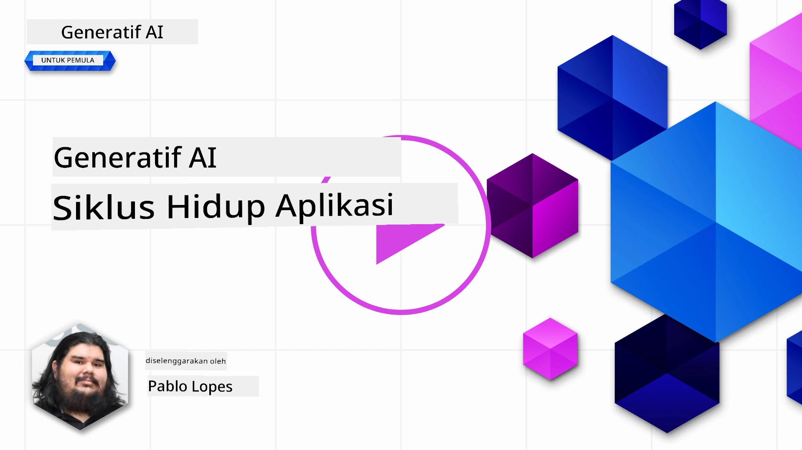
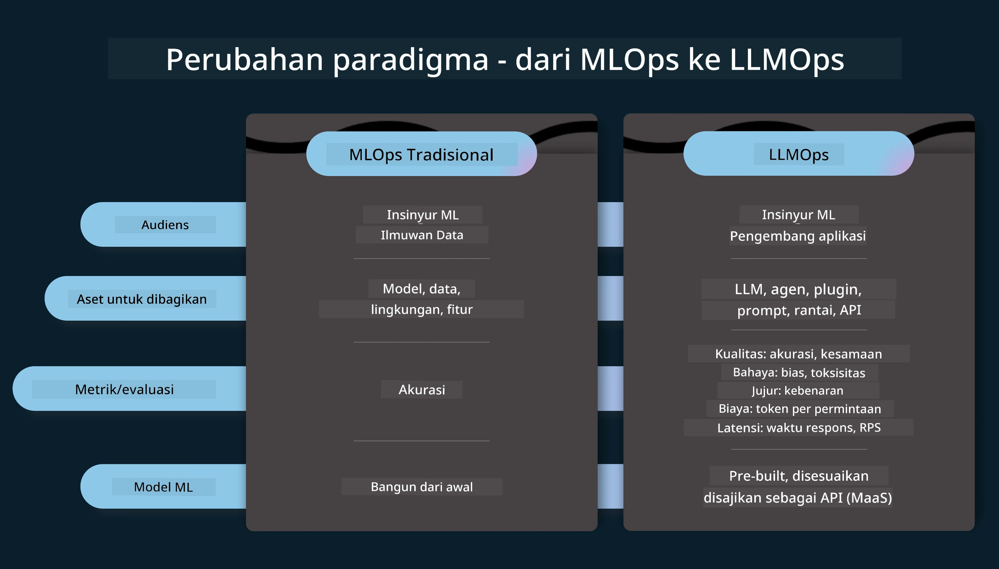
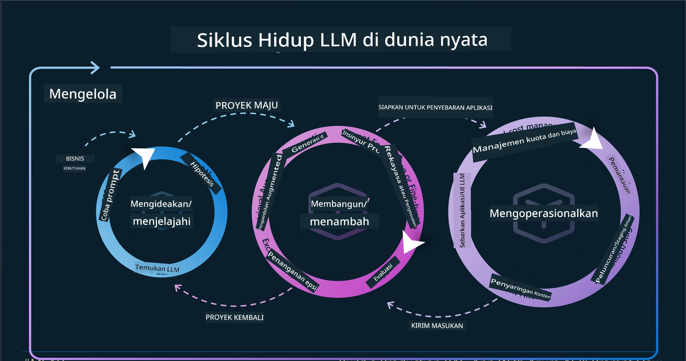
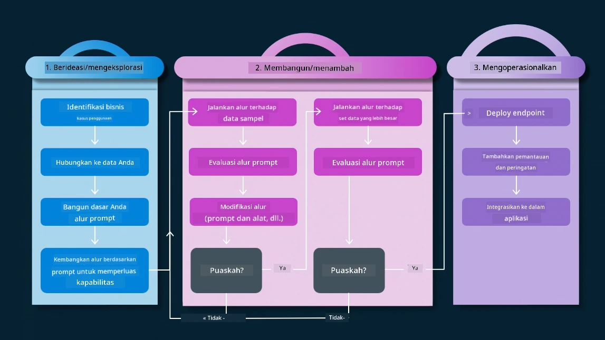
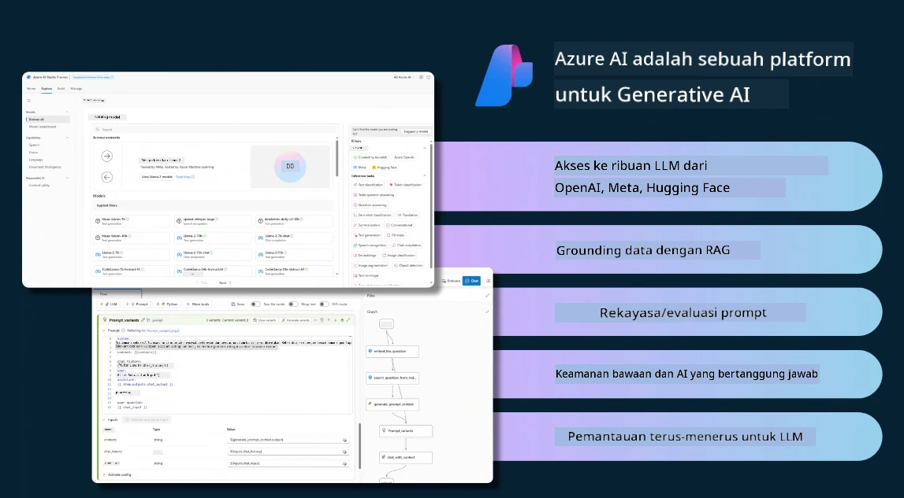
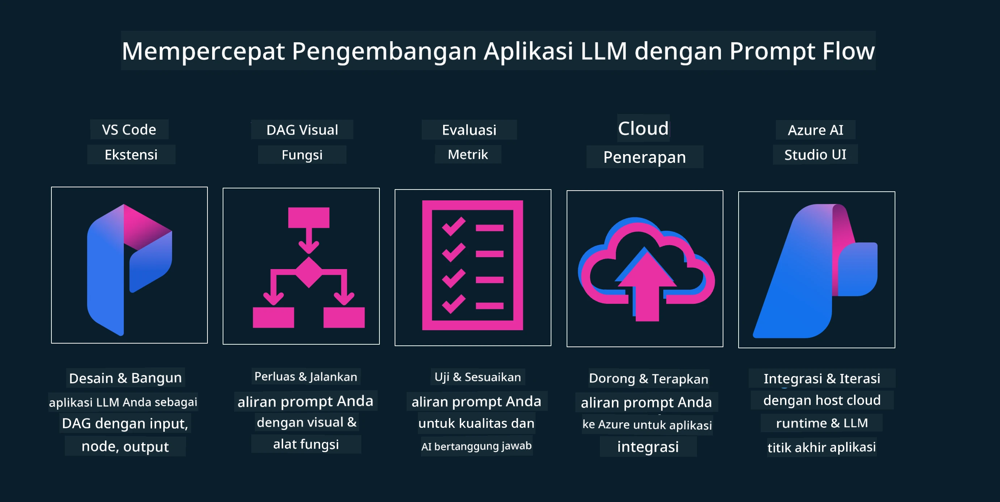

# Siklus Hidup Aplikasi AI Generatif

Pertanyaan penting untuk semua aplikasi AI adalah relevansi fitur AI, karena AI adalah bidang yang berkembang dengan cepat, untuk memastikan bahwa aplikasi Anda tetap relevan, dapat diandalkan, dan kuat, Anda perlu memantau, mengevaluasi, dan meningkatkannya secara berkelanjutan. Di sinilah siklus hidup AI generatif berperan.

Siklus hidup AI generatif adalah sebuah kerangka kerja yang membimbing Anda melalui tahap-tahap mengembangkan, menerapkan, dan memelihara aplikasi AI generatif. Ini membantu Anda mendefinisikan tujuan, mengukur performa, mengidentifikasi tantangan, dan mengimplementasikan solusi Anda. Ini juga membantu Anda menyesuaikan aplikasi Anda dengan standar etika dan hukum di domain dan stakeholder Anda. Dengan mengikuti siklus hidup AI generatif, Anda bisa memastikan aplikasi Anda selalu memberikan nilai dan memuaskan pengguna.

## Pendahuluan

Dalam bab ini, Anda akan:

- Memahami Pergeseran Paradigma dari MLOps ke LLMOps
- Siklus Hidup LLM
- Alat untuk Siklus Hidup
- Metritisasi dan Evaluasi Siklus Hidup

## Memahami Pergeseran Paradigma dari MLOps ke LLMOps

LLM adalah alat baru dalam arsenal Kecerdasan Buatan, mereka sangat kuat dalam tugas analisis dan generasi untuk aplikasi, namun kekuatan ini memiliki beberapa konsekuensi dalam cara kita menyederhanakan tugas AI dan Pembelajaran Mesin Klasik.

Dengan ini, kita membutuhkan Paradigma baru untuk mengadaptasi alat ini secara dinamis, dengan insentif yang tepat. Kita bisa mengkategorikan aplikasi AI lama sebagai "Aplikasi ML" dan aplikasi AI baru sebagai "Aplikasi GenAI" atau cukup "Aplikasi AI", mencerminkan teknologi dan teknik utama yang digunakan pada waktu itu. Ini menggeser narasi kita dalam berbagai cara, lihat perbandingan berikut.

Perhatikan bahwa dalam LLMOps, kita lebih fokus pada Pengembang Aplikasi, menggunakan integrasi sebagai titik kunci, memakai "Model-sebagai-Layanan" dan memikirkan poin-poin berikut untuk metrik.

- Kualitas: Kualitas respons
- Bahaya: AI yang bertanggung jawab
- Kejujuran: Ketepatan respons (Masuk akal? Apakah benar?)
- Biaya: Anggaran solusi
- Latensi: Rata-rata waktu untuk respons token

## Siklus Hidup LLM

Pertama, untuk memahami siklus hidup dan modifikasinya, mari perhatikan infografis berikut.

Seperti yang mungkin Anda perhatikan, ini berbeda dari Siklus Hidup biasa di MLOps. LLM memiliki banyak kebutuhan baru, seperti Prompting, teknik berbeda untuk meningkatkan kualitas (Fine-Tuning, RAG, Meta-Prompts), penilaian dan tanggung jawab berbeda dengan AI yang bertanggung jawab, terakhir, metrik evaluasi baru (Kualitas, Bahaya, Kejujuran, Biaya, dan Latensi).

Misalnya, lihat bagaimana kita mengideakan. Menggunakan rekayasa prompt untuk bereksperimen dengan berbagai LLM guna mengeksplorasi kemungkinan untuk menguji apakah Hipotesis mereka bisa benar.

Perhatikan bahwa ini bukan linier, melainkan loop terintegrasi, iteratif dan dengan siklus menyeluruh.

Bagaimana kita bisa menjelajahi langkah-langkah tersebut? Mari kita uraikan bagaimana kita bisa membangun siklus hidup.

Ini mungkin tampak agak rumit, mari fokus dulu pada tiga langkah besar.

1. Ideasi/Eksplorasi: Eksplorasi, di sini kita dapat menjelajah sesuai kebutuhan bisnis kita. Prototipe, membuat [PromptFlow](https://microsoft.github.io/promptflow/index.html?WT.mc_id=academic-105485-koreyst) dan menguji apakah cukup efisien untuk Hipotesis kita.
1. Membangun/Meningkatkan: Implementasi, sekarang, kita mulai mengevaluasi dataset yang lebih besar, menerapkan teknik seperti Fine-tuning dan RAG, untuk memeriksa kekokohan solusi kita. Jika tidak berhasil, mengimplementasikan ulang, menambahkan langkah baru di alur atau merestrukturisasi data, mungkin membantu. Setelah menguji alur dan skala kita, jika berhasil dan memeriksa Metrik, siap untuk langkah berikutnya.
1. Mengoperasionalkan: Integrasi, sekarang menambahkan Sistem Pemantauan dan Peringatan ke sistem kita, penerapan, dan integrasi aplikasi ke aplikasi kita.

Kemudian, kita memiliki siklus menyeluruh Manajemen, berfokus pada keamanan, kepatuhan, dan tata kelola.

Selamat, sekarang aplikasi AI Anda siap digunakan dan beroperasi. Untuk pengalaman langsung, lihat [Demo Chat Contoso.](https://nitya.github.io/contoso-chat/?WT.mc_id=academic-105485-koreyst)

Sekarang, alat apa yang bisa kita gunakan?

## Alat Siklus Hidup

Untuk alat, Microsoft menyediakan [Azure AI Platform](https://azure.microsoft.com/solutions/ai/?WT.mc_id=academic-105485-koreyst) dan [PromptFlow](https://microsoft.github.io/promptflow/index.html?WT.mc_id=academic-105485-koreyst) yang memudahkan dan membuat siklus Anda lebih mudah diterapkan dan siap digunakan.

[Azure AI Platform](https://azure.microsoft.com/solutions/ai/?WT.mc_id=academic-105485-koreyst), memungkinkan Anda menggunakan [AI Studio](https://ai.azure.com/?WT.mc_id=academic-105485-koreyst). AI Studio adalah portal web yang memungkinkan Anda Menjelajah model, contoh, dan alat. Mengelola sumber daya Anda, alur pengembangan UI dan opsi SDK/CLI untuk pengembangan Berbasis Kode.

Azure AI memungkinkan Anda menggunakan berbagai sumber daya, mengelola operasi, layanan, proyek, pencarian vektor, dan kebutuhan database.

Construct, dari Proof-of-Concept (POC) hingga aplikasi skala besar dengan PromptFlow:

- Merancang dan Membangun aplikasi dari VS Code, dengan alat visual dan fungsional
- Menguji dan menyetel aplikasi Anda untuk AI berkualitas, dengan mudah.
- Menggunakan Azure AI Studio untuk Integrasi dan Iterasi dengan cloud, Push dan Deploy untuk integrasi cepat.

## Hebat! Lanjutkan Pembelajaran Anda!

Luar biasa, sekarang pelajari lebih lanjut tentang bagaimana kita menyusun aplikasi untuk menggunakan konsep dengan [Contoso Chat App](https://nitya.github.io/contoso-chat/?WT.mc_id=academic-105485-koreyst), untuk melihat bagaimana Cloud Advocacy menambahkan konsep tersebut dalam demonstrasi. Untuk lebih banyak konten, lihat sesi breakout [Ignite kami!
](https://www.youtube.com/watch?v=DdOylyrTOWg)

Sekarang, lihat Pelajaran 15, untuk memahami bagaimana [Retrieval Augmented Generation dan Database Vektor](../15-rag-and-vector-databases/README.md?WT.mc_id=academic-105485-koreyst) memengaruhi AI Generatif dan membuat Aplikasi lebih menarik!

---

<!-- CO-OP TRANSLATOR DISCLAIMER START -->
**Penafian**:  
Dokumen ini telah diterjemahkan menggunakan layanan terjemahan AI [Co-op Translator](https://github.com/Azure/co-op-translator). Meskipun kami berusaha mencapai tingkat akurasi yang tinggi, harap diingat bahwa terjemahan otomatis dapat mengandung kesalahan atau ketidakakuratan. Dokumen asli dalam bahasa aslinya harus dianggap sebagai sumber yang sahih. Untuk informasi penting, disarankan menggunakan terjemahan oleh penerjemah manusia profesional. Kami tidak bertanggung jawab atas kesalahpahaman atau interpretasi keliru yang timbul dari penggunaan terjemahan ini.
<!-- CO-OP TRANSLATOR DISCLAIMER END -->