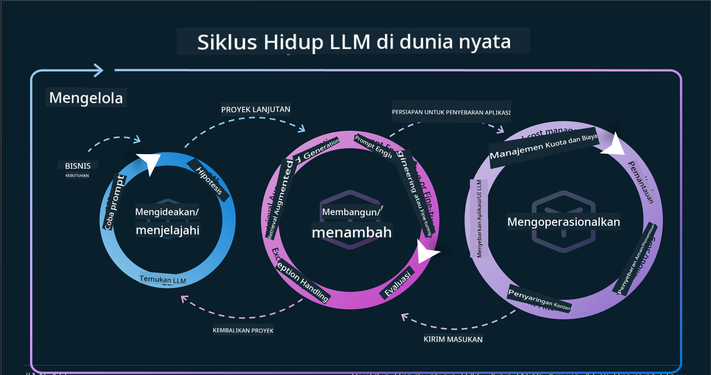
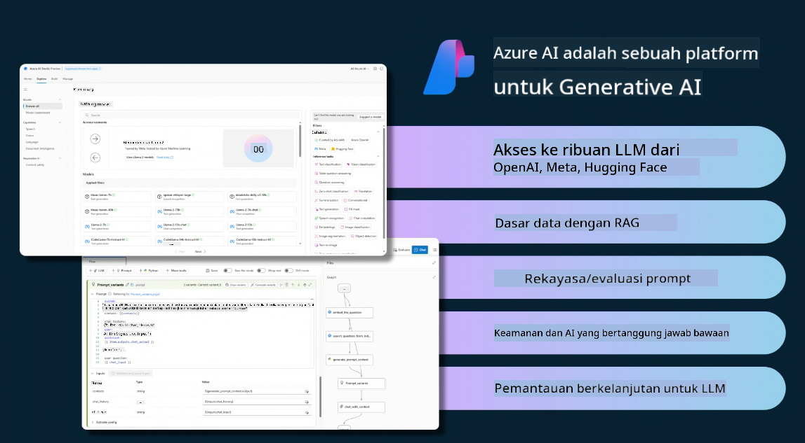
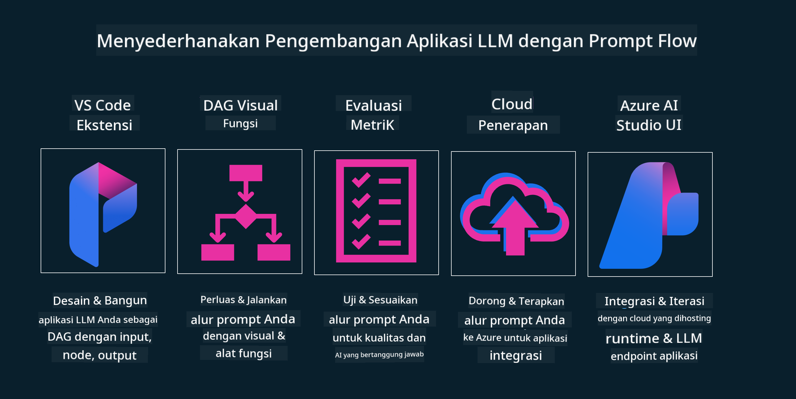

<!--
CO_OP_TRANSLATOR_METADATA:
{
  "original_hash": "27a5347a5022d5ef0a72ab029b03526a",
  "translation_date": "2025-07-09T15:56:27+00:00",
  "source_file": "14-the-generative-ai-application-lifecycle/README.md",
  "language_code": "id"
}
-->

# Siklus Hidup Aplikasi Generative AI

Pertanyaan penting untuk semua aplikasi AI adalah relevansi fitur AI, karena AI adalah bidang yang berkembang sangat cepat, untuk memastikan aplikasi Anda tetap relevan, andal, dan kuat, Anda perlu memantau, mengevaluasi, dan terus meningkatkannya. Di sinilah siklus hidup generative AI berperan.

Siklus hidup generative AI adalah kerangka kerja yang membimbing Anda melalui tahap-tahap pengembangan, penerapan, dan pemeliharaan aplikasi generative AI. Ini membantu Anda mendefinisikan tujuan, mengukur kinerja, mengidentifikasi tantangan, dan menerapkan solusi. Selain itu, membantu Anda menyelaraskan aplikasi dengan standar etika dan hukum di domain serta pemangku kepentingan Anda. Dengan mengikuti siklus hidup generative AI, Anda dapat memastikan aplikasi Anda selalu memberikan nilai dan memuaskan pengguna.

## Pendahuluan

Dalam bab ini, Anda akan:

- Memahami Pergeseran Paradigma dari MLOps ke LLMOps  
- Siklus Hidup LLM  
- Alat Siklus Hidup  
- Metrifikasi dan Evaluasi Siklus Hidup  

## Memahami Pergeseran Paradigma dari MLOps ke LLMOps

LLM adalah alat baru dalam arsenal Kecerdasan Buatan, mereka sangat kuat dalam tugas analisis dan generasi untuk aplikasi, namun kekuatan ini membawa konsekuensi dalam cara kita menyederhanakan tugas AI dan Machine Learning Klasik.

Dengan ini, kita membutuhkan Paradigma baru untuk mengadaptasi alat ini secara dinamis, dengan insentif yang tepat. Kita dapat mengkategorikan aplikasi AI lama sebagai "ML Apps" dan aplikasi AI baru sebagai "GenAI Apps" atau hanya "AI Apps", mencerminkan teknologi dan teknik utama yang digunakan pada saat itu. Ini mengubah narasi kita dalam berbagai cara, lihat perbandingan berikut.

Perhatikan bahwa dalam LLMOps, kita lebih fokus pada Pengembang Aplikasi, menggunakan integrasi sebagai titik kunci, menggunakan "Models-as-a-Service" dan memikirkan poin-poin berikut untuk metrik.

- Kualitas: Kualitas respons  
- Bahaya: AI yang bertanggung jawab  
- Kejujuran: Dasar respons (Masuk akal? Apakah benar?)  
- Biaya: Anggaran solusi  
- Latensi: Rata-rata waktu respons token  

## Siklus Hidup LLM

Pertama, untuk memahami siklus hidup dan modifikasinya, perhatikan infografis berikut.

Seperti yang Anda lihat, ini berbeda dari Siklus Hidup MLOps biasa. LLM memiliki banyak kebutuhan baru, seperti Prompting, teknik berbeda untuk meningkatkan kualitas (Fine-Tuning, RAG, Meta-Prompts), penilaian dan tanggung jawab berbeda dengan AI yang bertanggung jawab, serta metrik evaluasi baru (Kualitas, Bahaya, Kejujuran, Biaya, dan Latensi).

Misalnya, lihat bagaimana kita beride. Menggunakan rekayasa prompt untuk bereksperimen dengan berbagai LLM guna mengeksplorasi kemungkinan dan menguji apakah Hipotesis mereka bisa benar.

Perlu dicatat bahwa ini bukan proses linier, melainkan loop terintegrasi, iteratif, dan dengan siklus menyeluruh.

Bagaimana kita bisa mengeksplorasi langkah-langkah tersebut? Mari kita lihat lebih detail bagaimana membangun siklus hidup.

Ini mungkin terlihat agak rumit, mari fokus dulu pada tiga langkah besar.

1. Ideasi/Eksplorasi: Eksplorasi, di sini kita bisa menjelajah sesuai kebutuhan bisnis. Membuat prototipe, membuat [PromptFlow](https://microsoft.github.io/promptflow/index.html?WT.mc_id=academic-105485-koreyst) dan menguji apakah cukup efisien untuk Hipotesis kita.  
1. Membangun/Meningkatkan: Implementasi, sekarang kita mulai mengevaluasi untuk dataset yang lebih besar, menerapkan teknik seperti Fine-tuning dan RAG, untuk memeriksa ketangguhan solusi kita. Jika tidak berhasil, mengimplementasikan ulang, menambahkan langkah baru dalam alur, atau merestrukturisasi data mungkin membantu. Setelah menguji alur dan skala, jika berhasil dan metrik terpenuhi, siap untuk langkah berikutnya.  
1. Operasionalisasi: Integrasi, sekarang menambahkan Sistem Pemantauan dan Peringatan ke sistem, penerapan, dan integrasi aplikasi ke Aplikasi kita.  

Kemudian, ada siklus menyeluruh Manajemen, yang fokus pada keamanan, kepatuhan, dan tata kelola.

Selamat, sekarang aplikasi AI Anda siap digunakan dan beroperasi. Untuk pengalaman langsung, lihat [Demo Chat Contoso.](https://nitya.github.io/contoso-chat/?WT.mc_id=academic-105485-koreys)

Sekarang, alat apa yang bisa kita gunakan?

## Alat Siklus Hidup

Untuk alat, Microsoft menyediakan [Azure AI Platform](https://azure.microsoft.com/solutions/ai/?WT.mc_id=academic-105485-koreys) dan [PromptFlow](https://microsoft.github.io/promptflow/index.html?WT.mc_id=academic-105485-koreyst) yang memudahkan dan membuat siklus Anda mudah diimplementasikan dan siap digunakan.

[Azure AI Platform](https://azure.microsoft.com/solutions/ai/?WT.mc_id=academic-105485-koreys) memungkinkan Anda menggunakan [AI Studio](https://ai.azure.com/?WT.mc_id=academic-105485-koreys). AI Studio adalah portal web yang memungkinkan Anda menjelajahi model, contoh, dan alat. Mengelola sumber daya, alur pengembangan UI, dan opsi SDK/CLI untuk pengembangan Code-First.

Azure AI memungkinkan Anda menggunakan berbagai sumber daya untuk mengelola operasi, layanan, proyek, pencarian vektor, dan kebutuhan basis data Anda.

Construct, dari Proof-of-Concept (POC) hingga aplikasi skala besar dengan PromptFlow:

- Merancang dan membangun aplikasi dari VS Code, dengan alat visual dan fungsional  
- Menguji dan menyempurnakan aplikasi Anda untuk AI berkualitas, dengan mudah.  
- Gunakan Azure AI Studio untuk Integrasi dan Iterasi dengan cloud, Push dan Deploy untuk integrasi cepat.  

## Bagus! Lanjutkan Pembelajaran Anda!

Luar biasa, sekarang pelajari lebih lanjut tentang bagaimana kita menyusun aplikasi untuk menggunakan konsep-konsep ini dengan [Contoso Chat App](https://nitya.github.io/contoso-chat/?WT.mc_id=academic-105485-koreyst), untuk melihat bagaimana Cloud Advocacy menambahkan konsep tersebut dalam demonstrasi. Untuk konten lebih lanjut, lihat sesi breakout [Ignite!](https://www.youtube.com/watch?v=DdOylyrTOWg)

Sekarang, lihat Pelajaran 15, untuk memahami bagaimana [Retrieval Augmented Generation dan Vector Databases](../15-rag-and-vector-databases/README.md?WT.mc_id=academic-105485-koreyst) memengaruhi Generative AI dan membuat Aplikasi lebih menarik!

**Penafian**:  
Dokumen ini telah diterjemahkan menggunakan layanan terjemahan AI [Co-op Translator](https://github.com/Azure/co-op-translator). Meskipun kami berupaya untuk mencapai akurasi, harap diperhatikan bahwa terjemahan otomatis mungkin mengandung kesalahan atau ketidakakuratan. Dokumen asli dalam bahasa aslinya harus dianggap sebagai sumber yang sahih. Untuk informasi penting, disarankan menggunakan terjemahan profesional oleh manusia. Kami tidak bertanggung jawab atas kesalahpahaman atau penafsiran yang keliru yang timbul dari penggunaan terjemahan ini.