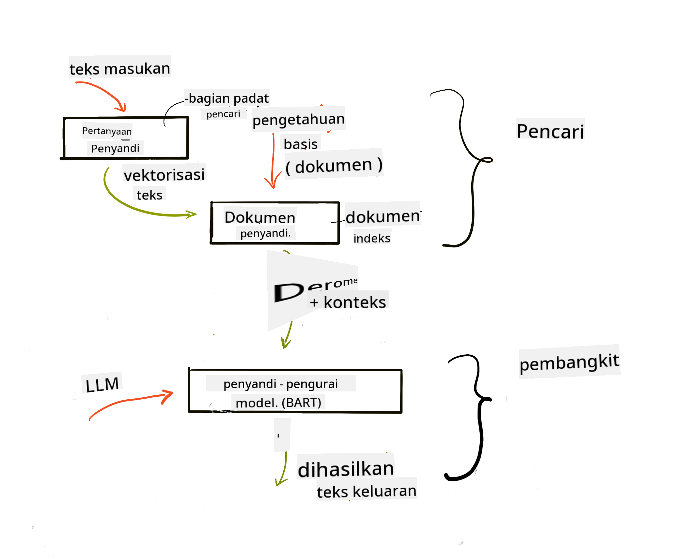
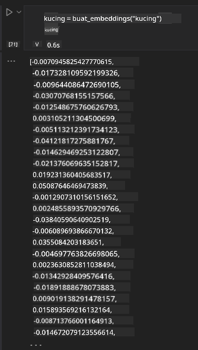

<!--
CO_OP_TRANSLATOR_METADATA:
{
  "original_hash": "e2861bbca91c0567ef32bc77fe054f9e",
  "translation_date": "2025-05-20T01:36:59+00:00",
  "source_file": "15-rag-and-vector-databases/README.md",
  "language_code": "id"
}
-->
# Retrieval Augmented Generation (RAG) dan Basis Data Vektor

[](https://aka.ms/gen-ai-lesson15-gh?WT.mc_id=academic-105485-koreyst)

Dalam pelajaran aplikasi pencarian, kita telah mempelajari secara singkat cara mengintegrasikan data Anda sendiri ke dalam Model Bahasa Besar (LLMs). Dalam pelajaran ini, kita akan membahas lebih dalam konsep penambatan data Anda dalam aplikasi LLM, mekanisme proses dan metode penyimpanan data, termasuk embedding dan teks.

> **Video Coming Soon**

## Pendahuluan

Dalam pelajaran ini kita akan membahas:

- Pengenalan RAG, apa itu dan mengapa digunakan dalam AI (kecerdasan buatan).

- Memahami apa itu basis data vektor dan membuatnya untuk aplikasi kita.

- Contoh praktis tentang cara mengintegrasikan RAG ke dalam aplikasi.

## Tujuan Pembelajaran

Setelah menyelesaikan pelajaran ini, Anda akan dapat:

- Menjelaskan pentingnya RAG dalam pengambilan dan pemrosesan data.

- Menyiapkan aplikasi RAG dan menambatkan data Anda ke LLM

- Integrasi efektif RAG dan Basis Data Vektor dalam Aplikasi LLM.

## Skenario Kami: meningkatkan LLM kami dengan data kami sendiri

Untuk pelajaran ini, kami ingin menambahkan catatan kami sendiri ke dalam startup pendidikan, yang memungkinkan chatbot mendapatkan lebih banyak informasi tentang berbagai subjek. Dengan menggunakan catatan yang kami miliki, pelajar akan dapat belajar lebih baik dan memahami berbagai topik, membuatnya lebih mudah untuk merevisi untuk ujian mereka. Untuk membuat skenario kami, kami akan menggunakan:

- `Azure OpenAI:` LLM yang akan kita gunakan untuk membuat chatbot kita

- `AI for beginners' lesson on Neural Networks`: ini akan menjadi data yang kita tambatkan pada LLM kita

- `Azure AI Search` dan `Azure Cosmos DB:` basis data vektor untuk menyimpan data kita dan membuat indeks pencarian

Pengguna akan dapat membuat kuis latihan dari catatan mereka, kartu kilat revisi dan meringkasnya menjadi ringkasan yang ringkas. Untuk memulai, mari kita lihat apa itu RAG dan bagaimana cara kerjanya:

## Retrieval Augmented Generation (RAG)

Chatbot yang didukung LLM memproses permintaan pengguna untuk menghasilkan respons. Ini dirancang untuk menjadi interaktif dan berinteraksi dengan pengguna dalam berbagai topik. Namun, responsnya terbatas pada konteks yang diberikan dan data pelatihan dasarnya. Misalnya, batas pengetahuan GPT-4 adalah September 2021, artinya, ia tidak memiliki pengetahuan tentang peristiwa yang terjadi setelah periode ini. Selain itu, data yang digunakan untuk melatih LLM tidak termasuk informasi rahasia seperti catatan pribadi atau manual produk perusahaan.

### Bagaimana cara kerja RAGs (Retrieval Augmented Generation)


Misalkan Anda ingin menerapkan chatbot yang membuat kuis dari catatan Anda, Anda akan memerlukan koneksi ke basis pengetahuan. Di sinilah RAG datang untuk menyelamatkan. RAGs beroperasi sebagai berikut:

- **Basis pengetahuan:** Sebelum pengambilan, dokumen-dokumen ini perlu diambil dan diproses terlebih dahulu, biasanya memecah dokumen besar menjadi potongan-potongan kecil, mengubahnya menjadi embedding teks dan menyimpannya dalam basis data.

- **Permintaan pengguna:** pengguna mengajukan pertanyaan

- **Pengambilan:** Ketika pengguna mengajukan pertanyaan, model embedding mengambil informasi yang relevan dari basis pengetahuan kita untuk memberikan lebih banyak konteks yang akan dimasukkan ke dalam permintaan.

- **Augmented Generation:** LLM meningkatkan responsnya berdasarkan data yang diambil. Ini memungkinkan respons yang dihasilkan tidak hanya berdasarkan data yang telah dilatih sebelumnya tetapi juga informasi yang relevan dari konteks yang ditambahkan. Data yang diambil digunakan untuk memperkuat respons LLM. LLM kemudian mengembalikan jawaban atas pertanyaan pengguna.



Arsitektur untuk RAGs diimplementasikan menggunakan transformer yang terdiri dari dua bagian: encoder dan decoder. Misalnya, ketika pengguna mengajukan pertanyaan, teks input 'dikodekan' ke dalam vektor yang menangkap makna kata-kata dan vektor 'didekodekan' ke dalam indeks dokumen kita dan menghasilkan teks baru berdasarkan permintaan pengguna. LLM menggunakan model encoder-decoder untuk menghasilkan output.

Dua pendekatan saat mengimplementasikan RAG menurut makalah yang diusulkan: [Retrieval-Augmented Generation for Knowledge intensive NLP (natural language processing software) Tasks](https://arxiv.org/pdf/2005.11401.pdf?WT.mc_id=academic-105485-koreyst) adalah:

- **_RAG-Sequence_** menggunakan dokumen yang diambil untuk memprediksi jawaban terbaik untuk pertanyaan pengguna

- **RAG-Token** menggunakan dokumen untuk menghasilkan token berikutnya, kemudian mengambilnya untuk menjawab pertanyaan pengguna

### Mengapa Anda menggunakan RAGs?

- **Kekayaan informasi:** memastikan respons teks terkini dan terbaru. Oleh karena itu, meningkatkan kinerja pada tugas-tugas khusus domain dengan mengakses basis pengetahuan internal.

- Mengurangi fabrikasi dengan menggunakan **data yang dapat diverifikasi** dalam basis pengetahuan untuk memberikan konteks pada pertanyaan pengguna.

- Ini **hemat biaya** karena lebih ekonomis dibandingkan dengan menyempurnakan LLM

## Membuat basis pengetahuan

Aplikasi kami didasarkan pada data pribadi kami yaitu, pelajaran Jaringan Syaraf pada kurikulum AI Untuk Pemula.

### Basis Data Vektor

Basis data vektor, tidak seperti basis data tradisional, adalah basis data khusus yang dirancang untuk menyimpan, mengelola, dan mencari vektor yang tertanam. Ini menyimpan representasi numerik dari dokumen. Memecah data menjadi embedding numerik membuatnya lebih mudah bagi sistem AI kita untuk memahami dan memproses data.

Kami menyimpan embedding kami dalam basis data vektor karena LLM memiliki batas jumlah token yang mereka terima sebagai input. Karena Anda tidak dapat melewatkan seluruh embedding ke LLM, kami perlu memecahnya menjadi potongan-potongan dan ketika pengguna mengajukan pertanyaan, embedding yang paling mirip dengan pertanyaan akan dikembalikan bersama dengan permintaan. Chunking juga mengurangi biaya pada jumlah token yang dilewatkan melalui LLM.

Beberapa basis data vektor populer termasuk Azure Cosmos DB, Clarifyai, Pinecone, Chromadb, ScaNN, Qdrant dan DeepLake. Anda dapat membuat model Azure Cosmos DB menggunakan Azure CLI dengan perintah berikut:

```bash
az login
az group create -n <resource-group-name> -l <location>
az cosmosdb create -n <cosmos-db-name> -r <resource-group-name>
az cosmosdb list-keys -n <cosmos-db-name> -g <resource-group-name>
```

### Dari teks ke embedding

Sebelum kita menyimpan data kita, kita perlu mengonversinya menjadi embedding vektor sebelum disimpan dalam basis data. Jika Anda bekerja dengan dokumen besar atau teks panjang, Anda dapat memecahnya berdasarkan permintaan yang Anda harapkan. Chunking dapat dilakukan pada tingkat kalimat, atau pada tingkat paragraf. Karena chunking mengambil makna dari kata-kata di sekitarnya, Anda dapat menambahkan beberapa konteks lain ke chunk, misalnya, dengan menambahkan judul dokumen atau menyertakan beberapa teks sebelum atau setelah chunk. Anda dapat memecah data sebagai berikut:

```python
def split_text(text, max_length, min_length):
    words = text.split()
    chunks = []
    current_chunk = []

    for word in words:
        current_chunk.append(word)
        if len(' '.join(current_chunk)) < max_length and len(' '.join(current_chunk)) > min_length:
            chunks.append(' '.join(current_chunk))
            current_chunk = []

    # If the last chunk didn't reach the minimum length, add it anyway
    if current_chunk:
        chunks.append(' '.join(current_chunk))

    return chunks
```

Setelah dipotong, kita kemudian dapat menyematkan teks kita menggunakan berbagai model embedding. Beberapa model yang dapat Anda gunakan termasuk: word2vec, ada-002 oleh OpenAI, Azure Computer Vision dan banyak lagi. Memilih model yang akan digunakan akan tergantung pada bahasa yang Anda gunakan, jenis konten yang dikodekan (teks/gambar/audio), ukuran input yang dapat dikodekan dan panjang output embedding.

Contoh teks yang disematkan menggunakan model `text-embedding-ada-002` dari OpenAI adalah:


## Pengambilan dan Pencarian Vektor

Ketika pengguna mengajukan pertanyaan, pengambil mengubahnya menjadi vektor menggunakan encoder permintaan, kemudian mencari melalui indeks pencarian dokumen kita untuk vektor yang relevan dalam dokumen yang terkait dengan input. Setelah selesai, ia mengonversi baik vektor input dan vektor dokumen menjadi teks dan melewatkannya melalui LLM.

### Pengambilan

Pengambilan terjadi ketika sistem mencoba dengan cepat menemukan dokumen dari indeks yang memenuhi kriteria pencarian. Tujuan pengambil adalah mendapatkan dokumen yang akan digunakan untuk memberikan konteks dan menambatkan LLM pada data Anda.

Ada beberapa cara untuk melakukan pencarian dalam basis data kita seperti:

- **Pencarian kata kunci** - digunakan untuk pencarian teks

- **Pencarian semantik** - menggunakan makna semantik dari kata-kata

- **Pencarian vektor** - mengonversi dokumen dari teks ke representasi vektor menggunakan model embedding. Pengambilan akan dilakukan dengan mengajukan dokumen yang representasi vektornya paling dekat dengan pertanyaan pengguna.

- **Hybrid** - kombinasi dari pencarian kata kunci dan pencarian vektor.

Tantangan dengan pengambilan muncul ketika tidak ada respons yang serupa dengan permintaan dalam basis data, sistem kemudian akan mengembalikan informasi terbaik yang dapat mereka dapatkan, namun, Anda dapat menggunakan taktik seperti menetapkan jarak maksimum untuk relevansi atau menggunakan pencarian hibrida yang menggabungkan pencarian kata kunci dan pencarian vektor. Dalam pelajaran ini kita akan menggunakan pencarian hibrida, kombinasi dari pencarian vektor dan kata kunci. Kami akan menyimpan data kami ke dalam dataframe dengan kolom yang berisi potongan-potongan serta embedding.

### Kesamaan Vektor

Pengambil akan mencari melalui basis pengetahuan untuk embedding yang dekat satu sama lain, tetangga terdekat, karena mereka adalah teks yang mirip. Dalam skenario pengguna mengajukan permintaan, itu pertama kali disematkan kemudian dicocokkan dengan embedding yang mirip. Pengukuran umum yang digunakan untuk menemukan seberapa mirip vektor yang berbeda adalah kesamaan kosinus yang didasarkan pada sudut antara dua vektor.

Kami dapat mengukur kesamaan menggunakan alternatif lain yang dapat kami gunakan adalah jarak Euclidean yang merupakan garis lurus antara titik akhir vektor dan produk dot yang mengukur jumlah produk elemen yang sesuai dari dua vektor.

### Indeks pencarian

Saat melakukan pengambilan, kita perlu membangun indeks pencarian untuk basis pengetahuan kita sebelum kita melakukan pencarian. Indeks akan menyimpan embedding kita dan dapat dengan cepat mengambil potongan yang paling mirip bahkan dalam basis data yang besar. Kita dapat membuat indeks kita secara lokal menggunakan:

```python
from sklearn.neighbors import NearestNeighbors

embeddings = flattened_df['embeddings'].to_list()

# Create the search index
nbrs = NearestNeighbors(n_neighbors=5, algorithm='ball_tree').fit(embeddings)

# To query the index, you can use the kneighbors method
distances, indices = nbrs.kneighbors(embeddings)
```

### Re-ranking

Setelah Anda mengajukan pertanyaan ke basis data, Anda mungkin perlu mengurutkan hasil dari yang paling relevan. LLM reranking memanfaatkan Pembelajaran Mesin untuk meningkatkan relevansi hasil pencarian dengan mengurutkannya dari yang paling relevan. Menggunakan Azure AI Search, reranking dilakukan secara otomatis untuk Anda menggunakan semantic reranker. Contoh cara kerja reranking menggunakan tetangga terdekat:

```python
# Find the most similar documents
distances, indices = nbrs.kneighbors([query_vector])

index = []
# Print the most similar documents
for i in range(3):
    index = indices[0][i]
    for index in indices[0]:
        print(flattened_df['chunks'].iloc[index])
        print(flattened_df['path'].iloc[index])
        print(flattened_df['distances'].iloc[index])
    else:
        print(f"Index {index} not found in DataFrame")
```

## Membawa semuanya bersama-sama

Langkah terakhir adalah menambahkan LLM kita ke dalam campuran untuk dapat mendapatkan respons yang ditambatkan pada data kita. Kita dapat mengimplementasikannya sebagai berikut:

```python
user_input = "what is a perceptron?"

def chatbot(user_input):
    # Convert the question to a query vector
    query_vector = create_embeddings(user_input)

    # Find the most similar documents
    distances, indices = nbrs.kneighbors([query_vector])

    # add documents to query  to provide context
    history = []
    for index in indices[0]:
        history.append(flattened_df['chunks'].iloc[index])

    # combine the history and the user input
    history.append(user_input)

    # create a message object
    messages=[
        {"role": "system", "content": "You are an AI assistant that helps with AI questions."},
        {"role": "user", "content": history[-1]}
    ]

    # use chat completion to generate a response
    response = openai.chat.completions.create(
        model="gpt-4",
        temperature=0.7,
        max_tokens=800,
        messages=messages
    )

    return response.choices[0].message

chatbot(user_input)
```

## Mengevaluasi aplikasi kita

### Metrik Evaluasi

- Kualitas respons yang diberikan memastikan terdengar alami, lancar, dan seperti manusia

- Keberadaan data: mengevaluasi apakah respons berasal dari dokumen yang disediakan

- Relevansi: mengevaluasi respons sesuai dan terkait dengan pertanyaan yang diajukan

- Kelancaran - apakah respons masuk akal secara tata bahasa

## Kasus Penggunaan untuk menggunakan RAG (Retrieval Augmented Generation) dan basis data vektor

Ada banyak kasus penggunaan berbeda di mana panggilan fungsi dapat meningkatkan aplikasi Anda seperti:

- Pertanyaan dan Jawaban: menambatkan data perusahaan Anda ke obrolan yang dapat digunakan oleh karyawan untuk mengajukan pertanyaan.

- Sistem Rekomendasi: di mana Anda dapat membuat sistem yang mencocokkan nilai-nilai yang paling mirip, misalnya, film, restoran, dan banyak lagi.

- Layanan chatbot: Anda dapat menyimpan riwayat obrolan dan mempersonalisasi percakapan berdasarkan data pengguna.

- Pencarian gambar berdasarkan embedding vektor, berguna saat melakukan pengenalan gambar dan deteksi anomali.

## Ringkasan

Kami telah membahas area fundamental RAG dari menambahkan data kami ke aplikasi, permintaan pengguna, dan output. Untuk menyederhanakan pembuatan RAG, Anda dapat menggunakan kerangka kerja seperti Semanti Kernel, Langchain, atau Autogen.

## Tugas

Untuk melanjutkan pembelajaran Retrieval Augmented Generation (RAG) Anda dapat membangun:

- Bangun front-end untuk aplikasi menggunakan kerangka kerja pilihan Anda

- Manfaatkan kerangka kerja, baik LangChain atau Semantic Kernel, dan buat ulang aplikasi Anda.

Selamat telah menyelesaikan pelajaran 👏.

## Pembelajaran tidak berhenti di sini, lanjutkan Perjalanan

Setelah menyelesaikan pelajaran ini, lihat [koleksi Pembelajaran AI Generatif](https://aka.ms/genai-collection?WT.mc_id=academic-105485-koreyst) kami untuk terus meningkatkan pengetahuan AI Generatif Anda!

**Penafian**:  
Dokumen ini telah diterjemahkan menggunakan layanan terjemahan AI [Co-op Translator](https://github.com/Azure/co-op-translator). Meskipun kami berusaha untuk akurasi, harap disadari bahwa terjemahan otomatis dapat mengandung kesalahan atau ketidakakuratan. Dokumen asli dalam bahasa aslinya harus dianggap sebagai sumber yang berwenang. Untuk informasi penting, disarankan menggunakan terjemahan manusia profesional. Kami tidak bertanggung jawab atas kesalahpahaman atau salah tafsir yang timbul dari penggunaan terjemahan ini.