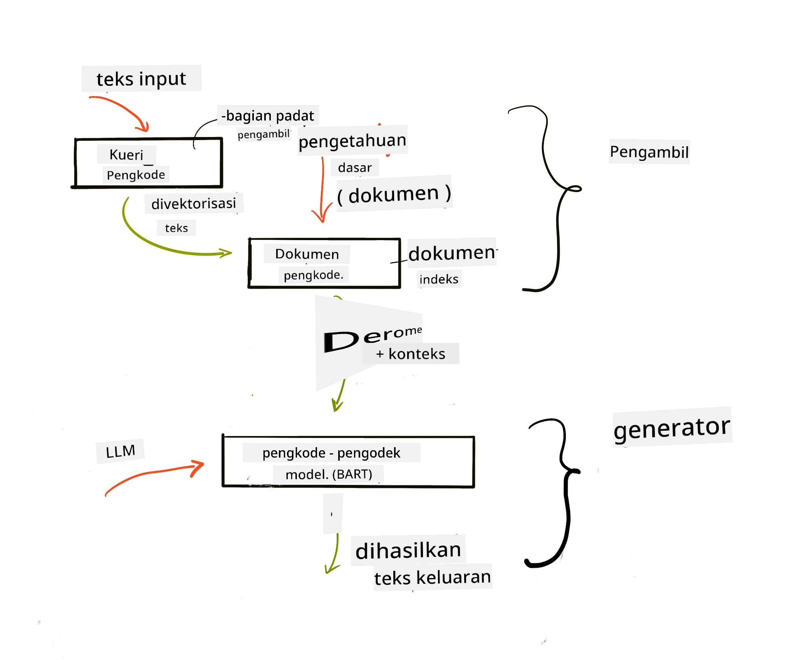

# Retrieval Augmented Generation (RAG) dan Database Vektor

[](https://youtu.be/4l8zhHUBeyI?si=BmvDmL1fnHtgQYkL)

Dalam pelajaran aplikasi pencarian, kita secara singkat mempelajari cara mengintegrasikan data Anda sendiri ke dalam Large Language Models (LLM). Dalam pelajaran ini, kita akan membahas lebih lanjut konsep grounding data Anda dalam aplikasi LLM, mekanisme proses, dan metode penyimpanan data, termasuk embedding maupun teks.

> **Video Segera Hadir**

## Pendahuluan

Dalam pelajaran ini kami akan membahas hal-hal berikut:

- Pengantar RAG, apa itu dan mengapa digunakan dalam AI (kecerdasan buatan).

- Memahami apa itu database vektor dan membuatnya untuk aplikasi kita.

- Contoh praktis cara mengintegrasikan RAG ke dalam sebuah aplikasi.

## Tujuan Pembelajaran

Setelah menyelesaikan pelajaran ini, Anda akan dapat:

- Menjelaskan pentingnya RAG dalam pengambilan dan pemrosesan data.

- Mengatur aplikasi RAG dan melakukan grounding data Anda ke LLM.

- Integrasi efektif RAG dan Database Vektor dalam Aplikasi LLM.

## Skema Kita: meningkatkan LLM kita dengan data sendiri

Untuk pelajaran ini, kita ingin menambahkan catatan kita sendiri ke startup pendidikan, yang memungkinkan chatbot mendapatkan informasi lebih banyak tentang berbagai subjek. Dengan menggunakan catatan yang kita miliki, pelajar akan dapat belajar lebih baik dan memahami berbagai topik, sehingga memudahkan revisi untuk ujian mereka. Untuk membuat skema ini, kita akan menggunakan:

- `Azure OpenAI:` LLM yang akan kita gunakan untuk membuat chatbot

- `Pelajaran AI untuk pemula tentang Neural Networks:` ini akan menjadi data yang kita ground-kan pada LLM kita

- `Azure AI Search` dan `Azure Cosmos DB:` database vektor untuk menyimpan data kita dan membuat indeks pencarian

Pengguna akan bisa membuat kuis latihan dari catatan mereka, kartu flash revisi, dan merangkumnya menjadi tinjauan singkat. Untuk memulai, mari kita lihat apa itu RAG dan bagaimana cara kerjanya:

## Retrieval Augmented Generation (RAG)

Chatbot yang didukung LLM memproses perintah pengguna untuk menghasilkan respons. Dirancang untuk interaktif dan berinteraksi dengan pengguna pada berbagai topik. Namun, responsnya terbatas pada konteks yang diberikan dan data pelatihan dasar. Misalnya, pengetahuan GPT-4 terhenti pada September 2021, artinya tidak mengetahui kejadian setelah periode tersebut. Selain itu, data yang digunakan untuk melatih LLM tidak termasuk informasi rahasia seperti catatan pribadi atau manual produk perusahaan.

### Cara kerja RAG (Retrieval Augmented Generation)


Misal Anda ingin mengerahkan chatbot yang membuat kuis dari catatan Anda, Anda akan memerlukan koneksi ke basis pengetahuan. Di sinilah RAG membantu. RAG bekerja sebagai berikut:

- **Basis pengetahuan:** Sebelum pengambilan, dokumen-dokumen ini perlu dimasukkan dan diproses terlebih dahulu, biasanya memecah dokumen besar menjadi potongan kecil, mengubahnya menjadi embedding teks, dan menyimpannya dalam database.

- **Pertanyaan Pengguna:** pengguna mengajukan pertanyaan

- **Pengambilan:** Ketika pengguna bertanya, model embedding mengambil informasi relevan dari basis pengetahuan untuk menyediakan konteks tambahan yang akan dimasukkan ke dalam prompt.

- **Generation yang Ditambah:** LLM memperbaiki respons berdasarkan data yang diambil. Ini memungkinkan respons yang dihasilkan tidak hanya berdasarkan data yang sudah dilatih tetapi juga informasi relevan dari konteks tambahan. Data yang diambil digunakan untuk menambah respons LLM. LLM kemudian memberikan jawaban atas pertanyaan pengguna.



Arsitektur RAG diimplementasikan menggunakan transformer yang terdiri dari dua bagian: encoder dan decoder. Contohnya, saat pengguna bertanya, teks input 'dienkode' menjadi vektor yang menangkap makna kata dan vektor tersebut 'didekode' ke indeks dokumen kita dan menghasilkan teks baru berdasarkan pertanyaan pengguna. LLM menggunakan model encoder-decoder untuk menghasilkan output.

Ada dua pendekatan saat mengimplementasikan RAG berdasarkan makalah yang diusulkan: [Retrieval-Augmented Generation for Knowledge intensive NLP (natural language processing software) Tasks](https://arxiv.org/pdf/2005.11401.pdf?WT.mc_id=academic-105485-koreyst):

- **_RAG-Sequence_** menggunakan dokumen yang diambil untuk memprediksi jawaban terbaik untuk pertanyaan pengguna

- **RAG-Token** menggunakan dokumen untuk menghasilkan token berikutnya, kemudian mengambilnya untuk menjawab pertanyaan pengguna

### Kenapa menggunakan RAG? 

- **Kaya informasi:** memastikan respons teks up to date dan terkini. Ini meningkatkan kinerja pada tugas domain spesifik dengan mengakses basis pengetahuan internal.

- Mengurangi pembuatan informasi palsu dengan memanfaatkan **data yang dapat diverifikasi** dalam basis pengetahuan untuk memberikan konteks pada pertanyaan pengguna.

- **Efisien biaya** karena lebih ekonomis dibandingkan melakukan fine-tuning pada LLM

## Membuat basis pengetahuan

Aplikasi kita didasarkan pada data pribadi kita yaitu pelajaran Neural Network pada kurikulum AI For Beginners.

### Database Vektor

Database vektor, berbeda dengan database tradisional, adalah database khusus yang dirancang untuk menyimpan, mengelola, dan mencari vektor embedded. Ia menyimpan representasi numerik dokumen. Memecah data menjadi embedding numerik memudahkan sistem AI kita untuk memahami dan memproses data.

Kita menyimpan embedding dalam database vektor karena LLM memiliki batas jumlah token yang bisa diterima sebagai input. Karena Anda tidak bisa melewatkan seluruh embedding ke LLM, kita perlu memecahnya menjadi potongan kecil dan saat pengguna bertanya, embedding yang paling relevan akan dikembalikan bersama dengan prompt. Pemotongan potongan (chunking) juga mengurangi biaya pada jumlah token yang diberikan ke LLM.

Beberapa database vektor populer termasuk Azure Cosmos DB, Clarifyai, Pinecone, Chromadb, ScaNN, Qdrant, dan DeepLake. Anda dapat membuat model Azure Cosmos DB menggunakan Azure CLI dengan perintah berikut:

```bash
az login
az group create -n <resource-group-name> -l <location>
az cosmosdb create -n <cosmos-db-name> -r <resource-group-name>
az cosmosdb list-keys -n <cosmos-db-name> -g <resource-group-name>
```

### Dari teks ke embedding

Sebelum menyimpan data, kita perlu mengubahnya menjadi vector embedding sebelum disimpan di database. Jika bekerja dengan dokumen besar atau teks panjang, Anda bisa memecahnya berdasarkan kueri yang diharapkan. Pemotongan bisa dilakukan pada level kalimat, atau paragraf. Karena pemotongan mendapatkan makna dari kata-kata di sekitarnya, Anda bisa menambahkan konteks lain ke sebuah potongan, misalnya dengan menambahkan judul dokumen atau termasuk beberapa teks sebelum atau sesudah potongan. Anda bisa memecah data sebagai berikut:

```python
def split_text(text, max_length, min_length):
    words = text.split()
    chunks = []
    current_chunk = []

    for word in words:
        current_chunk.append(word)
        if len(' '.join(current_chunk)) < max_length and len(' '.join(current_chunk)) > min_length:
            chunks.append(' '.join(current_chunk))
            current_chunk = []

    # Jika potongan terakhir tidak mencapai panjang minimum, tambahkan saja
    if current_chunk:
        chunks.append(' '.join(current_chunk))

    return chunks
```

Setelah dipotong, kita bisa melakukan embedding teks menggunakan model embedding yang berbeda. Beberapa model yang bisa Anda gunakan termasuk: word2vec, ada-002 oleh OpenAI, Azure Computer Vision dan banyak lagi. Pemilihan model tergantung bahasa yang digunakan, tipe konten yang dienkode (teks/gambar/audio), ukuran input yang bisa dienkode dan panjang output embedding.

Contoh embedding teks menggunakan model `text-embedding-ada-002` dari OpenAI adalah:


## Pengambilan dan Pencarian Vektor

Ketika pengguna mengajukan pertanyaan, retriever mengubahnya menjadi vektor menggunakan query encoder, lalu mencari melalui indeks pencarian dokumen kita untuk vektor terkait yang berhubungan dengan input. Setelah itu mengonversi vektor input dan vektor dokumen menjadi teks dan melewatkannya ke LLM.

### Pengambilan

Pengambilan terjadi ketika sistem mencoba dengan cepat menemukan dokumen dari indeks yang memenuhi kriteria pencarian. Tujuan retriever adalah mendapatkan dokumen yang akan digunakan untuk memberikan konteks dan melakukan grounding LLM pada data Anda.

Ada beberapa cara melakukan pencarian dalam database kita seperti:

- **Pencarian kata kunci** - digunakan untuk pencarian teks

- **Pencarian vektor** - mengubah dokumen dari teks ke representasi vektor menggunakan model embedding, memungkinkan **pencarian semantik** menggunakan makna kata. Pengambilan akan dilakukan dengan mencari dokumen yang representasi vektornya paling dekat dengan pertanyaan pengguna.

- **Hibrida** - gabungan pencarian kata kunci dan vektor.

Tantangan dengan pengambilan muncul ketika tidak ada respons serupa dengan kueri dalam database, sistem kemudian akan memberikan informasi terbaik yang bisa didapat, namun Anda bisa menggunakan taktik seperti menetapkan jarak maksimum untuk relevansi atau menggunakan pencarian hibrida yang menggabungkan kata kunci dan pencarian vektor. Dalam pelajaran ini kita akan menggunakan pencarian hibrida, gabungan pencarian vektor dan kata kunci. Kita akan menyimpan data ke dataframe dengan kolom yang berisi potongan serta embedding.

### Kesamaan Vektor

Retriever akan mencari di database pengetahuan embedding yang saling berdekatan, tetangga terdekat, karena mereka adalah teks yang mirip. Dalam skenario saat pengguna mengajukan kueri, kueri pertama di-embed lalu dicocokkan dengan embedding serupa. Ukuran umum yang digunakan untuk menemukan seberapa mirip vektor adalah cosine similarity yang berdasarkan sudut antara dua vektor.

Kita bisa mengukur kesamaan menggunakan alternatif lain seperti Euclidean distance yang merupakan garis lurus antara titik akhir vektor dan dot product yang mengukur jumlah dari hasil kali elemen yang sesuai dari dua vektor.

### Indeks pencarian

Saat melakukan pengambilan, kita perlu membangun indeks pencarian untuk basis pengetahuan sebelum melakukan pencarian. Indeks akan menyimpan embedding kita dan bisa dengan cepat mengambil potongan paling mirip meskipun di database besar. Kita bisa membuat indeks lokal menggunakan:

```python
from sklearn.neighbors import NearestNeighbors

embeddings = flattened_df['embeddings'].to_list()

# Buat indeks pencarian
nbrs = NearestNeighbors(n_neighbors=5, algorithm='ball_tree').fit(embeddings)

# Untuk menanyakan indeks, Anda dapat menggunakan metode kneighbors
distances, indices = nbrs.kneighbors(embeddings)
```

### Pengurutan ulang

Setelah meng-query database, Anda mungkin perlu mengurutkan hasil dari yang paling relevan. Reranking LLM menggunakan Machine Learning untuk meningkatkan relevansi hasil pencarian dengan mengurutkannya dari yang paling relevan. Menggunakan Azure AI Search, pengurutan ulang dilakukan otomatis menggunakan semantic reranker. Contoh bagaimana reranking bekerja menggunakan nearest neighbours:

```python
# Temukan dokumen yang paling mirip
distances, indices = nbrs.kneighbors([query_vector])

index = []
# Cetak dokumen yang paling mirip
for i in range(3):
    index = indices[0][i]
    for index in indices[0]:
        print(flattened_df['chunks'].iloc[index])
        print(flattened_df['path'].iloc[index])
        print(flattened_df['distances'].iloc[index])
    else:
        print(f"Index {index} not found in DataFrame")
```

## Menggabungkan semuanya

Langkah terakhir adalah menambahkan LLM kita dalam proses agar bisa mendapatkan respons yang didasarkan pada data kita. Bisa diimplementasikan sebagai berikut:

```python
user_input = "what is a perceptron?"

def chatbot(user_input):
    # Ubah pertanyaan menjadi vektor kueri
    query_vector = create_embeddings(user_input)

    # Temukan dokumen yang paling mirip
    distances, indices = nbrs.kneighbors([query_vector])

    # tambahkan dokumen ke kueri untuk memberikan konteks
    history = []
    for index in indices[0]:
        history.append(flattened_df['chunks'].iloc[index])

    # gabungkan riwayat dan input pengguna
    history.append(user_input)

    # buat objek pesan
    messages=[
        {"role": "system", "content": "You are an AI assistant that helps with AI questions."},
        {"role": "user", "content": "\n\n".join(history) }
    ]

    # gunakan penyelesaian obrolan untuk menghasilkan respons
    response = openai.chat.completions.create(
        model="gpt-4",
        temperature=0.7,
        max_tokens=800,
        messages=messages
    )

    return response.choices[0].message

chatbot(user_input)
```

## Mengevaluasi aplikasi kita

### Metrik Evaluasi

- Kualitas jawaban yang diberikan memastikan terdengar alami, lancar dan mirip manusia

- Groundedness data: mengevaluasi apakah respons berasal dari dokumen yang diberikan

- Relevansi: mengevaluasi apakah respons sesuai dan relevan dengan pertanyaan yang diajukan

- Kelancaran - apakah respons masuk akal secara tata bahasa

## Kasus Penggunaan untuk RAG (Retrieval Augmented Generation) dan database vektor

Ada banyak kasus penggunaan di mana panggilan fungsi dapat meningkatkan aplikasi Anda seperti:

- Tanya Jawab: grounding data perusahaan Anda pada chat yang dapat digunakan karyawan untuk mengajukan pertanyaan.

- Sistem Rekomendasi: dimana Anda bisa membuat sistem yang mencocokkan nilai paling mirip misalnya film, restoran dan banyak lagi.

- Layanan Chatbot: Anda bisa menyimpan riwayat chat dan mempersonalisasi percakapan berdasarkan data pengguna.

- Pencarian gambar berdasarkan embedding vektor, berguna saat melakukan pengenalan gambar dan deteksi anomali.

## Ringkasan

Kita sudah membahas area fundamental RAG mulai dari menambahkan data ke aplikasi, kueri pengguna dan output. Untuk mempermudah pembuatan RAG, Anda bisa menggunakan framework seperti Semanti Kernel, Langchain atau Autogen.

## Tugas

Untuk melanjutkan pembelajaran Retrieval Augmented Generation (RAG), Anda dapat membangun:

- Membangun front-end untuk aplikasi menggunakan framework pilihan Anda

- Memanfaatkan framework, baik LangChain atau Semantic Kernel, dan membuat ulang aplikasi Anda.

Selamat telah menyelesaikan pelajaran 👏.

## Pembelajaran tidak berhenti di sini, lanjutkan Perjalanan

Setelah menyelesaikan pelajaran ini, lihat koleksi [Generative AI Learning](https://aka.ms/genai-collection?WT.mc_id=academic-105485-koreyst) kami untuk terus meningkatkan pengetahuan Generative AI Anda!

---

<!-- CO-OP TRANSLATOR DISCLAIMER START -->
**Penafian**:  
Dokumen ini telah diterjemahkan menggunakan layanan terjemahan AI [Co-op Translator](https://github.com/Azure/co-op-translator). Meskipun kami berusaha untuk akurasi, harap diketahui bahwa terjemahan otomatis mungkin mengandung kesalahan atau ketidakakuratan. Dokumen asli dalam bahasa aslinya harus dianggap sebagai sumber yang sah. Untuk informasi penting, disarankan menggunakan terjemahan profesional oleh manusia. Kami tidak bertanggung jawab atas kesalahpahaman atau penafsiran yang timbul dari penggunaan terjemahan ini.
<!-- CO-OP TRANSLATOR DISCLAIMER END -->