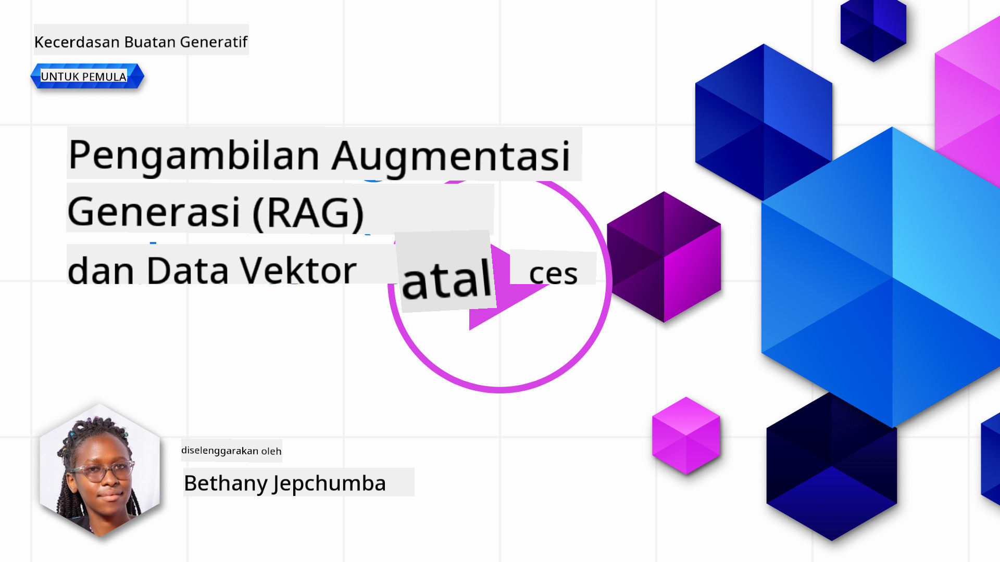
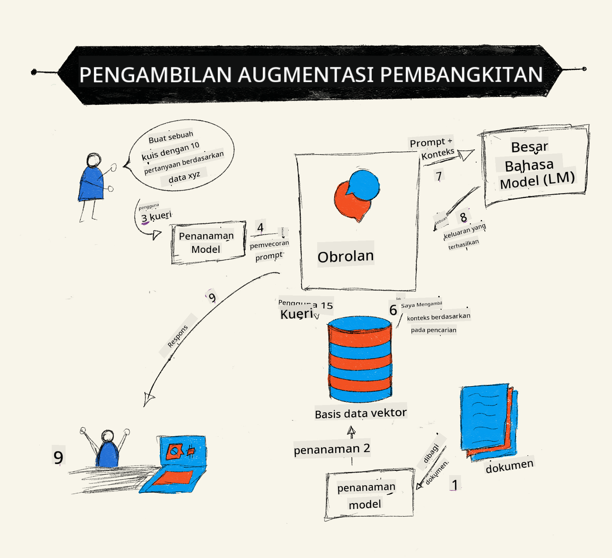
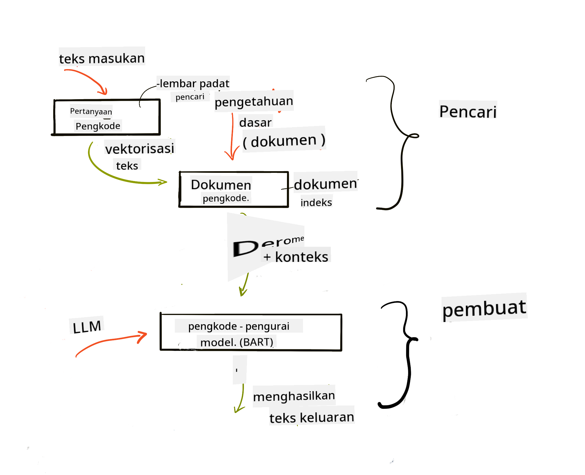
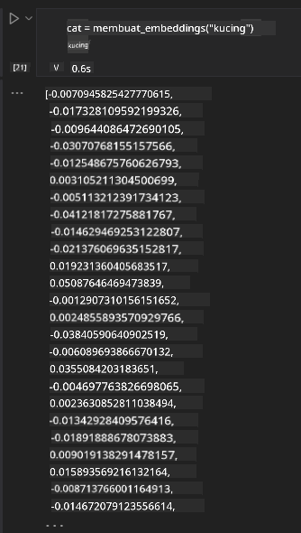

<!--
CO_OP_TRANSLATOR_METADATA:
{
  "original_hash": "e2861bbca91c0567ef32bc77fe054f9e",
  "translation_date": "2025-06-25T22:40:13+00:00",
  "source_file": "15-rag-and-vector-databases/README.md",
  "language_code": "id"
}
-->
# Retrieval Augmented Generation (RAG) dan Basis Data Vektor

[](https://aka.ms/gen-ai-lesson15-gh?WT.mc_id=academic-105485-koreyst)

Dalam pelajaran aplikasi pencarian, kita belajar secara singkat cara mengintegrasikan data Anda sendiri ke dalam Model Bahasa Besar (LLM). Dalam pelajaran ini, kita akan menggali lebih dalam konsep mendasarkan data Anda dalam aplikasi LLM, mekanisme proses, dan metode untuk menyimpan data, termasuk embedding dan teks.

> **Video Segera Hadir**

## Pendahuluan

Dalam pelajaran ini kita akan membahas hal-hal berikut:

- Pengenalan RAG, apa itu dan mengapa digunakan dalam AI (kecerdasan buatan).

- Memahami apa itu basis data vektor dan membuatnya untuk aplikasi kita.

- Contoh praktis tentang cara mengintegrasikan RAG ke dalam aplikasi.

## Tujuan Pembelajaran

Setelah menyelesaikan pelajaran ini, Anda akan dapat:

- Menjelaskan pentingnya RAG dalam pengambilan dan pemrosesan data.

- Menyiapkan aplikasi RAG dan mendasarkan data Anda ke LLM

- Integrasi efektif RAG dan Basis Data Vektor dalam Aplikasi LLM.

## Skenario Kita: meningkatkan LLM kita dengan data kita sendiri

Untuk pelajaran ini, kita ingin menambahkan catatan kita sendiri ke dalam startup pendidikan, yang memungkinkan chatbot mendapatkan lebih banyak informasi tentang berbagai subjek. Dengan menggunakan catatan yang kita miliki, pelajar akan dapat belajar lebih baik dan memahami berbagai topik, membuatnya lebih mudah untuk merevisi untuk ujian mereka. Untuk membuat skenario kita, kita akan menggunakan:

- `Azure OpenAI:` LLM yang akan kita gunakan untuk membuat chatbot kita

- `AI for beginners' lesson on Neural Networks`: ini akan menjadi data yang kita dasarkan pada LLM kita

- `Azure AI Search` dan `Azure Cosmos DB:` basis data vektor untuk menyimpan data kita dan membuat indeks pencarian

Pengguna akan dapat membuat kuis latihan dari catatan mereka, kartu flash revisi, dan meringkasnya menjadi ikhtisar yang ringkas. Untuk memulai, mari kita lihat apa itu RAG dan bagaimana cara kerjanya:

## Retrieval Augmented Generation (RAG)

Chatbot bertenaga LLM memproses permintaan pengguna untuk menghasilkan tanggapan. Ini dirancang untuk bersifat interaktif dan berinteraksi dengan pengguna dalam berbagai topik. Namun, tanggapannya terbatas pada konteks yang diberikan dan data pelatihan dasarnya. Misalnya, pengetahuan GPT-4 berhenti pada September 2021, yang berarti, ia tidak memiliki pengetahuan tentang peristiwa yang terjadi setelah periode ini. Selain itu, data yang digunakan untuk melatih LLM tidak termasuk informasi rahasia seperti catatan pribadi atau manual produk perusahaan.

### Cara kerja RAG (Retrieval Augmented Generation)



Misalkan Anda ingin menerapkan chatbot yang membuat kuis dari catatan Anda, Anda akan memerlukan koneksi ke basis pengetahuan. Di sinilah RAG membantu. RAG beroperasi sebagai berikut:

- **Basis pengetahuan:** Sebelum pengambilan, dokumen-dokumen ini perlu dimasukkan dan diproses sebelumnya, biasanya memecah dokumen besar menjadi bagian yang lebih kecil, mengubahnya menjadi embedding teks dan menyimpannya dalam basis data.

- **Kueri Pengguna:** pengguna mengajukan pertanyaan

- **Pengambilan:** Ketika pengguna mengajukan pertanyaan, model embedding mengambil informasi relevan dari basis pengetahuan kita untuk memberikan lebih banyak konteks yang akan dimasukkan ke dalam permintaan.

- **Generasi Augmented:** LLM meningkatkan tanggapannya berdasarkan data yang diambil. Ini memungkinkan tanggapan yang dihasilkan tidak hanya didasarkan pada data yang telah dilatih sebelumnya tetapi juga informasi relevan dari konteks tambahan. Data yang diambil digunakan untuk memperkuat tanggapan LLM. LLM kemudian mengembalikan jawaban atas pertanyaan pengguna.



Arsitektur untuk RAG diimplementasikan menggunakan transformer yang terdiri dari dua bagian: encoder dan decoder. Misalnya, ketika pengguna mengajukan pertanyaan, teks input 'dienkode' menjadi vektor yang menangkap makna kata-kata dan vektor tersebut 'didekode' menjadi indeks dokumen kita dan menghasilkan teks baru berdasarkan kueri pengguna. LLM menggunakan model encoder-decoder untuk menghasilkan output.

Dua pendekatan ketika mengimplementasikan RAG menurut makalah yang diusulkan: [Retrieval-Augmented Generation for Knowledge intensive NLP (natural language processing software) Tasks](https://arxiv.org/pdf/2005.11401.pdf?WT.mc_id=academic-105485-koreyst) adalah:

- **_RAG-Sequence_** menggunakan dokumen yang diambil untuk memprediksi jawaban terbaik yang mungkin untuk kueri pengguna

- **RAG-Token** menggunakan dokumen untuk menghasilkan token berikutnya, kemudian mengambilnya untuk menjawab kueri pengguna

### Mengapa Anda akan menggunakan RAG?

- **Kekayaan informasi:** memastikan tanggapan teks terbaru dan terkini. Oleh karena itu, ini meningkatkan kinerja pada tugas-tugas khusus domain dengan mengakses basis pengetahuan internal.

- Mengurangi fabrikasi dengan memanfaatkan **data yang dapat diverifikasi** dalam basis pengetahuan untuk memberikan konteks pada kueri pengguna.

- Ini **efektif biaya** karena lebih ekonomis dibandingkan dengan penyesuaian LLM

## Membuat basis pengetahuan

Aplikasi kita didasarkan pada data pribadi kita yaitu, pelajaran Jaringan Saraf pada kurikulum AI Untuk Pemula.

### Basis Data Vektor

Basis data vektor, tidak seperti basis data tradisional, adalah basis data khusus yang dirancang untuk menyimpan, mengelola, dan mencari vektor yang diembed. Ini menyimpan representasi numerik dari dokumen. Memecah data menjadi embedding numerik memudahkan sistem AI kita untuk memahami dan memproses data.

Kita menyimpan embedding kita dalam basis data vektor karena LLM memiliki batas jumlah token yang mereka terima sebagai input. Karena Anda tidak dapat meneruskan seluruh embedding ke LLM, kita perlu memecahnya menjadi bagian-bagian kecil dan ketika pengguna mengajukan pertanyaan, embedding yang paling mirip dengan pertanyaan akan dikembalikan bersama dengan permintaan. Pemecahan juga mengurangi biaya pada jumlah token yang diteruskan melalui LLM.

Beberapa basis data vektor populer termasuk Azure Cosmos DB, Clarifyai, Pinecone, Chromadb, ScaNN, Qdrant, dan DeepLake. Anda dapat membuat model Azure Cosmos DB menggunakan Azure CLI dengan perintah berikut:

```bash
az login
az group create -n <resource-group-name> -l <location>
az cosmosdb create -n <cosmos-db-name> -r <resource-group-name>
az cosmosdb list-keys -n <cosmos-db-name> -g <resource-group-name>
```

### Dari teks ke embedding

Sebelum kita menyimpan data kita, kita perlu mengonversinya menjadi embedding vektor sebelum disimpan dalam basis data. Jika Anda bekerja dengan dokumen besar atau teks panjang, Anda dapat memecahnya berdasarkan kueri yang Anda harapkan. Pemecahan dapat dilakukan pada tingkat kalimat, atau pada tingkat paragraf. Karena pemecahan memperoleh makna dari kata-kata di sekitarnya, Anda dapat menambahkan beberapa konteks lain ke bagian tersebut, misalnya, dengan menambahkan judul dokumen atau menyertakan beberapa teks sebelum atau setelah bagian tersebut. Anda dapat memecah data sebagai berikut:

```python
def split_text(text, max_length, min_length):
    words = text.split()
    chunks = []
    current_chunk = []

    for word in words:
        current_chunk.append(word)
        if len(' '.join(current_chunk)) < max_length and len(' '.join(current_chunk)) > min_length:
            chunks.append(' '.join(current_chunk))
            current_chunk = []

    # If the last chunk didn't reach the minimum length, add it anyway
    if current_chunk:
        chunks.append(' '.join(current_chunk))

    return chunks
```

Setelah dipecah, kita kemudian dapat mengembed teks kita menggunakan berbagai model embedding. Beberapa model yang dapat Anda gunakan termasuk: word2vec, ada-002 oleh OpenAI, Azure Computer Vision, dan banyak lagi. Memilih model untuk digunakan akan bergantung pada bahasa yang Anda gunakan, jenis konten yang dienkode (teks/gambar/audio), ukuran input yang dapat dienkode, dan panjang output embedding.

Contoh teks yang diembed menggunakan model `text-embedding-ada-002` OpenAI adalah:


## Pengambilan dan Pencarian Vektor

Ketika pengguna mengajukan pertanyaan, pengambil mengubahnya menjadi vektor menggunakan pengkode kueri, kemudian mencari melalui indeks pencarian dokumen kita untuk vektor yang relevan dalam dokumen yang terkait dengan input. Setelah selesai, ia mengonversi baik vektor input maupun vektor dokumen menjadi teks dan meneruskannya melalui LLM.

### Pengambilan

Pengambilan terjadi ketika sistem mencoba dengan cepat menemukan dokumen dari indeks yang memenuhi kriteria pencarian. Tujuan pengambil adalah mendapatkan dokumen yang akan digunakan untuk memberikan konteks dan mendasarkan LLM pada data Anda.

Ada beberapa cara untuk melakukan pencarian dalam basis data kita seperti:

- **Pencarian kata kunci** - digunakan untuk pencarian teks

- **Pencarian semantik** - menggunakan makna semantik dari kata-kata

- **Pencarian vektor** - mengonversi dokumen dari teks ke representasi vektor menggunakan model embedding. Pengambilan akan dilakukan dengan mengajukan dokumen yang representasi vektornya paling dekat dengan pertanyaan pengguna.

- **Hibrid** - kombinasi dari pencarian kata kunci dan pencarian vektor.

Tantangan dengan pengambilan datang ketika tidak ada respons yang serupa dengan kueri dalam basis data, sistem kemudian akan mengembalikan informasi terbaik yang bisa mereka dapatkan, namun, Anda dapat menggunakan taktik seperti mengatur jarak maksimum untuk relevansi atau menggunakan pencarian hibrid yang menggabungkan kata kunci dan pencarian vektor. Dalam pelajaran ini kita akan menggunakan pencarian hibrid, kombinasi dari pencarian vektor dan kata kunci. Kita akan menyimpan data kita ke dalam dataframe dengan kolom yang berisi bagian-bagian serta embedding.

### Kesamaan Vektor

Pengambil akan mencari melalui basis pengetahuan untuk embedding yang berdekatan, tetangga terdekat, karena mereka adalah teks yang serupa. Dalam skenario pengguna mengajukan kueri, pertama kali diembed kemudian dicocokkan dengan embedding yang serupa. Pengukuran umum yang digunakan untuk menemukan seberapa mirip vektor yang berbeda adalah kesamaan kosinus yang didasarkan pada sudut antara dua vektor.

Kita dapat mengukur kesamaan menggunakan alternatif lain yang dapat kita gunakan adalah jarak Euclidean yang merupakan garis lurus antara titik akhir vektor dan produk titik yang mengukur jumlah produk elemen yang sesuai dari dua vektor.

### Indeks Pencarian

Saat melakukan pengambilan, kita perlu membangun indeks pencarian untuk basis pengetahuan kita sebelum kita melakukan pencarian. Indeks akan menyimpan embedding kita dan dapat dengan cepat mengambil bagian yang paling mirip bahkan dalam basis data yang besar. Kita dapat membuat indeks kita secara lokal menggunakan:

```python
from sklearn.neighbors import NearestNeighbors

embeddings = flattened_df['embeddings'].to_list()

# Create the search index
nbrs = NearestNeighbors(n_neighbors=5, algorithm='ball_tree').fit(embeddings)

# To query the index, you can use the kneighbors method
distances, indices = nbrs.kneighbors(embeddings)
```

### Re-ranking

Setelah Anda mengajukan kueri ke basis data, Anda mungkin perlu menyortir hasil dari yang paling relevan. LLM reranking memanfaatkan Pembelajaran Mesin untuk meningkatkan relevansi hasil pencarian dengan mengurutkannya dari yang paling relevan. Menggunakan Pencarian AI Azure, reranking dilakukan secara otomatis untuk Anda menggunakan reranker semantik. Contoh bagaimana reranking bekerja menggunakan tetangga terdekat:

```python
# Find the most similar documents
distances, indices = nbrs.kneighbors([query_vector])

index = []
# Print the most similar documents
for i in range(3):
    index = indices[0][i]
    for index in indices[0]:
        print(flattened_df['chunks'].iloc[index])
        print(flattened_df['path'].iloc[index])
        print(flattened_df['distances'].iloc[index])
    else:
        print(f"Index {index} not found in DataFrame")
```

## Menggabungkan semuanya

Langkah terakhir adalah menambahkan LLM kita ke dalam campuran untuk dapat mendapatkan tanggapan yang didasarkan pada data kita. Kita dapat mengimplementasikannya sebagai berikut:

```python
user_input = "what is a perceptron?"

def chatbot(user_input):
    # Convert the question to a query vector
    query_vector = create_embeddings(user_input)

    # Find the most similar documents
    distances, indices = nbrs.kneighbors([query_vector])

    # add documents to query  to provide context
    history = []
    for index in indices[0]:
        history.append(flattened_df['chunks'].iloc[index])

    # combine the history and the user input
    history.append(user_input)

    # create a message object
    messages=[
        {"role": "system", "content": "You are an AI assistant that helps with AI questions."},
        {"role": "user", "content": history[-1]}
    ]

    # use chat completion to generate a response
    response = openai.chat.completions.create(
        model="gpt-4",
        temperature=0.7,
        max_tokens=800,
        messages=messages
    )

    return response.choices[0].message

chatbot(user_input)
```

## Mengevaluasi aplikasi kita

### Metrik Evaluasi

- Kualitas tanggapan yang diberikan memastikan terdengar alami, lancar, dan seperti manusia

- Dasar data: mengevaluasi apakah tanggapan yang datang dari dokumen yang disediakan

- Relevansi: mengevaluasi apakah tanggapan sesuai dan terkait dengan pertanyaan yang diajukan

- Kelancaran - apakah tanggapan masuk akal secara tata bahasa

## Kasus Penggunaan untuk menggunakan RAG (Retrieval Augmented Generation) dan basis data vektor

Ada banyak kasus penggunaan berbeda di mana panggilan fungsi dapat meningkatkan aplikasi Anda seperti:

- Tanya Jawab: mendasarkan data perusahaan Anda ke obrolan yang dapat digunakan oleh karyawan untuk mengajukan pertanyaan.

- Sistem Rekomendasi: di mana Anda dapat membuat sistem yang mencocokkan nilai yang paling mirip, misalnya film, restoran, dan banyak lagi.

- Layanan Chatbot: Anda dapat menyimpan riwayat obrolan dan mempersonalisasi percakapan berdasarkan data pengguna.

- Pencarian gambar berdasarkan embedding vektor, berguna saat melakukan pengenalan gambar dan deteksi anomali.

## Ringkasan

Kita telah membahas area fundamental RAG dari menambahkan data kita ke aplikasi, kueri pengguna, dan output. Untuk menyederhanakan pembuatan RAG, Anda dapat menggunakan kerangka kerja seperti Semanti Kernel, Langchain, atau Autogen.

## Tugas

Untuk melanjutkan pembelajaran Anda tentang Retrieval Augmented Generation (RAG) Anda dapat membangun:

- Membangun antarmuka depan untuk aplikasi menggunakan kerangka kerja pilihan Anda

- Memanfaatkan kerangka kerja, baik LangChain atau Semantic Kernel, dan membuat ulang aplikasi Anda.

Selamat telah menyelesaikan pelajaran 👏.

## Pembelajaran tidak berhenti di sini, lanjutkan Perjalanan

Setelah menyelesaikan pelajaran ini, lihat [koleksi Pembelajaran AI Generatif](https://aka.ms/genai-collection?WT.mc_id=academic-105485-koreyst) kami untuk terus meningkatkan pengetahuan AI Generatif Anda!

**Penafian**:  
Dokumen ini telah diterjemahkan menggunakan layanan terjemahan AI [Co-op Translator](https://github.com/Azure/co-op-translator). Meskipun kami berusaha untuk mencapai akurasi, harap diingat bahwa terjemahan otomatis mungkin mengandung kesalahan atau ketidakakuratan. Dokumen asli dalam bahasa aslinya harus dianggap sebagai sumber yang berwenang. Untuk informasi penting, disarankan untuk menggunakan jasa terjemahan manusia profesional. Kami tidak bertanggung jawab atas kesalahpahaman atau salah tafsir yang timbul dari penggunaan terjemahan ini.