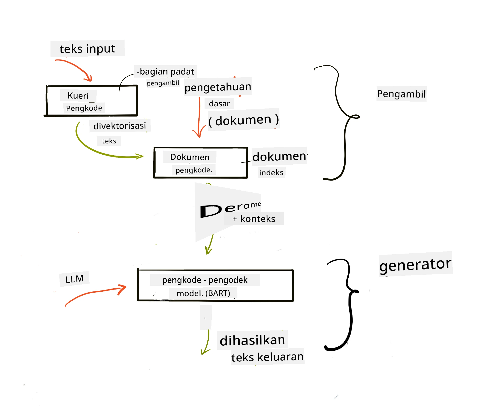

# Generasi Berbasis Pengambilan Informasi (RAG) dan Basis Data Vektor

[](https://youtu.be/4l8zhHUBeyI?si=BmvDmL1fnHtgQYkL)

Dalam pelajaran aplikasi pencarian, kita sempat belajar secara singkat bagaimana mengintegrasikan data sendiri ke dalam Large Language Models (LLMs). Dalam pelajaran ini, kita akan membahas lebih jauh tentang konsep menghubungkan data Anda dalam aplikasi LLM Anda, mekanisme proses dan metode penyimpanan data, termasuk embedding dan teks.

> **Video Segera Hadir**

## Pendahuluan

Dalam pelajaran ini kita akan membahas hal-hal berikut:

- Pengenalan tentang RAG, apa itu dan mengapa digunakan dalam AI (kecerdasan buatan).

- Memahami apa itu basis data vektor dan membuatnya untuk aplikasi kita.

- Contoh praktis cara mengintegrasikan RAG ke dalam aplikasi.

## Tujuan Pembelajaran

Setelah menyelesaikan pelajaran ini, Anda akan mampu:

- Menjelaskan pentingnya RAG dalam pengambilan dan pengolahan data.

- Menyiapkan aplikasi RAG dan menghubungkan data Anda ke LLM

- Integrasi efektif RAG dan Basis Data Vektor dalam Aplikasi LLM.

## Skenario Kami: meningkatkan LLM dengan data kami sendiri

Untuk pelajaran ini, kami ingin menambahkan catatan kami sendiri ke startup pendidikan, yang memungkinkan chatbot untuk mendapatkan lebih banyak informasi tentang berbagai subjek. Dengan menggunakan catatan yang kami miliki, para pelajar dapat belajar lebih baik dan memahami berbagai topik, sehingga memudahkan untuk mengulang pelajaran menjelang ujian. Untuk membuat skenario ini, kami akan menggunakan:

- `Azure OpenAI:` LLM yang akan kami gunakan untuk membuat chatbot kami

- `Pelajaran AI untuk pemula tentang Jaringan Neural`: ini akan menjadi data yang digunakan untuk menyesuaikan LLM kami

- `Azure AI Search` dan `Azure Cosmos DB:` basis data vektor untuk menyimpan data dan membuat indeks pencarian

Pengguna akan dapat membuat kuis latihan dari catatan mereka, kartu flash untuk revisi dan meringkasnya menjadi gambaran singkat. Untuk memulai, mari kita lihat apa itu RAG dan bagaimana cara kerjanya:

## Generasi Berbasis Pengambilan Informasi (RAG)

Chatbot yang didukung LLM memproses perintah pengguna untuk menghasilkan respons. Dirancang untuk interaktif dan berinteraksi dengan pengguna pada berbagai topik. Namun, responsnya terbatas pada konteks yang diberikan dan data pelatihan dasarnya. Contohnya, GPT-4 memiliki batas pengetahuan hingga September 2021, artinya, tidak mengetahui peristiwa yang terjadi setelah periode tersebut. Selain itu, data yang digunakan untuk melatih LLM tidak mencakup informasi rahasia seperti catatan pribadi atau manual produk perusahaan.

### Cara kerja RAG (Generasi Berbasis Pengambilan Informasi)


Misalkan Anda ingin membuat chatbot yang membuat kuis dari catatan Anda, Anda memerlukan koneksi ke basis pengetahuan. Di sinilah RAG membantu. RAG bekerja sebagai berikut:

- **Basis pengetahuan:** Sebelum pengambilan, dokumen-dokumen tersebut perlu diimpor dan diproses, biasanya dengan memecah dokumen besar menjadi potongan-potongan kecil, mengubahnya menjadi embedding teks dan menyimpannya dalam basis data.

- **Pertanyaan pengguna:** pengguna mengajukan pertanyaan

- **Pengambilan:** Ketika pengguna mengajukan pertanyaan, model embedding mengambil informasi relevan dari basis pengetahuan kita untuk memberikan konteks lebih yang akan dimasukkan ke dalam prompt.

- **Generasi yang diperkuat:** LLM meningkatkan responsnya berdasarkan data yang diambil. Ini memungkinkan respons yang dihasilkan tidak hanya berdasarkan data yang sudah dilatih, tetapi juga informasi relevan dari konteks tambahan tersebut. Data yang diambil digunakan untuk memperkuat respons LLM. LLM kemudian mengembalikan jawaban untuk pertanyaan pengguna.



Arsitektur RAG diimplementasikan menggunakan transformer yang terdiri dari dua bagian: encoder dan decoder. Misalnya, saat pengguna mengajukan pertanyaan, teks input 'dikodekan' menjadi vektor yang menangkap makna kata dan vektor-vektor tersebut 'didekodekan' ke dalam indeks dokumen kita dan menghasilkan teks baru berdasarkan pertanyaan pengguna. LLM menggunakan model encoder-decoder untuk menghasilkan outputnya.

Dua pendekatan dalam menerapkan RAG menurut makalah yang diajukan: [Retrieval-Augmented Generation for Knowledge intensive NLP (natural language processing software) Tasks](https://arxiv.org/pdf/2005.11401.pdf?WT.mc_id=academic-105485-koreyst) adalah:

- **_RAG-Sequence_** menggunakan dokumen yang diambil untuk memprediksi jawaban terbaik untuk pertanyaan pengguna

- **RAG-Token** menggunakan dokumen untuk menghasilkan token berikutnya, lalu mengambilnya untuk menjawab pertanyaan pengguna

### Mengapa Anda menggunakan RAG?  

- **Kekayaan informasi:** memastikan respons teks yang diberikan terkini dan up to date. Dengan demikian meningkatkan performa pada tugas domain spesifik dengan mengakses basis pengetahuan internal.

- Mengurangi fabrikasi dengan menggunakan **data yang dapat diverifikasi** dalam basis pengetahuan untuk memberikan konteks pada pertanyaan pengguna.

- Ini **hemat biaya** karena lebih ekonomis dibandingkan dengan fine-tuning LLM

## Membuat basis pengetahuan

Aplikasi kita berbasis pada data pribadi kita yaitu, pelajaran Jaringan Neural dalam kurikulum AI Untuk Pemula.

### Basis Data Vektor

Basis data vektor, berbeda dengan basis data tradisional, adalah basis data khusus yang dirancang untuk menyimpan, mengelola dan mencari vektor embedding. Ia menyimpan representasi numerik dari dokumen. Memecah data menjadi embedding numerik memudahkan sistem AI kita memahami dan memproses data.

Kita menyimpan embedding dalam basis data vektor karena LLM memiliki batas jumlah token yang dapat diterima sebagai input. Karena Anda tidak dapat mengirim seluruh embedding ke LLM, kita perlu memecahnya menjadi potongan dan saat pengguna mengajukan pertanyaan, embedding yang paling sesuai akan dikembalikan bersamaan dengan prompt. Chunking juga mengurangi biaya pada jumlah token yang dikirim ke LLM.

Beberapa basis data vektor populer termasuk Azure Cosmos DB, Clarifyai, Pinecone, Chromadb, ScaNN, Qdrant dan DeepLake. Anda dapat membuat model Azure Cosmos DB menggunakan Azure CLI dengan perintah berikut:

```bash
az login
az group create -n <resource-group-name> -l <location>
az cosmosdb create -n <cosmos-db-name> -r <resource-group-name>
az cosmosdb list-keys -n <cosmos-db-name> -g <resource-group-name>
```

### Dari teks ke embeddings

Sebelum kita menyimpan data, kita perlu mengubahnya ke embedding vektor sebelum disimpan di basis data. Jika Anda bekerja dengan dokumen besar atau teks panjang, Anda dapat memecahnya berdasarkan pertanyaan yang Anda harapkan. Pemecahan bisa dilakukan pada tingkat kalimat, atau paragraf. Karena chunking mengambil makna dari kata di sekitarnya, Anda dapat menambahkan konteks lain pada chunk, misalnya dengan menambahkan judul dokumen atau menyertakan beberapa teks sebelum atau sesudah chunk. Anda bisa memecah data seperti berikut:

```python
def split_text(text, max_length, min_length):
    words = text.split()
    chunks = []
    current_chunk = []

    for word in words:
        current_chunk.append(word)
        if len(' '.join(current_chunk)) < max_length and len(' '.join(current_chunk)) > min_length:
            chunks.append(' '.join(current_chunk))
            current_chunk = []

    # Jika potongan terakhir belum mencapai panjang minimum, tambahkan saja
    if current_chunk:
        chunks.append(' '.join(current_chunk))

    return chunks
```

Setelah dipotong, kita dapat embed teks menggunakan berbagai model embedding. Beberapa model yang dapat digunakan termasuk: word2vec, ada-002 oleh OpenAI, Azure Computer Vision dan banyak lagi. Pemilihan model tergantung pada bahasa yang Anda gunakan, jenis konten yang dienkode (teks/gambar/audio), ukuran input yang dapat dienkode dan panjang output embedding.

Contoh embedding teks menggunakan model OpenAI `text-embedding-ada-002` adalah:


## Pengambilan dan Pencarian Vektor

Saat pengguna mengajukan pertanyaan, sistem pengambil mengubahnya menjadi vektor menggunakan query encoder, kemudian mencari melalui indeks pencarian dokumen untuk vektor relevan terkait input. Setelah selesai, mengubah baik vektor input maupun vektor dokumen menjadi teks dan memasukkannya ke LLM.

### Pengambilan

Pengambilan terjadi saat sistem mencoba dengan cepat menemukan dokumen dari indeks yang memenuhi kriteria pencarian. Tujuan pengambil adalah mendapatkan dokumen yang digunakan untuk memberikan konteks dan menghubungkan LLM ke data Anda.

Ada beberapa cara melakukan pencarian dalam basis data kita seperti:

- **Pencarian kata kunci** - digunakan untuk pencarian teks

- **Pencarian vektor** - mengubah dokumen dari teks ke representasi vektor menggunakan model embedding, memungkinkan **pencarian semantik** menggunakan makna kata. Pengambilan dilakukan dengan menanyakan dokumen yang representasi vektornya paling dekat dengan pertanyaan pengguna.

- **Hibrida** - gabungan dari pencarian kata kunci dan pencarian vektor.

Tantangan pengambilan muncul saat tidak ada respons serupa terhadap pertanyaan dalam basis data, sistem kemudian mengembalikan informasi terbaik yang dapat diperoleh, namun Anda dapat menggunakan taktik seperti mengatur jarak maksimum untuk relevansi atau menggunakan pencarian hibrida yang menggabungkan kata kunci dan pencarian vektor. Dalam pelajaran ini kita akan menggunakan pencarian hibrida, gabungan pencarian vektor dan kata kunci. Kita akan menyimpan data dalam dataframe dengan kolom yang berisi chunk dan embedding.

### Kemiripan Vektor

Sistem pengambil akan mencari melalui basis pengetahuan untuk embedding yang berdekatan, tetangga terdekat, karena mereka adalah teks yang serupa. Dalam skenario, pengguna mengajukan pertanyaan, itu pertama diembed kemudian dicocokkan dengan embedding serupa. Pengukuran umum untuk menilai seberapa mirip vektor adalah cosine similarity yang berdasarkan sudut antara dua vektor.

Kita dapat mengukur kemiripan menggunakan alternatif lain seperti jarak Euclidean yaitu garis lurus antara ujung vektor dan dot product yang mengukur jumlah hasil kali elemen-elemen yang sesuai dari dua vektor.

### Indeks Pencarian

Saat melakukan pengambilan, kita perlu membangun indeks pencarian untuk basis pengetahuan sebelum melakukan pencarian. Indeks akan menyimpan embedding kita dan dapat dengan cepat mengambil chunk yang paling mirip bahkan di basis data yang besar. Kita dapat membuat indeks secara lokal menggunakan:

```python
from sklearn.neighbors import NearestNeighbors

embeddings = flattened_df['embeddings'].to_list()

# Buat indeks pencarian
nbrs = NearestNeighbors(n_neighbors=5, algorithm='ball_tree').fit(embeddings)

# Untuk menanyakan indeks, Anda dapat menggunakan metode kneighbors
distances, indices = nbrs.kneighbors(embeddings)
```

### Pengurutan ulang

Setelah Anda mengajukan pertanyaan ke basis data, Anda mungkin perlu mengurutkan hasil dari yang paling relevan. LLM pengurutan ulang menggunakan Machine Learning untuk meningkatkan relevansi hasil pencarian dengan mengurutkannya dari yang paling relevan. Dengan Azure AI Search, pengurutan ulang dilakukan secara otomatis menggunakan semantic reranker. Contoh cara kerja pengurutan ulang menggunakan tetangga terdekat:

```python
# Temukan dokumen yang paling mirip
distances, indices = nbrs.kneighbors([query_vector])

index = []
# Cetak dokumen yang paling mirip
for i in range(3):
    index = indices[0][i]
    for index in indices[0]:
        print(flattened_df['chunks'].iloc[index])
        print(flattened_df['path'].iloc[index])
        print(flattened_df['distances'].iloc[index])
    else:
        print(f"Index {index} not found in DataFrame")
```

## Menggabungkan semuanya

Langkah terakhir adalah menambahkan LLM kita agar mendapatkan respons yang berlandaskan data kita. Kita dapat mengimplementasikannya seperti berikut:

```python
user_input = "what is a perceptron?"

def chatbot(user_input):
    # Ubah pertanyaan menjadi vektor kueri
    query_vector = create_embeddings(user_input)

    # Temukan dokumen yang paling mirip
    distances, indices = nbrs.kneighbors([query_vector])

    # tambahkan dokumen ke kueri untuk memberikan konteks
    history = []
    for index in indices[0]:
        history.append(flattened_df['chunks'].iloc[index])

    # gabungkan riwayat dan input pengguna
    history.append(user_input)

    # buat objek pesan
    messages=[
        {"role": "system", "content": "You are an AI assistant that helps with AI questions."},
        {"role": "user", "content": "\n\n".join(history) }
    ]

    # gunakan API Responses untuk menghasilkan respons
    response = client.responses.create(
        model="gpt-4o-mini",
        temperature=0.7,
        max_output_tokens=800,
        input=messages,
        store=False,
    )

    return response.output_text

chatbot(user_input)
```

## Mengevaluasi aplikasi kita

### Metrik Evaluasi

- Kualitas respons yang diberikan memastikan terdengar alami, lancar dan seperti manusia

- Terhubungnya data: mengevaluasi apakah respons berasal dari dokumen yang disediakan

- Relevansi: mengevaluasi apakah respons sesuai dan terkait dengan pertanyaan yang diajukan

- Kelancaran - apakah respons masuk akal secara tata bahasa

## Kasus Penggunaan menggunakan RAG (Generasi Berbasis Pengambilan Informasi) dan basis data vektor

Ada banyak kasus penggunaan berbeda yang dapat meningkatkan aplikasi Anda seperti:

- Tanya Jawab: menghubungkan data perusahaan Anda ke chat yang dapat digunakan karyawan untuk bertanya.

- Sistem Rekomendasi: di mana Anda dapat membuat sistem yang mencocokkan nilai paling mirip misalnya film, restoran dan banyak lagi.

- Layanan chatbot: Anda dapat menyimpan riwayat chat dan mempersonalisasi percakapan berdasarkan data pengguna.

- Pencarian gambar berbasis embedding vektor, berguna untuk pengenalan gambar dan deteksi anomali.

## Ringkasan

Kita telah membahas area dasar RAG mulai dari menambahkan data ke aplikasi, pertanyaan pengguna dan output. Untuk menyederhanakan pembuatan RAG, Anda dapat menggunakan kerangka kerja seperti Semantic Kernel, Langchain atau Autogen.

## Tugas

Untuk melanjutkan pembelajaran Generasi Berbasis Pengambilan Informasi (RAG) Anda dapat membuat:

- Membangun front-end untuk aplikasi menggunakan kerangka kerja pilihan Anda

- Memanfaatkan kerangka kerja, baik LangChain atau Semantic Kernel, dan buat kembali aplikasi Anda.

Selamat telah menyelesaikan pelajaran ini 👏.

## Pembelajaran tidak berhenti di sini, lanjutkan Perjalanan Anda

Setelah menyelesaikan pelajaran ini, lihatlah [Koleksi Pembelajaran AI Generatif](https://aka.ms/genai-collection?WT.mc_id=academic-105485-koreyst) kami untuk melanjutkan peningkatan pengetahuan AI Generatif Anda!

---

<!-- CO-OP TRANSLATOR DISCLAIMER START -->
**Penafian**:
Dokumen ini telah diterjemahkan menggunakan layanan terjemahan AI [Co-op Translator](https://github.com/Azure/co-op-translator). Meskipun kami berupaya untuk mencapai akurasi, harap diketahui bahwa terjemahan otomatis mungkin mengandung kesalahan atau ketidakakuratan. Dokumen asli dalam bahasa aslinya harus dianggap sebagai sumber yang sah. Untuk informasi penting, disarankan menggunakan terjemahan profesional oleh manusia. Kami tidak bertanggung jawab atas kesalahpahaman atau penafsiran yang keliru yang timbul dari penggunaan terjemahan ini.
<!-- CO-OP TRANSLATOR DISCLAIMER END -->