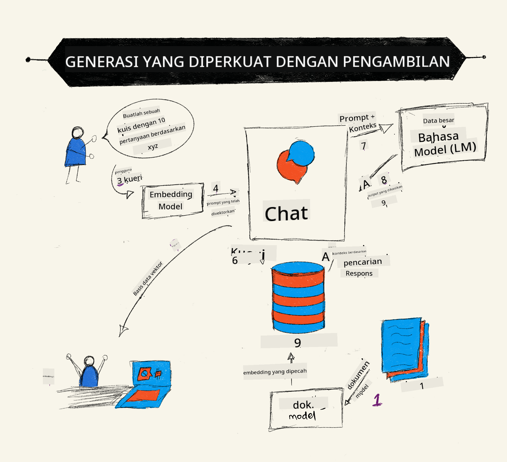
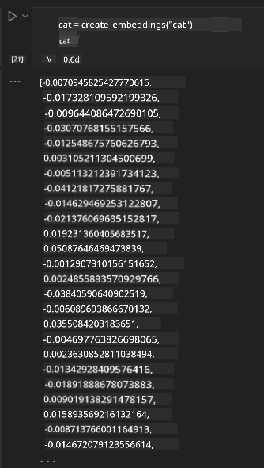

<!--
CO_OP_TRANSLATOR_METADATA:
{
  "original_hash": "e2861bbca91c0567ef32bc77fe054f9e",
  "translation_date": "2025-07-09T16:16:47+00:00",
  "source_file": "15-rag-and-vector-databases/README.md",
  "language_code": "id"
}
-->
# Retrieval Augmented Generation (RAG) dan Database Vektor

[](https://aka.ms/gen-ai-lesson15-gh?WT.mc_id=academic-105485-koreyst)

Dalam pelajaran aplikasi pencarian, kita sempat mempelajari cara mengintegrasikan data Anda sendiri ke dalam Large Language Models (LLM). Pada pelajaran ini, kita akan membahas lebih dalam tentang konsep menghubungkan data Anda dalam aplikasi LLM, mekanisme prosesnya, serta metode penyimpanan data, termasuk embeddings dan teks.

> **Video Segera Hadir**

## Pendahuluan

Dalam pelajaran ini kita akan membahas hal-hal berikut:

- Pengenalan tentang RAG, apa itu dan mengapa digunakan dalam AI (kecerdasan buatan).

- Memahami apa itu database vektor dan cara membuatnya untuk aplikasi kita.

- Contoh praktis bagaimana mengintegrasikan RAG ke dalam sebuah aplikasi.

## Tujuan Pembelajaran

Setelah menyelesaikan pelajaran ini, Anda akan mampu:

- Menjelaskan pentingnya RAG dalam pengambilan dan pemrosesan data.

- Menyiapkan aplikasi RAG dan menghubungkan data Anda ke LLM.

- Mengintegrasikan RAG dan Database Vektor secara efektif dalam Aplikasi LLM.

## Skenario Kita: meningkatkan LLM dengan data kita sendiri

Untuk pelajaran ini, kita ingin menambahkan catatan kita sendiri ke dalam startup pendidikan, yang memungkinkan chatbot mendapatkan lebih banyak informasi tentang berbagai mata pelajaran. Dengan menggunakan catatan yang kita miliki, para pelajar akan dapat belajar lebih baik dan memahami berbagai topik, sehingga memudahkan mereka dalam mengulang pelajaran untuk ujian. Untuk membuat skenario ini, kita akan menggunakan:

- `Azure OpenAI:` LLM yang akan kita gunakan untuk membuat chatbot

- `Pelajaran AI untuk pemula tentang Neural Networks:` ini akan menjadi data yang kita gunakan untuk menghubungkan LLM kita

- `Azure AI Search` dan `Azure Cosmos DB:` database vektor untuk menyimpan data kita dan membuat indeks pencarian

Pengguna akan dapat membuat kuis latihan dari catatan mereka, kartu flash untuk mengulang, dan merangkum menjadi ringkasan singkat. Untuk memulai, mari kita lihat apa itu RAG dan bagaimana cara kerjanya:

## Retrieval Augmented Generation (RAG)

Chatbot yang didukung LLM memproses prompt pengguna untuk menghasilkan respons. Chatbot ini dirancang agar interaktif dan dapat berinteraksi dengan pengguna dalam berbagai topik. Namun, responsnya terbatas pada konteks yang diberikan dan data pelatihan dasarnya. Misalnya, GPT-4 memiliki batas pengetahuan hingga September 2021, artinya tidak mengetahui peristiwa yang terjadi setelah periode tersebut. Selain itu, data yang digunakan untuk melatih LLM tidak mencakup informasi rahasia seperti catatan pribadi atau manual produk perusahaan.

### Cara kerja RAG (Retrieval Augmented Generation)



Misalkan Anda ingin menerapkan chatbot yang membuat kuis dari catatan Anda, Anda memerlukan koneksi ke basis pengetahuan. Di sinilah RAG berperan. RAG bekerja sebagai berikut:

- **Basis pengetahuan:** Sebelum pengambilan, dokumen-dokumen ini perlu diolah dan diproses terlebih dahulu, biasanya dengan memecah dokumen besar menjadi bagian-bagian kecil, mengubahnya menjadi embedding teks, dan menyimpannya dalam database.

- **Pertanyaan Pengguna:** pengguna mengajukan pertanyaan

- **Pengambilan:** Ketika pengguna mengajukan pertanyaan, model embedding mengambil informasi relevan dari basis pengetahuan kita untuk memberikan konteks tambahan yang akan dimasukkan ke dalam prompt.

- **Generasi yang Ditingkatkan:** LLM meningkatkan responsnya berdasarkan data yang diambil. Ini memungkinkan respons yang dihasilkan tidak hanya berdasarkan data yang sudah dilatih sebelumnya, tetapi juga informasi relevan dari konteks tambahan. Data yang diambil digunakan untuk memperkaya respons LLM. LLM kemudian mengembalikan jawaban atas pertanyaan pengguna.


Arsitektur RAG diimplementasikan menggunakan transformer yang terdiri dari dua bagian: encoder dan decoder. Misalnya, ketika pengguna mengajukan pertanyaan, teks input 'diencode' menjadi vektor yang menangkap makna kata-kata dan vektor tersebut 'didecode' ke dalam indeks dokumen kita serta menghasilkan teks baru berdasarkan pertanyaan pengguna. LLM menggunakan model encoder-decoder untuk menghasilkan output.

Dua pendekatan dalam mengimplementasikan RAG menurut makalah yang diusulkan: [Retrieval-Augmented Generation for Knowledge intensive NLP (natural language processing software) Tasks](https://arxiv.org/pdf/2005.11401.pdf?WT.mc_id=academic-105485-koreyst) adalah:

- **_RAG-Sequence_** menggunakan dokumen yang diambil untuk memprediksi jawaban terbaik atas pertanyaan pengguna

- **RAG-Token** menggunakan dokumen untuk menghasilkan token berikutnya, lalu mengambilnya untuk menjawab pertanyaan pengguna

### Mengapa Anda menggunakan RAG? 

- **Kaya informasi:** memastikan respons teks selalu terbaru dan relevan. Dengan demikian, meningkatkan performa pada tugas khusus domain dengan mengakses basis pengetahuan internal.

- Mengurangi pembuatan informasi palsu dengan memanfaatkan **data yang dapat diverifikasi** dalam basis pengetahuan untuk memberikan konteks pada pertanyaan pengguna.

- **Efisien biaya** karena lebih ekonomis dibandingkan melakukan fine-tuning pada LLM.

## Membuat basis pengetahuan

Aplikasi kita didasarkan pada data pribadi kita, yaitu pelajaran Neural Network dalam kurikulum AI untuk Pemula.

### Database Vektor

Database vektor, berbeda dengan database tradisional, adalah database khusus yang dirancang untuk menyimpan, mengelola, dan mencari vektor embedding. Database ini menyimpan representasi numerik dari dokumen. Memecah data menjadi embedding numerik memudahkan sistem AI kita untuk memahami dan memproses data tersebut.

Kita menyimpan embedding dalam database vektor karena LLM memiliki batas jumlah token yang dapat diterima sebagai input. Karena Anda tidak bisa memasukkan seluruh embedding ke dalam LLM, kita perlu memecahnya menjadi bagian-bagian kecil dan ketika pengguna mengajukan pertanyaan, embedding yang paling relevan dengan pertanyaan akan dikembalikan bersama dengan prompt. Pemecahan ini juga mengurangi biaya jumlah token yang diproses oleh LLM.

Beberapa database vektor populer termasuk Azure Cosmos DB, Clarifyai, Pinecone, Chromadb, ScaNN, Qdrant, dan DeepLake. Anda dapat membuat model Azure Cosmos DB menggunakan Azure CLI dengan perintah berikut:

```bash
az login
az group create -n <resource-group-name> -l <location>
az cosmosdb create -n <cosmos-db-name> -r <resource-group-name>
az cosmosdb list-keys -n <cosmos-db-name> -g <resource-group-name>
```

### Dari teks ke embedding

Sebelum menyimpan data, kita perlu mengubahnya menjadi vector embedding terlebih dahulu sebelum disimpan di database. Jika Anda bekerja dengan dokumen besar atau teks panjang, Anda bisa memecahnya berdasarkan pertanyaan yang diharapkan. Pemecahan bisa dilakukan pada tingkat kalimat atau paragraf. Karena pemecahan mengambil makna dari kata-kata di sekitarnya, Anda bisa menambahkan konteks lain ke dalam sebuah bagian, misalnya dengan menambahkan judul dokumen atau menyertakan beberapa teks sebelum atau sesudah bagian tersebut. Anda bisa memecah data seperti berikut:

```python
def split_text(text, max_length, min_length):
    words = text.split()
    chunks = []
    current_chunk = []

    for word in words:
        current_chunk.append(word)
        if len(' '.join(current_chunk)) < max_length and len(' '.join(current_chunk)) > min_length:
            chunks.append(' '.join(current_chunk))
            current_chunk = []

    # If the last chunk didn't reach the minimum length, add it anyway
    if current_chunk:
        chunks.append(' '.join(current_chunk))

    return chunks
```

Setelah dipotong, kita bisa melakukan embedding teks menggunakan berbagai model embedding. Beberapa model yang bisa digunakan antara lain: word2vec, ada-002 dari OpenAI, Azure Computer Vision, dan banyak lagi. Pemilihan model tergantung pada bahasa yang digunakan, jenis konten yang dikodekan (teks/gambar/audio), ukuran input yang dapat dikodekan, dan panjang output embedding.

Contoh embedding teks menggunakan model `text-embedding-ada-002` dari OpenAI adalah:


## Pengambilan dan Pencarian Vektor

Ketika pengguna mengajukan pertanyaan, retriever mengubahnya menjadi vektor menggunakan query encoder, kemudian mencari melalui indeks pencarian dokumen kita untuk menemukan vektor yang relevan dalam dokumen yang terkait dengan input. Setelah itu, ia mengubah vektor input dan vektor dokumen menjadi teks dan mengirimkannya ke LLM.

### Pengambilan

Pengambilan terjadi ketika sistem mencoba dengan cepat menemukan dokumen dari indeks yang memenuhi kriteria pencarian. Tujuan retriever adalah mendapatkan dokumen yang akan digunakan untuk memberikan konteks dan menghubungkan LLM dengan data Anda.

Ada beberapa cara melakukan pencarian dalam database kita seperti:

- **Pencarian kata kunci** - digunakan untuk pencarian teks

- **Pencarian semantik** - menggunakan makna semantik kata-kata

- **Pencarian vektor** - mengubah dokumen dari teks menjadi representasi vektor menggunakan model embedding. Pengambilan dilakukan dengan mencari dokumen yang representasi vektornya paling dekat dengan pertanyaan pengguna.

- **Hibrida** - kombinasi antara pencarian kata kunci dan pencarian vektor.

Tantangan dalam pengambilan muncul ketika tidak ada respons yang mirip dengan pertanyaan dalam database, sistem akan mengembalikan informasi terbaik yang bisa didapat, namun Anda bisa menggunakan taktik seperti mengatur jarak maksimum untuk relevansi atau menggunakan pencarian hibrida yang menggabungkan kata kunci dan pencarian vektor. Dalam pelajaran ini kita akan menggunakan pencarian hibrida, gabungan antara pencarian vektor dan kata kunci. Kita akan menyimpan data ke dalam dataframe dengan kolom yang berisi potongan data serta embedding.

### Kesamaan Vektor

Retriever akan mencari dalam database pengetahuan untuk embedding yang berdekatan, tetangga terdekat, karena mereka adalah teks yang mirip. Dalam skenario ketika pengguna mengajukan pertanyaan, pertanyaan tersebut pertama-tama di-embedding lalu dicocokkan dengan embedding yang mirip. Ukuran yang umum digunakan untuk mengukur seberapa mirip dua vektor adalah cosine similarity yang didasarkan pada sudut antara dua vektor.

Kita juga bisa mengukur kesamaan menggunakan alternatif lain seperti Euclidean distance yang merupakan garis lurus antara ujung vektor dan dot product yang mengukur jumlah hasil kali elemen-elemen yang bersesuaian dari dua vektor.

### Indeks pencarian

Saat melakukan pengambilan, kita perlu membangun indeks pencarian untuk basis pengetahuan sebelum melakukan pencarian. Indeks akan menyimpan embedding kita dan dapat dengan cepat mengambil potongan yang paling mirip bahkan dalam database besar. Kita bisa membuat indeks secara lokal menggunakan:

```python
from sklearn.neighbors import NearestNeighbors

embeddings = flattened_df['embeddings'].to_list()

# Create the search index
nbrs = NearestNeighbors(n_neighbors=5, algorithm='ball_tree').fit(embeddings)

# To query the index, you can use the kneighbors method
distances, indices = nbrs.kneighbors(embeddings)
```

### Pengurutan ulang (Re-ranking)

Setelah Anda melakukan query ke database, Anda mungkin perlu mengurutkan hasil dari yang paling relevan. Re-ranking LLM menggunakan Machine Learning untuk meningkatkan relevansi hasil pencarian dengan mengurutkannya dari yang paling relevan. Dengan menggunakan Azure AI Search, re-ranking dilakukan secara otomatis menggunakan semantic reranker. Contoh cara kerja re-ranking menggunakan nearest neighbours:

```python
# Find the most similar documents
distances, indices = nbrs.kneighbors([query_vector])

index = []
# Print the most similar documents
for i in range(3):
    index = indices[0][i]
    for index in indices[0]:
        print(flattened_df['chunks'].iloc[index])
        print(flattened_df['path'].iloc[index])
        print(flattened_df['distances'].iloc[index])
    else:
        print(f"Index {index} not found in DataFrame")
```

## Menggabungkan semuanya

Langkah terakhir adalah menambahkan LLM ke dalam proses agar bisa mendapatkan respons yang didasarkan pada data kita. Kita bisa mengimplementasikannya sebagai berikut:

```python
user_input = "what is a perceptron?"

def chatbot(user_input):
    # Convert the question to a query vector
    query_vector = create_embeddings(user_input)

    # Find the most similar documents
    distances, indices = nbrs.kneighbors([query_vector])

    # add documents to query  to provide context
    history = []
    for index in indices[0]:
        history.append(flattened_df['chunks'].iloc[index])

    # combine the history and the user input
    history.append(user_input)

    # create a message object
    messages=[
        {"role": "system", "content": "You are an AI assistant that helps with AI questions."},
        {"role": "user", "content": history[-1]}
    ]

    # use chat completion to generate a response
    response = openai.chat.completions.create(
        model="gpt-4",
        temperature=0.7,
        max_tokens=800,
        messages=messages
    )

    return response.choices[0].message

chatbot(user_input)
```

## Mengevaluasi aplikasi kita

### Metrik Evaluasi

- Kualitas respons yang diberikan, memastikan terdengar alami, lancar, dan seperti manusia

- Keterhubungan data: mengevaluasi apakah respons berasal dari dokumen yang disediakan

- Relevansi: mengevaluasi apakah respons sesuai dan terkait dengan pertanyaan yang diajukan

- Kelancaran - apakah respons masuk akal secara tata bahasa

## Kasus Penggunaan RAG (Retrieval Augmented Generation) dan database vektor

Ada banyak kasus penggunaan di mana function calls dapat meningkatkan aplikasi Anda seperti:

- Tanya Jawab: menghubungkan data perusahaan Anda ke chat yang dapat digunakan oleh karyawan untuk bertanya.

- Sistem Rekomendasi: di mana Anda dapat membuat sistem yang mencocokkan nilai paling mirip misalnya film, restoran, dan banyak lagi.

- Layanan Chatbot: Anda dapat menyimpan riwayat chat dan mempersonalisasi percakapan berdasarkan data pengguna.

- Pencarian gambar berdasarkan embedding vektor, berguna saat melakukan pengenalan gambar dan deteksi anomali.

## Ringkasan

Kita telah membahas area dasar RAG mulai dari menambahkan data ke aplikasi, pertanyaan pengguna, hingga output. Untuk mempermudah pembuatan RAG, Anda bisa menggunakan framework seperti Semantic Kernel, Langchain, atau Autogen.

## Tugas

Untuk melanjutkan pembelajaran Retrieval Augmented Generation (RAG), Anda dapat membangun:

- Membuat front-end untuk aplikasi menggunakan framework pilihan Anda

- Memanfaatkan framework, baik LangChain atau Semantic Kernel, dan membuat ulang aplikasi Anda.

Selamat telah menyelesaikan pelajaran ini 👏.

## Pembelajaran tidak berhenti di sini, lanjutkan Perjalanan Anda

Setelah menyelesaikan pelajaran ini, lihat koleksi [Generative AI Learning](https://aka.ms/genai-collection?WT.mc_id=academic-105485-koreyst) kami untuk terus meningkatkan pengetahuan Generative AI Anda!

**Penafian**:  
Dokumen ini telah diterjemahkan menggunakan layanan terjemahan AI [Co-op Translator](https://github.com/Azure/co-op-translator). Meskipun kami berupaya untuk akurasi, harap diketahui bahwa terjemahan otomatis mungkin mengandung kesalahan atau ketidakakuratan. Dokumen asli dalam bahasa aslinya harus dianggap sebagai sumber yang sah. Untuk informasi penting, disarankan menggunakan terjemahan profesional oleh manusia. Kami tidak bertanggung jawab atas kesalahpahaman atau penafsiran yang salah yang timbul dari penggunaan terjemahan ini.