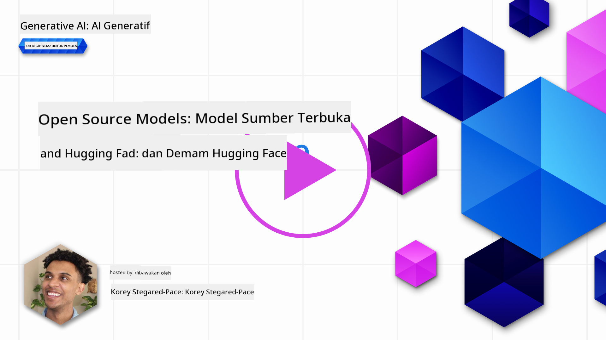
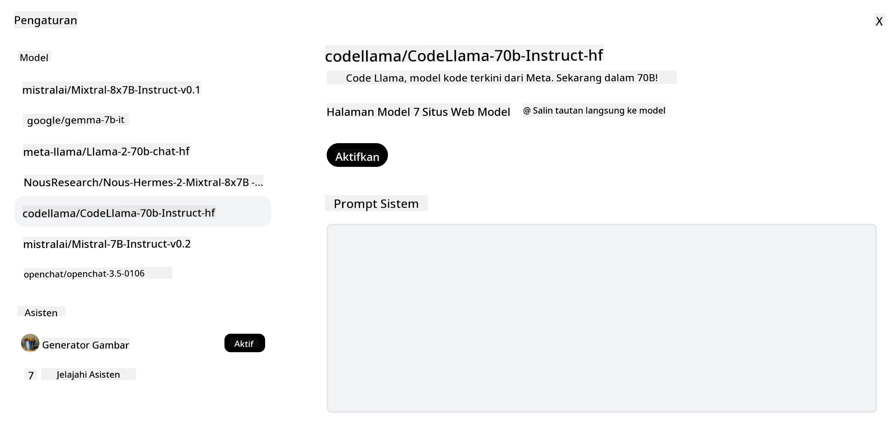

<!--
CO_OP_TRANSLATOR_METADATA:
{
  "original_hash": "0bba96e53ab841d99db731892a51fab8",
  "translation_date": "2025-07-09T17:12:43+00:00",
  "source_file": "16-open-source-models/README.md",
  "language_code": "id"
}
-->

## Pendahuluan

Dunia LLM open-source sangat menarik dan terus berkembang. Pelajaran ini bertujuan memberikan pandangan mendalam tentang model open source. Jika Anda mencari informasi tentang bagaimana model proprietary dibandingkan dengan model open source, kunjungi pelajaran ["Exploring and Comparing Different LLMs"](../02-exploring-and-comparing-different-llms/README.md?WT.mc_id=academic-105485-koreyst). Pelajaran ini juga akan membahas topik fine-tuning, namun penjelasan lebih rinci dapat ditemukan di pelajaran ["Fine-Tuning LLMs"](../18-fine-tuning/README.md?WT.mc_id=academic-105485-koreyst).

## Tujuan Pembelajaran

- Memahami Model open source  
- Memahami manfaat bekerja dengan Model open source  
- Menjelajahi model open yang tersedia di Hugging Face dan Azure AI Studio  

## Apa itu Model Open Source?

Perangkat lunak open source telah memainkan peran penting dalam perkembangan teknologi di berbagai bidang. Open Source Initiative (OSI) telah mendefinisikan [10 kriteria untuk perangkat lunak](https://web.archive.org/web/20241126001143/https://opensource.org/osd?WT.mc_id=academic-105485-koreyst) agar diklasifikasikan sebagai open source. Kode sumber harus dibagikan secara terbuka di bawah lisensi yang disetujui oleh OSI.

Meskipun pengembangan LLM memiliki elemen yang mirip dengan pengembangan perangkat lunak, prosesnya tidak persis sama. Hal ini memunculkan banyak diskusi di komunitas mengenai definisi open source dalam konteks LLM. Agar sebuah model sesuai dengan definisi open source tradisional, informasi berikut harus tersedia untuk umum:

- Dataset yang digunakan untuk melatih model.  
- Bobot model lengkap sebagai bagian dari pelatihan.  
- Kode evaluasi.  
- Kode fine-tuning.  
- Bobot model lengkap dan metrik pelatihan.  

Saat ini hanya ada beberapa model yang memenuhi kriteria ini. [Model OLMo yang dibuat oleh Allen Institute for Artificial Intelligence (AllenAI)](https://huggingface.co/allenai/OLMo-7B?WT.mc_id=academic-105485-koreyst) adalah salah satu yang masuk kategori ini.

Untuk pelajaran ini, kami akan menyebut model-model tersebut sebagai "model terbuka" karena mungkin belum sepenuhnya memenuhi kriteria di atas pada saat penulisan.

## Manfaat Model Terbuka

**Sangat Dapat Disesuaikan** - Karena model terbuka dirilis dengan informasi pelatihan yang detail, peneliti dan pengembang dapat memodifikasi bagian dalam model. Ini memungkinkan pembuatan model yang sangat khusus yang di-fine-tune untuk tugas atau bidang studi tertentu. Contohnya termasuk pembuatan kode, operasi matematika, dan biologi.

**Biaya** - Biaya per token untuk menggunakan dan menerapkan model ini lebih rendah dibandingkan model proprietary. Saat membangun aplikasi Generative AI, penting untuk mempertimbangkan performa dibandingkan harga saat menggunakan model ini untuk kasus penggunaan Anda.

  
Sumber: Artificial Analysis

**Fleksibilitas** - Bekerja dengan model terbuka memungkinkan Anda lebih fleksibel dalam menggunakan berbagai model atau menggabungkannya. Contohnya adalah [HuggingChat Assistants](https://huggingface.co/chat?WT.mc_id=academic-105485-koreyst) di mana pengguna dapat memilih model yang digunakan langsung dari antarmuka pengguna:

## Menjelajahi Berbagai Model Terbuka

### Llama 2

[LLama2](https://huggingface.co/meta-llama?WT.mc_id=academic-105485-koreyst), yang dikembangkan oleh Meta, adalah model terbuka yang dioptimalkan untuk aplikasi berbasis chat. Ini karena metode fine-tuning-nya yang melibatkan banyak dialog dan umpan balik manusia. Dengan metode ini, model menghasilkan hasil yang lebih sesuai dengan harapan manusia sehingga memberikan pengalaman pengguna yang lebih baik.

Beberapa contoh versi Llama yang sudah di-fine-tune termasuk [Japanese Llama](https://huggingface.co/elyza/ELYZA-japanese-Llama-2-7b?WT.mc_id=academic-105485-koreyst), yang mengkhususkan diri dalam bahasa Jepang, dan [Llama Pro](https://huggingface.co/TencentARC/LLaMA-Pro-8B?WT.mc_id=academic-105485-koreyst), versi yang ditingkatkan dari model dasar.

### Mistral

[Mistral](https://huggingface.co/mistralai?WT.mc_id=academic-105485-koreyst) adalah model terbuka dengan fokus kuat pada performa tinggi dan efisiensi. Model ini menggunakan pendekatan Mixture-of-Experts yang menggabungkan sekelompok model ahli khusus ke dalam satu sistem, di mana tergantung pada input, model tertentu dipilih untuk digunakan. Ini membuat komputasi lebih efektif karena model hanya menangani input yang menjadi keahliannya.

Beberapa contoh versi Mistral yang sudah di-fine-tune termasuk [BioMistral](https://huggingface.co/BioMistral/BioMistral-7B?text=Mon+nom+est+Thomas+et+mon+principal?WT.mc_id=academic-105485-koreyst), yang fokus pada domain medis, dan [OpenMath Mistral](https://huggingface.co/nvidia/OpenMath-Mistral-7B-v0.1-hf?WT.mc_id=academic-105485-koreyst), yang melakukan komputasi matematika.

### Falcon

[Falcon](https://huggingface.co/tiiuae?WT.mc_id=academic-105485-koreyst) adalah LLM yang dibuat oleh Technology Innovation Institute (**TII**). Falcon-40B dilatih dengan 40 miliar parameter dan telah terbukti berkinerja lebih baik daripada GPT-3 dengan anggaran komputasi yang lebih rendah. Ini berkat penggunaan algoritma FlashAttention dan multiquery attention yang memungkinkan pengurangan kebutuhan memori saat inferensi. Dengan waktu inferensi yang lebih singkat ini, Falcon-40B cocok untuk aplikasi chat.

Beberapa contoh versi Falcon yang sudah di-fine-tune adalah [OpenAssistant](https://huggingface.co/OpenAssistant/falcon-40b-sft-top1-560?WT.mc_id=academic-105485-koreyst), asisten yang dibangun di atas model terbuka, dan [GPT4ALL](https://huggingface.co/nomic-ai/gpt4all-falcon?WT.mc_id=academic-105485-koreyst), yang memberikan performa lebih tinggi dibandingkan model dasar.

## Cara Memilih

Tidak ada jawaban pasti dalam memilih model terbuka. Tempat yang baik untuk memulai adalah dengan menggunakan fitur filter berdasarkan tugas di Azure AI Studio. Ini akan membantu Anda memahami jenis tugas apa yang telah dilatih oleh model tersebut. Hugging Face juga memiliki LLM Leaderboard yang menunjukkan model dengan performa terbaik berdasarkan metrik tertentu.

Saat ingin membandingkan LLM dari berbagai jenis, [Artificial Analysis](https://artificialanalysis.ai/?WT.mc_id=academic-105485-koreyst) adalah sumber yang sangat baik:

  
Sumber: Artificial Analysis

Jika mengerjakan kasus penggunaan spesifik, mencari versi yang sudah di-fine-tune dan fokus pada area yang sama bisa sangat efektif. Mencoba beberapa model terbuka untuk melihat bagaimana performanya sesuai dengan harapan Anda dan pengguna juga merupakan praktik yang baik.

## Langkah Selanjutnya

Bagian terbaik dari model terbuka adalah Anda bisa mulai menggunakannya dengan cepat. Lihat [Azure AI Studio Model Catalog](https://ai.azure.com?WT.mc_id=academic-105485-koreyst), yang menampilkan koleksi khusus dari Hugging Face dengan model-model yang telah kita bahas di sini.

## Pembelajaran tidak berhenti di sini, lanjutkan Perjalanan

Setelah menyelesaikan pelajaran ini, kunjungi koleksi [Generative AI Learning](https://aka.ms/genai-collection?WT.mc_id=academic-105485-koreyst) untuk terus meningkatkan pengetahuan Anda tentang Generative AI!

**Penafian**:  
Dokumen ini telah diterjemahkan menggunakan layanan terjemahan AI [Co-op Translator](https://github.com/Azure/co-op-translator). Meskipun kami berupaya untuk akurasi, harap diketahui bahwa terjemahan otomatis mungkin mengandung kesalahan atau ketidakakuratan. Dokumen asli dalam bahasa aslinya harus dianggap sebagai sumber yang sahih. Untuk informasi penting, disarankan menggunakan terjemahan profesional oleh manusia. Kami tidak bertanggung jawab atas kesalahpahaman atau penafsiran yang salah yang timbul dari penggunaan terjemahan ini.