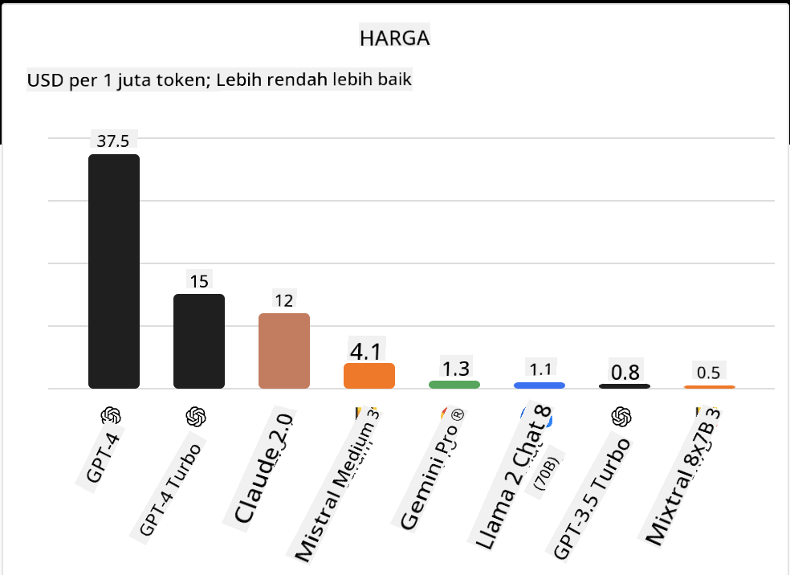
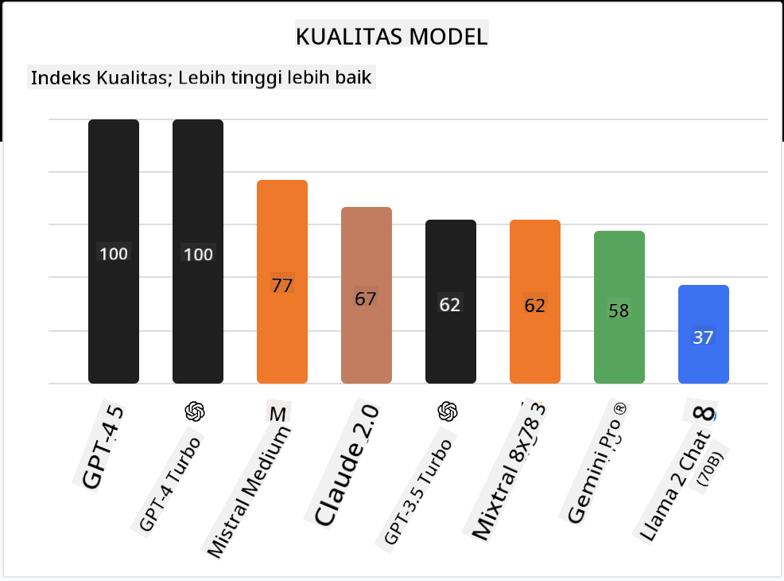

<!--
CO_OP_TRANSLATOR_METADATA:
{
  "original_hash": "0bba96e53ab841d99db731892a51fab8",
  "translation_date": "2025-05-20T07:00:01+00:00",
  "source_file": "16-open-source-models/README.md",
  "language_code": "id"
}
-->

## Pengantar

Dunia LLM sumber terbuka sangat menarik dan terus berkembang. Pelajaran ini bertujuan untuk memberikan pandangan mendalam tentang model sumber terbuka. Jika Anda mencari informasi tentang bagaimana model milik dibandingkan dengan model sumber terbuka, kunjungi pelajaran ["Menjelajahi dan Membandingkan Berbagai LLM"](../02-exploring-and-comparing-different-llms/README.md?WT.mc_id=academic-105485-koreyst). Pelajaran ini juga akan membahas topik fine-tuning, tetapi penjelasan lebih rinci dapat ditemukan di pelajaran ["Fine-Tuning LLMs"](../18-fine-tuning/README.md?WT.mc_id=academic-105485-koreyst).

## Tujuan Pembelajaran

- Memahami model sumber terbuka
- Memahami manfaat bekerja dengan model sumber terbuka
- Menjelajahi model terbuka yang tersedia di Hugging Face dan Azure AI Studio

## Apa itu Model Sumber Terbuka?

Perangkat lunak sumber terbuka telah memainkan peran penting dalam pertumbuhan teknologi di berbagai bidang. Inisiatif Sumber Terbuka (OSI) telah mendefinisikan [10 kriteria untuk perangkat lunak](https://web.archive.org/web/20241126001143/https://opensource.org/osd?WT.mc_id=academic-105485-koreyst) agar diklasifikasikan sebagai sumber terbuka. Kode sumber harus dibagikan secara terbuka di bawah lisensi yang disetujui oleh OSI.

Meskipun pengembangan LLM memiliki elemen yang mirip dengan pengembangan perangkat lunak, prosesnya tidak persis sama. Hal ini telah memicu banyak diskusi dalam komunitas tentang definisi sumber terbuka dalam konteks LLM. Agar model sesuai dengan definisi tradisional sumber terbuka, informasi berikut harus tersedia secara publik:

- Dataset yang digunakan untuk melatih model.
- Bobot model lengkap sebagai bagian dari pelatihan.
- Kode evaluasi.
- Kode fine-tuning.
- Bobot model lengkap dan metrik pelatihan.

Saat ini hanya ada beberapa model yang memenuhi kriteria ini. Model [OLMo yang dibuat oleh Allen Institute for Artificial Intelligence (AllenAI)](https://huggingface.co/allenai/OLMo-7B?WT.mc_id=academic-105485-koreyst) adalah salah satu yang sesuai dengan kategori ini.

Untuk pelajaran ini, kita akan merujuk pada model sebagai "model terbuka" ke depan karena mungkin tidak sesuai dengan kriteria di atas pada saat penulisan.

## Manfaat Model Terbuka

**Sangat Dapat Disesuaikan** - Karena model terbuka dirilis dengan informasi pelatihan yang rinci, peneliti dan pengembang dapat memodifikasi bagian dalam model. Ini memungkinkan pembuatan model yang sangat khusus yang disesuaikan untuk tugas atau bidang studi tertentu. Beberapa contoh dari ini adalah pembuatan kode, operasi matematis, dan biologi.

**Biaya** - Biaya per token untuk menggunakan dan menerapkan model ini lebih rendah daripada model milik. Saat membangun aplikasi Generative AI, mempertimbangkan kinerja vs harga saat bekerja dengan model ini untuk kasus penggunaan Anda harus dilakukan.

Sumber: Analisis Buatan

**Fleksibilitas** - Bekerja dengan model terbuka memungkinkan Anda fleksibel dalam menggunakan model yang berbeda atau menggabungkannya. Contoh dari ini adalah [HuggingChat Assistants](https://huggingface.co/chat?WT.mc_id=academic-105485-koreyst) di mana pengguna dapat memilih model yang digunakan langsung di antarmuka pengguna:

## Menjelajahi Berbagai Model Terbuka

### Llama 2

[LLama2](https://huggingface.co/meta-llama?WT.mc_id=academic-105485-koreyst), dikembangkan oleh Meta adalah model terbuka yang dioptimalkan untuk aplikasi berbasis obrolan. Ini karena metode fine-tuning-nya, yang mencakup sejumlah besar dialog dan umpan balik manusia. Dengan metode ini, model menghasilkan lebih banyak hasil yang sesuai dengan ekspektasi manusia yang memberikan pengalaman pengguna yang lebih baik.

Beberapa contoh versi fine-tuned dari Llama termasuk [Japanese Llama](https://huggingface.co/elyza/ELYZA-japanese-Llama-2-7b?WT.mc_id=academic-105485-koreyst), yang berspesialisasi dalam bahasa Jepang dan [Llama Pro](https://huggingface.co/TencentARC/LLaMA-Pro-8B?WT.mc_id=academic-105485-koreyst), yang merupakan versi yang ditingkatkan dari model dasar.

### Mistral

[Mistral](https://huggingface.co/mistralai?WT.mc_id=academic-105485-koreyst) adalah model terbuka dengan fokus kuat pada kinerja tinggi dan efisiensi. Ini menggunakan pendekatan Mixture-of-Experts yang menggabungkan sekelompok model ahli khusus ke dalam satu sistem di mana tergantung pada input, model tertentu dipilih untuk digunakan. Ini membuat komputasi lebih efektif karena model hanya menangani input yang mereka kuasai.

Beberapa contoh versi fine-tuned dari Mistral termasuk [BioMistral](https://huggingface.co/BioMistral/BioMistral-7B?text=Mon+nom+est+Thomas+et+mon+principal?WT.mc_id=academic-105485-koreyst), yang berfokus pada domain medis dan [OpenMath Mistral](https://huggingface.co/nvidia/OpenMath-Mistral-7B-v0.1-hf?WT.mc_id=academic-105485-koreyst), yang melakukan komputasi matematis.

### Falcon

[Falcon](https://huggingface.co/tiiuae?WT.mc_id=academic-105485-koreyst) adalah LLM yang dibuat oleh Institut Inovasi Teknologi (**TII**). Falcon-40B dilatih pada 40 miliar parameter yang telah terbukti berkinerja lebih baik daripada GPT-3 dengan anggaran komputasi yang lebih sedikit. Ini disebabkan oleh penggunaan algoritma FlashAttention dan multiquery attention yang memungkinkannya mengurangi kebutuhan memori pada saat inferensi. Dengan waktu inferensi yang berkurang ini, Falcon-40B cocok untuk aplikasi obrolan.

Beberapa contoh versi fine-tuned dari Falcon adalah [OpenAssistant](https://huggingface.co/OpenAssistant/falcon-40b-sft-top1-560?WT.mc_id=academic-105485-koreyst), asisten yang dibangun di atas model terbuka dan [GPT4ALL](https://huggingface.co/nomic-ai/gpt4all-falcon?WT.mc_id=academic-105485-koreyst), yang memberikan kinerja lebih tinggi daripada model dasar.

## Bagaimana Memilih

Tidak ada satu jawaban untuk memilih model terbuka. Tempat yang baik untuk memulai adalah dengan menggunakan fitur filter berdasarkan tugas di Azure AI Studio. Ini akan membantu Anda memahami jenis tugas apa yang telah dilatih oleh model. Hugging Face juga memiliki Papan Peringkat LLM yang menunjukkan model berkinerja terbaik berdasarkan metrik tertentu.

Saat ingin membandingkan LLM di berbagai jenis, [Artificial Analysis](https://artificialanalysis.ai/?WT.mc_id=academic-105485-koreyst) adalah sumber daya yang bagus lainnya:

Sumber: Analisis Buatan

Jika bekerja pada kasus penggunaan tertentu, mencari versi fine-tuned yang berfokus pada area yang sama dapat efektif. Mencoba beberapa model terbuka untuk melihat bagaimana mereka berkinerja sesuai dengan harapan Anda dan pengguna Anda adalah praktik yang baik lainnya.

## Langkah Selanjutnya

Bagian terbaik tentang model terbuka adalah Anda dapat mulai bekerja dengan mereka dengan cepat. Lihat [Katalog Model Azure AI Studio](https://ai.azure.com?WT.mc_id=academic-105485-koreyst), yang menampilkan koleksi Hugging Face khusus dengan model yang kita bahas di sini.

## Pembelajaran tidak berhenti di sini, lanjutkan Perjalanan

Setelah menyelesaikan pelajaran ini, lihat koleksi [Pembelajaran Generative AI](https://aka.ms/genai-collection?WT.mc_id=academic-105485-koreyst) kami untuk terus meningkatkan pengetahuan Generative AI Anda!

**Penafian**:  
Dokumen ini telah diterjemahkan menggunakan layanan penerjemahan AI [Co-op Translator](https://github.com/Azure/co-op-translator). Meskipun kami berusaha untuk memberikan hasil yang akurat, harap diketahui bahwa terjemahan otomatis mungkin mengandung kesalahan atau ketidakakuratan. Dokumen asli dalam bahasa aslinya harus dianggap sebagai sumber yang berwenang. Untuk informasi yang kritis, disarankan menggunakan terjemahan manusia profesional. Kami tidak bertanggung jawab atas kesalahpahaman atau salah penafsiran yang timbul dari penggunaan terjemahan ini.