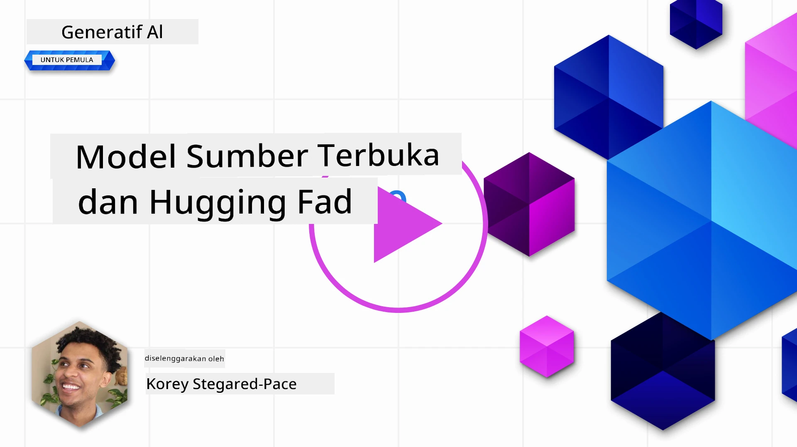
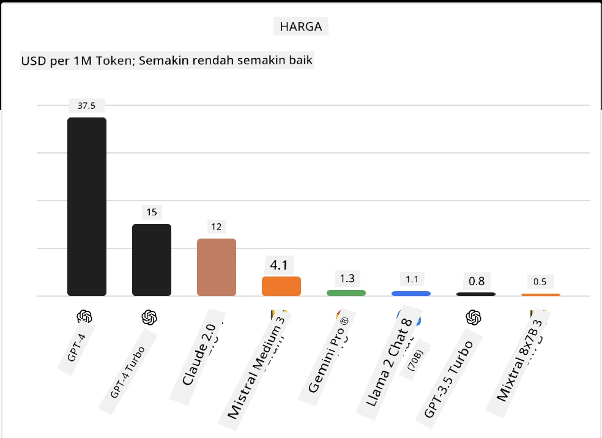
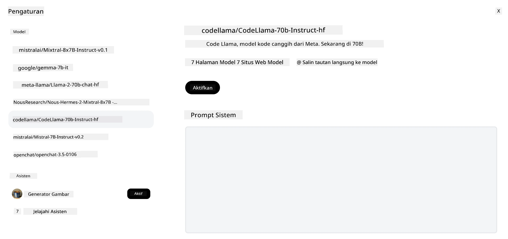
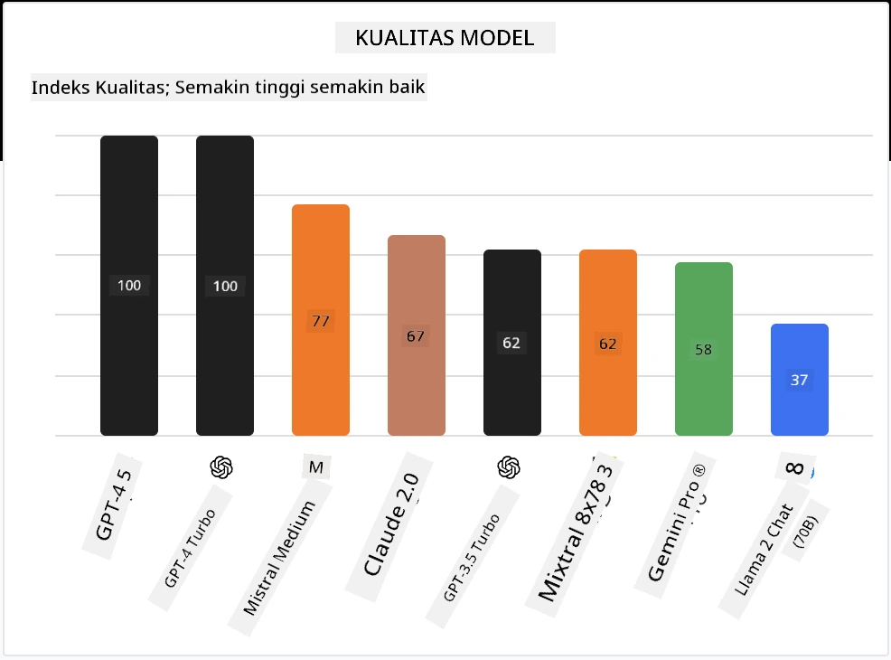

## Pendahuluan

Dunia LLM open source sangat menarik dan terus berkembang. Pelajaran ini bertujuan memberikan pandangan mendalam tentang model open source. Jika Anda mencari informasi tentang bagaimana model proprietary dibandingkan dengan model open source, kunjungi pelajaran ["Menjelajahi dan Membandingkan Berbagai LLM"](../02-exploring-and-comparing-different-llms/README.md?WT.mc_id=academic-105485-koreyst). Pelajaran ini juga akan membahas topik fine-tuning tetapi penjelasan lebih rinci dapat ditemukan di pelajaran ["Fine-Tuning LLMs"](../18-fine-tuning/README.md?WT.mc_id=academic-105485-koreyst).

## Tujuan pembelajaran

- Memahami model open source
- Memahami manfaat bekerja dengan model open source
- Menjelajahi model open yang tersedia di Hugging Face dan katalog model Microsoft Foundry

## Apa itu Model Open Source?

Perangkat lunak open source telah memainkan peranan penting dalam perkembangan teknologi di berbagai bidang. Open Source Initiative (OSI) telah mendefinisikan [10 kriteria untuk perangkat lunak](https://web.archive.org/web/20241126001143/https://opensource.org/osd?WT.mc_id=academic-105485-koreyst) untuk diklasifikasikan sebagai open source. Kode sumber harus dibagikan secara terbuka di bawah lisensi yang disetujui OSI.

Meskipun pengembangan LLM memiliki elemen serupa dengan pengembangan perangkat lunak, prosesnya tidak persis sama. Hal ini memicu banyak diskusi di komunitas mengenai definisi open source dalam konteks LLM. Agar sebuah model sesuai dengan definisi open source tradisional, informasi berikut harus tersedia secara publik:

- Dataset yang digunakan untuk melatih model.
- Bobot model lengkap sebagai bagian dari pelatihan.
- Kode evaluasi.
- Kode fine-tuning.
- Bobot model lengkap dan metrik pelatihan.

Saat ini hanya ada beberapa model yang memenuhi kriteria ini. [Model OLMo yang dibuat oleh Allen Institute for Artificial Intelligence (AllenAI)](https://huggingface.co/allenai/OLMo-7B?WT.mc_id=academic-105485-koreyst) adalah salah satu yang masuk kategori ini.

Dalam pelajaran ini, kita akan menyebut model tersebut sebagai "model open" ke depannya karena mungkin belum memenuhi kriteria di atas pada saat penulisan.

## Manfaat Model Open

**Sangat Dapat Disesuaikan** - Karena model open dirilis dengan informasi pelatihan yang detail, peneliti dan pengembang dapat memodifikasi bagian dalam model. Ini memungkinkan pembuatan model yang sangat khusus yang disesuaikan untuk tugas atau bidang studi tertentu. Contohnya adalah pembuatan kode, operasi matematika, dan biologi.

**Biaya** - Biaya per token untuk menggunakan dan menerapkan model ini lebih rendah dibanding model proprietary. Saat membangun aplikasi Generative AI, perlu mempertimbangkan kinerja vs harga saat bekerja dengan model ini sesuai kasus penggunaan Anda.

Sumber: Artificial Analysis

**Fleksibilitas** - Bekerja dengan model open memungkinkan Anda lebih fleksibel dalam menggunakan berbagai model atau menggabungkannya. Contohnya adalah [Asisten HuggingChat](https://huggingface.co/chat?WT.mc_id=academic-105485-koreyst) di mana pengguna bisa memilih model yang digunakan langsung dari antarmuka pengguna:

## Menjelajahi Model Open yang Berbeda

### Llama 2

[Llama2](https://huggingface.co/meta-llama?WT.mc_id=academic-105485-koreyst), yang dikembangkan oleh Meta adalah model open yang dioptimalkan untuk aplikasi berbasis chat. Ini karena metode fine-tuning nya, yang melibatkan banyak dialog dan umpan balik manusia. Dengan metode ini, model menghasilkan hasil yang lebih sesuai dengan harapan manusia sehingga memberikan pengalaman pengguna yang lebih baik.

Beberapa contoh versi Llama yang telah di-fine-tune termasuk [Japanese Llama](https://huggingface.co/elyza/ELYZA-japanese-Llama-2-7b?WT.mc_id=academic-105485-koreyst), yang spesialis di bahasa Jepang dan [Llama Pro](https://huggingface.co/TencentARC/LLaMA-Pro-8B?WT.mc_id=academic-105485-koreyst), yang merupakan versi yang ditingkatkan dari model dasar.

### Mistral

[Mistral](https://huggingface.co/mistralai?WT.mc_id=academic-105485-koreyst) adalah model open yang memfokuskan pada kinerja tinggi dan efisiensi. Ia menggunakan pendekatan Mixture-of-Experts yang menggabungkan sekelompok model ahli khusus dalam satu sistem dimana tergantung input, model tertentu dipilih untuk digunakan. Ini membuat komputasi lebih efektif karena model hanya menangani input yang menjadi keahliannya.

Contoh versi Mistral yang di-fine-tune termasuk [BioMistral](https://huggingface.co/BioMistral/BioMistral-7B?text=Mon+nom+est+Thomas+et+mon+principal?WT.mc_id=academic-105485-koreyst), yang berfokus di domain medis dan [OpenMath Mistral](https://huggingface.co/nvidia/OpenMath-Mistral-7B-v0.1-hf?WT.mc_id=academic-105485-koreyst), yang melakukan komputasi matematika.

### Falcon

[Falcon](https://huggingface.co/tiiuae?WT.mc_id=academic-105485-koreyst) adalah LLM yang dibuat oleh Technology Innovation Institute (**TII**). Falcon-40B dilatih dengan 40 miliar parameter yang telah terbukti berkinerja lebih baik daripada GPT-3 dengan anggaran komputasi yang lebih kecil. Ini disebabkan penggunaan algoritma FlashAttention dan multiquery attention yang mengurangi kebutuhan memori saat inferensi. Dengan waktu inferensi yang lebih singkat, Falcon-40B cocok untuk aplikasi chat.

Contoh versi Falcon yang di-fine-tune adalah [OpenAssistant](https://huggingface.co/OpenAssistant/falcon-40b-sft-top1-560?WT.mc_id=academic-105485-koreyst), asisten yang dibangun dengan model open dan [GPT4ALL](https://huggingface.co/nomic-ai/gpt4all-falcon?WT.mc_id=academic-105485-koreyst), yang memberikan kinerja lebih tinggi dari model dasar.

## Cara Memilih

Tidak ada jawaban pasti untuk memilih model open. Tempat yang baik untuk memulai adalah menggunakan fitur filter berdasarkan tugas pada katalog model Microsoft Foundry. Ini akan membantu Anda memahami jenis tugas yang telah dilatih oleh model. Hugging Face juga memelihara LLM Leaderboard yang menunjukkan model dengan kinerja terbaik berdasarkan metrik tertentu.

Saat ingin membandingkan LLM dari berbagai jenis, [Artificial Analysis](https://artificialanalysis.ai/?WT.mc_id=academic-105485-koreyst) adalah sumber yang sangat baik:

Sumber: Artificial Analysis

Jika bekerja pada kasus penggunaan tertentu, mencari versi yang di-fine-tune yang fokus pada area yang sama bisa efektif. Bereksperimen dengan beberapa model open untuk melihat kinerjanya sesuai harapan Anda dan pengguna juga merupakan praktik yang baik.

## Langkah Selanjutnya

Bagian terbaik dari model open adalah Anda bisa mulai bekerja dengan cepat. Cek [katalog model Microsoft Foundry](https://ai.azure.com?WT.mc_id=academic-105485-koreyst), yang memiliki koleksi khusus Hugging Face dengan model yang telah kita bahas di sini.

## Pembelajaran tidak berhenti di sini, lanjutkan Perjalanan Anda

Setelah menyelesaikan pelajaran ini, cek [koleksi Pembelajaran Generative AI kami](https://aka.ms/genai-collection?WT.mc_id=academic-105485-koreyst) untuk terus mengembangkan pengetahuan Generative AI Anda!

---

<!-- CO-OP TRANSLATOR DISCLAIMER START -->
**Penafian**:
Dokumen ini telah diterjemahkan menggunakan layanan terjemahan AI [Co-op Translator](https://github.com/Azure/co-op-translator). Meskipun kami berupaya untuk mencapai akurasi, harap diketahui bahwa terjemahan otomatis mungkin mengandung kesalahan atau ketidakakuratan. Dokumen asli dalam bahasa aslinya harus dianggap sebagai sumber yang sah. Untuk informasi penting, disarankan menggunakan terjemahan profesional oleh manusia. Kami tidak bertanggung jawab atas kesalahpahaman atau penafsiran yang keliru yang timbul dari penggunaan terjemahan ini.
<!-- CO-OP TRANSLATOR DISCLAIMER END -->