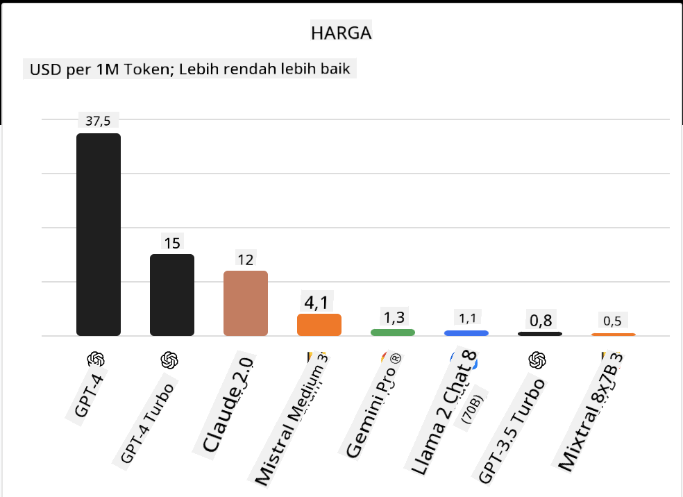
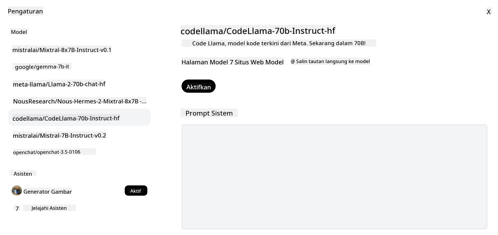

<!--
CO_OP_TRANSLATOR_METADATA:
{
  "original_hash": "0bba96e53ab841d99db731892a51fab8",
  "translation_date": "2025-06-26T00:00:38+00:00",
  "source_file": "16-open-source-models/README.md",
  "language_code": "id"
}
-->

## Pendahuluan

Dunia LLM open-source sangat menarik dan terus berkembang. Pelajaran ini bertujuan memberikan pandangan mendalam tentang model open source. Jika Anda mencari informasi tentang bagaimana model proprietary dibandingkan dengan model open source, kunjungi pelajaran ["Mengeksplorasi dan Membandingkan Berbagai LLM"](../02-exploring-and-comparing-different-llms/README.md?WT.mc_id=academic-105485-koreyst). Pelajaran ini juga akan membahas topik fine-tuning, tetapi penjelasan lebih rinci dapat ditemukan di pelajaran ["Fine-Tuning LLMs"](../18-fine-tuning/README.md?WT.mc_id=academic-105485-koreyst).

## Tujuan Pembelajaran

- Memahami Model Open Source
- Memahami manfaat bekerja dengan Model Open Source
- Mengeksplorasi model open yang tersedia di Hugging Face dan Azure AI Studio

## Apa itu Model Open Source?

Perangkat lunak open source telah memainkan peran penting dalam pertumbuhan teknologi di berbagai bidang. Open Source Initiative (OSI) telah mendefinisikan [10 kriteria untuk perangkat lunak](https://web.archive.org/web/20241126001143/https://opensource.org/osd?WT.mc_id=academic-105485-koreyst) agar diklasifikasikan sebagai open source. Kode sumber harus dibagikan secara terbuka di bawah lisensi yang disetujui oleh OSI.

Meskipun pengembangan LLM memiliki elemen yang mirip dengan pengembangan perangkat lunak, prosesnya tidak persis sama. Hal ini telah memicu banyak diskusi di komunitas tentang definisi open source dalam konteks LLM. Agar model selaras dengan definisi tradisional open source, informasi berikut harus tersedia untuk umum:

- Dataset yang digunakan untuk melatih model.
- Bobot model lengkap sebagai bagian dari pelatihan.
- Kode evaluasi.
- Kode fine-tuning.
- Bobot model lengkap dan metrik pelatihan.

Saat ini hanya ada beberapa model yang memenuhi kriteria ini. [Model OLMo yang dibuat oleh Allen Institute for Artificial Intelligence (AllenAI)](https://huggingface.co/allenai/OLMo-7B?WT.mc_id=academic-105485-koreyst) adalah salah satu yang masuk dalam kategori ini.

Untuk pelajaran ini, kita akan merujuk model sebagai "model open" ke depannya karena mungkin tidak memenuhi kriteria di atas pada saat penulisan.

## Manfaat Model Open

**Sangat Dapat Disesuaikan** - Karena model open dirilis dengan informasi pelatihan yang rinci, peneliti dan pengembang dapat memodifikasi bagian dalam model. Ini memungkinkan pembuatan model yang sangat khusus yang disesuaikan untuk tugas atau area studi tertentu. Beberapa contoh dari ini adalah pembuatan kode, operasi matematika, dan biologi.

**Biaya** - Biaya per token untuk menggunakan dan menerapkan model ini lebih rendah daripada model proprietary. Ketika membangun aplikasi Generative AI, membandingkan kinerja vs harga saat bekerja dengan model ini pada kasus penggunaan Anda harus dilakukan.

Sumber: Artificial Analysis

**Fleksibilitas** - Bekerja dengan model open memungkinkan Anda untuk fleksibel dalam menggunakan model yang berbeda atau menggabungkannya. Contoh dari ini adalah [HuggingChat Assistants ](https://huggingface.co/chat?WT.mc_id=academic-105485-koreyst) di mana pengguna dapat memilih model yang digunakan langsung di antarmuka pengguna:

## Mengeksplorasi Berbagai Model Open

### Llama 2

[LLama2](https://huggingface.co/meta-llama?WT.mc_id=academic-105485-koreyst), dikembangkan oleh Meta adalah model open yang dioptimalkan untuk aplikasi berbasis chat. Hal ini karena metode fine-tuning-nya, yang mencakup sejumlah besar dialog dan umpan balik manusia. Dengan metode ini, model menghasilkan lebih banyak hasil yang sesuai dengan harapan manusia yang memberikan pengalaman pengguna yang lebih baik.

Beberapa contoh versi fine-tuned dari Llama termasuk [Japanese Llama](https://huggingface.co/elyza/ELYZA-japanese-Llama-2-7b?WT.mc_id=academic-105485-koreyst), yang mengkhususkan diri dalam bahasa Jepang dan [Llama Pro](https://huggingface.co/TencentARC/LLaMA-Pro-8B?WT.mc_id=academic-105485-koreyst), yang merupakan versi yang ditingkatkan dari model dasar.

### Mistral

[Mistral](https://huggingface.co/mistralai?WT.mc_id=academic-105485-koreyst) adalah model open dengan fokus kuat pada kinerja tinggi dan efisiensi. Ini menggunakan pendekatan Mixture-of-Experts yang menggabungkan sekelompok model ahli khusus ke dalam satu sistem di mana tergantung pada input, model tertentu dipilih untuk digunakan. Ini membuat komputasi lebih efektif karena model hanya menangani input yang mereka spesialisasi.

Beberapa contoh versi fine-tuned dari Mistral termasuk [BioMistral](https://huggingface.co/BioMistral/BioMistral-7B?text=Mon+nom+est+Thomas+et+mon+principal?WT.mc_id=academic-105485-koreyst), yang berfokus pada domain medis dan [OpenMath Mistral](https://huggingface.co/nvidia/OpenMath-Mistral-7B-v0.1-hf?WT.mc_id=academic-105485-koreyst), yang melakukan komputasi matematika.

### Falcon

[Falcon](https://huggingface.co/tiiuae?WT.mc_id=academic-105485-koreyst) adalah LLM yang dibuat oleh Technology Innovation Institute (**TII**). Falcon-40B dilatih pada 40 miliar parameter yang telah terbukti tampil lebih baik daripada GPT-3 dengan anggaran komputasi yang lebih rendah. Hal ini disebabkan oleh penggunaan algoritma FlashAttention dan multiquery attention yang memungkinkannya mengurangi kebutuhan memori pada waktu inferensi. Dengan waktu inferensi yang berkurang ini, Falcon-40B cocok untuk aplikasi chat.

Beberapa contoh versi fine-tuned dari Falcon adalah [OpenAssistant](https://huggingface.co/OpenAssistant/falcon-40b-sft-top1-560?WT.mc_id=academic-105485-koreyst), asisten yang dibangun di atas model open dan [GPT4ALL](https://huggingface.co/nomic-ai/gpt4all-falcon?WT.mc_id=academic-105485-koreyst), yang memberikan kinerja lebih tinggi daripada model dasar.

## Bagaimana Memilih

Tidak ada jawaban tunggal untuk memilih model open. Tempat yang baik untuk memulai adalah dengan menggunakan fitur filter by task di Azure AI Studio. Ini akan membantu Anda memahami jenis tugas apa yang telah dilatih model. Hugging Face juga mempertahankan LLM Leaderboard yang menunjukkan model dengan performa terbaik berdasarkan metrik tertentu.

Saat ingin membandingkan LLM di berbagai jenis, [Artificial Analysis](https://artificialanalysis.ai/?WT.mc_id=academic-105485-koreyst) adalah sumber daya lain yang bagus:

Sumber: Artificial Analysis

Jika bekerja pada kasus penggunaan tertentu, mencari versi fine-tuned yang berfokus pada area yang sama bisa efektif. Bereksperimen dengan beberapa model open untuk melihat bagaimana mereka berkinerja sesuai dengan harapan Anda dan pengguna Anda adalah praktik yang baik lainnya.

## Langkah Selanjutnya

Bagian terbaik dari model open adalah Anda dapat mulai bekerja dengan mereka dengan cukup cepat. Lihat [Azure AI Studio Model Catalog](https://ai.azure.com?WT.mc_id=academic-105485-koreyst), yang menampilkan koleksi Hugging Face khusus dengan model-model yang kita bahas di sini.

## Belajar Tidak Berhenti di Sini, Lanjutkan Perjalanan

Setelah menyelesaikan pelajaran ini, lihat [Generative AI Learning collection](https://aka.ms/genai-collection?WT.mc_id=academic-105485-koreyst) kami untuk terus meningkatkan pengetahuan Generative AI Anda!

**Penafian**:  
Dokumen ini telah diterjemahkan menggunakan layanan penerjemahan AI [Co-op Translator](https://github.com/Azure/co-op-translator). Meskipun kami berusaha untuk memberikan terjemahan yang akurat, harap diingat bahwa terjemahan otomatis dapat mengandung kesalahan atau ketidakakuratan. Dokumen asli dalam bahasa aslinya harus dianggap sebagai sumber yang berwenang. Untuk informasi penting, disarankan untuk menggunakan jasa penerjemah manusia profesional. Kami tidak bertanggung jawab atas kesalahpahaman atau salah tafsir yang timbul dari penggunaan terjemahan ini.