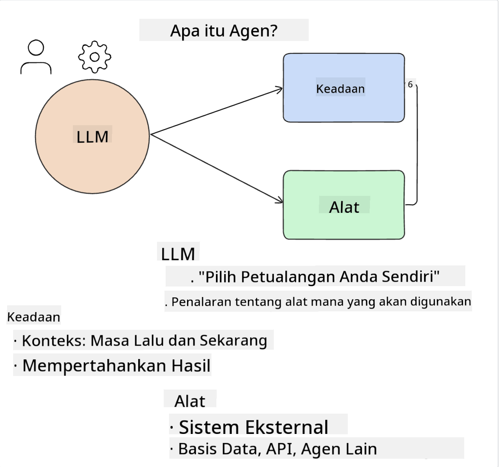
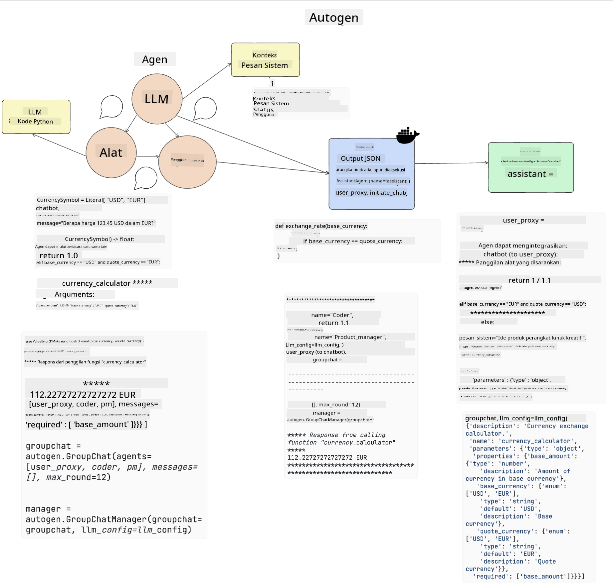
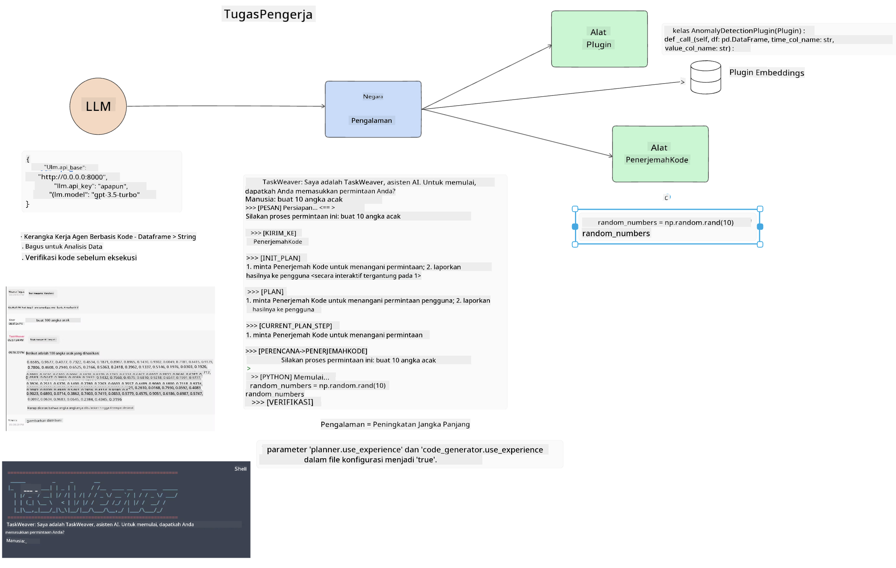
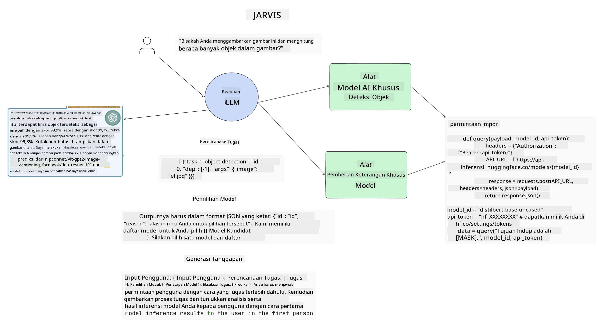

<!--
CO_OP_TRANSLATOR_METADATA:
{
  "original_hash": "11f03c81f190d9cbafd0f977dcbede6c",
  "translation_date": "2025-05-20T07:28:17+00:00",
  "source_file": "17-ai-agents/README.md",
  "language_code": "id"
}
-->
[](https://aka.ms/gen-ai-lesson17-gh?WT.mc_id=academic-105485-koreyst)

## Pendahuluan

Agen AI mewakili perkembangan menarik dalam Generative AI, memungkinkan Large Language Models (LLMs) untuk berkembang dari asisten menjadi agen yang mampu melakukan tindakan. Kerangka kerja Agen AI memungkinkan pengembang membuat aplikasi yang memberi LLM akses ke alat dan manajemen status. Kerangka kerja ini juga meningkatkan visibilitas, memungkinkan pengguna dan pengembang memantau tindakan yang direncanakan oleh LLM, sehingga meningkatkan manajemen pengalaman.

Pelajaran ini akan mencakup area berikut:

- Memahami apa itu Agen AI - Apa sebenarnya Agen AI?
- Menjelajahi empat kerangka kerja Agen AI yang berbeda - Apa yang membuatnya unik?
- Menerapkan Agen AI ini ke berbagai kasus penggunaan - Kapan kita harus menggunakan Agen AI?

## Tujuan Pembelajaran

Setelah mengikuti pelajaran ini, Anda akan dapat:

- Menjelaskan apa itu Agen AI dan bagaimana mereka dapat digunakan.
- Memahami perbedaan antara beberapa Kerangka Kerja Agen AI yang populer, dan bagaimana mereka berbeda.
- Memahami bagaimana Agen AI berfungsi untuk membangun aplikasi dengan mereka.

## Apa Itu Agen AI?

Agen AI adalah bidang yang sangat menarik dalam dunia Generative AI. Dengan kegembiraan ini terkadang muncul kebingungan istilah dan penerapannya. Untuk menjaga kesederhanaan dan inklusif dari sebagian besar alat yang merujuk pada Agen AI, kami akan menggunakan definisi ini:

Agen AI memungkinkan Large Language Models (LLMs) untuk melakukan tugas dengan memberi mereka akses ke **status** dan **alat**.



Mari kita definisikan istilah-istilah ini:

**Large Language Models** - Ini adalah model yang dirujuk sepanjang kursus ini seperti GPT-3.5, GPT-4, Llama-2, dll.

**Status** - Ini merujuk pada konteks di mana LLM bekerja. LLM menggunakan konteks dari tindakan masa lalunya dan konteks saat ini, membimbing pengambilan keputusannya untuk tindakan selanjutnya. Kerangka Kerja Agen AI memungkinkan pengembang untuk memelihara konteks ini lebih mudah.

**Alat** - Untuk menyelesaikan tugas yang diminta pengguna dan yang direncanakan oleh LLM, LLM memerlukan akses ke alat. Beberapa contoh alat bisa berupa database, API, aplikasi eksternal, atau bahkan LLM lainnya!

Definisi ini semoga memberikan Anda dasar yang baik ke depan saat kita melihat bagaimana mereka diterapkan. Mari kita jelajahi beberapa kerangka kerja Agen AI yang berbeda:

## LangChain Agents

[LangChain Agents](https://python.langchain.com/docs/how_to/#agents?WT.mc_id=academic-105485-koreyst) adalah implementasi dari definisi yang kami berikan di atas.

Untuk mengelola **status**, ia menggunakan fungsi bawaan yang disebut `AgentExecutor`. Ini menerima `agent` yang didefinisikan dan `tools` yang tersedia untuknya.

`Agent Executor` juga menyimpan riwayat obrolan untuk memberikan konteks obrolan.


LangChain menawarkan [katalog alat](https://integrations.langchain.com/tools?WT.mc_id=academic-105485-koreyst) yang dapat diimpor ke dalam aplikasi Anda di mana LLM dapat mendapatkan akses. Ini dibuat oleh komunitas dan tim LangChain.

Anda kemudian dapat mendefinisikan alat ini dan memberikannya kepada `Agent Executor`.

Visibilitas adalah aspek penting lainnya ketika berbicara tentang Agen AI. Penting bagi pengembang aplikasi untuk memahami alat mana yang digunakan LLM dan mengapa. Untuk itu, tim di LangChain telah mengembangkan LangSmith.

## AutoGen

Kerangka kerja Agen AI berikutnya yang akan kita bahas adalah [AutoGen](https://microsoft.github.io/autogen/?WT.mc_id=academic-105485-koreyst). Fokus utama AutoGen adalah percakapan. Agen bersifat **dapat berbicara** dan **dapat disesuaikan**.

**Dapat berbicara -** LLM dapat memulai dan melanjutkan percakapan dengan LLM lain untuk menyelesaikan tugas. Ini dilakukan dengan membuat `AssistantAgents` dan memberikan pesan sistem khusus kepada mereka.

```python

autogen.AssistantAgent( name="Coder", llm_config=llm_config, ) pm = autogen.AssistantAgent( name="Product_manager", system_message="Creative in software product ideas.", llm_config=llm_config, )

```

**Dapat disesuaikan** - Agen dapat didefinisikan tidak hanya sebagai LLM tetapi juga sebagai pengguna atau alat. Sebagai pengembang, Anda dapat mendefinisikan `UserProxyAgent` yang bertanggung jawab untuk berinteraksi dengan pengguna untuk umpan balik dalam menyelesaikan tugas. Umpan balik ini dapat melanjutkan eksekusi tugas atau menghentikannya.

```python
user_proxy = UserProxyAgent(name="user_proxy")
```

### Status dan Alat

Untuk mengubah dan mengelola status, Agen asisten menghasilkan kode Python untuk menyelesaikan tugas.

Berikut adalah contoh prosesnya:



#### LLM Didefinisikan dengan Pesan Sistem

```python
system_message="For weather related tasks, only use the functions you have been provided with. Reply TERMINATE when the task is done."
```

Pesan sistem ini mengarahkan LLM khusus ini ke fungsi mana yang relevan untuk tugasnya. Ingat, dengan AutoGen Anda dapat memiliki beberapa AssistantAgents yang didefinisikan dengan pesan sistem yang berbeda.

#### Obrolan Dimulai oleh Pengguna

```python
user_proxy.initiate_chat( chatbot, message="I am planning a trip to NYC next week, can you help me pick out what to wear? ", )

```

Pesan dari user_proxy (Manusia) inilah yang akan memulai proses Agen untuk mengeksplorasi fungsi yang mungkin harus dijalankan.

#### Fungsi Dieksekusi

```bash
chatbot (to user_proxy):

***** Suggested tool Call: get_weather ***** Arguments: {"location":"New York City, NY","time_periond:"7","temperature_unit":"Celsius"} ******************************************************** --------------------------------------------------------------------------------

>>>>>>>> EXECUTING FUNCTION get_weather... user_proxy (to chatbot): ***** Response from calling function "get_weather" ***** 112.22727272727272 EUR ****************************************************************

```

Setelah obrolan awal diproses, Agen akan mengirimkan alat yang disarankan untuk dipanggil. Dalam hal ini, ini adalah fungsi yang disebut `get_weather`. Depending on your configuration, this function can be automatically executed and read by the Agent or can be executed based on user input.

You can find a list of [AutoGen code samples](https://microsoft.github.io/autogen/docs/Examples/?WT.mc_id=academic-105485-koreyst) to further explore how to get started building.

## Taskweaver

The next agent framework we will explore is [Taskweaver](https://microsoft.github.io/TaskWeaver/?WT.mc_id=academic-105485-koreyst). It is known as a "code-first" agent because instead of working strictly with `strings` , it can work with DataFrames in Python. This becomes extremely useful for data analysis and generation tasks. This can be things like creating graphs and charts or generating random numbers.

### State and Tools

To manage the state of the conversation, TaskWeaver uses the concept of a `Planner`. The `Planner` is a LLM that takes the request from the users and maps out the tasks that need to be completed to fulfill this request.

To complete the tasks the `Planner` is exposed to the collection of tools called `Plugins`. Ini bisa berupa kelas Python atau interpreter kode umum. Plugin ini disimpan sebagai embeddings sehingga LLM dapat mencari plugin yang tepat dengan lebih baik.



Berikut adalah contoh plugin untuk menangani deteksi anomali:

```python
class AnomalyDetectionPlugin(Plugin): def __call__(self, df: pd.DataFrame, time_col_name: str, value_col_name: str):
```

Kode diverifikasi sebelum dieksekusi. Fitur lain untuk mengelola konteks dalam Taskweaver adalah `experience`. Experience allows for the context of a conversation to be stored over to the long term in a YAML file. This can be configured so that the LLM improves over time on certain tasks given that it is exposed to prior conversations.

## JARVIS

The last agent framework we will explore is [JARVIS](https://github.com/microsoft/JARVIS?tab=readme-ov-file?WT.mc_id=academic-105485-koreyst). What makes JARVIS unique is that it uses an LLM to manage the `state` dari percakapan dan `tools` adalah model AI lainnya. Setiap model AI adalah model khusus yang melakukan tugas tertentu seperti deteksi objek, transkripsi, atau penjelasan gambar.



LLM, sebagai model tujuan umum, menerima permintaan dari pengguna dan mengidentifikasi tugas spesifik dan argumen/data apa yang dibutuhkan untuk menyelesaikan tugas.

```python
[{"task": "object-detection", "id": 0, "dep": [-1], "args": {"image": "e1.jpg" }}]
```

LLM kemudian memformat permintaan dengan cara yang dapat diinterpretasikan oleh model AI khusus, seperti JSON. Setelah model AI mengembalikan prediksinya berdasarkan tugas, LLM menerima tanggapannya.

Jika beberapa model diperlukan untuk menyelesaikan tugas, itu juga akan menginterpretasikan tanggapan dari model tersebut sebelum menggabungkannya untuk menghasilkan tanggapan kepada pengguna.

Contoh di bawah ini menunjukkan bagaimana ini akan bekerja ketika seorang pengguna meminta deskripsi dan jumlah objek dalam gambar:

## Tugas

Untuk melanjutkan pembelajaran Anda tentang Agen AI, Anda dapat membangun dengan AutoGen:

- Sebuah aplikasi yang mensimulasikan pertemuan bisnis dengan departemen berbeda dari startup pendidikan.
- Buat pesan sistem yang membimbing LLM dalam memahami berbagai persona dan prioritas, dan memungkinkan pengguna untuk mempresentasikan ide produk baru.
- LLM kemudian harus menghasilkan pertanyaan lanjutan dari setiap departemen untuk menyempurnakan dan meningkatkan presentasi dan ide produk

## Pembelajaran tidak berhenti di sini, lanjutkan Perjalanan

Setelah menyelesaikan pelajaran ini, lihat [koleksi Pembelajaran Generative AI](https://aka.ms/genai-collection?WT.mc_id=academic-105485-koreyst) kami untuk terus meningkatkan pengetahuan Generative AI Anda!

**Penafian**:  
Dokumen ini telah diterjemahkan menggunakan layanan penerjemahan AI [Co-op Translator](https://github.com/Azure/co-op-translator). Meskipun kami berusaha untuk mencapai akurasi, harap diketahui bahwa terjemahan otomatis dapat mengandung kesalahan atau ketidakakuratan. Dokumen asli dalam bahasa aslinya harus dianggap sebagai sumber yang berwenang. Untuk informasi penting, disarankan untuk menggunakan terjemahan manusia profesional. Kami tidak bertanggung jawab atas kesalahpahaman atau penafsiran yang salah yang timbul dari penggunaan terjemahan ini.