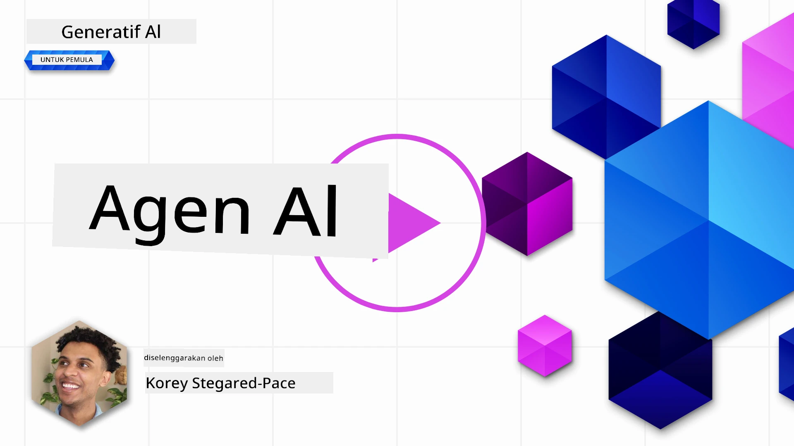
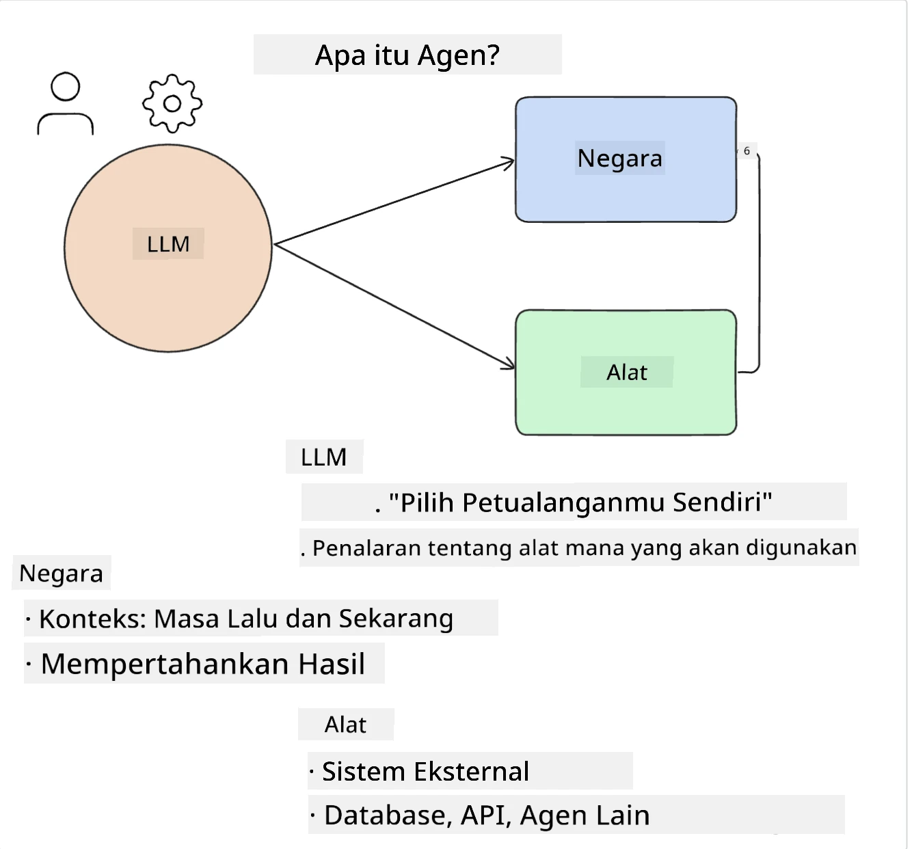
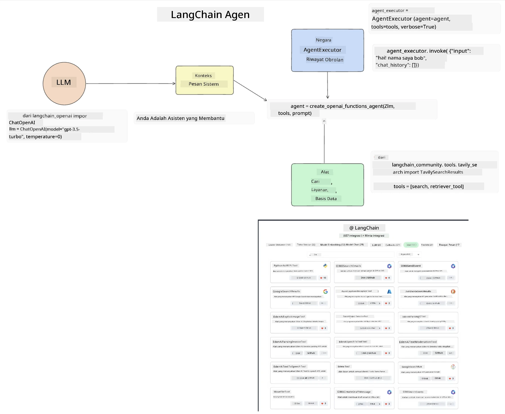
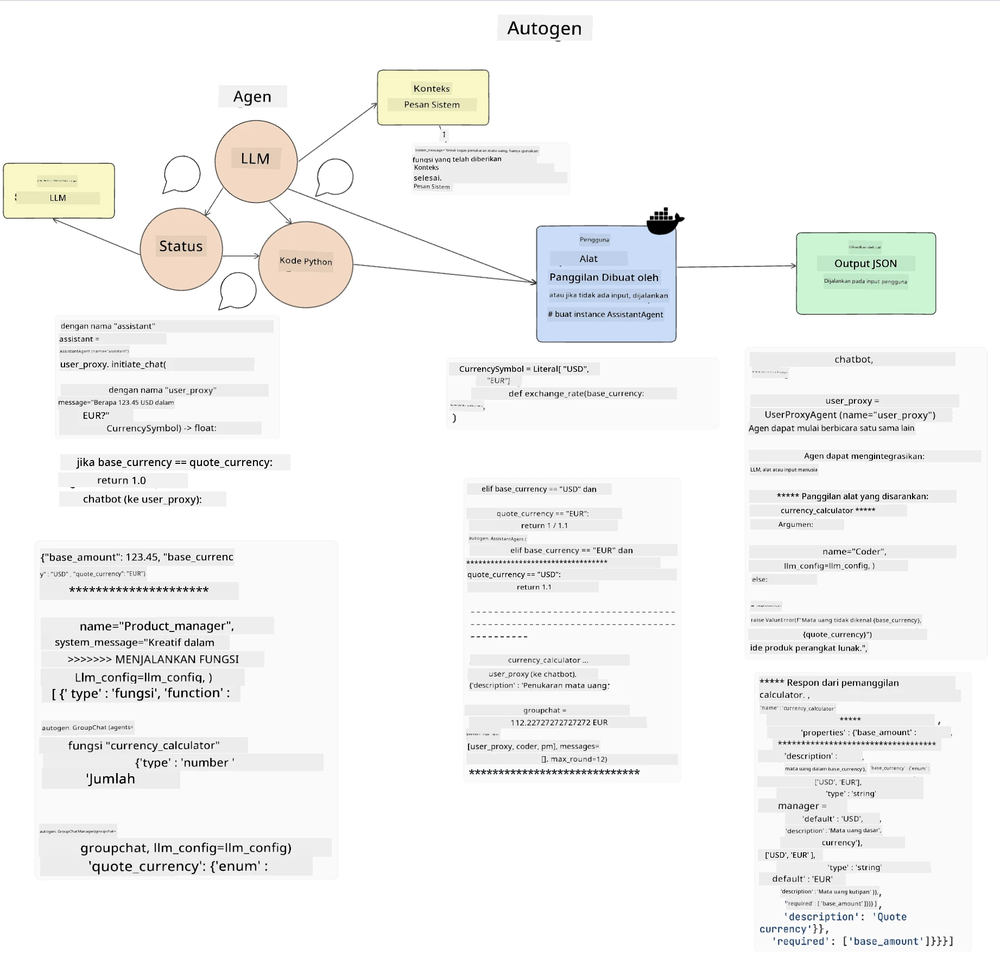
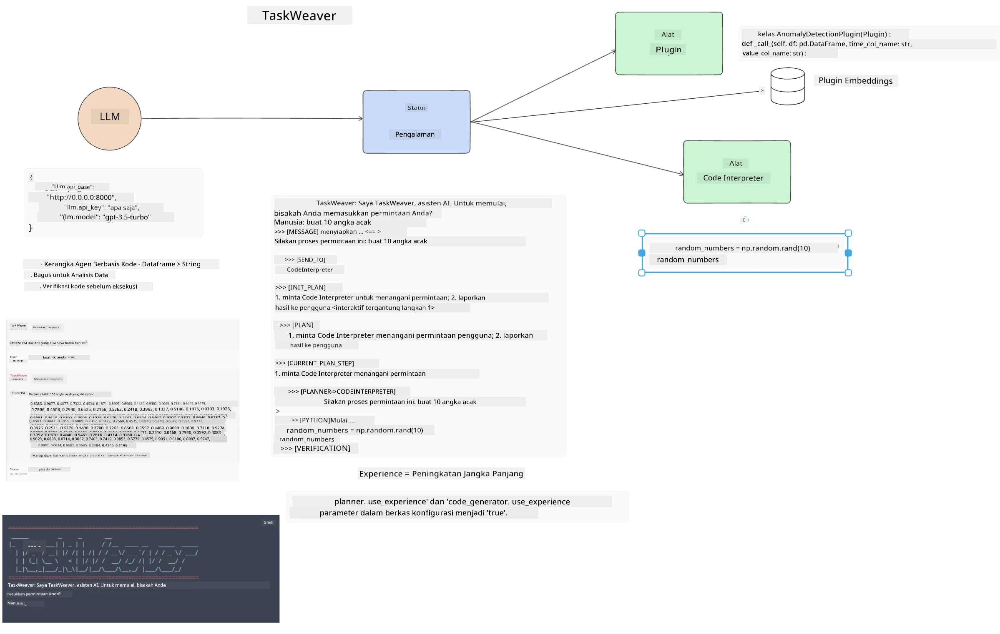
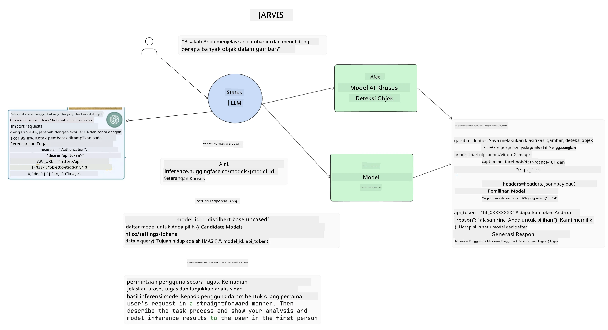

[](https://youtu.be/yAXVW-lUINc?si=bOtW9nL6jc3XJgOM)

## Pendahuluan

AI Agents merupakan perkembangan menarik dalam Generative AI, memungkinkan Large Language Models (LLMs) berkembang dari asisten menjadi agen yang mampu mengambil tindakan. Kerangka kerja AI Agent memungkinkan pengembang untuk membuat aplikasi yang memberikan akses LLM ke alat dan manajemen status. Kerangka kerja ini juga meningkatkan visibilitas, memungkinkan pengguna dan pengembang memantau tindakan yang direncanakan oleh LLM, sehingga memperbaiki manajemen pengalaman.

Pelajaran ini akan membahas area berikut:

- Memahami apa itu AI Agent - Apa sebenarnya AI Agent itu?
- Mengeksplorasi empat kerangka kerja AI Agent yang berbeda - Apa yang membuatnya unik?
- Menerapkan AI Agents ini ke berbagai kasus penggunaan - Kapan kita harus menggunakan AI Agents?

## Tujuan Pembelajaran

Setelah mengikuti pelajaran ini, Anda akan dapat:

- Menjelaskan apa itu AI Agents dan bagaimana mereka dapat digunakan.
- Memahami perbedaan beberapa Kerangka Kerja AI Agent populer, dan bagaimana mereka berbeda.
- Memahami cara kerja AI Agents untuk membangun aplikasi dengan mereka.

## Apa Itu AI Agents?

AI Agents adalah bidang yang sangat menarik dalam dunia Generative AI. Dengan kegembiraan ini kadang muncul kebingungan tentang istilah dan aplikasinya. Untuk menyederhanakan dan mencakup sebagian besar alat yang merujuk pada AI Agents, kami akan menggunakan definisi ini:

AI Agents memungkinkan Large Language Models (LLMs) untuk melakukan tugas dengan memberikan mereka akses ke **status** dan **alat**.



Mari kita definisikan istilah ini:

**Large Language Models** - Ini adalah model yang dirujuk sepanjang kursus ini seperti GPT-3.5, GPT-4, Llama-2, dll.

**Status** - Ini merujuk pada konteks di mana LLM bekerja. LLM menggunakan konteks tindakan masa lalu dan konteks saat ini, membimbing pengambilan keputusan untuk tindakan selanjutnya. Kerangka kerja AI Agent memungkinkan pengembang untuk lebih mudah mempertahankan konteks ini.

**Alat** - Untuk menyelesaikan tugas yang diminta pengguna dan yang telah direncanakan oleh LLM, LLM membutuhkan akses ke alat. Beberapa contoh alat bisa berupa basis data, API, aplikasi eksternal, atau bahkan LLM yang lain!

Definisi ini diharapkan memberikan dasar yang baik kedepannya saat kita melihat bagaimana mereka diimplementasikan. Mari kita jelajahi beberapa kerangka kerja AI Agent yang berbeda:

## LangChain Agents

[LangChain Agents](https://python.langchain.com/docs/how_to/#agents?WT.mc_id=academic-105485-koreyst) adalah implementasi dari definisi yang kami berikan di atas.

Untuk mengelola **status**, digunakan fungsi bawaan bernama `AgentExecutor`. Fungsi ini menerima `agent` yang didefinisikan dan `tools` yang tersedia untuknya.

`Agent Executor` juga menyimpan riwayat chat untuk menyediakan konteks dari obrolan tersebut.



LangChain menawarkan [katalog alat](https://integrations.langchain.com/tools?WT.mc_id=academic-105485-koreyst) yang dapat diimpor ke aplikasi Anda dan dapat diakses oleh LLM. Alat-alat ini dibuat oleh komunitas dan tim LangChain.

Anda kemudian dapat mendefinisikan alat ini dan melewatkannya ke `Agent Executor`.

Visibilitas adalah aspek penting lainnya saat membicarakan AI Agents. Penting bagi pengembang aplikasi untuk memahami alat mana yang digunakan LLM dan mengapa. Untuk itu, tim di LangChain mengembangkan LangSmith.

## AutoGen

Kerangka kerja AI Agent berikut yang akan dibahas adalah [AutoGen](https://microsoft.github.io/autogen/?WT.mc_id=academic-105485-koreyst). Fokus utama AutoGen adalah percakapan. Agen bersifat **dapat diajak bicara** dan **dapat dikustomisasi**.

**Dapat diajak bicara -** LLM dapat memulai dan melanjutkan percakapan dengan LLM lain untuk menyelesaikan tugas. Ini dilakukan dengan membuat `AssistantAgents` dan memberikan mereka pesan sistem tertentu.

```python

autogen.AssistantAgent( name="Coder", llm_config=llm_config, ) pm = autogen.AssistantAgent( name="Product_manager", system_message="Creative in software product ideas.", llm_config=llm_config, )

```

**Dapat dikustomisasi** - Agen dapat didefinisikan tidak hanya sebagai LLM tetapi juga sebagai pengguna atau alat. Sebagai pengembang, Anda dapat mendefinisikan `UserProxyAgent` yang bertanggung jawab berinteraksi dengan pengguna untuk mendapatkan umpan balik dalam menyelesaikan tugas. Umpan balik ini dapat melanjutkan pelaksanaan tugas atau menghentikannya.

```python
user_proxy = UserProxyAgent(name="user_proxy")
```

### Status dan Alat

Untuk mengubah dan mengelola status, agen asisten menghasilkan kode Python untuk menyelesaikan tugas.

Berikut adalah contoh prosesnya:



#### LLM Didefinisikan dengan Pesan Sistem

```python
system_message="For weather related tasks, only use the functions you have been provided with. Reply TERMINATE when the task is done."
```

Pesan sistem ini mengarahkan LLM spesifik ini mengenai fungsi apa yang relevan untuk tugasnya. Ingat, dengan AutoGen Anda bisa memiliki beberapa AssistantAgents dengan pesan sistem berbeda.

#### Percakapan Dimulai oleh Pengguna

```python
user_proxy.initiate_chat( chatbot, message="I am planning a trip to NYC next week, can you help me pick out what to wear? ", )

```

Pesan dari user_proxy (Manusia) ini yang memulai proses Agen untuk menjelajahi fungsi yang mungkin harus dijalankan.

#### Fungsi Dieksekusi

```bash
chatbot (to user_proxy):

***** Suggested tool Call: get_weather ***** Arguments: {"location":"New York City, NY","time_periond:"7","temperature_unit":"Celsius"} ******************************************************** --------------------------------------------------------------------------------

>>>>>>>> EXECUTING FUNCTION get_weather... user_proxy (to chatbot): ***** Response from calling function "get_weather" ***** 112.22727272727272 EUR ****************************************************************

```

Setelah percakapan awal diproses, Agen akan mengirim saran alat untuk digunakan. Dalam kasus ini, fungsi bernama `get_weather`. Bergantung konfigurasi Anda, fungsi ini bisa otomatis dieksekusi dan dibaca Agen atau dieksekusi berdasar input pengguna.

Anda dapat menemukan daftar [contoh kode AutoGen](https://microsoft.github.io/autogen/docs/Examples/?WT.mc_id=academic-105485-koreyst) untuk mengeksplorasi lebih lanjut bagaimana memulai pembangunan.

## Taskweaver

Kerangka kerja agen berikut yang akan kita eksplorasi adalah [Taskweaver](https://microsoft.github.io/TaskWeaver/?WT.mc_id=academic-105485-koreyst). Ini dikenal sebagai agen "berbasis kode" karena alih-alih bekerja hanya dengan `string`, ini dapat bekerja dengan DataFrame di Python. Ini sangat berguna untuk tugas analisis dan generasi data. Bisa berupa membuat grafik dan diagram atau menghasilkan angka acak.

### Status dan Alat

Untuk mengelola status percakapan, TaskWeaver menggunakan konsep `Planner`. `Planner` adalah LLM yang mengambil permintaan dari pengguna dan memetakan tugas-tugas yang perlu diselesaikan untuk memenuhi permintaan ini.

Untuk menyelesaikan tugas, `Planner` diberikan akses ke kumpulan alat yang disebut `Plugins`. Ini bisa kelas Python atau interpreter kode umum. Plugin ini disimpan sebagai embedding sehingga LLM dapat lebih mudah mencari plugin yang tepat.



Berikut contoh plugin untuk menangani deteksi anomali:

```python
class AnomalyDetectionPlugin(Plugin): def __call__(self, df: pd.DataFrame, time_col_name: str, value_col_name: str):
```

Kode tersebut diverifikasi sebelum dieksekusi. Fitur lain untuk mengelola konteks di Taskweaver adalah `experience`. Experience memungkinkan konteks percakapan disimpan dalam jangka panjang dalam file YAML. Ini dapat dikonfigurasi sehingga LLM meningkat dari waktu ke waktu pada tugas tertentu selama terpapar percakapan sebelumnya.

## JARVIS

Kerangka kerja agen terakhir yang akan kita eksplorasi adalah [JARVIS](https://github.com/microsoft/JARVIS?tab=readme-ov-file&WT.mc_id=academic-105485-koreyst). Yang membuat JARVIS unik adalah ia menggunakan LLM untuk mengelola `status` percakapan dan `tools` adalah model AI lain. Setiap model AI ini adalah model khusus yang menjalankan tugas tertentu seperti deteksi objek, transkripsi, atau deskripsi gambar.



LLM, yang merupakan model tujuan umum, menerima permintaan dari pengguna dan mengidentifikasi tugas spesifik dan argumen/data yang diperlukan untuk menyelesaikan tugas.

```python
[{"task": "object-detection", "id": 0, "dep": [-1], "args": {"image": "e1.jpg" }}]
```

LLM kemudian memformat permintaan dalam format yang dapat diinterpretasikan model AI khusus, seperti JSON. Setelah model AI mengembalikan prediksi berdasarkan tugas, LLM menerima respons.

Jika beberapa model dibutuhkan untuk menyelesaikan tugas, LLM juga akan menginterpretasi respons dari model-model tersebut sebelum menggabungkannya untuk menghasilkan jawaban kepada pengguna.

Contoh di bawah menunjukkan bagaimana ini bekerja ketika pengguna meminta deskripsi dan jumlah objek dalam sebuah gambar:

## Tugas

Untuk melanjutkan pembelajaran AI Agents Anda dapat membangun dengan AutoGen:

- Sebuah aplikasi yang mensimulasikan rapat bisnis dengan berbagai departemen dari startup pendidikan.
- Buat pesan sistem yang memandu LLM dalam memahami persona dan prioritas yang berbeda, serta memungkinkan pengguna mempresentasikan ide produk baru.
- LLM kemudian harus menghasilkan pertanyaan tindak lanjut dari setiap departemen untuk menyempurnakan dan meningkatkan presentasi serta ide produk.

## Pembelajaran tidak berhenti di sini, lanjutkan Perjalanan

Setelah menyelesaikan pelajaran ini, lihat [koleksi Pembelajaran Generative AI](https://aka.ms/genai-collection?WT.mc_id=academic-105485-koreyst) kami untuk terus meningkatkan pengetahuan Generative AI Anda!

---

<!-- CO-OP TRANSLATOR DISCLAIMER START -->
**Penafian**:  
Dokumen ini telah diterjemahkan menggunakan layanan terjemahan AI [Co-op Translator](https://github.com/Azure/co-op-translator). Meskipun kami berupaya untuk mendapatkan akurasi, harap diketahui bahwa terjemahan otomatis mungkin mengandung kesalahan atau ketidaktepatan. Dokumen asli dalam bahasa aslinya harus dianggap sebagai sumber yang sahih. Untuk informasi penting, disarankan menggunakan jasa terjemahan profesional oleh manusia. Kami tidak bertanggung jawab atas kesalahpahaman atau interpretasi yang salah yang timbul dari penggunaan terjemahan ini.
<!-- CO-OP TRANSLATOR DISCLAIMER END -->