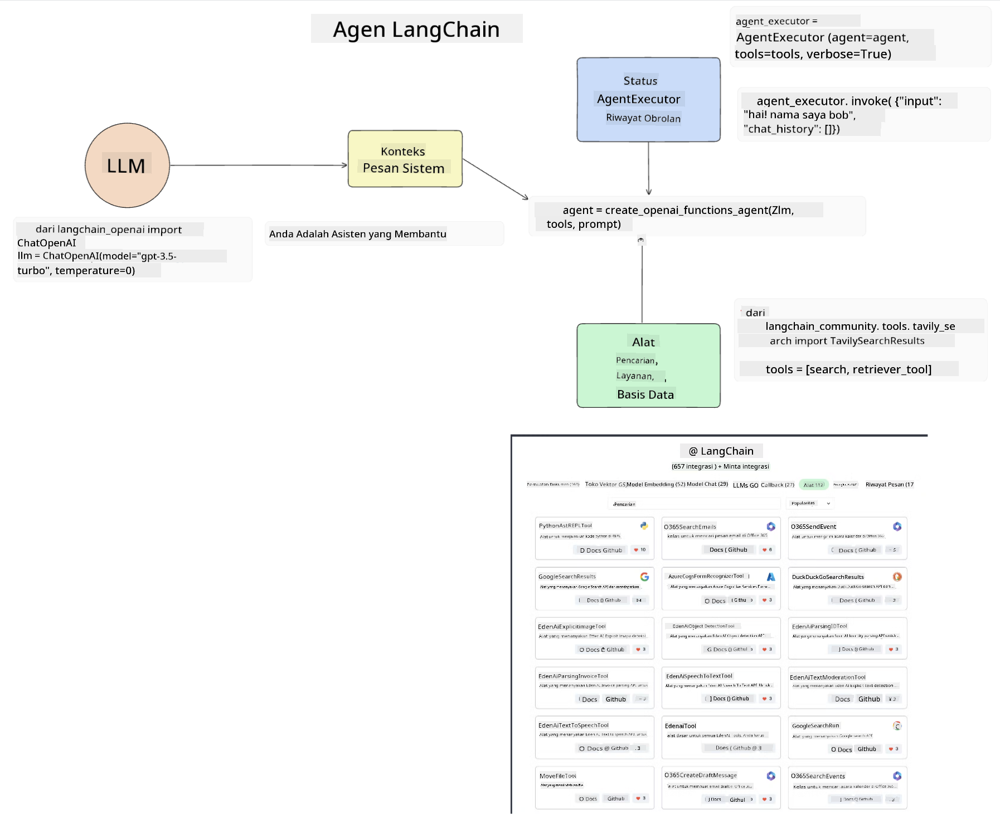
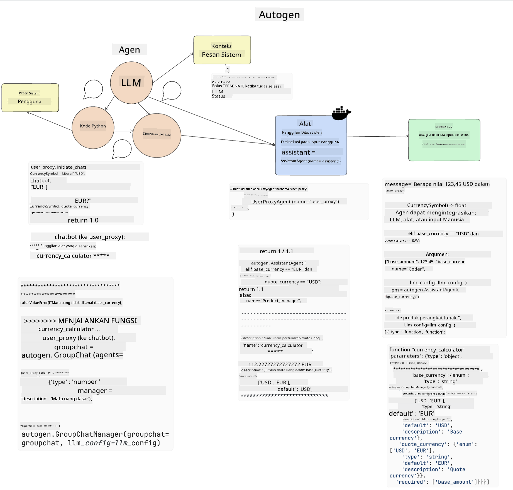
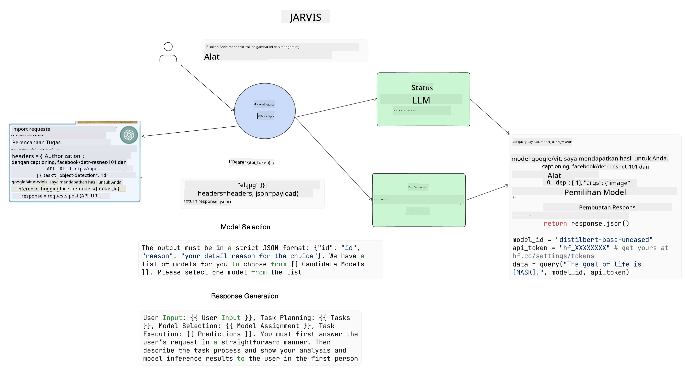

<!--
CO_OP_TRANSLATOR_METADATA:
{
  "original_hash": "11f03c81f190d9cbafd0f977dcbede6c",
  "translation_date": "2025-07-09T17:28:39+00:00",
  "source_file": "17-ai-agents/README.md",
  "language_code": "id"
}
-->
[](https://aka.ms/gen-ai-lesson17-gh?WT.mc_id=academic-105485-koreyst)

## Pendahuluan

AI Agents merupakan perkembangan menarik dalam Generative AI, yang memungkinkan Large Language Models (LLMs) berkembang dari asisten menjadi agen yang mampu mengambil tindakan. Kerangka kerja AI Agent memungkinkan pengembang membuat aplikasi yang memberikan akses LLM ke alat dan manajemen status. Kerangka kerja ini juga meningkatkan visibilitas, memungkinkan pengguna dan pengembang memantau tindakan yang direncanakan oleh LLM, sehingga meningkatkan pengelolaan pengalaman.

Pelajaran ini akan membahas area berikut:

- Memahami apa itu AI Agent - Apa sebenarnya AI Agent itu?
- Menjelajahi empat kerangka kerja AI Agent yang berbeda - Apa yang membuatnya unik?
- Menerapkan AI Agents ini ke berbagai kasus penggunaan - Kapan kita harus menggunakan AI Agents?

## Tujuan Pembelajaran

Setelah mengikuti pelajaran ini, Anda akan dapat:

- Menjelaskan apa itu AI Agents dan bagaimana cara menggunakannya.
- Memahami perbedaan antara beberapa kerangka kerja AI Agent populer, dan bagaimana mereka berbeda.
- Memahami cara kerja AI Agents untuk membangun aplikasi dengan mereka.

## Apa Itu AI Agents?

AI Agents adalah bidang yang sangat menarik dalam dunia Generative AI. Dengan antusiasme ini terkadang muncul kebingungan tentang istilah dan penerapannya. Untuk menyederhanakan dan mencakup sebagian besar alat yang merujuk pada AI Agents, kita akan menggunakan definisi ini:

AI Agents memungkinkan Large Language Models (LLMs) melakukan tugas dengan memberikan akses ke **state** dan **tools**.


Mari kita definisikan istilah-istilah ini:

**Large Language Models** - Ini adalah model yang disebutkan sepanjang kursus ini seperti GPT-3.5, GPT-4, Llama-2, dan lain-lain.

**State** - Ini merujuk pada konteks tempat LLM bekerja. LLM menggunakan konteks dari tindakan sebelumnya dan konteks saat ini untuk mengarahkan pengambilan keputusan pada tindakan berikutnya. Kerangka kerja AI Agent memudahkan pengembang untuk mempertahankan konteks ini.

**Tools** - Untuk menyelesaikan tugas yang diminta pengguna dan direncanakan oleh LLM, LLM membutuhkan akses ke alat. Contoh alat bisa berupa database, API, aplikasi eksternal, atau bahkan LLM lain!

Definisi ini diharapkan memberikan dasar yang baik saat kita melihat bagaimana mereka diimplementasikan. Mari kita jelajahi beberapa kerangka kerja AI Agent yang berbeda:

## LangChain Agents

[LangChain Agents](https://python.langchain.com/docs/how_to/#agents?WT.mc_id=academic-105485-koreyst) adalah implementasi dari definisi yang telah kita berikan di atas.

Untuk mengelola **state**, LangChain menggunakan fungsi bawaan yang disebut `AgentExecutor`. Fungsi ini menerima `agent` yang telah didefinisikan dan `tools` yang tersedia untuknya.

`AgentExecutor` juga menyimpan riwayat chat untuk memberikan konteks percakapan.



LangChain menawarkan [katalog alat](https://integrations.langchain.com/tools?WT.mc_id=academic-105485-koreyst) yang dapat diimpor ke aplikasi Anda dan dapat diakses oleh LLM. Alat-alat ini dibuat oleh komunitas dan tim LangChain.

Anda kemudian dapat mendefinisikan alat-alat ini dan memberikannya ke `AgentExecutor`.

Visibilitas adalah aspek penting lainnya saat membahas AI Agents. Penting bagi pengembang aplikasi untuk memahami alat mana yang digunakan LLM dan alasannya. Untuk itu, tim LangChain mengembangkan LangSmith.

## AutoGen

Kerangka kerja AI Agent berikutnya yang akan kita bahas adalah [AutoGen](https://microsoft.github.io/autogen/?WT.mc_id=academic-105485-koreyst). Fokus utama AutoGen adalah percakapan. Agen bersifat **conversable** dan **customizable**.

**Conversable -** LLM dapat memulai dan melanjutkan percakapan dengan LLM lain untuk menyelesaikan tugas. Ini dilakukan dengan membuat `AssistantAgents` dan memberikan pesan sistem tertentu.

```python

autogen.AssistantAgent( name="Coder", llm_config=llm_config, ) pm = autogen.AssistantAgent( name="Product_manager", system_message="Creative in software product ideas.", llm_config=llm_config, )

```

**Customizable** - Agen dapat didefinisikan tidak hanya sebagai LLM tetapi juga sebagai pengguna atau alat. Sebagai pengembang, Anda dapat mendefinisikan `UserProxyAgent` yang bertanggung jawab berinteraksi dengan pengguna untuk mendapatkan umpan balik dalam menyelesaikan tugas. Umpan balik ini dapat melanjutkan eksekusi tugas atau menghentikannya.

```python
user_proxy = UserProxyAgent(name="user_proxy")
```

### State dan Tools

Untuk mengubah dan mengelola state, Assistant Agent menghasilkan kode Python untuk menyelesaikan tugas.

Berikut contoh prosesnya:



#### LLM Didefinisikan dengan Pesan Sistem

```python
system_message="For weather related tasks, only use the functions you have been provided with. Reply TERMINATE when the task is done."
```

Pesan sistem ini mengarahkan LLM tertentu ini ke fungsi-fungsi yang relevan untuk tugasnya. Ingat, dengan AutoGen Anda dapat memiliki beberapa AssistantAgents yang didefinisikan dengan pesan sistem berbeda.

#### Chat Dimulai oleh Pengguna

```python
user_proxy.initiate_chat( chatbot, message="I am planning a trip to NYC next week, can you help me pick out what to wear? ", )

```

Pesan dari user_proxy (Manusia) ini akan memulai proses Agent untuk mengeksplorasi fungsi-fungsi yang mungkin harus dijalankan.

#### Fungsi Dieksekusi

```bash
chatbot (to user_proxy):

***** Suggested tool Call: get_weather ***** Arguments: {"location":"New York City, NY","time_periond:"7","temperature_unit":"Celsius"} ******************************************************** --------------------------------------------------------------------------------

>>>>>>>> EXECUTING FUNCTION get_weather... user_proxy (to chatbot): ***** Response from calling function "get_weather" ***** 112.22727272727272 EUR ****************************************************************

```

Setelah chat awal diproses, Agent akan mengirimkan alat yang disarankan untuk dipanggil. Dalam kasus ini, fungsi bernama `get_weather`. Tergantung pada konfigurasi Anda, fungsi ini dapat dieksekusi otomatis dan dibaca oleh Agent atau dieksekusi berdasarkan input pengguna.

Anda dapat menemukan daftar [contoh kode AutoGen](https://microsoft.github.io/autogen/docs/Examples/?WT.mc_id=academic-105485-koreyst) untuk mengeksplorasi lebih lanjut cara memulai pembangunan.

## Taskweaver

Kerangka kerja agent berikutnya yang akan kita jelajahi adalah [Taskweaver](https://microsoft.github.io/TaskWeaver/?WT.mc_id=academic-105485-koreyst). Ini dikenal sebagai agen "code-first" karena alih-alih bekerja hanya dengan `strings`, ia dapat bekerja dengan DataFrames di Python. Ini sangat berguna untuk tugas analisis dan generasi data. Contohnya seperti membuat grafik dan chart atau menghasilkan angka acak.

### State dan Tools

Untuk mengelola state percakapan, TaskWeaver menggunakan konsep `Planner`. `Planner` adalah LLM yang menerima permintaan dari pengguna dan memetakan tugas-tugas yang perlu diselesaikan untuk memenuhi permintaan tersebut.

Untuk menyelesaikan tugas, `Planner` diberikan akses ke kumpulan alat yang disebut `Plugins`. Ini bisa berupa kelas Python atau interpreter kode umum. Plugin ini disimpan sebagai embeddings agar LLM dapat mencari plugin yang tepat dengan lebih baik.


Berikut contoh plugin untuk menangani deteksi anomali:

```python
class AnomalyDetectionPlugin(Plugin): def __call__(self, df: pd.DataFrame, time_col_name: str, value_col_name: str):
```

Kode ini diverifikasi sebelum dieksekusi. Fitur lain untuk mengelola konteks di Taskweaver adalah `experience`. Experience memungkinkan konteks percakapan disimpan dalam jangka panjang di file YAML. Ini dapat dikonfigurasi agar LLM meningkat seiring waktu pada tugas tertentu dengan paparan percakapan sebelumnya.

## JARVIS

Kerangka kerja agent terakhir yang akan kita jelajahi adalah [JARVIS](https://github.com/microsoft/JARVIS?tab=readme-ov-file?WT.mc_id=academic-105485-koreyst). Yang membuat JARVIS unik adalah ia menggunakan LLM untuk mengelola `state` percakapan dan `tools` adalah model AI lain. Setiap model AI ini adalah model khusus yang melakukan tugas tertentu seperti deteksi objek, transkripsi, atau pembuatan caption gambar.



LLM, sebagai model tujuan umum, menerima permintaan dari pengguna dan mengidentifikasi tugas spesifik serta argumen/data yang diperlukan untuk menyelesaikan tugas.

```python
[{"task": "object-detection", "id": 0, "dep": [-1], "args": {"image": "e1.jpg" }}]
```

LLM kemudian memformat permintaan dalam bentuk yang dapat diinterpretasikan oleh model AI khusus, seperti JSON. Setelah model AI mengembalikan prediksinya berdasarkan tugas, LLM menerima respons tersebut.

Jika beberapa model diperlukan untuk menyelesaikan tugas, LLM juga akan menginterpretasikan respons dari model-model tersebut sebelum menggabungkannya untuk menghasilkan respons kepada pengguna.

Contoh di bawah menunjukkan bagaimana ini bekerja saat pengguna meminta deskripsi dan jumlah objek dalam sebuah gambar:

## Tugas

Untuk melanjutkan pembelajaran Anda tentang AI Agents, Anda dapat membangun dengan AutoGen:

- Sebuah aplikasi yang mensimulasikan rapat bisnis dengan berbagai departemen dari startup pendidikan.
- Membuat pesan sistem yang membimbing LLM dalam memahami berbagai persona dan prioritas, serta memungkinkan pengguna untuk mempresentasikan ide produk baru.
- LLM kemudian harus menghasilkan pertanyaan lanjutan dari setiap departemen untuk menyempurnakan dan meningkatkan presentasi serta ide produk tersebut.

## Pembelajaran tidak berhenti di sini, lanjutkan Perjalanan

Setelah menyelesaikan pelajaran ini, lihat koleksi [Generative AI Learning](https://aka.ms/genai-collection?WT.mc_id=academic-105485-koreyst) kami untuk terus meningkatkan pengetahuan Generative AI Anda!

**Penafian**:  
Dokumen ini telah diterjemahkan menggunakan layanan terjemahan AI [Co-op Translator](https://github.com/Azure/co-op-translator). Meskipun kami berupaya untuk mencapai akurasi, harap diketahui bahwa terjemahan otomatis mungkin mengandung kesalahan atau ketidakakuratan. Dokumen asli dalam bahasa aslinya harus dianggap sebagai sumber yang sahih. Untuk informasi penting, disarankan menggunakan terjemahan profesional oleh manusia. Kami tidak bertanggung jawab atas kesalahpahaman atau penafsiran yang keliru yang timbul dari penggunaan terjemahan ini.