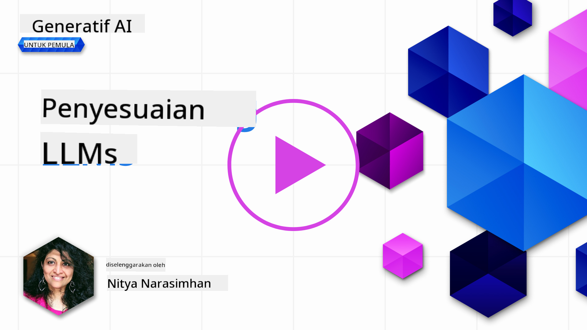
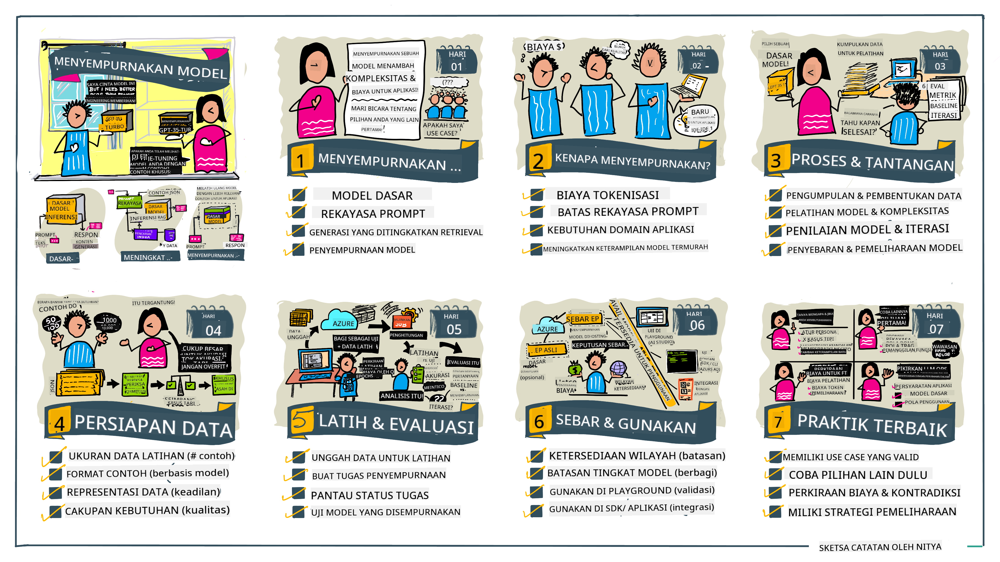

<!--
CO_OP_TRANSLATOR_METADATA:
{
  "original_hash": "68664f7e754a892ae1d8d5e2b7bd2081",
  "translation_date": "2025-05-20T07:53:51+00:00",
  "source_file": "18-fine-tuning/README.md",
  "language_code": "id"
}
-->

# Menyempurnakan LLM Anda

Menggunakan model bahasa besar untuk membangun aplikasi AI generatif datang dengan tantangan baru. Masalah utama adalah memastikan kualitas respons (akurat dan relevan) dalam konten yang dihasilkan oleh model untuk permintaan pengguna tertentu. Dalam pelajaran sebelumnya, kita membahas teknik seperti rekayasa prompt dan generasi berbasis pengambilan yang mencoba menyelesaikan masalah dengan _memodifikasi input prompt_ ke model yang ada.

Dalam pelajaran hari ini, kita membahas teknik ketiga, **penyempurnaan**, yang mencoba mengatasi tantangan dengan _melatih ulang model itu sendiri_ dengan data tambahan. Mari kita telusuri lebih dalam.

## Tujuan Pembelajaran

Pelajaran ini memperkenalkan konsep penyempurnaan untuk model bahasa pra-terlatih, mengeksplorasi manfaat dan tantangan dari pendekatan ini, dan memberikan panduan tentang kapan dan bagaimana menggunakan penyempurnaan untuk meningkatkan kinerja model AI generatif Anda.

Pada akhir pelajaran ini, Anda harus dapat menjawab pertanyaan-pertanyaan berikut:

- Apa itu penyempurnaan untuk model bahasa?
- Kapan, dan mengapa, penyempurnaan berguna?
- Bagaimana saya bisa menyempurnakan model pra-terlatih?
- Apa keterbatasan dari penyempurnaan?

Siap? Mari kita mulai.

## Panduan Bergambar

Ingin mendapatkan gambaran besar tentang apa yang akan kita bahas sebelum kita mendalami? Lihat panduan bergambar ini yang menggambarkan perjalanan pembelajaran untuk pelajaran ini - dari mempelajari konsep inti dan motivasi untuk penyempurnaan, hingga memahami proses dan praktik terbaik untuk melaksanakan tugas penyempurnaan. Ini adalah topik yang menarik untuk dieksplorasi, jadi jangan lupa untuk memeriksa halaman [Sumber Daya](./RESOURCES.md?WT.mc_id=academic-105485-koreyst) untuk tautan tambahan yang mendukung perjalanan pembelajaran mandiri Anda!

## Apa itu penyempurnaan untuk model bahasa?

Secara definisi, model bahasa besar adalah _pra-terlatih_ pada sejumlah besar teks yang bersumber dari berbagai sumber termasuk internet. Seperti yang telah kita pelajari dalam pelajaran sebelumnya, kita memerlukan teknik seperti _rekayasa prompt_ dan _generasi berbasis pengambilan_ untuk meningkatkan kualitas respons model terhadap pertanyaan pengguna ("prompt").

Salah satu teknik rekayasa prompt yang populer melibatkan memberikan lebih banyak panduan kepada model tentang apa yang diharapkan dalam respons baik dengan memberikan _instruksi_ (panduan eksplisit) atau _memberikan beberapa contoh_ (panduan implisit). Ini disebut sebagai _pembelajaran few-shot_ tetapi memiliki dua keterbatasan:

- Batas token model dapat membatasi jumlah contoh yang dapat Anda berikan, dan membatasi efektivitas.
- Biaya token model dapat membuatnya mahal untuk menambahkan contoh ke setiap prompt, dan membatasi fleksibilitas.

Penyempurnaan adalah praktik umum dalam sistem pembelajaran mesin di mana kita mengambil model pra-terlatih dan melatih ulang dengan data baru untuk meningkatkan kinerjanya pada tugas tertentu. Dalam konteks model bahasa, kita dapat menyempurnakan model pra-terlatih _dengan serangkaian contoh yang dikurasi untuk tugas atau domain aplikasi tertentu_ untuk menciptakan **model kustom** yang mungkin lebih akurat dan relevan untuk tugas atau domain tertentu. Manfaat sampingan dari penyempurnaan adalah bahwa hal itu juga dapat mengurangi jumlah contoh yang dibutuhkan untuk pembelajaran few-shot - mengurangi penggunaan token dan biaya terkait.

## Kapan dan mengapa kita harus menyempurnakan model?

Dalam konteks _ini_, ketika kita berbicara tentang penyempurnaan, kita merujuk pada penyempurnaan **terawasi** di mana pelatihan ulang dilakukan dengan **menambahkan data baru** yang tidak menjadi bagian dari dataset pelatihan asli. Ini berbeda dengan pendekatan penyempurnaan tak terawasi di mana model dilatih ulang pada data asli, tetapi dengan hiperparameter yang berbeda.

Hal penting yang perlu diingat adalah bahwa penyempurnaan adalah teknik lanjutan yang memerlukan tingkat keahlian tertentu untuk mendapatkan hasil yang diinginkan. Jika dilakukan secara tidak benar, mungkin tidak memberikan peningkatan yang diharapkan, dan bahkan dapat menurunkan kinerja model untuk domain yang ditargetkan.

Jadi, sebelum Anda belajar "bagaimana" menyempurnakan model bahasa, Anda perlu tahu "mengapa" Anda harus mengambil rute ini, dan "kapan" untuk memulai proses penyempurnaan. Mulailah dengan mengajukan pertanyaan ini kepada diri Anda sendiri:

- **Kasus Penggunaan**: Apa _kasus penggunaan_ Anda untuk penyempurnaan? Aspek apa dari model pra-terlatih saat ini yang ingin Anda tingkatkan?
- **Alternatif**: Apakah Anda telah mencoba _teknik lain_ untuk mencapai hasil yang diinginkan? Gunakan mereka untuk membuat garis dasar untuk perbandingan.
  - Rekayasa prompt: Cobalah teknik seperti prompting few-shot dengan contoh respons prompt yang relevan. Evaluasi kualitas respons.
  - Generasi Berbasis Pengambilan: Cobalah menambahkan prompt dengan hasil kueri yang diambil dengan mencari data Anda. Evaluasi kualitas respons.
- **Biaya**: Apakah Anda telah mengidentifikasi biaya untuk penyempurnaan?
  - Dapat disesuaikan - apakah model pra-terlatih tersedia untuk penyempurnaan?
  - Usaha - untuk mempersiapkan data pelatihan, mengevaluasi & memperbaiki model.
  - Komputasi - untuk menjalankan pekerjaan penyempurnaan, dan menyebarkan model yang disempurnakan
  - Data - akses ke contoh berkualitas yang cukup untuk dampak penyempurnaan
- **Manfaat**: Apakah Anda telah mengonfirmasi manfaat untuk penyempurnaan?
  - Kualitas - apakah model yang disempurnakan mengungguli garis dasar?
  - Biaya - apakah mengurangi penggunaan token dengan menyederhanakan prompt?
  - Ekstensibilitas - dapatkah Anda menggunakan kembali model dasar untuk domain baru?

Dengan menjawab pertanyaan-pertanyaan ini, Anda harus dapat memutuskan apakah penyempurnaan adalah pendekatan yang tepat untuk kasus penggunaan Anda. Idealnya, pendekatan ini valid hanya jika manfaatnya melebihi biayanya. Setelah Anda memutuskan untuk melanjutkan, saatnya memikirkan _bagaimana_ Anda dapat menyempurnakan model pra-terlatih.

Ingin mendapatkan lebih banyak wawasan tentang proses pengambilan keputusan? Tonton [Untuk menyempurnakan atau tidak menyempurnakan](https://www.youtube.com/watch?v=0Jo-z-MFxJs)

## Bagaimana kita bisa menyempurnakan model pra-terlatih?

Untuk menyempurnakan model pra-terlatih, Anda perlu memiliki:

- model pra-terlatih untuk disempurnakan
- dataset untuk digunakan dalam penyempurnaan
- lingkungan pelatihan untuk menjalankan pekerjaan penyempurnaan
- lingkungan hosting untuk menyebarkan model yang disempurnakan

## Penyempurnaan Dalam Aksi

Sumber daya berikut menyediakan tutorial langkah-demi-langkah untuk memandu Anda melalui contoh nyata menggunakan model yang dipilih dengan dataset yang dikurasi. Untuk bekerja melalui tutorial ini, Anda memerlukan akun pada penyedia tertentu, bersama dengan akses ke model dan dataset yang relevan.

| Penyedia     | Tutorial                                                                                                                                                                       | Deskripsi                                                                                                                                                                                                                                                                                                                                                                                                                        |
| ------------ | ------------------------------------------------------------------------------------------------------------------------------------------------------------------------------ | ---------------------------------------------------------------------------------------------------------------------------------------------------------------------------------------------------------------------------------------------------------------------------------------------------------------------------------------------------------------------------------------------------------------------------------- |
| OpenAI       | [Cara menyempurnakan model chat](https://github.com/openai/openai-cookbook/blob/main/examples/How_to_finetune_chat_models.ipynb?WT.mc_id=academic-105485-koreyst)                | Pelajari cara menyempurnakan `gpt-35-turbo` untuk domain tertentu ("asisten resep") dengan mempersiapkan data pelatihan, menjalankan pekerjaan penyempurnaan, dan menggunakan model yang disempurnakan untuk inferensi.                                                                                                                                                                                                                                              |
| Azure OpenAI | [Tutorial penyempurnaan GPT 3.5 Turbo](https://learn.microsoft.com/azure/ai-services/openai/tutorials/fine-tune?tabs=python-new%2Ccommand-line?WT.mc_id=academic-105485-koreyst) | Pelajari cara menyempurnakan model `gpt-35-turbo-0613` **di Azure** dengan mengambil langkah-langkah untuk membuat & mengunggah data pelatihan, menjalankan pekerjaan penyempurnaan. Menyebarkan & menggunakan model baru.                                                                                                                                                                                                                                                                 |
| Hugging Face | [Menyempurnakan LLM dengan Hugging Face](https://www.philschmid.de/fine-tune-llms-in-2024-with-trl?WT.mc_id=academic-105485-koreyst)                                               | Posting blog ini memandu Anda menyempurnakan _LLM terbuka_ (contoh: `CodeLlama 7B`) menggunakan pustaka [transformers](https://huggingface.co/docs/transformers/index?WT.mc_id=academic-105485-koreyst) & [Transformer Reinforcement Learning (TRL)](https://huggingface.co/docs/trl/index?WT.mc_id=academic-105485-koreyst]) dengan [dataset](https://huggingface.co/docs/datasets/index?WT.mc_id=academic-105485-koreyst) terbuka di Hugging Face. |
|              |                                                                                                                                                                                |                                                                                                                                                                                                                                                                                                                                                                                                                                    |
| 🤗 AutoTrain | [Menyempurnakan LLM dengan AutoTrain](https://github.com/huggingface/autotrain-advanced/?WT.mc_id=academic-105485-koreyst)                                                         | AutoTrain (atau AutoTrain Advanced) adalah pustaka python yang dikembangkan oleh Hugging Face yang memungkinkan penyempurnaan untuk berbagai tugas termasuk penyempurnaan LLM. AutoTrain adalah solusi tanpa kode dan penyempurnaan dapat dilakukan di cloud Anda sendiri, di Hugging Face Spaces atau secara lokal. Mendukung GUI berbasis web, CLI, dan pelatihan melalui file konfigurasi yaml.                                                                               |
|              |                                                                                                                                                                                |                                                                                                                                                                                                                                                                                                                                                                                                                                    |

## Tugas

Pilih salah satu tutorial di atas dan ikuti langkah-langkahnya. _Kami mungkin mereplikasi versi dari tutorial ini dalam Jupyter Notebooks di repo ini untuk referensi saja. Harap gunakan sumber asli secara langsung untuk mendapatkan versi terbaru_.

## Kerja Bagus! Lanjutkan Pembelajaran Anda.

Setelah menyelesaikan pelajaran ini, lihat koleksi [Pembelajaran AI Generatif](https://aka.ms/genai-collection?WT.mc_id=academic-105485-koreyst) kami untuk terus meningkatkan pengetahuan AI Generatif Anda!

Selamat!! Anda telah menyelesaikan pelajaran terakhir dari seri v2 untuk kursus ini! Jangan berhenti belajar dan membangun. **Lihat halaman [SUMBER DAYA](RESOURCES.md?WT.mc_id=academic-105485-koreyst) untuk daftar saran tambahan hanya untuk topik ini.

Seri pelajaran v1 kami juga telah diperbarui dengan lebih banyak tugas dan konsep. Jadi luangkan waktu sejenak untuk menyegarkan pengetahuan Anda - dan harap [bagikan pertanyaan dan masukan Anda](https://github.com/microsoft/generative-ai-for-beginners/issues?WT.mc_id=academic-105485-koreyst) untuk membantu kami meningkatkan pelajaran ini untuk komunitas.

**Penafian**:  
Dokumen ini telah diterjemahkan menggunakan layanan penerjemahan AI [Co-op Translator](https://github.com/Azure/co-op-translator). Meskipun kami berusaha untuk mencapai ketepatan, harap diketahui bahwa terjemahan otomatis mungkin mengandung kesalahan atau ketidakakuratan. Dokumen asli dalam bahasa aslinya harus dianggap sebagai sumber yang berwenang. Untuk informasi penting, disarankan menggunakan terjemahan manusia profesional. Kami tidak bertanggung jawab atas kesalahpahaman atau salah tafsir yang timbul dari penggunaan terjemahan ini.