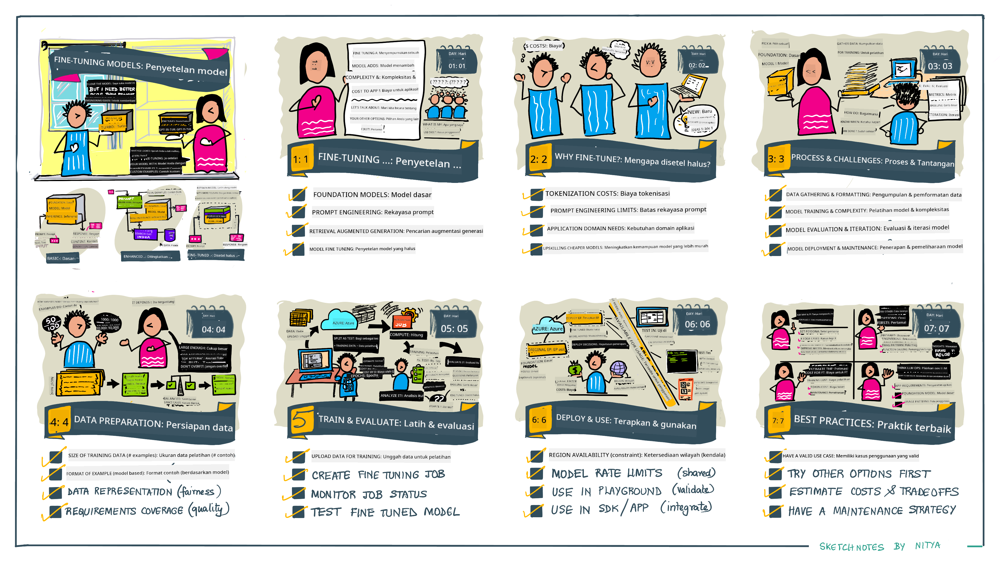

<!--
CO_OP_TRANSLATOR_METADATA:
{
  "original_hash": "68664f7e754a892ae1d8d5e2b7bd2081",
  "translation_date": "2025-07-09T17:46:41+00:00",
  "source_file": "18-fine-tuning/README.md",
  "language_code": "id"
}
-->

# Fine-Tuning LLM Anda

Menggunakan large language models untuk membangun aplikasi AI generatif menghadirkan tantangan baru. Salah satu masalah utama adalah memastikan kualitas respons (akurasi dan relevansi) dalam konten yang dihasilkan model untuk permintaan pengguna tertentu. Pada pelajaran sebelumnya, kita membahas teknik seperti prompt engineering dan retrieval-augmented generation yang mencoba menyelesaikan masalah ini dengan _memodifikasi input prompt_ pada model yang sudah ada.

Pada pelajaran hari ini, kita akan membahas teknik ketiga, **fine-tuning**, yang mencoba mengatasi tantangan ini dengan _melatih ulang model itu sendiri_ menggunakan data tambahan. Mari kita selami detailnya.

## Tujuan Pembelajaran

Pelajaran ini memperkenalkan konsep fine-tuning untuk model bahasa yang sudah dilatih sebelumnya, mengeksplorasi manfaat dan tantangan pendekatan ini, serta memberikan panduan kapan dan bagaimana menggunakan fine-tuning untuk meningkatkan performa model AI generatif Anda.

Di akhir pelajaran ini, Anda diharapkan dapat menjawab pertanyaan berikut:

- Apa itu fine-tuning untuk model bahasa?
- Kapan dan mengapa fine-tuning berguna?
- Bagaimana cara melakukan fine-tuning pada model yang sudah dilatih sebelumnya?
- Apa saja keterbatasan dari fine-tuning?

Siap? Mari kita mulai.

## Panduan Bergambar

Ingin mendapatkan gambaran besar tentang apa yang akan kita bahas sebelum masuk lebih dalam? Lihat panduan bergambar ini yang menjelaskan perjalanan pembelajaran untuk pelajaran ini - mulai dari mempelajari konsep inti dan motivasi fine-tuning, hingga memahami proses dan praktik terbaik dalam menjalankan tugas fine-tuning. Ini adalah topik yang menarik untuk dieksplorasi, jadi jangan lupa cek halaman [Resources](./RESOURCES.md?WT.mc_id=academic-105485-koreyst) untuk tautan tambahan yang mendukung perjalanan belajar mandiri Anda!

## Apa itu fine-tuning untuk model bahasa?

Secara definisi, large language models dilatih sebelumnya (_pre-trained_) menggunakan sejumlah besar teks yang berasal dari berbagai sumber termasuk internet. Seperti yang telah kita pelajari di pelajaran sebelumnya, kita membutuhkan teknik seperti _prompt engineering_ dan _retrieval-augmented generation_ untuk meningkatkan kualitas respons model terhadap pertanyaan pengguna ("prompt").

Teknik prompt engineering yang populer melibatkan memberikan model panduan lebih jelas tentang apa yang diharapkan dalam respons, baik dengan memberikan _instruksi_ (panduan eksplisit) atau _memberikan beberapa contoh_ (panduan implisit). Ini disebut _few-shot learning_ namun memiliki dua keterbatasan:

- Batas token model dapat membatasi jumlah contoh yang bisa diberikan, sehingga efektivitasnya terbatas.
- Biaya token model bisa mahal jika menambahkan contoh pada setiap prompt, sehingga membatasi fleksibilitas.

Fine-tuning adalah praktik umum dalam sistem machine learning di mana kita mengambil model yang sudah dilatih sebelumnya dan melatih ulang dengan data baru untuk meningkatkan performanya pada tugas tertentu. Dalam konteks model bahasa, kita dapat melakukan fine-tuning pada model yang sudah dilatih sebelumnya _dengan kumpulan contoh yang dikurasi untuk tugas atau domain aplikasi tertentu_ untuk membuat **model khusus** yang mungkin lebih akurat dan relevan untuk tugas atau domain tersebut. Manfaat tambahan dari fine-tuning adalah dapat mengurangi jumlah contoh yang dibutuhkan untuk few-shot learning - sehingga mengurangi penggunaan token dan biaya terkait.

## Kapan dan mengapa kita harus melakukan fine-tuning model?

Dalam _konteks ini_, ketika kita berbicara tentang fine-tuning, yang dimaksud adalah fine-tuning **supervised** di mana pelatihan ulang dilakukan dengan **menambahkan data baru** yang tidak termasuk dalam dataset pelatihan asli. Ini berbeda dengan pendekatan fine-tuning unsupervised di mana model dilatih ulang pada data asli, tetapi dengan hyperparameter yang berbeda.

Hal utama yang perlu diingat adalah fine-tuning adalah teknik lanjutan yang membutuhkan tingkat keahlian tertentu untuk mendapatkan hasil yang diinginkan. Jika dilakukan dengan tidak benar, fine-tuning mungkin tidak memberikan peningkatan yang diharapkan, bahkan bisa menurunkan performa model untuk domain yang ditargetkan.

Jadi, sebelum Anda mempelajari "bagaimana" melakukan fine-tuning model bahasa, Anda perlu tahu "mengapa" Anda harus memilih jalur ini, dan "kapan" memulai proses fine-tuning. Mulailah dengan mengajukan pertanyaan-pertanyaan ini pada diri Anda:

- **Use Case**: Apa _use case_ Anda untuk fine-tuning? Aspek apa dari model yang sudah dilatih sebelumnya yang ingin Anda tingkatkan?
- **Alternatif**: Apakah Anda sudah mencoba _teknik lain_ untuk mencapai hasil yang diinginkan? Gunakan teknik tersebut untuk membuat baseline perbandingan.
  - Prompt engineering: Coba teknik seperti few-shot prompting dengan contoh respons prompt yang relevan. Evaluasi kualitas respons.
  - Retrieval Augmented Generation: Coba menambah prompt dengan hasil pencarian data Anda. Evaluasi kualitas respons.
- **Biaya**: Apakah Anda sudah mengidentifikasi biaya untuk fine-tuning?
  - Kemampuan tuning - apakah model yang sudah dilatih tersedia untuk fine-tuning?
  - Upaya - untuk menyiapkan data pelatihan, evaluasi & penyempurnaan model.
  - Komputasi - untuk menjalankan pekerjaan fine-tuning dan menerapkan model yang sudah di-fine-tune
  - Data - akses ke contoh berkualitas yang cukup untuk dampak fine-tuning
- **Manfaat**: Apakah Anda sudah memastikan manfaat dari fine-tuning?
  - Kualitas - apakah model yang di-fine-tune mengungguli baseline?
  - Biaya - apakah mengurangi penggunaan token dengan menyederhanakan prompt?
  - Ekstensibilitas - apakah Anda bisa menggunakan ulang model dasar untuk domain baru?

Dengan menjawab pertanyaan-pertanyaan ini, Anda seharusnya bisa memutuskan apakah fine-tuning adalah pendekatan yang tepat untuk use case Anda. Idealnya, pendekatan ini valid hanya jika manfaatnya lebih besar daripada biayanya. Setelah Anda memutuskan untuk melanjutkan, saatnya memikirkan _bagaimana_ Anda bisa melakukan fine-tuning pada model yang sudah dilatih sebelumnya.

Ingin mendapatkan wawasan lebih tentang proses pengambilan keputusan? Tonton [To fine-tune or not to fine-tune](https://www.youtube.com/watch?v=0Jo-z-MFxJs)

## Bagaimana cara melakukan fine-tuning pada model yang sudah dilatih sebelumnya?

Untuk melakukan fine-tuning pada model yang sudah dilatih sebelumnya, Anda perlu memiliki:

- model yang sudah dilatih sebelumnya untuk di-fine-tune
- dataset yang akan digunakan untuk fine-tuning
- lingkungan pelatihan untuk menjalankan pekerjaan fine-tuning
- lingkungan hosting untuk menerapkan model yang sudah di-fine-tune

## Fine-Tuning dalam Praktek

Sumber daya berikut menyediakan tutorial langkah demi langkah yang memandu Anda melalui contoh nyata menggunakan model terpilih dengan dataset yang dikurasi. Untuk mengikuti tutorial ini, Anda memerlukan akun pada penyedia tertentu, serta akses ke model dan dataset yang relevan.

| Provider     | Tutorial                                                                                                                                                                       | Deskripsi                                                                                                                                                                                                                                                                                                                                                                                                                        |
| ------------ | ------------------------------------------------------------------------------------------------------------------------------------------------------------------------------ | ---------------------------------------------------------------------------------------------------------------------------------------------------------------------------------------------------------------------------------------------------------------------------------------------------------------------------------------------------------------------------------------------------------------------------------- |
| OpenAI       | [How to fine-tune chat models](https://github.com/openai/openai-cookbook/blob/main/examples/How_to_finetune_chat_models.ipynb?WT.mc_id=academic-105485-koreyst)                | Pelajari cara melakukan fine-tuning `gpt-35-turbo` untuk domain spesifik ("asisten resep") dengan menyiapkan data pelatihan, menjalankan pekerjaan fine-tuning, dan menggunakan model yang sudah di-fine-tune untuk inferensi.                                                                                                                                                                                                      |
| Azure OpenAI | [GPT 3.5 Turbo fine-tuning tutorial](https://learn.microsoft.com/azure/ai-services/openai/tutorials/fine-tune?tabs=python-new%2Ccommand-line?WT.mc_id=academic-105485-koreyst) | Pelajari cara melakukan fine-tuning model `gpt-35-turbo-0613` **di Azure** dengan langkah-langkah membuat & mengunggah data pelatihan, menjalankan pekerjaan fine-tuning, menerapkan & menggunakan model baru.                                                                                                                                                                                                                       |
| Hugging Face | [Fine-tuning LLMs with Hugging Face](https://www.philschmid.de/fine-tune-llms-in-2024-with-trl?WT.mc_id=academic-105485-koreyst)                                               | Blog ini memandu Anda melakukan fine-tuning pada _open LLM_ (misal: `CodeLlama 7B`) menggunakan library [transformers](https://huggingface.co/docs/transformers/index?WT.mc_id=academic-105485-koreyst) & [Transformer Reinforcement Learning (TRL)](https://huggingface.co/docs/trl/index?WT.mc_id=academic-105485-koreyst) dengan [datasets](https://huggingface.co/docs/datasets/index?WT.mc_id=academic-105485-koreyst) terbuka di Hugging Face. |
|              |                                                                                                                                                                                |                                                                                                                                                                                                                                                                                                                                                                                                                                    |
| 🤗 AutoTrain | [Fine-tuning LLMs with AutoTrain](https://github.com/huggingface/autotrain-advanced/?WT.mc_id=academic-105485-koreyst)                                                         | AutoTrain (atau AutoTrain Advanced) adalah library python yang dikembangkan oleh Hugging Face yang memungkinkan fine-tuning untuk berbagai tugas termasuk fine-tuning LLM. AutoTrain adalah solusi tanpa kode dan fine-tuning dapat dilakukan di cloud Anda sendiri, di Hugging Face Spaces, atau secara lokal. Mendukung GUI berbasis web, CLI, dan pelatihan melalui file konfigurasi yaml.                                                                                   |
|              |                                                                                                                                                                                |                                                                                                                                                                                                                                                                                                                                                                                                                                    |

## Tugas

Pilih salah satu tutorial di atas dan ikuti langkah-langkahnya. _Kami mungkin akan mereplikasi versi tutorial ini dalam Jupyter Notebooks di repo ini hanya sebagai referensi. Silakan gunakan sumber asli langsung untuk mendapatkan versi terbaru_.

## Kerja Bagus! Lanjutkan Pembelajaran Anda.

Setelah menyelesaikan pelajaran ini, lihat koleksi [Generative AI Learning](https://aka.ms/genai-collection?WT.mc_id=academic-105485-koreyst) kami untuk terus meningkatkan pengetahuan Generative AI Anda!

Selamat!! Anda telah menyelesaikan pelajaran terakhir dari seri v2 untuk kursus ini! Jangan berhenti belajar dan membangun. \*\*Lihat halaman [RESOURCES](RESOURCES.md?WT.mc_id=academic-105485-koreyst) untuk daftar saran tambahan khusus topik ini.

Seri pelajaran v1 kami juga telah diperbarui dengan lebih banyak tugas dan konsep. Jadi luangkan waktu sejenak untuk menyegarkan pengetahuan Anda - dan silakan [bagikan pertanyaan dan masukan Anda](https://github.com/microsoft/generative-ai-for-beginners/issues?WT.mc_id=academic-105485-koreyst) untuk membantu kami meningkatkan pelajaran ini bagi komunitas.

**Penafian**:  
Dokumen ini telah diterjemahkan menggunakan layanan terjemahan AI [Co-op Translator](https://github.com/Azure/co-op-translator). Meskipun kami berupaya untuk akurasi, harap diketahui bahwa terjemahan otomatis mungkin mengandung kesalahan atau ketidakakuratan. Dokumen asli dalam bahasa aslinya harus dianggap sebagai sumber yang sah. Untuk informasi penting, disarankan menggunakan terjemahan profesional oleh manusia. Kami tidak bertanggung jawab atas kesalahpahaman atau penafsiran yang salah yang timbul dari penggunaan terjemahan ini.