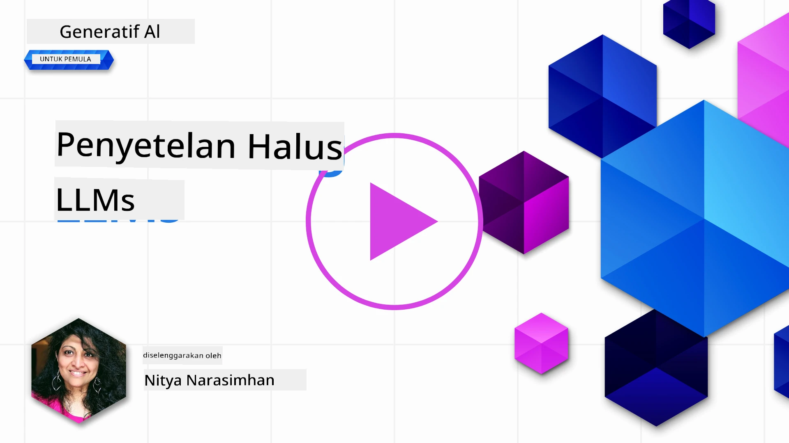

# Fine-Tuning Your LLM

Menggunakan model bahasa besar untuk membangun aplikasi AI generatif datang dengan tantangan baru. Masalah utama adalah memastikan kualitas respons (akurasi dan relevansi) dalam konten yang dihasilkan oleh model untuk permintaan pengguna tertentu. Dalam pelajaran sebelumnya, kami membahas teknik seperti rekayasa prompt dan generasi berbasis pengambilan yang mencoba memecahkan masalah ini dengan _memodifikasi input prompt_ ke model yang ada.

Dalam pelajaran hari ini, kita membahas teknik ketiga, **fine-tuning**, yang mencoba mengatasi tantangan ini dengan _melatih ulang model itu sendiri_ dengan data tambahan. Mari kita selami detailnya.

## Learning Objectives

Pelajaran ini memperkenalkan konsep fine-tuning untuk model bahasa yang sudah dilatih sebelumnya, mengeksplorasi manfaat dan tantangan pendekatan ini, serta memberikan panduan kapan dan bagaimana menggunakan fine-tuning untuk meningkatkan performa model AI generatif Anda.

Pada akhir pelajaran ini, Anda harus dapat menjawab pertanyaan berikut:

- Apa itu fine-tuning untuk model bahasa?
- Kapan, dan mengapa, fine-tuning berguna?
- Bagaimana saya dapat melakukan fine-tuning pada model yang sudah dilatih sebelumnya?
- Apa saja keterbatasan fine-tuning?

Siap? Mari kita mulai.

## Illustrated Guide

Ingin mendapatkan gambaran besar tentang apa yang akan kita bahas sebelum mendalaminya? Lihat panduan bergambar ini yang mendeskripsikan perjalanan pembelajaran untuk pelajaran ini - mulai dari mempelajari konsep inti dan motivasi untuk fine-tuning, hingga memahami proses dan praktik terbaik dalam menjalankan tugas fine-tuning. Ini adalah topik yang menarik untuk dieksplorasi, jadi jangan lupa lihat halaman [Resources](./RESOURCES.md?WT.mc_id=academic-105485-koreyst) untuk tautan tambahan yang mendukung perjalanan belajar mandiri Anda!

## Apa itu fine-tuning untuk model bahasa?

Menurut definisi, model bahasa besar _sudah dilatih sebelumnya_ pada sejumlah besar teks yang bersumber dari berbagai sumber termasuk internet. Seperti yang telah kita pelajari di pelajaran sebelumnya, kita membutuhkan teknik seperti _rekayasa prompt_ dan _generasi berbasis pengambilan_ untuk meningkatkan kualitas respons model terhadap pertanyaan pengguna ("prompt").

Teknik rekayasa prompt yang populer melibatkan memberikan model lebih banyak panduan tentang apa yang diharapkan dalam responsnya baik dengan memberikan _instruksi_ (panduan eksplisit) atau _memberikan beberapa contoh_ (panduan implisit). Ini disebut sebagai _few-shot learning_ tetapi memiliki dua keterbatasan:

- Batas token model dapat membatasi jumlah contoh yang dapat Anda berikan, dan membatasi efektivitasnya.
- Biaya token model dapat membuat mahal untuk menambahkan contoh ke setiap prompt, dan membatasi fleksibilitas.

Fine-tuning adalah praktik umum dalam sistem pembelajaran mesin dimana kita mengambil model yang sudah dilatih sebelumnya dan melatih ulang dengan data baru untuk meningkatkan performanya pada tugas spesifik. Dalam konteks model bahasa, kita dapat melakukan fine-tuning pada model pra-latih _dengan kumpulan contoh terkurasi untuk tugas atau domain aplikasi tertentu_ untuk membuat **model khusus** yang mungkin lebih akurat dan relevan untuk tugas atau domain spesifik tersebut. Manfaat tambahan dari fine-tuning adalah bahwa hal ini juga dapat mengurangi jumlah contoh yang diperlukan untuk few-shot learning - mengurangi penggunaan token dan biaya terkait.

## Kapan dan mengapa kita harus melakukan fine-tuning pada model?

Dalam _konteks ini_, ketika kita berbicara tentang fine-tuning, kita merujuk pada fine-tuning **terawasi** di mana pelatihan ulang dilakukan dengan **menambahkan data baru** yang bukan bagian dari dataset pelatihan asli. Ini berbeda dari pendekatan fine-tuning tanpa pengawasan di mana model dilatih ulang pada data asli, tetapi dengan hiperparameter berbeda.

Hal utama yang harus diingat adalah fine-tuning adalah teknik lanjutan yang memerlukan tingkat keahlian tertentu untuk mendapatkan hasil yang diinginkan. Jika dilakukan secara tidak benar, mungkin tidak memberikan peningkatan yang diharapkan, dan bahkan dapat menurunkan performa model untuk domain yang Anda targetkan.

Jadi, sebelum Anda belajar "bagaimana" melakukan fine-tuning model bahasa, Anda perlu mengetahui "mengapa" Anda harus mengambil jalur ini, dan "kapan" memulai proses fine-tuning. Mulailah dengan menanyakan pertanyaan-pertanyaan ini pada diri Anda:

- **Use Case**: Apa _use case_ Anda untuk fine-tuning? Aspek apa dari model pra-latih yang sekarang ingin Anda tingkatkan?
- **Alternatif**: Apakah Anda sudah mencoba _teknik lain_ untuk mencapai hasil yang diinginkan? Gunakan mereka untuk membuat baseline perbandingan.
  - Rekayasa prompt: Cobalah teknik seperti few-shot prompting dengan contoh respons prompt relevan. Evaluasi kualitas responsnya.
  - Generasi Berbasis Pengambilan: Cobalah melengkapi prompt dengan hasil kueri yang didapat dari pencarian data Anda. Evaluasi kualitas respons.
- **Biaya**: Apakah Anda sudah mengidentifikasi biaya untuk fine-tuning?
  - Kemampuan penyesuaian - apakah model pra-latih tersedia untuk fine-tuning?
  - Upaya - untuk menyiapkan data pelatihan, mengevaluasi & menyempurnakan model.
  - Komputasi - untuk menjalankan pekerjaan fine-tuning dan menerapkan model yang sudah di-fine-tune
  - Data - akses ke contoh berkualitas cukup untuk dampak fine-tuning
- **Manfaat**: Apakah Anda sudah memastikan manfaat fine-tuning?
  - Kualitas - apakah model hasil fine-tuning melampaui baseline?
  - Biaya - apakah mengurangi penggunaan token dengan menyederhanakan prompt?
  - Ekstensibilitas - dapatkah Anda menggunakan ulang model dasar untuk domain baru?

Dengan menjawab pertanyaan ini, Anda harus bisa memutuskan apakah fine-tuning adalah pendekatan yang tepat untuk kasus penggunaan Anda. Idealnya, pendekatan ini valid hanya jika manfaatnya melebihi biayanya. Setelah Anda memutuskan untuk melanjutkan, saatnya memikirkan _bagaimana_ melakukan fine-tuning pada model pra-latih tersebut.

Ingin mendapatkan lebih banyak wawasan tentang proses pengambilan keputusan? Tonton [To fine-tune or not to fine-tune](https://www.youtube.com/watch?v=0Jo-z-MFxJs)

## Bagaimana kita dapat melakukan fine-tuning pada model yang sudah dilatih sebelumnya?

Untuk melakukan fine-tuning pada model pra-latih, Anda perlu memiliki:

- model pra-latih untuk di-fine-tune
- dataset untuk digunakan dalam fine-tuning
- lingkungan pelatihan untuk menjalankan pekerjaan fine-tuning
- lingkungan hosting untuk menerapkan model hasil fine-tuning

## Fine-Tuning In Action

Sumber daya berikut menyediakan tutorial langkah demi langkah untuk membimbing Anda melalui contoh nyata menggunakan model terpilih dengan dataset terkurasi. Untuk mengikuti tutorial ini, Anda perlu memiliki akun pada penyedia spesifik tersebut, bersama dengan akses ke model dan dataset terkait.

| Provider     | Tutorial                                                                                                                                                                       | Deskripsi                                                                                                                                                                                                                                                                                                                                                                                                                     |
| ------------ | ------------------------------------------------------------------------------------------------------------------------------------------------------------------------------ | ------------------------------------------------------------------------------------------------------------------------------------------------------------------------------------------------------------------------------------------------------------------------------------------------------------------------------------------------------------------------------------------------------------------------------- |
| OpenAI       | [How to fine-tune chat models](https://github.com/openai/openai-cookbook/blob/main/examples/How_to_finetune_chat_models.ipynb?WT.mc_id=academic-105485-koreyst)                | Pelajari cara melakukan fine-tuning `gpt-35-turbo` untuk domain spesifik ("asisten resep") dengan mempersiapkan data pelatihan, menjalankan pekerjaan fine-tuning, dan menggunakan model hasil fine-tuning untuk inferensi.                                                                                                                                                                                                   |
| Azure OpenAI | [GPT 3.5 Turbo fine-tuning tutorial](https://learn.microsoft.com/azure/ai-services/openai/tutorials/fine-tune?tabs=python-new%2Ccommand-line&WT.mc_id=academic-105485-koreyst) | Pelajari cara melakukan fine-tuning model `gpt-35-turbo-0613` **di Azure** dengan melakukan langkah-langkah untuk membuat & mengunggah data pelatihan, menjalankan pekerjaan fine-tuning. Terapkan & gunakan model baru tersebut.                                                                                                                                                                                            |
| Hugging Face | [Fine-tuning LLMs with Hugging Face](https://www.philschmid.de/fine-tune-llms-in-2024-with-trl?WT.mc_id=academic-105485-koreyst)                                               | Blog post ini membimbing Anda melakukan fine-tuning pada _open LLM_ (misal: `CodeLlama 7B`) menggunakan library [transformers](https://huggingface.co/docs/transformers/index?WT.mc_id=academic-105485-koreyst) & [Transformer Reinforcement Learning (TRL)](https://huggingface.co/docs/trl/index?WT.mc_id=academic-105485-koreyst) dengan dataset terbuka di Hugging Face.                                                                             |
|              |                                                                                                                                                                                |                                                                                                                                                                                                                                                                                                                                                                                                                               |
| 🤗 AutoTrain | [Fine-tuning LLMs with AutoTrain](https://github.com/huggingface/autotrain-advanced/?WT.mc_id=academic-105485-koreyst)                                                         | AutoTrain (atau AutoTrain Advanced) adalah library python yang dikembangkan oleh Hugging Face yang memungkinkan fine-tuning untuk banyak tugas berbeda termasuk fine-tuning LLM. AutoTrain adalah solusi tanpa kode dan fine-tuning dapat dilakukan di cloud Anda sendiri, di Hugging Face Spaces, atau secara lokal. Mendukung GUI berbasis web, CLI dan pelatihan lewat file konfigurasi yaml.                                                                          |
|              |                                                                                                                                                                                |                                                                                                                                                                                                                                                                                                                                                                                                                               |
| 🦥 Unsloth | [Fine-tuning LLMs with Unsloth](https://github.com/unslothai/unsloth)                                                         | Unsloth adalah framework sumber terbuka yang mendukung fine-tuning LLM dan pembelajaran penguatan (RL). Unsloth mempermudah pelatihan lokal, evaluasi, dan deployment dengan [notebook](https://github.com/unslothai/notebooks) siap pakai. Mendukung juga text-to-speech (TTS), model BERT dan multimodal. Untuk memulai, baca panduan langkah demi langkah mereka di [Fine-tuning LLMs Guide](https://docs.unsloth.ai/get-started/fine-tuning-llms-guide).                              |
|              |                                                                                                                                                                                |                                                                                                                                                                                                                                                                                                                                                                                                                               |
## Assignment

Pilih salah satu tutorial di atas dan jalankan langkah-langkahnya. _Kami mungkin akan membuat versi dari tutorial ini dalam Jupyter Notebooks di repo ini hanya sebagai referensi. Harap gunakan sumber asli langsung untuk mendapatkan versi terbaru_.

## Great Work! Continue Your Learning.

Setelah menyelesaikan pelajaran ini, lihat koleksi [Generative AI Learning](https://aka.ms/genai-collection?WT.mc_id=academic-105485-koreyst) kami untuk terus meningkatkan pengetahuan AI Generatif Anda!

Selamat!! Anda telah menyelesaikan pelajaran terakhir dari seri v2 untuk kursus ini! Jangan berhenti belajar dan membangun. \*\*Lihat halaman [RESOURCES](RESOURCES.md?WT.mc_id=academic-105485-koreyst) untuk daftar saran tambahan hanya untuk topik ini.

Seri pelajaran v1 kami juga telah diperbarui dengan lebih banyak tugas dan konsep. Jadi luangkan waktu sejenak untuk menyegarkan kembali pengetahuan Anda - dan silakan [bagikan pertanyaan dan masukan Anda](https://github.com/microsoft/generative-ai-for-beginners/issues?WT.mc_id=academic-105485-koreyst) untuk membantu kami meningkatkan pelajaran ini untuk komunitas.

---

<!-- CO-OP TRANSLATOR DISCLAIMER START -->
**Penafian**:  
Dokumen ini telah diterjemahkan menggunakan layanan terjemahan AI [Co-op Translator](https://github.com/Azure/co-op-translator). Meskipun kami berupaya untuk akurasi, harap diperhatikan bahwa terjemahan otomatis mungkin mengandung kesalahan atau ketidakakuratan. Dokumen asli dalam bahasa aslinya harus dianggap sebagai sumber yang otoritatif. Untuk informasi penting, disarankan menggunakan terjemahan profesional oleh manusia. Kami tidak bertanggung jawab atas kesalahpahaman atau salah tafsir yang timbul dari penggunaan terjemahan ini.
<!-- CO-OP TRANSLATOR DISCLAIMER END -->