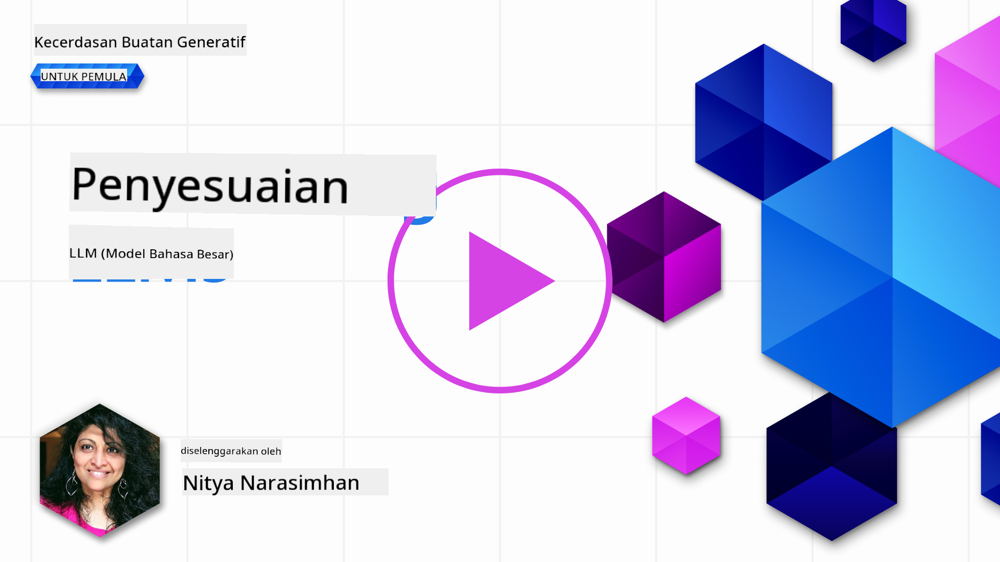
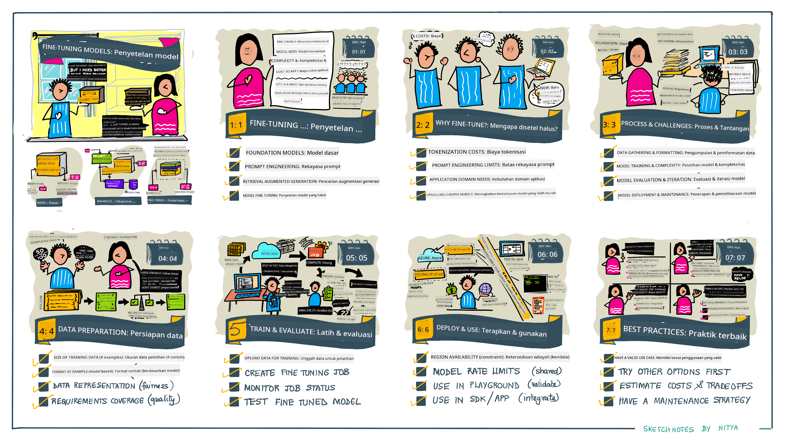

<!--
CO_OP_TRANSLATOR_METADATA:
{
  "original_hash": "68664f7e754a892ae1d8d5e2b7bd2081",
  "translation_date": "2025-06-26T00:47:34+00:00",
  "source_file": "18-fine-tuning/README.md",
  "language_code": "id"
}
-->

# Menyempurnakan LLM Anda

Menggunakan model bahasa besar untuk membangun aplikasi AI generatif datang dengan tantangan baru. Masalah utama adalah memastikan kualitas respons (ketepatan dan relevansi) dalam konten yang dihasilkan oleh model untuk permintaan pengguna tertentu. Dalam pelajaran sebelumnya, kita membahas teknik seperti rekayasa prompt dan generasi yang diperkuat pengambilan yang mencoba menyelesaikan masalah dengan _memodifikasi masukan prompt_ ke model yang ada.

Dalam pelajaran hari ini, kita membahas teknik ketiga, **penyempurnaan**, yang mencoba mengatasi tantangan dengan _melatih ulang model itu sendiri_ dengan data tambahan. Mari kita selami detailnya.

## Tujuan Pembelajaran

Pelajaran ini memperkenalkan konsep penyempurnaan untuk model bahasa yang telah dilatih sebelumnya, mengeksplorasi manfaat dan tantangan dari pendekatan ini, dan memberikan panduan tentang kapan dan bagaimana menggunakan penyempurnaan untuk meningkatkan kinerja model AI generatif Anda.

Pada akhir pelajaran ini, Anda harus dapat menjawab pertanyaan berikut:

- Apa itu penyempurnaan untuk model bahasa?
- Kapan, dan mengapa, penyempurnaan berguna?
- Bagaimana saya bisa menyempurnakan model yang telah dilatih sebelumnya?
- Apa batasan dari penyempurnaan?

Siap? Mari kita mulai.

## Panduan Bergambar

Ingin mendapatkan gambaran besar tentang apa yang akan kita bahas sebelum kita mendalaminya? Lihat panduan bergambar ini yang menggambarkan perjalanan pembelajaran untuk pelajaran ini - dari mempelajari konsep inti dan motivasi untuk penyempurnaan, hingga memahami proses dan praktik terbaik untuk melaksanakan tugas penyempurnaan. Ini adalah topik yang menarik untuk dieksplorasi, jadi jangan lupa untuk memeriksa halaman [Sumber Daya](./RESOURCES.md?WT.mc_id=academic-105485-koreyst) untuk tautan tambahan yang mendukung perjalanan belajar mandiri Anda!

## Apa itu penyempurnaan untuk model bahasa?

Secara definisi, model bahasa besar _telah dilatih sebelumnya_ pada sejumlah besar teks yang bersumber dari berbagai sumber termasuk internet. Seperti yang telah kita pelajari dalam pelajaran sebelumnya, kita memerlukan teknik seperti _rekayasa prompt_ dan _generasi yang diperkuat pengambilan_ untuk meningkatkan kualitas respons model terhadap pertanyaan pengguna ("prompt").

Teknik rekayasa prompt yang populer melibatkan memberikan lebih banyak panduan kepada model tentang apa yang diharapkan dalam respons baik dengan memberikan _instruksi_ (panduan eksplisit) atau _memberikan beberapa contoh_ (panduan implisit). Ini disebut sebagai _pembelajaran beberapa contoh_ tetapi memiliki dua keterbatasan:

- Batasan token model dapat membatasi jumlah contoh yang dapat Anda berikan, dan membatasi efektivitas.
- Biaya token model dapat membuatnya mahal untuk menambahkan contoh ke setiap prompt, dan membatasi fleksibilitas.

Penyempurnaan adalah praktik umum dalam sistem pembelajaran mesin di mana kita mengambil model yang telah dilatih sebelumnya dan melatih ulang dengan data baru untuk meningkatkan kinerjanya pada tugas tertentu. Dalam konteks model bahasa, kita dapat menyempurnakan model yang telah dilatih sebelumnya _dengan serangkaian contoh yang dipilih untuk tugas atau domain aplikasi tertentu_ untuk menciptakan **model khusus** yang mungkin lebih akurat dan relevan untuk tugas atau domain tersebut. Manfaat tambahan dari penyempurnaan adalah dapat mengurangi jumlah contoh yang dibutuhkan untuk pembelajaran beberapa contoh - mengurangi penggunaan token dan biaya terkait.

## Kapan dan mengapa kita harus menyempurnakan model?

Dalam konteks _ini_, ketika kita berbicara tentang penyempurnaan, kita merujuk pada penyempurnaan **terawasi** di mana pelatihan ulang dilakukan dengan **menambahkan data baru** yang tidak menjadi bagian dari dataset pelatihan asli. Ini berbeda dari pendekatan penyempurnaan tidak terawasi di mana model dilatih ulang pada data asli, tetapi dengan hiperparameter yang berbeda.

Hal utama yang perlu diingat adalah bahwa penyempurnaan adalah teknik lanjutan yang memerlukan tingkat keahlian tertentu untuk mendapatkan hasil yang diinginkan. Jika dilakukan secara tidak benar, mungkin tidak memberikan perbaikan yang diharapkan, dan bahkan dapat menurunkan kinerja model untuk domain yang Anda targetkan.

Jadi, sebelum Anda belajar "bagaimana" menyempurnakan model bahasa, Anda perlu tahu "mengapa" Anda harus mengambil jalur ini, dan "kapan" memulai proses penyempurnaan. Mulailah dengan menanyakan pada diri Anda pertanyaan-pertanyaan ini:

- **Kasus Penggunaan**: Apa _kasus penggunaan_ Anda untuk penyempurnaan? Aspek apa dari model yang telah dilatih sebelumnya yang ingin Anda tingkatkan?
- **Alternatif**: Apakah Anda telah mencoba _teknik lain_ untuk mencapai hasil yang diinginkan? Gunakan mereka untuk membuat dasar perbandingan.
  - Rekayasa prompt: Coba teknik seperti pemicu beberapa contoh dengan contoh respons prompt yang relevan. Evaluasi kualitas respons.
  - Generasi yang Diperkuat Pengambilan: Coba tingkatkan prompt dengan hasil kueri yang diambil dengan mencari data Anda. Evaluasi kualitas respons.
- **Biaya**: Apakah Anda telah mengidentifikasi biaya untuk penyempurnaan?
  - Kesesuaian - apakah model yang telah dilatih tersedia untuk penyempurnaan?
  - Usaha - untuk mempersiapkan data pelatihan, mengevaluasi & menyempurnakan model.
  - Komputasi - untuk menjalankan pekerjaan penyempurnaan, dan menerapkan model yang disempurnakan
  - Data - akses ke contoh kualitas yang cukup untuk dampak penyempurnaan
- **Manfaat**: Apakah Anda telah mengonfirmasi manfaat untuk penyempurnaan?
  - Kualitas - apakah model yang disempurnakan mengungguli dasar?
  - Biaya - apakah mengurangi penggunaan token dengan menyederhanakan prompt?
  - Ekstensibilitas - dapatkah Anda menggunakan kembali model dasar untuk domain baru?

Dengan menjawab pertanyaan-pertanyaan ini, Anda seharusnya dapat memutuskan apakah penyempurnaan adalah pendekatan yang tepat untuk kasus penggunaan Anda. Idealnya, pendekatan ini valid hanya jika manfaatnya melebihi biayanya. Setelah Anda memutuskan untuk melanjutkan, saatnya memikirkan _bagaimana_ Anda dapat menyempurnakan model yang telah dilatih sebelumnya.

Ingin mendapatkan lebih banyak wawasan tentang proses pengambilan keputusan? Tonton [Untuk menyempurnakan atau tidak menyempurnakan](https://www.youtube.com/watch?v=0Jo-z-MFxJs)

## Bagaimana kita bisa menyempurnakan model yang telah dilatih sebelumnya?

Untuk menyempurnakan model yang telah dilatih sebelumnya, Anda perlu memiliki:

- model yang telah dilatih sebelumnya untuk disempurnakan
- dataset untuk digunakan dalam penyempurnaan
- lingkungan pelatihan untuk menjalankan pekerjaan penyempurnaan
- lingkungan hosting untuk menerapkan model yang disempurnakan

## Penyempurnaan dalam Aksi

Sumber daya berikut menyediakan tutorial langkah demi langkah untuk memandu Anda melalui contoh nyata menggunakan model yang dipilih dengan dataset yang dipilih. Untuk bekerja melalui tutorial ini, Anda memerlukan akun pada penyedia tertentu, bersama dengan akses ke model dan dataset yang relevan.

| Penyedia     | Tutorial                                                                                                                                                                       | Deskripsi                                                                                                                                                                                                                                                                                                                                                                                                                        |
| ------------ | ------------------------------------------------------------------------------------------------------------------------------------------------------------------------------ | ---------------------------------------------------------------------------------------------------------------------------------------------------------------------------------------------------------------------------------------------------------------------------------------------------------------------------------------------------------------------------------------------------------------------------------- |
| OpenAI       | [Cara menyempurnakan model chat](https://github.com/openai/openai-cookbook/blob/main/examples/How_to_finetune_chat_models.ipynb?WT.mc_id=academic-105485-koreyst)                | Pelajari cara menyempurnakan `gpt-35-turbo` untuk domain tertentu ("asisten resep") dengan mempersiapkan data pelatihan, menjalankan pekerjaan penyempurnaan, dan menggunakan model yang disempurnakan untuk inferensi.                                                                                                                                                                                                                                              |
| Azure OpenAI | [Tutorial penyempurnaan GPT 3.5 Turbo](https://learn.microsoft.com/azure/ai-services/openai/tutorials/fine-tune?tabs=python-new%2Ccommand-line?WT.mc_id=academic-105485-koreyst) | Pelajari cara menyempurnakan model `gpt-35-turbo-0613` **di Azure** dengan mengambil langkah-langkah untuk membuat & mengunggah data pelatihan, menjalankan pekerjaan penyempurnaan. Terapkan & gunakan model baru.                                                                                                                                                                                                                                                                 |
| Hugging Face | [Menyempurnakan LLM dengan Hugging Face](https://www.philschmid.de/fine-tune-llms-in-2024-with-trl?WT.mc_id=academic-105485-koreyst)                                               | Blog ini memandu Anda menyempurnakan _LLM terbuka_ (misalnya: `CodeLlama 7B`) menggunakan pustaka [transformers](https://huggingface.co/docs/transformers/index?WT.mc_id=academic-105485-koreyst) & [Transformer Reinforcement Learning (TRL)](https://huggingface.co/docs/trl/index?WT.mc_id=academic-105485-koreyst]) dengan [datasets](https://huggingface.co/docs/datasets/index?WT.mc_id=academic-105485-koreyst) terbuka di Hugging Face. |
|              |                                                                                                                                                                                |                                                                                                                                                                                                                                                                                                                                                                                                                                    |
| 🤗 AutoTrain | [Menyempurnakan LLM dengan AutoTrain](https://github.com/huggingface/autotrain-advanced/?WT.mc_id=academic-105485-koreyst)                                                         | AutoTrain (atau AutoTrain Advanced) adalah pustaka python yang dikembangkan oleh Hugging Face yang memungkinkan penyempurnaan untuk berbagai tugas termasuk penyempurnaan LLM. AutoTrain adalah solusi tanpa kode dan penyempurnaan dapat dilakukan di cloud Anda sendiri, di Hugging Face Spaces atau secara lokal. Ini mendukung GUI berbasis web, CLI, dan pelatihan melalui file konfigurasi yaml.                                                                               |
|              |                                                                                                                                                                                |                                                                                                                                                                                                                                                                                                                                                                                                                                    |

## Tugas

Pilih salah satu tutorial di atas dan lakukan. _Kami mungkin mereplikasi versi tutorial ini dalam Jupyter Notebooks di repositori ini untuk referensi saja. Silakan gunakan sumber asli secara langsung untuk mendapatkan versi terbaru_.

## Kerja Bagus! Lanjutkan Pembelajaran Anda.

Setelah menyelesaikan pelajaran ini, lihat koleksi [Pembelajaran AI Generatif](https://aka.ms/genai-collection?WT.mc_id=academic-105485-koreyst) kami untuk terus meningkatkan pengetahuan AI Generatif Anda!

Selamat!! Anda telah menyelesaikan pelajaran terakhir dari seri v2 untuk kursus ini! Jangan berhenti belajar dan membangun. **Periksa halaman [SUMBER DAYA](RESOURCES.md?WT.mc_id=academic-105485-koreyst) untuk daftar saran tambahan hanya untuk topik ini.

Seri v1 dari pelajaran kami juga telah diperbarui dengan lebih banyak tugas dan konsep. Jadi luangkan waktu sebentar untuk menyegarkan pengetahuan Anda - dan silakan [bagikan pertanyaan dan umpan balik Anda](https://github.com/microsoft/generative-ai-for-beginners/issues?WT.mc_id=academic-105485-koreyst) untuk membantu kami meningkatkan pelajaran ini untuk komunitas.

**Penafian**:  
Dokumen ini telah diterjemahkan menggunakan layanan penerjemahan AI [Co-op Translator](https://github.com/Azure/co-op-translator). Meskipun kami berusaha untuk mencapai ketepatan, harap diketahui bahwa terjemahan otomatis mungkin mengandung kesalahan atau ketidakakuratan. Dokumen asli dalam bahasa aslinya harus dianggap sebagai sumber yang berwenang. Untuk informasi penting, disarankan menggunakan penerjemahan manusia profesional. Kami tidak bertanggung jawab atas kesalahpahaman atau salah tafsir yang timbul dari penggunaan terjemahan ini.