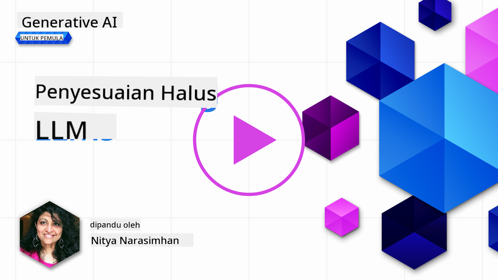

<!--
CO_OP_TRANSLATOR_METADATA:
{
  "original_hash": "807f0d9fc1747e796433534e1be6a98a",
  "translation_date": "2025-10-17T20:47:07+00:00",
  "source_file": "18-fine-tuning/README.md",
  "language_code": "id"
}
-->

# Menyesuaikan LLM Anda

Menggunakan model bahasa besar untuk membangun aplikasi AI generatif menghadirkan tantangan baru. Salah satu masalah utama adalah memastikan kualitas respons (akurasi dan relevansi) dalam konten yang dihasilkan oleh model untuk permintaan pengguna tertentu. Dalam pelajaran sebelumnya, kita telah membahas teknik seperti rekayasa prompt dan generasi yang ditingkatkan dengan pengambilan data yang mencoba mengatasi masalah ini dengan _memodifikasi input prompt_ pada model yang sudah ada.

Dalam pelajaran hari ini, kita akan membahas teknik ketiga, yaitu **penyesuaian**, yang mencoba mengatasi tantangan ini dengan _melatih ulang model itu sendiri_ menggunakan data tambahan. Mari kita bahas lebih lanjut.

## Tujuan Pembelajaran

Pelajaran ini memperkenalkan konsep penyesuaian untuk model bahasa yang telah dilatih sebelumnya, mengeksplorasi manfaat dan tantangan pendekatan ini, serta memberikan panduan tentang kapan dan bagaimana menggunakan penyesuaian untuk meningkatkan kinerja model AI generatif Anda.

Pada akhir pelajaran ini, Anda seharusnya dapat menjawab pertanyaan berikut:

- Apa itu penyesuaian untuk model bahasa?
- Kapan, dan mengapa, penyesuaian berguna?
- Bagaimana cara menyesuaikan model yang telah dilatih sebelumnya?
- Apa saja keterbatasan penyesuaian?

Siap? Mari kita mulai.

## Panduan Bergambar

Ingin mendapatkan gambaran besar tentang apa yang akan kita bahas sebelum mendalami materi? Lihat panduan bergambar ini yang menjelaskan perjalanan pembelajaran untuk pelajaran ini - mulai dari mempelajari konsep inti dan motivasi untuk penyesuaian, hingga memahami proses dan praktik terbaik untuk melaksanakan tugas penyesuaian. Ini adalah topik yang menarik untuk dieksplorasi, jadi jangan lupa untuk memeriksa halaman [Sumber Daya](./RESOURCES.md?WT.mc_id=academic-105485-koreyst) untuk tautan tambahan yang mendukung perjalanan pembelajaran mandiri Anda!

## Apa itu penyesuaian untuk model bahasa?

Secara definisi, model bahasa besar adalah _telah dilatih sebelumnya_ pada sejumlah besar teks yang bersumber dari berbagai sumber termasuk internet. Seperti yang telah kita pelajari dalam pelajaran sebelumnya, kita memerlukan teknik seperti _rekayasa prompt_ dan _generasi yang ditingkatkan dengan pengambilan data_ untuk meningkatkan kualitas respons model terhadap pertanyaan pengguna ("prompt").

Salah satu teknik rekayasa prompt yang populer melibatkan memberikan panduan lebih kepada model tentang apa yang diharapkan dalam respons, baik dengan memberikan _instruksi_ (panduan eksplisit) atau _memberikan beberapa contoh_ (panduan implisit). Ini disebut sebagai _pembelajaran beberapa contoh_ tetapi memiliki dua keterbatasan:

- Batas token model dapat membatasi jumlah contoh yang dapat diberikan, dan membatasi efektivitas.
- Biaya token model dapat membuat mahal untuk menambahkan contoh ke setiap prompt, dan membatasi fleksibilitas.

Penyesuaian adalah praktik umum dalam sistem pembelajaran mesin di mana kita mengambil model yang telah dilatih sebelumnya dan melatih ulang dengan data baru untuk meningkatkan kinerjanya pada tugas tertentu. Dalam konteks model bahasa, kita dapat menyesuaikan model yang telah dilatih sebelumnya _dengan kumpulan contoh yang dikurasi untuk tugas atau domain aplikasi tertentu_ untuk menciptakan **model khusus** yang mungkin lebih akurat dan relevan untuk tugas atau domain tertentu. Manfaat tambahan dari penyesuaian adalah dapat mengurangi jumlah contoh yang diperlukan untuk pembelajaran beberapa contoh - mengurangi penggunaan token dan biaya terkait.

## Kapan dan mengapa kita harus menyesuaikan model?

Dalam _konteks ini_, ketika kita berbicara tentang penyesuaian, kita merujuk pada penyesuaian **terawasi** di mana pelatihan ulang dilakukan dengan **menambahkan data baru** yang tidak termasuk dalam dataset pelatihan asli. Ini berbeda dari pendekatan penyesuaian tidak terawasi di mana model dilatih ulang pada data asli, tetapi dengan parameter hiper yang berbeda.

Hal utama yang perlu diingat adalah bahwa penyesuaian adalah teknik lanjutan yang membutuhkan tingkat keahlian tertentu untuk mendapatkan hasil yang diinginkan. Jika dilakukan dengan tidak benar, mungkin tidak memberikan peningkatan yang diharapkan, dan bahkan dapat menurunkan kinerja model untuk domain yang ditargetkan.

Jadi, sebelum Anda belajar "bagaimana" menyesuaikan model bahasa, Anda perlu tahu "mengapa" Anda harus mengambil jalur ini, dan "kapan" memulai proses penyesuaian. Mulailah dengan mengajukan pertanyaan berikut:

- **Kasus Penggunaan**: Apa _kasus penggunaan_ Anda untuk penyesuaian? Aspek apa dari model yang telah dilatih sebelumnya yang ingin Anda tingkatkan?
- **Alternatif**: Apakah Anda telah mencoba _teknik lain_ untuk mencapai hasil yang diinginkan? Gunakan mereka untuk membuat baseline untuk perbandingan.
  - Rekayasa prompt: Coba teknik seperti prompt beberapa contoh dengan contoh respons prompt yang relevan. Evaluasi kualitas respons.
  - Generasi yang Ditingkatkan dengan Pengambilan Data: Coba tambahkan prompt dengan hasil pencarian yang diambil dari data Anda. Evaluasi kualitas respons.
- **Biaya**: Apakah Anda telah mengidentifikasi biaya untuk penyesuaian?
  - Kemampuan untuk disesuaikan - apakah model yang telah dilatih sebelumnya tersedia untuk penyesuaian?
  - Upaya - untuk mempersiapkan data pelatihan, mengevaluasi & menyempurnakan model.
  - Komputasi - untuk menjalankan pekerjaan penyesuaian, dan menerapkan model yang telah disesuaikan.
  - Data - akses ke contoh berkualitas yang cukup untuk dampak penyesuaian.
- **Manfaat**: Apakah Anda telah mengonfirmasi manfaat penyesuaian?
  - Kualitas - apakah model yang telah disesuaikan mengungguli baseline?
  - Biaya - apakah ini mengurangi penggunaan token dengan menyederhanakan prompt?
  - Ekstensibilitas - dapatkah Anda menggunakan kembali model dasar untuk domain baru?

Dengan menjawab pertanyaan-pertanyaan ini, Anda seharusnya dapat memutuskan apakah penyesuaian adalah pendekatan yang tepat untuk kasus penggunaan Anda. Idealnya, pendekatan ini valid hanya jika manfaatnya lebih besar daripada biayanya. Setelah Anda memutuskan untuk melanjutkan, saatnya memikirkan _bagaimana_ Anda dapat menyesuaikan model yang telah dilatih sebelumnya.

Ingin mendapatkan wawasan lebih lanjut tentang proses pengambilan keputusan? Tonton [To fine-tune or not to fine-tune](https://www.youtube.com/watch?v=0Jo-z-MFxJs)

## Bagaimana kita dapat menyesuaikan model yang telah dilatih sebelumnya?

Untuk menyesuaikan model yang telah dilatih sebelumnya, Anda perlu memiliki:

- model yang telah dilatih sebelumnya untuk disesuaikan
- dataset untuk digunakan dalam penyesuaian
- lingkungan pelatihan untuk menjalankan pekerjaan penyesuaian
- lingkungan hosting untuk menerapkan model yang telah disesuaikan

## Penyesuaian Dalam Praktik

Sumber daya berikut menyediakan tutorial langkah demi langkah untuk memandu Anda melalui contoh nyata menggunakan model yang dipilih dengan dataset yang dikurasi. Untuk mengikuti tutorial ini, Anda memerlukan akun di penyedia tertentu, bersama dengan akses ke model dan dataset yang relevan.

| Penyedia     | Tutorial                                                                                                                                                                       | Deskripsi                                                                                                                                                                                                                                                                                                                                                                                                                        |
| ------------ | ------------------------------------------------------------------------------------------------------------------------------------------------------------------------------ | ---------------------------------------------------------------------------------------------------------------------------------------------------------------------------------------------------------------------------------------------------------------------------------------------------------------------------------------------------------------------------------------------------------------------------------- |
| OpenAI       | [Cara menyesuaikan model chat](https://github.com/openai/openai-cookbook/blob/main/examples/How_to_finetune_chat_models.ipynb?WT.mc_id=academic-105485-koreyst)                | Pelajari cara menyesuaikan `gpt-35-turbo` untuk domain tertentu ("asisten resep") dengan mempersiapkan data pelatihan, menjalankan pekerjaan penyesuaian, dan menggunakan model yang telah disesuaikan untuk inferensi.                                                                                                                                                                                                                                              |
| Azure OpenAI | [Tutorial penyesuaian GPT 3.5 Turbo](https://learn.microsoft.com/azure/ai-services/openai/tutorials/fine-tune?tabs=python-new%2Ccommand-line?WT.mc_id=academic-105485-koreyst) | Pelajari cara menyesuaikan model `gpt-35-turbo-0613` **di Azure** dengan langkah-langkah untuk membuat & mengunggah data pelatihan, menjalankan pekerjaan penyesuaian. Terapkan & gunakan model baru.                                                                                                                                                                                                                                                                 |
| Hugging Face | [Penyesuaian LLM dengan Hugging Face](https://www.philschmid.de/fine-tune-llms-in-2024-with-trl?WT.mc_id=academic-105485-koreyst)                                               | Blog ini memandu Anda menyesuaikan _LLM terbuka_ (contoh: `CodeLlama 7B`) menggunakan pustaka [transformers](https://huggingface.co/docs/transformers/index?WT.mc_id=academic-105485-koreyst) & [Transformer Reinforcement Learning (TRL)](https://huggingface.co/docs/trl/index?WT.mc_id=academic-105485-koreyst]) dengan [dataset terbuka](https://huggingface.co/docs/datasets/index?WT.mc_id=academic-105485-koreyst) di Hugging Face. |
|              |                                                                                                                                                                                |                                                                                                                                                                                                                                                                                                                                                                                                                                    |
| 🤗 AutoTrain | [Penyesuaian LLM dengan AutoTrain](https://github.com/huggingface/autotrain-advanced/?WT.mc_id=academic-105485-koreyst)                                                         | AutoTrain (atau AutoTrain Advanced) adalah pustaka python yang dikembangkan oleh Hugging Face yang memungkinkan penyesuaian untuk berbagai tugas termasuk penyesuaian LLM. AutoTrain adalah solusi tanpa kode dan penyesuaian dapat dilakukan di cloud Anda sendiri, di Hugging Face Spaces atau secara lokal. Ini mendukung GUI berbasis web, CLI, dan pelatihan melalui file konfigurasi yaml.                                                                               |
|              |                                                                                                                                                                                |                                                                                                                                                                                                                                                                                                                                                                                                                                    |

## Tugas

Pilih salah satu tutorial di atas dan ikuti langkah-langkahnya. _Kami mungkin mereplikasi versi tutorial ini dalam Jupyter Notebooks di repositori ini hanya untuk referensi. Harap gunakan sumber asli secara langsung untuk mendapatkan versi terbaru_.

## Kerja Bagus! Lanjutkan Pembelajaran Anda.

Setelah menyelesaikan pelajaran ini, lihat [koleksi Pembelajaran AI Generatif](https://aka.ms/genai-collection?WT.mc_id=academic-105485-koreyst) kami untuk terus meningkatkan pengetahuan Anda tentang AI Generatif!

Selamat!! Anda telah menyelesaikan pelajaran terakhir dari seri v2 untuk kursus ini! Jangan berhenti belajar dan membangun. \*\*Lihat halaman [SUMBER DAYA](RESOURCES.md?WT.mc_id=academic-105485-koreyst) untuk daftar saran tambahan hanya untuk topik ini.

Seri pelajaran v1 kami juga telah diperbarui dengan lebih banyak tugas dan konsep. Jadi luangkan waktu untuk menyegarkan pengetahuan Anda - dan silakan [bagikan pertanyaan dan masukan Anda](https://github.com/microsoft/generative-ai-for-beginners/issues?WT.mc_id=academic-105485-koreyst) untuk membantu kami meningkatkan pelajaran ini bagi komunitas.

---

**Penafian**:  
Dokumen ini telah diterjemahkan menggunakan layanan penerjemahan AI [Co-op Translator](https://github.com/Azure/co-op-translator). Meskipun kami berupaya untuk memberikan hasil yang akurat, harap diketahui bahwa terjemahan otomatis mungkin mengandung kesalahan atau ketidakakuratan. Dokumen asli dalam bahasa aslinya harus dianggap sebagai sumber yang otoritatif. Untuk informasi yang penting, disarankan menggunakan jasa penerjemahan manusia profesional. Kami tidak bertanggung jawab atas kesalahpahaman atau interpretasi yang keliru yang timbul dari penggunaan terjemahan ini.