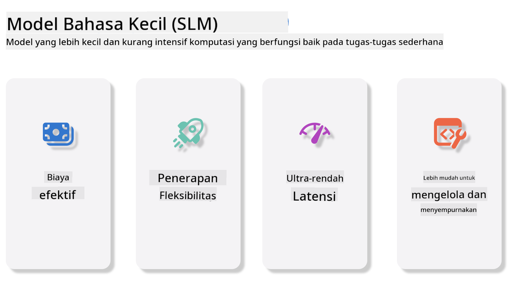
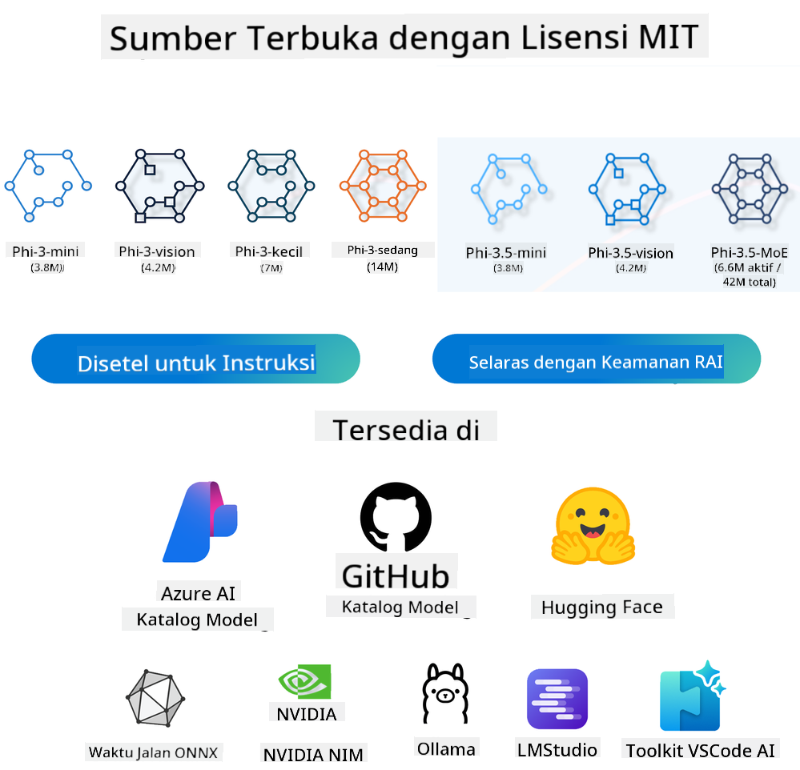
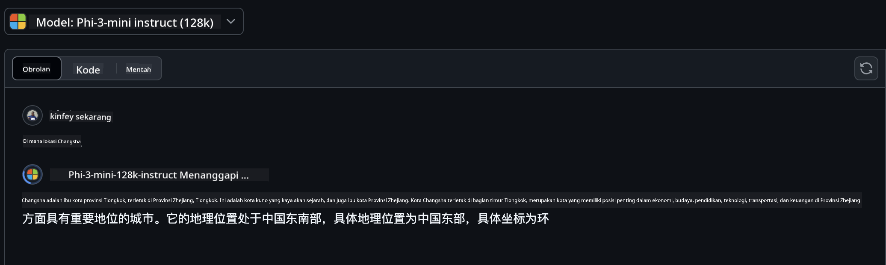
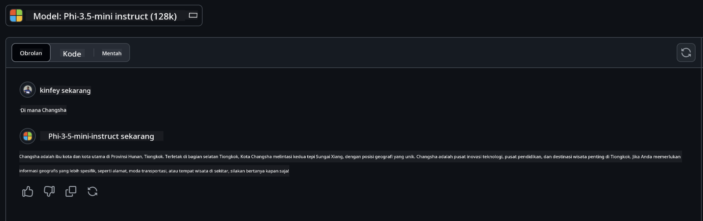

<!--
CO_OP_TRANSLATOR_METADATA:
{
  "original_hash": "124ad36cfe96f74038811b6e2bb93e9d",
  "translation_date": "2025-05-20T10:15:55+00:00",
  "source_file": "19-slm/README.md",
  "language_code": "id"
}
-->
# Pengantar ke Model Bahasa Kecil untuk Generative AI bagi Pemula

Generative AI adalah bidang kecerdasan buatan yang menarik yang berfokus pada pembuatan sistem yang mampu menghasilkan konten baru. Konten ini dapat berupa teks dan gambar hingga musik dan bahkan seluruh lingkungan virtual. Salah satu aplikasi paling menarik dari generative AI adalah dalam ranah model bahasa.

## Apa Itu Model Bahasa Kecil?

Model Bahasa Kecil (Small Language Model/SLM) mewakili varian yang diperkecil dari model bahasa besar (Large Language Model/LLM), memanfaatkan banyak prinsip dan teknik arsitektur dari LLM, sambil menunjukkan jejak komputasi yang jauh lebih kecil. SLM adalah subset dari model bahasa yang dirancang untuk menghasilkan teks yang mirip dengan manusia. Tidak seperti rekan mereka yang lebih besar, seperti GPT-4, SLM lebih ringkas dan efisien, membuatnya ideal untuk aplikasi di mana sumber daya komputasi terbatas. Meskipun ukurannya lebih kecil, mereka masih dapat melakukan berbagai tugas. Biasanya, SLM dibangun dengan cara mengompresi atau mendistilasi LLM, bertujuan untuk mempertahankan sebagian besar fungsionalitas dan kemampuan linguistik model asli. Pengurangan ukuran model ini mengurangi kompleksitas keseluruhan, membuat SLM lebih efisien dalam hal penggunaan memori dan persyaratan komputasi. Meskipun optimasi ini, SLM masih dapat melakukan berbagai tugas pemrosesan bahasa alami (NLP):

- Generasi Teks: Membuat kalimat atau paragraf yang koheren dan relevan secara kontekstual.
- Penyelesaian Teks: Memprediksi dan melengkapi kalimat berdasarkan prompt yang diberikan.
- Terjemahan: Mengonversi teks dari satu bahasa ke bahasa lain.
- Ringkasan: Memadatkan potongan teks panjang menjadi ringkasan yang lebih pendek dan mudah dicerna.

Meskipun ada beberapa kompromi dalam kinerja atau kedalaman pemahaman dibandingkan dengan rekan mereka yang lebih besar.

## Bagaimana Model Bahasa Kecil Bekerja?

SLM dilatih pada sejumlah besar data teks. Selama pelatihan, mereka mempelajari pola dan struktur bahasa, memungkinkan mereka untuk menghasilkan teks yang baik secara tata bahasa dan sesuai dengan konteks. Proses pelatihan melibatkan:

- Pengumpulan Data: Mengumpulkan kumpulan data teks besar dari berbagai sumber.
- Pra-pemrosesan: Membersihkan dan mengatur data agar cocok untuk pelatihan.
- Pelatihan: Menggunakan algoritma pembelajaran mesin untuk mengajarkan model cara memahami dan menghasilkan teks.
- Penyesuaian: Menyesuaikan model untuk meningkatkan kinerjanya pada tugas-tugas tertentu.

Pengembangan SLM sejalan dengan meningkatnya kebutuhan akan model yang dapat diterapkan di lingkungan dengan sumber daya terbatas, seperti perangkat seluler atau platform komputasi tepi, di mana LLM skala penuh mungkin tidak praktis karena tuntutan sumber daya yang berat. Dengan berfokus pada efisiensi, SLM menyeimbangkan kinerja dengan aksesibilitas, memungkinkan aplikasi yang lebih luas di berbagai domain.



## Tujuan Pembelajaran

Dalam pelajaran ini, kami berharap dapat memperkenalkan pengetahuan tentang SLM dan menggabungkannya dengan Microsoft Phi-3 untuk mempelajari berbagai skenario dalam konten teks, visi, dan MoE. Pada akhir pelajaran ini, Anda harus dapat menjawab pertanyaan-pertanyaan berikut:

- Apa itu SLM
- Apa perbedaan antara SLM dan LLM
- Apa itu Keluarga Microsoft Phi-3/3.5
- Bagaimana cara menginference Keluarga Microsoft Phi-3/3.5

Siap? Mari kita mulai.

## Perbedaan antara Model Bahasa Besar (LLM) dan Model Bahasa Kecil (SLM)

Baik LLM dan SLM dibangun di atas prinsip dasar pembelajaran mesin probabilistik, mengikuti pendekatan serupa dalam desain arsitektur, metodologi pelatihan, proses pembuatan data, dan teknik evaluasi model. Namun, beberapa faktor kunci membedakan kedua jenis model ini.

## Aplikasi Model Bahasa Kecil

SLM memiliki berbagai aplikasi, termasuk:

- Chatbot: Memberikan dukungan pelanggan dan berinteraksi dengan pengguna secara percakapan.
- Pembuatan Konten: Membantu penulis dengan menghasilkan ide atau bahkan menyusun seluruh artikel.
- Pendidikan: Membantu siswa dengan tugas menulis atau belajar bahasa baru.
- Aksesibilitas: Membuat alat untuk individu dengan disabilitas, seperti sistem teks-ke-suara.

**Ukuran**

Perbedaan utama antara LLM dan SLM terletak pada skala model. LLM, seperti ChatGPT (GPT-4), dapat terdiri dari sekitar 1,76 triliun parameter, sementara SLM sumber terbuka seperti Mistral 7B dirancang dengan parameter yang jauh lebih sedikit—sekitar 7 miliar. Perbedaan ini terutama disebabkan oleh perbedaan dalam arsitektur model dan proses pelatihan. Misalnya, ChatGPT menggunakan mekanisme perhatian diri dalam kerangka kerja encoder-decoder, sedangkan Mistral 7B menggunakan perhatian jendela geser, yang memungkinkan pelatihan lebih efisien dalam model hanya-decoder. Variasi arsitektur ini memiliki implikasi mendalam untuk kompleksitas dan kinerja model ini.

**Pemahaman**

SLM biasanya dioptimalkan untuk kinerja dalam domain tertentu, membuatnya sangat khusus tetapi berpotensi terbatas dalam kemampuannya untuk memberikan pemahaman kontekstual yang luas di berbagai bidang pengetahuan. Sebaliknya, LLM bertujuan untuk meniru kecerdasan mirip manusia pada tingkat yang lebih komprehensif. Dilatih pada kumpulan data yang luas dan beragam, LLM dirancang untuk berkinerja baik di berbagai domain, menawarkan fleksibilitas dan adaptabilitas yang lebih besar. Akibatnya, LLM lebih cocok untuk berbagai tugas hilir, seperti pemrosesan bahasa alami dan pemrograman.

**Komputasi**

Pelatihan dan penerapan LLM adalah proses yang memerlukan sumber daya intensif, seringkali membutuhkan infrastruktur komputasi yang signifikan, termasuk klaster GPU skala besar. Misalnya, melatih model seperti ChatGPT dari awal mungkin memerlukan ribuan GPU selama periode yang diperpanjang. Sebaliknya, SLM, dengan jumlah parameter yang lebih kecil, lebih dapat diakses dalam hal sumber daya komputasi. Model seperti Mistral 7B dapat dilatih dan dijalankan di mesin lokal yang dilengkapi dengan kemampuan GPU moderat, meskipun pelatihan masih memerlukan beberapa jam di beberapa GPU.

**Bias**

Bias adalah masalah yang diketahui dalam LLM, terutama karena sifat data pelatihan. Model-model ini sering bergantung pada data mentah yang tersedia secara terbuka dari internet, yang mungkin kurang mewakili atau salah menggambarkan kelompok tertentu, memperkenalkan pelabelan yang salah, atau mencerminkan bias linguistik yang dipengaruhi oleh dialek, variasi geografis, dan aturan tata bahasa. Selain itu, kompleksitas arsitektur LLM dapat secara tidak sengaja memperburuk bias, yang mungkin tidak terdeteksi tanpa penyesuaian yang hati-hati. Di sisi lain, SLM, yang dilatih pada kumpulan data yang lebih terbatas dan spesifik domain, secara inheren kurang rentan terhadap bias semacam itu, meskipun tidak sepenuhnya kebal terhadapnya.

**Inference**

Ukuran SLM yang lebih kecil memberi mereka keuntungan signifikan dalam hal kecepatan inference, memungkinkan mereka untuk menghasilkan output secara efisien pada perangkat keras lokal tanpa perlu pemrosesan paralel yang ekstensif. Sebaliknya, LLM, karena ukuran dan kompleksitasnya, sering memerlukan sumber daya komputasi paralel yang substansial untuk mencapai waktu inference yang dapat diterima. Kehadiran banyak pengguna secara bersamaan semakin memperlambat waktu respons LLM, terutama ketika diterapkan dalam skala besar.

Singkatnya, meskipun baik LLM maupun SLM berbagi dasar dalam pembelajaran mesin, mereka berbeda secara signifikan dalam hal ukuran model, persyaratan sumber daya, pemahaman kontekstual, kerentanan terhadap bias, dan kecepatan inference. Perbedaan ini mencerminkan kesesuaian masing-masing untuk kasus penggunaan yang berbeda, dengan LLM lebih serbaguna tetapi memerlukan banyak sumber daya, dan SLM menawarkan efisiensi yang lebih spesifik domain dengan permintaan komputasi yang lebih rendah.

***Catatan: Dalam bab ini, kami akan memperkenalkan SLM menggunakan Microsoft Phi-3 / 3.5 sebagai contoh.***

## Memperkenalkan Keluarga Phi-3 / Phi-3.5

Keluarga Phi-3 / 3.5 terutama menargetkan skenario aplikasi teks, visi, dan Agen (MoE):

### Phi-3 / 3.5 Instruct

Terutama untuk generasi teks, penyelesaian obrolan, dan ekstraksi informasi konten, dll.

**Phi-3-mini**

Model bahasa 3.8B tersedia di Microsoft Azure AI Studio, Hugging Face, dan Ollama. Model Phi-3 secara signifikan mengungguli model bahasa dengan ukuran yang sama dan lebih besar pada tolok ukur utama (lihat angka tolok ukur di bawah, angka yang lebih tinggi lebih baik). Phi-3-mini mengungguli model dua kali ukurannya, sementara Phi-3-kecil dan Phi-3-sedang mengungguli model yang lebih besar, termasuk GPT-3.5

**Phi-3-kecil & sedang**

Dengan hanya 7B parameter, Phi-3-kecil mengalahkan GPT-3.5T pada berbagai tolok ukur bahasa, penalaran, pengkodean, dan matematika. Phi-3-sedang dengan 14B parameter melanjutkan tren ini dan mengungguli Gemini 1.0 Pro.

**Phi-3.5-mini**

Kita dapat menganggapnya sebagai peningkatan dari Phi-3-mini. Meskipun parameternya tetap tidak berubah, ini meningkatkan kemampuan untuk mendukung beberapa bahasa (Mendukung 20+ bahasa: Arab, Cina, Ceko, Denmark, Belanda, Inggris, Finlandia, Prancis, Jerman, Ibrani, Hungaria, Italia, Jepang, Korea, Norwegia, Polandia, Portugis, Rusia, Spanyol, Swedia, Thailand, Turki, Ukraina) dan menambahkan dukungan yang lebih kuat untuk konteks panjang. Phi-3.5-mini dengan 3.8B parameter mengungguli model bahasa dengan ukuran yang sama dan setara dengan model dua kali ukurannya.

### Phi-3 / 3.5 Vision

Kita dapat menganggap model Instruct dari Phi-3/3.5 sebagai kemampuan Phi untuk memahami, dan Vision adalah yang memberi Phi mata untuk memahami dunia.

**Phi-3-Vision**

Phi-3-vision, dengan hanya 4.2B parameter, melanjutkan tren ini dan mengungguli model yang lebih besar seperti Claude-3 Haiku dan Gemini 1.0 Pro V pada tugas penalaran visual umum, OCR, dan pemahaman tabel dan diagram.

**Phi-3.5-Vision**

Phi-3.5-Vision juga merupakan peningkatan dari Phi-3-Vision, menambahkan dukungan untuk beberapa gambar. Anda dapat menganggapnya sebagai peningkatan dalam visi, tidak hanya dapat melihat gambar, tetapi juga video. Phi-3.5-vision mengungguli model yang lebih besar seperti Claude-3.5 Sonnet dan Gemini 1.5 Flash di seluruh OCR, pemahaman tabel dan grafik dan setara pada tugas penalaran pengetahuan visual umum. Mendukung input multi-bingkai, yaitu, melakukan penalaran pada beberapa gambar input.

### Phi-3.5-MoE

***Mixture of Experts (MoE)*** memungkinkan model untuk dilatih dengan komputasi yang jauh lebih sedikit, yang berarti Anda dapat secara dramatis meningkatkan ukuran model atau dataset dengan anggaran komputasi yang sama seperti model padat. Secara khusus, model MoE harus mencapai kualitas yang sama dengan padanannya yang padat jauh lebih cepat selama pelatihan awal. Phi-3.5-MoE terdiri dari 16x3.8B modul ahli. Phi-3.5-MoE dengan hanya 6.6B parameter aktif mencapai tingkat penalaran, pemahaman bahasa, dan matematika yang serupa dengan model yang jauh lebih besar.

Kita dapat menggunakan model Keluarga Phi-3/3.5 berdasarkan skenario yang berbeda. Tidak seperti LLM, Anda dapat menerapkan Phi-3/3.5-mini atau Phi-3/3.5-Vision pada perangkat tepi.

## Cara menggunakan model Keluarga Phi-3/3.5

Kami berharap dapat menggunakan Phi-3/3.5 dalam skenario yang berbeda. Selanjutnya, kami akan menggunakan Phi-3/3.5 berdasarkan skenario yang berbeda.



### Perbedaan inference

API Cloud

**Model GitHub**

GitHub
Model adalah cara paling langsung. Anda dapat dengan cepat mengakses model Phi-3/3.5-Instruct melalui GitHub Models. Dikombinasikan dengan Azure AI Inference SDK / OpenAI SDK, Anda dapat mengakses API melalui kode untuk menyelesaikan panggilan Phi-3/3.5-Instruct. Anda juga dapat menguji berbagai efek melalui Playground. - Demo: Perbandingan efek Phi-3-mini dan Phi-3.5-mini dalam skenario bahasa Mandarin   **Azure AI Studio** Atau jika kita ingin menggunakan model vision dan MoE, Anda dapat menggunakan Azure AI Studio untuk menyelesaikan panggilan. Jika Anda tertarik, Anda dapat membaca Phi-3 Cookbook untuk mempelajari cara memanggil Phi-3/3.5 Instruct, Vision, MoE melalui Azure AI Studio [Klik tautan ini](https://github.com/microsoft/Phi-3CookBook/blob/main/md/02.QuickStart/AzureAIStudio_QuickStart.md?WT.mc_id=academic-105485-koreyst) **NVIDIA NIM** Selain solusi Model Catalog berbasis cloud yang disediakan oleh Azure dan GitHub, Anda juga dapat menggunakan [Nivida NIM](https://developer.nvidia.com/nim?WT.mc_id=academic-105485-koreyst) untuk menyelesaikan panggilan terkait. Anda dapat mengunjungi NIVIDA NIM untuk menyelesaikan panggilan API dari Keluarga Phi-3/3.5. NVIDIA NIM (NVIDIA Inference Microservices) adalah serangkaian layanan mikro inferensi yang dipercepat yang dirancang untuk membantu pengembang menerapkan model AI secara efisien di berbagai lingkungan, termasuk cloud, pusat data, dan workstation. Berikut adalah beberapa fitur utama dari NVIDIA NIM: - **Kemudahan Penerapan:** NIM memungkinkan penerapan model AI dengan satu perintah, membuatnya mudah diintegrasikan ke dalam alur kerja yang ada. - **Kinerja Dioptimalkan:** Ini memanfaatkan mesin inferensi yang telah dioptimalkan sebelumnya oleh NVIDIA, seperti TensorRT dan TensorRT-LLM, untuk memastikan latensi rendah dan throughput tinggi. - **Skalabilitas:** NIM mendukung penskalaan otomatis pada Kubernetes, memungkinkannya menangani beban kerja yang bervariasi secara efektif. - **Keamanan dan Kontrol:** Organisasi dapat mempertahankan kontrol atas data dan aplikasi mereka dengan menghosting sendiri layanan mikro NIM di infrastruktur yang mereka kelola. - **API Standar:** NIM menyediakan API standar industri, membuatnya mudah untuk membangun dan mengintegrasikan aplikasi AI seperti chatbot, asisten AI, dan lainnya. NIM adalah bagian dari NVIDIA AI Enterprise, yang bertujuan untuk menyederhanakan penerapan dan operasionalisasi model AI, memastikan mereka berjalan efisien di GPU NVIDIA. - Demo: Menggunakan Nividia NIM untuk memanggil Phi-3.5-Vision-API [[Klik tautan ini](../../../19-slm/python/Phi-3-Vision-Nividia-NIM.ipynb)] ### Inferensi Phi-3/3.5 di lingkungan lokal Inferensi terkait Phi-3, atau model bahasa apa pun seperti GPT-3, mengacu pada proses menghasilkan respons atau prediksi berdasarkan input yang diterimanya. Ketika Anda memberikan prompt atau pertanyaan kepada Phi-3, ia menggunakan jaringan saraf terlatihnya untuk menyimpulkan respons yang paling mungkin dan relevan dengan menganalisis pola dan hubungan dalam data yang dilatihnya. **Hugging Face Transformer** Hugging Face Transformers adalah perpustakaan yang kuat yang dirancang untuk pemrosesan bahasa alami (NLP) dan tugas pembelajaran mesin lainnya. Berikut adalah beberapa poin kunci tentangnya: 1. **Model Pra-latih**: Ini menyediakan ribuan model pra-latih yang dapat digunakan untuk berbagai tugas seperti klasifikasi teks, pengenalan entitas bernama, penjawaban pertanyaan, rangkuman, terjemahan, dan pembuatan teks. 2. **Interoperabilitas Kerangka Kerja**: Perpustakaan ini mendukung beberapa kerangka pembelajaran mendalam, termasuk PyTorch, TensorFlow, dan JAX. Ini memungkinkan Anda melatih model dalam satu kerangka kerja dan menggunakannya dalam kerangka kerja lain. 3. **Kemampuan Multimodal**: Selain NLP, Hugging Face Transformers juga mendukung tugas dalam visi komputer (misalnya, klasifikasi gambar, deteksi objek) dan pemrosesan audio (misalnya, pengenalan suara, klasifikasi audio). 4. **Kemudahan Penggunaan**: Perpustakaan ini menawarkan API dan alat untuk dengan mudah mengunduh dan menyesuaikan model, membuatnya dapat diakses baik oleh pemula maupun ahli. 5. **Komunitas dan Sumber Daya**: Hugging Face memiliki komunitas yang dinamis dan dokumentasi, tutorial, dan panduan yang luas untuk membantu pengguna memulai dan memanfaatkan perpustakaan ini sebaik mungkin. [dokumentasi resmi](https://huggingface.co/docs/transformers/index?WT.mc_id=academic-105485-koreyst) atau [repositori GitHub mereka](https://github.com/huggingface/transformers?WT.mc_id=academic-105485-koreyst). Ini adalah metode yang paling umum digunakan, tetapi juga memerlukan percepatan GPU. Setelah semua, skenario seperti Vision dan MoE memerlukan banyak perhitungan, yang akan sangat terbatas di CPU jika tidak dikwantifikasi. - Demo: Menggunakan Transformer untuk memanggil Phi-3.5-Instruct [Klik tautan ini](../../../19-slm/python/phi35-instruct-demo.ipynb) - Demo: Menggunakan Transformer untuk memanggil Phi-3.5-Vision[Klik tautan ini](../../../19-slm/python/phi35-vision-demo.ipynb) - Demo: Menggunakan Transformer untuk memanggil Phi-3.5-MoE[Klik tautan ini](../../../19-slm/python/phi35_moe_demo.ipynb) **Ollama** [Ollama](https://ollama.com/?WT.mc_id=academic-105485-koreyst) adalah platform yang dirancang untuk memudahkan menjalankan model bahasa besar (LLM) secara lokal di mesin Anda. Ini mendukung berbagai model seperti Llama 3.1, Phi 3, Mistral, dan Gemma 2, di antara lainnya. Platform ini menyederhanakan proses dengan menggabungkan bobot model, konfigurasi, dan data menjadi satu paket, membuatnya lebih mudah diakses oleh pengguna untuk menyesuaikan dan membuat model mereka sendiri. Ollama tersedia untuk macOS, Linux, dan Windows. Ini adalah alat yang hebat jika Anda ingin bereksperimen dengan atau menerapkan LLM tanpa mengandalkan layanan cloud. Ollama adalah cara paling langsung, Anda hanya perlu menjalankan pernyataan berikut. ```bash

ollama run phi3.5

``` **ONNX Runtime untuk GenAI** [ONNX Runtime](https://github.com/microsoft/onnxruntime-genai?WT.mc_id=academic-105485-koreyst) adalah akselerator pembelajaran mesin lintas platform untuk inferensi dan pelatihan. ONNX Runtime untuk Generative AI (GENAI) adalah alat yang kuat yang membantu Anda menjalankan model AI generatif secara efisien di berbagai platform. ## Apa itu ONNX Runtime? ONNX Runtime adalah proyek sumber terbuka yang memungkinkan inferensi berkinerja tinggi dari model pembelajaran mesin. Ini mendukung model dalam format Open Neural Network Exchange (ONNX), yang merupakan standar untuk mewakili model pembelajaran mesin.ONNX Runtime inferensi dapat memungkinkan pengalaman pelanggan yang lebih cepat dan biaya lebih rendah, mendukung model dari kerangka pembelajaran mendalam seperti PyTorch dan TensorFlow/Keras serta perpustakaan pembelajaran mesin klasik seperti scikit-learn, LightGBM, XGBoost, dll. ONNX Runtime kompatibel dengan perangkat keras, driver, dan sistem operasi yang berbeda, dan menyediakan kinerja optimal dengan memanfaatkan akselerator perangkat keras jika berlaku bersama optimasi dan transformasi grafik ## Apa itu Generative AI? Generative AI mengacu pada sistem AI yang dapat menghasilkan konten baru, seperti teks, gambar, atau musik, berdasarkan data yang telah dilatihnya. Contohnya termasuk model bahasa seperti GPT-3 dan model pembuatan gambar seperti Stable Diffusion. Perpustakaan ONNX Runtime untuk GenAI menyediakan loop AI generatif untuk model ONNX, termasuk inferensi dengan ONNX Runtime, pemrosesan logits, pencarian dan sampling, dan manajemen cache KV. ## ONNX Runtime untuk GENAI ONNX Runtime untuk GENAI memperluas kemampuan ONNX Runtime untuk mendukung model AI generatif. Berikut adalah beberapa fitur utama: - **Dukungan Platform Luas:** Ini bekerja di berbagai platform, termasuk Windows, Linux, macOS, Android, dan iOS. - **Dukungan Model:** Ini mendukung banyak model AI generatif populer, seperti LLaMA, GPT-Neo, BLOOM, dan lainnya. - **Optimisasi Kinerja:** Ini mencakup optimisasi untuk akselerator perangkat keras yang berbeda seperti GPU NVIDIA, GPU AMD, dan lainnya. - **Kemudahan Penggunaan:** Ini menyediakan API untuk integrasi mudah ke dalam aplikasi, memungkinkan Anda untuk menghasilkan teks, gambar, dan konten lainnya dengan kode minimal - Pengguna dapat memanggil metode generate() tingkat tinggi, atau menjalankan setiap iterasi model dalam loop, menghasilkan satu token pada satu waktu, dan secara opsional memperbarui parameter generasi di dalam loop. - ONNX runtime juga mendukung pencarian greedy/beam dan sampling TopP, TopK untuk menghasilkan urutan token dan pemrosesan logits bawaan seperti penalti pengulangan. Anda juga dapat dengan mudah menambahkan penilaian khusus. ## Memulai Untuk memulai dengan ONNX Runtime untuk GENAI, Anda dapat mengikuti langkah-langkah ini: ### Instal ONNX Runtime: ```Python
pip install onnxruntime
``` ### Instal Ekstensi AI Generatif: ```Python
pip install onnxruntime-genai
``` ### Jalankan Model: Berikut adalah contoh sederhana dalam Python: ```Python
import onnxruntime_genai as og

model = og.Model('path_to_your_model.onnx')

tokenizer = og.Tokenizer(model)

input_text = "Hello, how are you?"

input_tokens = tokenizer.encode(input_text)

output_tokens = model.generate(input_tokens)

output_text = tokenizer.decode(output_tokens)

print(output_text) 
``` ### Demo: Menggunakan ONNX Runtime GenAI untuk memanggil Phi-3.5-Vision ```python

import onnxruntime_genai as og

model_path = './Your Phi-3.5-vision-instruct ONNX Path'

img_path = './Your Image Path'

model = og.Model(model_path)

processor = model.create_multimodal_processor()

tokenizer_stream = processor.create_stream()

text = "Your Prompt"

prompt = "<|user|>\n"

prompt += "<|image_1|>\n"

prompt += f"{text}<|end|>\n"

prompt += "<|assistant|>\n"

image = og.Images.open(img_path)

inputs = processor(prompt, images=image)

params = og.GeneratorParams(model)

params.set_inputs(inputs)

params.set_search_options(max_length=3072)

generator = og.Generator(model, params)

while not generator.is_done():

    generator.compute_logits()
    
    generator.generate_next_token()

    new_token = generator.get_next_tokens()[0]
    
    code += tokenizer_stream.decode(new_token)
    
    print(tokenizer_stream.decode(new_token), end='', flush=True)

``` **Lainnya** Selain metode referensi ONNX Runtime dan Ollama, kita juga dapat menyelesaikan referensi model kuantitatif berdasarkan metode referensi model yang disediakan oleh produsen yang berbeda. Seperti kerangka kerja Apple MLX dengan Apple Metal, Qualcomm QNN dengan NPU, Intel OpenVINO dengan CPU/GPU, dll. Anda juga dapat mendapatkan lebih banyak konten dari [Phi-3 Cookbook](https://github.com/microsoft/phi-3cookbook?WT.mc_id=academic-105485-koreyst) ## Lebih Banyak Kita telah mempelajari dasar-dasar Keluarga Phi-3/3.5, tetapi untuk mempelajari lebih lanjut tentang SLM kita memerlukan lebih banyak pengetahuan. Anda dapat menemukan jawabannya di Phi-3 Cookbook. Jika Anda ingin mempelajari lebih lanjut, silakan kunjungi [Phi-3 Cookbook](https://github.com/microsoft/phi-3cookbook?WT.mc_id=academic-105485-koreyst).

**Penafian**:  
Dokumen ini telah diterjemahkan menggunakan layanan penerjemahan AI [Co-op Translator](https://github.com/Azure/co-op-translator). Meskipun kami berusaha untuk akurasi, harap diketahui bahwa terjemahan otomatis mungkin mengandung kesalahan atau ketidakakuratan. Dokumen asli dalam bahasa aslinya harus dianggap sebagai sumber yang berwenang. Untuk informasi penting, disarankan menggunakan terjemahan manusia profesional. Kami tidak bertanggung jawab atas kesalahpahaman atau salah tafsir yang timbul dari penggunaan terjemahan ini.