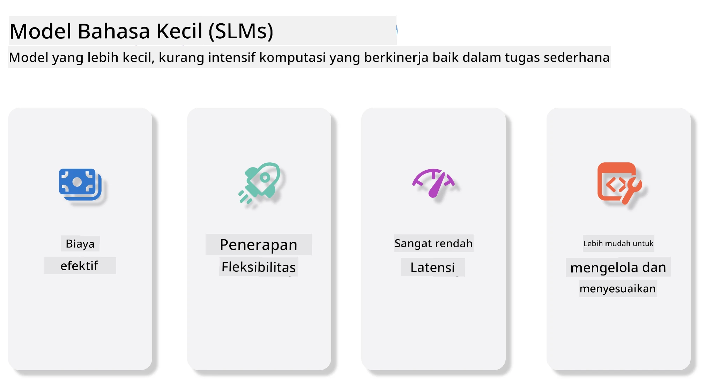
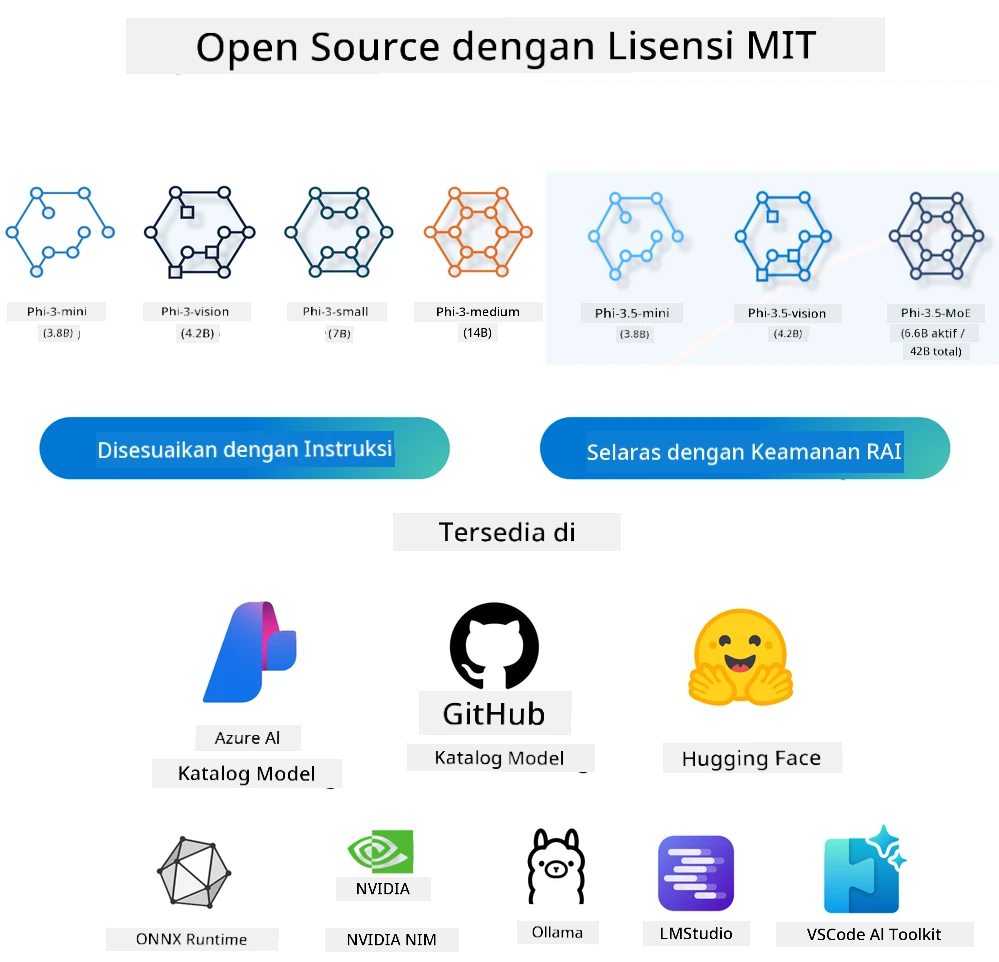
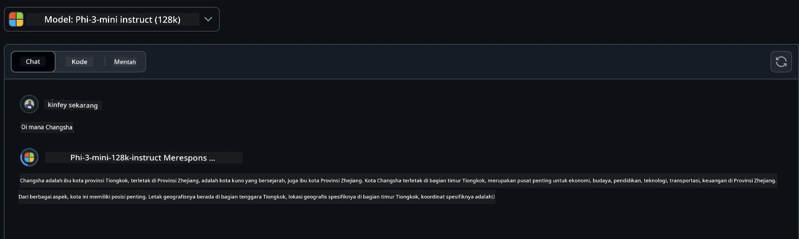
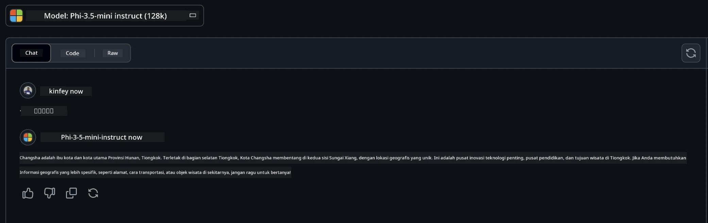

# Pengenalan Model Bahasa Kecil untuk AI Generatif bagi Pemula
AI generatif adalah bidang kecerdasan buatan yang menarik yang berfokus pada pembuatan sistem yang mampu menghasilkan konten baru. Konten ini bisa berupa teks dan gambar hingga musik dan bahkan lingkungan virtual secara keseluruhan. Salah satu aplikasi paling menarik dari AI generatif ada di ranah model bahasa.

## Apa Itu Model Bahasa Kecil?

Model Bahasa Kecil (SLM) merupakan varian yang diperkecil dari model bahasa besar (LLM), memanfaatkan banyak prinsip dan teknik arsitektural dari LLM, sambil menunjukkan jejak komputasi yang jauh lebih kecil.

SLM adalah subset model bahasa yang dirancang untuk menghasilkan teks menyerupai manusia. Berbeda dengan rekan-rekan mereka yang lebih besar, seperti GPT-4, SLM lebih kompak dan efisien, membuatnya ideal untuk aplikasi di mana sumber daya komputasi terbatas. Meskipun ukurannya lebih kecil, mereka masih dapat melakukan berbagai tugas. Biasanya, SLM dibuat dengan mengompres atau mengekstraksi LLM, bertujuan mempertahankan sebagian besar fungsi dan kemampuan linguistik dari model aslinya. Pengurangan ukuran model ini mengurangi kompleksitas keseluruhan, menjadikan SLM lebih efisien dalam hal penggunaan memori dan kebutuhan komputasi. Meski dioptimalkan sedemikian rupa, SLM tetap bisa melakukan berbagai tugas pengolahan bahasa alami (NLP):

- Pembuatan Teks: Membuat kalimat atau paragraf yang koheren dan relevan secara kontekstual.
- Penyelesaian Teks: Memprediksi dan menyelesaikan kalimat berdasarkan petunjuk yang diberikan.
- Penerjemahan: Mengonversi teks dari satu bahasa ke bahasa lain.
- Ringkasan: Meringkas teks panjang menjadi ringkasan yang lebih singkat dan mudah dicerna.

Namun dengan beberapa kompromi dalam performa atau kedalaman pemahaman dibandingkan dengan rekan mereka yang lebih besar.

## Bagaimana Cara Kerja Model Bahasa Kecil?
SLM dilatih dengan jumlah data teks yang sangat besar. Selama pelatihan, mereka mempelajari pola dan struktur bahasa, memungkinkan mereka menghasilkan teks yang baik secara tata bahasa dan tepat konteks. Proses pelatihan meliputi:

- Pengumpulan Data: Mengumpulkan dataset teks besar dari berbagai sumber.
- Pra-pemrosesan: Membersihkan dan mengorganisasi data agar cocok untuk pelatihan.
- Pelatihan: Menggunakan algoritme pembelajaran mesin untuk mengajarkan model memahami dan menghasilkan teks.
- Penyesuaian: Mengatur model untuk meningkatkan performa pada tugas tertentu.

Pengembangan SLM sejalan dengan kebutuhan yang meningkat akan model yang bisa diterapkan di lingkungan dengan sumber daya terbatas, seperti perangkat seluler atau platform edge computing, di mana LLM skala penuh mungkin tidak praktis karena tuntutan sumber daya yang besar. Dengan fokus pada efisiensi, SLM menyeimbangkan performa dengan aksesibilitas, memungkinkan aplikasi yang lebih luas di berbagai domain.



## Tujuan Pembelajaran

Dalam pelajaran ini, kami berharap memperkenalkan pengetahuan tentang SLM dan menggabungkannya dengan Microsoft Phi-3 untuk mempelajari berbagai skenario dalam konten teks, visi, dan MoE.

Di akhir pelajaran ini, Anda diharapkan dapat menjawab pertanyaan berikut:

- Apa itu SLM?
- Apa perbedaan antara SLM dan LLM?
- Apa itu Keluarga Microsoft Phi-3/3.5?
- Bagaimana menjalankan inference dengan Keluarga Microsoft Phi-3/3.5?

Siap? Mari kita mulai.

## Perbedaan antara Model Bahasa Besar (LLM) dan Model Bahasa Kecil (SLM)

Baik LLM maupun SLM dibangun di atas prinsip dasar pembelajaran mesin probabilistik, mengikuti pendekatan yang serupa dalam desain arsitektur, metodologi pelatihan, proses pembuatan data, dan teknik evaluasi model. Namun, beberapa faktor utama membedakan kedua jenis model ini.

## Aplikasi Model Bahasa Kecil

SLM memiliki berbagai aplikasi, termasuk:

- Chatbot: Menyediakan dukungan pelanggan dan berinteraksi dengan pengguna secara percakapan.
- Pembuatan Konten: Membantu penulis dengan menghasilkan ide atau bahkan menyusun artikel secara keseluruhan.
- Pendidikan: Membantu siswa dalam penugasan menulis atau belajar bahasa baru.
- Aksesibilitas: Membuat alat untuk individu dengan disabilitas, seperti sistem teks-ke-suara.

**Ukuran**

Perbedaan utama antara LLM dan SLM terletak pada skala model. LLM, seperti ChatGPT (GPT-4), dapat terdiri dari sekitar 1,76 triliun parameter, sedangkan SLM open-source seperti Mistral 7B dirancang dengan parameter yang jauh lebih sedikit — sekitar 7 miliar. Perbedaan ini terutama disebabkan oleh variasi arsitektur dan proses pelatihan model. Misalnya, ChatGPT menggunakan mekanisme self-attention dalam kerangka encoder-decoder, sementara Mistral 7B menggunakan sliding window attention, yang memungkinkan pelatihan lebih efisien dalam model decoder saja. Variasi arsitektural ini berdampak besar pada kompleksitas dan performa model.

**Pemahaman**

SLM biasanya dioptimalkan untuk performa dalam domain tertentu, membuatnya sangat spesialis tetapi mungkin terbatas dalam kemampuan memberikan pemahaman kontekstual luas di banyak bidang ilmu. Sebaliknya, LLM bertujuan meniru kecerdasan seperti manusia pada tingkat yang lebih komprehensif. Dilatih dengan dataset yang besar dan beragam, LLM dirancang untuk berkinerja baik di berbagai domain, menawarkan fleksibilitas dan adaptabilitas yang lebih tinggi. Oleh karena itu, LLM lebih cocok untuk beragam tugas lanjutan, seperti pengolahan bahasa alami dan pemrograman.

**Komputasi**

Pelatihan dan penerapan LLM adalah proses yang boros sumber daya, seringkali membutuhkan infrastruktur komputasi besar, termasuk kluster GPU skala besar. Misalnya, pelatihan model seperti ChatGPT dari awal bisa memerlukan ribuan GPU dalam jangka waktu yang panjang. Sebaliknya, SLM dengan jumlah parameter yang lebih kecil, lebih mudah diakses dari segi sumber daya komputasi. Model seperti Mistral 7B bisa dilatih dan dijalankan pada mesin lokal dengan kemampuan GPU moderat, meskipun pelatihan masih memerlukan beberapa jam di beberapa GPU.

**Bias**

Bias adalah masalah yang dikenal dalam LLM, terutama karena sifat data pelatihannya. Model-model ini sering bergantung pada data mentah yang tersedia secara bebas di internet, yang mungkin kurang mewakili atau salah merepresentasikan kelompok tertentu, memperkenalkan pelabelan yang keliru, atau mencerminkan bias linguistik yang dipengaruhi oleh dialek, variasi geografis, dan aturan tata bahasa. Selain itu, kompleksitas arsitektur LLM bisa secara tidak sengaja memperparah bias, yang bisa tidak terdeteksi tanpa penyesuaian yang teliti. Di sisi lain, SLM, yang dilatih pada dataset yang lebih terbatas dan khusus domain, cenderung kurang rentan terhadap bias tersebut, meskipun tidak sepenuhnya kebal.

**Inference**

Ukuran yang lebih kecil pada SLM memberikan keuntungan besar dalam hal kecepatan inference, memungkinkan mereka menghasilkan output dengan efisien pada perangkat keras lokal tanpa memerlukan proses paralel yang intensif. Sebaliknya, LLM, karena ukurannya dan kompleksitasnya, sering memerlukan sumber daya komputasi paralel yang besar untuk mencapai waktu inference yang dapat diterima. Kehadiran banyak pengguna bersamaan juga memperlambat waktu respons LLM, terutama saat diterapkan secara skala besar.

Singkatnya, meskipun LLM dan SLM memiliki dasar yang sama dalam pembelajaran mesin, keduanya berbeda secara signifikan dalam ukuran model, kebutuhan sumber daya, pemahaman kontekstual, kerentanan terhadap bias, dan kecepatan inference. Perbedaan ini mencerminkan kesesuaian mereka masing-masing untuk penggunaan yang berbeda, dengan LLM lebih serbaguna tetapi boros sumber daya, dan SLM menawarkan efisiensi domain-spesifik dengan kebutuhan komputasi yang lebih rendah.

***Catatan: Dalam pelajaran ini, kami akan memperkenalkan SLM menggunakan Microsoft Phi-3 / 3.5 sebagai contoh.***

## Memperkenalkan Keluarga Phi-3 / Phi-3.5

Keluarga Phi-3 / 3.5 terutama menargetkan skenario aplikasi teks, visi, dan Agen (MoE):

### Phi-3 / 3.5 Instruct

Terutama untuk pembuatan teks, penyelesaian percakapan, dan ekstraksi informasi konten, dll.

**Phi-3-mini**

Model bahasa 3.8B tersedia di Microsoft Azure AI Studio, Hugging Face, dan Ollama. Model Phi-3 tampil jauh lebih baik dibanding model bahasa dengan ukuran serupa atau lebih besar pada tolok ukur utama (lihat angka tolok ukur di bawah, angka lebih tinggi lebih baik). Phi-3-mini melampaui model dua kali ukurannya, sementara Phi-3-small dan Phi-3-medium mengungguli model yang lebih besar, termasuk GPT-3.5.

**Phi-3-small & medium**

Dengan hanya 7 miliar parameter, Phi-3-small mengalahkan GPT-3.5T pada berbagai tolok ukur bahasa, penalaran, pemrograman, dan matematika.

Phi-3-medium dengan 14 miliar parameter melanjutkan tren ini dan mengungguli Gemini 1.0 Pro.

**Phi-3.5-mini**

Kita bisa menganggapnya sebagai peningkatan dari Phi-3-mini. Meski parameter tetap sama, kemampuannya meningkat untuk mendukung berbagai bahasa (mendukung 20+ bahasa: Arab, Cina, Ceko, Denmark, Belanda, Inggris, Finlandia, Perancis, Jerman, Ibrani, Hongaria, Italia, Jepang, Korea, Norwegia, Polandia, Portugis, Rusia, Spanyol, Swedia, Thai, Turki, Ukraina) dan menambahkan dukungan lebih kuat untuk konteks panjang.

Phi-3.5-mini dengan 3.8 miliar parameter mengungguli model bahasa ukuran sama dan setara dengan model dua kali ukurannya.

### Phi-3 / 3.5 Vision

Kita bisa menganggap model Instruct Phi-3/3.5 sebagai kemampuan Phi untuk memahami, dan Vision memberi Phi mata untuk memahami dunia.

**Phi-3-Vision**

Phi-3-vision, dengan hanya 4.2 miliar parameter, melanjutkan tren ini dan mengungguli model lebih besar seperti Claude-3 Haiku dan Gemini 1.0 Pro V pada tugas penalaran visual umum, OCR, serta pemahaman tabel dan diagram.

**Phi-3.5-Vision**

Phi-3.5-Vision juga merupakan peningkatan dari Phi-3-Vision, menambahkan dukungan untuk beberapa gambar. Anda bisa menganggapnya sebagai perbaikan dalam visi, tidak hanya bisa melihat gambar tetapi juga video.

Phi-3.5-vision mengungguli model yang lebih besar seperti Claude-3.5 Sonnet dan Gemini 1.5 Flash dalam tugas OCR, pemahaman tabel dan grafik, dan setara pada tugas penalaran pengetahuan visual umum. Mendukung input multi-frame, yaitu melakukan penalaran pada beberapa gambar input.

### Phi-3.5-MoE

***Mixture of Experts (MoE)*** memungkinkan model untuk dipra-latih dengan jauh lebih sedikit komputasi, yang berarti Anda dapat secara dramatis meningkatkan ukuran model atau dataset dengan anggaran komputasi yang sama seperti model dense. Secara khusus, model MoE harus mencapai kualitas yang sama dengan padanan dense-nya jauh lebih cepat selama pra-latihan.

Phi-3.5-MoE terdiri dari 16x3.8B modul ahli. Phi-3.5-MoE dengan hanya 6.6 miliar parameter aktif mencapai tingkat penalaran, pemahaman bahasa, dan matematika yang serupa dengan model yang jauh lebih besar.

Kita dapat menggunakan model Keluarga Phi-3/3.5 berdasarkan berbagai skenario. Tidak seperti LLM, Anda dapat menerapkan Phi-3/3.5-mini atau Phi-3/3.5-Vision pada perangkat edge.

## Cara menggunakan model Keluarga Phi-3/3.5

Kami berharap menggunakan Phi-3/3.5 dalam berbagai skenario. Selanjutnya, kita akan menggunakan Phi-3/3.5 berdasarkan berbagai skenario.



### Inference melalui Cloud API

**GitHub Models**

GitHub Models adalah cara paling langsung. Anda dapat dengan cepat mengakses model Phi-3/3.5-Instruct melalui GitHub Models. Dilengkapi dengan Azure AI Inference SDK / OpenAI SDK, Anda dapat mengakses API lewat kode untuk menyelesaikan pemanggilan Phi-3/3.5-Instruct. Anda juga dapat menguji berbagai efek melalui Playground.

- Demo: Perbandingan efek Phi-3-mini dan Phi-3.5-mini dalam skenario bahasa Cina





**Azure AI Studio**

Atau jika kita ingin menggunakan model visi dan MoE, Anda bisa memakai Azure AI Studio untuk melakukan pemanggilan. Jika tertarik, Anda bisa membaca Phi-3 Cookbook untuk belajar cara memanggil Phi-3/3.5 Instruct, Vision, MoE melalui Azure AI Studio [Klik tautan ini](https://github.com/microsoft/Phi-3CookBook/blob/main/md/02.QuickStart/AzureAIStudio_QuickStart.md?WT.mc_id=academic-105485-koreyst)

**NVIDIA NIM**

Selain solusi katalog model berbasis cloud yang disediakan oleh Azure dan GitHub, Anda juga dapat menggunakan [NVIDIA NIM](https://developer.nvidia.com/nim?WT.mc_id=academic-105485-koreyst) untuk menyelesaikan pemanggilan terkait. Anda dapat mengunjungi NVIDIA NIM untuk menyelesaikan panggilan API dari Keluarga Phi-3/3.5. NVIDIA NIM (NVIDIA Inference Microservices) adalah kumpulan microservices inference yang dipercepat yang dirancang untuk membantu pengembang menerapkan model AI secara efisien di berbagai lingkungan, termasuk cloud, pusat data, dan workstation.

Berikut beberapa fitur utama dari NVIDIA NIM:
- **Kemudahan Penyebaran:** NIM memungkinkan penyebaran model AI dengan satu perintah, membuatnya mudah untuk diintegrasikan ke dalam alur kerja yang sudah ada.
- **Performa Teroptimalisasi:** NIM memanfaatkan mesin inferensi yang sudah dioptimalkan dari NVIDIA, seperti TensorRT dan TensorRT-LLM, untuk memastikan latensi rendah dan throughput tinggi.
- **Skalabilitas:** NIM mendukung autoscaling di Kubernetes, memungkinkan penanganan beban kerja yang bervariasi secara efektif.
- **Keamanan dan Kontrol:** Organisasi dapat mempertahankan kontrol atas data dan aplikasi mereka dengan meng-hosting sendiri layanan mikro NIM di infrastruktur yang mereka kelola.
- **API Standar:** NIM menyediakan API standar industri, sehingga mudah untuk membangun dan mengintegrasikan aplikasi AI seperti chatbot, asisten AI, dan lainnya.

NIM adalah bagian dari NVIDIA AI Enterprise, yang bertujuan untuk menyederhanakan penyebaran dan pengoperasian model AI, memastikan model berjalan secara efisien di GPU NVIDIA.

- Demo: Menggunakan NVIDIA NIM untuk memanggil Phi-3.5-Vision-API  [[Klik tautan ini](./python/Phi-3-Vision-Nividia-NIM.ipynb?WT.mc_id=academic-105485-koreyst)]


### Menjalankan Phi-3/3.5 Secara Lokal
Inferensi terkait Phi-3, atau model bahasa apa pun seperti GPT-3, mengacu pada proses menghasilkan respons atau prediksi berdasarkan input yang diterimanya. Ketika Anda memberikan prompt atau pertanyaan ke Phi-3, model ini menggunakan jaringan saraf yang terlatih untuk menafsirkan respons yang paling mungkin dan relevan dengan menganalisis pola dan hubungan dalam data yang telah dilatih.

**Hugging Face Transformer**
Hugging Face Transformers adalah perpustakaan kuat yang dirancang untuk pemrosesan bahasa alami (NLP) dan tugas pembelajaran mesin lainnya. Berikut beberapa poin kunci tentangnya:

1. **Model Pra-latih:** Menyediakan ribuan model pra-latih yang dapat digunakan untuk berbagai tugas seperti klasifikasi teks, pengenalan entitas bernama, penjawaban pertanyaan, penyusunan ringkasan, penerjemahan, dan pembuatan teks.

2. **Interoperabilitas Kerangka Kerja:** Perpustakaan ini mendukung berbagai kerangka kerja pembelajaran dalam seperti PyTorch, TensorFlow, dan JAX. Ini memungkinkan Anda melatih model dalam satu kerangka kerja dan menggunakannya di kerangka kerja lain.

3. **Kemampuan Multimodal:** Selain NLP, Hugging Face Transformers juga mendukung tugas di penglihatan komputer (misalnya klasifikasi gambar, deteksi objek) dan pemrosesan audio (misalnya pengenalan suara, klasifikasi audio).

4. **Kemudahan Penggunaan:** Perpustakaan ini menawarkan API dan alat untuk dengan mudah mengunduh dan menyesuaikan model, menjadikannya dapat diakses untuk pemula maupun ahli.

5. **Komunitas dan Sumber Daya:** Hugging Face memiliki komunitas yang aktif dan dokumentasi, tutorial, serta panduan yang luas untuk membantu pengguna memulai dan memaksimalkan penggunaan perpustakaan.
[dokumentasi resmi](https://huggingface.co/docs/transformers/index?WT.mc_id=academic-105485-koreyst) atau [repositori GitHub mereka](https://github.com/huggingface/transformers?WT.mc_id=academic-105485-koreyst).

Ini adalah metode yang paling umum digunakan, tetapi juga memerlukan akselerasi GPU. Bagaimanapun, skenario seperti Vision dan MoE membutuhkan banyak perhitungan, yang akan sangat lambat jika dijalankan di CPU tanpa quantization.


- Demo: Menggunakan Transformer untuk memanggil Phi-3.5-Instruct [Klik tautan ini](./python/phi35-instruct-demo.ipynb?WT.mc_id=academic-105485-koreyst)

- Demo: Menggunakan Transformer untuk memanggil Phi-3.5-Vision [Klik tautan ini](./python/phi35-vision-demo.ipynb?WT.mc_id=academic-105485-koreyst)

- Demo: Menggunakan Transformer untuk memanggil Phi-3.5-MoE [Klik tautan ini](./python/phi35_moe_demo.ipynb?WT.mc_id=academic-105485-koreyst)

**Ollama**
[Ollama](https://ollama.com/?WT.mc_id=academic-105485-koreyst) adalah platform yang dirancang untuk mempermudah menjalankan model bahasa besar (LLM) secara lokal di mesin Anda. Platform ini mendukung berbagai model seperti Llama 3.1, Phi 3, Mistral, dan Gemma 2, di antara lainnya. Platform ini menyederhanakan proses dengan menggabungkan bobot model, konfigurasi, dan data menjadi satu paket, sehingga lebih mudah diakses untuk pengguna menyesuaikan dan membuat model mereka sendiri. Ollama tersedia untuk macOS, Linux, dan Windows. Ini adalah alat yang sangat baik jika Anda ingin bereksperimen atau menyebarkan LLM tanpa bergantung pada layanan cloud. Ollama adalah cara paling langsung, Anda hanya perlu menjalankan perintah berikut.


```bash

ollama run phi3.5

```


**ONNX Runtime untuk GenAI**

[ONNX Runtime](https://github.com/microsoft/onnxruntime-genai?WT.mc_id=academic-105485-koreyst) adalah akselerator pelatihan dan inferensi pembelajaran mesin lintas platform. ONNX Runtime untuk Generative AI (GENAI) adalah alat kuat yang membantu Anda menjalankan model AI generatif secara efisien di berbagai platform.

## Apa itu ONNX Runtime?
ONNX Runtime adalah proyek sumber terbuka yang memungkinkan inferensi berkinerja tinggi pada model pembelajaran mesin. Ini mendukung model dalam format Open Neural Network Exchange (ONNX), yang merupakan standar untuk merepresentasikan model pembelajaran mesin. Inferensi ONNX Runtime dapat meningkatkan pengalaman pelanggan yang lebih cepat dan mengurangi biaya, mendukung model dari kerangka kerja pembelajaran dalam seperti PyTorch dan TensorFlow/Keras serta perpustakaan pembelajaran mesin klasik seperti scikit-learn, LightGBM, XGBoost, dan lain-lain. ONNX Runtime kompatibel dengan berbagai perangkat keras, driver, dan sistem operasi, serta memberikan performa optimal dengan memanfaatkan akselerator perangkat keras jika tersedia bersamaan dengan optimasi dan transformasi graf.

## Apa itu Generative AI?
Generative AI mengacu pada sistem AI yang dapat menghasilkan konten baru, seperti teks, gambar, atau musik, berdasarkan data yang telah mereka latih. Contohnya termasuk model bahasa seperti GPT-3 dan model generasi gambar seperti Stable Diffusion. Perpustakaan ONNX Runtime untuk GenAI menyediakan loop AI generatif untuk model ONNX, termasuk inferensi dengan ONNX Runtime, pemrosesan logits, pencarian dan pengambilan sampel, dan manajemen cache KV.

## ONNX Runtime untuk GENAI
ONNX Runtime untuk GENAI memperluas kemampuan ONNX Runtime untuk mendukung model AI generatif. Beberapa fitur utama:

- **Dukungan Platform Luas:** Bekerja di berbagai platform termasuk Windows, Linux, macOS, Android, dan iOS.
- **Dukungan Model:** Mendukung banyak model AI generatif populer seperti LLaMA, GPT-Neo, BLOOM, dan lainnya.
- **Optimasi Performa:** Termasuk optimasi untuk akselerator perangkat keras yang berbeda seperti GPU NVIDIA, GPU AMD, dan lainnya.
- **Kemudahan Penggunaan:** Menyediakan API untuk integrasi mudah ke aplikasi, memungkinkan Anda menghasilkan teks, gambar, dan konten lain dengan kode minimal.
- Pengguna dapat memanggil metode generate() tingkat tinggi, atau menjalankan setiap iterasi model dalam loop, menghasilkan satu token sekaligus, dan opsional memperbarui parameter generasi di dalam loop.
- ONNX runtime juga mendukung greedy/beam search dan pengambilan sampel TopP, TopK untuk menghasilkan urutan token serta pemrosesan logits bawaan seperti penalti pengulangan. Anda juga dapat dengan mudah menambahkan penilaian khusus.

## Memulai
Untuk memulai dengan ONNX Runtime untuk GENAI, Anda dapat mengikuti langkah-langkah berikut:

### Instal ONNX Runtime:
```Python
pip install onnxruntime
```
### Instal Ekstensi Generative AI:
```Python
pip install onnxruntime-genai
```

### Jalankan Model: Berikut contoh sederhana dengan Python:
```Python
import onnxruntime_genai as og

model = og.Model('path_to_your_model.onnx')

tokenizer = og.Tokenizer(model)

input_text = "Hello, how are you?"

input_tokens = tokenizer.encode(input_text)

output_tokens = model.generate(input_tokens)

output_text = tokenizer.decode(output_tokens)

print(output_text) 
```
### Demo:Menggunakan ONNX Runtime GenAI untuk memanggil Phi-3.5-Vision


```python

import onnxruntime_genai as og

model_path = './Your Phi-3.5-vision-instruct ONNX Path'

img_path = './Your Image Path'

model = og.Model(model_path)

processor = model.create_multimodal_processor()

tokenizer_stream = processor.create_stream()

text = "Your Prompt"

prompt = "<|user|>\n"

prompt += "<|image_1|>\n"

prompt += f"{text}<|end|>\n"

prompt += "<|assistant|>\n"

image = og.Images.open(img_path)

inputs = processor(prompt, images=image)

params = og.GeneratorParams(model)

params.set_inputs(inputs)

params.set_search_options(max_length=3072)

generator = og.Generator(model, params)

while not generator.is_done():

    generator.compute_logits()
    
    generator.generate_next_token()

    new_token = generator.get_next_tokens()[0]
    
    output = tokenizer_stream.decode(new_token)
    
    print(tokenizer_stream.decode(new_token), end='', flush=True)

```


**Lainnya**

Selain metode referensi ONNX Runtime dan Ollama, kita juga dapat melengkapi referensi model kuantitatif berdasarkan metode referensi model yang disediakan oleh berbagai vendor. Seperti framework Apple MLX dengan Apple Metal, Qualcomm QNN dengan NPU, Intel OpenVINO dengan CPU/GPU, dan lain-lain. Anda juga dapat mendapatkan lebih banyak konten dari [Phi-3 Cookbook](https://github.com/microsoft/phi-3cookbook?WT.mc_id=academic-105485-koreyst)


## Lainnya

Kita telah mempelajari dasar-dasar keluarga Phi-3/3.5, tetapi untuk mempelajari lebih lanjut tentang SLM kita membutuhkan lebih banyak pengetahuan. Anda dapat menemukan jawabannya di Phi-3 Cookbook. Jika ingin belajar lebih banyak, silakan kunjungi [Phi-3 Cookbook](https://github.com/microsoft/phi-3cookbook?WT.mc_id=academic-105485-koreyst).

---

<!-- CO-OP TRANSLATOR DISCLAIMER START -->
**Penafian**:  
Dokumen ini telah diterjemahkan menggunakan layanan terjemahan AI [Co-op Translator](https://github.com/Azure/co-op-translator). Meskipun kami berupaya untuk mencapai tingkat akurasi, harap diingat bahwa terjemahan otomatis mungkin mengandung kesalahan atau ketidakakuratan. Dokumen asli dalam bahasa aslinya harus dianggap sebagai sumber yang otoritatif. Untuk informasi yang penting, disarankan menggunakan terjemahan profesional oleh manusia. Kami tidak bertanggung jawab atas kesalahpahaman atau penafsiran yang salah yang mungkin timbul dari penggunaan terjemahan ini.
<!-- CO-OP TRANSLATOR DISCLAIMER END -->