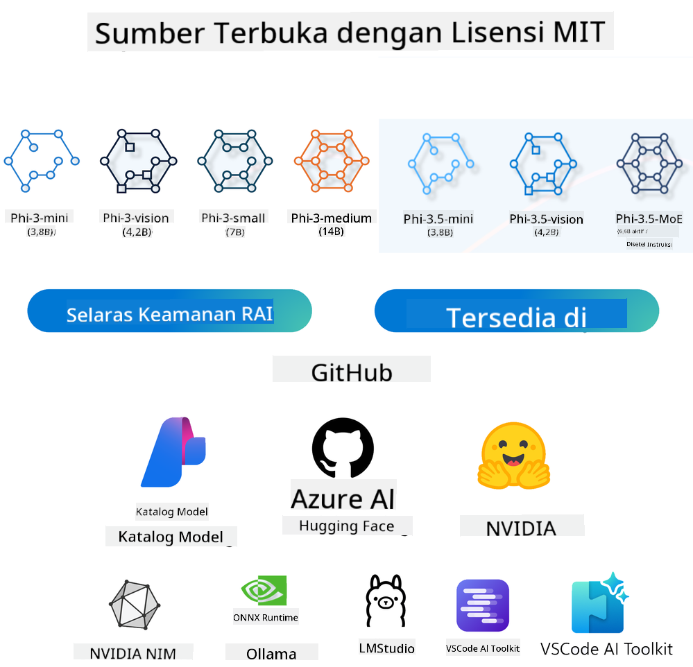

<!--
CO_OP_TRANSLATOR_METADATA:
{
  "original_hash": "124ad36cfe96f74038811b6e2bb93e9d",
  "translation_date": "2025-07-09T18:41:39+00:00",
  "source_file": "19-slm/README.md",
  "language_code": "id"
}
-->
# Pengenalan Model Bahasa Kecil untuk Generative AI bagi Pemula  
Generative AI adalah bidang kecerdasan buatan yang menarik yang berfokus pada pembuatan sistem yang mampu menghasilkan konten baru. Konten ini bisa berupa teks, gambar, musik, bahkan lingkungan virtual secara keseluruhan. Salah satu aplikasi paling menarik dari generative AI adalah dalam ranah model bahasa.

## Apa Itu Model Bahasa Kecil?  

Model Bahasa Kecil (Small Language Model/SLM) adalah varian yang diperkecil dari model bahasa besar (Large Language Model/LLM), yang memanfaatkan banyak prinsip arsitektur dan teknik dari LLM, namun dengan jejak komputasi yang jauh lebih kecil.  

SLM adalah subset dari model bahasa yang dirancang untuk menghasilkan teks yang menyerupai bahasa manusia. Berbeda dengan model yang lebih besar seperti GPT-4, SLM lebih ringkas dan efisien, sehingga ideal untuk aplikasi dengan keterbatasan sumber daya komputasi. Meskipun ukurannya lebih kecil, SLM tetap mampu melakukan berbagai tugas. Biasanya, SLM dibuat dengan cara mengompresi atau mendistilasi LLM, dengan tujuan mempertahankan sebagian besar fungsi dan kemampuan linguistik model asli. Pengurangan ukuran model ini menurunkan kompleksitas keseluruhan, sehingga SLM lebih efisien dalam penggunaan memori dan kebutuhan komputasi. Meskipun dioptimalkan, SLM masih dapat melakukan berbagai tugas pemrosesan bahasa alami (NLP), seperti:  

- Pembuatan Teks: Membuat kalimat atau paragraf yang koheren dan relevan secara kontekstual.  
- Penyelesaian Teks: Memprediksi dan melengkapi kalimat berdasarkan prompt yang diberikan.  
- Terjemahan: Mengubah teks dari satu bahasa ke bahasa lain.  
- Ringkasan: Merangkum teks panjang menjadi versi yang lebih singkat dan mudah dipahami.  

Namun, ada beberapa kompromi dalam hal performa atau kedalaman pemahaman dibandingkan dengan model yang lebih besar.

## Bagaimana Cara Kerja Model Bahasa Kecil?  
SLM dilatih menggunakan sejumlah besar data teks. Selama pelatihan, model mempelajari pola dan struktur bahasa, sehingga mampu menghasilkan teks yang tata bahasanya benar dan sesuai konteks. Proses pelatihan meliputi:  

- Pengumpulan Data: Mengumpulkan dataset teks besar dari berbagai sumber.  
- Pra-pemrosesan: Membersihkan dan mengorganisasi data agar siap untuk pelatihan.  
- Pelatihan: Menggunakan algoritma machine learning untuk mengajarkan model memahami dan menghasilkan teks.  
- Fine-Tuning: Menyesuaikan model agar performanya lebih baik pada tugas tertentu.  

Pengembangan SLM sejalan dengan kebutuhan yang meningkat akan model yang dapat dijalankan di lingkungan dengan sumber daya terbatas, seperti perangkat mobile atau platform edge computing, di mana LLM skala penuh mungkin tidak praktis karena kebutuhan sumber daya yang besar. Dengan fokus pada efisiensi, SLM menyeimbangkan performa dan aksesibilitas, memungkinkan aplikasi yang lebih luas di berbagai bidang.


## Tujuan Pembelajaran  

Dalam pelajaran ini, kami berharap dapat memperkenalkan pengetahuan tentang SLM dan menggabungkannya dengan Microsoft Phi-3 untuk mempelajari berbagai skenario dalam konten teks, visi, dan MoE.

Di akhir pelajaran ini, Anda diharapkan dapat menjawab pertanyaan berikut:  

- Apa itu SLM  
- Apa perbedaan antara SLM dan LLM  
- Apa itu Microsoft Phi-3/3.5 Family  
- Bagaimana melakukan inferensi Microsoft Phi-3/3.5 Family  

Siap? Mari kita mulai.

## Perbedaan antara Large Language Models (LLMs) dan Small Language Models (SLMs)  

Baik LLM maupun SLM dibangun berdasarkan prinsip dasar pembelajaran mesin probabilistik, mengikuti pendekatan serupa dalam desain arsitektur, metodologi pelatihan, proses pembuatan data, dan teknik evaluasi model. Namun, ada beberapa faktor kunci yang membedakan kedua jenis model ini.

## Aplikasi Model Bahasa Kecil  

SLM memiliki berbagai aplikasi, antara lain:  

- Chatbot: Memberikan dukungan pelanggan dan berinteraksi dengan pengguna secara percakapan.  
- Pembuatan Konten: Membantu penulis dengan menghasilkan ide atau bahkan menyusun artikel secara keseluruhan.  
- Pendidikan: Membantu siswa dalam tugas menulis atau belajar bahasa baru.  
- Aksesibilitas: Membuat alat untuk individu dengan disabilitas, seperti sistem teks-ke-suara.  

**Ukuran**  

Perbedaan utama antara LLM dan SLM terletak pada skala model. LLM seperti ChatGPT (GPT-4) dapat memiliki sekitar 1,76 triliun parameter, sementara SLM open-source seperti Mistral 7B dirancang dengan parameter jauh lebih sedikit, sekitar 7 miliar. Perbedaan ini terutama disebabkan oleh arsitektur model dan proses pelatihan yang berbeda. Misalnya, ChatGPT menggunakan mekanisme self-attention dalam kerangka encoder-decoder, sedangkan Mistral 7B menggunakan sliding window attention yang memungkinkan pelatihan lebih efisien dalam model decoder-only. Variasi arsitektur ini berdampak besar pada kompleksitas dan performa model.  

**Pemahaman**  

SLM biasanya dioptimalkan untuk performa dalam domain tertentu, sehingga sangat spesifik namun mungkin terbatas dalam memberikan pemahaman kontekstual yang luas di berbagai bidang pengetahuan. Sebaliknya, LLM bertujuan meniru kecerdasan manusia secara lebih komprehensif. Dilatih dengan dataset yang sangat besar dan beragam, LLM dirancang untuk bekerja baik di berbagai domain, menawarkan fleksibilitas dan adaptabilitas yang lebih tinggi. Oleh karena itu, LLM lebih cocok untuk berbagai tugas lanjutan, seperti pemrosesan bahasa alami dan pemrograman.  

**Komputasi**  

Pelatihan dan penerapan LLM membutuhkan sumber daya yang besar, sering kali memerlukan infrastruktur komputasi yang masif, termasuk klaster GPU skala besar. Misalnya, pelatihan model seperti ChatGPT dari awal bisa memerlukan ribuan GPU selama waktu yang lama. Sebaliknya, SLM dengan jumlah parameter yang lebih kecil lebih mudah diakses dari sisi sumber daya komputasi. Model seperti Mistral 7B dapat dilatih dan dijalankan di mesin lokal dengan GPU yang cukup, meskipun pelatihan tetap memerlukan beberapa jam dengan beberapa GPU.  

**Bias**  

Bias adalah masalah yang dikenal pada LLM, terutama karena sifat data pelatihan. Model ini sering menggunakan data mentah yang tersedia secara terbuka di internet, yang mungkin kurang mewakili atau salah menggambarkan kelompok tertentu, memperkenalkan label yang keliru, atau mencerminkan bias linguistik yang dipengaruhi oleh dialek, variasi geografis, dan aturan tata bahasa. Selain itu, kompleksitas arsitektur LLM dapat memperparah bias ini tanpa disadari tanpa fine-tuning yang cermat. Di sisi lain, SLM yang dilatih pada dataset yang lebih terbatas dan spesifik domain cenderung kurang rentan terhadap bias tersebut, meskipun tidak sepenuhnya kebal.  

**Inferensi**  

Ukuran SLM yang lebih kecil memberikan keuntungan signifikan dalam kecepatan inferensi, memungkinkan mereka menghasilkan output secara efisien di perangkat lokal tanpa memerlukan pemrosesan paralel yang besar. Sebaliknya, LLM karena ukuran dan kompleksitasnya sering membutuhkan sumber daya komputasi paralel yang besar untuk mencapai waktu inferensi yang dapat diterima. Kehadiran banyak pengguna secara bersamaan juga memperlambat waktu respons LLM, terutama saat digunakan dalam skala besar.  

Singkatnya, meskipun LLM dan SLM memiliki dasar pembelajaran mesin yang sama, keduanya berbeda secara signifikan dalam ukuran model, kebutuhan sumber daya, pemahaman kontekstual, kerentanan terhadap bias, dan kecepatan inferensi. Perbedaan ini mencerminkan kesesuaian masing-masing untuk berbagai kasus penggunaan, dengan LLM yang lebih serbaguna namun berat sumber daya, dan SLM yang menawarkan efisiensi domain-spesifik dengan kebutuhan komputasi yang lebih rendah.

***Note：Dalam bab ini, kami akan memperkenalkan SLM menggunakan Microsoft Phi-3 / 3.5 sebagai contoh.***

## Memperkenalkan Phi-3 / Phi-3.5 Family  

Phi-3 / 3.5 Family terutama menargetkan skenario aplikasi teks, visi, dan Agent (MoE):

### Phi-3 / 3.5 Instruct  

Utamanya untuk pembuatan teks, penyelesaian chat, dan ekstraksi informasi konten, dll.

**Phi-3-mini**  

Model bahasa 3.8B tersedia di Microsoft Azure AI Studio, Hugging Face, dan Ollama. Model Phi-3 secara signifikan mengungguli model bahasa dengan ukuran sama atau lebih besar pada tolok ukur utama (lihat angka tolok ukur di bawah, angka lebih tinggi lebih baik). Phi-3-mini mengungguli model dengan ukuran dua kali lipat, sementara Phi-3-small dan Phi-3-medium mengungguli model yang lebih besar, termasuk GPT-3.5.  

**Phi-3-small & medium**  

Dengan hanya 7B parameter, Phi-3-small mengalahkan GPT-3.5T pada berbagai tolok ukur bahasa, penalaran, pemrograman, dan matematika.  

Phi-3-medium dengan 14B parameter melanjutkan tren ini dan mengungguli Gemini 1.0 Pro.  

**Phi-3.5-mini**  

Dapat dianggap sebagai peningkatan dari Phi-3-mini. Meskipun parameter tetap sama, model ini meningkatkan kemampuan mendukung banyak bahasa (mendukung lebih dari 20 bahasa: Arab, Cina, Ceko, Denmark, Belanda, Inggris, Finlandia, Prancis, Jerman, Ibrani, Hungaria, Italia, Jepang, Korea, Norwegia, Polandia, Portugis, Rusia, Spanyol, Swedia, Thailand, Turki, Ukraina) dan menambahkan dukungan lebih kuat untuk konteks panjang.  

Phi-3.5-mini dengan 3.8B parameter mengungguli model bahasa dengan ukuran sama dan setara dengan model dua kali lipat ukurannya.  

### Phi-3 / 3.5 Vision  

Kita bisa menganggap model Instruct dari Phi-3/3.5 sebagai kemampuan Phi untuk memahami, dan Vision adalah yang memberi Phi “mata” untuk memahami dunia.  

**Phi-3-Vision**  

Phi-3-vision, dengan hanya 4.2B parameter, melanjutkan tren ini dan mengungguli model yang lebih besar seperti Claude-3 Haiku dan Gemini 1.0 Pro V pada tugas penalaran visual umum, OCR, serta pemahaman tabel dan diagram.  

**Phi-3.5-Vision**  

Phi-3.5-Vision juga merupakan peningkatan dari Phi-3-Vision, menambahkan dukungan untuk banyak gambar. Anda bisa menganggapnya sebagai peningkatan dalam visi, tidak hanya bisa melihat gambar, tapi juga video.  

Phi-3.5-vision mengungguli model yang lebih besar seperti Claude-3.5 Sonnet dan Gemini 1.5 Flash dalam tugas OCR, pemahaman tabel dan grafik, serta setara dalam tugas penalaran pengetahuan visual umum. Mendukung input multi-frame, yaitu melakukan penalaran pada beberapa gambar input.  

### Phi-3.5-MoE  

***Mixture of Experts (MoE)*** memungkinkan model untuk dilatih dengan komputasi yang jauh lebih sedikit, yang berarti Anda dapat secara dramatis memperbesar ukuran model atau dataset dengan anggaran komputasi yang sama seperti model dense. Secara khusus, model MoE harus mencapai kualitas yang sama dengan model dense-nya jauh lebih cepat selama pra-pelatihan.  

Phi-3.5-MoE terdiri dari 16 modul ahli 3.8B. Phi-3.5-MoE dengan hanya 6.6B parameter aktif mencapai tingkat penalaran, pemahaman bahasa, dan matematika yang setara dengan model yang jauh lebih besar.  

Kita dapat menggunakan model Phi-3/3.5 Family berdasarkan berbagai skenario. Berbeda dengan LLM, Anda dapat menerapkan Phi-3/3.5-mini atau Phi-3/3.5-Vision pada perangkat edge.  

## Cara Menggunakan Model Phi-3/3.5 Family  

Kami berharap menggunakan Phi-3/3.5 dalam berbagai skenario. Selanjutnya, kita akan menggunakan Phi-3/3.5 berdasarkan skenario yang berbeda.  



### Perbedaan Inferensi dengan API Cloud  

**GitHub Models**  

GitHub Models adalah cara paling langsung. Anda dapat dengan cepat mengakses model Phi-3/3.5-Instruct melalui GitHub Models. Dikombinasikan dengan Azure AI Inference SDK / OpenAI SDK, Anda dapat mengakses API melalui kode untuk menyelesaikan panggilan Phi-3/3.5-Instruct. Anda juga dapat menguji berbagai efek melalui Playground.  

- Demo: Perbandingan efek Phi-3-mini dan Phi-3.5-mini dalam skenario bahasa Mandarin  

  

  

**Azure AI Studio**  

Atau jika ingin menggunakan model vision dan MoE, Anda dapat menggunakan Azure AI Studio untuk melakukan panggilan. Jika tertarik, Anda dapat membaca Phi-3 Cookbook untuk mempelajari cara memanggil Phi-3/3.5 Instruct, Vision, MoE melalui Azure AI Studio [Klik tautan ini](https://github.com/microsoft/Phi-3CookBook/blob/main/md/02.QuickStart/AzureAIStudio_QuickStart.md?WT.mc_id=academic-105485-koreyst)  

**NVIDIA NIM**  

Selain solusi Model Catalog berbasis cloud yang disediakan oleh Azure dan GitHub, Anda juga dapat menggunakan [NVIDIA NIM](https://developer.nvidia.com/nim?WT.mc_id=academic-105485-koreyst) untuk melakukan panggilan terkait. Anda dapat mengunjungi NVIDIA NIM untuk menyelesaikan panggilan API dari Phi-3/3.5 Family. NVIDIA NIM (NVIDIA Inference Microservices) adalah kumpulan microservices inferensi yang dipercepat yang dirancang untuk membantu pengembang menerapkan model AI secara efisien di berbagai lingkungan, termasuk cloud, pusat data, dan workstation.  

Berikut beberapa fitur utama NVIDIA NIM:  

- **Kemudahan Penerapan:** NIM memungkinkan penerapan model AI dengan satu perintah, sehingga mudah diintegrasikan ke dalam alur kerja yang sudah ada.  
- **Performa Teroptimasi:** Memanfaatkan mesin inferensi yang sudah dioptimalkan NVIDIA, seperti TensorRT dan TensorRT-LLM, untuk memastikan latensi rendah dan throughput tinggi.  
- **Skalabilitas:** NIM mendukung autoscaling di Kubernetes, memungkinkan penanganan beban kerja yang bervariasi secara efektif.
- **Keamanan dan Kontrol:** Organisasi dapat mempertahankan kendali atas data dan aplikasi mereka dengan meng-hosting sendiri layanan mikro NIM pada infrastruktur yang mereka kelola sendiri.  
- **API Standar:** NIM menyediakan API standar industri, sehingga memudahkan pembuatan dan integrasi aplikasi AI seperti chatbot, asisten AI, dan lainnya.

NIM adalah bagian dari NVIDIA AI Enterprise, yang bertujuan untuk menyederhanakan penerapan dan operasionalisasi model AI, memastikan model berjalan efisien pada GPU NVIDIA.

- Demo: Menggunakan Nvidia NIM untuk memanggil Phi-3.5-Vision-API [[Klik tautan ini](../../../19-slm/python/Phi-3-Vision-Nividia-NIM.ipynb)]


### Inferensi Phi-3/3.5 di lingkungan lokal  
Inferensi terkait Phi-3, atau model bahasa seperti GPT-3, adalah proses menghasilkan respons atau prediksi berdasarkan input yang diterima. Ketika Anda memberikan prompt atau pertanyaan ke Phi-3, model menggunakan jaringan saraf terlatihnya untuk menebak respons yang paling mungkin dan relevan dengan menganalisis pola dan hubungan dalam data pelatihan.

**Hugging Face Transformer**  
Hugging Face Transformers adalah perpustakaan kuat yang dirancang untuk pemrosesan bahasa alami (NLP) dan tugas pembelajaran mesin lainnya. Berikut beberapa poin penting tentangnya:

1. **Model Pra-latih:** Menyediakan ribuan model pra-latih yang dapat digunakan untuk berbagai tugas seperti klasifikasi teks, pengenalan entitas bernama, tanya jawab, ringkasan, terjemahan, dan generasi teks.

2. **Interoperabilitas Framework:** Mendukung berbagai framework deep learning, termasuk PyTorch, TensorFlow, dan JAX. Ini memungkinkan Anda melatih model di satu framework dan menggunakannya di framework lain.

3. **Kemampuan Multimodal:** Selain NLP, Hugging Face Transformers juga mendukung tugas di bidang visi komputer (misalnya klasifikasi gambar, deteksi objek) dan pemrosesan audio (misalnya pengenalan suara, klasifikasi audio).

4. **Mudah Digunakan:** Menyediakan API dan alat untuk mengunduh dan menyetel model dengan mudah, sehingga dapat diakses oleh pemula maupun ahli.

5. **Komunitas dan Sumber Daya:** Hugging Face memiliki komunitas yang aktif serta dokumentasi, tutorial, dan panduan yang lengkap untuk membantu pengguna memulai dan memaksimalkan penggunaan perpustakaan.  
[dokumentasi resmi](https://huggingface.co/docs/transformers/index?WT.mc_id=academic-105485-koreyst) atau [repositori GitHub mereka](https://github.com/huggingface/transformers?WT.mc_id=academic-105485-koreyst).

Ini adalah metode yang paling umum digunakan, namun juga membutuhkan akselerasi GPU. Bagaimanapun, skenario seperti Vision dan MoE memerlukan banyak perhitungan, yang akan sangat terbatas jika hanya menggunakan CPU tanpa kuantisasi.


- Demo: Menggunakan Transformer untuk memanggil Phi-3.5-Instruct [Klik tautan ini](../../../19-slm/python/phi35-instruct-demo.ipynb)

- Demo: Menggunakan Transformer untuk memanggil Phi-3.5-Vision [Klik tautan ini](../../../19-slm/python/phi35-vision-demo.ipynb)

- Demo: Menggunakan Transformer untuk memanggil Phi-3.5-MoE [Klik tautan ini](../../../19-slm/python/phi35_moe_demo.ipynb)

**Ollama**  
[Ollama](https://ollama.com/?WT.mc_id=academic-105485-koreyst) adalah platform yang dirancang untuk memudahkan menjalankan model bahasa besar (LLM) secara lokal di mesin Anda. Platform ini mendukung berbagai model seperti Llama 3.1, Phi 3, Mistral, dan Gemma 2, serta lainnya. Ollama menyederhanakan proses dengan mengemas bobot model, konfigurasi, dan data dalam satu paket, sehingga lebih mudah bagi pengguna untuk menyesuaikan dan membuat model mereka sendiri. Ollama tersedia untuk macOS, Linux, dan Windows. Ini adalah alat yang sangat baik jika Anda ingin bereksperimen atau menerapkan LLM tanpa bergantung pada layanan cloud. Ollama adalah cara paling langsung, Anda hanya perlu menjalankan perintah berikut.


```bash

ollama run phi3.5

```


**ONNX Runtime untuk GenAI**

[ONNX Runtime](https://github.com/microsoft/onnxruntime-genai?WT.mc_id=academic-105485-koreyst) adalah akselerator pembelajaran mesin lintas platform untuk inferensi dan pelatihan. ONNX Runtime untuk Generative AI (GENAI) adalah alat yang kuat yang membantu Anda menjalankan model AI generatif secara efisien di berbagai platform.

## Apa itu ONNX Runtime?  
ONNX Runtime adalah proyek open-source yang memungkinkan inferensi performa tinggi untuk model pembelajaran mesin. Mendukung model dalam format Open Neural Network Exchange (ONNX), yang merupakan standar untuk merepresentasikan model pembelajaran mesin. Inferensi ONNX Runtime dapat mempercepat pengalaman pengguna dan menurunkan biaya, mendukung model dari framework deep learning seperti PyTorch dan TensorFlow/Keras serta perpustakaan pembelajaran mesin klasik seperti scikit-learn, LightGBM, XGBoost, dan lain-lain. ONNX Runtime kompatibel dengan berbagai perangkat keras, driver, dan sistem operasi, serta memberikan performa optimal dengan memanfaatkan akselerator perangkat keras bila tersedia, bersama dengan optimasi dan transformasi grafik.

## Apa itu Generative AI?  
Generative AI mengacu pada sistem AI yang dapat menghasilkan konten baru, seperti teks, gambar, atau musik, berdasarkan data yang telah dilatih. Contohnya termasuk model bahasa seperti GPT-3 dan model generasi gambar seperti Stable Diffusion. Perpustakaan ONNX Runtime untuk GenAI menyediakan siklus AI generatif untuk model ONNX, termasuk inferensi dengan ONNX Runtime, pemrosesan logits, pencarian dan sampling, serta manajemen cache KV.

## ONNX Runtime untuk GENAI  
ONNX Runtime untuk GENAI memperluas kemampuan ONNX Runtime untuk mendukung model AI generatif. Berikut beberapa fitur utamanya:

- **Dukungan Platform Luas:** Berfungsi di berbagai platform, termasuk Windows, Linux, macOS, Android, dan iOS.  
- **Dukungan Model:** Mendukung banyak model AI generatif populer, seperti LLaMA, GPT-Neo, BLOOM, dan lainnya.  
- **Optimasi Performa:** Termasuk optimasi untuk berbagai akselerator perangkat keras seperti GPU NVIDIA, GPU AMD, dan lainnya.  
- **Kemudahan Penggunaan:** Menyediakan API untuk integrasi mudah ke aplikasi, memungkinkan Anda menghasilkan teks, gambar, dan konten lain dengan kode minimal.  
- Pengguna dapat memanggil metode generate() tingkat tinggi, atau menjalankan setiap iterasi model dalam loop, menghasilkan satu token sekaligus, dan secara opsional memperbarui parameter generasi di dalam loop.  
- ONNX Runtime juga mendukung greedy/beam search dan sampling TopP, TopK untuk menghasilkan urutan token serta pemrosesan logits bawaan seperti penalti pengulangan. Anda juga dapat dengan mudah menambahkan penilaian kustom.

## Memulai  
Untuk memulai dengan ONNX Runtime untuk GENAI, Anda dapat mengikuti langkah-langkah berikut:

### Instal ONNX Runtime:  
```Python
pip install onnxruntime
```  
### Instal Ekstensi Generative AI:  
```Python
pip install onnxruntime-genai
```

### Jalankan Model: Berikut contoh sederhana dalam Python:  
```Python
import onnxruntime_genai as og

model = og.Model('path_to_your_model.onnx')

tokenizer = og.Tokenizer(model)

input_text = "Hello, how are you?"

input_tokens = tokenizer.encode(input_text)

output_tokens = model.generate(input_tokens)

output_text = tokenizer.decode(output_tokens)

print(output_text) 
```  
### Demo: Menggunakan ONNX Runtime GenAI untuk memanggil Phi-3.5-Vision


```python

import onnxruntime_genai as og

model_path = './Your Phi-3.5-vision-instruct ONNX Path'

img_path = './Your Image Path'

model = og.Model(model_path)

processor = model.create_multimodal_processor()

tokenizer_stream = processor.create_stream()

text = "Your Prompt"

prompt = "<|user|>\n"

prompt += "<|image_1|>\n"

prompt += f"{text}<|end|>\n"

prompt += "<|assistant|>\n"

image = og.Images.open(img_path)

inputs = processor(prompt, images=image)

params = og.GeneratorParams(model)

params.set_inputs(inputs)

params.set_search_options(max_length=3072)

generator = og.Generator(model, params)

while not generator.is_done():

    generator.compute_logits()
    
    generator.generate_next_token()

    new_token = generator.get_next_tokens()[0]
    
    code += tokenizer_stream.decode(new_token)
    
    print(tokenizer_stream.decode(new_token), end='', flush=True)

```


**Lainnya**

Selain metode referensi ONNX Runtime dan Ollama, kita juga dapat melengkapi referensi model kuantitatif berdasarkan metode referensi model yang disediakan oleh berbagai produsen. Seperti framework Apple MLX dengan Apple Metal, Qualcomm QNN dengan NPU, Intel OpenVINO dengan CPU/GPU, dan lain-lain. Anda juga dapat mendapatkan lebih banyak konten dari [Phi-3 Cookbook](https://github.com/microsoft/phi-3cookbook?WT.mc_id=academic-105485-koreyst)


## Lebih Lanjut

Kita telah mempelajari dasar-dasar keluarga Phi-3/3.5, namun untuk mempelajari lebih dalam tentang SLM kita memerlukan pengetahuan tambahan. Anda dapat menemukan jawabannya di Phi-3 Cookbook. Jika ingin belajar lebih lanjut, silakan kunjungi [Phi-3 Cookbook](https://github.com/microsoft/phi-3cookbook?WT.mc_id=academic-105485-koreyst).

**Penafian**:  
Dokumen ini telah diterjemahkan menggunakan layanan terjemahan AI [Co-op Translator](https://github.com/Azure/co-op-translator). Meskipun kami berupaya untuk mencapai akurasi, harap diperhatikan bahwa terjemahan otomatis mungkin mengandung kesalahan atau ketidakakuratan. Dokumen asli dalam bahasa aslinya harus dianggap sebagai sumber yang sahih. Untuk informasi penting, disarankan menggunakan terjemahan profesional oleh manusia. Kami tidak bertanggung jawab atas kesalahpahaman atau penafsiran yang keliru yang timbul dari penggunaan terjemahan ini.