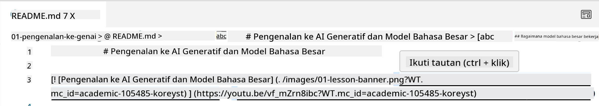
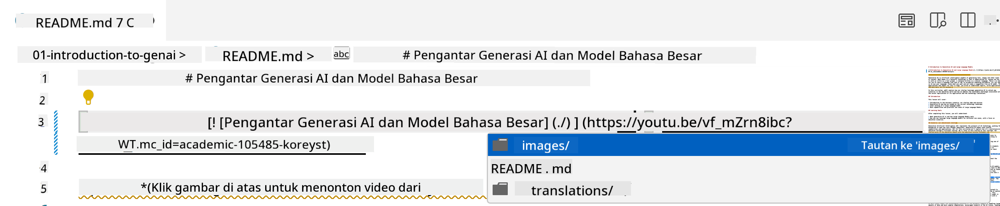
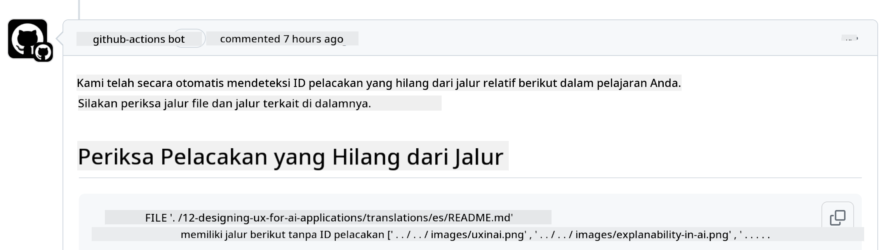

<!--
CO_OP_TRANSLATOR_METADATA:
{
  "original_hash": "57c41f2af71001a2cff9d8eb797cb843",
  "translation_date": "2025-05-19T11:21:01+00:00",
  "source_file": "CONTRIBUTING.md",
  "language_code": "id"
}
-->
# Berkontribusi

Proyek ini menyambut kontribusi dan saran. Sebagian besar kontribusi mengharuskan Anda menyetujui Perjanjian Lisensi Kontributor (CLA) yang menyatakan bahwa Anda memiliki hak untuk, dan benar-benar memberikan kami hak untuk menggunakan kontribusi Anda. Untuk detailnya, kunjungi <https://cla.microsoft.com>.

> Penting: saat menerjemahkan teks dalam repo ini, pastikan Anda tidak menggunakan terjemahan mesin. Kami akan memverifikasi terjemahan melalui komunitas, jadi hanya sukarelawan untuk terjemahan dalam bahasa di mana Anda mahir.

Ketika Anda mengirimkan pull request, CLA-bot akan secara otomatis menentukan apakah Anda perlu memberikan CLA dan mendekorasi PR dengan tepat (misalnya, label, komentar). Cukup ikuti instruksi yang diberikan oleh bot. Anda hanya perlu melakukannya sekali di semua repositori yang menggunakan CLA kami.

## Kode Etik

Proyek ini telah mengadopsi [Kode Etik Sumber Terbuka Microsoft](https://opensource.microsoft.com/codeofconduct/?WT.mc_id=academic-105485-koreyst).
Untuk informasi lebih lanjut, baca [FAQ Kode Etik](https://opensource.microsoft.com/codeofconduct/faq/?WT.mc_id=academic-105485-koreyst) atau hubungi [opencode@microsoft.com](mailto:opencode@microsoft.com) untuk pertanyaan atau komentar tambahan.

## Pertanyaan atau Masalah?

Jangan membuka isu GitHub untuk pertanyaan dukungan umum karena daftar GitHub harus digunakan untuk permintaan fitur dan laporan bug. Dengan cara ini kita dapat lebih mudah melacak masalah atau bug sebenarnya dari kode dan menjaga diskusi umum terpisah dari kode sebenarnya.

## Typo, Masalah, Bug, dan kontribusi

Setiap kali Anda mengirimkan perubahan apa pun ke repositori Generative AI for Beginners, harap ikuti rekomendasi berikut.

* Selalu fork repositori ke akun Anda sendiri sebelum membuat modifikasi
* Jangan menggabungkan beberapa perubahan ke satu pull request. Misalnya, kirimkan perbaikan bug dan pembaruan dokumentasi menggunakan PR terpisah
* Jika pull request Anda menunjukkan konflik penggabungan, pastikan untuk memperbarui main lokal Anda agar menjadi cermin dari apa yang ada di repositori utama sebelum membuat modifikasi
* Jika Anda mengirimkan terjemahan, harap buat satu PR untuk semua file yang diterjemahkan karena kami tidak menerima terjemahan parsial untuk konten
* Jika Anda mengirimkan typo atau perbaikan dokumentasi, Anda dapat menggabungkan modifikasi ke satu PR di mana sesuai

## Panduan Umum untuk Penulisan

- Pastikan semua URL Anda dibungkus dalam tanda kurung siku diikuti dengan tanda kurung tanpa spasi ekstra di sekitar atau di dalamnya ``.
- Pastikan setiap tautan relatif (yaitu tautan ke file dan folder lain di repositori) dimulai dengan `./` mengacu pada file atau folder yang terletak di direktori kerja saat ini atau `../` mengacu pada file atau folder yang terletak di direktori kerja induk.
- Pastikan setiap tautan relatif (yaitu tautan ke file dan folder lain di repositori) memiliki ID pelacakan (yaitu `?` atau `&` kemudian `wt.mc_id=` atau `WT.mc_id=`) di akhir.
- Pastikan setiap URL dari domain berikut _github.com, microsoft.com, visualstudio.com, aka.ms, dan azure.com_ memiliki ID pelacakan (yaitu `?` atau `&` kemudian `wt.mc_id=` atau `WT.mc_id=`) di akhir.
- Pastikan tautan Anda tidak memiliki lokal khusus negara di dalamnya (yaitu `/en-us/` atau `/en/`).
- Pastikan semua gambar disimpan di folder `./images`.
- Pastikan gambar memiliki nama deskriptif menggunakan karakter Inggris, angka, dan tanda hubung dalam nama gambar Anda.

## Alur Kerja GitHub

Ketika Anda mengirimkan pull request, empat alur kerja berbeda akan dipicu untuk memvalidasi aturan sebelumnya.
Cukup ikuti instruksi yang tercantum di sini untuk melewati pemeriksaan alur kerja.

- [Periksa Jalur Relatif Rusak](../..)
- [Periksa Jalur Memiliki Pelacakan](../..)
- [Periksa URL Memiliki Pelacakan](../..)
- [Periksa URL Tidak Memiliki Lokal](../..)

### Periksa Jalur Relatif Rusak

Alur kerja ini memastikan bahwa setiap jalur relatif dalam file Anda berfungsi.
Repositori ini diterapkan ke halaman GitHub jadi Anda perlu sangat berhati-hati saat mengetik tautan yang menghubungkan semuanya agar tidak mengarahkan siapa pun ke tempat yang salah.

Untuk memastikan tautan Anda berfungsi dengan baik cukup gunakan VS code untuk memeriksanya.

Misalnya, ketika Anda mengarahkan kursor ke tautan apa pun dalam file Anda, Anda akan diminta untuk mengikuti tautan dengan menekan **ctrl + klik**

Jika Anda mengklik tautan dan tidak berfungsi secara lokal, maka pasti akan memicu alur kerja dan tidak akan berfungsi di GitHub.

Untuk memperbaiki masalah ini, coba ketik tautan dengan bantuan VS code.

Saat Anda mengetik `./` atau `../` VS code akan meminta Anda untuk memilih dari opsi yang tersedia sesuai dengan apa yang Anda ketik.

Ikuti jalur dengan mengklik file atau folder yang diinginkan dan Anda akan yakin bahwa jalur Anda tidak rusak.

Setelah Anda menambahkan jalur relatif yang benar, simpan, dan dorong perubahan Anda, alur kerja akan dipicu lagi untuk memverifikasi perubahan Anda.
Jika Anda melewati pemeriksaan maka Anda siap melanjutkan.

### Periksa Jalur Memiliki Pelacakan

Alur kerja ini memastikan bahwa setiap jalur relatif memiliki pelacakan di dalamnya.
Repositori ini diterapkan ke halaman GitHub jadi kami perlu melacak pergerakan antara file dan folder yang berbeda.

Untuk memastikan jalur relatif Anda memiliki pelacakan di dalamnya cukup periksa teks berikut `?wt.mc_id=` di akhir jalur.
Jika itu ditambahkan ke jalur relatif Anda maka Anda akan melewati pemeriksaan ini.

Jika tidak, Anda mungkin mendapatkan kesalahan berikut.

Untuk memperbaiki masalah ini, coba buka jalur file yang disorot oleh alur kerja dan tambahkan ID pelacakan ke akhir jalur relatif.

Setelah Anda menambahkan ID pelacakan, simpan, dan dorong perubahan Anda, alur kerja akan dipicu lagi untuk memverifikasi perubahan Anda.
Jika Anda melewati pemeriksaan maka Anda siap melanjutkan.

### Periksa URL Memiliki Pelacakan

Alur kerja ini memastikan bahwa setiap URL web memiliki pelacakan di dalamnya.
Repositori ini tersedia untuk semua orang jadi Anda perlu memastikan untuk melacak akses untuk mengetahui dari mana lalu lintas berasal.

Untuk memastikan URL Anda memiliki pelacakan di dalamnya cukup periksa teks berikut `?wt.mc_id=` di akhir URL.
Jika itu ditambahkan ke URL Anda maka Anda akan melewati pemeriksaan ini.

Jika tidak, Anda mungkin mendapatkan kesalahan berikut.

Untuk memperbaiki masalah ini, coba buka jalur file yang disorot oleh alur kerja dan tambahkan ID pelacakan ke akhir URL.

Setelah Anda menambahkan ID pelacakan, simpan, dan dorong perubahan Anda, alur kerja akan dipicu lagi untuk memverifikasi perubahan Anda.
Jika Anda melewati pemeriksaan maka Anda siap melanjutkan.

### Periksa URL Tidak Memiliki Lokal

Alur kerja ini memastikan bahwa setiap URL web tidak memiliki lokal khusus negara di dalamnya.
Repositori ini tersedia untuk semua orang di seluruh dunia jadi Anda perlu memastikan untuk tidak menyertakan lokal negara Anda dalam URL.

Untuk memastikan URL Anda tidak memiliki lokal negara di dalamnya cukup periksa teks berikut `/en-us/` atau `/en/` atau lokal bahasa lainnya di mana pun dalam URL.
Jika tidak ada dalam URL Anda maka Anda akan melewati pemeriksaan ini.

Jika tidak, Anda mungkin mendapatkan kesalahan berikut.

Untuk memperbaiki masalah ini, coba buka jalur file yang disorot oleh alur kerja dan hapus lokal negara dari URL.

Setelah Anda menghapus lokal negara, simpan, dan dorong perubahan Anda, alur kerja akan dipicu lagi untuk memverifikasi perubahan Anda.
Jika Anda melewati pemeriksaan maka Anda siap melanjutkan.

Selamat! Kami akan segera menghubungi Anda dengan umpan balik tentang kontribusi Anda.

**Penafian**:  
Dokumen ini telah diterjemahkan menggunakan layanan terjemahan AI [Co-op Translator](https://github.com/Azure/co-op-translator). Meskipun kami berusaha untuk mencapai ketepatan, harap disadari bahwa terjemahan otomatis mungkin mengandung kesalahan atau ketidakakuratan. Dokumen asli dalam bahasa aslinya harus dianggap sebagai sumber yang berwenang. Untuk informasi penting, disarankan menggunakan terjemahan manusia profesional. Kami tidak bertanggung jawab atas kesalahpahaman atau salah tafsir yang timbul dari penggunaan terjemahan ini.