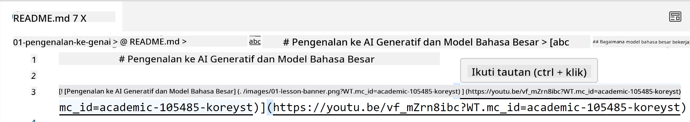
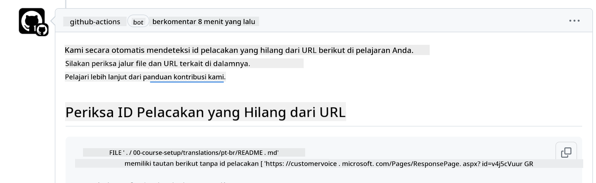
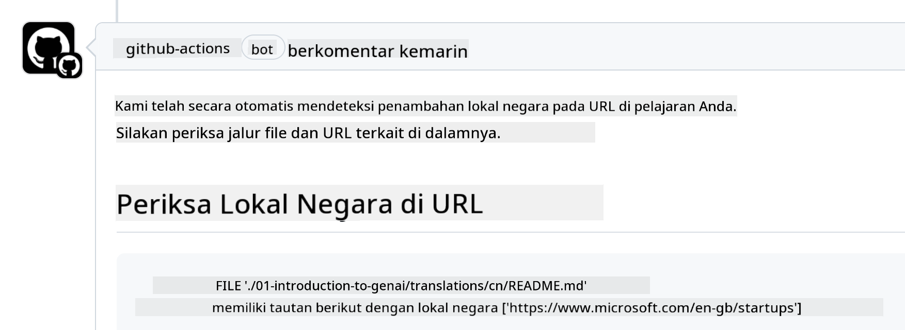

<!--
CO_OP_TRANSLATOR_METADATA:
{
  "original_hash": "57c41f2af71001a2cff9d8eb797cb843",
  "translation_date": "2025-07-09T06:10:04+00:00",
  "source_file": "CONTRIBUTING.md",
  "language_code": "id"
}
-->
# Contributing

Proyek ini menyambut kontribusi dan saran. Sebagian besar kontribusi mengharuskan Anda
menyetujui Contributor License Agreement (CLA) yang menyatakan bahwa Anda memiliki hak,
dan memang memberikan kami hak untuk menggunakan kontribusi Anda. Untuk detailnya, kunjungi
<https://cla.microsoft.com>.

> Penting: saat menerjemahkan teks di repo ini, pastikan Anda tidak menggunakan terjemahan mesin. Kami akan memverifikasi terjemahan melalui komunitas, jadi harap hanya sukarela untuk menerjemahkan dalam bahasa yang Anda kuasai.

Saat Anda mengirimkan pull request, CLA-bot akan secara otomatis menentukan apakah Anda perlu
menyediakan CLA dan menandai PR dengan tepat (misalnya, label, komentar). Cukup ikuti
instruksi yang diberikan oleh bot. Anda hanya perlu melakukan ini sekali untuk semua repositori yang menggunakan CLA kami.

## Code of Conduct

Proyek ini telah mengadopsi [Microsoft Open Source Code of Conduct](https://opensource.microsoft.com/codeofconduct/?WT.mc_id=academic-105485-koreyst).
Untuk informasi lebih lanjut, baca [Code of Conduct FAQ](https://opensource.microsoft.com/codeofconduct/faq/?WT.mc_id=academic-105485-koreyst) atau hubungi [opencode@microsoft.com](mailto:opencode@microsoft.com) jika ada pertanyaan atau komentar tambahan.

## Pertanyaan atau Masalah?

Harap jangan membuka isu GitHub untuk pertanyaan dukungan umum karena daftar GitHub sebaiknya digunakan untuk permintaan fitur dan laporan bug. Dengan cara ini kami dapat lebih mudah melacak masalah atau bug yang sebenarnya dari kode dan memisahkan diskusi umum dari kode yang sebenarnya.

## Typo, Masalah, Bug, dan kontribusi

Setiap kali Anda mengirimkan perubahan ke repositori Generative AI for Beginners, harap ikuti rekomendasi berikut.

* Selalu fork repositori ke akun Anda sendiri sebelum melakukan modifikasi
* Jangan gabungkan beberapa perubahan dalam satu pull request. Misalnya, kirim perbaikan bug dan pembaruan dokumentasi menggunakan PR terpisah
* Jika pull request Anda menunjukkan konflik merge, pastikan untuk memperbarui main lokal Anda agar mencerminkan isi repositori utama sebelum melakukan modifikasi
* Jika Anda mengirimkan terjemahan, harap buat satu PR untuk semua file yang diterjemahkan karena kami tidak menerima terjemahan parsial untuk konten
* Jika Anda mengirimkan perbaikan typo atau dokumentasi, Anda dapat menggabungkan modifikasi ke dalam satu PR jika sesuai

## Panduan Umum untuk menulis

- Pastikan semua URL Anda dibungkus dalam tanda kurung siku diikuti tanda kurung biasa tanpa spasi tambahan di sekitarnya atau di dalamnya ``.
- Pastikan setiap tautan relatif (yaitu tautan ke file dan folder lain dalam repositori) dimulai dengan `./` yang merujuk ke file atau folder yang berada di direktori kerja saat ini atau `../` yang merujuk ke file atau folder yang berada di direktori induk.
- Pastikan setiap tautan relatif memiliki ID pelacakan (yaitu `?` atau `&` lalu `wt.mc_id=` atau `WT.mc_id=`) di akhir tautan.
- Pastikan setiap URL dari domain berikut _github.com, microsoft.com, visualstudio.com, aka.ms, dan azure.com_ memiliki ID pelacakan (yaitu `?` atau `&` lalu `wt.mc_id=` atau `WT.mc_id=`) di akhir URL.
- Pastikan tautan Anda tidak mengandung locale spesifik negara (misalnya `/en-us/` atau `/en/`).
- Pastikan semua gambar disimpan di folder `./images`.
- Pastikan gambar memiliki nama deskriptif menggunakan karakter bahasa Inggris, angka, dan tanda hubung dalam nama gambar Anda.

## GitHub Workflows

Saat Anda mengirimkan pull request, empat workflow berbeda akan dijalankan untuk memvalidasi aturan sebelumnya.
Cukup ikuti instruksi yang tercantum di sini untuk melewati pemeriksaan workflow.

- [Check Broken Relative Paths](../..)
- [Check Paths Have Tracking](../..)
- [Check URLs Have Tracking](../..)
- [Check URLs Don't Have Locale](../..)

### Check Broken Relative Paths

Workflow ini memastikan bahwa setiap path relatif dalam file Anda berfungsi.
Repositori ini dideploy ke GitHub pages jadi Anda harus sangat berhati-hati saat mengetik tautan agar tidak mengarahkan ke tempat yang salah.

Untuk memastikan tautan Anda berfungsi dengan baik, cukup gunakan VS code untuk memeriksanya.

Misalnya, saat Anda mengarahkan kursor ke tautan dalam file Anda, Anda akan diberi opsi untuk mengikuti tautan dengan menekan **ctrl + klik**

Jika Anda mengklik tautan dan tautan tersebut tidak berfungsi secara lokal, maka pasti akan memicu workflow dan tidak akan berfungsi di GitHub.

Untuk memperbaiki masalah ini, coba ketik tautan dengan bantuan VS code.

Saat Anda mengetik `./` atau `../` VS code akan menampilkan pilihan yang tersedia sesuai dengan yang Anda ketik.

Ikuti path dengan mengklik file atau folder yang diinginkan dan Anda akan yakin bahwa path Anda tidak rusak.

Setelah Anda menambahkan path relatif yang benar, simpan, dan dorong perubahan Anda, workflow akan dijalankan lagi untuk memverifikasi perubahan Anda.
Jika Anda lolos pemeriksaan, maka Anda siap melanjutkan.

### Check Paths Have Tracking

Workflow ini memastikan bahwa setiap path relatif memiliki pelacakan di dalamnya.
Repositori ini dideploy ke GitHub pages jadi kita perlu melacak pergerakan antar file dan folder.

Untuk memastikan path relatif Anda memiliki pelacakan, cukup periksa apakah ada teks `?wt.mc_id=` di akhir path.
Jika sudah ditambahkan ke path relatif Anda, maka Anda akan lolos pemeriksaan ini.

Jika tidak, Anda mungkin akan mendapatkan error berikut.

Untuk memperbaiki masalah ini, coba buka file path yang disorot oleh workflow dan tambahkan ID pelacakan di akhir path relatif.

Setelah Anda menambahkan ID pelacakan, simpan, dan dorong perubahan Anda, workflow akan dijalankan lagi untuk memverifikasi perubahan Anda.
Jika Anda lolos pemeriksaan, maka Anda siap melanjutkan.

### Check URLs Have Tracking

Workflow ini memastikan bahwa setiap URL web memiliki pelacakan di dalamnya.
Repositori ini tersedia untuk semua orang jadi Anda harus memastikan untuk melacak akses agar tahu dari mana lalu lintas berasal.

Untuk memastikan URL Anda memiliki pelacakan, cukup periksa apakah ada teks `?wt.mc_id=` di akhir URL.
Jika sudah ditambahkan ke URL Anda, maka Anda akan lolos pemeriksaan ini.

Jika tidak, Anda mungkin akan mendapatkan error berikut.

Untuk memperbaiki masalah ini, coba buka file path yang disorot oleh workflow dan tambahkan ID pelacakan di akhir URL.

Setelah Anda menambahkan ID pelacakan, simpan, dan dorong perubahan Anda, workflow akan dijalankan lagi untuk memverifikasi perubahan Anda.
Jika Anda lolos pemeriksaan, maka Anda siap melanjutkan.

### Check URLs Don't Have Locale

Workflow ini memastikan bahwa setiap URL web tidak mengandung locale spesifik negara.
Repositori ini tersedia untuk semua orang di seluruh dunia jadi Anda harus memastikan untuk tidak menyertakan locale negara Anda dalam URL.

Untuk memastikan URL Anda tidak mengandung locale negara, cukup periksa apakah ada teks `/en-us/` atau `/en/` atau locale bahasa lain di mana pun dalam URL.
Jika tidak ada dalam URL Anda, maka Anda akan lolos pemeriksaan ini.

Jika tidak, Anda mungkin akan mendapatkan error berikut.

Untuk memperbaiki masalah ini, coba buka file path yang disorot oleh workflow dan hapus locale negara dari URL.

Setelah Anda menghapus locale negara, simpan, dan dorong perubahan Anda, workflow akan dijalankan lagi untuk memverifikasi perubahan Anda.
Jika Anda lolos pemeriksaan, maka Anda siap melanjutkan.

Selamat! Kami akan segera menghubungi Anda dengan umpan balik tentang kontribusi Anda.

**Penafian**:  
Dokumen ini telah diterjemahkan menggunakan layanan terjemahan AI [Co-op Translator](https://github.com/Azure/co-op-translator). Meskipun kami berupaya untuk mencapai akurasi, harap diperhatikan bahwa terjemahan otomatis mungkin mengandung kesalahan atau ketidakakuratan. Dokumen asli dalam bahasa aslinya harus dianggap sebagai sumber yang sahih. Untuk informasi penting, disarankan menggunakan terjemahan profesional oleh manusia. Kami tidak bertanggung jawab atas kesalahpahaman atau penafsiran yang keliru yang timbul dari penggunaan terjemahan ini.