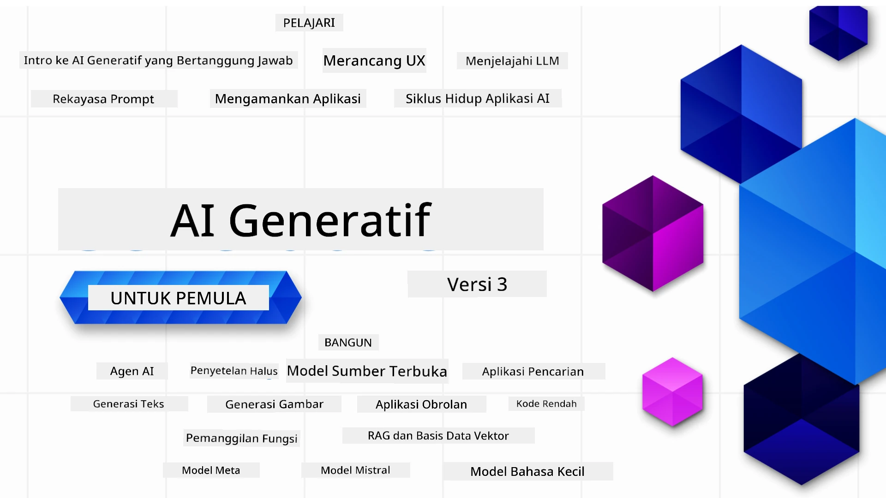

### 21 Pelajaran yang mengajarkan semua yang perlu Anda ketahui untuk mulai membangun aplikasi AI Generatif

[](https://github.com/microsoft/Generative-AI-For-Beginners/blob/master/LICENSE?WT.mc_id=academic-105485-koreyst)
[](https://GitHub.com/microsoft/Generative-AI-For-Beginners/graphs/contributors/?WT.mc_id=academic-105485-koreyst)
[](https://GitHub.com/microsoft/Generative-AI-For-Beginners/issues/?WT.mc_id=academic-105485-koreyst)
[](https://GitHub.com/microsoft/Generative-AI-For-Beginners/pulls/?WT.mc_id=academic-105485-koreyst)
[](http://makeapullrequest.com?WT.mc_id=academic-105485-koreyst)

[](https://GitHub.com/microsoft/Generative-AI-For-Beginners/watchers/?WT.mc_id=academic-105485-koreyst)
[](https://GitHub.com/microsoft/Generative-AI-For-Beginners/network/?WT.mc_id=academic-105485-koreyst)
[](https://GitHub.com/microsoft/Generative-AI-For-Beginners/stargazers/?WT.mc_id=academic-105485-koreyst)

[](https://discord.gg/nTYy5BXMWG)

### 🌐 Dukungan Multi-Bahasa

#### Didukung melalui GitHub Action (Otomatis & Selalu Terbaru)

<!-- CO-OP TRANSLATOR LANGUAGES TABLE START -->
[Arab](../ar/README.md) | [Bengali](../bn/README.md) | [Bulgaria](../bg/README.md) | [Birma (Myanmar)](../my/README.md) | [Cina (Sederhana)](../zh-CN/README.md) | [Cina (Tradisional, Hong Kong)](../zh-HK/README.md) | [Cina (Tradisional, Macau)](../zh-MO/README.md) | [Cina (Tradisional, Taiwan)](../zh-TW/README.md) | [Kroasia](../hr/README.md) | [Ceko](../cs/README.md) | [Denmark](../da/README.md) | [Belanda](../nl/README.md) | [Estonia](../et/README.md) | [Finlandia](../fi/README.md) | [Perancis](../fr/README.md) | [Jerman](../de/README.md) | [Yunani](../el/README.md) | [Ibrani](../he/README.md) | [Hindi](../hi/README.md) | [Hungaria](../hu/README.md) | [Indonesia](./README.md) | [Italia](../it/README.md) | [Jepang](../ja/README.md) | [Kannada](../kn/README.md) | [Korea](../ko/README.md) | [Lituania](../lt/README.md) | [Melayu](../ms/README.md) | [Malayalam](../ml/README.md) | [Marathi](../mr/README.md) | [Nepali](../ne/README.md) | [Nigerian Pidgin](../pcm/README.md) | [Norwegia](../no/README.md) | [Persia (Farsi)](../fa/README.md) | [Polandia](../pl/README.md) | [Portugis (Brasil)](../pt-BR/README.md) | [Portugis (Portugal)](../pt-PT/README.md) | [Punjabi (Gurmukhi)](../pa/README.md) | [Rumania](../ro/README.md) | [Rusia](../ru/README.md) | [Serbia (Sirilik)](../sr/README.md) | [Slovakia](../sk/README.md) | [Slovenia](../sl/README.md) | [Spanyol](../es/README.md) | [Swahili](../sw/README.md) | [Swedia](../sv/README.md) | [Tagalog (Filipina)](../tl/README.md) | [Tamil](../ta/README.md) | [Telugu](../te/README.md) | [Thai](../th/README.md) | [Turki](../tr/README.md) | [Ukraina](../uk/README.md) | [Urdu](../ur/README.md) | [Vietnam](../vi/README.md)

> **Lebih Suka Clone Lokal?**

> Repositori ini mencakup lebih dari 50 terjemahan bahasa yang secara signifikan meningkatkan ukuran unduhan. Untuk meng-clone tanpa terjemahan, gunakan sparse checkout:
> ```bash
> git clone --filter=blob:none --sparse https://github.com/microsoft/generative-ai-for-beginners.git
> cd generative-ai-for-beginners
> git sparse-checkout set --no-cone '/*' '!translations' '!translated_images'
> ```
> Ini memberi Anda semua yang diperlukan untuk menyelesaikan kursus dengan unduhan yang jauh lebih cepat.
<!-- CO-OP TRANSLATOR LANGUAGES TABLE END -->

# AI Generatif untuk Pemula (Versi 3) - Sebuah Kursus

Pelajari dasar-dasar membangun aplikasi AI Generatif dengan kursus komprehensif 21 pelajaran dari Microsoft Cloud Advocates.

## 🌱 Memulai

Kursus ini memiliki 21 pelajaran. Setiap pelajaran membahas topik sendiri-sendiri jadi mulai dari mana saja yang Anda suka!

Pelajaran diberi label baik pelajaran "Belajar" yang menjelaskan konsep AI Generatif atau pelajaran "Bangun" yang menjelaskan konsep dan contoh kode dalam **Python** dan **TypeScript** bila memungkinkan.

Untuk Pengembang .NET kunjungi [Generative AI for Beginners (.NET Edition)](https://github.com/microsoft/Generative-AI-for-beginners-dotnet?WT.mc_id=academic-105485-koreyst)!

Setiap pelajaran juga menyertakan bagian "Tetap Belajar" dengan alat pembelajaran tambahan.

## Apa Yang Anda Butuhkan
### Untuk menjalankan kode dari kursus ini, Anda dapat menggunakan salah satu:
 - [Azure OpenAI Service](https://aka.ms/genai-beginners/azure-open-ai?WT.mc_id=academic-105485-koreyst) - **Pelajaran:** "aoai-assignment"
 - [GitHub Marketplace Model Catalog](https://aka.ms/genai-beginners/gh-models?WT.mc_id=academic-105485-koreyst) - **Pelajaran:** "githubmodels"
 - [OpenAI API](https://aka.ms/genai-beginners/open-ai?WT.mc_id=academic-105485-koreyst) - **Pelajaran:** "oai-assignment" 
   
- Pengetahuan dasar Python atau TypeScript sangat membantu - \*Untuk pemula mutlak silakan lihat [Python](https://aka.ms/genai-beginners/python?WT.mc_id=academic-105485-koreyst) dan [TypeScript](https://aka.ms/genai-beginners/typescript?WT.mc_id=academic-105485-koreyst) kursus
- Akun GitHub untuk [fork seluruh repo ini](https://aka.ms/genai-beginners/github?WT.mc_id=academic-105485-koreyst) ke akun GitHub Anda sendiri

Kami telah membuat pelajaran **[Course Setup](./00-course-setup/README.md?WT.mc_id=academic-105485-koreyst)** untuk membantu Anda menyiapkan lingkungan pengembangan Anda.

Jangan lupa untuk [membintangi (🌟) repo ini](https://docs.github.com/en/get-started/exploring-projects-on-github/saving-repositories-with-stars?WT.mc_id=academic-105485-koreyst) agar lebih mudah ditemukan nanti.

## 🧠 Siap Untuk Deploy?

Jika Anda mencari contoh kode yang lebih canggih, lihat koleksi kami [koleksi Contoh Kode AI Generatif](https://aka.ms/genai-beg-code?WT.mc_id=academic-105485-koreyst) dalam **Python** dan **TypeScript**.

## 🗣️ Temui Pelajar Lain, Dapatkan Dukungan

Bergabunglah dengan [server Discord resmi Azure AI Foundry](https://aka.ms/genai-discord?WT.mc_id=academic-105485-koreyst) untuk bertemu dan berjejaring dengan pelajar lain yang mengikuti kursus ini dan mendapatkan dukungan.

Ajukan pertanyaan atau bagikan umpan balik produk di [Forum Pengembang Azure AI Foundry](https://aka.ms/azureaifoundry/forum) di Github.

## 🚀 Membangun Startup?

Kunjungi [Microsoft for Startups](https://www.microsoft.com/startups) untuk mengetahui cara memulai membangun dengan kredit Azure hari ini.

## 🙏 Ingin membantu?

Apakah Anda memiliki saran atau menemukan kesalahan ejaan atau kode? [Buat masalah](https://github.com/microsoft/generative-ai-for-beginners/issues?WT.mc_id=academic-105485-koreyst) atau [Buat pull request](https://github.com/microsoft/generative-ai-for-beginners/pulls?WT.mc_id=academic-105485-koreyst)

## 📂 Setiap pelajaran mencakup:

- Video pengantar singkat tentang topik
- Pelajaran tertulis yang terletak di README
- Contoh kode Python dan TypeScript yang mendukung Azure OpenAI dan OpenAI API
- Tautan ke sumber daya tambahan untuk melanjutkan pembelajaran Anda

## 🗃️ Pelajaran

| #   | **Tautan Pelajaran**                                                                                                                          | **Deskripsi**                                                                                   | **Video**                                                                   | **Pembelajaran Tambahan**                                                       |
| --- | -------------------------------------------------------------------------------------------------------------------------------------------- | ----------------------------------------------------------------------------------------------- | --------------------------------------------------------------------------- | ------------------------------------------------------------------------------ |
| 00  | [Pengaturan Kursus](./00-course-setup/README.md?WT.mc_id=academic-105485-koreyst)                                                             | **Belajar:** Cara Menyiapkan Lingkungan Pengembangan Anda                                     | Video Segera Hadir                                                          | [Pelajari Lebih Lanjut](https://aka.ms/genai-collection?WT.mc_id=academic-105485-koreyst) |
| 01  | [Pengantar AI Generatif dan LLM](./01-introduction-to-genai/README.md?WT.mc_id=academic-105485-koreyst)                                        | **Belajar:** Memahami apa itu AI Generatif dan bagaimana Model Bahasa Besar (LLM) bekerja       | [Video](https://aka.ms/gen-ai-lesson-1-gh?WT.mc_id=academic-105485-koreyst) | [Pelajari Lebih Lanjut](https://aka.ms/genai-collection?WT.mc_id=academic-105485-koreyst) |
| 02  | [Menjelajahi dan membandingkan berbagai LLM](./02-exploring-and-comparing-different-llms/README.md?WT.mc_id=academic-105485-koreyst)           | **Belajar:** Cara memilih model yang tepat untuk kasus penggunaan Anda                          | [Video](https://aka.ms/gen-ai-lesson2-gh?WT.mc_id=academic-105485-koreyst)  | [Pelajari Lebih Lanjut](https://aka.ms/genai-collection?WT.mc_id=academic-105485-koreyst) |
| 03  | [Menggunakan AI Generatif dengan Bertanggung Jawab](./03-using-generative-ai-responsibly/README.md?WT.mc_id=academic-105485-koreyst)             | **Belajar:** Cara membangun Aplikasi AI Generatif dengan bertanggung jawab                      | [Video](https://aka.ms/gen-ai-lesson3-gh?WT.mc_id=academic-105485-koreyst)  | [Pelajari Lebih Lanjut](https://aka.ms/genai-collection?WT.mc_id=academic-105485-koreyst) |
| 04  | [Memahami Dasar-Dasar Rekayasa Prompt](./04-prompt-engineering-fundamentals/README.md?WT.mc_id=academic-105485-koreyst)                     | **Pelajari:** Praktik Terbaik Rekayasa Prompt secara langsung                                     | [Video](https://aka.ms/gen-ai-lesson4-gh?WT.mc_id=academic-105485-koreyst)  | [Pelajari Lebih Lanjut](https://aka.ms/genai-collection?WT.mc_id=academic-105485-koreyst) |
| 05  | [Membuat Prompt Lanjutan](./05-advanced-prompts/README.md?WT.mc_id=academic-105485-koreyst)                                                    | **Pelajari:** Cara menerapkan teknik rekayasa prompt yang meningkatkan hasil prompt Anda.        | [Video](https://aka.ms/gen-ai-lesson5-gh?WT.mc_id=academic-105485-koreyst)  | [Pelajari Lebih Lanjut](https://aka.ms/genai-collection?WT.mc_id=academic-105485-koreyst) |
| 06  | [Membangun Aplikasi Generasi Teks](./06-text-generation-apps/README.md?WT.mc_id=academic-105485-koreyst)                                      | **Bangun:** Aplikasi generasi teks menggunakan Azure OpenAI / OpenAI API                         | [Video](https://aka.ms/gen-ai-lesson6-gh?WT.mc_id=academic-105485-koreyst)  | [Pelajari Lebih Lanjut](https://aka.ms/genai-collection?WT.mc_id=academic-105485-koreyst) |
| 07  | [Membangun Aplikasi Obrolan](./07-building-chat-applications/README.md?WT.mc_id=academic-105485-koreyst)                                       | **Bangun:** Teknik untuk membangun dan mengintegrasikan aplikasi obrolan secara efisien.       | [Video](https://aka.ms/gen-ai-lessons7-gh?WT.mc_id=academic-105485-koreyst) | [Pelajari Lebih Lanjut](https://aka.ms/genai-collection?WT.mc_id=academic-105485-koreyst) |
| 08  | [Membangun Aplikasi Pencarian dengan Basis Data Vektor](./08-building-search-applications/README.md?WT.mc_id=academic-105485-koreyst)          | **Bangun:** Aplikasi pencarian yang menggunakan Embeddings untuk mencari data.                   | [Video](https://aka.ms/gen-ai-lesson8-gh?WT.mc_id=academic-105485-koreyst)  | [Pelajari Lebih Lanjut](https://aka.ms/genai-collection?WT.mc_id=academic-105485-koreyst) |
| 09  | [Membangun Aplikasi Generasi Gambar](./09-building-image-applications/README.md?WT.mc_id=academic-105485-koreyst)                              | **Bangun:** Aplikasi generasi gambar                                                   | [Video](https://aka.ms/gen-ai-lesson9-gh?WT.mc_id=academic-105485-koreyst)  | [Pelajari Lebih Lanjut](https://aka.ms/genai-collection?WT.mc_id=academic-105485-koreyst) |
| 10  | [Membangun Aplikasi AI Low Code](./10-building-low-code-ai-applications/README.md?WT.mc_id=academic-105485-koreyst)                             | **Bangun:** Aplikasi AI Generatif menggunakan alat Low Code                                | [Video](https://aka.ms/gen-ai-lesson10-gh?WT.mc_id=academic-105485-koreyst) | [Pelajari Lebih Lanjut](https://aka.ms/genai-collection?WT.mc_id=academic-105485-koreyst) |
| 11  | [Mengintegrasikan Aplikasi Eksternal dengan Panggilan Fungsi](./11-integrating-with-function-calling/README.md?WT.mc_id=academic-105485-koreyst) | **Bangun:** Apa itu panggilan fungsi dan kasus penggunaannya untuk aplikasi                  | [Video](https://aka.ms/gen-ai-lesson11-gh?WT.mc_id=academic-105485-koreyst) | [Pelajari Lebih Lanjut](https://aka.ms/genai-collection?WT.mc_id=academic-105485-koreyst) |
| 12  | [Merancang UX untuk Aplikasi AI](./12-designing-ux-for-ai-applications/README.md?WT.mc_id=academic-105485-koreyst)                               | **Pelajari:** Cara menerapkan prinsip desain UX saat mengembangkan Aplikasi AI Generatif       | [Video](https://aka.ms/gen-ai-lesson12-gh?WT.mc_id=academic-105485-koreyst) | [Pelajari Lebih Lanjut](https://aka.ms/genai-collection?WT.mc_id=academic-105485-koreyst) |
| 13  | [Mengamankan Aplikasi AI Generatif Anda](./13-securing-ai-applications/README.md?WT.mc_id=academic-105485-koreyst)                              | **Pelajari:** Ancaman dan risiko terhadap sistem AI serta metode untuk mengamankan sistem ini.  | [Video](https://aka.ms/gen-ai-lesson13-gh?WT.mc_id=academic-105485-koreyst) | [Pelajari Lebih Lanjut](https://aka.ms/genai-collection?WT.mc_id=academic-105485-koreyst) |
| 14  | [Siklus Hidup Aplikasi AI Generatif](./14-the-generative-ai-application-lifecycle/README.md?WT.mc_id=academic-105485-koreyst)                   | **Pelajari:** Alat dan metrik untuk mengelola Siklus Hidup LLM dan LLMOps                     | [Video](https://aka.ms/gen-ai-lesson14-gh?WT.mc_id=academic-105485-koreyst) | [Pelajari Lebih Lanjut](https://aka.ms/genai-collection?WT.mc_id=academic-105485-koreyst) |
| 15  | [Retrieval Augmented Generation (RAG) dan Basis Data Vektor](./15-rag-and-vector-databases/README.md?WT.mc_id=academic-105485-koreyst)          | **Bangun:** Aplikasi menggunakan Kerangka RAG untuk mengambil embedding dari Basis Data Vektor | [Video](https://aka.ms/gen-ai-lesson15-gh?WT.mc_id=academic-105485-koreyst) | [Pelajari Lebih Lanjut](https://aka.ms/genai-collection?WT.mc_id=academic-105485-koreyst) |
| 16  | [Model Open Source dan Hugging Face](./16-open-source-models/README.md?WT.mc_id=academic-105485-koreyst)                                        | **Bangun:** Aplikasi menggunakan model open source yang tersedia di Hugging Face             | [Video](https://aka.ms/gen-ai-lesson16-gh?WT.mc_id=academic-105485-koreyst) | [Pelajari Lebih Lanjut](https://aka.ms/genai-collection?WT.mc_id=academic-105485-koreyst) |
| 17  | [Agen AI](./17-ai-agents/README.md?WT.mc_id=academic-105485-koreyst)                                                                             | **Bangun:** Aplikasi menggunakan Kerangka Agen AI                                           | [Video](https://aka.ms/gen-ai-lesson17-gh?WT.mc_id=academic-105485-koreyst) | [Pelajari Lebih Lanjut](https://aka.ms/genai-collection?WT.mc_id=academic-105485-koreyst) |
| 18  | [Fine-Tuning LLM](./18-fine-tuning/README.md?WT.mc_id=academic-105485-koreyst)                                                                  | **Pelajari:** Apa, mengapa, dan bagaimana melakukan fine-tuning pada LLM                    | [Video](https://aka.ms/gen-ai-lesson18-gh?WT.mc_id=academic-105485-koreyst) | [Pelajari Lebih Lanjut](https://aka.ms/genai-collection?WT.mc_id=academic-105485-koreyst) |
| 19  | [Membangun dengan SLM](./19-slm/README.md?WT.mc_id=academic-105485-koreyst)                                                                     | **Pelajari:** Manfaat membangun dengan Small Language Models                             | Video Segera Hadir | [Pelajari Lebih Lanjut](https://aka.ms/genai-collection?WT.mc_id=academic-105485-koreyst) |
| 20  | [Membangun dengan Model Mistral](./20-mistral/README.md?WT.mc_id=academic-105485-koreyst)                                                       | **Pelajari:** Fitur dan perbedaan Model Keluarga Mistral                                  | Video Segera Hadir | [Pelajari Lebih Lanjut](https://aka.ms/genai-collection?WT.mc_id=academic-105485-koreyst) |
| 21  | [Membangun dengan Model Meta](./21-meta/README.md?WT.mc_id=academic-105485-koreyst)                                                             | **Pelajari:** Fitur dan perbedaan Model Keluarga Meta                                    | Video Segera Hadir | [Pelajari Lebih Lanjut](https://aka.ms/genai-collection?WT.mc_id=academic-105485-koreyst) |

### 🌟 Ucapan Terima Kasih Khusus

Ucapan terima kasih khusus kepada [**John Aziz**](https://www.linkedin.com/in/john0isaac/) atas pembuatan semua GitHub Actions dan alur kerja

[**Bernhard Merkle**](https://www.linkedin.com/in/bernhard-merkle-738b73/) atas kontribusi kunci di setiap pelajaran untuk meningkatkan pengalaman pembelajar dan kode.

## 🎒 Kursus Lainnya

Tim kami juga memproduksi kursus lainnya! Lihat:

<!-- CO-OP TRANSLATOR OTHER COURSES START -->
### LangChain
[](https://aka.ms/langchain4j-for-beginners)
[](https://aka.ms/langchainjs-for-beginners?WT.mc_id=m365-94501-dwahlin)
[](https://github.com/microsoft/langchain-for-beginners?WT.mc_id=m365-94501-dwahlin)
---

### Azure / Edge / MCP / Agen
[](https://github.com/microsoft/AZD-for-beginners?WT.mc_id=academic-105485-koreyst)
[](https://github.com/microsoft/edgeai-for-beginners?WT.mc_id=academic-105485-koreyst)
[](https://github.com/microsoft/mcp-for-beginners?WT.mc_id=academic-105485-koreyst)
[](https://github.com/microsoft/ai-agents-for-beginners?WT.mc_id=academic-105485-koreyst)

---
 
### Seri AI Generatif
[](https://github.com/microsoft/generative-ai-for-beginners?WT.mc_id=academic-105485-koreyst)
[-9333EA?style=for-the-badge&labelColor=E5E7EB&color=9333EA)](https://github.com/microsoft/Generative-AI-for-beginners-dotnet?WT.mc_id=academic-105485-koreyst)
[-C084FC?style=for-the-badge&labelColor=E5E7EB&color=C084FC)](https://github.com/microsoft/generative-ai-for-beginners-java?WT.mc_id=academic-105485-koreyst)
[-E879F9?style=for-the-badge&labelColor=E5E7EB&color=E879F9)](https://github.com/microsoft/generative-ai-with-javascript?WT.mc_id=academic-105485-koreyst)

---
 
### Pembelajaran Inti
[](https://aka.ms/ml-beginners?WT.mc_id=academic-105485-koreyst)
[](https://aka.ms/datascience-beginners?WT.mc_id=academic-105485-koreyst)
[](https://aka.ms/ai-beginners?WT.mc_id=academic-105485-koreyst)
[](https://github.com/microsoft/Security-101?WT.mc_id=academic-96948-sayoung)
[](https://aka.ms/webdev-beginners?WT.mc_id=academic-105485-koreyst)
[](https://aka.ms/iot-beginners?WT.mc_id=academic-105485-koreyst)
[](https://github.com/microsoft/xr-development-for-beginners?WT.mc_id=academic-105485-koreyst)

---
 
### Seri Copilot
[](https://aka.ms/GitHubCopilotAI?WT.mc_id=academic-105485-koreyst)
[](https://github.com/microsoft/mastering-github-copilot-for-dotnet-csharp-developers?WT.mc_id=academic-105485-koreyst)
[](https://github.com/microsoft/CopilotAdventures?WT.mc_id=academic-105485-koreyst)
<!-- CO-OP TRANSLATOR OTHER COURSES END -->

## Mendapatkan Bantuan

Jika Anda mengalami kesulitan atau memiliki pertanyaan tentang membangun aplikasi AI. Bergabunglah dengan sesama pelajar dan pengembang berpengalaman dalam diskusi tentang MCP. Ini adalah komunitas yang mendukung di mana pertanyaan disambut dan pengetahuan dibagikan secara bebas.

[](https://discord.gg/nTYy5BXMWG)

Jika Anda memiliki umpan balik produk atau kesalahan saat membangun, kunjungi:

[](https://aka.ms/foundry/forum)

---

<!-- CO-OP TRANSLATOR DISCLAIMER START -->
**Penafian**:  
Dokumen ini telah diterjemahkan menggunakan layanan penerjemahan AI [Co-op Translator](https://github.com/Azure/co-op-translator). Meskipun kami berupaya untuk memastikan akurasi, harap diingat bahwa terjemahan otomatis mungkin mengandung kesalahan atau ketidakakuratan. Dokumen asli dalam bahasa aslinya harus dianggap sebagai sumber yang otoritatif. Untuk informasi penting, disarankan menggunakan penerjemahan profesional oleh manusia. Kami tidak bertanggung jawab atas kesalahpahaman atau penafsiran yang salah yang timbul dari penggunaan terjemahan ini.
<!-- CO-OP TRANSLATOR DISCLAIMER END -->