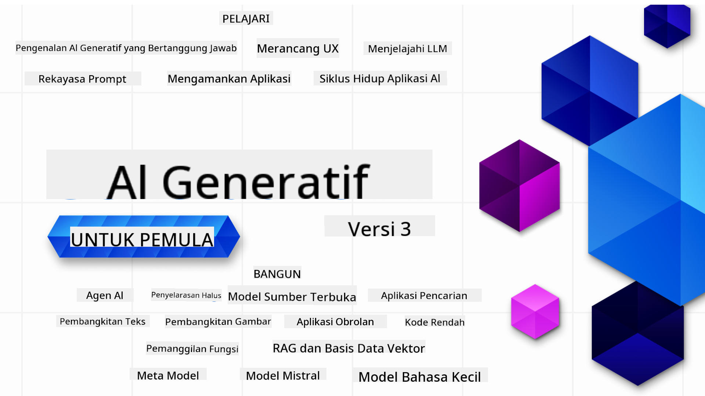

<!--
CO_OP_TRANSLATOR_METADATA:
{
  "original_hash": "c2ee25895ebbfa1a52868bb6eab686fc",
  "translation_date": "2025-05-19T11:53:58+00:00",
  "source_file": "README.md",
  "language_code": "id"
}
-->

### 21 Pelajaran yang mengajarkan segala yang perlu Anda ketahui untuk mulai membangun aplikasi Generative AI

### 🌐 Dukungan Multi-Bahasa

#### Didukung melalui GitHub Action (Otomatis & Selalu Terbaru)
[Prancis](../fr/README.md) | [Spanyol](../es/README.md) | [Jerman](../de/README.md) | [Rusia](../ru/README.md) | [Arab](../ar/README.md) | [Persia (Farsi)](../fa/README.md) | [Urdu](../ur/README.md) | [Cina (Sederhana)](../zh/README.md) | [Cina (Tradisional, Makau)](../mo/README.md) | [Cina (Tradisional, Hong Kong)](../hk/README.md) | [Cina (Tradisional, Taiwan)](../tw/README.md) | [Jepang](../ja/README.md) | [Korea](../ko/README.md) | [Hindi](../hi/README.md) | [Bengali](../bn/README.md) | [Marathi](../mr/README.md) | [Nepali](../ne/README.md) | [Punjabi (Gurmukhi)](../pa/README.md) | [Portugis (Portugal)](../pt/README.md) | [Portugis (Brasil)](../br/README.md) | [Italia](../it/README.md) | [Polandia](../pl/README.md) | [Turki](../tr/README.md) | [Yunani](../el/README.md) | [Thai](../th/README.md) | [Swedia](../sv/README.md) | [Denmark](../da/README.md) | [Norwegia](../no/README.md) | [Finlandia](../fi/README.md) | [Belanda](../nl/README.md) | [Ibrani](../he/README.md) | [Vietnam](../vi/README.md) | [Indonesia](./README.md) | [Melayu](../ms/README.md) | [Tagalog (Filipina)](../tl/README.md) | [Swahili](../sw/README.md) | [Hungaria](../hu/README.md) | [Ceko](../cs/README.md) | [Slovakia](../sk/README.md) | [Rumania](../ro/README.md) | [Bulgaria](../bg/README.md) | [Serbia (Sirilik)](../sr/README.md) | [Kroasia](../hr/README.md) | [Slovenia](../sl/README.md)
# Generative AI untuk Pemula (Versi 3) - Sebuah Kursus

Pelajari dasar-dasar membangun aplikasi Generative AI dengan kursus komprehensif 21 pelajaran dari Microsoft Cloud Advocates.

## 🌱 Memulai

Kursus ini memiliki 21 pelajaran. Setiap pelajaran membahas topik sendiri sehingga Anda bisa mulai dari mana saja!

Pelajaran diberi label sebagai pelajaran "Belajar" yang menjelaskan konsep Generative AI atau pelajaran "Membangun" yang menjelaskan konsep dan contoh kode dalam **Python** dan **TypeScript** jika memungkinkan.

Untuk pengembang .NET, lihat [Generative AI untuk Pemula (Edisi .NET)](https://github.com/microsoft/Generative-AI-for-beginners-dotnet?WT.mc_id=academic-105485-koreyst)!

Setiap pelajaran juga menyertakan bagian "Tetap Belajar" dengan alat pembelajaran tambahan.

## Apa yang Anda Butuhkan
### Untuk menjalankan kode dari kursus ini, Anda dapat menggunakan salah satu dari: 
 - [Azure OpenAI Service](https://aka.ms/genai-beginners/azure-open-ai?WT.mc_id=academic-105485-koreyst) - **Pelajaran:** "aoai-assignment"
 - [GitHub Marketplace Model Catalog](https://aka.ms/genai-beginners/gh-models?WT.mc_id=academic-105485-koreyst) - **Pelajaran:** "githubmodels"
 - [OpenAI API](https://aka.ms/genai-beginners/open-ai?WT.mc_id=academic-105485-koreyst) - **Pelajaran:** "oai-assignment" 

- Pengetahuan dasar tentang Python atau TypeScript sangat membantu - \*Untuk pemula mutlak, lihat kursus [Python](https://aka.ms/genai-beginners/python?WT.mc_id=academic-105485-koreyst) dan [TypeScript](https://aka.ms/genai-beginners/typescript?WT.mc_id=academic-105485-koreyst) ini
- Akun GitHub untuk [memfork seluruh repo ini](https://aka.ms/genai-beginners/github?WT.mc_id=academic-105485-koreyst) ke akun GitHub Anda sendiri

Kami telah membuat pelajaran **[Pengaturan Kursus](./00-course-setup/README.md?WT.mc_id=academic-105485-koreyst)** untuk membantu Anda mengatur lingkungan pengembangan Anda.

Jangan lupa untuk [memberi bintang (🌟) repo ini](https://docs.github.com/en/get-started/exploring-projects-on-github/saving-repositories-with-stars?WT.mc_id=academic-105485-koreyst) agar lebih mudah ditemukan nanti.

## 🧠 Siap untuk Diterapkan?

Jika Anda mencari contoh kode yang lebih maju, lihat [koleksi Contoh Kode Generative AI](https://aka.ms/genai-beg-code?WT.mc_id=academic-105485-koreyst) kami dalam **Python** dan **TypeScript**.

## 🗣️ Temui Pelajar Lain, Dapatkan Dukungan

Bergabunglah dengan [server Discord resmi Azure AI Foundry](https://aka.ms/genai-discord?WT.mc_id=academic-105485-koreyst) untuk bertemu dan berjejaring dengan pelajar lain yang mengambil kursus ini dan mendapatkan dukungan.

Ajukan pertanyaan atau bagikan masukan produk di [Forum Pengembang Azure AI Foundry](https://aka.ms/azureaifoundry/forum) di Github.

## 🚀 Membangun Startup?

Daftar ke [Microsoft untuk Startups Founders Hub](https://aka.ms/genai-foundershub?WT.mc_id=academic-105485-koreyst) untuk menerima **kredit OpenAI gratis** dan hingga **$150k untuk kredit Azure untuk mengakses model OpenAI melalui Azure OpenAI Services**.

## 🙏 Ingin membantu?

Apakah Anda memiliki saran atau menemukan kesalahan ejaan atau kode? [Buat masalah](https://github.com/microsoft/generative-ai-for-beginners/issues?WT.mc_id=academic-105485-koreyst) atau [Buat permintaan tarik](https://github.com/microsoft/generative-ai-for-beginners/pulls?WT.mc_id=academic-105485-koreyst)

## 📂 Setiap pelajaran mencakup:

- Video pengantar singkat tentang topik
- Pelajaran tertulis yang terletak di README
- Contoh kode Python dan TypeScript yang mendukung Azure OpenAI dan OpenAI API
- Tautan ke sumber daya tambahan untuk melanjutkan pembelajaran Anda

## 🗃️ Pelajaran

| #   | **Tautan Pelajaran**                                                                                                                              | **Deskripsi**                                                                                 | **Video**                                                                   | **Pembelajaran Tambahan**                                                             |
| --- | -------------------------------------------------------------------------------------------------------------------------------------------- | ----------------------------------------------------------------------------------------------- | --------------------------------------------------------------------------- | ------------------------------------------------------------------------------ |
| 00  | [Pengaturan Kursus](./00-course-setup/README.md?WT.mc_id=academic-105485-koreyst)                                                                 | **Belajar:** Cara Mengatur Lingkungan Pengembangan Anda                                            | Video Akan Segera Datang                                                                 | [Pelajari Lebih Lanjut](https://aka.ms/genai-collection?WT.mc_id=academic-105485-koreyst) |
| 01  | [Pengantar Generative AI dan LLM](./01-introduction-to-genai/README.md?WT.mc_id=academic-105485-koreyst)                              | **Belajar:** Memahami apa itu Generative AI dan bagaimana Large Language Models (LLMs) bekerja.       | [Video](https://aka.ms/gen-ai-lesson-1-gh?WT.mc_id=academic-105485-koreyst) | [Pelajari Lebih Lanjut](https://aka.ms/genai-collection?WT.mc_id=academic-105485-koreyst) |
| 02  | [Menjelajahi dan membandingkan berbagai LLM](./02-exploring-and-comparing-different-llms/README.md?WT.mc_id=academic-105485-koreyst)             | **Belajar:** Cara memilih model yang tepat untuk kasus penggunaan Anda                                      | [Video](https://aka.ms/gen-ai-lesson2-gh?WT.mc_id=academic-105485-koreyst)  | [Pelajari Lebih Lanjut](https://aka.ms/genai-collection?WT.mc_id=academic-105485-koreyst) |
| 03  | [Menggunakan Generative AI dengan Bertanggung Jawab](./03-using-generative-ai-responsibly/README.md?WT.mc_id=academic-105485-koreyst)                           | **Belajar:** Cara membangun Aplikasi Generative AI dengan bertanggung jawab                                  | [Video](https://aka.ms/gen-ai-lesson3-gh?WT.mc_id=academic-105485-koreyst)  | [Pelajari Lebih Lanjut](https://aka.ms/genai-collection?WT.mc_id=academic-105485-koreyst) |
| 04  | [Memahami Dasar-Dasar Teknik Prompt](./04-prompt-engineering-fundamentals/README.md?WT.mc_id=academic-105485-koreyst)             | **Belajar:** Praktik Terbaik Teknik Prompt secara langsung                                           | [Video](https://aka.ms/gen-ai-lesson4-gh?WT.mc_id=academic-105485-koreyst)  | [Pelajari Lebih Lanjut](https://aka.ms/genai-collection?WT.mc_id=academic-105485-koreyst) |
| 05  | [Membuat Prompt Lanjutan](./05-advanced-prompts/README.md?WT.mc_id=academic-105485-koreyst)                                                | **Pelajari:** Cara menerapkan teknik rekayasa prompt yang meningkatkan hasil dari prompt Anda. | [Video](https://aka.ms/gen-ai-lesson5-gh?WT.mc_id=academic-105485-koreyst)  | [Pelajari Lebih Lanjut](https://aka.ms/genai-collection?WT.mc_id=academic-105485-koreyst) |
| 06  | [Membangun Aplikasi Generasi Teks](./06-text-generation-apps/README.md?WT.mc_id=academic-105485-koreyst)                                | **Bangun:** Aplikasi generasi teks menggunakan Azure OpenAI / OpenAI API                                | [Video](https://aka.ms/gen-ai-lesson6-gh?WT.mc_id=academic-105485-koreyst)  | [Pelajari Lebih Lanjut](https://aka.ms/genai-collection?WT.mc_id=academic-105485-koreyst) |
| 07  | [Membangun Aplikasi Chat](./07-building-chat-applications/README.md?WT.mc_id=academic-105485-koreyst)                                     | **Bangun:** Teknik untuk membangun dan mengintegrasikan aplikasi chat dengan efisien.               | [Video](https://aka.ms/gen-ai-lessons7-gh?WT.mc_id=academic-105485-koreyst) | [Pelajari Lebih Lanjut](https://aka.ms/genai-collection?WT.mc_id=academic-105485-koreyst) |
| 08  | [Membangun Aplikasi Pencarian dengan Basis Data Vektor](./08-building-search-applications/README.md?WT.mc_id=academic-105485-koreyst)                        | **Bangun:** Aplikasi pencarian yang menggunakan Embeddings untuk mencari data.                        | [Video](https://aka.ms/gen-ai-lesson8-gh?WT.mc_id=academic-105485-koreyst)  | [Pelajari Lebih Lanjut](https://aka.ms/genai-collection?WT.mc_id=academic-105485-koreyst) |
| 09  | [Membangun Aplikasi Generasi Gambar](./09-building-image-applications/README.md?WT.mc_id=academic-105485-koreyst)                        | **Bangun:** Aplikasi generasi gambar                                                       | [Video](https://aka.ms/gen-ai-lesson9-gh?WT.mc_id=academic-105485-koreyst)  | [Pelajari Lebih Lanjut](https://aka.ms/genai-collection?WT.mc_id=academic-105485-koreyst) |
| 10  | [Membangun Aplikasi AI dengan Kode Rendah](./10-building-low-code-ai-applications/README.md?WT.mc_id=academic-105485-koreyst)                       | **Bangun:** Aplikasi AI Generatif menggunakan alat Kode Rendah                                     | [Video](https://aka.ms/gen-ai-lesson10-gh?WT.mc_id=academic-105485-koreyst) | [Pelajari Lebih Lanjut](https://aka.ms/genai-collection?WT.mc_id=academic-105485-koreyst) |
| 11  | [Mengintegrasikan Aplikasi Eksternal dengan Pemanggilan Fungsi](./11-integrating-with-function-calling/README.md?WT.mc_id=academic-105485-koreyst) | **Bangun:** Apa itu pemanggilan fungsi dan kasus penggunaannya untuk aplikasi                          | [Video](https://aka.ms/gen-ai-lesson11-gh?WT.mc_id=academic-105485-koreyst) | [Pelajari Lebih Lanjut](https://aka.ms/genai-collection?WT.mc_id=academic-105485-koreyst) |
| 12  | [Merancang UX untuk Aplikasi AI](./12-designing-ux-for-ai-applications/README.md?WT.mc_id=academic-105485-koreyst)                         | **Pelajari:** Cara menerapkan prinsip desain UX saat mengembangkan Aplikasi AI Generatif         | [Video](https://aka.ms/gen-ai-lesson12-gh?WT.mc_id=academic-105485-koreyst) | [Pelajari Lebih Lanjut](https://aka.ms/genai-collection?WT.mc_id=academic-105485-koreyst) |
| 13  | [Mengamankan Aplikasi AI Generatif Anda](./13-securing-ai-applications/README.md?WT.mc_id=academic-105485-koreyst)                         | **Pelajari:** Ancaman dan risiko terhadap sistem AI dan metode untuk mengamankan sistem-sistem ini.             | [Video](https://aka.ms/gen-ai-lesson13-gh?WT.mc_id=academic-105485-koreyst) | [Pelajari Lebih Lanjut](https://aka.ms/genai-collection?WT.mc_id=academic-105485-koreyst) |
| 14  | [Siklus Hidup Aplikasi AI Generatif](./14-the-generative-ai-application-lifecycle/README.md?WT.mc_id=academic-105485-koreyst)           | **Pelajari:** Alat dan metrik untuk mengelola Siklus Hidup LLM dan LLMOps                         | [Video](https://aka.ms/gen-ai-lesson14-gh?WT.mc_id=academic-105485-koreyst) | [Pelajari Lebih Lanjut](https://aka.ms/genai-collection?WT.mc_id=academic-105485-koreyst) |
| 15  | [Retrieval Augmented Generation (RAG) dan Basis Data Vektor](./15-rag-and-vector-databases/README.md?WT.mc_id=academic-105485-koreyst)        | **Bangun:** Aplikasi menggunakan Kerangka RAG untuk mengambil embeddings dari Basis Data Vektor  | [Video](https://aka.ms/gen-ai-lesson15-gh?WT.mc_id=academic-105485-koreyst) | [Pelajari Lebih Lanjut](https://aka.ms/genai-collection?WT.mc_id=academic-105485-koreyst) |
| 16  | [Model Sumber Terbuka dan Hugging Face](./16-open-source-models/README.md?WT.mc_id=academic-105485-koreyst)                                    | **Bangun:** Aplikasi menggunakan model sumber terbuka yang tersedia di Hugging Face                    | [Video](https://aka.ms/gen-ai-lesson16-gh?WT.mc_id=academic-105485-koreyst) | [Pelajari Lebih Lanjut](https://aka.ms/genai-collection?WT.mc_id=academic-105485-koreyst) |
| 17  | [Agen AI](./17-ai-agents/README.md?WT.mc_id=academic-105485-koreyst)                                                                       | **Bangun:** Aplikasi menggunakan Kerangka Agen AI                                           | [Video](https://aka.ms/gen-ai-lesson17-gh?WT.mc_id=academic-105485-koreyst) | [Pelajari Lebih Lanjut](https://aka.ms/genai-collection?WT.mc_id=academic-105485-koreyst) |
| 18  | [Fine-Tuning LLMs](./18-fine-tuning/README.md?WT.mc_id=academic-105485-koreyst)                                                              | **Pelajari:** Apa, mengapa, dan bagaimana fine-tuning LLMs                                            | [Video](https://aka.ms/gen-ai-lesson18-gh?WT.mc_id=academic-105485-koreyst) | [Pelajari Lebih Lanjut](https://aka.ms/genai-collection?WT.mc_id=academic-105485-koreyst) |
| 19  | [Membangun dengan SLMs](./19-slm/README.md?WT.mc_id=academic-105485-koreyst)                                                              | **Pelajari:** Manfaat membangun dengan Small Language Models                                            | Video Segera Hadir | [Pelajari Lebih Lanjut](https://aka.ms/genai-collection?WT.mc_id=academic-105485-koreyst) |
| 20  | [Membangun dengan Model Mistral](./20-mistral/README.md?WT.mc_id=academic-105485-koreyst)                                                              | **Pelajari:** Fitur dan perbedaan dari Model Keluarga Mistral                                           | Video Segera Hadir | [Pelajari Lebih Lanjut](https://aka.ms/genai-collection?WT.mc_id=academic-105485-koreyst) |
| 21  | [Membangun dengan Model Meta](./21-meta/README.md?WT.mc_id=academic-105485-koreyst)                                                              | **Pelajari:** Fitur dan perbedaan dari Model Keluarga Meta                                           | Video Segera Hadir | [Pelajari Lebih Lanjut](https://aka.ms/genai-collection?WT.mc_id=academic-105485-koreyst) |

### 🌟 Terima kasih khusus

Terima kasih khusus kepada [**John Aziz**](https://www.linkedin.com/in/john0isaac/) yang telah membuat semua GitHub Actions dan alur kerja

[**Bernhard Merkle**](https://www.linkedin.com/in/bernhard-merkle-738b73/) yang telah memberikan kontribusi penting pada setiap pelajaran untuk meningkatkan pengalaman belajar dan kode.

## 🎒 Kursus Lainnya

Tim kami menghasilkan kursus lainnya! Lihatlah:

- [**BARU** Agen AI untuk Pemula](https://github.com/microsoft/ai-agents-for-beginners?WT.mc_id=academic-105485-koreyst)
- [**BARU** Generative AI untuk Pemula menggunakan .NET](https://github.com/microsoft/Generative-AI-for-beginners-dotnet?WT.mc_id=academic-105485-koreyst)
- [**BARU** Generative AI untuk Pemula menggunakan JavaScript](https://aka.ms/genai-js-course?WT.mc_id=academic-105485-koreyst)
- [ML untuk Pemula](https://aka.ms/ml-beginners?WT.mc_id=academic-105485-koreyst)
- [Data Science untuk Pemula](https://aka.ms/datascience-beginners?WT.mc_id=academic-105485-koreyst)
- [AI untuk Pemula](https://aka.ms/ai-beginners?WT.mc_id=academic-105485-koreyst)
- [Keamanan Siber untuk Pemula](https://github.com/microsoft/Security-101??WT.mc_id=academic-96948-sayoung)
- [Pengembangan Web untuk Pemula](https://aka.ms/webdev-beginners?WT.mc_id=academic-105485-koreyst)
- [IoT untuk Pemula](https://aka.ms/iot-beginners?WT.mc_id=academic-105485-koreyst)
- [Pengembangan XR untuk Pemula](https://github.com/microsoft/xr-development-for-beginners?WT.mc_id=academic-105485-koreyst)
- [Menguasai GitHub Copilot untuk Pemrograman Berpasangan AI](https://aka.ms/GitHubCopilotAI?WT.mc_id=academic-105485-koreyst)
- [Menguasai GitHub Copilot untuk Pengembang C#/.NET](https://github.com/microsoft/mastering-github-copilot-for-dotnet-csharp-developers?WT.mc_id=academic-105485-koreyst)
- [Pilih Petualangan Copilot Anda Sendiri](https://github.com/microsoft/CopilotAdventures?WT.mc_id=academic-105485-koreyst)

**Penafian**:  
Dokumen ini telah diterjemahkan menggunakan layanan penerjemahan AI [Co-op Translator](https://github.com/Azure/co-op-translator). Meskipun kami berusaha untuk akurasi, harap diketahui bahwa terjemahan otomatis mungkin mengandung kesalahan atau ketidakakuratan. Dokumen asli dalam bahasa aslinya harus dianggap sebagai sumber yang berwenang. Untuk informasi penting, disarankan menggunakan terjemahan manusia profesional. Kami tidak bertanggung jawab atas kesalahpahaman atau salah tafsir yang timbul dari penggunaan terjemahan ini.