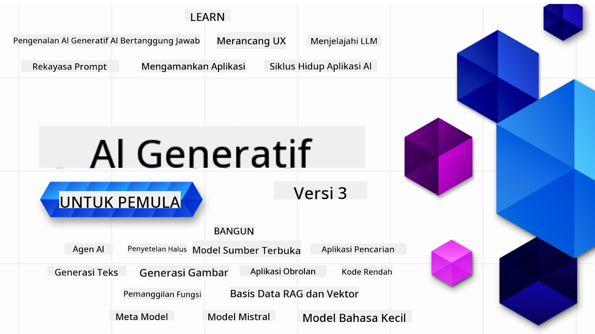

<!--
CO_OP_TRANSLATOR_METADATA:
{
  "original_hash": "6e3f4c8a4f323b8eab1cf11ded304b0f",
  "translation_date": "2025-06-25T08:07:14+00:00",
  "source_file": "README.md",
  "language_code": "id"
}
-->

### 21 Pelajaran mengajarkan semua yang perlu Anda ketahui untuk mulai membangun aplikasi AI Generatif

### 🌐 Dukungan Multi-Bahasa

#### Didukung melalui GitHub Action (Otomatis & Selalu Terbaru)

# Generative AI untuk Pemula (Versi 3) - Sebuah Kursus

Pelajari dasar-dasar membangun aplikasi Generative AI dengan kursus 21 pelajaran komprehensif kami oleh Microsoft Cloud Advocates.

## 🌱 Memulai

Kursus ini memiliki 21 pelajaran. Setiap pelajaran mencakup topiknya sendiri, jadi mulailah dari mana pun yang Anda suka!

Pelajaran diberi label "Learn" yang menjelaskan konsep Generative AI atau pelajaran "Build" yang menjelaskan konsep dan contoh kode dalam **Python** dan **TypeScript** jika memungkinkan.

Untuk Pengembang .NET, lihat [Generative AI untuk Pemula (Edisi .NET)](https://github.com/microsoft/Generative-AI-for-beginners-dotnet?WT.mc_id=academic-105485-koreyst)!

Setiap pelajaran juga menyertakan bagian "Keep Learning" dengan alat pembelajaran tambahan.

## Yang Anda Butuhkan
### Untuk menjalankan kode kursus ini, Anda dapat menggunakan salah satu dari:
- [Azure OpenAI Service](https://aka.ms/genai-beginners/azure-open-ai?WT.mc_id=academic-105485-koreyst) - **Pelajaran:** "aoai-assignment"
- [GitHub Marketplace Model Catalog](https://aka.ms/genai-beginners/gh-models?WT.mc_id=academic-105485-koreyst) - **Pelajaran:** "githubmodels"
- [OpenAI API](https://aka.ms/genai-beginners/open-ai?WT.mc_id=academic-105485-koreyst) - **Pelajaran:** "oai-assignment"

- Pengetahuan dasar tentang Python atau TypeScript sangat membantu - \*Untuk pemula absolut, lihat kursus [Python](https://aka.ms/genai-beginners/python?WT.mc_id=academic-105485-koreyst) dan [TypeScript](https://aka.ms/genai-beginners/typescript?WT.mc_id=academic-105485-koreyst) ini
- Akun GitHub untuk [fork seluruh repo ini](https://aka.ms/genai-beginners/github?WT.mc_id=academic-105485-koreyst) ke akun GitHub Anda sendiri

Kami telah membuat pelajaran **[Course Setup](./00-course-setup/README.md?WT.mc_id=academic-105485-koreyst)** untuk membantu Anda dalam menyiapkan lingkungan pengembangan Anda.

Jangan lupa untuk [beri bintang (🌟) repo ini](https://docs.github.com/en/get-started/exploring-projects-on-github/saving-repositories-with-stars?WT.mc_id=academic-105485-koreyst) agar lebih mudah ditemukan nanti.

## 🧠 Siap untuk Diterapkan?

Jika Anda mencari contoh kode yang lebih maju, lihat [koleksi Contoh Kode Generative AI](https://aka.ms/genai-beg-code?WT.mc_id=academic-105485-koreyst) kami dalam **Python** dan **TypeScript**.

## 🗣️ Temui Pembelajar Lain, Dapatkan Dukungan

Bergabunglah dengan [server Discord resmi Azure AI Foundry](https://aka.ms/genai-discord?WT.mc_id=academic-105485-koreyst) kami untuk bertemu dan berjejaring dengan pembelajar lain yang mengikuti kursus ini dan mendapatkan dukungan.

Ajukan pertanyaan atau bagikan umpan balik produk di [Forum Pengembang Azure AI Foundry](https://aka.ms/azureaifoundry/forum) kami di Github.

## 🚀 Membangun Startup?

Daftar ke [Microsoft untuk Startups Founders Hub](https://aka.ms/genai-foundershub?WT.mc_id=academic-105485-koreyst) untuk menerima **kredit OpenAI gratis** dan hingga **$150k untuk kredit Azure untuk mengakses model OpenAI melalui Azure OpenAI Services**.

## 🙏 Ingin membantu?

Apakah Anda memiliki saran atau menemukan kesalahan ejaan atau kode? [Ajukan masalah](https://github.com/microsoft/generative-ai-for-beginners/issues?WT.mc_id=academic-105485-koreyst) atau [Buat permintaan tarik](https://github.com/microsoft/generative-ai-for-beginners/pulls?WT.mc_id=academic-105485-koreyst)

## 📂 Setiap pelajaran mencakup:

- Pengantar video singkat tentang topik
- Pelajaran tertulis yang terletak di README
- Contoh kode Python dan TypeScript yang mendukung Azure OpenAI dan OpenAI API
- Tautan ke sumber daya tambahan untuk melanjutkan pembelajaran Anda

## 🗃️ Pelajaran

| #   | **Tautan Pelajaran**                                                                                                                         | **Deskripsi**                                                                                   | **Video**                                                                   | **Pembelajaran Tambahan**                                                       |
| --- | -------------------------------------------------------------------------------------------------------------------------------------------- | ----------------------------------------------------------------------------------------------- | --------------------------------------------------------------------------- | ------------------------------------------------------------------------------ |
| 00  | [Course Setup](./00-course-setup/README.md?WT.mc_id=academic-105485-koreyst)                                                                 | **Learn:** Cara Menyiapkan Lingkungan Pengembangan Anda                                         | Video Segera Hadir                                                          | [Pelajari Lebih Lanjut](https://aka.ms/genai-collection?WT.mc_id=academic-105485-koreyst) |
| 01  | [Pengenalan Generative AI dan LLMs](./01-introduction-to-genai/README.md?WT.mc_id=academic-105485-koreyst)                                   | **Learn:** Memahami apa itu Generative AI dan bagaimana Model Bahasa Besar (LLMs) bekerja.      | [Video](https://aka.ms/gen-ai-lesson-1-gh?WT.mc_id=academic-105485-koreyst) | [Pelajari Lebih Lanjut](https://aka.ms/genai-collection?WT.mc_id=academic-105485-koreyst) |
| 02  | [Menjelajahi dan membandingkan berbagai LLMs](./02-exploring-and-comparing-different-llms/README.md?WT.mc_id=academic-105485-koreyst)        | **Learn:** Cara memilih model yang tepat untuk kasus penggunaan Anda                            | [Video](https://aka.ms/gen-ai-lesson2-gh?WT.mc_id=academic-105485-koreyst)  | [Pelajari Lebih Lanjut](https://aka.ms/genai-collection?WT.mc_id=academic-105485-koreyst) |
| 03  | [Menggunakan Generative AI Secara Bertanggung Jawab](./03-using-generative-ai-responsibly/README.md?WT.mc_id=academic-105485-koreyst)        | **Learn:** Cara membangun Aplikasi Generative AI secara bertanggung jawab                       | [Video](https://aka.ms/gen-ai-lesson3-gh?WT.mc_id=academic-105485-koreyst)  | [Pelajari Lebih Lanjut](https://aka.ms/genai-collection?WT.mc_id=academic-105485-koreyst) |
| 04  | [Memahami Dasar-dasar Prompt Engineering](./04-prompt-engineering-fundamentals/README.md?WT.mc_id=academic-105485-koreyst)                   | **Learn:** Praktik Terbaik Prompt Engineering Secara Langsung                                   | [Video](https://aka.ms/gen-ai-lesson4-gh?WT.mc_id=academic-105485-koreyst)  | [Pelajari Lebih Lanjut](https://aka.ms/genai-collection?WT.mc_id=academic-105485-koreyst) |
| 05  | [Membuat Prompt Lanjutan](./05-advanced-prompts/README.md?WT.mc_id=academic-105485-koreyst)                                                | **Pelajari:** Cara menerapkan teknik rekayasa prompt yang meningkatkan hasil dari prompt Anda. | [Video](https://aka.ms/gen-ai-lesson5-gh?WT.mc_id=academic-105485-koreyst)  | [Pelajari Lebih Lanjut](https://aka.ms/genai-collection?WT.mc_id=academic-105485-koreyst) |
| 06  | [Membangun Aplikasi Pembangkitan Teks](./06-text-generation-apps/README.md?WT.mc_id=academic-105485-koreyst)                                | **Bangun:** Sebuah aplikasi pembangkitan teks menggunakan Azure OpenAI / OpenAI API                                | [Video](https://aka.ms/gen-ai-lesson6-gh?WT.mc_id=academic-105485-koreyst)  | [Pelajari Lebih Lanjut](https://aka.ms/genai-collection?WT.mc_id=academic-105485-koreyst) |
| 07  | [Membangun Aplikasi Chat](./07-building-chat-applications/README.md?WT.mc_id=academic-105485-koreyst)                                     | **Bangun:** Teknik untuk membangun dan mengintegrasikan aplikasi chat secara efisien.               | [Video](https://aka.ms/gen-ai-lessons7-gh?WT.mc_id=academic-105485-koreyst) | [Pelajari Lebih Lanjut](https://aka.ms/genai-collection?WT.mc_id=academic-105485-koreyst) |
| 08  | [Membangun Aplikasi Pencarian dengan Basis Data Vektor](./08-building-search-applications/README.md?WT.mc_id=academic-105485-koreyst)                        | **Bangun:** Sebuah aplikasi pencarian yang menggunakan Embeddings untuk mencari data.                        | [Video](https://aka.ms/gen-ai-lesson8-gh?WT.mc_id=academic-105485-koreyst)  | [Pelajari Lebih Lanjut](https://aka.ms/genai-collection?WT.mc_id=academic-105485-koreyst) |
| 09  | [Membangun Aplikasi Pembangkitan Gambar](./09-building-image-applications/README.md?WT.mc_id=academic-105485-koreyst)                        | **Bangun:** Sebuah aplikasi pembangkitan gambar                                                       | [Video](https://aka.ms/gen-ai-lesson9-gh?WT.mc_id=academic-105485-koreyst)  | [Pelajari Lebih Lanjut](https://aka.ms/genai-collection?WT.mc_id=academic-105485-koreyst) |
| 10  | [Membangun Aplikasi AI Low Code](./10-building-low-code-ai-applications/README.md?WT.mc_id=academic-105485-koreyst)                       | **Bangun:** Sebuah aplikasi Generative AI menggunakan alat Low Code                                     | [Video](https://aka.ms/gen-ai-lesson10-gh?WT.mc_id=academic-105485-koreyst) | [Pelajari Lebih Lanjut](https://aka.ms/genai-collection?WT.mc_id=academic-105485-koreyst) |
| 11  | [Mengintegrasikan Aplikasi Eksternal dengan Pemanggilan Fungsi](./11-integrating-with-function-calling/README.md?WT.mc_id=academic-105485-koreyst) | **Bangun:** Apa itu pemanggilan fungsi dan kasus penggunaannya untuk aplikasi                          | [Video](https://aka.ms/gen-ai-lesson11-gh?WT.mc_id=academic-105485-koreyst) | [Pelajari Lebih Lanjut](https://aka.ms/genai-collection?WT.mc_id=academic-105485-koreyst) |
| 12  | [Merancang UX untuk Aplikasi AI](./12-designing-ux-for-ai-applications/README.md?WT.mc_id=academic-105485-koreyst)                         | **Pelajari:** Cara menerapkan prinsip desain UX saat mengembangkan Aplikasi Generative AI         | [Video](https://aka.ms/gen-ai-lesson12-gh?WT.mc_id=academic-105485-koreyst) | [Pelajari Lebih Lanjut](https://aka.ms/genai-collection?WT.mc_id=academic-105485-koreyst) |
| 13  | [Mengamankan Aplikasi Generative AI Anda](./13-securing-ai-applications/README.md?WT.mc_id=academic-105485-koreyst)                         | **Pelajari:** Ancaman dan risiko terhadap sistem AI dan metode untuk mengamankan sistem ini.             | [Video](https://aka.ms/gen-ai-lesson13-gh?WT.mc_id=academic-105485-koreyst) | [Pelajari Lebih Lanjut](https://aka.ms/genai-collection?WT.mc_id=academic-105485-koreyst) |
| 14  | [Siklus Hidup Aplikasi Generative AI](./14-the-generative-ai-application-lifecycle/README.md?WT.mc_id=academic-105485-koreyst)           | **Pelajari:** Alat dan metrik untuk mengelola Siklus Hidup LLM dan LLMOps                         | [Video](https://aka.ms/gen-ai-lesson14-gh?WT.mc_id=academic-105485-koreyst) | [Pelajari Lebih Lanjut](https://aka.ms/genai-collection?WT.mc_id=academic-105485-koreyst) |
| 15  | [Retrieval Augmented Generation (RAG) dan Basis Data Vektor](./15-rag-and-vector-databases/README.md?WT.mc_id=academic-105485-koreyst)        | **Bangun:** Aplikasi menggunakan Kerangka RAG untuk mengambil embedding dari Basis Data Vektor  | [Video](https://aka.ms/gen-ai-lesson15-gh?WT.mc_id=academic-105485-koreyst) | [Pelajari Lebih Lanjut](https://aka.ms/genai-collection?WT.mc_id=academic-105485-koreyst) |
| 16  | [Model Sumber Terbuka dan Hugging Face](./16-open-source-models/README.md?WT.mc_id=academic-105485-koreyst)                                    | **Bangun:** Aplikasi menggunakan model sumber terbuka yang tersedia di Hugging Face                    | [Video](https://aka.ms/gen-ai-lesson16-gh?WT.mc_id=academic-105485-koreyst) | [Pelajari Lebih Lanjut](https://aka.ms/genai-collection?WT.mc_id=academic-105485-koreyst) |
| 17  | [Agen AI](./17-ai-agents/README.md?WT.mc_id=academic-105485-koreyst)                                                                       | **Bangun:** Aplikasi menggunakan Kerangka Agen AI                                           | [Video](https://aka.ms/gen-ai-lesson17-gh?WT.mc_id=academic-105485-koreyst) | [Pelajari Lebih Lanjut](https://aka.ms/genai-collection?WT.mc_id=academic-105485-koreyst) |
| 18  | [Fine-Tuning LLMs](./18-fine-tuning/README.md?WT.mc_id=academic-105485-koreyst)                                                              | **Pelajari:** Apa, mengapa, dan bagaimana fine-tuning LLMs                                            | [Video](https://aka.ms/gen-ai-lesson18-gh?WT.mc_id=academic-105485-koreyst) | [Pelajari Lebih Lanjut](https://aka.ms/genai-collection?WT.mc_id=academic-105485-koreyst) |
| 19  | [Membangun dengan SLMs](./19-slm/README.md?WT.mc_id=academic-105485-koreyst)                                                              | **Pelajari:** Manfaat membangun dengan Model Bahasa Kecil                                            | Video Segera Hadir | [Pelajari Lebih Lanjut](https://aka.ms/genai-collection?WT.mc_id=academic-105485-koreyst) |
| 20  | [Membangun dengan Model Mistral](./20-mistral/README.md?WT.mc_id=academic-105485-koreyst)                                                              | **Pelajari:** Fitur dan perbedaan dari Model Keluarga Mistral                                           | Video Segera Hadir | [Pelajari Lebih Lanjut](https://aka.ms/genai-collection?WT.mc_id=academic-105485-koreyst) |
| 21  | [Membangun dengan Model Meta](./21-meta/README.md?WT.mc_id=academic-105485-koreyst)                                                              | **Pelajari:** Fitur dan perbedaan dari Model Keluarga Meta                                           | Video Segera Hadir | [Pelajari Lebih Lanjut](https://aka.ms/genai-collection?WT.mc_id=academic-105485-koreyst) |

### 🌟 Terima kasih khusus

Terima kasih khusus kepada [**John Aziz**](https://www.linkedin.com/in/john0isaac/) atas pembuatan semua GitHub Actions dan alur kerja

[**Bernhard Merkle**](https://www.linkedin.com/in/bernhard-merkle-738b73/) atas kontribusi pentingnya untuk setiap pelajaran guna meningkatkan pengalaman belajar dan kode.

## 🎒 Kursus Lainnya

Tim kami menghasilkan kursus lainnya! Lihat:

- [**BARU** Model Context Protocol untuk Pemula](https://github.com/microsoft/mcp-for-beginners?WT.mc_id=academic-105485-koreyst)
- [Agen AI untuk Pemula](https://github.com/microsoft/ai-agents-for-beginners?WT.mc_id=academic-105485-koreyst)
- [Generative AI untuk Pemula menggunakan .NET](https://github.com/microsoft/Generative-AI-for-beginners-dotnet?WT.mc_id=academic-105485-koreyst)
- [Generative AI untuk Pemula menggunakan JavaScript](https://aka.ms/genai-js-course?WT.mc_id=academic-105485-koreyst)
- [ML untuk Pemula](https://aka.ms/ml-beginners?WT.mc_id=academic-105485-koreyst)
- [Data Science untuk Pemula](https://aka.ms/datascience-beginners?WT.mc_id=academic-105485-koreyst)
- [AI untuk Pemula](https://aka.ms/ai-beginners?WT.mc_id=academic-105485-koreyst)
- [Keamanan Siber untuk Pemula](https://github.com/microsoft/Security-101??WT.mc_id=academic-96948-sayoung)
- [Pengembangan Web untuk Pemula](https://aka.ms/webdev-beginners?WT.mc_id=academic-105485-koreyst)
- [IoT untuk Pemula](https://aka.ms/iot-beginners?WT.mc_id=academic-105485-koreyst)
- [Pengembangan XR untuk Pemula](https://github.com/microsoft/xr-development-for-beginners?WT.mc_id=academic-105485-koreyst)
- [Menguasai GitHub Copilot untuk Pemrograman Berpasangan AI](https://aka.ms/GitHubCopilotAI?WT.mc_id=academic-105485-koreyst)
- [Menguasai GitHub Copilot untuk Pengembang C#/.NET](https://github.com/microsoft/mastering-github-copilot-for-dotnet-csharp-developers?WT.mc_id=academic-105485-koreyst)
- [Pilih Petualangan Copilot Anda Sendiri](https://github.com/microsoft/CopilotAdventures?WT.mc_id=academic-105485-koreyst)

**Penafian**:  
Dokumen ini telah diterjemahkan menggunakan layanan penerjemahan AI [Co-op Translator](https://github.com/Azure/co-op-translator). Meskipun kami berusaha untuk mencapai akurasi, harap diingat bahwa terjemahan otomatis mungkin mengandung kesalahan atau ketidakakuratan. Dokumen asli dalam bahasa aslinya harus dianggap sebagai sumber yang berwenang. Untuk informasi penting, disarankan untuk menggunakan terjemahan manusia profesional. Kami tidak bertanggung jawab atas kesalahpahaman atau interpretasi yang salah yang timbul dari penggunaan terjemahan ini.