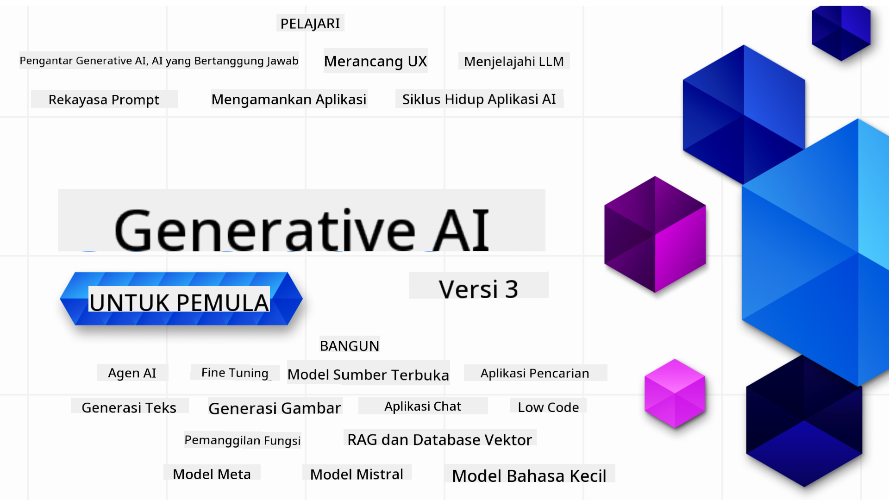

<!--
CO_OP_TRANSLATOR_METADATA:
{
  "original_hash": "4d022651f0c17151c68255e41a68e4ed",
  "translation_date": "2025-12-21T13:09:18+00:00",
  "source_file": "README.md",
  "language_code": "id"
}
-->

### 21 Pelajaran yang mengajarkan semua yang Anda perlu ketahui untuk mulai membangun aplikasi AI Generatif

### 🌐 Dukungan Multi-Bahasa

#### Didukung melalui GitHub Action (Otomatis & Selalu Terbarui)

<!-- CO-OP TRANSLATOR LANGUAGES TABLE START -->
[Arabic](../ar/README.md) | [Bengali](../bn/README.md) | [Bulgarian](../bg/README.md) | [Burmese (Myanmar)](../my/README.md) | [Chinese (Simplified)](../zh/README.md) | [Chinese (Traditional, Hong Kong)](../hk/README.md) | [Chinese (Traditional, Macau)](../mo/README.md) | [Chinese (Traditional, Taiwan)](../tw/README.md) | [Croatian](../hr/README.md) | [Czech](../cs/README.md) | [Danish](../da/README.md) | [Dutch](../nl/README.md) | [Estonian](../et/README.md) | [Finnish](../fi/README.md) | [French](../fr/README.md) | [German](../de/README.md) | [Greek](../el/README.md) | [Hebrew](../he/README.md) | [Hindi](../hi/README.md) | [Hungarian](../hu/README.md) | [Indonesian](./README.md) | [Italian](../it/README.md) | [Japanese](../ja/README.md) | [Kannada](../kn/README.md) | [Korean](../ko/README.md) | [Lithuanian](../lt/README.md) | [Malay](../ms/README.md) | [Malayalam](../ml/README.md) | [Marathi](../mr/README.md) | [Nepali](../ne/README.md) | [Nigerian Pidgin](../pcm/README.md) | [Norwegian](../no/README.md) | [Persian (Farsi)](../fa/README.md) | [Polish](../pl/README.md) | [Portuguese (Brazil)](../br/README.md) | [Portuguese (Portugal)](../pt/README.md) | [Punjabi (Gurmukhi)](../pa/README.md) | [Romanian](../ro/README.md) | [Russian](../ru/README.md) | [Serbian (Cyrillic)](../sr/README.md) | [Slovak](../sk/README.md) | [Slovenian](../sl/README.md) | [Spanish](../es/README.md) | [Swahili](../sw/README.md) | [Swedish](../sv/README.md) | [Tagalog (Filipino)](../tl/README.md) | [Tamil](../ta/README.md) | [Telugu](../te/README.md) | [Thai](../th/README.md) | [Turkish](../tr/README.md) | [Ukrainian](../uk/README.md) | [Urdu](../ur/README.md) | [Vietnamese](../vi/README.md)
<!-- CO-OP TRANSLATOR LANGUAGES TABLE END -->

# AI Generatif untuk Pemula (Versi 3) - Kursus

Pelajari dasar-dasar membangun aplikasi AI Generatif dengan kursus komprehensif 21 pelajaran oleh Microsoft Cloud Advocates.

## 🌱 Memulai

Kursus ini memiliki 21 pelajaran. Setiap pelajaran membahas topiknya sendiri jadi mulailah dari mana pun yang Anda suka!

Pelajaran diberi label sebagai pelajaran "Learn" yang menjelaskan konsep AI Generatif atau pelajaran "Build" yang menjelaskan konsep dan contoh kode dalam kedua **Python** dan **TypeScript** bila memungkinkan.

Untuk Pengembang .NET lihat [Generative AI for Beginners (.NET Edition)](https://github.com/microsoft/Generative-AI-for-beginners-dotnet?WT.mc_id=academic-105485-koreyst)!

Setiap pelajaran juga menyertakan bagian "Keep Learning" dengan alat pembelajaran tambahan.

## Apa yang Anda Butuhkan
### Untuk menjalankan kode dari kursus ini, Anda bisa menggunakan salah satu: 
 - [Azure OpenAI Service](https://aka.ms/genai-beginners/azure-open-ai?WT.mc_id=academic-105485-koreyst) - **Pelajaran:** "aoai-assignment"
 - [GitHub Marketplace Model Catalog](https://aka.ms/genai-beginners/gh-models?WT.mc_id=academic-105485-koreyst) - **Pelajaran:** "githubmodels"
 - [OpenAI API](https://aka.ms/genai-beginners/open-ai?WT.mc_id=academic-105485-koreyst) - **Pelajaran:** "oai-assignment" 
   
- Pengetahuan dasar tentang Python atau TypeScript akan membantu - \*Untuk pemula mutlak lihat kursus [Python](https://aka.ms/genai-beginners/python?WT.mc_id=academic-105485-koreyst) dan [TypeScript](https://aka.ms/genai-beginners/typescript?WT.mc_id=academic-105485-koreyst)
- Akun GitHub untuk [fork this entire repo](https://aka.ms/genai-beginners/github?WT.mc_id=academic-105485-koreyst) ke akun GitHub Anda

Kami telah membuat sebuah pelajaran **[Course Setup](./00-course-setup/README.md?WT.mc_id=academic-105485-koreyst)** untuk membantu Anda menyiapkan lingkungan pengembangan Anda.

Jangan lupa untuk [memberi bintang (🌟) repo ini](https://docs.github.com/en/get-started/exploring-projects-on-github/saving-repositories-with-stars?WT.mc_id=academic-105485-koreyst) agar lebih mudah menemukannya nanti.

## 🧠 Siap untuk Dideploy?

Jika Anda mencari contoh kode yang lebih lanjut, lihat koleksi kami [collection of Generative AI Code Samples](https://aka.ms/genai-beg-code?WT.mc_id=academic-105485-koreyst) dalam kedua **Python** dan **TypeScript**.

## 🗣️ Temui Pelajar Lain, Dapatkan Dukungan

Bergabunglah dengan [official Azure AI Foundry Discord server](https://aka.ms/genai-discord?WT.mc_id=academic-105485-koreyst) untuk bertemu dan berjejaring dengan pelajar lain yang mengikuti kursus ini serta mendapatkan dukungan.

Ajukan pertanyaan atau bagikan masukan produk di [Azure AI Foundry Developer Forum](https://aka.ms/azureaifoundry/forum) di Github.

## 🚀 Membangun Startup?

Kunjungi [Microsoft for Startups](https://www.microsoft.com/startups) untuk mencari tahu cara memulai membangun dengan kredit Azure hari ini.

## 🙏 Ingin membantu?

Apakah Anda memiliki saran atau menemukan kesalahan ejaan atau kode? [Raise an issue](https://github.com/microsoft/generative-ai-for-beginners/issues?WT.mc_id=academic-105485-koreyst) atau [Create a pull request](https://github.com/microsoft/generative-ai-for-beginners/pulls?WT.mc_id=academic-105485-koreyst)

## 📂 Setiap pelajaran mencakup:

- Video pengantar singkat mengenai topik
- Pelajaran tertulis yang terletak di README
- Contoh kode Python dan TypeScript yang mendukung Azure OpenAI dan OpenAI API
- Tautan ke sumber tambahan untuk melanjutkan pembelajaran Anda

## 🗃️ Pelajaran

| #   | **Lesson Link**                                                                                                                              | **Description**                                                                                 | **Video**                                                                   | **Pembelajaran Tambahan**                                                             |
| --- | -------------------------------------------------------------------------------------------------------------------------------------------- | ----------------------------------------------------------------------------------------------- | --------------------------------------------------------------------------- | ------------------------------------------------------------------------------ |
| 00  | [Course Setup](./00-course-setup/README.md?WT.mc_id=academic-105485-koreyst)                                                                 | **Pelajari:** Cara Menyiapkan Lingkungan Pengembangan Anda                                            | Video Segera Hadir                                                                 | [Pelajari Lebih Lanjut](https://aka.ms/genai-collection?WT.mc_id=academic-105485-koreyst) |
| 01  | [Introduction to Generative AI and LLMs](./01-introduction-to-genai/README.md?WT.mc_id=academic-105485-koreyst)                              | **Pelajari:** Memahami apa itu AI Generatif dan bagaimana Large Language Models (LLMs) bekerja       | [Video](https://aka.ms/gen-ai-lesson-1-gh?WT.mc_id=academic-105485-koreyst) | [Pelajari Lebih Lanjut](https://aka.ms/genai-collection?WT.mc_id=academic-105485-koreyst) |
| 02  | [Exploring and comparing different LLMs](./02-exploring-and-comparing-different-llms/README.md?WT.mc_id=academic-105485-koreyst)             | **Pelajari:** Cara memilih model yang tepat untuk kasus penggunaan Anda                                      | [Video](https://aka.ms/gen-ai-lesson2-gh?WT.mc_id=academic-105485-koreyst)  | [Pelajari Lebih Lanjut](https://aka.ms/genai-collection?WT.mc_id=academic-105485-koreyst) |
| 03  | [Using Generative AI Responsibly](./03-using-generative-ai-responsibly/README.md?WT.mc_id=academic-105485-koreyst)                           | **Pelajari:** Cara membangun Aplikasi AI Generatif secara bertanggung jawab                                  | [Video](https://aka.ms/gen-ai-lesson3-gh?WT.mc_id=academic-105485-koreyst)  | [Pelajari Lebih Lanjut](https://aka.ms/genai-collection?WT.mc_id=academic-105485-koreyst) |
| 04  | [Understanding Prompt Engineering Fundamentals](./04-prompt-engineering-fundamentals/README.md?WT.mc_id=academic-105485-koreyst)             | **Pelajari:** Praktik Terbaik Prompt Engineering secara langsung                                           | [Video](https://aka.ms/gen-ai-lesson4-gh?WT.mc_id=academic-105485-koreyst)  | [Pelajari Lebih Lanjut](https://aka.ms/genai-collection?WT.mc_id=academic-105485-koreyst) |
| 05  | [Membuat Prompt Lanjutan](./05-advanced-prompts/README.md?WT.mc_id=academic-105485-koreyst)                                                | **Pelajari:** Bagaimana menerapkan teknik rekayasa prompt yang meningkatkan hasil dari prompt Anda. | [Video](https://aka.ms/gen-ai-lesson5-gh?WT.mc_id=academic-105485-koreyst)  | [Pelajari Lebih Lanjut](https://aka.ms/genai-collection?WT.mc_id=academic-105485-koreyst) |
| 06  | [Membangun Aplikasi Generasi Teks](./06-text-generation-apps/README.md?WT.mc_id=academic-105485-koreyst)                                | **Bangun:** Sebuah aplikasi generasi teks menggunakan Azure OpenAI / OpenAI API                                | [Video](https://aka.ms/gen-ai-lesson6-gh?WT.mc_id=academic-105485-koreyst)  | [Pelajari Lebih Lanjut](https://aka.ms/genai-collection?WT.mc_id=academic-105485-koreyst) |
| 07  | [Membangun Aplikasi Chat](./07-building-chat-applications/README.md?WT.mc_id=academic-105485-koreyst)                                     | **Bangun:** Teknik untuk membangun dan mengintegrasikan aplikasi chat secara efisien.               | [Video](https://aka.ms/gen-ai-lessons7-gh?WT.mc_id=academic-105485-koreyst) | [Pelajari Lebih Lanjut](https://aka.ms/genai-collection?WT.mc_id=academic-105485-koreyst) |
| 08  | [Membangun Aplikasi Pencarian Basis Data Vektor](./08-building-search-applications/README.md?WT.mc_id=academic-105485-koreyst)                        | **Bangun:** Sebuah aplikasi pencarian yang menggunakan Embeddings untuk mencari data.                        | [Video](https://aka.ms/gen-ai-lesson8-gh?WT.mc_id=academic-105485-koreyst)  | [Pelajari Lebih Lanjut](https://aka.ms/genai-collection?WT.mc_id=academic-105485-koreyst) |
| 09  | [Membangun Aplikasi Pembuatan Gambar](./09-building-image-applications/README.md?WT.mc_id=academic-105485-koreyst)                        | **Bangun:** Sebuah aplikasi pembuatan gambar                                                       | [Video](https://aka.ms/gen-ai-lesson9-gh?WT.mc_id=academic-105485-koreyst)  | [Pelajari Lebih Lanjut](https://aka.ms/genai-collection?WT.mc_id=academic-105485-koreyst) |
| 10  | [Membangun Aplikasi AI Low Code](./10-building-low-code-ai-applications/README.md?WT.mc_id=academic-105485-koreyst)                       | **Bangun:** Aplikasi AI Generatif menggunakan alat Low Code                                     | [Video](https://aka.ms/gen-ai-lesson10-gh?WT.mc_id=academic-105485-koreyst) | [Pelajari Lebih Lanjut](https://aka.ms/genai-collection?WT.mc_id=academic-105485-koreyst) |
| 11  | [Mengintegrasikan Aplikasi Eksternal dengan Panggilan Fungsi](./11-integrating-with-function-calling/README.md?WT.mc_id=academic-105485-koreyst) | **Bangun:** Apa itu pemanggilan fungsi dan kasus penggunaannya untuk aplikasi                          | [Video](https://aka.ms/gen-ai-lesson11-gh?WT.mc_id=academic-105485-koreyst) | [Pelajari Lebih Lanjut](https://aka.ms/genai-collection?WT.mc_id=academic-105485-koreyst) |
| 12  | [Merancang UX untuk Aplikasi AI](./12-designing-ux-for-ai-applications/README.md?WT.mc_id=academic-105485-koreyst)                         | **Pelajari:** Cara menerapkan prinsip desain UX saat mengembangkan Aplikasi AI Generatif         | [Video](https://aka.ms/gen-ai-lesson12-gh?WT.mc_id=academic-105485-koreyst) | [Pelajari Lebih Lanjut](https://aka.ms/genai-collection?WT.mc_id=academic-105485-koreyst) |
| 13  | [Mengamankan Aplikasi AI Generatif Anda](./13-securing-ai-applications/README.md?WT.mc_id=academic-105485-koreyst)                         | **Pelajari:** Ancaman dan risiko terhadap sistem AI serta metode untuk mengamankan sistem ini.             | [Video](https://aka.ms/gen-ai-lesson13-gh?WT.mc_id=academic-105485-koreyst) | [Pelajari Lebih Lanjut](https://aka.ms/genai-collection?WT.mc_id=academic-105485-koreyst) |
| 14  | [Siklus Hidup Aplikasi AI Generatif](./14-the-generative-ai-application-lifecycle/README.md?WT.mc_id=academic-105485-koreyst)           | **Pelajari:** Alat dan metrik untuk mengelola Siklus Hidup LLM dan LLMOps                         | [Video](https://aka.ms/gen-ai-lesson14-gh?WT.mc_id=academic-105485-koreyst) | [Pelajari Lebih Lanjut](https://aka.ms/genai-collection?WT.mc_id=academic-105485-koreyst) |
| 15  | [Retrieval Augmented Generation (RAG) dan Basis Data Vektor](./15-rag-and-vector-databases/README.md?WT.mc_id=academic-105485-koreyst)        | **Bangun:** Aplikasi menggunakan Kerangka RAG untuk mengambil embeddings dari Basis Data Vektor  | [Video](https://aka.ms/gen-ai-lesson15-gh?WT.mc_id=academic-105485-koreyst) | [Pelajari Lebih Lanjut](https://aka.ms/genai-collection?WT.mc_id=academic-105485-koreyst) |
| 16  | [Model Sumber Terbuka dan Hugging Face](./16-open-source-models/README.md?WT.mc_id=academic-105485-koreyst)                                    | **Bangun:** Aplikasi menggunakan model sumber terbuka yang tersedia di Hugging Face                    | [Video](https://aka.ms/gen-ai-lesson16-gh?WT.mc_id=academic-105485-koreyst) | [Pelajari Lebih Lanjut](https://aka.ms/genai-collection?WT.mc_id=academic-105485-koreyst) |
| 17  | [Agen AI](./17-ai-agents/README.md?WT.mc_id=academic-105485-koreyst)                                                                       | **Bangun:** Aplikasi menggunakan Kerangka Agen AI                                           | [Video](https://aka.ms/gen-ai-lesson17-gh?WT.mc_id=academic-105485-koreyst) | [Pelajari Lebih Lanjut](https://aka.ms/genai-collection?WT.mc_id=academic-105485-koreyst) |
| 18  | [Penyetelan LLM](./18-fine-tuning/README.md?WT.mc_id=academic-105485-koreyst)                                                              | **Pelajari:** Apa, mengapa dan bagaimana melakukan penyetelan (fine-tuning) pada LLM                                            | [Video](https://aka.ms/gen-ai-lesson18-gh?WT.mc_id=academic-105485-koreyst) | [Pelajari Lebih Lanjut](https://aka.ms/genai-collection?WT.mc_id=academic-105485-koreyst) |
| 19  | [Membangun dengan SLM](./19-slm/README.md?WT.mc_id=academic-105485-koreyst)                                                              | **Pelajari:** Manfaat membangun dengan Model Bahasa Kecil                                            | Video Segera Hadir | [Pelajari Lebih Lanjut](https://aka.ms/genai-collection?WT.mc_id=academic-105485-koreyst) |
| 20  | [Membangun dengan Model Mistral](./20-mistral/README.md?WT.mc_id=academic-105485-koreyst)                                                              | **Pelajari:** Fitur dan perbedaan dari Model Keluarga Mistral                                           | Video Segera Hadir | [Pelajari Lebih Lanjut](https://aka.ms/genai-collection?WT.mc_id=academic-105485-koreyst) |
| 21  | [Membangun dengan Model Meta](./21-meta/README.md?WT.mc_id=academic-105485-koreyst)                                                              | **Pelajari:** Fitur dan perbedaan dari Model Keluarga Meta                                           | Video Segera Hadir | [Pelajari Lebih Lanjut](https://aka.ms/genai-collection?WT.mc_id=academic-105485-koreyst) |

### 🌟 Ucapan terima kasih khusus

Terima kasih khusus kepada [**John Aziz**](https://www.linkedin.com/in/john0isaac/) yang telah membuat semua GitHub Actions dan workflow

[**Bernhard Merkle**](https://www.linkedin.com/in/bernhard-merkle-738b73/) untuk memberikan kontribusi kunci pada setiap pelajaran untuk meningkatkan pengalaman pembelajar dan kode. 

## 🎒 Kursus Lainnya

Tim kami membuat kursus lain! Lihat:

<!-- CO-OP TRANSLATOR OTHER COURSES START -->
### LangChain

---

### Azure / Edge / MCP / Agen

---
 
### Seri AI Generatif

[-9333EA?style=for-the-badge&labelColor=E5E7EB&color=9333EA)](https://github.com/microsoft/Generative-AI-for-beginners-dotnet?WT.mc_id=academic-105485-koreyst)
[-C084FC?style=for-the-badge&labelColor=E5E7EB&color=C084FC)](https://github.com/microsoft/generative-ai-for-beginners-java?WT.mc_id=academic-105485-koreyst)
[-E879F9?style=for-the-badge&labelColor=E5E7EB&color=E879F9)](https://github.com/microsoft/generative-ai-with-javascript?WT.mc_id=academic-105485-koreyst)

---
 
### Pembelajaran Inti

---
 
### Seri Copilot

<!-- CO-OP TRANSLATOR OTHER COURSES END -->

## Mendapatkan Bantuan

Jika Anda mengalami kebuntuan atau memiliki pertanyaan tentang membangun aplikasi AI. Bergabunglah dengan sesama pelajar dan pengembang berpengalaman dalam diskusi tentang MCP. Ini adalah komunitas yang mendukung di mana pertanyaan disambut dan pengetahuan dibagikan secara bebas.

Jika Anda memiliki umpan balik produk atau menemukan kesalahan saat membangun, kunjungi:

---

<!-- CO-OP TRANSLATOR DISCLAIMER START -->
**Penafian**:
Dokumen ini telah diterjemahkan menggunakan layanan terjemahan AI [Co-op Translator](https://github.com/Azure/co-op-translator). Meskipun kami berupaya mencapai akurasi, harap diperhatikan bahwa terjemahan otomatis mungkin mengandung kesalahan atau ketidakakuratan. Dokumen asli dalam bahasa aslinya harus dianggap sebagai sumber yang berwenang. Untuk informasi yang bersifat krusial, disarankan menggunakan jasa penerjemah profesional. Kami tidak bertanggung jawab atas kesalahpahaman atau penafsiran yang keliru yang timbul akibat penggunaan terjemahan ini.
<!-- CO-OP TRANSLATOR DISCLAIMER END -->