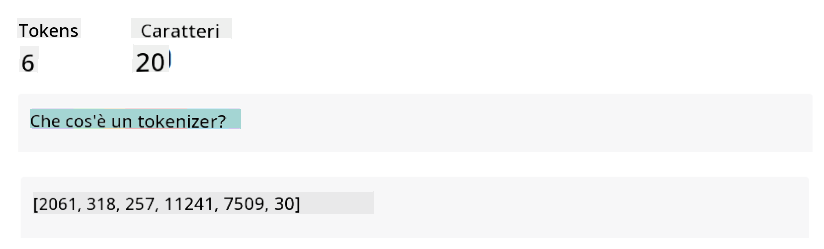
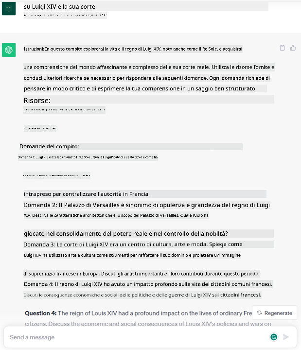
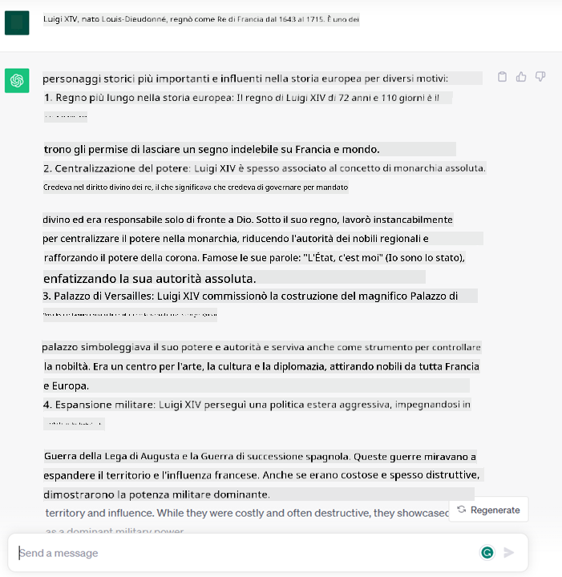
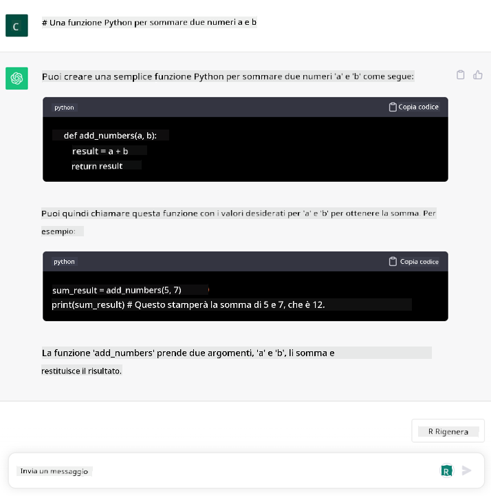

<!--
CO_OP_TRANSLATOR_METADATA:
{
  "original_hash": "f53ba0fa49164f9323043f1c6b11f2b1",
  "translation_date": "2025-05-19T13:12:41+00:00",
  "source_file": "01-introduction-to-genai/README.md",
  "language_code": "it"
}
-->
# Introduzione all'IA Generativa e ai Modelli di Linguaggio di Grandi Dimensioni

_(Clicca sull'immagine sopra per vedere il video di questa lezione)_

L'IA generativa è un'intelligenza artificiale capace di generare testo, immagini e altri tipi di contenuti. Ciò che la rende una tecnologia fantastica è che democratizza l'IA: chiunque può usarla con solo un prompt testuale, una frase scritta in linguaggio naturale. Non è necessario imparare un linguaggio come Java o SQL per realizzare qualcosa di utile, basta usare il proprio linguaggio, dire cosa si vuole e ottenere un suggerimento da un modello di IA. Le applicazioni e l'impatto sono enormi: puoi scrivere o comprendere report, scrivere applicazioni e molto altro, tutto in pochi secondi.

In questo curriculum, esploreremo come la nostra startup utilizza l'IA generativa per sbloccare nuovi scenari nel mondo dell'istruzione e come affrontiamo le inevitabili sfide legate alle implicazioni sociali della sua applicazione e ai limiti tecnologici.

## Introduzione

Questa lezione coprirà:

- Introduzione allo scenario aziendale: la nostra idea di startup e missione.
- IA generativa e come siamo arrivati all'attuale panorama tecnologico.
- Funzionamento interno di un grande modello di linguaggio.
- Principali capacità e casi d'uso pratici dei Modelli di Linguaggio di Grandi Dimensioni.

## Obiettivi di apprendimento

Dopo aver completato questa lezione, comprenderai:

- Cos'è l'IA generativa e come funzionano i Modelli di Linguaggio di Grandi Dimensioni.
- Come puoi sfruttare i modelli di linguaggio di grandi dimensioni per diversi casi d'uso, con un focus sugli scenari educativi.

## Scenario: la nostra startup educativa

L'Intelligenza Artificiale Generativa (IA) rappresenta il culmine della tecnologia IA, spingendo i confini di ciò che una volta era considerato impossibile. I modelli di IA generativa hanno diverse capacità e applicazioni, ma per questo curriculum esploreremo come sta rivoluzionando l'istruzione attraverso una startup fittizia. Ci riferiremo a questa startup come _la nostra startup_. La nostra startup opera nel campo dell'istruzione con l'ambiziosa dichiarazione di missione di

> _migliorare l'accessibilità all'apprendimento, su scala globale, garantendo un accesso equo all'istruzione e fornendo esperienze di apprendimento personalizzate a ogni studente, in base alle loro esigenze_.

Il team della nostra startup è consapevole che non sarà in grado di raggiungere questo obiettivo senza sfruttare uno degli strumenti più potenti dei tempi moderni – i Modelli di Linguaggio di Grandi Dimensioni (LLM).

Si prevede che l'IA generativa rivoluzionerà il modo in cui apprendiamo e insegniamo oggi, con studenti che hanno a disposizione insegnanti virtuali 24 ore su 24, che forniscono grandi quantità di informazioni ed esempi, e insegnanti in grado di sfruttare strumenti innovativi per valutare i propri studenti e fornire feedback.

Per iniziare, definiamo alcuni concetti e termini di base che utilizzeremo in tutto il curriculum.

## Come siamo arrivati all'IA Generativa?

Nonostante l'incredibile _hype_ creato ultimamente dall'annuncio dei modelli di IA generativa, questa tecnologia è frutto di decenni di lavoro, con i primi sforzi di ricerca risalenti agli anni '60. Ora siamo a un punto in cui l'IA possiede capacità cognitive umane, come la conversazione, come dimostrato ad esempio da [OpenAI ChatGPT](https://openai.com/chatgpt) o [Bing Chat](https://www.microsoft.com/edge/features/bing-chat?WT.mc_id=academic-105485-koreyst), che utilizza anche un modello GPT per le conversazioni di ricerca web di Bing.

Facendo un passo indietro, i primissimi prototipi di IA consistevano in chatbot scritti a macchina, basati su una base di conoscenza estratta da un gruppo di esperti e rappresentata in un computer. Le risposte nella base di conoscenza venivano attivate da parole chiave presenti nel testo di input. Tuttavia, presto divenne chiaro che un tale approccio, utilizzando chatbot scritti a macchina, non si adattava bene.

### Un approccio statistico all'IA: Machine Learning

Un punto di svolta arrivò negli anni '90, con l'applicazione di un approccio statistico all'analisi del testo. Ciò portò allo sviluppo di nuovi algoritmi – noti come machine learning – capaci di apprendere modelli dai dati senza essere esplicitamente programmati. Questo approccio consente alle macchine di simulare la comprensione del linguaggio umano: un modello statistico viene addestrato su coppie testo-etichetta, permettendo al modello di classificare il testo di input sconosciuto con un'etichetta predefinita che rappresenta l'intenzione del messaggio.

### Reti neurali e assistenti virtuali moderni

Negli ultimi anni, l'evoluzione tecnologica dell'hardware, capace di gestire quantità maggiori di dati e calcoli più complessi, ha incoraggiato la ricerca nell'IA, portando allo sviluppo di algoritmi di machine learning avanzati noti come reti neurali o algoritmi di deep learning.

Le reti neurali (e in particolare le Reti Neurali Ricorrenti – RNN) hanno notevolmente migliorato l'elaborazione del linguaggio naturale, permettendo di rappresentare il significato del testo in modo più significativo, valorizzando il contesto di una parola in una frase.

Questa è la tecnologia che ha alimentato gli assistenti virtuali nati nel primo decennio del nuovo secolo, molto abili nell'interpretare il linguaggio umano, identificare un bisogno e compiere un'azione per soddisfarlo – come rispondere con uno script predefinito o utilizzare un servizio di terze parti.

### Oggi, IA Generativa

Ed ecco come siamo arrivati all'IA Generativa oggi, che può essere vista come un sottoinsieme del deep learning.

Dopo decenni di ricerca nel campo dell'IA, una nuova architettura di modelli – chiamata _Transformer_ – ha superato i limiti delle RNN, essendo in grado di ricevere sequenze di testo molto più lunghe come input. I Transformers si basano sul meccanismo di attenzione, permettendo al modello di dare pesi diversi agli input ricevuti, 'prestando più attenzione' dove è concentrata l'informazione più rilevante, indipendentemente dal loro ordine nella sequenza di testo.

La maggior parte dei recenti modelli di IA generativa – noti anche come Modelli di Linguaggio di Grandi Dimensioni (LLM), poiché lavorano con input e output testuali – sono effettivamente basati su questa architettura. Ciò che è interessante di questi modelli – addestrati su una grande quantità di dati non etichettati provenienti da fonti diverse come libri, articoli e siti web – è che possono essere adattati a una vasta gamma di compiti e generare testo grammaticalmente corretto con una parvenza di creatività. Quindi, non solo hanno incredibilmente migliorato la capacità di una macchina di 'comprendere' un testo di input, ma hanno abilitato la loro capacità di generare una risposta originale in linguaggio umano.

## Come funzionano i modelli di linguaggio di grandi dimensioni?

Nel prossimo capitolo esploreremo diversi tipi di modelli di IA Generativa, ma per ora diamo un'occhiata a come funzionano i modelli di linguaggio di grandi dimensioni, con un focus sui modelli GPT (Generative Pre-trained Transformer) di OpenAI.

- **Tokenizer, testo in numeri**: I Modelli di Linguaggio di Grandi Dimensioni ricevono un testo come input e generano un testo come output. Tuttavia, essendo modelli statistici, funzionano molto meglio con i numeri rispetto alle sequenze di testo. Ecco perché ogni input al modello viene elaborato da un tokenizer, prima di essere utilizzato dal modello principale. Un token è un frammento di testo – costituito da un numero variabile di caratteri, quindi il compito principale del tokenizer è dividere l'input in un array di token. Successivamente, ogni token viene mappato con un indice di token, che è la codifica intera del frammento di testo originale.

- **Previsione dei token di output**: Dati n token come input (con un massimo n che varia da un modello all'altro), il modello è in grado di prevedere un token come output. Questo token viene poi incorporato nell'input dell'iterazione successiva, in un modello di finestra espandente, permettendo un'esperienza utente migliore ottenendo una (o più) frasi come risposta. Questo spiega perché, se hai mai giocato con ChatGPT, potresti aver notato che a volte sembra fermarsi a metà di una frase.

- **Processo di selezione, distribuzione di probabilità**: Il token di output viene scelto dal modello in base alla sua probabilità di verificarsi dopo la sequenza di testo corrente. Questo perché il modello prevede una distribuzione di probabilità su tutti i possibili 'prossimi token', calcolata in base al suo addestramento. Tuttavia, non sempre viene scelto il token con la probabilità più alta dalla distribuzione risultante. Un grado di casualità viene aggiunto a questa scelta, in modo che il modello agisca in modo non deterministico - non otteniamo lo stesso output esatto per lo stesso input. Questo grado di casualità viene aggiunto per simulare il processo di pensiero creativo e può essere regolato utilizzando un parametro del modello chiamato temperatura.

## Come può la nostra startup sfruttare i Modelli di Linguaggio di Grandi Dimensioni?

Ora che abbiamo una migliore comprensione del funzionamento interno di un modello di linguaggio di grandi dimensioni, vediamo alcuni esempi pratici dei compiti più comuni che possono svolgere piuttosto bene, con un occhio al nostro scenario aziendale. Abbiamo detto che la principale capacità di un Modello di Linguaggio di Grandi Dimensioni è _generare un testo da zero, partendo da un input testuale, scritto in linguaggio naturale_.

Ma che tipo di input e output testuale?
L'input di un modello di linguaggio di grandi dimensioni è noto come prompt, mentre l'output è noto come completion, termine che si riferisce al meccanismo del modello di generare il prossimo token per completare l'input corrente. Approfondiremo cosa è un prompt e come progettarlo in modo da ottenere il massimo dal nostro modello. Ma per ora, diciamo solo che un prompt può includere:

- Un'**istruzione** che specifica il tipo di output che ci aspettiamo dal modello. Questa istruzione a volte potrebbe includere alcuni esempi o alcuni dati aggiuntivi.

  1. Sintesi di un articolo, libro, recensioni di prodotti e altro, insieme all'estrazione di informazioni dai dati non strutturati.
    
    
  
  2. Ideazione creativa e progettazione di un articolo, un saggio, un compito o altro.
      
     

- Una **domanda**, posta sotto forma di conversazione con un agente.
  
  

- Un frammento di **testo da completare**, che implicitamente è una richiesta di assistenza alla scrittura.
  
  

- Un frammento di **codice** insieme alla richiesta di spiegarlo e documentarlo, o un commento che chiede di generare un pezzo di codice che esegue un compito specifico.
  
  

Gli esempi sopra sono piuttosto semplici e non intendono essere una dimostrazione esaustiva delle capacità dei Modelli di Linguaggio di Grandi Dimensioni. Sono pensati per mostrare il potenziale dell'utilizzo dell'IA generativa, in particolare ma non solo nei contesti educativi.

Inoltre, l'output di un modello di IA generativa non è perfetto e a volte la creatività del modello può giocare contro di esso, risultando in un output che è una combinazione di parole che l'utente umano può interpretare come una mistificazione della realtà, o può essere offensivo. L'IA generativa non è intelligente - almeno nella definizione più completa di intelligenza, che include il ragionamento critico e creativo o l'intelligenza emotiva; non è deterministica e non è affidabile, poiché fabbricazioni, come riferimenti errati, contenuti e dichiarazioni, possono essere combinati con informazioni corrette e presentati in modo persuasivo e sicuro. Nelle lezioni seguenti, ci occuperemo di tutte queste limitazioni e vedremo cosa possiamo fare per mitigarle.

## Compito

Il tuo compito è leggere di più sull'[IA generativa](https://en.wikipedia.org/wiki/Generative_artificial_intelligence?WT.mc_id=academic-105485-koreyst) e provare a identificare un'area in cui aggiungeresti l'IA generativa oggi che non la possiede. In che modo l'impatto sarebbe diverso rispetto a farlo nel "modo vecchio", puoi fare qualcosa che non potevi prima, o sei più veloce? Scrivi un riassunto di 300 parole su come sarebbe la tua startup di IA dei sogni e includi intestazioni come "Problema", "Come userei l'IA", "Impatto" e facoltativamente un piano aziendale.

Se hai svolto questo compito, potresti persino essere pronto per candidarti all'incubatore di Microsoft, [Microsoft for Startups Founders Hub](https://www.microsoft.com/startups?WT.mc_id=academic-105485-koreyst) offriamo crediti per Azure, OpenAI, mentoring e molto altro, dai un'occhiata!

## Verifica delle conoscenze

Cosa è vero sui modelli di linguaggio di grandi dimensioni?

1. Ottieni la stessa risposta ogni volta.
2. Fa le cose perfettamente, ottimo per sommare numeri, produrre codice funzionante, ecc.
3. La risposta può variare nonostante l'uso dello stesso prompt. È anche ottimo per darti una prima bozza di qualcosa, sia esso testo o codice. Ma devi migliorare i risultati.

A: 3, un LLM è non deterministico, la risposta varia, tuttavia, puoi controllare la sua varianza tramite un'impostazione di temperatura. Inoltre, non dovresti aspettarti che faccia le cose perfettamente, è qui per fare il lavoro pesante per te, il che spesso significa che ottieni un buon primo tentativo di qualcosa che devi migliorare gradualmente.

## Ottimo lavoro! Continua il viaggio

Dopo aver completato questa lezione, dai un'occhiata alla nostra [collezione di apprendimento sull'IA generativa](https://aka.ms/genai-collection?WT.mc_id=academic-105485-koreyst) per continuare ad aumentare la tua conoscenza sull'IA Generativa!

Vai alla Lezione 2 dove vedremo come [esplorare e confrontare diversi tipi di LLM](../02-exploring-and-comparing-different-llms/README.md?WT.mc_id=academic-105485-koreyst)!

**Disclaimer**:
Questo documento è stato tradotto utilizzando il servizio di traduzione AI [Co-op Translator](https://github.com/Azure/co-op-translator). Sebbene ci impegniamo per l'accuratezza, si prega di essere consapevoli che le traduzioni automatizzate possono contenere errori o imprecisioni. Il documento originale nella sua lingua nativa dovrebbe essere considerato la fonte autorevole. Per informazioni critiche, si raccomanda la traduzione professionale umana. Non siamo responsabili per eventuali incomprensioni o interpretazioni errate derivanti dall'uso di questa traduzione.